<details>
<summary>text_image</summary>

陸致極
</details>

# 八字命理學

# 基礎教程


<details>
<summary>text_image</summary>

陸致極著
</details>

# 八字命理學

# 基礎教程


<details>
<summary>natural_image</summary>

Abstract diagram with concentric curved lines and a dashed horizontal line, no text or symbols present
</details>

# 八字命理學基礎教程

作者

陸致極

策劃 / 編輯

吳春暉

美術設計

朱靜

出版者

圓方出版社

香港鰂魚涌英皇道1065號東達中心1305室

電話：2564 7511

傳真：2565 5539

電郵：info@wanlibk.com

網址：http://www.wanlibk.com

http://www.formspub.com

http://www.facebook.com/formspub

發行者

香港聯合書刊物流有限公司

香港新界大埔汀麗路36號

中華商務印刷大廈 3 字樓

電話：2150 2100

傳真：2407 3062

電郵：info@suplogistics.com.hk

承印者

美雅印刷製本有限公司

出版日期

二零一六年五月第一次印刷

版權所有·不准翻印

All rights reserved.

Copyright ©2016 Wan Li Book Co.Ltd.

Published in Hong Kong by Forms Publications,

a division of Wan Li Book Company Limited.

ISBN 978-962-14-5997-8

  
瀏覽網站

  
會員申請

# 序

當香港萬里機構吳春暉先生約我寫這本書稿時，我猶豫了一段時間。目前書架上不乏八字命理學的初級讀本，捫心自問：我能寫出的，跟已有的這類書會有甚麼不同？

首先，我回顧了自己學習和研究命理的過程。

早在上世紀六十年代中期，我就接觸到八字命理，由此產生了對這門傳統術數的好奇。時光荏苒，距今已有近五十年了。八十年代中期到美國來留學，途徑香港時買了幾本命理書。當時我在美國伊利諾大學，它的東亞圖書館裡也有不少中文命理作品。這些書陪伴我度過了異國的業餘時光。1994年，我的第一本命理書稿——《八字與中國智慧》，就是在這個東亞圖書館裡寫成的。2006年春，我辭去工作，提前「退休」，專門來研究這門古老的學問。我是從命理學史下手的，系統地閱讀了這方面的經典作品，學習的結果是2008年上海人民出版社出版的《中國命理學史論》。接着，我關注出生時間與健康體質的關係，其結果是《又一種「基因」的探索》。2013年，我又完成了《命運的求索：中國命理學簡史及推演方法》。香港萬里機構在2015年春出版了繁體本《中國命理學簡史及推演方法》，流行於港台和海外。這些年來，我都是在書卷中度過的，對中華先哲所創建的這門「絕學」真是到了十分痴迷的地步。

在《命運的求索》一書中，我寫道：

作者認為，人出生的時空結構聯繫着他的生命信息，這是中華先人的一個偉大假說。近兩千年來命理的理性探索，本質上是對這一假說做出的實證。囿於思想方法和研究手段的限制，古人不可能完成這樣的工作。現在正是運用現代科學思想和科學工具，對它進行「新一輪」實證的時候了。

這裡概括了我這些年來的認識和研究目的。既然是一種「偉大的假說」，就應該以現代科學的態度來審視它、研究它。命理學應當置於現代科學探索的框架下。我應當來做這方面的基礎工作：向現代人，尤其是初學者，傳承我們先人的智慧。承上啟下，薪火相傳，這不正是我這個學習者應負有的歷史使命嗎？將傳統命理置於現代研究的框架內，這成了我寫這本基礎教程的一個主要動因。

八字命理學作為中華傳統文化的一種知識體系，它應當被接納進學術的領域。固然，命理學長期存身於俗文化之中，有着不少歷史和世俗的積澱物，需要我們去清理，去規範，去做出新的闡述。從基本概念到一步步的推演，現代化是這一門古老學問不能回避的新征程。至於把我們祖先的睿智，輕易說成是「迷信」、是「偽科學」，這是一種不負責任的態度。謂予不信，那麼就請你耐心地讀一下我的論證，指出我的疏漏。本書首先對八字命理學的對象、哲學基礎、思維方式以及方法論特徵，都做了簡要的闡述，這是不同於前賢著作的地方。希望這些論述能為命理學進入莊嚴的學術殿堂打下扎實的基礎。

其次，對於今天的初學者來說，我覺得，也確實需要一本新的入門書。

回顧已往較有代表性的「教科書」，上世紀三十年代有韋千里的《命學講義》，六十年代有台灣吳俊民的《命理新論》，以後還有不少通論書。它們在現代命理研究史上都起過良好的作用。然而，在今天知識爆炸、生活快節奏的年月，要把讀者迅速地引領進傳統命理學的大門，我認為，不僅要有現代知識的闡述，還需要有一套簡潔的、行之有效的操作方法。命理學終究是一門需要實踐的學問。我為之苦思了兩個多月，比劃自己的論命經驗，終於設計了一套可以操作的圖解法。這時我才有信心回復吳春暉先生：我動筆了。——「應用圖解法，領你入堂奧。」就是說，一個有興趣的讀者，若能按部就班地跟着書中所展示的步驟，一步一步地操作，你至少能窺見八字命理學深深的堂奧。這是本教程不同於前賢的又一個重要特點。

記得宋代禪宗大師對於參禪提出過三種境界：參禪之初，看山是山，看水是水；參禪到有悟時，看山不是山，看水不是水；參禪到徹悟時，看山仍然是山，看水仍然是水。

我覺得，學習中國傳統文化精粹的過程，也要經歷這三個階段。開始學習的時候，它們都以原來的面貌呈現在你面前。等你進去了，它們都變了。它們似乎是聯繫的，又好像是分散、孤立的，山不是原來山的面貌，水也不是原來的水了。你剛才還若有所得，沾沾自喜；一會兒又茫然有失，四處探尋。這是最令人迷茫的階段。許多想探勝景的人，就是在這裡止步了。

我自己也親歷過這樣的階段。這個時候，最需要有個引路人，至少要有一本可以幫助入門的書。就像旅行，需要嚮導，至少手頭有一本「指南」。回顧自己走過的漫漫長路，大多是在暗中摸索。仔細琢磨：第一個階段是總體，是山是水。第二個階段，是分析，是解體。但是，如何分？如何解？要靠你拿着實例去反復揣摩，去領悟。第三階段，又回到了總體。如果你已經做好了分析工作，這時，你就胸有成竹，你就能回答山是怎樣組合起來，有幾道山脊，幾個峽谷；水是怎樣匯合成的，有幾道水脈，有幾處暗流。事實上，這是中國傳統學術的特點。它不同於西方現代科學。西方現代科學是從分析下手的，手續清楚，朝前探究，步步為營。而中國學術卻是從總體到總體，最難的就是這第二個階段：茫茫山水，如何抵達彼岸？

為了解決這第二階段的困惑，我在上世紀九十年代明確地提出了「多視角」的方法。固然，從理論上講，命理研究本身就帶有「黑箱」探索的特徵，但辨別和確定不同的視角，是十分重要的分析途徑。在本書內，我把命造的結構分析歸結為四個基本視角（強弱、調候、格局、形象），帶領讀者循序漸進地熟悉和掌握其分析要領。為了幫助初學者，除了圖解，我還特意應用了一系列數量比較的方法（包括日主強弱等級、調候比較等級等），這是供你——親愛的讀者，登山涉水的「手杖」。學習者可以借助這些手杖，比較輕鬆地完成那一段較艱難的旅程。但是要記住，它們只是輔助工具，它們是有局限性的。當你「會當凌絕頂，一覽眾山小」的時候，就不需要這類粗糙的登山工具了。這時，值得慶賀的是，「精粹」已了然在胸，你已經進入「看山仍是山，看水仍是水」的第三階段了。

因此，本書是八字命理學的一本入門教材。讀者對象是對中國傳統文化、尤其是對傳統命理學有興趣的人。整個教程分四個部分：第一部分是基本概念（第一、二章），讓讀者瞭解命理學是一門怎樣的學問，以及它的基本研究方法。第二部分是靜態分析（第三章至第八章）。它系統地闡述對八字結構如何做出多視角的分析。第三部分是動態分析（第九、十章）。這裡引進大運和流年。通過分析八字結構與大運、流年的相互作用，瞭解八字命理學是如何分析人生的動態進程。第四部分是「走向實務」（第十一至十三章），闡述八字命理是如何通過不同的指稱網絡，去投射現實的人生百態，從而進行實際人生的描寫、解釋，以及做出預測。本書的結尾附有「八字結構分析圖解流程」，將本教程對八字結構分析流程製成樣式，供讀者自己進行命理分析實踐時做程式化分析的參考。

本教程的設計和編寫，也得益於筆者過去對語言學的研究和教學經驗。語言是一種特殊的社會現象，它是一個符號系統，語言學是研究語言的科學。其實，命理學跟語言學有許多類似的地方：命理也是一種特殊的歷史文化現象，它是一種符號的研究。傳統八字命理應用由十個天干和十二個地支組成的符號系統，去刻畫宇宙中「氣」的運行狀態，從而從個人出生的時空結構出發，去描寫和預測對應的人生軌跡。本教程正是從闡述干支符號性質出發，去構建八字命理學的分析系統，嘗試將這門古老的術數演進為現代研究的學術體系，期待它終將能成為現代知識人群能接受的一門科學，不負我中華先人的世代傳承和鏤而不捨的努力。

今夜是除夕，書稿終於完成了。感謝吳春暉先生，是你促成了它。「海上生明月，天涯共此時。」值此良宵佳節，我大洋彼岸的朋友啊，我十分思念你們。因為去年春季查出了心臟病，取消了回國的旅程，獨在異鄉為異客，我已經很久沒有跟你們當面切磋學問了。我要感謝王永成、金曉常先生在我患病期間對我的關懷和鼓勵，感謝鮑卿、盧津源、戴理宏、陳業孟、何重建、熊月之、董向慧、胡志強、文貫中、吳道平、陸丙甫、高杰清、袁衛東、曹曉明、洪大德、梁知、丁大地、唐保興諸友以及謝平、夏林、張楠、帥政宏、邢斌、王克軍、安廣青等後學者對我的關心，感謝我的妻子魏曉明對我的照顧，是你們給了我在傳統命理沃土上繼續耕耘的力量。望着窗外在月光下皎潔的白雪，天地是那麼靜謐。此刻，春之神好像已經來了，她輕叩着我的心扉——「青春作伴好還鄉！」但願傳統命理學也能迎來春風貽蕩的時節！

# 陸致極

2016年2月7日農曆除夕之夜

於美國芝加哥西郊

# 八字命理學基礎幹程

在美國麻百養病
文懷沙署
西寧書

# 目錄

序 / 3   
哲學基礎：天人合一 / 14  
陰陽 / 15   
五行 / 16  
命理學：命和運 / 18   
方法論：「黑箱」理論 / 20  
多視角的分析 / 22  
一個偉大的假說 / 24

# 第一章 甚麼是命理學？/13

# 第二章 干支符號 / 29

曆法：天干地支 / 30

干支符號模型 / 31

氣的運行片段的表述 / 33

如何排八字？/35

八字：時空結構 / 39

出生時間是確定的 / 41

模糊集 / 43

生命的藍圖 / 45

# 第三章 結構分析（一）：

五行與強弱 / 49

日主：八字結構的核心 / 50

月支：八字結構的提綱 / 51

五行四時用事 / 53

地支藏遁 / 55

十天干旺衰狀態 / 58

強弱的判斷 / 61

強弱圖解分析法 / 64

用神 / 68

# 第四章 干支刑沖會合 / 77

天干合沖 / 78

地支合沖 / 79

害和刑 / 80

會方與合局 / 81

刑沖會合的應用 / 85

案例分析 / 86

# 第五章 結構分析（二）：

十干和調候 / 95

調候 / 96

十干類象 / 98

十干調候喜用提要 / 99

「調候為急」/100

干支寒暖燥濕計分 / 103

案例分析 / 105

對五行的再認識 / 109

# 第六章 結構分析（三）：

十神和格局 / 113

十神 / 114

如何取格局？/117

格局用神 / 122

命案比較 / 123

格局和用神「高低」的評判/127

# 第七章 格局述要 / 133

八格及其用神選取 / 134

「順用」和「逆用」/140

建祿格和劫刃格 / 143

八格的基本特徵和成敗條件/148

# 第八章 結構分析（四）：

形象 / 159

專旺格 / 160

從旺格 / 164

「強勢」/167

普通八字的形象分析 / 169

結構分析視角述要 / 172

用神的分類 / 174

神煞的應用 / 178

<table><tr><td>第九章</td><td>動態分析:大運和流年 / 185如何排大運? / 186流年 / 188四柱運限 / 190對大運和流年的看法 / 191案例分析 / 192干支性質的再認識 / 197</td></tr></table>

<table><tr><td>第十章</td><td>歲運深入 / 203</td></tr><tr><td></td><td>強弱與歲運 / 204</td></tr><tr><td></td><td>調候與歲運 / 209</td></tr><tr><td></td><td>格局與歲運 / 212</td></tr><tr><td></td><td>歲運的刑沖會合 / 214</td></tr></table>

<table><tr><td>第十一章 走向實務(一):六親 / 223六親的推導 / 224六親的星和宮 / 228大師的命批 / 230祖蔭 / 233「世紀婚禮」後的悲劇 / 236</td></tr></table>

<table><tr><td>第十二章</td><td>走向實務(二):</td></tr><tr><td></td><td>財官 / 241</td></tr><tr><td></td><td>財官網絡 / 243</td></tr><tr><td></td><td>經濟領域:財富 / 245</td></tr><tr><td></td><td>政治領域:官位和權力 / 249</td></tr><tr><td></td><td>知識領域:才華 / 257</td></tr></table>

<table><tr><td>第十三章 人生面面觀 / 267</td></tr><tr><td>個性的「方」、「圓」/269</td></tr><tr><td>教授和將軍 / 280</td></tr><tr><td>短暫的婚姻 / 285</td></tr><tr><td>健康和疾病 / 288</td></tr><tr><td>附錄:八字結構分析圖解流程 / 295</td></tr><tr><td>命例索引 / 303</td></tr><tr><td>主要參考文獻 / 304</td></tr></table>


<details>
<summary>natural_image</summary>

Abstract diagram with concentric and curved dotted lines forming a spiral or wave pattern (no text or symbols)
</details>

# ▼第一章

# 甚麼是命理學？

甚麼是八字命理學？八字命理學是中國古代發展起來的以一個人的出生時間為依據，去描寫和預測他（或她）的命運的學說。

這裡，首先要把占卜和命理區分開來。

中國古代的占卜，主要是龜卜和蓍占。我們遠古的先人，認為龜甲或蓍草 $^{①}$ 是具有靈性的東西。於是，通過一定的操作程式，比如，用火灼燒龜甲，察看它們的裂紋，或者按序反復排列蓍草，最後記錄它的數列，去捕捉自然界的徵兆，由此對未來做出預測。安陽殷墟出土的甲骨文就是龜卜存在的直接考古證據；蓍占則記錄於博大精深的經典《易經》之中。顯然，占卜者是預設了自然界中存在着某種超自然的力量，它決定了人間的禍福吉凶。龜甲或蓍草，是連接人和超自然力量（或神靈）的中介，通過觀察龜甲或蓍草留下的徵兆，來解讀老天爺的意志。顯而易見，占卜帶有一定的神秘主義的色彩。

命理，則不同於占卜。它將人出生的時間作為預測的出發點。人出生的時間是確定的，是一種客觀存在。這裡沒有任何神秘的含義。實際上，現在許多人並不清楚，比起遠古就有的占卜術，八字命理學絕對是一種後起的學問。它萌芽於東漢，形成於隋唐，成熟於宋元，到了明朝中葉，才逐步成為中國術數文化中的魁首。如果說，占卜具有隨機的性質；那八字命理學，至少它推算的起點——出生時間，是確定的客觀的事實。每一個人都有他來到這個世界上確定的出生時間，這是不容置疑的。

# 哲學基礎：天人合一

命理學是中國傳統文化中的一朵奇葩。它的哲學基礎是「天人合一」。

天，就是自然界；人，就是人類。天人合一，就是說，人類是天地萬物中的一個部分，人與自然是息息相通的一體。這是東方先哲對天人關係的一種解答。命理學就是建立在這樣的信念之上的。

那麼，命理學是如何認識「天」的呢？這裡就要談到中國古代的「氣」、「陰陽」和「五行」的概念。

在古代先哲的眼裡，世界上的一切都是由「氣」構成的。早在春秋戰國時期，莊子 $^{②}$ 就明確地指出：「通天下一氣耳。 $^{③}$

所謂氣，是指一種極其精微的原始物質。它是構成包括人在內的天地萬物的最基本元素，是世界的本原。

氣既不是虛幻的，也不是完全在人的感覺之外。對於氣的存在形式，古人透過肉眼視野所見，把它們分為「有形」和「無形」兩種狀態。一種是以鬆散彌漫、活躍多變的狀態而存在，它充塞於無垠的宇宙空間，肉眼難以看到，被稱為「無形」；另一種則以相對穩定的凝聚狀態而存在，形成看得見、摸得着的實體，則稱為「有形」（或「形質」）。這兩種狀態之間，不僅沒有不可逾越的鴻溝，而且隨時處於相互轉化之中。無形之氣可以凝聚為有質之形，有形之質又可以化生為無形之氣，所以「氣聚則形存，氣散則形亡。

用現代的話說，「氣」就是一種隱性的能量。它流行於天地萬物之間，形成一個巨大的、時刻處於運動變化狀態中的能量場（或宇宙場）。或許，「氣」就是一種「上帝的粒子」 $^{③}$ ，我們終有發現它的一天。——這是我的猜想。

# 陰陽

天地之氣，動而不息。運動是氣的根本屬性。而運動變化的根源，則來自於氣自身固有的陽和陰兩個方面的力量。

「陰陽」最初的含義很簡單，朝向日光的為「陽」，背向日光者為「陰」。是戰國初期的道家學派，把「陰陽」帶進了哲學的殿堂。道家在解釋萬物的演化過程時，把未分陰陽的混沌世界看作是「一」。於是，「一生二」，便有了天地之分，有了陰陽之分。世界上所有的事物都可以劃歸於兩個方面：陽和陰。陰陽成了相互聯繫的事物對立雙方屬性的概括。

具體說，陽氣和陰氣，相互滲透，相互作用，它們構成了氣的矛盾統一體。這樣，一氣分為陰陽，陰陽又統一於氣。故所謂「一物兩體，氣也」。 $^{②}$ 作為宇宙本原的氣是陰陽對立的統一物。物質世界正是在陰陽二氣的相互作

圖 1.1 太極圖  


<details>
<summary>text_image</summary>

陽
陰
</details>

用下，不斷地運動變化着。

最能反映陰陽互根、陰陽消長的是古代易學中的太極圖。圖中黑白二色，代表陰陽兩方。白中黑點表示陽中有陰，黑方白點表示陰中有陽。它生動地表明陰陽是互抱的。負陰而抱陽，陽中有陰，陰中有陽。陰陽是互相聯繫、互相制約的；分之為二，合之為一。然而，陽中又有至陽，陰中尚有至陰。陰極則陽生，陽極則陰長，於是構成了一幅完整的最能象徵陰陽對立統一關係的太極圖。

# 五行

「天降陽，地出陰，陰陽合而生五行。」 $^{⑦}$ 這是說，由於陰陽二氣的相互作用產生了五行。「五」，是指木、火、土、金、水。它最初是指人們日用不可缺少的五種物質資材。 $^{⑧}$ 「行」，是指這五種物質的運動和變化，也就是五種物質的內在屬性和外在狀態。

五行：木、火、土、金、水

當我們的古人將「氣」看作是宇宙的最基本元素以後，五行就被用來描寫五種「氣」的狀態和性質。或者說，古人用五行——五類物質獨特的抽象特徵，來歸納世界上的各種事物，並且以它們之間存在着的「相生」、「相剋」以及制化關係，來闡述宇宙中各種事物或現象之間的相互聯繫及協調平衡。

五行的生剋關係可以用圖 1.2 來表述。

從圖中可以看到，任何兩行之間都有着直接或間接的聯繫。

從相生關係看：

木→火→土→金→水→木……

任何一行都可以促進、幫助、滋生另一行，但同時它自己又受着另外一行的促進、幫助和滋生。正是生生不息，自然界充滿了生氣。

從相剋關係看：

水……火……金……木……土……水……

任何一行都可以限制、約束、剋制另一行，但同時它自己也被另外一行所限制、約束和剋制。通過制約，自然界就維持了某種平衡。

圖 1.2 五行生、剋關係圖

（實線表示「相生」關係；虛線表示「相剋」關係）


<details>
<summary>flowchart</summary>

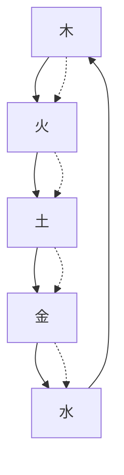
</details>

從圖中還可以看到，在五行的循環圈中，生和剋的方式是：「比相生而間相勝」。為甚麼這麼說？因為五行按其次序是：木、火、土、金、水。它們遞次相生，因此是「比相生」。而五行相剋的情況是：木剋土，中間隔火；土剋水，中間隔金；水剋火，中間隔木；火剋金，中間隔土；金剋木，中間隔水。所以就是「間相勝」了。

簡而言之，五行是由陰陽二氣化生出來的。「陰變陽合而生水、火、木、金、土。五氣順布，四時行焉。」 $^{②}$ 顯然，由氣而生成的天地萬物，是由木、火、土、金、水五行系統所組成的整體，賴五行系統之間的生剋制化，維持了自然界整體的動態平衡。

所以，「本是一氣，分而言之曰陰陽，又就陰陽中細分之則為五行。五氣即二氣，二氣即一氣」。 $^{16}$ 也就是說，一氣分陰陽，陰陽生五行，陰陽和五行都是氣的運動變化。

就這樣，氣在與陰陽、五行的縱橫聯結中，構成了「氣—陰陽—五行」的結構系統，形成了中國傳統文化獨特的認識世界的方法，體現了中華民族特有的智慧。

# 命理學：命和運

有了「氣—陰陽—五行」的認識框架，「天」就可能得到比較具體的刻畫了。也就是說，宇宙生生不息的運動過程，可以表現為具體的氣的運動。而氣的運動狀態又可以通過陰陽的消長、五行的流行來予以認識和描寫。

接着，要談到「人」。

《黃帝內經》說：「人以天地之氣生，……夫人生於地，懸命於天，天地合氣，命之曰人。」 $^{11}$ 又說：「人與天地相參也，與日月相應也。」 $^{12}$ 在我們先哲的眼裡，人，作為天地之間的一個實體，存在於天地之間，跟天地是息息相通的。天地是個大宇宙，人是一個小宇宙。

既然人是宇宙的產物，生存在宇宙中，他必然要受到自然運行規律的影響和制約。那麼，是否可以設想：從人出生時候的宇宙狀態出發，去揭示它對人的生命以及生命過程的影響呢？或者說，在人出生的時刻，當時的宇宙狀態是否就給他留下了一個獨特的「印記」呢？

經過千年時間的觀察和驗證，古代的命理探索者對此終於做出了肯定的回答。

具體來說，命理學把跟人出生時對應的宇宙狀態的片刻看作是人的先天稟賦，把它稱之為「命」。換言之，人的「命」，就是他出生當時的特定的宇宙狀態。既然出生時的宇宙狀態固結為「命」，命理學就有了十分具體的研究對象和探求的起點，它嘗試根據這個固結狀態所透露的「信息」，去揭示人先天所具有的生命特徵。

當然，宇宙的運動永不停息。它是按照本身具有的法則不間斷地朝前運動着的。於是，相對於任何一個特定的固結狀態的「命」，那個仍在不斷流變的宇宙狀態，就成了這個「命」的外部環境或後天環境。命理學把這個流變的外部環境稱之為「運」。

所以，從傳統命理學的角度來看，人的「命運」，究其根本，就是一個固結了的特定宇宙狀態，在不斷變化的宇宙狀態中的遭遇。命理學就是應用陰陽五行原理來描寫、並進而預測這樣的遭遇。

這裡談到「命運」兩個字，從上述分析可以看到，它是由「命」和「運」兩個部分組成的。

命……出生時所對應的宇宙狀態

運 命的外部環境——不斷流變的宇宙狀態

命理學 …… 以人的出生時間為依據，去描寫和預測其生命過程的學說

打個比喻，命，好比是一輛新車，它的質量規格在它出廠時已經被確定了。它出廠時的合格證書和使用手冊已經規定了它的性質和功能。運，好比是這車要行駛的路。質量好的車，又奔駛在平坦的高速公路上，它優越的性能便得到了淋漓盡致的發揮，自然風馳電掣，意氣風發；即使是質量低劣的車，在平坦的路上，至少也能持續平穩地行駛。若是開到崎嶇不平的山間小道上，高質量的車也失去了它的速度，空嘆英雄無用武之地；低質量的車，只能受盡顛簸，備嘗艱辛了。

可見「命」和「運」都很重要。命是根據，運是環境；命是內因，運是條件。命理學就是通過探討「命」和「運」的相互作用，來揭示和展現一個人豐富多彩的人生起伏軌跡。

具體來說，傳統命理學是用天干地支符號——年、月、日、時四組干支稱為「四柱」，或八個字（八字結構）即「八字」——來標記「命」，因此，傳統命理學也稱為「四柱預測學」或「八字命理學」，俗稱推「四柱」，或算「八字」。

顯然，天人合一的整體觀和「氣—陰陽—五行」的認識框架，為命理學提供了理論基石和認識手段。由於天人合一，天人交融，自然被人化了，而人則被物化了。自然充滿了生命力，而人的生命，又成了一種生動活潑的自然事物，交融在自然之中。這是八字命理學運思方面的重要特點。

# 方法論：「黑箱」理論

八字命理學是怎樣演繹的呢？

如果說傳統中醫的藏象學說是一種「不打開黑箱」研究人體系統的方法，即在不干擾人體正常生命活動的情況下，研究有關人體內部的臟腑的生理、病理及其相互關係，那麼，同樣扎根於中國古代文化沃土上的命理學，走的也是類似的探究道路。

誠如前文所說的，八字命理學是以人的出生時間為依據，去描寫和預測其生命過程的學說。那麼，它的出發點，就是建立在一個人的出生時間跟他的生命潛質、人生歷程之間的相互關係之上的。

古代的命理研究者首先假設：每個人的出生時間跟他的人生經歷之間，存在着某種聯繫。對於每一個具體的人來說，他的出生時間是確定的，他的人生過程也是可以觀察得到的。經過成年累月的觀察和驗證以後，他們發現，出生時間與其人生歷程之間的這種聯繫，不是雜亂無章、毫無規則可尋的。這種情況，可以圖示如下：

圖 1.3 對應關係  


<details>
<summary>flowchart</summary>

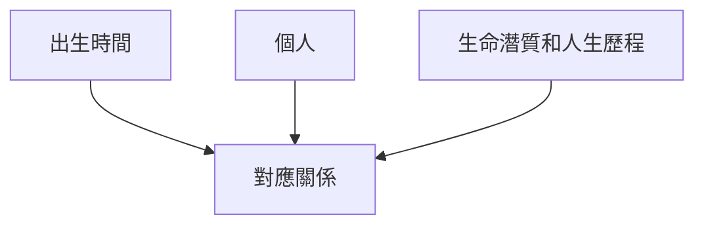
</details>

既然出生時間與人生歷程之間不是雜亂無序，而是有着某種可以觀察得到的對應關係，那麼，就可以進一步假定其背後存在着某種「機制」，而這樣的聯繫正是受着這個「機制」的制約。這個機制可以被看作是一個「黑箱」。這跟現代控制論的「黑箱理論」 $^{45}$ 頗為相似。於是，它們之間的關係可以進一步圖示如下：

圖 1.4 黑箱  


<details>
<summary>flowchart</summary>

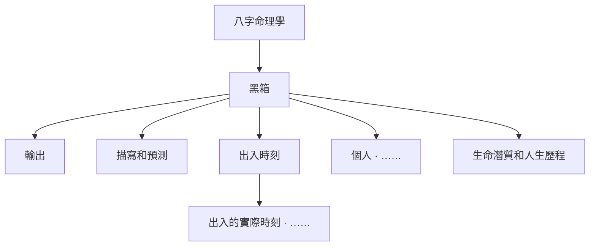
</details>

如圖所示，作為這個黑箱一端的「輸入」，是一個人的出生時間。作為黑箱另一端的「輸出」，是關於這個人的生命潛質和人生歷程的描寫和預測。關於這個黑箱內部的真實的具體結構，誰也不清楚。如果說人體的「黑箱」還有望有徹底打開的一天， $^{46}$ 那麼，這個制約人生的「黑箱」，至少到今天為止，我們對它的真實結構、內部構件，一無所知。

但是，當輸入某個人出生的年、月、日及時辰，它可以輸出關於這個人的人生歷程的某種近似的「描寫和預測」。能做出這種描寫和預測，就是這個黑箱所具備的功能。因為的確存在有觀察得到的某種對應關係存在。命理研究者就是在這種觀察到的對應關係基礎上，嘗試去揭示這個黑箱的功能，去構建或模擬它的操作系統的。前文討論的「天人合一」的觀念，以及「氣—陰陽—五行」的認識手段，為模擬這個黑箱的功能奠定了理論的基礎。

可以說，中國命理學的發展歷史，就是構建這個黑箱，使其具有描寫和預測功能的歷史。這個歷史可以追溯到兩千年前的漢代，這個歷史到今天還遠沒有結束。

# 多視角的分析

命理學，說到底，是一種對「黑箱」的探究，這就決定了它研究方法的基本特點。

物理學、化學、生物學等自然科學，它們的研究對象是具體的物質現象。這些物質現象是可以通過科學儀器測量出來的。因此，實驗室、實驗結果和邏輯推理，對它們非常重要。而命理學所面對的是一個「黑箱」，只能從功能上去「猜測」這個黑箱的機制。而且，它要描寫的範圍又太大、太寬泛，幾乎囊括了人生的各個方面。從現代科學的學科領域來講，它涉及了生理學、心理學、倫理學、社會學等諸多領域。因此，它不可能用一次性「猜謎」的追蹤，就可以完成這樣複雜的任務。或者說，它不可能通過一個觀察角度，來全面地洞察這個黑箱的全部功能。它只能依靠全方位的、從不同的角度，通過揭示這個黑箱不同方面的功能，使其能最大程度上完成描寫和預測的任務。

事實也是如此。從命理學的發展歷史來看，至少形成過以下不同的研究視角：

圖 1.5 多視角的分析  


<details>
<summary>flowchart</summary>

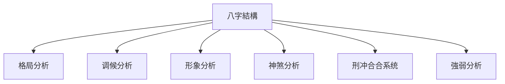
</details>

在圖中，我們羅列了一些重要的視角，比如早期出現的神煞系統、刑沖會合系統，命理學成熟時期形成的強弱分析、調候分析、格局分析、形象分析等。我們會在本書以下的章節中，逐一接觸和展現這些不同的研究視角，介紹它們具體的剖析方法。

由於命理學一直存身於俗文化中，缺乏系統的學術性研究。而江湖算命，常常良莠不齊，真假難辨。正因為如此，不少學了多年命理的人仍摸不着頭腦，常有「易學難精」的感嘆。筆者接觸命理已有四十餘年，也曾有過同樣的感受。究其原因，一個重要方面，就是陷入了不同視角探求的迷魂陣裡，分不清東南西北。常常是好像有所領悟，忽然又如墜雲霧，有失之交臂之感。

當然，出現這樣的情況，也有中國傳統學術本身存在的問題。它重視實用，而輕視理論建構；重視領悟和頓悟，而輕視客觀的理性分析，忽視概念和邏輯推理。同一個術語，比如「格局」、「用神」，常常在不同的地方有不同的含義，讓接受現代教育的人確實很難掌握。有鑒於此，在本書中，筆者將自己多年的領悟和論命經驗貢獻給讀者，以「多視角」的剖析方法來組織學習的進程。這是本書不同於前賢著作的一個重要特點。

# 一個偉大的假說

我以為，人出生的時間聯繫着他的生命信息，這是中華先人的一個偉大假說。我們古代先哲發現了這樣的聯繫，真是了不起啊！在我看來，產生這樣的假說，其意義實在不下於歷史上曾有過的中國科技的四大發明。

說到「假說」，就不能不談所謂的「科學」問題。因為假說對科學的發展往往有着極其重要的意義。

現在很多人喜歡用「科學」來責難命理研究，認為它是「迷信」，是「偽科學」。事實上，他們中的絕大多數人並不瞭解命理是如何具體運作的。況且我們頭腦中的「科學」，大多還是五四運動時候從西方請來的「賽先生」（科學）。事實上，從上世紀初到現在，西方學術界對「科學」的認識，已經發生了重大的變化。

在西方，從牛頓時代開始，科學作為獨立的領域，從哲學中分離出來。19世紀末20世紀初以物理學革命為起點，自然科學發生了革命性的變革，於是產生了對科學認識的邏輯實證主義。他們主張「證實原則」。只有屬於邏輯和純數學的命題，或者屬於可由經驗證實的命題，才屬於科學的範疇。因為只有這兩類命題，才具有「真」或「假」的特徵。

然而，邏輯實證主義的科學觀，遭到了批判理性主義者波普爾的激烈批評，他用「證偽原則」替代「證實原則」。理由其實很簡單，因為經驗上的歸納總是不完全的。

接着，六十年代出現了庫恩的科學歷史主義。這就是著名的「範式」和「科學革命」的理論。所謂「範式」，就是科學「共同體」（科學家集團）共有的信念。在理論和方法上，就是科學「共同體」共有的模型和框架。科學進步的實質是舊范式向新範式的轉換過程。因此，只有具體運用範式從事解決疑難的活動，才是科學的，否則是非科學的。而「範式」產生的原因，只能從社會心理和社會歷史中去尋找。

到了 1981 年，西方又出現了「後現代科學」這個術語。接着，出現了後現代主義的科學思潮。這是一種對「科學」的反思，結果把「科學主義」推到了受批判的位置。所謂「科學主義」，就是科學成了一種信仰。它認為科學，特別是自然科學，是人類知識中最有價值的部分，因此最具權威性。它否認了人文精神的價值，是一種「科學作用萬能論」。對「科學主義」的反思，無疑是一股令人清醒的風，讓人們從西方中心論的傳統見解中解放出來。

顯然，一個世紀以來，西方對「甚麼是科學」這個問題充滿了爭議，對它的認識在不斷地深化。現在，我們回過頭來，對照一下現存的八字理論。自然，它是歷史形成的一個龐雜的知識體系。毋庸諱言，有迷霧，有糟粕，確實沉澱了許多封建的迷信的觀念；但也應當看到，其中也洋溢着我們先人的理性探索精神。

從根本上講，從個人出生時間出發，去尋找其跟生命軌跡的相關性；在觀察和驗證的基礎上，去建立它們之間的聯繫；出生時空結構的信息，和可以觀察得到的人生「事件」之間，不是存在着某種「真」或是「假」的事實判斷嗎？這本身不就是一種科學認識的途徑嗎？

就方法論而言，它跟現代控制論的「黑箱」理論確實有異曲同工之妙。前文已經談到，作為這個「黑箱」一端的輸入，是個人的出生時間；作為「黑箱」另一端的輸出，是個人的生命潛質和人生歷程。近兩千年來傳統命理的探索，就是通過尋找輸入和輸出之間的對應關係，來構建這個「黑箱」內部的操作系統，從而使它具有描寫和預測的功能，儘管這些建構還相當粗略和不確定，描寫和預測還十分粗糙、十分模糊。

今天，社會上出現了信息「爆炸」，進入了所謂「大數據」時代。《大數據時代》的作者維克托·邁爾·舍恩伯格明確指出：大數據時代最大的轉變就是，放棄對因果關係的渴求，而取而代之關注相關關係。也就是說只要知道「是甚麼」，而不一定要弄清「為甚麼」。（事實上，「為甚麼」的認識是永無止境的。）這就顛覆了千百年來人類的思維慣例，對人類的認知和與世界交流的方式提出了全新的挑戰。

從關注「相關關係」下手，這不正是我們古人所做的嗎？而且，大數據維度大，不同組合的數據的排比能獲取更多、更精確的真相，而現代生活中的多維度的數據，恰恰可以為八字研究提供更加廣闊的論證空間。

有感於此，我在《命運的求索》（2014年）一書中寫道：

如果我們珍惜這個偉大的假說，我以為，現在正處於一個新的歷史發展的轉折點上。命理學過去近兩千年的探索和發展，可以說，是對這個偉大發現的「實證」。它已經積累了許多東西。但是，由於探索工具的局限，它無法完成這個如此艱巨複雜的任務。現在正是運用現代科學思想和科學手段，對它進行「新一輪」實證的時候了。

希望本書的讀者一起來參加這個十分有意義的「實證」，讓中國傳統文化中的這朵奇葩在新時代綻放出更加燦爛的光彩！

龜是長壽之物，古人認為牠能通神。至於蓍草，《周易·繫辭上》說：「蓍之德，圓而神。」古人以為蓍千歲生三百莖，有圓而神的美德，所以把它作為《易》筮的最為理想的運算工具。  
② 莊子（約前 369—前 286），先秦時期偉大的思想家、哲學家、文學家，道家學說的主要創始人。莊子與道家始祖老子並稱為「老莊」。  
③《莊子·知北遊》：「人之生，氣之聚也。聚者為生，生則死。臭腐複化為神奇，神奇複化為臭腐，通天下一氣耳。」  
④ （清）喻昌：《醫門法律·先哲格言》。  
⑥ 物理學中，有一種稱為希格斯玻色子的基本粒子，被稱為「上帝的粒子」。它是一種玻色子，自旋為零，不帶電荷、色荷，非常不穩定，在生成後會立刻衰變。物理學家們花費了四十多年時間尋找它。至今為止，全世界最昂貴、最複雜的實驗設施之一，大型強子對撞機（LHC），其建成的主要目的之一就是尋找與觀察希格斯玻色子與其他種粒子。2013年3月14日，歐洲核子研究組織正式宣布，已探測到的新粒子暫時確認是希格斯玻色子，具有零自旋與偶宇稱，這是希格斯玻色子應該具有的兩種基本性質。但有一部分實驗結果不盡符合理論預測，更多數據仍舊等待處理與分析。  
⑥（宋）張載：《正蒙·參兩》。  
⑦ （宋）李覯：《刪定易圖序論一》。  
⑧ 見於先秦早期文獻《洪範》。  
⑨ （清）李光地等輯：《御纂性理精義·卷一》。  
⑩ （元）吳澄：《吳文正公集·答人問性理》。  
⑪《素問·寶命全形論》。  
⑫《靈樞·歲露》。

「黑箱理論」是一種科學方法。它認為有機體的內部，特別是大腦的機制無法直接研究，如同一個黑箱子，只能從外部進行觀察和實驗來推測其功能及特性，並依據考察的結果，建立與研究對象假定相似的模型，以作進一步闡明黑箱的手段。  
自科學從物理科學發展到生物科學後，由於與行為、心理有關的神經過程特別難於瞭解，於是科學研究採取了只研究刺激－反應之間的關係而不管有機體內部的有關結構和功能，並且與控制論、系統論等現代理論聯繫起來，產生了現代黑箱理論。1945年，控制論創始人N.維納提出了「封閉盒」概念及其研究途徑。1948年，W.R.阿什比提出了黑箱概念，他說的黑箱就是維納所說的封閉盒。

14 至少到目前為止，中醫揭示的人體經絡系統依舊在「黑箱」之內。

# ▼ 第二章

# 干支符號

既然我們說「命」是人出生時所對應的宇宙狀態，那麼，如何來標記這個狀態呢？如何來具體刻畫這個特定的氣運片段的陰陽五行內涵呢？這是研究的起點。八字命理學採用的是干支符號系統。

# 曆法：天干地支

「干支」是天干和地支的簡稱，相傳是四千六百餘年前黃帝時代的大撓氏所創。天干最初是用來紀日的。古人以日出、日沒為一天，用一個天干來標記；一句或十天，正好是十個天干，按序為：甲、乙、丙、丁、戊、己、庚、辛、壬、癸。

地支，最初是用來紀月的。每一個月是用月亮的盈虧來計算。月亮盈虧一次，就是一個月。地支有十二個，古時也稱十二辰，按序為：子、丑、寅、卯、辰、巳、午、未、申、酉、戌、亥。

天干 甲、乙、丙、丁、戊、己、庚、辛、壬、癸

地支 子、丑、寅、卯、辰、巳、午、未、申、酉、戌、亥

於是，十二個地支正好跟一年十二個月相配：正月建寅，卯為二月，辰為三月，巳為四月，午為五月，未為六月，申為七月，酉為八月，戌為九月，亥為十月，子為十一月，丑為十二月。

十二個地支按序起於子，為甚麼正月卻記為寅呢？這是因為較早的周朝的曆法據說是以十一月（子）為歲首的。 $^{①}$ 定正月（寅）為一年之初，是從漢武帝太初元年（公元前104年）開始的。從陰陽屬性上看，日為陽，月為陰，陽為天，陰為地，故有「天」干、「地」支之稱。

然而，單憑十個天干來紀日，則每個月可能有三個天干相同的日子，這就不易辨別了。於是，就用一個天干和一個地支，按次序搭配起來的辦法來紀日期。這就產生了「干支紀日法」，也叫「甲子紀日法」。十天干和十二地支的最小公倍數是六十。按序組合的一次循環，即從甲子開始，至癸亥終了，天干循環六次，地支循環五次，共有六十個干支組合，稱為「六十甲子」或「花甲子」：②

表 2.1 六十甲子表

<table><tr><td>甲子</td><td>乙丑</td><td>丙寅</td><td>丁卯</td><td>戊辰</td><td>己巳</td><td>庚午</td><td>辛未</td><td>壬申</td><td>癸酉</td></tr><tr><td>甲戌</td><td>乙亥</td><td>丙子</td><td>丁丑</td><td>戊寅</td><td>己卯</td><td>庚辰</td><td>辛巳</td><td>壬午</td><td>癸未</td></tr><tr><td>甲申</td><td>乙酉</td><td>丙戌</td><td>丁亥</td><td>戊子</td><td>己丑</td><td>庚寅</td><td>辛卯</td><td>壬辰</td><td>癸巳</td></tr><tr><td>甲午</td><td>乙未</td><td>丙申</td><td>丁酉</td><td>戊戌</td><td>己亥</td><td>庚子</td><td>辛丑</td><td>壬寅</td><td>癸卯</td></tr><tr><td>甲辰</td><td>乙巳</td><td>丙午</td><td>丁未</td><td>戊申</td><td>己酉</td><td>庚戌</td><td>辛亥</td><td>壬子</td><td>癸丑</td></tr><tr><td>甲寅</td><td>乙卯</td><td>丙辰</td><td>丁巳</td><td>戊午</td><td>己未</td><td>庚申</td><td>辛酉</td><td>壬戌</td><td>癸亥</td></tr></table>

在中國曆法史上，用干支紀日出現得最早。根據現存文獻資料，連續的干支紀日，至少從春秋時魯隱公三年（公元前722年）二月己巳日起，一直到清代宣統三年（1911年）為止，計有二千六百多年的歷史。這是世界上迄今所知最長的紀日文字記載。

至於曆法用干支紀月和紀時，都始於漢武帝太初元年（公元前104年）。上文已經提到，漢武帝太初元年首創太初曆，用夏正，以建寅月——正月為歲首，用干支紀月。同時，也用干支紀時。至於干支符號全部正式進入官方曆法，則始於東漢章帝元和二年（公元85年），並一直連續至今，沒有間斷。

# 干支符號模型

如果天干、地支如同 1、2、3、4 那樣，僅是一個個數字的文字表述，那麼，即使用干支符號來記錄年、月、日、時，也只能表述前後相續的時間序列，並不能通過它們來瞭解「氣運」在時間序列上的變化狀態。事實並非如此。因為天干、地支還具有陰陽和五行的內涵，這對氣的運行狀態做出描寫，開啟了門戶。

從歷史上看，最遲到漢代，天干地支已經完全匯融於陰陽五行體系中了。那時，干支排列的先後次序具有重要的意義。它已包含了陰陽二氣的消長轉化，包含了萬物由萌生而少壯、而繁茂、而衰老、而死亡，而更始的整個運演過程。對於干支序列所表示的這類意象，《史記·律書》、《漢書·曆律志》都曾作過較詳盡的描寫。就這樣，作為曆法符號的干支已儼然成了陰陽五行的具體代號，無怪乎不少前賢誤以為干支打從開頭起就是跟着五行來的。②

干支符號系統跟陰陽五行的融合，形成了干支符號模型。這個模型的基本內容可以表述為（以下「+」表示陽；「-」表示陰）：

表 2.2 干支符號模型

<table><tr><td>天干</td><td>甲</td><td>乙</td><td>丙</td><td>丁</td><td>戊</td><td>己</td><td>庚</td><td>辛</td><td>壬</td><td>癸</td></tr><tr><td>陰陽</td><td>+</td><td>-</td><td>+</td><td>-</td><td>+</td><td>-</td><td>+</td><td>-</td><td>+</td><td>-</td></tr><tr><td>五行</td><td colspan="2">木</td><td colspan="2">火</td><td colspan="2">土</td><td colspan="2">金</td><td colspan="2">水</td></tr><tr><td>方位</td><td colspan="2">東</td><td colspan="2">南</td><td colspan="2">中</td><td colspan="2">西</td><td colspan="2">北</td></tr></table>

<table><tr><td>地支</td><td>寅</td><td>卯</td><td>辰</td><td>巳</td><td>午</td><td>未</td><td>申</td><td>酉</td><td>戌</td><td>亥</td><td>子</td><td>丑</td></tr><tr><td>陰陽</td><td>+</td><td>-</td><td>+</td><td>-</td><td>+</td><td>-</td><td>+</td><td>-</td><td>+</td><td>-</td><td>+</td><td>-</td></tr><tr><td>五行</td><td colspan="2">木</td><td>土</td><td colspan="2">火</td><td>土</td><td colspan="2">金</td><td>土</td><td colspan="2">水</td><td>土</td></tr><tr><td>方位</td><td colspan="3">東</td><td colspan="3">南</td><td colspan="3">西</td><td colspan="3">北</td></tr><tr><td>四時</td><td colspan="3">春</td><td colspan="3">夏</td><td colspan="3">秋</td><td colspan="3">冬</td></tr><tr><td>月份</td><td>正</td><td>二</td><td>三</td><td>四</td><td>五</td><td>六</td><td>七</td><td>八</td><td>九</td><td>十</td><td>十一</td><td>十二</td></tr></table>

比如，天干「甲」，陰陽屬性為「陽」，五行屬「木」，方位為東方；天干「乙」，陰陽屬性為「陰」，五行屬「木」，方位也是東方。天干「丙」，陰陽屬性為「陽」，五行屬「火」，方位則為南方。再如，地支「寅」，陰陽屬性為「陽」，五行屬「木」，方位為東方，四季屬春，為正月。其餘的干支都可以這樣來讀取。

這個模型不僅有時間的信息，同時也容納了空間（方位）的內容。 $^{④}$ 它的出現，使陰陽五行理論公式化了。

天干地支符號原先就有標記時間的功能，現在蘊涵了陰陽五行的信息，這樣，宇宙間在時間序列上出現的氣的運行變化狀態，就可以通過干支符號排列所具有的陰陽五行的內涵而顯露出來了。

# 氣的運行片段的表述

如何用干支來標記一個具體時間片段的氣的運行狀態呢？

就一般情況講，時間本身是直線流逝的（見圖2.1中a）。然而棲息在黃河流域的我們的先人，觀察到它的節律性：一日有晝夜晨昏的周期變化；一月（指農曆月）有月亮盈虧的周期變化；一年有春夏秋冬四季、二十四節氣的周期變化。正是這種循環往復的周期性特徵，或周期性節律（圖2.1中的b），原本線性的序列，便構成了周而復始的回環（圖2.1中的c）。

圖 2.1 時間序列的表述  


<details>
<summary>flowchart</summary>

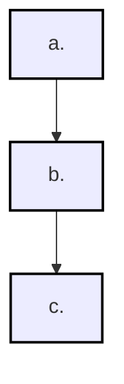
</details>

同時，不同的周期節律的存在，使這圓周形的回環又表現出了某種層級性來：比如時辰、日子、節氣、季節、周年等。

圖 2.2 時間序列的層級性：日（a）和年（b）  


<details>
<summary>text_image</summary>

(a)
中午
早晨
黄昏
半夜
(b)
立夏
春
立春
冬
立秋
秋
立冬
</details>

這就構成了時間序列上的環環相套的層級性結構來。正是順應這樣的特徵，古人就可以採用由天干、地支共22個符號組成的六十甲子干支集來標記時間的序列。比如，在年段層次上，它可以表現以60年為一個循環周期的節律；在月段層次上，它可以表現以60個月為一個循環周期的節律；在日段層次上，它可以表現以60天為一個循環周期的節律；在時段或時辰段（2個小時）的層次上，它又可以表現以60個時辰為一個循環周期的節律。

如果把六十甲子看作一個時間的車輪，那麼，把四個這樣的車輪組合起來，就能表現出跨度為60年的年、月、日、時辰不同層次上的周期性的變化：

圖 2.3 時間序列的層級性：60 年周期循環  


<details>
<summary>text_image</summary>

60年
60月
60日
60時辰
</details>

顯然，若以一個時辰為一個時間片段單位的話，則每一個這樣的單位都可以有一個與之相對應的干支符號結構。這個包含了年干支、月干支、日干支和時干支的組合，正是傳統命理學中的一個八字結構。

# 如何排八字？

那麼，如何來排出某一個確定時段的八字結構來？

比如，今年（2016年）2月6日早晨10點。我們知道，這個時段的干支結構是：

年——丙申

月——庚寅

日——戊午

時——丁巳

按照傳統習慣的的標記方法，我們把干支寫作以下豎式的形式：

<table><tr><td></td><td>年</td><td>月</td><td>日</td><td>時</td></tr><tr><td>天干</td><td>丙</td><td>庚</td><td>戊</td><td>丁</td></tr><tr><td>地支</td><td>申</td><td>寅</td><td>午</td><td>巳</td></tr></table>

那麼，這個八字結構是如何排出來的呢？也就是，如何從年、到月、到日、到時辰，找出它們的天干地支來？

# （1）從年開始：年干支

最簡單的方法是查中西對照萬年曆。具體時刻的年干支，可以從萬年曆上查到。但要注意，命理學上排八字（或稱四柱）所依據的是太陽曆。

歷史上使用過的曆法，有陽曆、陰曆和陰陽合曆。陽曆，即太陽曆，是根據太陽運行規律制定。陰曆呢？是按月亮的盈虧變化來制定的。由於一個朔望月的周期是29或30天，這樣，年的長短只是月的整倍數，與回歸年無關。陰陽合曆，則是結合太陽和月亮運行的周期制定的。 $^{②}$

中國傳統曆法的編製是陰陽合曆。所以要注意，命理上的「年」不是始於曆書上的春節——陰曆正月初一。它是以二十四節氣中的「立春」日時為一年的交割之點。比如，今年春節（正月初一）是公曆2016年2月8日；而立春是2月4日17點47分（酉時）。那麼，今年2月6日早晨10點出生的嬰兒，雖然尚未過春節（2月8日），但這個時刻的年干支已經是：丙申。因為它已經過了今年——丙申年的立春了。

# (2) 月干支

同樣，月干支也要參照二十四節氣。二十四節氣，是根據太陽在黃道上的位置（黃經），將全年劃分而成的二十四個段落。每一個段落就是一個節氣。以節氣開頭的那一天為節名。每月的月首稱為「節」，月中則稱為「中」。這樣，二十四節氣，其中十二個稱「節」氣；十二個稱「中」氣，可以列表如下：

表 2.3 二十四節氣表

<table><tr><td>季節</td><td colspan="3">春</td><td colspan="3">夏</td><td colspan="3">秋</td><td colspan="3">冬</td></tr><tr><td>月份</td><td>一</td><td>二</td><td>三</td><td>四</td><td>五</td><td>六</td><td>七</td><td>八</td><td>九</td><td>十</td><td>十一</td><td>十二</td></tr><tr><td>節氣</td><td>立春</td><td>驚蟄</td><td>清明</td><td>立夏</td><td>芒種</td><td>小暑</td><td>立秋</td><td>白露</td><td>寒露</td><td>立冬</td><td>大雪</td><td>小寒</td></tr><tr><td>中氣</td><td>雨水</td><td>春分</td><td>穀雨</td><td>小滿</td><td>夏至</td><td>大暑</td><td>處暑</td><td>秋分</td><td>霜降</td><td>小雪</td><td>冬至</td><td>大寒</td></tr></table>

命理上的月份就是用以上的十二個「節」氣來分割的。

這樣，今年2月6日10時出生的嬰兒，正處於從立春到驚蟄之間，就應算作是丙申年正月，所以月支為寅。

至於此月的天干是甚麼？可以通過年干和月支推算出來，用的是「五虎遁年起月訣」：

甲己之年丙作首，乙庚之歲戊為頭。

丙辛歲首尋庚起，丁壬壬位順行流。

若言戊癸何方發，甲寅之上好追求。

這是說，年天干為丙或辛的，「丙辛歲首尋庚起」，就是從庚寅月起推算，即：正月庚寅、二月辛卯、三月壬辰，這樣往下推。現列表如下：

表 2.4 五虎遁月表

<table><tr><td>月\年</td><td>甲己</td><td>乙庚</td><td>丙辛</td><td>丁壬</td><td>戊癸</td></tr><tr><td>寅一</td><td>丙寅</td><td>戊寅</td><td>庚寅</td><td>壬寅</td><td>甲寅</td></tr><tr><td>卯二</td><td>丁卯</td><td>己卯</td><td>辛卯</td><td>癸卯</td><td>乙卯</td></tr><tr><td>辰三</td><td>戊辰</td><td>庚辰</td><td>壬辰</td><td>甲辰</td><td>丙辰</td></tr><tr><td>巳四</td><td>己巳</td><td>辛巳</td><td>癸巳</td><td>乙巳</td><td>丁巳</td></tr><tr><td>午五</td><td>庚午</td><td>壬午</td><td>甲午</td><td>丙午</td><td>戊午</td></tr><tr><td>未六</td><td>辛未</td><td>癸未</td><td>乙未</td><td>丁未</td><td>己未</td></tr><tr><td>申七</td><td>壬申</td><td>甲申</td><td>丙申</td><td>戊申</td><td>庚申</td></tr><tr><td>酉八</td><td>癸酉</td><td>乙酉</td><td>丁酉</td><td>己酉</td><td>辛酉</td></tr><tr><td>戌九</td><td>甲戌</td><td>丙戌</td><td>戊戌</td><td>庚戌</td><td>壬戌</td></tr><tr><td>亥十</td><td>乙亥</td><td>丁亥</td><td>己亥</td><td>辛亥</td><td>癸亥</td></tr><tr><td>子十一</td><td>丙子</td><td>戊子</td><td>庚子</td><td>壬子</td><td>甲子</td></tr><tr><td>丑十二</td><td>丁丑</td><td>己丑</td><td>辛丑</td><td>癸丑</td><td>乙丑</td></tr></table>

顯然，從表中也能查到，2016年2月6日的月干支是：庚寅。

# (3) 日干支

接下來是日干支。從萬年曆中可以查到，此日干支是：戊午。

# (4) 時干支

最後是時辰。古代的子時，是從晚上11點開始，到第二天凌晨1點為止。因此，它被分割為兩個部分， $^{⑥}$ 即今晚的夜子時和明日凌晨的早子時。這樣，就一天（24小時）而言，從凌晨早子時開始，到夜半夜子時結束，就經歷了13個時段。下面是時辰換算表：

表 2.5 時辰換算表

<table><tr><td>早子</td><td>凌晨</td><td>0:00 - 1:00</td></tr><tr><td>丑</td><td rowspan="5">上午</td><td>1:00 - 3:00</td></tr><tr><td>寅</td><td>3:00 - 5:00</td></tr><tr><td>卯</td><td>5:00 - 7:00</td></tr><tr><td>辰</td><td>7:00 - 9:00</td></tr><tr><td>巳</td><td>9:00 - 11:00</td></tr><tr><td>午</td><td>中午</td><td>11:00 - 1:00</td></tr><tr><td>未</td><td rowspan="5">下午</td><td>1:00 - 3:00</td></tr><tr><td>申</td><td>3:00 - 5:00</td></tr><tr><td>酉</td><td>5:00 - 7:00</td></tr><tr><td>戌</td><td>7:00 - 9:00</td></tr><tr><td>亥</td><td>9:00 - 11:00</td></tr><tr><td>晚子</td><td>半夜</td><td>11:00 - 12:00</td></tr></table>

表 2.6 五鼠遁日表

<table><tr><td>時辰\日干</td><td>甲己</td><td>乙庚</td><td>丙辛</td><td>丁壬</td><td>戊癸</td></tr><tr><td>早子</td><td>甲子</td><td>丙子</td><td>戊子</td><td>庚子</td><td>壬子</td></tr><tr><td>丑</td><td>乙丑</td><td>丁丑</td><td>己丑</td><td>辛丑</td><td>癸丑</td></tr><tr><td>寅</td><td>丙寅</td><td>戊寅</td><td>庚寅</td><td>壬寅</td><td>甲寅</td></tr><tr><td>卯</td><td>丁卯</td><td>己卯</td><td>辛卯</td><td>癸卯</td><td>乙卯</td></tr><tr><td>辰</td><td>戊辰</td><td>庚辰</td><td>壬辰</td><td>甲辰</td><td>丙辰</td></tr><tr><td>巳</td><td>己巳</td><td>辛巳</td><td>癸巳</td><td>乙巳</td><td>丁巳</td></tr><tr><td>午</td><td>庚午</td><td>壬午</td><td>甲午</td><td>丙午</td><td>戊午</td></tr><tr><td>未</td><td>辛未</td><td>癸未</td><td>乙未</td><td>丁未</td><td>己未</td></tr><tr><td>申</td><td>壬申</td><td>甲申</td><td>丙申</td><td>戊申</td><td>庚申</td></tr><tr><td>酉</td><td>癸酉</td><td>乙酉</td><td>丁酉</td><td>己酉</td><td>辛酉</td></tr><tr><td>戌</td><td>甲戌</td><td>丙戌</td><td>戊戌</td><td>庚戌</td><td>壬戌</td></tr><tr><td>亥</td><td>乙亥</td><td>丁亥</td><td>己亥</td><td>辛亥</td><td>癸亥</td></tr><tr><td>晚子</td><td>丙子</td><td>戊子</td><td>庚子</td><td>壬子</td><td>甲子</td></tr></table>

前述上午 10 時屬於巳時。巳為時支，那麼，它的天干是甚麼呢？這可以由日柱的天干推算出來，用的是「五鼠遁日訣」：

甲己還生甲，乙庚丙作初。

丙辛從戊起，丁壬庚子居。

戊癸何方發？壬子是真途。

這是說，日柱天干若為戊或癸的：「戊癸何方發？壬子是真途。」即子時為壬子。接着只要順序下推，丑時為癸丑、寅時為甲寅……就這樣往下推，巳時則為丁巳。見前頁表2.6。

這樣，戊午日上午10點，時辰干支則為：丁巳。

於是，把年、月、日、時干支放到一起，按序排列，標記2016年2月6日上午9時到11時（巳時）的四柱干支結構就是：

<table><tr><td>年</td><td>月</td><td>日</td><td>時</td></tr><tr><td>丙</td><td>庚</td><td>戊</td><td>丁</td></tr><tr><td>申</td><td>寅</td><td>午</td><td>巳</td></tr></table>

這也是2016年2月6日上午10時出生的嬰兒的「八字」：丙申年，庚寅月，戊午日，丁巳時。

目前互聯網上有不少四柱八字線上排盤系統可供免費使用。過去江湖盲人算命師的「絕活」，現在只要按幾個鍵，霎時間就完成了。這為排八字提供了極大方便。 $^{②}$

# 八字：時空結構

於是，每一個由八字表述的時空結構，都刻畫了一個相對獨立的氣的運動狀態的片斷。根據以上干支符號模型（表 2.2），這個八字結構——丙申、庚寅、戊午、丁巳，就可以轉換或「翻譯」成為一個具有「陰陽五行」內涵的結構：

圖 2.4 八字的陰陽五行內涵  


<details>
<summary>text_image</summary>

年 月 日 時
丙 庚 戊 丁
申 寅 午 已
陰陽五行結構
+ 火 + 金 + 土 - 火
+ 金 + 木 + 火 - 火
</details>

顯然，標記這個時段的八字結構，它蘊含的陰陽五行內容，簡單的說，它由8個成分——2個陽火、2個陰火、2個陽金、1個陽土和1個陽木——所組成。它正是這個時間片段內宇宙間氣的運行狀態的寫照。

那麼，總共有多少個這樣的時空結構呢？我們知道，天干是十進制，地支是十二進制，干支組合是六十進制。明白了這些，是不難推算出一共有多少個具有如此形式的時空結構來的 $^{③}$ ：

<table><tr><td>年</td><td colspan="2">月</td><td colspan="2">日</td><td colspan="2">時</td><td></td></tr><tr><td>60</td><td>X</td><td>12</td><td>X</td><td>60</td><td>X</td><td colspan="2">13 = 561,600</td></tr></table>

於是，宇宙間氣的消長變化，就可以用56萬多個不同的時空結構組成的一個具有60年跨度的大循環圈，把它們標記出來。我們剛才所標記的時段（2016年2月8日上午巳時：丙申、庚寅、戊午、丁巳），僅僅是這56萬多個時空結構中的一個。這是多麼了不起的構想啊！


<details>
<summary>text_image</summary>

圖 2.5 氣的圓周運動
年 月 日 時
丙 庚 戊 丁
申 寅 午 巳
氣的圓周運動
共 561,600 結構
</details>

2016年2月6日巳時

有了干支符號系統，人出生時的氣的運行狀態，就可以得到形式上的刻畫了。每一個用干支符號所組成的八字結構，都標記了人的出生時宇宙氣運動的真實狀況。至此，應用干支符號作為描寫和推理的工具，傳統命理學作業的條件就具備了。

# 出生時間是確定的

前文已經談到，八字命理學是中國古代在「天人合一」的宇宙觀的基礎上，發展起來的以一個人的出生時辰為依據，去描寫和預測他（或她）的命運的學說。

這裡要重複指出，一個人的出生時間是確定的，是不可改變的客觀事實。雖然看上去，在眾多的先天的、後天的影響人生過程的因素中，它並非一定是一個十分重要的因素。現代很多人，並不記得自己的具體出生時辰（主要指出生的時刻）。然而，我們的古人卻正是從這裡出發，去解讀這個人生的「基因」的。這裡實在沒有半點兒神秘的氣息！

《氣的樂章》一書指出：「嬰兒的出生是母親與嬰兒共同的努力，但決定嬰兒出生的第一道指令是由嬰兒發出的。所以出生的日子與時間與嬰兒本身的生物周期有關，也就是與嬰兒的性向有關。因而更讓我相信生辰八字與人的性向，還是有關聯性的。」這個發現的確很有意思。

同樣，我們知道，嬰兒的肺部功能是出生後才發揮作用的。隨着嬰兒的第一聲啼哭，肺才打開，肺的氣泡才膨脹起來，開始交換氧氣。可以說，正是這一瞬間，天地之「氣」，給新生的嬰兒留下了一個永久「印記」。這個印記就是天地之氣在這個特定時間片段上運行的一個特定狀態。對這個特定狀態的摹寫，不正是這個新生兒的「八字」嗎？

從根本上來講，八字命理學是從個人出生的時間出發，去尋找和刻畫它與人生歷程之間的對應關係。而這種關係的揭示，我認為，只能是統計學意義上的描寫，即在概率上體現出來的相關性。應當指出，統計相關性本身並不保證或者反映因果聯結。

許多責難命理學的人，他們並沒有研究過這門學問，但卻要求命理作出的預測必須是百分之百的精準，不然就是「迷信」。其實，即使在自然科學的領域中，都存在着「測不準原理」 $^{39}$ 。而影響人的生命過程中的「變量」實在太多了：有家庭環境、教育環境、地理環境、文化環境，更有社會的政治、經濟制度等方面的原因。它擁有的領域，實在該是多個現代學科的研究任務。因此，在人的出生時間跟其生命過程中所呈現出來的某些特徵之間，若確實存在着某種對應關係的話，那它發生的幾率自然會遠遠低於自然科學中的「規律」。期待命理學的描寫和預測能百發百中、精確無誤，這要不是設攤算命者招徠生意的商業旗號，那就是無知者的痴人說夢了。哪個算命先生說，他是「神算」，預測能精確無誤，這就像一個江湖郎中，說他的祖傳「秘方」能包治百病，這絕對是謊言。

世界上有不少同年、同月、同日、同時出生的人，他們的命運難道會完全相同嗎？——這是最常見的人們對八字論命的詰問。其實，四百多年前，命理巨著《三命通會》的作者萬民英（育吾）就沒有回避這樣的詰難。他不僅實事求是地回答說，的確有差別；而且還收集了大量的案例來加以比較。顯然這位命理巨匠對命理推算所持的態度是十分客觀的！

正是有感於此，台灣梁湘潤先生在《命略本紀》中說：「我們現在有誰肯像萬育吾一樣，如此誠懇，說出祿命不一定『準』的良心話呢？……想必大家都知道，命理本來不是百分之一百準確的。說成如何神奇……乃是違心及欺人之談，命理大約只有百分之六、七十的或然律而已！」 $^{①}$ 當然，就是這百分之六、七十的幾率，我們還得用取樣統計的方法來加以驗證。同時，筆者也真誠地希望讀者從自己的實踐中去取得大致可信的預測成功的概率來。

# 模糊集

上世紀六十年代後，現代數學中出現了一個新的分支——模糊數學。它是研究現實世界中許多界限不分明甚至是很模糊的問題的數學工具。它在模式識別、人工智能等方面有廣泛的應用。事實上，命理學的描寫也是模糊的。為甚麼呢？這可以從兩個主要方面來看：

首先，宇宙的變化運動是無限的。但是，在我們的先人——這些生活在農業社會裡的探索者眼裡，這種變化運動是以周而復始的圓周運動形式進行的。天地、日月、四時、晝夜……無不按部就班似的做着各自的循環運動。一切生物和人事，都在循環運動中得以生化、發展，最終走完自己的歷程。對於這種周而復始的圓周運動，我們的先哲稱之為「圜道」 $^{19}$ 。傳統命理學在對氣的描寫上，顯然是以這種圜道觀為基礎的。然而，圜道觀有它的缺陷和局限。它把事物的運動局限在一個封閉的循環圈內。於是，事物發展的結果只能是重新回到了它原先的出發點。就像八字命理學所做的，用56萬多個四柱結構組成的一個具有60年跨度的大循環圈，去重複地刻畫天地間氣的運行狀況。這當然不可能完全符合客觀事物發展的真實情況。

但是，我們想一想，要在千差萬別的事物變化中，尋找變化的規律性，尋找發展的相對穩定的關係，圜道的觀念還是很有幫助的。因為只有在相對穩定的狀態中，才能揭示事物的相互關係和它們的本質特徵。只有充分研究了「常」（常態），才有可能進一步揭示「變」（變化）。傳統命理學正是通過對氣的運行做出這樣的圜道式的功能描寫，打開了通向個人命運研究的門戶。

這裡提到，刻畫宇宙狀態的八字結構有56萬多個。其實，用八字命理學的方法，在具體推算一個人的命運時，男命的大運走向跟女命的大運是不同的。它們正好處於相反的順序。 $^{15}$ 因此，如果要問：總共有多少個命局？八字結構總數（561,600）還需要再乘以2，總共可得1,123,200個男女命局。如果再考慮到節氣的差異（它會影響大運的起始點），那就多不勝數了。

現代人喜歡用血型來討論人的性格，血型才4種。有人喜歡用生肖來描寫性格，生肖才12種。西方人喜歡用星座來討論命運，星座共12個。中國古代還有一種推命術，叫紫微斗數，有12宮，30多顆常用星，144個基本盤。這些跟八字命理學要描寫的這至少有112萬餘個的命局數來說，真可謂是小巫見大巫了。

這 112 萬多個的數的命局，跟八字命理學草創時期的中國實際人口數相比，還是相當可觀的。根據歷代文獻記載，在清代之前，中國人口數「可以說始終沒有突破 7,000 萬。」 $^{①}$ 中國人口數量規模出現突破性的增長，是在清代乾嘉時期。然而，在唐、宋時代，或者還早些，我們的先人居然能設想出 112 萬餘個的命局，去描寫當時中原地區具有的人口數，不能不說是一種極高的智慧的表現。任何具體領域的研究，總需要有一個抽象的過程。天底下沒有兩朵花是長得完全一模一樣的。植物學家的研究，不也是根據一定的分類方法去歸類，比如用「種－屬－科－目－綱－門」的方法，來確定具體某一朵花的歸屬，從而刻畫它在某個層次上的「類」的性質。命理學的描寫自然也不例外，它也只是屬於「類」的描寫，其描寫的結果只是一個關於個人生命特徵和人生軌跡的模糊集。對於這一點，研究者必須要有十分明確的認識。當然，面對今天這樣龐大的人口數目以及遠比古代廣闊的地域，以每兩個小時為一個時段（時辰）單位，就顯得很不精細了。這是傳統命理學本身發展所面臨的挑戰。

其次，我們的先人主要是從時間序列上去刻畫宇宙生生不息的運動過程的，並沒有充分表現出空間因素的作用。比如上面討論的八字結構，主要是從時間序列上對宇宙運動狀態片段的複製，並沒有充分刻畫空間分布上的差異性。這種描寫方式的局限性，是顯而易見的。這跟我們東方民族重視時間序列、擅長用時間序列去統攝空間的傳統思維方式是一致的。

為甚麼我們的先人會把一個人的出生時間作為探求他的人生的一個信息點呢？他們又是怎麼發現這個信息點的呢？——這始終是一個謎。因為我們已無法去追問那些最早的探索者了。或許它是來源於農業生產中的一條極普通的經驗：不同時節播下的種子，會產生不同的生長結果。就這麼簡單。因為對於中國古代一個世代務農、不曾離開過家鄉的農民來說，此時環境的因素（指具體的地貌、氣候類型等）是凝固（相對穩定）的，而時節則是流動（變化）的。或者說，空間是已知的，而時間是變化的。抓住了時節，不就抓住了矛盾的主要方面？當然，這又是我的猜想。

# 生命的藍圖

現代生物學對基因（指攜帶有遺傳信息的 DNA 序列）的研究表明，人類約有兩萬或兩萬五千個基因。人的基因是遺傳的，當然屬先天的範疇。但它也會影響到人出生以後體質上的健康和疾病，甚至心理上的某些趨向。我們可以把反映人出生時的宇宙狀態的八字結構看作是另一種「基因」——時空基因。它同樣具有某種先天的信息，它也會影響到人的後天發展。

關於人體基因，《人體革命》的作者寫道：

現代科學用雄辯的事實告訴我們：生命的藍圖是存在的，而每個人的生命藍圖正是貯存在你的基因（DNA）裡。 $^{15}$

接着，他又說：

那麼，肯定「生命的藍圖在你的基因裡」，是否會助長「命中注定」之類的宿命論呢？一般說來是不會的。我們在這裡講的意思是：基因決定了生命的藍圖，並不完全決定生命的一切。生命是一個有機體，它可以改造，可以發展。藍圖是藍圖，並不等於現實。藍圖不夠理想的人，可改造藍圖。藍圖較好的人，還可以進一步繪製更完善的藍圖。這就是人的主觀能動性。 $^{10}$

我認為，這樣的認識同樣適合於嚴肅的八字命理學的研究。

① 相傳夏曆正月建寅，商曆正月建丑，周曆正月建子。  
② 為甚麼是 60 個干支，而不是 120 個？因為它們是按序搭配的。單數是陽，雙數是陰，天干單數與地支單數相配，天干雙數與地支雙數相配，這樣按序相配，故只有六十組。  
③ 比如，隋朝蕭吉在《五行大義》裡就說「支干者，因五行而立之」。  
④ 這裡表現出中國古代自然觀以時間統攝空間的特徵。  
即：一年按太陽的運行分為二十四節氣，又按照月亮的運行分為月。小月、大月十二個加起來，只有354天或355天。兩者相比，相差約11天。為了協調二者，於是採取「設閭」的辦法來處置，若干年中就有一年是十三個月的。  
⑥ 在舊有的說法中，子時分為「子初」和「子正」。子初指23-24時；子正指0-1時。而0時正是一日的分界線。  
比如「國際易經網」（www.iqing.net）就有這樣的免費使用的排八字系統。只要輸入年、月、日、時，就可以得到一個排好的八字結構。「易客頻道」的元亨利貞網也有四柱八字在線排盤系統（www.china95.net/paipan/bazi/）。但要注意，不少網站的程式並沒有「夜子時」的推算，它們把晚上11時以後歸併到了第二天的凌晨子時。這樣，晚上11點就成了每一日的分界點了。這不符合筆者的看法。  
⑧ 作為年干支，60 甲子一個循環，正好 60 年；作為月干支，每年 12 個月有 12 個不同的標記月份的干支，每 5 年循環一次；日干支，也是 60 甲子一個循環，即每 60 天循環一次；時干支，每日有 13 個時段，故有 13 個標記時辰的干支。  
9 王唯工：《氣的樂章》（中國人民大學出版社，2006年），第193頁。  
測不準關係是量子力學中的核心概念。這是由德國物理學家海森堡在1925年提出來的。這個著名的「測不準原理」是說，想依據波動和粒子雙重特性來建立量子論，必定出現不能逾越的極限，因為任何粒子都不能同時正確決定其位置與運動量。換言之，測量一電子或任何別的量子粒子的位置，就會擾亂它的動量；而測量它的動量，又會擾亂它的位置。因此，你絕對不可能同時得知粒子的動量和位置。這不是屬於測定技術的問題，而是自然的制約。

梁湘潤：《命略本紀》（上）（中國哲學文化協進會，2000年），第108頁。  
12 圈道觀最早的論述，見於《呂氏春秋》的「圜道篇」。  
法則是：如果出生之年的年干支在陰陽屬性上是屬陽的，男命大運順着推，女命則逆着推。如果出生之年的年干支是屬陰的，則相反，男命逆推；女命順推。  
14 袁祖亮：《中國古代人口史專題研究》（中州古籍出版社，1994年），第37頁。  
15 吳柏林：《人體革命》（上海人民出版社，2000年），第79頁。  
16 吳柏林：《人體革命》，第82-83頁。


<details>
<summary>natural_image</summary>

Abstract diagram with concentric and curved dotted lines forming a spiral or vortex pattern (no text or symbols)
</details>

# ▼第三章 結構分析（一）

# 五行與強弱

一個人的八字結構，是他出生時宇宙「氣」運動狀態片段的複寫。這個結構就是這個人的「命」。從本章開始，我們對這個結構做具體的分析。

# 日主：八字結構的核心

我們再來看一下第二章內提到過的那個八字結構：

圖 3.1 八字結構  


<details>
<summary>text_image</summary>

年 月 日 時
丙 庚 戊 丁
申 寅 午 已
陰陽五行結構
+火 +金 +土 -火
+金 +木 +火 -火
</details>

這個結構正是2016年2月6日上午巳時（9點到11點）的宇宙狀態的寫照。在圖中，我們把標記日柱的天干——戊，用小方框標記了出來。這是因為在命理的研究中，八字日柱的天干被認定是論命的核心和出發點。這個日干被稱為「日主」，或稱「日元」，或「命主」。我們時常聽到說，張三是「火命」，李四是「水命」。這裡所謂的「甚麼命」，就是指當事人八字結構中那個日主的五行屬性。上述八字日柱干支是戊午，「戊」便成了日主。天干戊在五行中屬土，這時出生的嬰兒就是「土命」。戊的陰陽屬性是陽，所以也是「陽土命」。

為甚麼要認定日干為八字結構中的核心呢？

事實上，這是有天文學的依據的。如果從作為天體之一的地球的運動出發，或許可以印證古人確定日主為八字結構核心的合理性。地球自轉和公轉是地球運動的兩種主要運動方式。地球自轉導致了晝夜的更替；地球的公轉導致了一年四季氣候的更替。因此，以日柱為軸，輔以時柱，反映了地球的自轉運動；以年柱為軸，輔以月柱和日柱，則可以反映地球的公轉運動。圖示如下：

圖 3.2 八字結構所反映的地球公轉和自轉  


<details>
<summary>flowchart</summary>

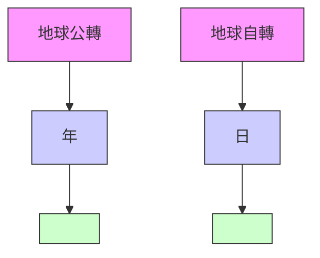
</details>

在這兩種運動中，日柱是重合部分，所以取日柱天干為核心，強調了作為運動體的地球本身，這不正是我們人類棲息的地方？

# 月支：八字結構的提綱

如果我們再進一步分析。地球圍繞着太陽運轉，月柱的地支——月支，反映着地球運轉的位置。具體來說，就是地球在黃道上運行的位置。所謂「黃道」，是地球上的人所看到的太陽一年內在天空恆星之間所走的視路徑。也就是觀察者以地球為參照物時，太陽繞地球作圓周視運動的軌道。簡單地說，地球一年繞太陽運轉一周。假定地球不動，從地球上看太陽，那是太陽在天空中移動。它一年移動的路線就是「黃道」——它是天球上假設的一個大圓圈。

人們把黃道劃分成了十二等份，每份相當於 $30^{\circ}$ 。每份用鄰近的一個星座命名，這些星座就稱為黃道星座或黃道十二宮。 $^{①}$ 這樣，相當於把一年劃分成了十二段。太陽在黃道上自西向東運行，每一段時間進入一個星座。在西方，一個人出生時太陽走到哪個星座，就說此人是這個星座的命。最早有關於黃道的歷史紀錄出現在巴比倫文化當中，以後就形成了西方最初的占星術。

與西方不同，中國古代是用二十四節氣去對應太陽在黃道上運動的軌跡。每一個節氣對應於太陽視運動15°所達到的位置。二十四節氣又分為12個節氣和 12 個中氣。誠如前文中已經談到過的，傳統命理上的月份是以十二個「節」來分割的。每兩個節之間正好相當於黃道軌跡的 30° 份額。尤其值得注意的是，傳統命理學一年的起始點是立春，而西方則是以春分點為一年的起點。因此，傳統命理學的四季起始於立春。立春標記了春天的開始。在西方，春季則始於春分點。

顯然，月柱地支標記了一年十二個月的時間段落，表述了地球公轉的位置。同時，也反映了自然氣候四季的更替狀況。這是一個十分重要的信息點。因此，在傳統命理學中，月柱地支被稱為「提綱」。

圖 3.3 日主和提綱  


<details>
<summary>text_image</summary>

年 月 日 時
日主
提綱
</details>

至於年柱的更替，在天文學上，它反映的是「歲差」。歲差是在天文觀測中發現的節氣點西移的現象，是回歸年與恆星年的時間差。比如，太陽從今年的冬至點出發，在黃道上運行至明年冬至點的時間，「真太陽時」與夜間星象周期存在着約20分24秒的時間差。 $^{②}$ 正是這個時間差，西方占星術遇到了棘手的難題。由於歲差，現在的天文學星座與西方占星術起源時期（新巴比倫王朝的創建，626 B.C.）相比，已經有了約36.85°的歲差，這已經超過了一個星座的位置。 $^{③}$ 在中國命理學裡，年柱是六十年（一甲子）的循環更替，它一定程度上反映了歲差的信息，但不存在西方占星術所面臨的棘手問題。

# 五行四時用事

既然確定了八字結構中日主的位置，也就確定了日主所屬的五行。這個日主即是命理學中的「我」。它是八字結構中的核心。比如，以上這個八字，「我」就是戊土，俗稱「土命」。於是，開始了命理分析和推斷的第一個重點：日主強弱問題。

所謂「強弱」，是指八字結構中「我」的強弱。要確定「我」的強弱，首先要觀察的是日主出生時的外部氣候環境。因為五行在不同的季節中呈現出不同的強弱狀態。因此，在分析具體八字結構之前，我們首先要討論五行在四時中的強弱變化，在命理學中稱為「五行四時用事」。「用事」，是指發生作用。下面是五行四時用事表：

表 3.1 五行四時用事

<table><tr><td>四時\五行</td><td>木</td><td>火</td><td>土</td><td>金</td><td>水</td></tr><tr><td>春</td><td>旺</td><td>相</td><td>死</td><td>囚</td><td>休</td></tr><tr><td>夏</td><td>休</td><td>旺</td><td>相</td><td>死</td><td>囚</td></tr><tr><td>秋</td><td>死</td><td>囚</td><td>休</td><td>旺</td><td>相</td></tr><tr><td>冬</td><td>相</td><td>死</td><td>囚</td><td>休</td><td>旺</td></tr><tr><td>季</td><td>囚</td><td>休</td><td>旺</td><td>相</td><td>死</td></tr></table>

這個表反映了五行在不同季節中的強弱狀況。它把五行的旺衰程度分成了五個等級：旺、相、休、囚、死。旺，是最強；相，是次強；休，是稍弱；囚，是更弱；死，則為最弱。

表中的「四時」，除了春、夏、秋、冬之外，還有一個「季」。季的原意有「末了」的意思。這裡的「季」是指春、夏、秋、冬四個季節的最後18天，即立春、立夏、立秋、立冬各節氣前18天，作為土當令的時段。因為一年若以360天計算，五行每一行最旺的時候應當各為72天。木旺於春；火旺於夏；金旺於秋；水旺於冬。那麼，土呢？則旺於四「季」，即春夏秋冬每一季的最後18天。這樣，土司令於四「季」，加起來也正好是72天。見下表：

表 3.2 五行用事時段

<table><tr><td colspan="2">春</td><td colspan="2">夏</td><td colspan="2">秋</td><td colspan="2">冬</td></tr><tr><td colspan="2">一月 二月 三月</td><td colspan="2">四月 五月 六月</td><td colspan="2">七月 八月 九月</td><td colspan="2">十月 十一月 十二月</td></tr><tr><td>木</td><td>土</td><td>火</td><td>土</td><td>金</td><td>土</td><td>水</td><td>土</td></tr><tr><td>72天</td><td>18天</td><td>72天</td><td>18天</td><td>72天</td><td>18天</td><td>72天</td><td>18天</td></tr></table>

這樣的劃分，五行在一年內周期性旺衰的日子就均等了。聯繫到具體的季節，比如春季，五行的旺衰情況就可以圖示如下：

圖 3.4 春季五行旺衰狀況  


<details>
<summary>flowchart</summary>

```mermaid
graph TD
    A["水"] -->|死(3)| B["木"]
    B -->|旺(1)| C["火"]
    C -->|相(2)| D["土"]
    D -->|休(5)| E["金"]
    E -->|囚(4)| A
    style A fill:#f9f,stroke:#333
    style B fill:#ccf,stroke:#333
    style C fill:#cfc,stroke:#333
    style D fill:#fcc,stroke:#333
    style E fill:#cff,stroke:#333
    style F stroke-dasharray: 5 5
    linkStyle 0 stroke:#000,stroke-width:2px
    linkStyle 1 stroke:#000,stroke-width:2px
    linkStyle 2 stroke:#000,stroke-width:2px
    linkStyle 3 stroke:#000,stroke-width:2px
    linkStyle 4 stroke:#000,stroke-width:2px
    linkStyle 5 stroke:#000,stroke-width:2px
    linkStyle 6 stroke:#000,stroke-width:2px
    linkStyle 7 stroke:#000,stroke-width:2px
    linkStyle 8 stroke:#000,stroke-width:2px
    linkStyle 9 stroke:#000,stroke-width:2px
    linkStyle 10 stroke:#000,stroke-width:2px
```
</details>

從圖中可以看到，（1）旺，是指當令得時的狀態。春季正是木氣最強盛的階段。（2）相，是次強。它是旺者所生之氣，有將旺的意思。這裡春令木旺，木生火，故火在春季為相。（3）休，是指已經過去的旺氣，目前進入了休止狀態。它是生此當令之氣的氣。春季木為當令，水生木，水則為休。（4）囚，是受困，不能自主，乏力不振的意思。它是剋當令旺氣的五行。由於力不勝旺，自然就被囚禁了。如上圖中的春令之金。（5）死，是指此時最弱的、完全喪失了力量的氣。它是當令旺氣所剋的五行。這裡是春木剋土，土處於死的狀態。至於其他五行的旺衰周流的情況可以按上圖類推。

顯然，五行四時用事表現了自然界中五行在時間序列上呈現出來的周期性的旺衰起伏的變化。

# 地支藏遁

如果進一步瞭解五行在每一個月的用事情況，命理經典著作——《淵海子平》提供了以下的認識，稱為「月令五行分日用事」。 $^{④}$ 可以列表如下：

表 3.3 月令五行分日用事

<table><tr><td>正月</td><td>二月</td><td>三月</td><td>四月</td><td>五月</td><td>六月</td></tr><tr><td>寅</td><td>卯</td><td>辰</td><td>巳</td><td>午</td><td>未</td></tr><tr><td>立春 雨水</td><td>驚蟄 春分</td><td>清明 毅雨</td><td>立夏 小滿</td><td>芒種 夏至</td><td>小暑 大暑</td></tr><tr><td>戊 丙 甲7 7 16日 日 日</td><td>甲 乙10 20日 日</td><td>乙 癸 戊9 3 18日 日 日</td><td>戊 庚 丙5 9 16日 日 日</td><td>丙 己 丁10 10 10日 日 日</td><td>丁 乙 己9 3 18日 日 日</td></tr><tr><td>七月</td><td>八月</td><td>九月</td><td>十月</td><td>十一月</td><td>十二月</td></tr><tr><td>申</td><td>酉</td><td>戌</td><td>亥</td><td>子</td><td>丑</td></tr><tr><td>立秋 處暑</td><td>白露 秋分</td><td>寒露 霜降</td><td>立冬 小雪</td><td>大雪 冬至</td><td>小寒 大寒</td></tr><tr><td>己 戊 壬 庚7 3 3 17日 日 日 日</td><td>庚 辛10 20日 日</td><td>辛 丁 戊9 3 18日 日 日</td><td>戊 甲 壬7 5 18日 日 日</td><td>壬 癸10 20日 日</td><td>癸 辛 己9 3 18日 日 日</td></tr></table>

從表中可以看到，在正月（寅月），先是戊土主事7天，接着是丙火主事7天，再接下來是甲木主事16天。接着是二月（卯月），承接正月甲木，繼續主事10天，接下來是乙木主事20天。接着是三月（辰月），承繼二月乙木，繼續主事9天，接着是癸水主事3天，再接下來是戊土主事18天。……

通過各月五行分日用事的具體內容，標記月份的地支獲得了新的信息。除了原有的前文所述的五行屬性，它還包藏着更多的內涵。我們知道，就天干、地支而言，天干象徵天，地支象徵地。天干為清，地支為濁；清者單純，濁者混雜。由於大地包藏着萬物，它的內涵可以直接用天干來表述，命理學稱之為「地支藏遁」，即地支中包藏着天干。《淵海子平》用下面的《地支藏遁歌》概括了各地支內所含有的天干的情況：

子宮癸水在其中，丑癸辛金己土同。

寅宮甲木兼丙戌，卯宮乙木獨相逢。

辰藏乙戊三分癸，巳中庚金丙戊叢。

午宮丁火並己土，未宮乙己丁共宗。

申位庚金壬水戊，酉宮辛金獨豐隆。

戍宮辛金及丁戊，亥藏壬甲是真蹤。

這首歌謠刻畫了各個地支所含有的天干情況。其內容可以製表如下：

表 3.4 地支藏遁表

<table><tr><td>子</td><td>丑</td><td>寅</td><td>卯</td><td>辰</td><td>巳</td><td>午</td><td>未</td><td>申</td><td>酉</td><td>戌</td><td>亥</td></tr><tr><td>癸水</td><td>己土</td><td>甲木</td><td>乙木</td><td>戊土</td><td>丙火</td><td>丁火</td><td>己土</td><td>庚金</td><td>辛金</td><td>戊土</td><td>壬水</td></tr><tr><td></td><td>癸水</td><td>丙火</td><td></td><td>乙木</td><td>庚金</td><td>己土</td><td>丁火</td><td>壬水</td><td></td><td>辛金</td><td>甲木</td></tr><tr><td></td><td>辛金</td><td>戊土</td><td></td><td>癸水</td><td>戊土</td><td></td><td>乙木</td><td>戊土</td><td></td><td>丁火</td><td></td></tr></table>

表中各支所藏的第一位是這個地支的本氣或主氣。比如，地支寅中有甲木、丙火和戊土。第一位是甲木，故甲木為其本氣；丙火和戊土是附屬之氣。再如，地支辰中藏有戊土、乙木和癸水。戊土是辰的本氣；乙木和癸水是附屬之氣。我們若再考察「地支藏遁」跟「月令五行分日用事」的差異，不難發現，它基本上是將一月中同類的五行予以歸併，如卯月（二月）中有甲、乙主事，則僅取乙為「藏遁」地支。

顯然，地支藏遁是從五行分月用事中得來的。於是，任何一組干支都具有了三個內容：命理學把天干稱為「天元」，地支成為「地元」，地支藏遁所含有的天干內容稱為「人元」。人元者，是指人處於天、地之間，雖由「陰地」孕育而成，但須接受「天之陽氣」始能為功。所以地支「暗藏」了天干之氣，表徵了天、地、人三者的統一。於是，任何一個八字結構都可以重新標記，比如上面的八字可以標記如下：

圖 3.5 八字結構  


<details>
<summary>text_image</summary>

年 月 日 時
天元 丙 庚 戊 丁
地元 申 寅 午 已
人元 庚 甲 丁 丙
壬 己 庚
戊 戊 戊
陰陽五行結構
+ 火 +金 - 水 - 木
+ 金 +木 - 火 + 火
本氣
+ 水 +火 - 土 + 金
+ 土 +土 + 土
附屬之氣
</details>

請注意，我們用地支藏遁的內容直接去標記右側陰陽五行結構中的地支元素，與前圖（3.1）相比，在地支的陰陽屬性上出現了差異，我們將在下面予以討論。顯而易見，引入了地支藏遁，地支符號可以轉換為天干符號，對八字結構中的陰陽五行內涵便可以直接進行比較和運算了。

# 十天干旺衰狀態

我們再進一步瞭解每一個天干，對應於十二個地支所呈現出來的不同的強弱狀態。這就是命理學中的十天干周行十二個地支的旺衰過程，稱為十天干生死旺衰歷程，或天干十二運。 $^{③}$ 因為其中應用的是所謂「陰生陽死」原則，歷史上引起了命理學者的爭論。對於初學者來說，我們認為若掌握其中的六種狀態，即：生（長生）、祿（臨官）、旺（帝旺）、餘氣（衰）、墓（墓庫）和絕，就抓住了十干對應於地支的旺衰要領。見下表：

表 3.5 十干旺衰狀態表

<table><tr><td>五行</td><td>十干</td><td>生</td><td>祿</td><td>旺</td><td>餘氣</td><td>墓</td><td>絕</td></tr><tr><td rowspan="2">木</td><td>甲</td><td rowspan="2">亥</td><td>寅</td><td>卯</td><td rowspan="2">辰</td><td rowspan="2">未</td><td>申</td></tr><tr><td>乙</td><td>卯</td><td>寅</td><td>酉</td></tr><tr><td rowspan="2">火</td><td>丙</td><td rowspan="2">寅</td><td>巳</td><td>午</td><td rowspan="2">未</td><td rowspan="2">戌</td><td>亥</td></tr><tr><td>丁</td><td>午</td><td>巳</td><td>子</td></tr><tr><td rowspan="2">土</td><td>戊</td><td rowspan="2">寅</td><td>巳</td><td>午</td><td rowspan="2">未</td><td rowspan="2">戌</td><td>亥</td></tr><tr><td>己</td><td>午</td><td>巳</td><td>子</td></tr><tr><td rowspan="2">金</td><td>庚</td><td rowspan="2">巳</td><td>申</td><td>酉</td><td rowspan="2">戌</td><td rowspan="2">丑</td><td>寅</td></tr><tr><td>辛</td><td>酉</td><td>申</td><td>卯</td></tr><tr><td rowspan="2">水</td><td>壬</td><td rowspan="2">申</td><td>亥</td><td>子</td><td rowspan="2">丑</td><td rowspan="2">辰</td><td>巳</td></tr><tr><td>癸</td><td>子</td><td>亥</td><td>午</td></tr></table>

為甚麼我們從十二個地支中選擇了這六項(生、祿、旺、餘氣、墓和絕)?因為它們簡要地刻畫了五行和十天干在地支周流的旺衰歷程中的關鍵要點。

以木（甲木）為例。在地支藏遁中含有甲、乙木的，共有五個地支：亥、寅、卯、辰、未。其中寅、卯，木是本氣。亥、辰和未，木是附屬之氣。它們分布可以圖示如下：

圖 3.6 木（甲木）氣周流地支狀態  


<details>
<summary>text_image</summary>

夏
癸
戊
辰
餘氣
旺
祿
丑
子
冬
春
乙
寅
丙
戊
己
庚
壬
戊
生
酉
申
申
乙
丁
己
午
未
慈
絕
秋
亥
</details>

圖的圓圈內側是十二地支，外側標記的是其中五個含有甲乙木的地支藏遁內容。它們以本氣和附屬之氣的序列標記。如圖所示，地支寅、卯、辰，是春天正月、二月、三月。春天是木氣旺的時候，地支自然都有木。地支亥是十月，亥中含有甲木，因為亥是木的發生點。雖然在冬季，是水旺之時，由於母旺子相，水氣孕育了木氣，故亥是木氣的「生」（長生）。未是六月，未中含有乙木，它是木氣的歸宿點。因為夏天是火旺之時，到了火走向衰的時候，木也完成了自己生火的使命，進入了「墓」地。再查「絕」，它正好處於「祿」的對面，是自「祿」開始的第七個地支，已屬於秋天，秋金剋木，是木處於最弱的位置。這裡還要注意的是，由於陰陽的關係，甲木的「祿」在寅，乙木的「祿」在卯，所以甲木的「絕」在申，乙木的「絕」在酉。圖中以甲木為主，因此「絕」標記在地支申。顯然，抓住了這六個地支，木氣的由生（長生）而旺（祿、旺），再由旺而衰（餘氣、墓），最後到絕的周流過程，便十分明確了。

自然，對於火氣、土氣、金氣、水氣，都可做同樣的認識，這裡不贅述了。因為宋代後的命理學認同「火土同行」（即把處於中央位置的土與處於南方位置的火，置於同樣的周流過程之中），所以五行土天干在地支周流過程與火是一致的。

請再觀察以上十干旺衰狀態表，處於五行「生」（長生）點的地支是寅、申、巳、亥。它們除本氣以外，都附屬了另一類五行的長生之氣。比如，寅的本氣是木，它是甲木的祿，但同時又是火的長生。長生點是生發點，因此，陽氣充足，故寅、申、巳、亥四個地支所含藏遁全都是陽性的。

子、午、卯、酉是四個「旺」（帝旺）點，氣專而強。由於物盛則虧，器滿則損，陽極反陰，所以子、午、卯、酉的含氣俱為陰性。

這裡要特別提一下陽干的四個「旺」(帝旺)點，命理學稱之為「陽刃」(也作「羊刃」)。列表如下：

表 3.6 陽刃

<table><tr><td>陽干</td><td>甲</td><td>丙</td><td>戊</td><td>庚</td><td>壬</td></tr><tr><td>陽刃</td><td>卯</td><td>午</td><td>午</td><td>酉</td><td>子</td></tr></table>

陽刃，這裡陽是剛的意思；刃，即是刀刃，是宰割的意思。陽刃在祿後一位，比祿更強旺有力，是氣息的巔峰狀態。因為物極必反，過剛則折，在現實中常解讀為因剛烈而招禍。由於陰干為柔，雖然陰干也有「旺」（帝旺）點，但一般認為，它們並不為陽刃。故五陰干無刃。

辰、戌、丑、未為四個「墓」（墓庫）點，本氣為土。雖然辰、戌為陽土；丑、未為陰土，但其中附屬之氣都是陰的。比如，辰處於三月，其本氣為戊土，餘氣為乙木，墓氣為癸水。戊土屬陽，乙木和癸水皆屬陰。顯然，這是物之終結，歸葬於墓，所以墓中附屬之氣皆為陰。

由於地支藏遁，我們對地支的陰陽屬性有了新的認識。前文提到，按照干支排列，地支子、寅、辰、午、申、戌為陽，丑、卯、巳、未、酉、亥為陰。但現在按照地支藏遁的內容，處於「生」的寅、申、巳、亥，俱屬陽；處於「旺」的子、午、卯、酉，皆屬陰；而在四「墓」中，辰、戌為陽，但所附之氣則屬陰；而丑、未本氣和所附之氣皆為陰。在具體討論八字陰陽屬性時，後者或許更能反映地支的陰陽狀態。以下我們都以地支藏遁的內容來標記地支的陰陽屬性。

# 強弱的判斷

有了以上的基本理論準備，我們可以開始以日主為中心，分析八字結構的強弱問題了。

關於日主的強弱，一般的原則是觀察日主是否：(1)得令，(2)得地，(3)得助。

所謂「得令」，是指八字中月令地支屬日主比較旺盛的季節。比如，日主甲木生於春季，就是得令。得令，自然強盛。

所謂「得地」，是指日主在年、日或時的地支上有根基。比如，日主甲木在年、日或時的地支上見到寅、卯或亥，因為亥為甲木之生（長生），寅為甲木之祿，卯為甲木之旺（陽刃），日主見此根基，自然增強了自身的力量。

所謂「得助」，是指四柱多幫扶。比如日主是甲木，四柱干支多見水和木。因為水可以生扶甲木，木可以比助甲木。

# 一般來說，

（1）既當令，又多幫扶，視為「最強」；  
(2) 失令但多幫扶，可視為「中強」；  
（3）雖不當令，也少幫扶，但年、日、時支得根基，可為「次強」；  
（4）雖當令，但年、日、時地支無根基，為「次弱」；  
（5）雖當令，但四柱多剋洩，則為「中弱」；  
(6) 既失令，又多剋洩，是為「最弱」。⑥

對於日主強弱比較明顯的八字，這樣的觀察已經可以得到基本的強弱評估了。

下面，我們以實例來說明。

命例 1：南懷瑾（1918-2012）⑦  


<details>
<summary>text_image</summary>

年 月 日 時
天元 戊 乙 甲 乙
地元 午 卯 子 亥
人元 丁 乙 癸 壬
(地支藏遁) 己 甲
陰陽五行結構
+土 -木 +木 -木
-火 -木 -水 +水
-土 +木
本氣
</details>

根據上文所述的原則，此命造日主甲木：（1）得令。甲木生於卯月（春二月），正是甲木當令的季節。（2）得地。時辰地支為亥，亥是甲木之生（長生）。（3）得助。月干和時干皆為乙木；地支中有子和亥，皆有水，水可以生木，所以此命造頗得助力。這些信息，我們可以標記在下圖中：

命例 1：南懷瑾命造  


<details>
<summary>text_image</summary>

年 月 日 時
戊 乙 甲 乙
午 卯 子 亥
丁 乙 癸 壬
己 甲
旺 生
陰陽五行結構
+ 土 - 木 + 木 - 木
- 火 - 木 - 水 + 水
- 土 + 木
</details>

此命造既當令、又得地、得助，根據上面的準則，日主顯然可以判斷為「最強」。


<details>
<summary>natural_image</summary>

Two men posing for a photo in front of a framed calligraphy scroll (no visible text or symbols on subjects)
</details>

筆者和南懷瑾先生（2010年春）

再看下面的命例：

命例 2：胡適 $^{③}$ （1891-1962）  


<details>
<summary>text_image</summary>

年 月 日 時
天元 辛 庚 丁 丁
地元 卯 子 丑 未
人元 乙 癸 己 己
(地支藏遁)
辛 乙
陰陽五行結構
-金 +金 -火 -火
-木 -水 -土 -土
-水 -火
-金 -木
</details>

同樣，根據上文所述的原則，此命造日主丁火：（1）不得令。在子月當令的是水。本命日主是火，當然不得時令。（2）基本上是不得地。地支只有未中附屬之氣有丁火，只能算是一個弱根。（3）有幫扶。時干丁火（火比助火）和年支卯木（木可生火），可為日主的助力。總的來說，若按上述的原則，此命大致屬於「中弱」。

# 強弱圖解分析法

為了幫助初學者掌握日主強弱判斷，我在下面引進操作性較強的圖解分析法。

首先，它把一個八字結構內的五行成分歸為兩大類：

一類稱之為「日主同方」。它包括日主本身以及跟日主同樣的五行（「同我」）；它還包括生日主的五行（「生我」）。跟日主同類的五行，或是生扶日主的五行，它們自然跟日主是站在同一條陣線上的，體現着日主一方的力量。

另一類則稱為「日主異方」。它包括剋日主的五行（「剋我」）；日主所剋的五行（「我剋」）；以及日主所生的五行（「我生」）。剋日主者，即「剋我」者，當然是日主的敵對勢力；「我剋」者和「我生」者，也都是要消耗「我」的能量，因此，它們都屬於日主的對立面——「日主異方」了。

可以圖示如下：

圖 3.7 日主同方和日主異方示意  


<details>
<summary>flowchart</summary>

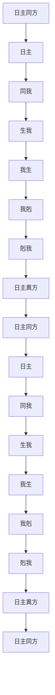
</details>

按上圖所示，將八字結構中的成分分歸為兩大類——日主同方和日主異方，然後比較雙方的力量，便可以得到日主強弱狀態的大致評估了。

我們以上述胡適先生的命造為例，來展開分析。第一步，先將其八字中的五行填入這個五行生剋循環圈中：

操作 -1 : (胡適命造) 標記五行


<details>
<summary>flowchart</summary>

```mermaid
graph TD
    A["土"] --> B["火"]
    B --> C["水"]
    C --> D["金"]
    D --> E["土"]
    E --> F["火"]
    F --> G["水"]
    G --> H["土"]
    H --> I["火"]
    I --> J["水"]
    J --> K["土"]
    K --> L["火"]
    L --> M["水"]
    M --> N["土"]
    N --> O["火"]
    O --> P["水"]
    P --> Q["土"]
    Q --> R["火"]
    R --> S["水"]
    S --> T["土"]
    T --> U["火"]
    U --> V["水"]
    V --> W["土"]
    W --> X["火"]
    X --> Y["水"]
    Y --> Z["土"]
    Z --> AA["火"]
    AA --> AB["水"]
    AB --> AC["土"]
    AC --> AD["火"]
    AD --> AE["水"]
    AE --> AF["土"]
    AF --> AG["火"]
    AG --> AH["水"]
    AH --> AI["土"]
    AI --> AJ["火"]
    AJ --> AK["水"]
    AK --> AL["土"]
    AL --> AM["火"]
    AM --> AN["水"]
    AN --> AO["土"]
    AO --> AP["火"]
    AP --> AQ["水"]
    AQ --> AR["土"]
```
</details>

第二步，計算一下八字中五行的數量。首先是天干和地支本氣。根據以上命例 2 右側的陰陽五行結構所示，我們得到：

日主同方：我+同我：火=2（日主丁火+時干丁火）

生我：木=1（年支卯木）

日主異方：我生：土=2（日支丑+時支未）

我剋：金=2（年干辛金+月干庚金）

剋我：水=1（月支子水）

然後，再計算地支中的附屬之氣：在命造地支丑、未中，除去主氣外，還有附屬之氣。屬日主同方的有：火=1；木=1。屬日主異方的有：水=1；金=1。

將這些信息分別標記到以上的操作圖中去——屬天干和地支本氣的直接用數字標記，而屬地支中附屬之氣的則標記在括號裡：

# 操作 -2：（胡適命造）標記五行數值


<details>
<summary>flowchart</summary>

```mermaid
graph TD
    A["土"] -->|2 (1)| B["火"]
    B -->|1 (1)| C["水"]
    C -->|1 (1)| D["土"]
    D -->|2 (1)| E["金"]
    E -->|2 (1)| F["土"]
    F -->|1 (1)| G["水"]
    G -->|1 (1)| H["土"]
    H -->|2 (1)| I["火"]
    I -->|2 (1)| J["土"]
    J -->|1 (1)| K["水"]
    K -->|1 (1)| L["土"]
    L -->|2 (1)| M["火"]
    M -->|2 (1)| N["土"]
    N -->|1 (1)| O["水"]
    O -->|1 (1)| P["土"]
    P -->|2 (1)| Q["火"]
    Q -->|2 (1)| R["土"]
    R -->|1 (1)| S["水"]
    S -->|1 (1)| T["土"]
    T -->|2 (1)| U["火"]
    U -->|2 (1)| V["土"]
    V -->|1 (1)| W["水"]
    W -->|1 (1)| X["土"]
    X -->|2 (1)| Y["火"]
    Y -->|2 (1)| Z["土"]
    Z -->|1 (1)| AA["水"]
    AA -->|1 (1)| AB["土"]
    AB -->|2 (1)| AC["火"]
    AC -->|2 (1)| AD["土"]
    AD -->|1 (1)| AE["水"]
    AE -->|1 (1)| AF["土"]
    AF -->|2 (1)| AG["火"]
    AG -->|2 (1)| AH["土"]
    AH -->|1 (1)| AI["水"]
    AI -->|1 (1)| AJ["土"]
    AJ -->|2 (1)| AK["火"]
    AK -->|2 (1)| AL["土"]
    AL -->|1 (1)| AM["水"]
    AM -->|1 (1)| AN["土"]
    AN -->|2 (1)| AO["火"]
```
</details>

第三步，依據八字月令（月支），再將出生時令的五行四時用事標記到操作圖中去。因為對日主強弱的評估，必須放置於外部自然氣候環境下來考察。具體做法是根據前文表3.1（五行四時用事），將五種旺衰狀態填入到操作圖中去：

操作 -3 : (胡適命造)


<details>
<summary>flowchart</summary>

```mermaid
graph TD
    A["火"] -->|2(1)| B["土"]
    B -->|2| C["金"]
    C -->|2(1)| D["日主"]
    D -->|1(1)| E["木相"]
    E -->|1(1)| F["水"]
    F -->|1(1)| G["旺"]
    G -->|1(1)| H["休"]
    H -->|1(1)| I["日主異方"]
    I -->|1(1)| J["日主同方"]
    J -->|2(1)| A
    style A fill:#f9f,stroke:#333
    style B fill:#ccf,stroke:#333
    style C fill:#cfc,stroke:#333
    style D fill:#fcc,stroke:#333
    style E fill:#cff,stroke:#333
    style F fill:#ffc,stroke:#333
    style G fill:#cfc,stroke:#333
    style H fill:#fcc,stroke:#333
    style I fill:#cfc,stroke:#333
    style J fill:#fcc,stroke:#333
```
</details>

現在我們可以通過比較操作圖中的數據，做出日主強弱的判斷了：

日主同方（死、相）=3（2）

日主異方（旺、休、囚）=5（2）

結論：日主同方＜日主異方

顯然是日主一方處於相對弱勢。如果我們把日主強弱分為9個等級：極強、很強、強、稍強、中和（平衡）、稍弱、弱、很弱、極弱。那麼，胡適命造的「日主強弱」可以做出以下的標記：

操作 -4 : (胡適命造)

日主強弱：極強 很強 強 稍強 中和 稍弱 $\textcircled{弱}$ 很弱 極弱

結論是「弱」。

下面再以南懷瑾先生的命造為例，用同樣的「日主強弱圖解分析法」來進行操作，其結果如下：

操作 -1：（南懷瑾命造）日主強弱圖解


<details>
<summary>flowchart</summary>

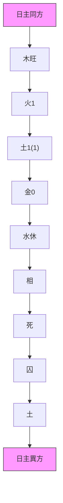
</details>

日主強弱：極強很強強稍強中和稍弱弱很弱極弱

此命造分析的結論是日主「很強」。

# 用神

有了基本的強弱評估，可以說，我們發現了問題。這個問題就是八字結構內部五行處於了不平衡狀態。接下來的關鍵，就在於能否找到解決問題的辦法，使結構內部各成分之間能趨於平衡。具體來說，就是要找到能夠使日主同方與日主異方之間趨於平衡的機制。這個機制，在傳統命理學中稱為「用神」。

先來觀察胡適命造。既然日主「弱」，自然應當採取扶助的手段，才能幫助日主求得平衡。「扶助」可以具體分為「扶」和「助」：「生我」的五行跟日主的關係是「扶」；「同我」的五行跟日主的關係就是「助」了。

那麼，這個結構內部本身有沒有「扶」或「助」的機制呢？——有。這一點非常重要。因為命局是內因，是根本。在這個八字中，時干丁火是可以承擔這個任務的最佳選擇。它跟日主是同類，可以比助日主。於是，這個「丁」字，可以被稱為是這個命造的用神。繼續上述的操作，我們把選取的用神標記到八字上去。這也是強弱分析要達到的目標。

操作 -5 : (胡適命造)  


<details>
<summary>text_image</summary>

用神
年 月 日 時
辛 庚 丁 丁
卯 子 丑 未
乙 癸 己 己
癸 丁
辛 乙
陰陽五行結構
-金 +金 -火 -火
-木 -水 -土 -土
-水 -火
-金 -木
</details>

圖中用神（丁火）的功能是幫助命局內部的五行恢復平衡。因為它涉及命局結構分析中的日主強弱問題，這類「用神」也就被稱為「扶抑用神」。

再來看南懷瑾先生的命造。我們分析的結果是日主「很強」。八字結構要趨於平衡，只有對其日主採取抑制或宣洩（消耗）的手段，方能奏效。那麼，這個結構內部有沒有這樣的機制呢？——有！年支午火（本氣為丁火）可以充當宣洩強木的機制。對這個八字來說，宣洩強木的能量來轉生戊土（年干），是最有效的求取平衡的渠道。因此，午火是用神。可以圖示如下：

操作 -2 : (南懷瑾命造)  


<details>
<summary>text_image</summary>

年 月 日 時
戊 乙 甲 乙
午 卯 子 亥
丁 乙 癸 壬
己
用神
陰陽五行結構
+ 土 - 木 + 木 - 木
- 火 - 木 - 水 + 水
- 土        + 木
</details>

由此可見，用神的功能，是通過「扶助」或「抑制」（包括「宣洩」）的手段來幫助八字結構恢復平衡。

「不平衡」本是自然界中常見的現象。因此，八字結構中出現了不平衡的狀態並不足慮。問題是八字結構內部有沒有使之恢復平衡的機制。有恢復平衡的機制，就有了「生機」。一般來說，具有「用神」的八字結構都是比較良好的結構。

命理經典《繼善篇》說：「用神不可損傷，日主最宜健旺。」這是說，八字結構中既然有了「用神」，就希望它不要受到「損傷」。若受到損傷，它就無法再承擔起它應有的作用。這也是八字結構成功的重要條件。以上兩造的「扶抑用神」都是完好的。它們的周圍沒有出現直接剋制（破壞）它們的五行。

再看以下的命例：

命例 3：末代皇帝溥儀 $^{⑨}$ （1906-1967）  


<details>
<summary>text_image</summary>

年 月 日 時
天元 丙 庚 壬 壬
地元 午 寅 午 寅
人元 丁 甲 丁 甲
(地支藏遁) 己 丙 己 丙
    戊    戊
陰陽五行結構
+ 火 + 金 + 水 + 水
- 火 + 木 - 火 + 木
- 土 + 火 - 土 + 火
    + 土    + 土
</details>

也同樣做出上述的日主強弱分析：

操作 -1：（溥儀命造）日主強弱圖解


<details>
<summary>flowchart</summary>

```mermaid
graph TD
    A["日主"] -->|2| B["水"]
    B -->|休| C["金"]
    C -->|1| D["土"]
    D -->|0 (4)| E["火"]
    E -->|3 (2)| F["相"]
    F -->|旺| G["木"]
    G -->|2| H["日主同方"]
    H -->|1| C
    I["日主异方"] --> E
    J["死"] --> D
```
</details>

日主強弱：極強 很強 強 稍強 中和 稍弱 ⑧ 很弱 極弱


<details>
<summary>text_image</summary>

用神
年 月 日 時
丙 庚 壬 壬
午 寅 午 寅
丁 甲 丁 甲
己 丙 己 丙
戊 戊
陰陽五行結構
+ 火 + 金 + 水 + 水
- 火 + 木 - 火 + 木
- 土 + 火 - 土 + 火
+ 土 + 土
</details>

分析的初步結果：日主身弱，用月干庚金生水，故扶抑用神為庚。可是，進一步觀察，年干為丙火，正好在相鄰的位置，剋月干庚金，於是用神遭到了明顯的損傷，如下圖所示：

圖 3.10 溥儀命造  


<details>
<summary>text_image</summary>

刻
年 月 日 時
丙 庚 壬 壬
午 寅 午 寅
</details>

由此，八字的格調驟然降低，日主變得弱不堪扶了。誠如溥儀自己所說：「我在歷史上扮演了一個史無前例的大丑角——終身為待決的囚徒！表面上，我曾輝煌過，其實我是自有人類以來最倒霉的人。」 $^{10}$

綜合以上所述，作為八字結構分析的一個重要視角——強弱分析，主要是分析日主的強弱狀態。然後依據強弱情況，以「中和」原則或平衡原理，來決定或「扶」、或「抑」的基本策略，同時尋找八字中是否具有來承擔這個扶抑功能的機制——扶抑用神。最後，根據強弱狀態以及選取出來的扶抑用神是否完備的情況，對八字結構做出一個基本的評判。這就是強弱分析的基本內容。

用同樣的原則，來考察前面南懷瑾先生和胡適先生的命造，它們都是很好的結構。雖然這兩個八字形成了鮮明的對比：一個身強，一個身弱，但都有完好的扶抑用神（強者得洩，弱者得扶），由此得到自我的完善。在中國近現代文化史上，他們都做出了杰出的貢獻。胡適是五四新文化運動中的健將；南懷瑾則是當代中國傳統文化的普及者，這或許從他們的命造中可以看出端倪來。

一般來說，衰者宜扶，強者宜抑。扶，即是扶和助；抑，也就是剋制。具體分析，日主弱，首先取生扶（「生我」的五行）為用神；如果四柱內沒有生扶成分的話，則取比助（「同我」的五行）為用神。日主太弱，則以比助為用神；如果四柱內沒有比助的成分，就取生扶為用神。相反，日主旺，以剋制（「剋我」的五行）為用神；如果沒有剋制的成分，就取洩者（「我生」的五行）為用神。但是，如果出現日主過強時，則反而是宜洩而不宜剋制了。就是說，在過強的勢力面前，順其勢，用宣洩的手段則比直接剋制更為有利。南懷瑾先生的命造正是這樣的例子。至于日主極旺與極弱的情況，我們會在後文予以討論。

扶抑策略……衰者宜扶，強者宜抑，過強者宜泄

① 它們是白羊座、金牛座、雙子座、巨蟹座、獅子座、處女座、天秤座、天蝎座、射手座、摩羯座、水瓶座和雙魚座。  
② 在我國，晉代著名的天文學家虞喜把自己潛心觀測恆星的成果與前人的觀測記錄進行了比較，發現冬至當日不同的時代黃昏時分出現於天空正南方的星宿有明顯的差異，他正確地解釋了這一現象。他認為這是由於太陽在冬至點連續不斷地西退而引起的。他把這種每隔一歲，稍微有差值的現象叫做歲差。  
③ 西方占星術所採用的星宮等分方式並沒有反映歲差的問題，它把白羊宮的起點就設在春分點上。這就與天文學上實際的星座位置產生了較大的偏離。  
④ 見《淵海子平·又論節氣歌》：

看命先須看日主，八字始能究奥理。假如子上十日壬，中旬下旬方是癸。丑宮九日癸之餘，除卻三辛皆屬己。寅宮戊丙各七朝，十六甲木方堪器。卯宮陽木朝初旬，中下兩旬陰木是。三月九朝仍是乙，三日癸庫餘戊奇。初夏九日生庚金，十六丙火五戊時。午宮陽火屬上旬，丁火十日九日己。未宮九日丁火明，三朝是乙餘是己。孟公乆七戊三朝，三壬十七庚金備。酉宮還有十日庚，二十辛金屬旺地。戊宮九日辛金勝，三丁十八戊土具。亥宮七戊五日甲，餘皆壬旺君須記。須知得一擬三分，此訣先賢與驗秘。

⑤ 十天干生死旺衰歷程，見下表：

表 3.7 十天干生死旺衰歷程

<table><tr><td></td><td>長生</td><td>沐浴</td><td>冠帶</td><td>臨官</td><td>帝旺</td><td>衰</td><td>病</td><td>死</td><td>墓</td><td>絕</td><td>胎</td><td>養</td></tr><tr><td>甲</td><td>亥</td><td>子</td><td>丑</td><td>寅</td><td>卯</td><td>辰</td><td>巳</td><td>午</td><td>未</td><td>申</td><td>酉</td><td>戌</td></tr><tr><td>乙</td><td>午</td><td>巳</td><td>辰</td><td>卯</td><td>寅</td><td>丑</td><td>子</td><td>亥</td><td>戌</td><td>酉</td><td>申</td><td>未</td></tr><tr><td>丙</td><td>寅</td><td>卯</td><td>辰</td><td>巳</td><td>午</td><td>未</td><td>申</td><td>酉</td><td>戌</td><td>亥</td><td>子</td><td>丑</td></tr><tr><td>丁</td><td>酉</td><td>申</td><td>未</td><td>午</td><td>巳</td><td>辰</td><td>卯</td><td>寅</td><td>丑</td><td>子</td><td>亥</td><td>戌</td></tr><tr><td>戊</td><td>寅</td><td>卯</td><td>辰</td><td>巳</td><td>午</td><td>未</td><td>申</td><td>酉</td><td>戌</td><td>亥</td><td>子</td><td>丑</td></tr><tr><td>己</td><td>酉</td><td>申</td><td>未</td><td>午</td><td>巳</td><td>辰</td><td>卯</td><td>寅</td><td>丑</td><td>子</td><td>亥</td><td>戌</td></tr><tr><td>庚</td><td>巳</td><td>午</td><td>未</td><td>申</td><td>酉</td><td>戌</td><td>亥</td><td>子</td><td>丑</td><td>寅</td><td>卯</td><td>辰</td></tr><tr><td>辛</td><td>子</td><td>亥</td><td>戌</td><td>酉</td><td>申</td><td>未</td><td>午</td><td>巳</td><td>辰</td><td>卯</td><td>寅</td><td>丑</td></tr><tr><td>壬</td><td>申</td><td>酉</td><td>戌</td><td>亥</td><td>子</td><td>丑</td><td>寅</td><td>卯</td><td>辰</td><td>巳</td><td>午</td><td>未</td></tr><tr><td>癸</td><td>卯</td><td>寅</td><td>丑</td><td>子</td><td>亥</td><td>戌</td><td>酉</td><td>申</td><td>未</td><td>午</td><td>巳</td><td>辰</td></tr></table>

這裡，生死旺衰歷程分成了十二個階段，並配入十二個月中。這十二階段是：長生、沐浴、冠帶、臨官、帝旺、衰、病、死、墓、絕、胎、養。它們各自的含義是：

長生——猶如嬰兒之初生。

沐浴——猶出生後沐浴去垢，指幼兒階段。

冠帶——猶人漸長而需冠帶。

臨官——好像人由長而壯，可以出仕做官了。

帝旺——好像人的體力、智力都到達最旺盛的時候了。(但盛極也孕育了衰敗的初兆。)

衰——盛極而衰，開始走下坡路了。

病——由衰败而生病。

死——由病而死。

墓——死而埋葬入墓。

絕——前氣已絕，後氣將續。

胎——後氣繼續結氣成胎。

養——好像人養胎於母腹之中。

顯然，它們表明了五行由盛而衰、由衰複盛、衰旺程度不同的十二個階段。同時，這裡採取的是「陰生陽死」，即陽干是順着行走，從長生開始，沐浴、冠帶、臨官……，一直到養，再回到長生；陰干恰好是逆着行走，陽干的「死」正好是陰干的「長生」位置，然後，採取逆行；由長生開始，沐浴、冠帶、臨官……，一直到養，再回到長生。而陰干的「死」位，恰好是陽干的「長生」位置。

⑥ 參見韋千里《韋氏命學講義》，《相命全書》，第44-47頁。

⑦ 南懷瑾先生生於 1918 年 3 月 18 日亥時。  
⑧ 胡適，原名嗣糜，後改名適，字適之，安徽續溪上莊村人，因提倡文學革命而成為新文化運動的領袖之一，曾擔任國立北京大學校長、中央研究院院長、中華民國駐美大使等職。胡適興趣廣泛，著述豐富，在文學、哲學、史學、考據學、教育學、倫理學、紅學等諸多領域都有深入的研究。  
愛新覺羅·溥儀（1906-1967），字耀之，號浩然。清朝末代皇帝，也是中國歷史上最後一個皇帝。1912年2月12日被迫退位，清朝統治結束。九·一八事變之後在日本人控制下做了滿洲國的傀儡皇帝。1945年8月15日，日本投降。溥儀在藩陽準備逃亡時被蘇聯紅軍俘虜。1950年8月初被押解回國，在無順戰犯管理所學習、改造。1959年12月4日被特赦，並成為全國政協委員。1967年患腎癌在北京去世。  
⑩ 八字引自鍾義民《命理準繩評注》（下冊），376頁。

# ▼ 第四章

# 干支刑沖會合

在前一章裡，根據八字結構干支的陰陽五行內涵，我們討論了日主的強弱問題。事實上，干支除了本身具有陰陽五行的內涵，干支與干支之間還存在着較為複雜的關係。正是這類干支之間的相互關係，構成了命理學的一個基本組成部分——刑沖會合系統。刑沖會合系統的熟練應用，成了命理推演去刻畫豐富多彩的人生現象的重要手段。以下分別介紹干支之間存在的「會、合、刑、沖、害」等一系列法則。

# 天干合沖

「合」，是和好、親密，但也有羈絆的意思。十個天干，每隔五位必相合，稱為「五合」，共有五組：

甲與己合；乙與庚合；丙與辛合；丁與壬合；戊與癸合

以上每一組都是一陰一陽的組合。比如，甲屬陽，己屬陰，甲己相合。正因為是一陰一陽，異性相吸，所以會產生相合。好像男女談戀愛，形影不離。命理學中，對於相合的干支，還有「化」的情況。如同化學中不同的分子結合而成了新的物類。以下是五組天干化合的情況：

甲己合土；乙庚合金；丙辛合水；丁壬合木；戊癸合火

顯然，經過合化，不少天干改變了原有的五行屬性。比如，甲己合化成土，甲改變了原來具有的木性，成了土了。當然，從合到化，是需要條件的。這要看八字的配置情況而定。化，會改變原性；合而不化，則保留原性。至於它們在八字結構中的作用，自然要由命局的喜忌來認定。

既然干支有「合」，也必有「沖」。沖是對立、衝突的意思。天干有如下的沖：

甲庚沖，乙辛沖，丙壬沖，丁癸沖。①

顯然，相沖也有相剋的含義。比如，甲庚沖，是庚金剋甲木；乙辛沖，是辛金剋乙木。就陰陽而言，它們又都是陽剋陽、陰剋陰，比如，甲與庚都為陽；乙與辛，都為陰，陰陽不能配合，故發生衝突。因為相剋是無情的表現，相沖一般不以吉論。

# 地支合沖

地支呢？有「六合」和「六沖」。地支六合如下：

子與丑合；寅與亥合；卯與戌合；辰與酉合；巳與申合；午與未合

子丑合土；寅亥合木；卯戌合火；辰酉合金；巳申合水；午未合土

同樣，也有合與合化的問題。前提也是局中是否存在「化」的條件。六合可以圖示如下：

圖 4.1 地支六合  


<details>
<summary>text_image</summary>

午
巳
未
辰
申
卯
酉
寅
戌
亥
丑
子
</details>

地支六冲是：

子午沖；丑未沖；寅申沖；卯酉沖；辰戌沖；巳亥沖

不難發現，它們各取七位（即隔六位）發生相沖。從方位看，兩方處於相反的位置，如卯在東，酉在西；就五行而言，都是相剋的，如酉金剋卯木；就陰陽而言，都是同性相剋：陽剋陽、陰剋陰，如卯為陰，酉也為陰，陰陽不能配合，故發生衝突。

地支的六沖可以圖示如下：

圖 4.2 地支六沖  


<details>
<summary>text_image</summary>

巳
午
未
辰
卯
寅
丑
子
亥
戌
酉
申
</details>

# 害和刑

地支由於有「六合」和「六沖」這樣的雙重關係，於是產生了「六害」 $^{②}$ ，羅列如下：

子未害；丑午害；寅巳害；卯辰害；酉戌害；亥申害；

稍加琢磨，就不難發現「六害」形成原因。比如，子與午相沖，而午與未是相合的，所以子與未之間就構成了相害的關係。道理很簡單：我對頭的朋友，也不會跟我情投意合；而我的朋友也無法跟我的對頭和平共處。同樣，丑未相沖，未與午相合，故丑與午之間就構成了相害關係。相害，有暗害之意，一般也不以吉論。

除了「合」、「沖」、「害」之外，地支之間還有四種相「刑」的關係：

無禮之刑：子刑卯，卯刑子

三刑（恃勢之刑）：寅刑巳，巳刑申，申刑寅

三刑（無恩之刑）：丑刑戌，戌刑未，未刑丑

自刑：辰刑辰，午刑午，酉刑酉，亥刑亥

刑，是傷害的意思。子卯相刑，子與卯，原係水木相生，有如母子關係，今竟相刑，故為「無禮之刑」。巳寅申構成三刑，是因為巳、寅、申三者各居生（長生）、祿（臨官）位，恃強而刑，故為「恃勢之刑」。丑戌未三刑，其中丑、戌、未，皆屬土，同類好像兄弟，居然同室操戈，故為「無恩之刑」。至於辰辰、午午、酉酉、亥亥，同支相加，故為「自刑」。

地支組合中出現相刑的關係，一般也不以吉論。

# 會方與合局

多個地支還組成了「方」和「局」。地支會「方」（也稱「三會方」），是指地支會合成東方、南方、西方和北方，即：

東方木：寅、卯、辰；

南方火：巳、午、未；

西方金：申、酉、戌；

北方水：亥、子、丑。

寅、卯、辰，是春季正月、二月、三月，如果這三個地支會合，聚於一堂，則是東方木氣的大集合，凝聚了東方木的旺氣。其他三組也是如此，分別凝聚了南方火、西方金和北方水的旺氣。當然，會方必須是相關的三個地支同時出現，缺一不可，只有這樣才能代表該五行強盛的旺氣。圖示如下：

圖 4.3 三會方  


<details>
<summary>text_image</summary>

南
午
巳
未
火
申
申
金
西
西
戌
亥
水
子
丑
寅
卯
辰
東
北
</details>

地支會「局」，是指以下的組合：

木局：亥、卯、未；

火局：寅、午、戌；

金局：巳、酉、丑；

水局：申、子、辰；

土局：辰、戌、丑、未。

其中，寅、申、巳、亥，是三合局的起始點，它們正是各五行的「生」（長生）的點位；子、午、卯、酉，是三合局的中心點，它們正是各五行的「旺」（帝旺）的點位；辰、戌、丑、未，是三合局的收尾點，它們正是各五行的「墓」（墓庫）的點位。可見三合局是由各五行的生、旺、墓三個地支組成，表述了該五行發展過程由生而旺、由旺而墓的三個重要時點，故形成了該五行強盛的氣勢。可以圖示如下：

圖 4.4 三合局  


<details>
<summary>text_image</summary>

火局
午
巳
未
辰
申
酉 金局
戌
亥
子
水局
寅
木局 卯
</details>

三合局合成五行屬性的辨別，主要是中間那個地支的五行屬性。比如，亥卯未三字組成三合局，中間卯字為木，故此三合局為木局。餘皆類推。屬三合局的三字同時出現，自然氣勢很強。與三會方不同的地方是，如果僅有兩字，只要中間那個代表專氣的字在，如亥卯，或卯未，只要卯字在，依然合木氣，此時稱為「半合局」。只是合力，遠遜於三字合局。

最後，地支辰戌丑未，這四個在「季月」司土令的地支合在一起，則為土局。

大致來說，三會方的力量最大；三會局的力量次之；六合又次之；半會局再次之。

以上是「刑沖會合」法則的主要內容，列表如下：③

表 4.1 地支刑沖會合表

<table><tr><td></td><td>三會方</td><td>三合局</td><td>土局</td><td>六合</td><td>六冲</td><td>害</td><td>刑</td><td>破</td></tr><tr><td>子</td><td>亥子丑</td><td>申子辰</td><td></td><td>丑</td><td>午</td><td>未</td><td>子卯</td><td>酉</td></tr><tr><td>丑</td><td>亥子丑</td><td>巳酉丑</td><td>辰戌丑未</td><td>子</td><td>未</td><td>午</td><td>丑戌未</td><td>辰</td></tr><tr><td>寅</td><td>寅卯辰</td><td>寅午戌</td><td></td><td>亥</td><td>申</td><td>巳</td><td>寅巳申</td><td>亥</td></tr><tr><td>卯</td><td>寅卯辰</td><td>亥卯未</td><td></td><td>戌</td><td>酉</td><td>辰</td><td>子卯</td><td>午</td></tr><tr><td>辰</td><td>寅卯辰</td><td>申子辰</td><td>辰戌丑未</td><td>酉</td><td>戌</td><td>卯</td><td>辰</td><td>丑</td></tr><tr><td>巳</td><td>巳午未</td><td>巳酉丑</td><td></td><td>申</td><td>亥</td><td>寅</td><td>寅巳申</td><td>申</td></tr><tr><td>午</td><td>巳午未</td><td>寅午戌</td><td></td><td>未</td><td>子</td><td>丑</td><td>午</td><td>卯</td></tr><tr><td>未</td><td>巳午未</td><td>亥卯未</td><td>辰戌丑未</td><td>午</td><td>丑</td><td>子</td><td>丑戌未</td><td>戌</td></tr><tr><td>申</td><td>申酉戌</td><td>申子辰</td><td></td><td>巳</td><td>寅</td><td>亥</td><td>寅巳申</td><td>巳</td></tr><tr><td>酉</td><td>申酉戌</td><td>巳酉丑</td><td></td><td>辰</td><td>卯</td><td>戌</td><td>酉</td><td>子</td></tr><tr><td>戌</td><td>申酉戌</td><td>寅午戌</td><td>辰戌丑未</td><td>卯</td><td>辰</td><td>酉</td><td>丑戌未</td><td>未</td></tr><tr><td>亥</td><td>亥子丑</td><td>亥卯未</td><td></td><td>寅</td><td>巳</td><td>申</td><td>亥</td><td>寅</td></tr></table>

# 刑沖會合的應用

有了干支的刑沖會合，我們再回過頭來考察它們對八字結構的影響。

前文所述的胡適命造，地支中存在着多種沖、合關係，標記如下：

命例 2：胡適命造  


<details>
<summary>flowchart</summary>

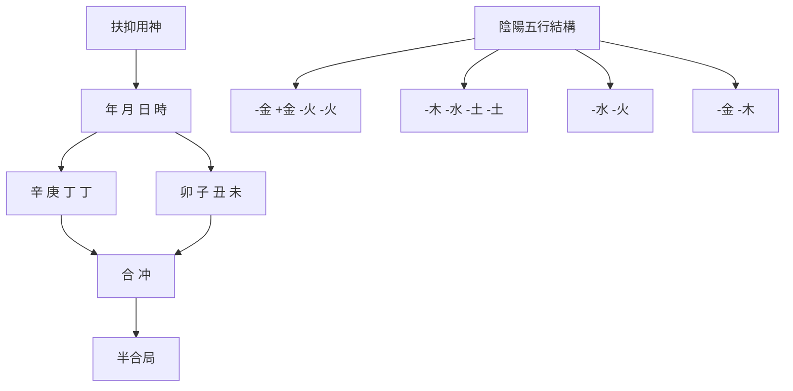
</details>

地支中，子丑合，丑未沖，卯未半合木局。通過強弱分析，我們已經判斷此造是身弱。身弱宜扶助，時干丁火就是它的扶抑用神。丁火唯一的弱根在未字裡。現在，日支與時支丑未相沖，未中的餘氣丁火會受到損傷。然而，丑又與月支子六合，而且位置處於丑未沖之前。這樣，子絆住了丑，削減了丑去沖末的力量，這就是所謂「合能解沖」。於是，時支未被穩定住了。這樣它又與年支卯遙合成半個木局，助長了木的力量。木是生火的，此命造日主身弱，丁火得木生助，便有了生氣。可見，地支上出現的沖合關係，並沒有損害這個八字用神的根基。由此可見，有了干支刑沖會合法則，命理學的分析更加細膩、更加深入了。

再看前一章論及的末代皇帝溥儀命造。我們把命造中地支出現的半合局標記如下：

命例 3：溥儀命造  


<details>
<summary>flowchart</summary>

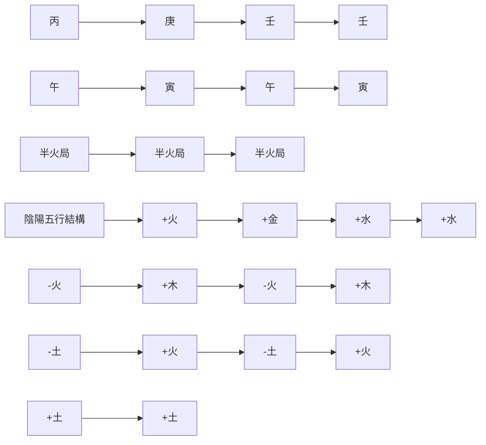
</details>

由於地支皆半合火局，簡直就成了一片火海，日主壬水真是陷於了困境。顯然，地支的刑沖會合，有時會加劇命造結構中本來存在的問題。

# 案例分析

下面我們把強弱分析和刑沖會合放在一起分析幾個命例。

命例 4：軍統頭目戴笠 $^{4}$ （1897-1946）  


<details>
<summary>text_image</summary>

年 月 日 時
丁 乙 丙 丁
酉 巳 戌 酉
辛 丙 戊 辛
庚 辛
戊 丁
祿
陰陽五行結構
- 火 - 木 + 火 - 火
- 金 + 火 + 土 - 金
+ 金 - 金
+ 土 - 火
</details>

首先，我們運用前一章的操作程式對此命造做出日主強弱的分析：

操作-1：（戴笠命造）日主強弱分析  


<details>
<summary>flowchart</summary>

```mermaid
graph TD
    A["日主"] -->|4 (1)| B["火旺"]
    B -->|1 (1)| C["土"]
    C -->|2 (2)| D["金"]
    D -->|0| E["水"]
    E -->|1 木休| F["日主同方"]
    F -->|1 木休| G["日主异方"]
    G -->|2 金死| D
    D -->|囚| E
    E -->|囚| D
```
</details>

日主強弱：極強 很強 強 稍強 中和 稍弱 弱 很弱 極弱


<details>
<summary>text_image</summary>

年 月 日 時
丁 乙 丙 丁
酉 巳 戌 酉
辛 丙 戊 辛
庚 戊 辛
用神 禄 用神
陰陽五行結構
-火 -木 +火 -火
-金 +火 +土 -金
+金 -金
+土 -火
</details>

強弱分析的結果是：日主屬強；扶抑用神是：地支酉金。

為甚麼用神是酉金呢？根據平衡原理，強者宜抑制，故這個命造最好是用水來剋制火勢，通過抑制，求取平衡。可惜八字結構內沒有一滴水，但有金。金處於日主異方、是為丙火所剋的五行，它會消耗火的能量，所以本命造選取金做用神。

再聯繫本章討論的干支「刑沖會合」做進一步的分析：

# 操作 -2 : (戴笠命造)


<details>
<summary>flowchart</summary>

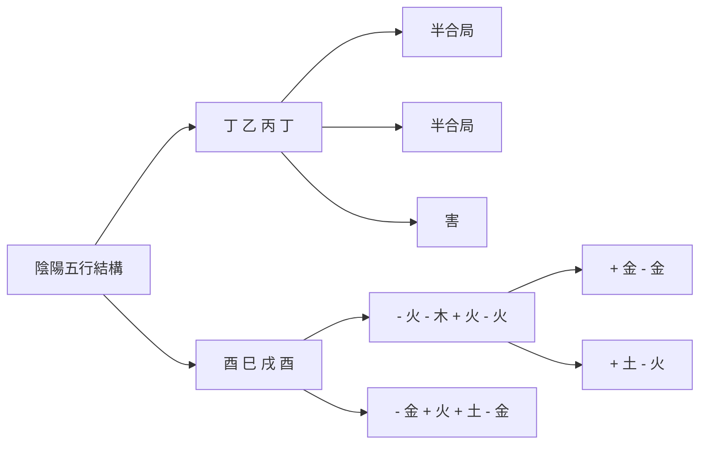
</details>

地支中，兩酉與巳皆半合金局，同時，酉戌相害。這裡，半合金局很重要，因為它能把結構所忌的月令地支巳火絆住，削弱了旺火之勢。同時，一旦有條件，可以化腐朽為神奇，合巳為金。顯然，它們對發揮這個八字內部機制起了重要的作用。

下面是作為民國三大命理學家 $^{⑤}$ 之一的韋千里的八字，我們運用已學的知識來予以分析：

命例 5：韋千里 $^{⑥}$ （1911-1988）  


<details>
<summary>text_image</summary>

年 月 日 時
辛 辛 庚 庚
亥 卯 子 辰
壬 乙 癸 戊
甲
癸
陰陽五行結構
- 金 - 金 + 金 + 金
+ 水 - 木 - 水 + 土
+ 木
- 木
- 水
</details>

因為地支刑沖會合是八字結構中基本的信息，我們可以先把它們標記在八字結構上：

操作 -1：（韋千里命造）標記刑沖會合


<details>
<summary>flowchart</summary>

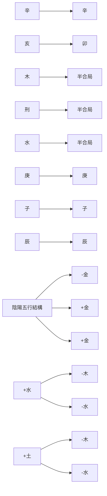
</details>

接着，做日主強弱的分析：

操作 -2：（韋千里命造）比較日主同方和異方的強弱


<details>
<summary>flowchart</summary>

```mermaid
graph TD
    A["土"] -->|1| B["金"]
    B -->|4| C["金囚"]
    C -->|2(1)| D["水"]
    D -->|1(2)| E["木"]
    E -->|0| F["火"]
    F -->|1| G["日主同方"]
    G --> A
    D --> H["相"]
    H --> I["旺"]
    I --> E
    E --> J["日主异方"]
```
</details>

日主同方（囚、死）=5

日主異方（旺、相、休）=3(3)

如果按雙方各自的數量以及時令旺衰程度來比較，似乎不相上下。但考慮到地支發生的兩個半合局——亥卯合半木局、子辰合半水局，再加上天干庚、辛在地支上沒有根基（地支沒有一點金氣），日主同方和異方的力量對比就發生了變化，顯然「偏弱」了：

操作 -3：（韋千里命造）判定日主強弱

日主強弱：極強 很強 強 稍強 中和 稍弱 $\textcircled{弱}$ 很弱 極弱

因為日主弱，那就需要幫扶，用土生金，可取時支辰土為用神。無奈辰已被子合去，無力生金，故只能退而取時干庚金為用神，比助日主，如下：

操作 -4：（韋千里命造）選取用神


<details>
<summary>text_image</summary>

用神
年 月 日 時
辛 辛 庚 庚
亥 卯 子 辰
壬 乙 癸 戊
甲
癸
陰陽五行結構
- 金 - 金 + 金 + 金
+ 水 - 木 - 水 + 土
+ 木
- 木
- 水
</details>

經過以上這四步操作流程，結論是：此命造身弱，選取庚金為扶抑用神。庚金用神雖然完好，但是不夠有力，缺乏強的根基（辰土也已被子合去）。因此，韋千里先生曾自評：「富貴皆無大望，我將永自韜養矣。」

最後，再來看下面晚清名臣李鴻章的命造：

命例 6：李鴻章 $^{⑦}$ （1823-1901）  


<details>
<summary>text_image</summary>

年 月 日 時
癸 甲 乙 己
未 寅 亥 卯
己 甲 壬 乙
丁 丙 甲
乙 戊
墓 生 禄
陰陽五行結構
- 水 + 木 - 木 - 土
- 土 + 木 + 水 - 木
- 火 + 火 + 木
- 木 + 土
</details>

操作 -1：（李鴻章命造）標記刑沖會合  


<details>
<summary>flowchart</summary>

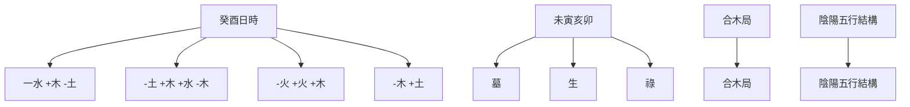
</details>

操作 -2：（李鴻章命造）比較日主同方和異方的強弱  


<details>
<summary>flowchart</summary>

```mermaid
graph TD
    A["日主"] -->|4 (2)| B["木"]
    B --> C["旺"]
    C --> D["火"]
    D --> E["相"]
    E --> F["土"]
    F --> G["死"]
    G --> H["金"]
    H --> I["水"]
    I --> J["休"]
    J --> K["日主同方"]
    F --> L["日主翼方"]
    L --> M["土"]
    M --> N["死"]
    N --> O["金"]
    O --> P["金"]
    P --> Q["金"]
    Q --> R["金"]
    R --> S["金"]
    S --> T["金"]
    T --> U["金"]
    U --> V["金"]
    V --> W["金"]
    W --> X["金"]
    X --> Y["金"]
    Y --> Z["金"]
    Z --> A
```
</details>

日主同方（旺、休）=6(2)

日主異方（相、囚、死）=2(3)

按日主同方和異方的數據，日主應該判定為「很強」。然而，把干支刑沖會合因素考慮進去：地支寅亥合木，亥、卯、未又三合成東方木局。把這兩個「合」放進去，情形顯然發生了很大的變化：地支真成了一片樹林子了，日主從「很強」變成了「極強」：

# 操作 -3：（李鴻章命造）判定日主強弱

日主強弱：極強 很強 強 稍強 中和 稍弱 弱 很弱 極弱

再下面該是「操作 -4：判定用神」。

當日主為「極強」或「極弱」——處於強弱九個等級的兩個極端，這時，命局用神的判別就不能使用慣常的平衡原則了。命理學把這類成就了某種「形象」的八字作為「特殊格」來處理。關於特殊格，我們將在後面第八章裡予以討論。

① 一般認為，甲與庚沖，乙與辛沖，丙與壬沖，丁與癸沖，它們是處於東與西、南與北相對的位置。而丙庚與丁辛相見，則以剋論，不以沖論，因為南與西不相對。至於戊和己，則無沖，因為它們居中，無對立者。  
② 在命理學中，有時也稱「相穿」。  
③ 表中最後一欄「破」，是指地支之間存在的「破」的關係：子酉破，午卯破，申巳破，寅亥破，辰丑破，戌未破。破，一般也不以吉論。在命理分析中，破的關係並不常用。  
4 戴笠（1897-1946），浙江省江山縣保安鄉人，原名春風，字雨農，後改雨濃（因五行缺水）。黃埔軍官學校第六期畢業，長期從事特工與間諜工作，曾負責國民政府情治機關，創立國民政府軍事委員會調查統計局（簡稱軍統），為實際領導人。1946年因飛機失事身亡。  
⑤ 韋千里與袁樹珊、徐樂吾並稱「民國三大命理學家」。  
⑥ 韋千里（1911-1988），父親韋石泉乃職業命師。畢業於上海復旦大學中文系，年輕時就在上海掛牌算命。1933年22歲即發表《精選命理約言》，1934年23歲編輯發行《韋氏命學講義》，以後有《千里命稿》、《相法講義》、《八字提要》、《占卜講義》、《呱呱集》等作品行世。1949年韋氏離開上海，到香港掛牌算命。1988年在香港病逝。  
李鴻章（1823-1901），安徽合肥人。淮軍、北洋水師的創始人和統帥、洋務運動的領袖、晚清重臣，官至直隸總督兼北洋通商大臣，授文華殿大學士。


<details>
<summary>natural_image</summary>

Abstract diagram with concentric curved lines and arrows, no text or symbols present
</details>

# ▼

# 第五章

# 結構分析

# (二)

# 十干和調候

本章將討論八字結構分析的第二個重要視角——調候分析。

# 調候

何謂「調候」？

調候，就是調和氣候。具體來說，八字結構是一個「小宇宙」。在這個結構中，日主是核心，是「我」。除了前文已經討論過的內部存在的「強弱」問題，還有一個環境要素對它自身存在的「適宜」或「不適宜」的問題。命理學把它歸結為八字結構的寒暖燥濕問題。

命理古賦《五行生剋賦》說：

大抵水寒不流，木寒不發，土寒不生，火寒不烈，金寒不熔。皆非天地之正氣也。①

這裡以「寒」為題，指出八字內部要素對外部環境氣候上的要求。如果環境太「寒」的話，無論是哪一種五行，都會喪失生機。命理經典《滴天髓》也說：

天道有寒暖，發育萬物，人道得之不可過也；地道有燥濕，生成品匯，人道得之不可偏也。

這裡，天道、地道者，是指天干、地支。天干，金水為寒，木火為暖。地支，就五行方位而言：西北為濕，東南為燥。若就時令氣候而言：秋冬為寒濕，春夏為暖燥。

以下是五行在四季中性狀的描寫：②

表 5.1 四季五行性状

<table><tr><td></td><td>春</td><td>夏</td><td>秋</td><td>冬</td></tr><tr><td>木</td><td>旺盛</td><td>枯槁</td><td>凋敗</td><td>盤曲</td></tr><tr><td>火</td><td>旺相</td><td>炎燥</td><td>休息</td><td>絕亡</td></tr><tr><td>土</td><td>虛浮</td><td>燥烈</td><td>虛衰</td><td>寒凍</td></tr><tr><td>金</td><td>柔弱</td><td>尤弱</td><td>銳利</td><td>寒冷</td></tr><tr><td>水</td><td>散漫</td><td>衰竭</td><td>旺相</td><td>寒酷</td></tr></table>

顯然，五行在四季氣候環境中有不同的性狀，尤其是夏、冬兩季的寒暖燥濕性狀，它會反映到不同時節出生的八字結構中來。

那麼，八字結構內寒暖燥濕出現了偏頗，怎麼辦？就同我們日常生活遇到的情況一樣，酷暑氣候又悶又熱，期盼來一場及時雨；隆冬時節，又寒又濕，則希望有個暖暖的太陽普照大地。在命理上，即「暖燥太過，喜雨露以潤之；寒濕太過，宜太陽以喧之」。顯然，對於一個八字來說，寒暖燥濕，不能偏枯。如果說，強弱分析一般應用平衡原理，希望日主同方與異方能趨於平衡，那麼，調候，也可以歸結為日主在環境氣候的寒暖、燥濕方面，希望達到平衡的訴求。

調候 …… 日主對出生時環境要素（寒暖燥濕）的特殊要求

# 十干類象

既然我們談到日主在寒暖燥濕方面有調候的訴求，那麼首先要討論可以充當日主的十個天干的性質和特徵。命理學是用喻象的方法來表述十個天干的個性，這種表述也稱為十干類象。我們把十干的喻象性格整理為下表：

表 5.2 十干喻象及其性質

<table><tr><td>天干</td><td>陰陽</td><td>喻象</td><td>性質</td></tr><tr><td>甲</td><td>陽木</td><td>松柏,喬木,棟梁</td><td>剛健,正直,積極</td></tr><tr><td>乙</td><td>陰木</td><td>芝蘭,灌木,花草</td><td>柔弱,巧變,韌性</td></tr><tr><td>丙</td><td>陽火</td><td>太陽</td><td>熱情,結實,坦白</td></tr><tr><td>丁</td><td>陰火</td><td>月亮,燈燭</td><td>纖細,敏捷,慧黠</td></tr><tr><td>戊</td><td>陽土</td><td>城牆,堤岸</td><td>厚重,單調,高亢</td></tr><tr><td>己</td><td>陰土</td><td>田園,軟土</td><td>平坦,博厚,謙虛</td></tr><tr><td>庚</td><td>陽金</td><td>頑鐵,寶劍</td><td>堅硬,銳利,硬直</td></tr><tr><td>辛</td><td>陰金</td><td>珠玉,鑽石</td><td>敏感,溫清,秀氣</td></tr><tr><td>壬</td><td>陽水</td><td>江湖,汪洋</td><td>明朗,清澈,爽快</td></tr><tr><td>癸</td><td>陰水</td><td>雨露,泉水</td><td>包容,婉轉,變化</td></tr></table>

用某種物象來做譬喻，是我們先人解讀干支密碼的主要方式。從表中可以看到，甲木是陽木。它被看做是類似於松柏之類的挺拔向上的喬木，或者是已經裁截下來可以充當房屋棟梁的大木料。它顯現出剛健、正直、積極的個性。與甲木不同，乙木則是貼近大地的花草和灌木。它柔弱、嬌嫩，但具有韌性，不像筆直的喬木，容易折斷。此表概述了十天干各自的喻象及其性質。

# 十干調候喜用提要

命理學史上，系統地討論調候問題的經典著作是《窮通寶鑒》（原名《攔江網》）。它是「以十干配十二月，察其生旺休囚，以定取用之準則」 $^{③}$ 。因此它的編排方式，是以十個天干分別對照十二個月，討論其取用的準則和內容，共一百二十組。台灣梁湘潤先生把它們編錄在以下十日干「調候用神表」中： $^{④}$

表 5.3 調候用神表

<table><tr><td rowspan="2"></td><td>寅</td><td>卯</td><td>辰</td><td>巳</td><td>午</td><td>未</td><td>申</td><td>酉</td><td>戌</td><td>亥</td><td>子</td><td>丑</td></tr><tr><td>正月</td><td>二月</td><td>三月</td><td>四月</td><td>五月</td><td>六月</td><td>七月</td><td>八月</td><td>九月</td><td>十月</td><td>十一月</td><td>十二月</td></tr><tr><td>甲</td><td>丙癸</td><td>庚丙戊丁己</td><td>庚丁壬</td><td>癸丁庚</td><td>癸丁庚</td><td>癸丁庚</td><td>庚丁壬</td><td>庚丁丙</td><td>庚甲壬丁癸</td><td>庚丁戊丙</td><td>丁庚丙</td><td>丁庚丙</td></tr><tr><td>乙</td><td>丙癸</td><td>丙癸</td><td>癸丙戊</td><td>癸</td><td>癸丙</td><td>癸丙</td><td>丙癸己</td><td>癸丙丁</td><td>癸辛</td><td>丙戊</td><td>丙</td><td>丙</td></tr><tr><td>丙</td><td>壬庚</td><td>壬己</td><td>壬甲</td><td>壬庚癸</td><td>壬庚</td><td>壬庚</td><td>壬戊</td><td>壬癸</td><td>甲壬</td><td>甲戊庚壬</td><td>壬戊己</td><td>壬甲</td></tr><tr><td>丁</td><td>甲庚</td><td>庚甲</td><td>甲庚</td><td>甲庚</td><td>壬庚癸</td><td>甲壬庚</td><td>甲庚丙戊</td><td>甲庚丙戊</td><td>甲庚戊</td><td>甲庚</td><td>甲庚</td><td>甲庚</td></tr><tr><td>戊</td><td>丙甲癸</td><td>丙甲癸</td><td>甲丙癸</td><td>甲丙癸</td><td>壬甲丙</td><td>癸丙甲</td><td>丙癸甲</td><td>丙癸</td><td>甲丙癸</td><td>甲丙</td><td>丙甲</td><td>丙甲</td></tr><tr><td>己</td><td>丙庚甲</td><td>甲癸丙</td><td>丙癸甲</td><td>癸丙</td><td>癸丙</td><td>癸丙</td><td>丙癸</td><td>丙癸</td><td>甲丙癸</td><td>丙甲戊</td><td>丙甲戊</td><td>丙甲戊</td></tr><tr><td>庚</td><td>戊甲丙壬丁</td><td>丁甲丙庚</td><td>甲丁壬癸</td><td>壬戊丙丁</td><td>壬癸</td><td>丁甲</td><td>丁甲</td><td>丁甲丙</td><td>甲壬</td><td>丁丙</td><td>丁甲丙</td><td>丙丁甲</td></tr><tr><td>辛</td><td>己壬庚</td><td>壬甲</td><td>壬甲</td><td>壬甲癸</td><td>壬己癸</td><td>壬庚甲</td><td>壬甲戊</td><td>壬甲</td><td>壬甲</td><td>壬丙</td><td>丙戊壬甲</td><td>丙壬戊己</td></tr><tr><td>壬</td><td>庚丙戊</td><td>戊辛庚</td><td>甲庚</td><td>壬辛庚癸</td><td>癸庚辛</td><td>辛甲</td><td>戊丁</td><td>甲庚</td><td>甲丙</td><td>戊丙庚</td><td>戊丙</td><td>丙丁甲</td></tr><tr><td>癸</td><td>辛丙</td><td>庚辛</td><td>丙辛甲</td><td>辛</td><td>庚壬癸</td><td>庚辛壬癸</td><td>丁</td><td>辛丙</td><td>辛甲壬癸</td><td>庚辛戊丁</td><td>丙辛</td><td>丙丁</td></tr></table>

注意表中調候分月所喜天干排列的次序，它往往顯示出需求緊要程度的相對次序。比如，正月甲木，表中所載的調候用神為丙、癸。但丙和癸並不是處於同等的地位。因為時在正月，氣候還較寒冷，因此是「先丙後癸」。或者說，是丙火為主，癸水為佐。因為此時用丙火照暖是最重要的。當然，具體應用還要根據八字結構本身的寒暖燥濕特點來選取。

# 「調候為急」

前文已經提到，「調候」，就是調和氣候，也就是調和人跟環境之間的關係。人生活在這個地球上，必須要有一個「寒暖燥濕」既不太「偏」、也不太「過」的環境。這是人能活動於天地之間的最起碼的外界條件。沒有這樣的條件，人類如何維持生存呢？因此，當八字結構中出現調候的偏向時，「調候為急」——調候必須優先考慮——就成了命理中一條重要原則。

那麼，如何來確定八字結構的寒暖燥濕狀況呢？

實際上，寒暖是溫度；燥濕是乾濕度。寒暖主要是氣候；燥濕當以局勢論。作為克服這類障礙的主要手段，對於「暖燥」太過的狀況，最好是「雨露潤之」——用癸水滋潤；對於「寒濕」太過的狀況，則莫過於「太陽暄之」——用丙火照暖。在一般的情況下，夏天是容易引起暖燥的季節，冬天則是容易引起寒濕的季節，因此，如果觀察一下以上十日干「調候用神表」，癸水和丙火自然成了夏季三月和冬季三月中出現頻率最高的天干。可以說，各個天干，夏季基本上都離不開癸水，冬季都離不開丙火。因此，癸和丙，是最重要的調候要素。

所以，夏天出生的人，命局中有癸水；冬天出生的人，命局中有丙火，都可算得上是「得天獨厚」的人了，至少其八字結構已經在相當程度上排除了「調候」偏頗的問題。

比如以下的北宋名臣、改革家王安石 $^{⑤}$ 的命造：

命例 7：王安石（1021-1086）  


<details>
<summary>text_image</summary>

年 月 日 時
辛 庚 癸 丙
酉 子 未 辰
辛 癸 己 戊
丁 乙
乙 癸
半合局
陰陽五行結構
- 金 + 金 - 水 + 火
- 金 - 水 - 土 + 土
- 火 - 木
- 木 - 水
</details>

我們先做日主強弱分析：

操作 -1：（王安石命造）日主強弱分析  


<details>
<summary>flowchart</summary>

```mermaid
graph TD
    A["水旺"] -->|2(1)| B["水"]
    B -->|0(2)| C["木"]
    C -->|1(1)| D["火"]
    D -->|1(1)| E["土"]
    E -->|2| F["金"]
    F -->|3| G["日主同方"]
    G -->|0| H["日主異方"]
    H -->|1| D
    D -->|2| I["囚"]
    I -->|2| J["相"]
    J --> C
```
</details>

日主強弱：極強 很強 強 稍強 中和 稍弱 弱 很弱 極弱

顯然，八字結構金水甚旺，再加上地支子、辰又半合水局，日主實際已偏向「很強」。這時，扶抑用神只能從日主異方找。可以用土制水，可以用木洩水，可惜兩者都沒有透出天干。透出天干的是丙火，它可以制金耗水，故取為扶抑用神。標示如下：

操作 -2：（王安石命造）求取扶抑用神  


<details>
<summary>flowchart</summary>

```mermaid
graph TD
    A["用神"] --> B["陰陽五行結構"]
    B --> C["辛 庚 癸 丙"]
    B --> D["酉 子 未 辰"]
    C --> E["-金 +金 -水 +火"]
    D --> F["-金 -水 -土 +土"]
    E --> G["-火 -木"]
    F --> H["-木 -水"]
```
</details>

現在進入調候分析。

調候的問題是八字結構結合時令而產生的寒暖燥濕偏向的問題。它有兩個關鍵點：一是月令，因為寒暖出於月令氣候；一是八字內部天干地支所呈現出來的寒暖燥濕狀況。

先談八字內部，也就是干支所具有的寒暖燥濕性質。一般講，木火為暖、為燥；金水為寒、為濕。 $^{②}$ 至於土，則要分成兩類：乾土和濕土。天干戊與地支戌、未是乾土，乾土多了又會生燥；天干己與地支辰、丑是濕土，濕土多了也會助長濕氣。因此，在命理的具體分析中，乾土能止水，但不能晦火；濕土能晦火，但不能止水。

# 干支寒暖燥濕計分

為了方便初學者，我擬構了以下干支所含有的暖燥與寒濕的不同計分。暖燥為正值；寒濕為負值。計分數值分配如下：⑦

表 5.4 天干寒暖燥濕計分表

<table><tr><td>甲</td><td>乙</td><td>丙</td><td>丁</td><td>戊</td><td>己</td><td>庚</td><td>辛</td><td>壬</td><td>癸</td></tr><tr><td>+3</td><td>+1</td><td>+6</td><td>+4</td><td>+5</td><td>-4</td><td>-1</td><td>-3</td><td>-5</td><td>-6</td></tr></table>

表 5.5 地支寒暖燥濕計分表

<table><tr><td>寅</td><td>卯</td><td>辰</td><td>巳</td><td>午</td><td>未</td><td>申</td><td>酉</td><td>戌</td><td>亥</td><td>子</td><td>丑</td></tr><tr><td>+3</td><td>+1</td><td>-4</td><td>+5</td><td>+6</td><td>+3</td><td>-2</td><td>-3</td><td>+4</td><td>-5</td><td>-6</td><td>-4</td></tr></table>

雖然地支已經反映了寒暖燥濕程度，可以再進一步加上標記月令的計分：

表 5.6 月令寒暖燥濕加分

<table><tr><td>正</td><td>二</td><td>三</td><td>四</td><td>五</td><td>六</td><td>七</td><td>八</td><td>九</td><td>十</td><td>十一</td><td>十二</td></tr><tr><td>寅</td><td>卯</td><td>辰</td><td>巳</td><td>午</td><td>未</td><td>申</td><td>酉</td><td>戌</td><td>亥</td><td>子</td><td>丑</td></tr><tr><td>0</td><td>+1</td><td>+2</td><td>+3</td><td>+4</td><td>+3</td><td>0</td><td>-1</td><td>-2</td><td>-3</td><td>-4</td><td>-4</td></tr></table>

我們可以把干支相應的寒暖燥濕計分標記到八字上去：

操作 -3：（王安石命造）調候：干支標記


<details>
<summary>text_image</summary>

陰陽五行結構
-3 -1 -6 +6
辛 庚 癸 丙
酉 子 未 辰
-3 -6 +3 -4
-4
半合局
-金 +金 -水 +火
-金 -水 -土 +土
-火 -木
-木 -水
</details>

我們把干支寒暖燥濕計分加起來，最後再加上月令計分：

年干 月干 日干 時干 年支 月支 日支 時支 月令 總計

$$
(- 3) + (- 1) + (- 6) + (+ 6) + (- 3) + (- 6) + (+ 3) + (- 4) + (- 4) = - 1 8
$$

由此得到此結構的寒暖燥濕度， $^{⑧}$ 同時，再把月令填上：

操作 -4：（王安石命造）調候：評估

月令：冬季子月

寒暖燥濕度：-18

結論： 暖燥 中和

寒濕

一般來說，一個八字結構的寒暖燥濕度在 +6 和 -6 之間，可以看作是基本「中和」（平衡）；若大於 +6 或小於 -6，就是進入偏頗狀態了。這個結構是 (-14)，再加上生於冬季子月天寒地凍，計分為 (-4)，於是「寒暖燥濕度」是 (-18)，顯然是過於寒濕了。

同強弱分析一樣，發現問題是為了解決問題。調候有偏頗，八字結構中有沒有幫助解決這個調候偏頗的機制？這個機制，就是用神。因為此用神是幫助解決結構的寒暖燥濕問題，所以稱為「調候用神」。接下來是選取調候用神：

操作 -5：（王安石命造）求取調候用神


<details>
<summary>flowchart</summary>

```mermaid
graph TD
    A["用神"] --> B["陰陽五行結構"]
    B --> C["辛 庚 癸 丙"]
    B --> D["酉 子 未 辰"]
    C --> E["-金 +金 -水 +火"]
    D --> F["-金 -水 -土 +土"]
    E --> G["-火 -木"]
    F --> H["-木 -水"]
```
</details>

王安石是幸運的。如圖所示，時干丙火正是此結構中擔任調候用神的最佳角色。這是寒冬的太陽啊！

這時，我們可以再對照前面的「調候用神表」(表 5.3)，查看子月（11 月）癸水的調候用神。表中所錄是：丙、辛。這是說，八字中有丙火和辛金，調候方面就自足了。實際上，它表明，癸水在子月時的最佳訴求是：用丙照暖，用辛滋扶。事實上，此命造中，這兩者都具有了。但由於身強水旺，因而寒濕，這裡丙火的功用遠大於辛金。（從強弱分析角度，辛金是忌神。）所以，根據本命造的實際情況，我們只選取丙火為用神。

分析就此暫告段落。此命造中，一個丙字，兼顧了扶抑和調候兩種功能。王安石任宰相時，本着「天命不足畏，人言不足恤，祖宗不足法」，發動改革，推行新法，史稱「王安石變法」。這是中國歷史上一次著名的變法運動。雖然變法以失敗告終，但這種勇氣、這種銳進的氣概，從命理上看，是否正來自這冬日的一輪紅日？

# 案例分析

下面我們再來看戴笠的命造（命例 4）。前文已做過強弱分析，這裡不贅述，直接進入調候分析程式：

操作 -1：（戴笠命造）調候：干支標記


<details>
<summary>text_image</summary>

陰陽五行結構
丁 乙 丙 丁
酉 巳 戌 酉
-3 +5 +4 -3
+3
半合局 半合局
-火 -木 +火 -火
-金 +火 +土 -金
+金 -金
+土 -火
</details>

把干支寒暖燥濕計分加起來：

年干 月干 日干 時干 年支 月支 日支 時支 月令 總計

$$
(+ 4) + (+ 1) + (+ 6) + (+ 4) + (- 3) + (+ 5) + (+ 4) + (- 3) + (+ 3) = + 2 1
$$

由此得到此結構的寒暖燥濕度，同時，再把月令填上：

操作 -2：（戴笠命造）調候：評估

月令：夏季巳月 寒暖燥湿度：+21 結論：暖燥 中和 寒濕

顯然，評估的結果是很「暖燥」。查前面的「調候用神表」（表5.3），丙火巳月（四月），調候用神是「壬、庚、癸」。當然，首選是壬水。因為巳月火神司令，專用壬水以濟火。次用庚金，用庚金來濟水。若無壬水，姑用癸水，去其燥烈。查看這個八字，此三者皆無。八字本身又十分炎燥，可見調候方面基本是失敗的：沒有有效的調候用神。現在權且用地支酉中辛金充當八字結構的調候要素，標記如下：

操作 -3：（戴笠命造）求取調候用神


<details>
<summary>text_image</summary>

年 月 日 時
丁 乙 丙 丁
酉 巳 戌 西
(調候用神)
(調候用神)
陰陽五行結構
- 火 - 木 + 火 - 火
- 金 + 火 + 土 - 金
+ 金 - 金
+ 土 - 火
</details>

酉金原先就是此八字的扶抑用神，現在只能用它兼顧調候。但八字過燥的問題並沒有得到有效解決。命理學認為：過於燥者，烈而有禍；過於濕者，滯而無成。當年戴笠不顧左右的規勸，強令駕駛員在氣候惡劣的條件下冒險起飛，最後空難而殞命。他的八字結構如此燥烈，是否也孕育了這種機毀人亡的悲慘結局？

再看一個命例：

命例 8：彭玉麟 $^{⑨}$ （1816-1890）  


<details>
<summary>flowchart</summary>

```mermaid
graph TD
    A["陰陽五行結構"] --> B["合"]
    A --> C["合"]
    B --> D["丙"]
    B --> E["辛"]
    B --> F["戊"]
    B --> G["癸"]
    B --> H["子"]
    B --> I["丑"]
    B --> J["子"]
    B --> K["丑"]
    B --> L["癸"]
    B --> M["己"]
    B --> N["癸"]
    B --> O["己"]
    B --> P["癸"]
    B --> Q["辛"]
    B --> R["辛"]
    B --> S["合"]
    C --> T["+火 -金 +土 -水"]
    C --> U["-水 -土 -水 -土"]
    C --> V["-金 -金"]
    C --> W["-水 -水"]
```
</details>

彭玉麟是晚清中興名臣、湘軍水師統帥。下面對其命造做出調候分析：

操作 -1：（彭玉麟命造）調候：干支標記


<details>
<summary>text_image</summary>

合
+ 6 - 3 + 5 - 6
丙 辛 戊 癸
子 丑 子 丑
- 6 - 4 - 6 - 4
- 4
合 合
陰陽五行結構
+ 火 - 金 + 土 - 水
- 水 - 土 - 水 - 土
- 金 - 金
- 水 - 水
</details>

把干支寒暖燥濕計分加起來：

$$
(+ 6) + (- 3) + (+ 5) + (- 6) + (- 6) + (- 4) + (- 6) + (- 4) + (- 4) = - 2 2
$$

由此得到此結構的寒暖燥濕度：

操作 -2：（彭玉麟命造）調候：評估

月令：冬季丑月

寒暖燥濕度：-22

結論： 暖燥 中和


結論是很「寒濕」。進一步求取調候用神。查「調候用神表」，戊日丑月調候用神為：丙、甲。顯然，十二月天寒地凍，先取丙火照暖驅寒，然後用甲木疏土。故丙火是首選。

操作 -3：（彭玉麟命造）求取調候用神


<details>
<summary>flowchart</summary>

```mermaid
graph TD
    A["調候用神"] --> B["合"]
    B --> C["丙 子 子 子 子 子 子 子 子 子 子 子 子 子 子 子 子 子 子 子 子 子 子 子 子 子 子 子 子 子 子 子 子 子 子 子 子 子 子 子 子 子 子 子 子 子 子 子 子 子 子 孱"]
    C --> D["陰陽五行結構"]
    D --> E["+ 火 - 金 + 土 - 水"]
    D --> F["- 水 - 土 - 水 - 土"]
    D --> G["- 金 - 金"]
    D --> H["- 水 - 水"]
```
</details>

彭玉麟是幸運的，八字丙火高透年干之上，猶如紅日高照，有驅寒生土之功。但白玉有瑕，丙火被相鄰的月干辛金合住，遭到了羈絆，好像紅日被雲霧遮擋住了。⑩ 彭玉麟善繪梅花，以畫梅名世，曾吟詠「一生知己是梅花」。據說是思念他的少年情人梅姑，誓言畫梅萬幅，以紀念兩人深愛之情。⑪ 他終生沒有掙脫出這個「情」字。這與八字多含有關。天干丙辛合，戊癸合，地支子丑合，子丑合，且排列十分整齊，氣勢清純可嘉。故為官清廉，軍功卓著。但終身為情所困，鐵血痴情融於一身，莫非命矣。

# 對五行的再認識

通過八字結構調候需求的分析，我們可以進一步看到，五行本身的生剋也離不開環境氣候條件的許可。

比如，金能生水，這是五行相生的正常規律。但冬月之金，形寒性冷，若要生水，必須要得到火的照暖，這樣暖氣上騰，遇寒化為濕潤，金由此得以生水。而春夏之金，就不需要這樣的條件，因為外界氣候本來就暖和的緣故。

同樣，水能生木，但是冬木必須得火方有生意，因為外界的氣候太寒冷了，寒水凍結，無法生木。至於到了炎夏，涸水又難生枯木，這時需要金來扶其源，源遠流長，方能擔負生木的功能。

再如，木能生火，但夏木見火，反而自己遭到焚滅。因為乾薪烈焰，玉石俱焚。此時必須有水，木之根只有得到了水的滋潤，方能有木火通明之象。

同樣，土能生金，但夏月火旺土燥，反而熔金。只有在水的潤澤下，金方能獲得盎然生機。所以濕土生金，燥土不生金。

顯然，五行的正常生化依賴於正常的客觀環境。沒有正常的客觀環境，五行的生化就會遇到障礙。這時，最重要的事，就是要克服這樣的障礙，也就是說，必須採取「調候」的措施。

其實，五行除了正常的生剋之外，還有反生、反剋現象，稱為反生反剋原理。這也是命理中五行生剋的重要現象。比如：

金賴土生，土多金埋；土賴火生，火多土焦；火賴木生，木多火塞；木賴水生，水多木漂；水賴金生，金多水濁。

這是生扶太過，使受生者反遭其害。

金能生水，水多金沉；水能生木，木多水縮；木能生火，火多木焚；火能生土，土多火晦；土能生金，金多土弱。

這是我生反為剋我，所謂子旺母衰。

金能剋木，木堅金缺；木能剋土，土重木折；土能剋水，水多土流；水能剋火，火多水灼；火能剋金，金多火熄。

這是本為我剋，由於被剋者強盛，我反而遭損。

金衰遇火，必見銷熔；火弱逢水，必為熄滅；水弱逢土，必為淤塞；土衰遇木，必被傾陷；木弱遇金，必被砍斫。

由於我自身衰弱，已經經不起進一步的剋制了。

強金得水，方銼其鋒；強水得木，方緩其勢；強木得火，方洩其英；強火得土，方斂其焰；強土得金，方化其頑。

強勢的我，只有通過宣洩，方能取得平和。

可見五行的相生相剋，只有在雙方勢力相當的情況下才能正常進行，不然就會出現反生反剋現象，這是論命時必須注意到的。

①《淵海子平·五行生剋賦》。  
② 蔣翰洋《子平二十四法易學易用》（台灣武陵出版社，1999年），第56-9頁。  
③ 徐樂吾語。  
4 錄自梁湘潤《余氏用神辭淵》。  
⑤ 王安石（1021-1086），字介甫，號半山，漢族，臨川（今江西撫州市臨川區）人，北宋著名的思想家、政治家、文學家、改革家。  
6 作為初級教程，這裡就不區分庚金與辛金的燥濕區別了。  
⑦ 這裡的計分是粗略的，只是為了幫助初學者瞭解和掌握寒暖燥濕的狀況而設計的。  
⑧ 這裡還可以加上地支子辰半合水局的份量。  
9 彭玉麟（1816-1890），字雪琴，號退省庵主人，祖籍衡永郴桂道衡州府衡陽縣（今衡陽市衡陽縣渣江），生於安徽省安慶府（今安慶市內）。清朝著名政治家、軍事家、書畫家，人稱雪帥。與曾國藩、左宗棠、胡林翼並稱中興四大名臣，湘軍水師創建者、中國近代海軍奠基人。官至兩江總督兼南洋通商大臣，兵部尚書。  
10 中年大運得南方火地，使用神丙火得根，帶領湘軍水師，屢建奇功。  
③ 據羅爾綱考證，梅姑本是彭玉麟外祖母的養女，以輩分而言，較彭玉麟年長，人稱梅姑。彭玉麟稱她「姑姑」。兩人年紀相約，青梅竹馬，情慄漸生，以至私許終身。但有礙於輩分，兩人始終未能結合。後來梅姑另嫁，難產而死。彭玉麟痛不欲生，在梅姑墓前立誓，畫梅萬幅，用來紀念兩人之情。


<details>
<summary>natural_image</summary>

Abstract diagram with concentric and curved dotted lines forming a spiral or wave pattern (no text or symbols)
</details>

# ▼第六章 結構分析（三）

# 十神和格局

本章將討論八字結構分析的第三個重要視角——格局分析。

在中國命理學史上，有兩個重要時期：古法時期和今法時期。 $^{①}$ 古法時期始於唐代李虛中 $^{②}$ ，因為他開創了古法模型。古法模型的特點是：以年柱為核心，使用納音 $^{③}$ 作為運算工具來論命。今法時期始於五代宋初的徐子平 $^{④}$ ，他開創了今法模型。今法模型的特點是：結構的核心移到了日干（我們稱之為日主），它放棄了納音，而採用正五行為運算工具來論命。今法模型一直沿用到今天。本書敘述和討論的內容，都是在今法模型的框架內展開的。傳統命理學也稱「子平」術，子平就是徐居易的字，用以紀念徐子平對命理學所做出的歷史貢獻。

其實，徐子平的功績並不僅限於重新確定了八字結構的核心，同時「專主五行，不主納音」。還有一個十分重要的方面是，他突破了「喻象」分析層面，開始向「關係」分析層面轉移。這就是「十神」概念的形成和設立，並開啟了由十神到格局的全面研究。這正是本章要講述的內容。

# 十神

甚麼是十神？

所謂「十神」，就是日干與其他成分的陰陽五行之間關係的代名詞。具體來說，當我們確定了八字結構中日柱天干為日主，也就確定了日主的陰陽五行屬性。它是十個天干中的一個。那麼，它跟其他可能遇上的十個天干之間將構成甚麼樣的關係呢？前文已經談過，由於有地支藏遁，地支可以表述為不同的天干成分。因此，要討論日主跟結構中其他七個干或支的關係，都可以統一到天干符號上來。所以確定它們之間的關係，並冠以一定的名稱，是分析工作的開始，也是進一步剖析的必要前提。因為有十種關係，就有了十種名稱，統稱為「十神」。它們是：比肩、劫財、傷官、食神、正財、偏財、正官、七殺、正印、偏印。

十神 …… 日干與其他成分的陰陽五行之間關係的代稱

下面是「天干十神表」:

表 6.1 天干十神表

<table><tr><td>十神日干</td><td>比肩</td><td>劫财</td><td>食神</td><td>傷官</td><td>偏財</td><td>正財</td><td>七殺</td><td>正官</td><td>偏印</td><td>正印</td></tr><tr><td>甲</td><td>甲</td><td>乙</td><td>丙</td><td>丁</td><td>戊</td><td>己</td><td>庚</td><td>辛</td><td>壬</td><td>癸</td></tr><tr><td>乙</td><td>乙</td><td>甲</td><td>丁</td><td>丙</td><td>己</td><td>戊</td><td>辛</td><td>庚</td><td>癸</td><td>壬</td></tr><tr><td>丙</td><td>丙</td><td>丁</td><td>戊</td><td>己</td><td>庚</td><td>辛</td><td>壬</td><td>癸</td><td>甲</td><td>乙</td></tr><tr><td>丁</td><td>丁</td><td>丙</td><td>己</td><td>戊</td><td>辛</td><td>庚</td><td>癸</td><td>壬</td><td>乙</td><td>甲</td></tr><tr><td>戊</td><td>戊</td><td>己</td><td>庚</td><td>辛</td><td>壬</td><td>癸</td><td>甲</td><td>乙</td><td>丙</td><td>丁</td></tr><tr><td>己</td><td>己</td><td>戊</td><td>辛</td><td>庚</td><td>癸</td><td>壬</td><td>乙</td><td>甲</td><td>丁</td><td>丙</td></tr><tr><td>庚</td><td>庚</td><td>辛</td><td>壬</td><td>癸</td><td>甲</td><td>乙</td><td>丙</td><td>丁</td><td>戊</td><td>己</td></tr><tr><td>辛</td><td>辛</td><td>庚</td><td>癸</td><td>壬</td><td>乙</td><td>甲</td><td>丁</td><td>丙</td><td>己</td><td>戊</td></tr><tr><td>壬</td><td>壬</td><td>癸</td><td>甲</td><td>乙</td><td>丙</td><td>丁</td><td>戊</td><td>己</td><td>庚</td><td>辛</td></tr><tr><td>癸</td><td>癸</td><td>壬</td><td>乙</td><td>甲</td><td>丁</td><td>丙</td><td>己</td><td>戊</td><td>辛</td><td>庚</td></tr></table>

從表中，我們可以查到日干與其他任何一個天干之間的關係。比如，日干甲遇到八字或大運中出現的另一個甲，這個甲就是日干的比肩；遇到乙，是日干的劫財；遇到丙，是食神；遇到丁，是傷官；……順序查找，便可以得到它們各自的十神名稱。

前文討論日主強弱時，我們已經指出，按五行的生剋關係，從日干出發，可以構成「生我」、「我生」、「剋我」、「我剋」和「同我」等五種關係。事實上，再把五行的陰陽區分放了進去，五種關係就變成了十種關係。上表羅列的就是這十種關係。十神就是這十種關係的代名詞。

具體來說，「生我」者，為正印、偏印（也稱梟印）；「我生」者，為傷官、食神；「剋我」者，為正官、七殺（也稱偏官）；「我剋」者，為正財、偏財；「同我」者，為比肩、劫財。它們之間的關係可以圖示如下：

圖 6.1 十神生剋關係（圖中實線表示相生關係；虛線表示相剋關係）  


<details>
<summary>flowchart</summary>

```mermaid
graph TD
    A["日主比肩、劫財"] --> B["傷官、食神"]
    B --> C["正財、偏財"]
    C --> D["正官、七殺"]
    D --> E["正印、偏印"]
    E --> A
    A -.-> C
    C -.-> D
    D -.-> E
    E -.-> A
```
</details>

因為天干之間有陽見陽、陰見陰、陽見陰、陰見陽的分別，所以把異性相遇——陽見陰或陰見陽——歸納為：正印、傷官、正官、正財、劫財；把同性相遇——陽見陽或陰見陰——歸納為：偏印、食神、七殺、偏財，比肩。

例如，日干（我）為甲木，他干若是庚金。因為庚金是剋甲木的，跟甲木構成「剋我」的關係；同時，甲跟庚又同為陽干，是「同性相遇」，所以，庚金為日主甲木的七殺。若他干是癸水，癸水生甲木，是「生我」關係，而且，甲木遇癸水是陽見陰，是「異性相遇」，所以，癸水為甲木之正印。顯然，這是根據日主跟各天干陰陽五行之間的生剋關係，對已有的天干符號的再一次符號化。

於是，對一個已經排好的八字，就可以根據上表，把十神符號標記在各個字的上下。這樣，各個天干以及地支內所藏的人元，它們跟日主的關係便通過標記的十神符號而一目了然了。

下面我們以毛澤東的八字為例：

命例 9：毛澤東（1893-1976）  


<details>
<summary>text_image</summary>

七殺 正印 正印
癸 甲 丁 甲
巳 子 酉 辰
丙 劫財 癸 七殺 辛 偏財 戊 傷官
庚 正財
戊 傷官
癸 七殺
陰陽五行結構
- 水 + 木 - 火 + 木
+ 火 - 水 - 金 + 土
+ 金
+ 土
- 木
- 水
</details>

我們把十神的內容填寫到以上的八字結構裡。實際上，就是將八字結構中的成分與日主進行比較，依照「天干十神表」，把它們之間的關係一一找出，然後分別填寫到各自的位置上。

比如，年干癸水，它跟日主丁火的關係，是癸剋丁；同時，癸和丁都是陰干，是同性相遇，故癸是丁的七殺；月干甲木，它跟日主丁火的關係，是甲生丁；同時，甲是陽干，丁是陰干，是異性相遇，故甲是丁的正印。這也可以從天干十神表中直接查出。

十神關係的確立，大大擴大了命理描寫的廣度和深度。它從原本五行「喻象」分析的層面，即直接用五行生剋關係的類象來討論各成分之間的關係，拓進到了「關係」分析的層面，即通過反映五行生剋關係的代名詞——十神來予以討論，這樣做便具有了更大的概括性。

# 如何取格局？

確定了八字結構內各成分的十神關係後，接下來的重要任務，就是選取格局。

甚麼是格局？這是命理學中一直令人困擾的名詞。因為它在命理發展歷史過程中曾有過不同的含義。這裡不去追溯它的來龍去脈。對於初學者來說，格局，就是八字結構的大的分類。任何有意義的研究，面對紛雜眾多的現象，總要先做出分類，才能進行深入分析。就像植物學研究，對種類繁雜的植物要進行分類一樣，既然我們從五行走到了十神，那麼，格局也可以分成十種。它們是：傷官格、食神格、正財格、偏財格、正官格、七殺格、正印格、偏印格，以及建祿格、劫刃格。

格局——— 傷官格、食神格、正財格、偏財格、正官格、七殺格、正印格、偏印格、建祿格、劫刃格

如何選取格局？根據我自己幾十年學習命理的經驗，簡單地說，就是比較八字結構中存在的各種勢力，從中選取最能影響此結構的主導力量，以此（十神）為格局。因為它是這個結構性質的主要代表，它決定了這個命造的主要趨向。

比如上面列舉的毛澤東的命造，哪一種十神是這個結構內部的主導勢力呢？

這裡介紹我為初學者設計的兩種圖解的方法：

第一種，用畫線的方法，通過分析八字結構內部成分干支關係，直接找出主導勢力。其步驟如下：

# 操作 -1 : (毛澤東命造)

排出八字。尋找結構中天干的「根」，即：將年、月、日、時的天干，跟它們地支上的「根」用線連接起來。（可參考表3.5十干旺衰狀態表）「強根」（即天干在地支上的「祿」和「旺」）用直線連接；「弱根」（即天干在地支中的「生」、「餘氣」和「墓」）用虛線連接。前者出現在地支的本氣位置上；後者出現在地支的附屬之氣中。連線自左向右，由天干到地支。連線如下：


<details>
<summary>text_image</summary>

陰陽五行結構
七殺 正印 正印
癸 甲 丁 甲
巳 子 酉 辰
丙 劫財 癸 七殺 辛 偏財 戊 傷官
庚 正財 乙 偏印
戊 傷官 癸 七殺
半金局 合
半水局
本氣
</details>

操作 -2：（毛澤東命造）接着，比較這些連線，找出勢力最強的那個天干，作為本命造的格局。如果沒有天干，就找地支，尋找的次序，則是從月令地支開始，因為月令地支代表了此時令中最強的五行氣息。

上圖中四個天干在地支上都有「根」。癸水通根於月令地支子水（祿）和時支辰土（辰為水庫）之中。兩個甲木都通根於辰土（辰土藏干中有乙木餘氣）。日主丁火則通根於巳火（巳為丁火之旺）。這三者之中，癸水最強。它得月令之氣。癸水為本命造的七殺，故命造應取為「七殺格」：

格局：正官格 正印格 正財格 偏財格 食神格
建祿格 七殺格 偏印格 傷官格 劫刃格

第二種方法，仍然以前文應用的五行生剋圖為基礎，來分析結構中各種勢力的強度，選取主導的勢力，為八字結構的格局。

# 操作 -1 : (毛澤東命造)

按前文所述的強弱比較方法，將五行的分布標記在五行生剋圖上，做出日主強弱分析：


<details>
<summary>flowchart</summary>

```mermaid
graph TD
    A["日主"] -->|2(1)| B["火"]
    B -->|2(1)| C["木"]
    C -->|相| D["水"]
    D -->|2(1)| E["金"]
    E -->|1(1)| F["土"]
    F -->|1(1)| G["日主異方"]
    G -->|1(1)| H["火"]
    H -->|2(1)| I["木"]
    I -->|2(1)| J["土"]
    J -->|1(1)| K["金"]
    K -->|1(1)| L["土"]
    L -->|1(1)| M["火"]
    M -->|2(1)| N["木"]
    N -->|2(1)| O["土"]
    O -->|1(1)| P["金"]
    P -->|1(1)| Q["土"]
    Q -->|1(1)| R["火"]
    R -->|2(1)| S["木"]
    S -->|2(1)| T["土"]
    T -->|1(1)| U["金"]
    U -->|1(1)| V["土"]
    V -->|1(1)| W["火"]
    W -->|2(1)| X["木"]
    X -->|2(1)| Y["土"]
    Y -->|1(1)| Z["金"]
    Z -->|1(1)| AA["土"]
    AA -->|1(1)| AB["火"]
    AB -->|2(1)| AC["木"]
    AC -->|2(1)| AD["土"]
    AD -->|1(1)| AE["金"]
    AE -->|1(1)| AF["土"]
    AF -->|1(1)| AG["火"]
    AG -->|2(1)| AH["木"]
    AH -->|2(1)| AI["土"]
    AI -->|1(1)| AJ["金"]
    AJ -->|1(1)| AK["土"]
    AK -->|1(1)| AL["火"]
    AL -->|2(1)| AM["木"]
    AM -->|2(1)| AN["土"]
    AN -->|1(1)| AO["金"]
    AO -->|1(1)| AP["土"]
    AP -->|1(1)| AQ["火"]
    AQ -->|2(1)| AR["木"]
    AR -->|2(1)| AS["土"]
    AS -->|1(1)| AT["金"]
    AT -->|1(1)| AU["土"]
    AU -->|1(1)| AV["火"]
    AV -->|2(1)| AW["木"]
    AW -->|2(1)| AX["土"]
    AX -->|1(1)| AY["金"]
    AY -->|1(1)| AZ["土"]
    AZ -->|1(1)| BA["火"]
    BA -->|2(1)| BB["木"]
    BB -->|2(1)| BC["土"]
    BC -->|1(1)| BD["金"]
    BD -->|1(1)| BE["土"]
    BE -->|1(1)| BF["火"]
```
</details>

日主強弱：極強 很強 強 稍強 中和 稍弱 弱 很弱 極弱

將五行的數值以及月令的旺衰做通盤比較，結果是此命造日主「稍弱」。

# 操作-2：（毛澤東命造）

進一步把十神的數據標記到上圖中去：


<details>
<summary>flowchart</summary>

```mermaid
graph TD
    A["火"] -->|2 偽財 1| B["土"]
    B -->|1 正印 0 比肩| C["相"]
    C -->|2 正印 1 偏印| D["水"]
    D -->|3 七殺 2 正官| E["主導勢力"]
    E --> F["日主同方"]
    F --> A
    G["金"] -->|1 正財 1| H["土"]
    H -->|1 正財 0 食神 0| I["食神 0"]
    I --> J["傷官 2"]
    J --> K["劫財 1"]
    K --> L["火死"]
    L -->|0 正官| M["水"]
    M -->|2 正官| N["相"]
    N -->|1 偏印 2 (1)| O["土"]
    O --> P["金"]
    P --> Q["主導勢力"]
    Q --> R["日主異方"]
```
</details>

# 操作 -3：（毛澤東命造）做出格局判斷

比較十神各自的力量，選取佔主導地位的十神為八字的格局。從圖中我們可以觀察到，處於最旺的五行是水（月令當旺，且數量最多），此十神是七殺（癸水）。由此，命局可以判定為：七殺格。

格局：正官格 正印格 正財格 偏財格 食神格

建祿格 七殺格 偏印格 傷官格 劫刃格

對於本命造，兩種方法的結論是一致的：七殺格。

從以上主導勢力的選擇過程中，我們可以看到月令地支作為提綱的重要性。因為它代表了命造主人出生當時當旺的天地之氣，故結構中的主導勢力往往發生在月令的主氣或附屬之氣中。因此，從月令地支之氣中尋找透出天干的十神，把它作為格局，也成了命理學中一般的選格方法。

# 格局用神

同強弱分析、調候分析一樣，格局分析的重要目的是選取格局的用神。

那麼，如何選取格局的用神呢？

首先要明確格局用神的功能。前文所述，格局分析是從五行深入到十神，從喻象層面深入到關係層面。由於陰陽加上了五行，結構中就可能出現十股勢力，我們分別給予了十個不同的名稱（十神），代表了它們與日主的關係。格局分析，就是仔細揀選出它們當中最具影響力的勢力，即主導勢力。找到了主導勢力，也就確定了格局。這是第一步。接下去要做的，是怎麼調和它與八字結構中其他勢力的關係，讓它潛在的能量能最大程度地發揮出來。

當然，在諸多關係中，首先是它同日主的關係。一個十分重要的方面是，它能否幫助日主在結構內部取得平衡？具體說，如果日主弱，它能否幫扶日主，以求恢復平衡，發揮命造潛在的能力；如果日主強，它能否引發日主已有的力量，去成就人生的目標？

比如上面毛澤東的命造，命局中的主導勢力是七殺，所以是七殺格。在十神中，七殺象徵着權威、勢力、威望、權柄、實力，以及偏激、叛逆、鬥志、破壞力等。在命理學中七殺被歸為「凶神」。這個「凶」字只是沿用命理名著《子平真詮》中的「術語」，是指一類喜予以制約的十神，如傷官、偏印、劫刃等，並無褒貶之意。對於七殺這個「凶神」，最好的方法，是「制」或「化」。一般來說，如果日主自身較強而七殺旺，最宜用「制」的手段，即用食神來制約七殺（從上圖中可以看到食神是剋制七殺的）；如果自身弱而七殺旺，則宜見印星（正印或偏印），用印來化殺而生身，即用「化」的手段，讓七殺生印，印生自身，由此來求取平衡，讓七殺為我所用。觀察上面的圖解，處於水（七殺）和日主火之間的是木——正印、偏印，它們正是可以擔任「化」殺功能的十神。無疑，在毛澤東命造中兩個高透月干和時干的甲木正印，是此結構中完好有力的用神。因此，它們是這個結構的格局用神。圖示如下：

操作 -4：（毛澤東命造）選取格局用神  


<details>
<summary>flowchart</summary>

```mermaid
graph LR
    A["七殺"] --> B["用神"]
    C["正印"] --> D["用神"]
    E["正印"] --> F["用神"]
    G["癸"] --> H["甲"]
    I["丁"] --> J["甲"]
    K["巳"] --> L["子"]
    M["酉"] --> N["辰"]
    O["劫財"] --> P["七殺"]
    Q["偏財"] --> R["傷官"]
    S["正財"] --> T["偏印"]
    U["傷官"] --> V["七殺"]
    W["陰陽五行結構"] --> X["-水 +木 -火 +木"]
    W --> Y["+火 -水 -金 +土"]
    W --> Z["+金 -木"]
    W --> AA["+土 -水"]
```
</details>

從平衡結構內部強弱的角度講，這個格局用神的主要功能跟強弱分析後所取的扶抑用神是一致的。到這裡，此命造的格局分析暫告段落。

# 命案比較

下面我們將民國命理大師徐樂吾的命造來做格局分析。

命例 10：徐樂吾 $^{⑤}$ （1886-1948）  


<details>
<summary>text_image</summary>

比肩
丙
壬
丙
丙
戊
辰
申
申
戊 食神
辛 正財
丁 劫財
七 偏財
正 印
癸 正官
七 偏財
戊 食神
庚 偏財
壬 七殺
戊 食神
壬 七殺
戊 食神
陰陽五行結構
+ 火	+ 水	+ 火	+ 火
+ 土	+ 土	+ 金	+ 金
- 金	- 木	+ 水	+ 水
- 火	- 水	+ 土	+ 土
沖
</details>

先用上述第一種畫線的方法。尋找八字的主導勢力：

操作 -1：（徐樂吾命造）將天干與地支上的「根」連接起來：


<details>
<summary>text_image</summary>

比肩 七殺 比肩
丙 壬 丙 丙
戊 辰 申 申
戊 食神 戊 食神 庚 偏財 庚 偏財
辛 正財 乙 正印 壬 七殺 壬 七殺
丁 劫財 癸 正官 戊 食神 戊 食神
陰陽五行結構
+ 火 + 水 + 火 + 火
+ 土 + 土 + 金 + 金
- 金 - 木 + 水 + 水
- 火 - 水 + 土 + 土
</details>

可見月干壬在地支辰、申、申中都有根，辰是水庫，申是壬水之生（長生）；而日主丙火，以及年干丙火、時干丙火，在年支戌中有根，戌是火的墓庫。比較水和火這兩種勢力，顯然，水旺於火，因為水通根月令。命理書中有這樣的話：天干得一比肩，不如得地支得一墓庫；天干得二比肩，不如地支得一餘氣；天干得三比肩，不如地支得一長生、祿刃。意思是強調「根」作用，所謂干重不如根（支）重。這裡正好是天干三個丙火通根於一個地支戌，天干一個壬水通根於三個地支。從干重不如根重來講，顯然壬水是主導勢力，何況它又得了月令之氣。壬水是日主的七殺，因此——

# 操作 -2：（徐樂吾命造）選取格局

格局：正官格 正印格 正財格 偏財格 食神格

建祿格 七殺格 偏印格 傷官格 劫刃格

此命造也是七殺格。

再用上述第二種方法。以五行生剋圖為基礎，來分析結構中各種勢力的強度，從中選取主導的勢力，為八字結構的格局。

操作 -1：（徐樂吾命造）比較五行強弱  


<details>
<summary>flowchart</summary>

```mermaid
graph TD
    A["日主"] -->|3 (1)| B["火休"]
    B -->|2 (2)| C["旺土"]
    C -->|2 (1)| D["金"]
    D -->|1 (3)| E["水"]
    E -->|0 (1)| F["日主同方"]
    F -->|0 (1)| G["木"]
    G -->|囚| E
    E -->|死| D
    D -->|相| C
    C -->|2 (2)| C
    C -->|2 (1)| D
```
</details>

日主強弱：極強 很強 強 稍強 中和 稍弱 弱 很弱 極弱

操作 -2：（徐樂吾命造）比較十神的各自強度，選取主導勢力，確定格局：

日主  


<details>
<summary>flowchart</summary>

```mermaid
graph TD
    A["主導勢力"] --> B["水"]
    B --> C["火休"]
    C --> D["土食神4"]
    D --> E["金"]
    E --> F["相"]
    F --> G["死"]
    G --> H["土"]
    H --> I["劫財1"]
    I --> J["2比肩"]
    J --> K["火休"]
    K --> L["偏財2"]
    L --> M["1正官"]
    M --> N["3七殺"]
    N --> O["主導勢力"]
    O --> P["日主同方"]
    P --> Q["0偏印"]
    Q --> R["0(1)"]
    R --> S["1正印"]
    S --> T["木囚"]
    T --> U["3(1)"]
    U --> V["劫財1"]
    V --> W["傷官0"]
    W --> X["2(2)"]
    X --> Y["日主異方"]
```
</details>

格局：正官格 正印格 正財格 偏財格 食神格
建祿格 七殺格 偏印格 傷官格 劫刃格

在取格時，總是優先考慮天干。因為天干「清」，單純、透露；地支「濁」而雜、且隱蔽。所以首先取天干，如果天干無法滿足，則捨而求取地支。地支首先考慮本氣，實在不得已，才取其中的附屬之氣。這跟取用神的次序是類似的。

這裡，七殺透出，雖然月令旺衰處於「死」，但數量多，同時得到金（財星）的生助，它強過日主丙火，所以此命造取為七殺格。這跟第一種方法的結論是一致的。

下面選取格局用神。

上文在討論毛澤東的命局時已經談到過，七殺格身弱，最佳用神應取印星，以印化殺生身。毛命造甲木正印高透，正好為格局用神。徐造也是七殺格身弱，但八字中唯一正印乙木，藏在月支辰中。正如這位命理大師對自己命造的評論：

壬水通根於申，又得辰申相拱，獨殺頗強。丙臨申位絕地，雖通根戍庫，干得比助，絕非其敵，必須用印以化之。四柱不見甲乙，此所以壯不能用，老無能為也。 $^{⑥}$

因此，我們不得已，身弱，只能取天干丙火為用神，來比助日主：

# 操作 -3：（徐樂吾命造）選取格局用神


<details>
<summary>text_image</summary>

用神
比肩 七殺 比肩
丙 壬 丙 丙
戊 辰 申 申
食神 食神 偏財 偏財
正財 正印 七殺 七殺
劫財 正官 食神 食神
陰陽五行結構
+ 火 + 水 + 火 + 火
+ 土 + 土 + 金 + 金
- 金 - 木 + 水 + 水
- 火 - 水 + 土 + 土
</details>

但是，丙火透露天干，遭到月干壬水的剋制，用神受損，這真是無可奈何的事啊！

# 格局和用神「高低」的評判

以上列舉了兩個命例，都是七殺格。現在，我們來比較兩者的「高低」。先說格局的高低。

構成格局的主要因素是結構中的主導勢力，我們要求它「單純」、「有力」。

單純，就是命理學中常說的「清」。「清」是跟「濁」相對的。就象上面的八字，主導勢力是七殺，就不要再混入正官。如果正官和七殺都有，就是「官殺混雜」，尤其是都顯現在天干上，就成了「濁」了。毛造干支只有七殺，沒有正官，所以十分單純，好像金剛鑽石沒有一點瑕疵。徐造基調都是七殺，只是在月支辰裡隱含有一個正官，儘管瑕不掩瑜，但與毛造相比，則輸了一籌。

其次是有力。毛造七殺通根於月支子水，是月令當旺之氣，十分有力。徐造七殺通根於辰土、申金。誠如徐樂吾自評的那樣：「申、辰拱水」 $^{⑦}$ ，作為七殺的根基也很強健。因此，這個充當格局的十神——七殺，是很有力量的。在格局方面，兩造都很優秀。若要評分的話，都在高分區域。

再評用神的高低。簡單說，也有兩條標準。一是「有力」，一是「有情」。

以此標準，來評介這兩個命造：毛造用神甲木，月干甲木自坐子水，子中癸水是甲木的正印，甲木得水滋生，朝氣蓬勃；時干甲木自坐辰庫，辰為水庫，藏乙木、癸水，是甲木的根基。因此，毛造的用神十分有力。兩個甲木，左右護衛，真像寺廟中的四大金剛一樣。同時，月干甲木又蒙臨近的年干癸水相生，既沒有金來剋制，也沒有己土來干擾（合甲），實可謂十分有情。有力，有情，格局用神十分良好。

再看徐造，情形就完全不同了。最佳用神應取木來化殺。可惜木並不明見於四柱干支，只有地支辰的餘氣中有乙木。既然扶之乏力，則取透露干頭的丙火比肩為用神，由火來比助日主，可惜月干壬水高透，剋制丙火，用神受傷明矣。所以精通命理的徐樂吾先生自嘆「壯不能用，老無能為也」。

通過比較，顯而易見，毛的八字結構遠優於徐造。如果再把「調候」考慮進去，毛命造的優越性就更顯露無遺了：

操作 -5：（毛澤東命造）調候：寒暖燥濕度計分


<details>
<summary>text_image</summary>

陰陽五行結構
-6 +3 +4 +3
癸 甲 丁 甲
巳 子 酉 辰
+5 -6 -3 -4
-4
-水 +木 -火 +木
+火 -水 -金 +土
+金
+土
-木
-水
</details>

年干 月干 日干 時干 年支 月支 日支 時支 月令 總計

$$
(- 6) + (+ 3) + (+ 4) + (+ 3) + (+ 5) + (- 6) + (- 3) + (- 4) + (- 4) = - 8
$$

月令：冬季子月 寒暖燥濕度：-8 結論：暖燥 中和（寒濕）

結果是基本中和，略偏寒濕。（在第五章中，我們把寒暖燥濕度-6至+6區間設為「中和」範圍。）再查第五章所列的「調候用神表」（表5.3），日主丁火子月（十一月）的調候用神：甲木為尊，庚金為佐。既然八字日主稍弱，又值寒冬，顯而易見，調候用神應確定為月干甲木，用甲木生火驅寒；

操作 -6：（毛澤東命造）選取調候用神


<details>
<summary>flowchart</summary>

```mermaid
graph TD
    A["調候用神"] --> B["年 月 日 時"]
    B --> C["癸 甲 丁 甲"]
    B --> D["巳 子 酉 辰"]
    E["陰陽五行結構"] --> F["-水 +木 -火 +木"]
    E --> G["+火 -水 -金 +土"]
    E --> H["+金 -木"]
    E --> I["+土 -水"]
```
</details>

又是甲木！這裡，高聳於月干上的用神甲木，真是一字三用，兼顧了強弱、調候和格局三個視角。顯然，偉人的出現並不是偶然的，有歷史的原因，環境的原因，自我奮鬥的原因，也不能忽視其八字——這自然宇宙狀態的給予！毛澤東作為一代偉人，曾對億萬人的命運發生過深刻的影響，對歷史也有着深遠的影響，這是誰也無法否認的。

誠然，徐造有缺點，但七殺透出，通根有力，格局還是很不錯的。徐樂吾先生以其苦心研究，整理和評註了大量的命理古籍，對命理學的傳承和發揚有着歷史性的貢獻。徐先生是可以躋身於徐子平、徐大升、萬育吾、張楠、沈孝瞻等命理大師的行列的。只要傳統命理學在，徐樂吾的名字是不會被遺忘的。

① 見拙作《中國命理學史論：一種歷史文化現象的研究》（2008年）。  
② 李虛中（762-813），字常容。出生河南，祖籍隴西人。唐德宗貞元年間進士及第，後來官至殿中侍御史。  
③ 我們以上使用的干支五行，稱為正五行。納音五行是一種假借古代五音（宮商角徵羽）和十二音律而組合成的五行。  
我們今天所能瞭解到的：徐子平，姓徐，名居易，字子平，東海人。別號沙滌先生，又稱蓬萊叟。他曾與道教著名人物陳搏（號希夷先生）等隱居於華山。（見明代戴冠《濯纓亭筆記》）  
⑤ 徐樂吾（1886-1948），江蘇東海人。早年從政，後潛心於命理學數十年，先後完成《窮通寶鑒評註》、《滴天髓征義》、《造化元鎗》、《子平真詮評註》等一系列古典命理著作的整理和評註，還著有《子平粹言》、《命理一得》等。與袁樹珊、韋千里並稱「民國命理三大家」。徐樂吾命造中天干有三個丙字（包括日主），古代命理中稱之為「天干三朋格」，認為是較好的命造。  
⑥ 見徐樂吾《古今名人命鑒》。  
7 當兩柱天干相同，地支是三合局或三會方的兩端（起始點和終止點），如這裡的丙申和丙辰，中間可以夾拱出中間那個「字」來，即申子辰會局中間的「子」來。


<details>
<summary>natural_image</summary>

Abstract diagram with concentric and curved dotted lines forming a spiral or wave pattern (no text or symbols)
</details>

# ▼ 第七章

# 格局述要

前一章談到，根據八字結構內的主導勢力，我們可以有十種不同的格局。它們是：傷官格、食神格、正財格、偏財格、正官格、七殺格、正印格、偏印格，以及建祿格、劫刃格。實際上，它們可以分成兩類。前八種格局，它們的主導勢力不同於日主本身的五行；後兩種，即建祿格、劫刃格，它們的主導勢力跟日主五行是一致的。因此，在命理學史上，前者歸屬於普通格；而建祿格、劫刃格，通常則被歸於特殊格。把一般格局確定為十格，是近二十年來的事。 $^{①}$ 以下我們先談前八個普通格。

# 八格及其用神選取

八種普通格是以八字結構內非日主的主導勢力命名的。傷官格，八字內主導勢力就是傷官；食神格，主導勢力就是食神；……以此類推。比如，以下命例：

命例 11：證嚴法師 $^{②}$ （女 1937 年 5 月 4 日丑時生）  


<details>
<summary>text_image</summary>

七殺 正財 偏印
丁 甲 辛 己
丑 辰 卯 丑
偏印 正印 偏財 偏印
食神 偏財 食神
比肩 食神 比肩
陰陽五行結構
- 火 + 木 - 金 - 土
- 土 + 土 - 木 - 土
- 水 - 木 - 水
- 金 - 水 - 金
</details>

我們參照前面所學的方法予以分析：

操作 -1：（證嚴法師命造）辨別日主強弱和十神力量  


<details>
<summary>flowchart</summary>

```mermaid
graph TD
    A["日主同方"] -->|3(偏印)| B["土"]
    B -->|1 正印| C["旺"]
    C --> D["土"]
    D --> E["火"]
    E --> F["休"]
    F --> G["木"]
    G --> H["囚"]
    H --> I["正財 1"]
    I --> J["偏財 2"]
    J --> K["0 正官"]
    K --> L["土"]
    L --> M["金相"]
    M --> N["劫財 0"]
    N --> O["水"]
    O --> P["傷官 0"]
    P --> Q["0 (3) 食神 3"]
    Q --> R["日主異方"]
    R --> S["土"]
    S --> T["金相"]
    T --> U["劫財 0"]
    U --> V["水"]
    V --> W["傷官 0"]
    W --> X["0 (3) 食神 3"]
    X --> Y["日主異方"]
```
</details>

日主強弱：極強 很強 強 稍強 中和 稍弱 弱 很弱 極弱

操作 -2：（證嚴法師命造）選取主導勢力，以定格局：

顯而易見，這個八字結構中的主導勢力是偏印（陰土），見上圖。我們同樣可以用畫線的方法得到：

命例 11：證嚴法師 $^{②}$ （女 1937 年 5 月 4 日丑時生）  


<details>
<summary>text_image</summary>

七殺 正財 僅印
丁 甲 辛 己
丑 辰 卯 丑
偏印 正印 僅財 僅印
食神 偏財 食神
比肩 食神 比肩
陰陽五行結構
-火 +木 -金 -土
-土 +土 -木 -土
-水 -木 -水
-金 -水 -金
</details>

時干己土通根於月支辰土（月令）、年支和時支丑土，皆為地支本氣，是結構中最旺盛之氣，因此，格局為偏印格：

格局：正官格 正印格 正財格 偏財格 食神格
建祿格 七殺格 偏印格 傷官格 劫刃格

# 操作 -3：（證嚴法師命造）選取格局用神

偏印為格，日主身強，強者需要抑制，以求取中和（平衡），故選用的用神，應在日主異方的三種五行之中取。進一步分析身強的原因，主要是偏印過旺（數量最多，且又處於四時五行的「旺」位）。因此，此命造結構的「病」在偏印過旺了。從五行的角度講，土多埋金。尤其是辛金，它是珠寶一類的柔金，忌厚土埋沒無光。因此需要木來疏土。從十神來講，抑制偏印者，唯有用財星。現在結構中月柱透出甲木正財，正好可選為格局用神：


<details>
<summary>flowchart</summary>

```mermaid
graph TD
    A["用神"] --> B["七殺 正財 偏印"]
    B --> C["丁 甲 辛 己"]
    B --> D["丑 辰 卯 丑"]
    C --> E["偏印 正印 偏財 偏印"]
    D --> F["食神 偏財 食神"]
    D --> G["比肩 食神 比肩"]
    H["陰陽五行結構"] --> I["-火 +木 -金 -土"]
    H --> J["-土 +土 -木 -土"]
    H --> K["-水 -木 -水"]
    H --> L["-金 -水 -金"]
```
</details>

用神月干甲木，通根辰土（水庫）和卯木（陽刃），十分有力；周圍也沒有剋制它的五行，用神十分完好。證嚴法師以一個瘦弱的小學畢業的鄉下女子，發下慈悲濟世的宏願，身體力行，成為台灣慈濟功德會、慈濟醫院的創始人，實屬不易。「因為丁己官印是以偏代正，所以貴氣不是科舉仕宦，而是『異途』的宗教領袖。」 $^{③}$

從這個命例的分析過程中可以看到，在格局確定以後，根據八字結構中日主的強弱、十神的分布狀況，我們可以遵循一定的思路（主要是求取平衡）來選取用神。我們把這種選擇用神的方式整理為下表，提供參考：④

表 7.1 用神選取表

<table><tr><td>格局</td><td>日主</td><td>命局多</td><td>取用神</td></tr><tr><td rowspan="6">正官</td><td>弱</td><td>財星</td><td>比劫、印星</td></tr><tr><td>弱</td><td>食傷</td><td>印星</td></tr><tr><td>弱</td><td>官殺</td><td>印星</td></tr><tr><td>強</td><td>比劫、印星</td><td>官星</td></tr><tr><td>強</td><td>印星</td><td>財星</td></tr><tr><td>強</td><td>食傷</td><td>財星</td></tr><tr><td rowspan="6">七殺</td><td>弱</td><td>財星</td><td>比劫</td></tr><tr><td>弱</td><td>食傷</td><td>印星</td></tr><tr><td>弱</td><td>官殺</td><td>印星</td></tr><tr><td>強</td><td>比劫</td><td>七殺</td></tr><tr><td>強</td><td>印星</td><td>財星</td></tr><tr><td>強</td><td>官殺</td><td>食傷</td></tr></table>

<table><tr><td>格局</td><td>日主</td><td>命局多</td><td>取用神</td></tr><tr><td rowspan="5">财星</td><td>弱</td><td>食傷</td><td>印星</td></tr><tr><td>弱</td><td>財星</td><td>比劫</td></tr><tr><td>弱</td><td>官殺</td><td>印星</td></tr><tr><td>強</td><td>比劫</td><td>食傷、官殺</td></tr><tr><td>強</td><td>印星</td><td>財星</td></tr><tr><td rowspan="6">印星</td><td>弱</td><td>官殺</td><td>印星</td></tr><tr><td>弱</td><td>食傷</td><td>印星</td></tr><tr><td>弱</td><td>財星</td><td>比劫</td></tr><tr><td>強</td><td>比劫</td><td>官殺、食傷</td></tr><tr><td>強</td><td>印星</td><td>財星</td></tr><tr><td>強</td><td>財星</td><td>食傷、財星</td></tr></table>

<table><tr><td>格局</td><td>日主</td><td>命局多</td><td>取用神</td></tr><tr><td rowspan="6">食神</td><td>弱</td><td>官殺</td><td>印星</td></tr><tr><td>弱</td><td>財星</td><td>比劫</td></tr><tr><td>弱</td><td>食傷</td><td>印星</td></tr><tr><td>強</td><td>印星</td><td>財星</td></tr><tr><td>強</td><td>比劫</td><td>食神</td></tr><tr><td>強</td><td>財星</td><td>官殺</td></tr><tr><td rowspan="5">傷官</td><td>弱</td><td>財星</td><td>比劫</td></tr><tr><td>弱</td><td>官殺</td><td>印星</td></tr><tr><td>弱</td><td>食傷</td><td>印星</td></tr><tr><td>強</td><td>比劫</td><td>官殺</td></tr><tr><td>強</td><td>印星</td><td>財星</td></tr></table>

這個表羅列了六類八格（其中將正財格與偏財格歸為一類，正印格與偏印格歸為一類 $^{⑤}$ ）的日主強弱和五行分布的主要情況，以八字格局分析的實際情況，通過查表，可以基本確定要選擇的格局用神。

比如上述命例（證嚴法師命造），格局是偏印格，從表中「格局」欄中選擇「印星」，然後「日主」欄中選取「強」，「取用神」欄中相應的是「財星」。這正是我們前文分析後的結論：甲木正財為格局用神。

再舉一個案例：

命例 12：杜月笙（1888-1951）  


<details>
<summary>text_image</summary>

正財 正官 正印
戊 庚 乙 壬
子 申 丑 午
偏印 正官 偏財 食神
正印 偏印 偏財
正財 七殺
陰陽五行結構
+土 +金 -木 +水
-水 +金 -土 -火
+水 -水 -土
+土 -金
</details>

操作 -1：（杜月笙命造）辨别日主強弱和十神力量  


<details>
<summary>flowchart</summary>

```mermaid
graph TD
    A["木死"] -->|0 比肩| B["劫財 0"]
    B -->|傷官 0| C["火"]
    C -->|食神 1| D["土"]
    D -->|正財 2| E["金"]
    E -->|偏財 2| F["主導勢力"]
    F -->|主導勢力→ 2 正官| G["水相"]
    G -->|2 正印| H["日主同方"]
    H -->|2 偏印 2 (2)| I["日主"]
    I -->|1 七殺 2 (1)| J["金"]
    J -->|旺| K["土"]
    K -->|休| L["火"]
    L -->|因| M["水相"]
    M -->|2 正印| N["日主同方"]
```
</details>

操作 -2：（杜月笙命造）選取主導勢力，以定格局：

觀察上圖，這個八字結構中的主導勢力是正官（陽金），它處於四時「旺」位，且數量較多。我們同樣可以用畫線的方法得到：


<details>
<summary>text_image</summary>

正財 正官 正印
戊 庚 乙 壬
子 申 丑 午
偏印 正官 偏財 食神
正印 偏印 偏財
正財 七殺
半合水局
陰陽五行結構
+ 土 + 金 - 木 + 水
- 水 + 金 - 土 - 火
+ 水 - 水 - 土
+ 土 - 金
</details>

這個八字有一個特點，天干戊、庚、壬皆通根於月令地支申（藏遁：庚、壬、戊）中，可見它們都是此時節流行於天地之間的旺氣，在命理中稱為「真神得用」，是富貴的徵兆。庚為申之本氣，又透出月干，自然取為主導勢力，格局為正官格：

格局：正官格 正印格 正財格 偏財格 食神格
建祿格 七殺格 偏印格 傷官格 劫刃格

操作 -3：（杜月笙命造）選取格局用神

正官為格，日主身弱，弱者需要扶助，以求取中和（平衡），故選用的用神，應在日主同方的五行之中。查上表（7.1），正官格，身弱，官殺旺，應當取印星為用神。八字中，壬水正印高透，而且通根子、申、丑。而且子、申半合水局。用神十分完好有力：


<details>
<summary>flowchart</summary>

```mermaid
graph TD
    A["用神"] --> B["陰陽五行結構"]
    B --> C["正財 正官 正印"]
    B --> D["戊 庚 乙 壬"]
    B --> E["子 申 丑 午"]
    B --> F["偏印 正官 偏財 食神"]
    B --> G["正印 偏印 偏財"]
    B --> H["正財 七殺"]
    B --> I["半合水局"]
    B --> J["+土 +金 -木 +水"]
    B --> K["-水 +金 -土 -火"]
    B --> L["+水 -水 -土"]
    B --> M["+土 -金"]
```
</details>

杜月笙是上一世紀上半葉上海灘上最富有傳奇性的一個人物，有「三百年幫會第一人」之稱。他從一個小瘸三混進老上海灘十里洋場，成為上海最大的黑幫幫主。他是一個十分複雜的人物。他沒有讀過書，但悟性極高，氣度非凡！從外表上看他文質彬彬，一副書生氣的樣子，人家叫他「杜先生」。在許多人的眼裡，他就是一個「大流氓」，心狠手辣；但在另外一些人眼裡，他精通做人之道，有着一身的俠氣和一顆鮮明的愛國心。他出入於黑道、紅道，游刃於政界、商界之間，一生都是驚心動魄的傳奇。這些複雜的特徵是否能從他的八字結構中反映出來？

通過以上案例，我們可以瞭解到對於屬普通格的八字，如何選取格局以及如何選取用神。

# 「順用」和「逆用」

在命理學史上，對「格局」研究最力的無過於清代沈孝瞻的《子平真詮》。《子平真詮》把格局分成兩類：「善」者和「不善」者。前者是財、官、印、食，即：財格、官格、印格和食神格；後者是殺、傷、梟、刃，即：七殺格、傷官格、偏印格和劫刃格。 $^{②}$ 接着，對於「善」者，他的處理法則是「順用之」；

對於「不善」者，處理法則是「逆用之」。所以「當順而順，當逆而逆，配合得宜，皆為貴格。」

這裡的「善」和「不善」，在分類上，是沿用《淵海子平》中的「善神」和「凶神」名稱，但它們並不真的具有「善」或「凶」的實際內涵。它們只是分類的不同名稱罷了，其目的是為了適應不同處理法則的需要。現代有些命理研究者不明沈孝瞻的用意，橫加責難，實不可取。至於能否成為「貴格」，不在於「善」和「不善」；關鍵在於「配合得宜」四個字上。

甚麼是「順用」？就是採用「相生」的法則。具體來說，對於正官格、正財格或偏財格，印格（主要指正印格）和食神格，在選擇用神時，主要尋找順生的五行，而不主張採取剋制的手段。若逢剋制，常被認為是「破格」。比如，前面列舉的杜月笙的八字結構，就是正官格，用神取壬水正印，這就是「順用」的例子。當他晚年走到傷官運時，正官遭到剋制，就是「破格」了。

早在《淵海子平》中，就有這樣的詩訣 $^{⑦}$ ：

用之為官不可傷，用之為財不可劫；

用之為印不可破，用為食神不可梟。

因此，對於正官格、正財格、偏財格、正印格、食神格，在一般情況下，它們所忌可以見於表 7.2：

表 7.2 「善」格所忌

<table><tr><td>格局</td><td>忌</td></tr><tr><td>正官格</td><td>傷官</td></tr><tr><td>正財格 偏財格</td><td>比劫</td></tr><tr><td>正印格</td><td>財星</td></tr><tr><td>食神格</td><td>梟神(偏印)</td></tr></table>

表 7.3 「不善」格所喜

<table><tr><td>格局</td><td>喜</td></tr><tr><td>七殺格</td><td>食神</td></tr><tr><td>傷官格</td><td>印星</td></tr><tr><td>偏印格</td><td>財星</td></tr><tr><td>劫刃格</td><td>七殺</td></tr></table>

甚麼是「逆用」？「逆用」就是採取制約（剋制）的手段。具體來說，對於七殺格、傷官格、偏印格和劫刃格，在選取用神時，可以採取「制約」的手段：七殺格可以選用食神來制約，傷官格可以選用印星來制約，偏印格可以選用財星來制約，劫刃格可以選用七殺來制約，可見前頁表7.3：

比如下面這個命造：

命例 13：民國軍閥張敬堯（1881-1933） $^{8}$   


<details>
<summary>flowchart</summary>

```mermaid
graph LR
    A["七殺"] --> B["辛"]
    A --> C["丁"]
    A --> D["乙"]
    A --> E["己"]
    A --> F["巳"]
    A --> G["酉"]
    A --> H["卯"]
    A --> I["卯"]
    J["傷官"] --> K["七殺"]
    J --> L["比肩"]
    J --> M["比肩"]
    N["正官"] --> O["正財"]
    N --> P["祿"]
    N --> Q["祿"]
    R["半合局"] --> S["祿"]
    T["陰陽五行結構"] --> U["-金"]
    T --> V["-火"]
    T --> W["-木"]
    T --> X["-土"]
    T --> Y["+火"]
    T --> Z["-金"]
    T --> AA["-木"]
    T --> AB["-木"]
    T --> AC["+金"]
    T --> AD["+土"]
```
</details>

觀察這個八字結構，見以下操作-1：天干辛金七殺，通根月令本氣，年支巳中也有其根；其次，乙木日主，通根於日支卯祿，時支卯祿，雖不得令，但俱是強根，自身也不弱；同時，丁火食神通根於年支巳火，也有強根（旺）。比較之下，辛金是八字中的主導勢力，八字結構取為七殺格。如上文所述，七殺屬「不善」之神，有攻身之虞，根據「不善而逆用之」的法則，此命造取月干丁火食神為用神，用丁火制約辛金，遂成「食神制殺」格調。七殺強盛，日主不弱，食神有力，這是一個比較成功的食神制殺格。

操作 -1：（張敬堯命造）格局分析  


<details>
<summary>flowchart</summary>

```mermaid
graph TD
    A["用神"] --> B["七殺"]
    B --> C["食神"]
    C --> D["偏財"]
    D --> E["陰陽五行結構"]
    E --> F["-金 -火 -木 -土"]
    E --> G["+火 -金 -木 -木"]
    E --> H["+金"]
    E --> I["+土"]
    J["辛"] --> K["丁"]
    K --> L["己"]
    M["巳"] --> N["酉"]
    N --> O["卯"]
    P["傷官"] --> Q["七殺"]
    R["正官"] --> S["正財"]
    T["半合局"] --> U["祿"]
    V["祿"] --> W["祿"]
```
</details>

顯然，對於「善」的主導勢力，要予以保護；對於「不善」的主導勢力，要予以制約，這是格局運用中的重要法則。但是，在選擇用神的實際過程中，也不可拘泥。關鍵在掌握《淵海子平》詩訣中的「用之」兩個字。要「用」的，則決不可傷之。事實上，「善」和「不善」是可以轉化的。比如，正官過多時，則轉化為七殺；食神過多時，則轉化為傷官，這時，為維護結構內各勢力之間的平衡，也能用制約的方式，剋制已成為了「忌神」的過度強勢。此外，還要注意，這裡「不善」喜「逆用」，即制約的方式，並不是說，就不能用「順用」的方式了。一般認為，對「不善」者，用「逆用」要高於「順用」。但是，前面例舉的毛澤東命造（命例9）也是七殺格，自身相對弱，而用正印化殺的「順用」方式，不是也取得了很好的效果嗎？

# 建祿格和劫刃格

建祿格是以八字結構月令地支為日主之祿（臨官）的格局；劫刃格是以八字結構月令地支為日主之陽刃（帝旺）的格局。一般來說，它們都是日主很強的格局。

按照第三章十干旺衰狀態表（表 3.5），我們可以把十干的「祿」和「陽刃」的情況羅列於下：

表 7.4 天干見地支「祿」「刃」表

<table><tr><td>日主</td><td>甲</td><td>乙</td><td>丙</td><td>丁</td><td>戊</td><td>己</td><td>庚</td><td>辛</td><td>壬</td><td>癸</td></tr><tr><td>祿</td><td>寅</td><td>卯</td><td>巳</td><td>午</td><td>巳</td><td>午</td><td>申</td><td>酉</td><td>亥</td><td>子</td></tr><tr><td>陽刃</td><td>卯</td><td></td><td>午</td><td></td><td>(午)</td><td></td><td>酉</td><td></td><td>子</td><td></td></tr></table>

當八字的月令地支是日主的「祿」的話，這個八字就被認為是「建祿」格。比如，甲木日主，生於寅月，寅是甲木之祿，就是建祿格；乙木日主，生於卯月，卯是乙木之祿，就是建祿格；……以此類推，十個可充當日主的天干，只要生於「祿」的月令，就是建祿格。

只有四個陽干——甲、丙、庚、壬，它們作為日主，生於各自月令地支為陽刃的時候，才構成劫刃格（也稱「陽刃格」或「羊刃格」）。因為只有這四個陽干有陽刃（陰干無羊刃）。實際上，戊土也有陽刃，是地支午火。因為午中藏有丁火和己土，火生土，火便是戊土的印星了（減少了劫刃的性質），因此，不少命理學家就把戊土生於午月排斥在陽刃格之外。

前文我們列舉過戴笠的八字，正是建祿格：

命例 4：戴笠命造  


<details>
<summary>flowchart</summary>

```mermaid
graph LR
    A["乾燥分類"] --> B["陰陽五行結構"]
    B --> C["乾燥分類"]
    C --> D["乾燥分類"]
    D --> E["陰陽五行結構"]
    E --> F["乾燥分類"]
    F --> G["陰陽五行結構"]
    G --> H["乾燥分類"]
    H --> I["陰陽五行結構"]
    I --> J["乾燥分類"]
    J --> K["陰陽五行結構"]
    K --> L["乾燥分類"]
    L --> M["陰陽五行結構"]
    M --> N["乾燥分類"]
    N --> O["陰陽五行結構"]
    O --> P["乾燥分類"]
    P --> Q["陰陽五行結構"]
    Q --> R["乾燥分類"]
    R --> S["陰陽五行結構"]
    S --> T["乾燥分類"]
    T --> U["陰陽五行結構"]
    U --> V["乾燥分類"]
    V --> W["陰陽五行結構"]
    W --> X["乾燥分類"]
    X --> Y["陰陽五行結構"]
    Y --> Z["乾燥分類"]
    Z --> AA["陰陽五行結構"]
    AA --> AB["乾燥分類"]
    AB --> AC["陰陽五行結構"]
    AC --> AD["乾燥分類"]
    AD --> AE["陰陽五行結構"]
    AE --> AF["乾燥分類"]
    AF --> AG["陰陽五行結構"]
```
</details>

格局：正官格 正印格 正財格 偏財格 食神格

建祿格 七殺格 偏印格 傷官格 劫刃格

日主丙火生於巳月（四月），巳是丙火之祿，所以格取建祿格。下面我們做格局分析：

操作 -1：（戴笠命造）強弱和十神分布分析


<details>
<summary>flowchart</summary>

```mermaid
graph TD
    A["日主同方"] -->|1 偏印 1 正印| B["火旺"]
    B -->|劫財 3| C["土相"]
    C -->|傷官 0 1(1) 食神 1| D["金 死"]
    D -->|正財 3 2(2)| E["日主異方"]
    E -->|偏財 1| F["水 死"]
    F -->|因 0 正官 0 正殺 0 七殺| G["木休"]
    G -->|1 偏印 1 正印| H["火旺"]
    H -->|1 比肩 4(1) 劫財 3| I["土相"]
```
</details>

日主強弱：極強 很強 強 稍強 中和 稍弱 弱 很弱 極弱

這裡的主導勢力正是日主本身。一般來說，建祿格的八字結構大都數是身強的，道理很簡單，日主的比肩星秉令。

那麼，怎麼選取用神？為求取中和（平衡），用神自然從日主異方去找。日主異方主要有三類成分：傷食、財星、官殺。這三類成分可以構成兩種較好的組合：一種是食傷生財星；一種是財星來滋生官殺。此八字中，並無官殺，但有食神生財（土生金），正好可將財星選為用神，而生財星的食神是喜神。這跟日主強弱分析後的選擇是一致的：八字結構中地支酉金被選為用神。

操作 -2：（戴笠命造）取格局用神  


<details>
<summary>flowchart</summary>

```mermaid
graph TD
    A["乾燥"] --> B["乾燥"]
    B --> C["正財"]
    C --> D["比肩"]
    D --> E["食神"]
    E --> F["正財"]
    F --> G["食神"]
    G --> H["用神"]
    H --> I["祿"]
    I --> J["用神"]
    
    K["陰陽五行結構"] --> L["乾燥"]
    L --> M["乾燥"]
    M --> N["正財"]
    N --> O["比肩"]
    O --> P["食神"]
    P --> Q["正財"]
    Q --> R["食神"]
    R --> S["用神"]
    
    T["陰陽五行結構"] --> U["-火"]
    U --> V["-木"]
    V --> W["+火"]
    W --> X["-火"]
    X --> Y["-金"]
    Y --> Z["+火"]
    Z --> AA["+土"]
    AA --> AB["-金"]
    AB --> AC["+金"]
    AC --> AD["-金"]
    AD --> AE["+土"]
    AE --> AF["-火"]
```
</details>

我們再來看第三章中曾談到過的南懷瑾先生的命造，它是劫刃格：

命例 1：南懷瑾命造  


<details>
<summary>text_image</summary>

偏財 劫財 劫財
戊 乙 甲 乙
午 卯 子 亥
食神 劫財 正印 偏印
正財 比肩
刃
陰陽五行結構
+ 土 - 木 + 木 - 木
- 火 - 木 - 水 + 水
- 土 + 木
</details>

格局： 正官格 正印格 正財格 偏財格 食神格
建祿格 七殺格 偏印格 傷官格 劫刃格

日主甲木，月令地支為卯，卯是甲木的陽刃，故是劫刃格。如何來取用神？我們對日主強弱和十神的分布先做一操作性分析：

操作 -1：（南懷瑾命造）強弱和十神分布分析  


<details>
<summary>flowchart</summary>

```mermaid
graph TD
    A["日主同方"] -->|1 偏印| B["水休"]
    B -->|2 1 正印| C["金"]
    C -->|0 七殺 0| D["土"]
    D -->|1 正官| E["死"]
    E -->|1 (1)| F["土"]
    F -->|1 傷官 0 1 食神 1| G["火"]
    G -->|3 劫財 3| H["木旺"]
    H -->|4 (1)| I["主導勢力"]
    I --> J["日主異方"]
    J -->|1 偏官 0 1 食神 1| K["火"]
    K --> L["土"]
    L -->|1 正財 1| M["死"]
    M -->|1 正官| N["金"]
```
</details>

日主強弱：極強很強強稍強中和稍弱弱很弱極弱

顯然，八字結構中主導勢力是劫財，又處於月令旺地，所以是劫刃格。誠如建祿格大多為身強，劫刃格月令為陽刃，更是日主身強居多。為求取中和（平衡），用神自然要從日主異方去找。上文談到，日主異方主要的三種成分（傷食、財星、官殺）構成了兩種較好的組合：食傷生財和財滋官殺。此八字中無一點官殺，但有年支食神（午）和年干偏財（戊），所以用神為年支午，喜神為戊土偏財。這跟強弱分析的結果也是一致的。於是，地支水（亥、子）生木（卯），木生火（午），源源不斷，用神十分有力、有情，見下圖：

操作 -2：（南懷瑾命造）取格局用神  


<details>
<summary>text_image</summary>

偏財 劫財 劫財
戊 乙 甲 乙
午 卯 子 亥
食神 劫財 正印 偏印
正財 比肩
用神
陰陽五行結構
+ 土 - 木 + 木 - 木
- 火 - 木 - 水 + 水
- 土 + 木
</details>

為甚麼不取年干戊土為用神呢？因為戊土財星高透，正好被臨柱乙木劫財剋制，財星受損。因此，劫刃格一般不喜單獨用財星。不但財過難留，甚至會因財惹禍。南先生中年曾投入商海，但並不成功，常有經濟上捉襟見肘的窘迫時光。這不正是結構中財星遭劫的徵兆？而用神午火，卻能源源不斷地宣洩強木的能量，轉而滋生干頭戊土偏財，這是一個很好的宣洩和轉化機制。南懷瑾先生中晚年著作等身，這些給現代人帶來的精神食糧，不正是這個優秀機制的創造嗎？

# 八格的基本特徵和成敗條件

在命理實踐中，前面所述的八個普通格是最常見的。下面我們簡述八格的一些基本特徵和成敗條件：

# 1. 正官格

在古代，正官主要跟政府、官廳、官職、社會地位等相聯繫，表示尊貴、律己、保守、潔身自愛、溫文儒雅等。正官格的人，一般具有領導資質和管理的才華，為人行事穩重，衡情量理，盡量按照上級領導的指示努力推行，容易受到群眾的信賴和尊重。

正官格成格的條件：

# （1）日主本身須健旺。

正官格，日主只有健旺，才能享受到正官的尊貴和福氣。如果日主太弱，自顧不暇，哪裡還有餘力去求發展呢？所以官強身弱者，縱有滿腹經綸，也難登廟堂。因為正官終究是一種「約束」。日主健旺，而官星位置恰當，則其人必循規蹈矩，奉公守法，具有高雅氣質和優秀的領導才能；反之，身弱而官旺，日主則會因受到過度的「約束」，變得庸儒無能，優柔寡斷，做事顧慮太多，缺乏魄力和決斷，生平自然就難成大業了。

# （2）官星須「純」，「只許一位，多則不宜。」

這正如上文討論的，「約束」過度則不宜，所以「官多不貴」，往往政壇上空有名位，並無實權。

「破格」的情况：

a. 正官格以月令地支為根基。月令地支如果跟旁支出現了刑、沖、破、害現象，如甲生酉月，見卯為沖，見酉為刑，見午為破，見戌為害，顯然危害了正官的根基，損害了官星的貴氣，成為破格現象。

b. 正官最忌傷官來剋破，尤其是在身強官弱的情況下，恐有種種的波折和困厄。

c. 正官喜純真，不喜七殺來混雜。如用甲木正官，忌干頭再見乙木七殺。如果不能「留官合殺」，即用庚金合去乙木七殺，那麼，官殺混雜，不論是從政還是就職，都容易會有是非。

d.「貪合忘官」或「貪合忘貴」，指的是官星被合去。命局中官星遭合，其意自然不純了。即使在行運中，也忌官星被合去。這時常會出現罷官免職，或者自己辭去職位的事情，所謂「罷職休官，只為官星逢合」。

早期命理有「逢官看印」，可見印綬對於正官非常重要，尤其是在身弱官強的情況下。因為此時，印星可以轉化官氣來生自身，使人權高位重。事實上，不論身強或身弱，都喜正印貼近日主，因為印星不僅有保護日主的功能，更有護衛官星的能力，它可以阻擋傷官來破壞官星，所以「有官無印，難求清顯之名；有印無官，發不在迅速之內。」

早期命理的另一條，稱「逢官看財」。這是指在身強官弱的情況下，需要財來生助官星。身強而財來生官的人，大都能富貴雙全，名利兼收。

由此可見，正官格跟財、印兩者之間有較深切的聯繫。

# 2. 七殺格（偏官格）

偏官或七殺是一種暴戾之氣，對日干來說，是「不得不接受的打擊」。因為打擊的刺激，激起反抗的本能，象徵了不服輸，好勇鬥狠，經過苦難的磨鍊，去成就事業，獲得權力和社會地位。因此，七殺象徵着權威、勢力、威望、權柄、實力，以及偏激、叛逆、鬥志、破壞力等。在古代，跟偏官相聯繫的是「異途功名」，即不經過政府考試而晉升仕途的官吏，而且大多為武職。

由於七殺對日主是同性相剋，十分激烈，也十分無情，故自古以來，看八字都非常重視七殺。所謂「有殺先論殺，無殺始論用」。

七殺格成功的條件：

（1）命局身強殺星亦旺，殺星對日主無害，但也難為日主所用。這時，若命中有食神來制殺，則殺星可以為我所用，任我差遣。這就是「食神制殺」格局。這樣的命局，就好比一個凶悍的大盜站在面前，如果不能制伏它，則為其所害；但如果能制伏它，將它收為己用，則如虎添翼，去建立豐功偉績。食神就是七殺的制伏之神。食神制殺成功，往往能大富貴。

（2）早期命理有「逢殺看印」。命局中殺旺而遇印星，尤其是日主弱而殺旺的情況下，見到印星，顯得更為重要。因為印星可以化殺，同時生身，一舉而兩得。這種配置，也稱「殺印相生」格。得此格局，亦是大富貴之人。而且，殺印兩全的人，大都文武兼備，掌有實權。

「破格」的情况：

a.「食神制殺逢梟，不貧則夭。」這是說，當食神制殺時，不可見到偏印。

若見到偏印，則為破格。因為梟印會剋制食神，而使食神的制殺功能頓失，形勢就會變得非常危急了。

b. 七殺格也喜純粹，不喜正官來混雜。若有正官來混雜，最好能「合官留殺」，不然就破了清純的局面。

總的來說，制與化，是用殺的兩種途徑。一般來說，身強殺旺，最宜用制的手段，即用食神來制殺；若身弱而殺旺，則宜見印星，用印來化殺而生身，即用化的手段，來求取平衡。行運也如此。當然，在命局身強殺淺的情況下，喜見財運。因為殺弱，這時不但不能制伏，反而喜財星來生扶弱殺。所謂「財滋弱殺」，指的就是這種情形。命中若能由財星扶起七殺來，則可名利雙收。即使命中不見財星，行運逢之，也能享一時之尊榮。

# 3. 正財格

《三命通會》：說：「正財之格，主人誠實，行事儉約，賦性聰明，惟有慳吝。」這是對具有正財格命造的人的個性最簡約的刻畫。

因為正財，一般來說，代表着一切正常的收入，或相對固定的錢財，或辛苦賺來的錢財等。因此，具有正財格的人，比較刻苦耐勞，勤勞儉樸，愛惜金錢，並且重視家庭生活，對妻兒負責任。性格上，比較現實、信實，性情溫和，腳踏實地，守正不阿，量力而行。由於他們對錢財的重視，患得患失，故容易被人視為守財奴。從另一個角度講，正財格的人，比較安守本分，因此也就缺乏變化，缺乏魄力，缺乏前瞻性，故人生旅途相對平穩、平淡，缺乏戲劇性的表現和成就。

然而，一個成功的財局，首先要「得時乘旺」。正財通根月令，才能叫「得位」。「得位」才能「乘旺」。「乘旺」才能「有力」。因此，日主有力，財通「門戶」，是正財格成功的基本條件。

其次，希望「不偏正混亂，不重疊多見」。可以說，這是對作為格局重心的任何一個「十神」的要求。比起前面討論過的正官格和七殺格，這條要求對財格來說，倒並不那麼緊要。因為財星在五行上終究是為日主所剋的對象，所以關鍵仍在於日主是否強健。《論正財》主張「財宜藏，藏者豐厚，露者浮蕩」。事實上，這是財星怕劫財來剋的緣故。

此外，身強之財格，喜官星透露，一方面，財可生官以求貴；另一方面，官星可以制比劫以護財，使財源無損。

關於「破格」的情況：

a. 日主強旺的正財格，局內比、劫星重，若不見官殺來剋制比、劫，或有食傷來流轉比、劫之氣的話，比、劫就跟財星直接對峙、對抗，必成「身旺財衰，怕劫分奪」的局面，這顯然是破局。  
b. 相反，若是身衰財旺，更見官星、七殺，這時，旺財生官殺來攻身，自然又是「禍深福淺」了。

因此，對於財格，在自身與財之間，自身的強弱就非常重要了。唯日主健旺，才有剋制財的能力，才有賺錢的本領，才有享受財富的福分。如果自身衰弱，如同一個病人，美酒佳肴，都無法品嘗。只有先治病，治好了病，才能去掙錢，去享受。不然的話，就是「財多身弱，反為富屋貧人。」那麼，這個治病的藥方是甚麼呢？就是扶身的印綬或比劫。所以財多身弱，最喜走身旺運，即走強身的道路。相反，如果身旺財衰的話，自然要入「財旺鄉而發福」了。這時，最好有傷食相助，使生財有道。

# 4. 偏財格

早期命理以「六格」論格局時，財格不分正、偏，因為在要求日主健旺，方能任財（剋制財）這一點上，它們是共同的。而且，在日主健旺的條件下，財不嫌多，「多多益善」。所以無論正、偏，同歸「財格」。

其實，正財和偏財之間還是有很大的差別。偏財「非妻所帶，乃眾人之財也」。這裡點出了偏財跟正財的根本差異。正是這個差異，決定了偏財格的人，在性格、處世態度、錢財來去方式、對錢財的處理等諸方面，跟正財格的

人具有不同的特徵。

偏財格的人首先是慷慨豪爽，樂觀進取，機智權變，樂於助人。因此，頗獲人緣。在生平之中，常有奇緣巧遇，而獲得意外之收穫。他們事業心重，做事乾淨利落，速戰速決，善於利用時機，賺取錢財，故容易白手起家，獨創事業，成為工商界之風雲人物。

由於偏財代表着流動性較高的錢財，來去容易，因此偏財格的人，對金錢並不那麼在意，往往一擲千金，容易得到機緣和異性的歡心，在金錢和女緣方面，常有喜劇性的離合得失。這跟正財格的人大都為人方正、誠實無欺不同，偏財格的人則懂權變，手段靈巧，善用計謀。

《三命通會》說：「偏財身旺，趨求商賈之人。」這點明了偏財格的人的職業趨向——容易成為商界人物。

由於偏財的性質——「眾人之財」，所以最怕分奪。分奪者，劫財、比肩也，也就是「兄弟姊妹」。要避免這種情況的發生，只有靠官星。官星本來就是財星的護衛神，它可以剋制比劫，保護財源。對偏財格來說，它的作用顯得更為重要了。成功的偏財格，希望四柱內有官星。故「如柱中原帶官星，便作好命看。」

# 5. 正印格

印綬，無論正、偏，具有同樣的生扶日主的功能，因此，「六格」論者，把正印格和偏印格歸為一類：印格。在《三命通會》中，有《論印綬》篇，把正印和偏印的共同性質，放在一起討論。然後又有《論倒食》篇，專門談偏印為格而局中同時又出現食神的情形。此時，偏印則稱「倒食」。

正印，不論在男女命中，都代表母親。在人際關係上，代表長輩、師長、貴人。因此，正印之人，常享有長輩的恩惠和蔭庇。其個性內外向適中，氣質高雅，富有人情味，追求學問，重視精神生活；為人慈祥，有耐性，講究面子，不計較是非，有長者之風。由於知足常樂，飲食正常，平生少病災，縱遇風險，也能逢凶化吉。只是正印也不能過旺，過旺者為人自負、吝嗇，略有自私自利之嫌。

相比其他的命格，印綬之人最多父祖蔭庇之福。但最好年月兩柱印星顯現，生旺有氣。由於正印之人常得長輩照顧，也容易造成依賴性，不喜親自動手，而且理想容易脫離現實，有時會因愛惜顏面而打腫臉充胖子。

正印象徵着印鑒、權柄、文書、名譽、關防、契約等。它既是護官之星，又是印信關防，而有官有印，地位和權柄方能得以鞏固。所以，早期命理有「逢印看官」這一條。正印格內若能官印相生，其為人則清高廉潔，多是好官。如果命局中有一點七殺，因殺能生印，也能發貴發福。

印綬最重要的功能是扶身，只有命局日主略弱，方能顯現出印綬的扶身作用。這正是印綬格與其他格局不同的地方。但是，正印格遇到身旺而不見官星的情況下，《正印詩訣》云：「重重生氣若無官，當作清高藝術看。官殺不來無爵祿，縱有技藝亦貧寒。」這是說，不易貴顯。

正印格最忌的是財星。這主要是指正印為用的局面。正印為用，大多命局身弱。這時最怕財來傷印。所謂「用之為印不可破」，說的正是這種情況。

在用印綬的情況下，行運也忌見財星。因為財是印綬的剋星。在殺生印的情況下，就更不能見財星了。因為財破了印，原先靠印來轉化殺的功能頓時消失，七殺猶如凶鬼直撲日主，形勢就會變得危險了。當然，若「身旺印多」，印星已經成了病神，此時就反而需要財星來伐印。此時若運行財鄉，常有突發之興。

印綬太旺，不論男女，都會因剋抑食傷，而有傷子之嫌，故多有少子或無子的現象。

# 6. 偏印格

偏印代表繼母或偏母，也代表着親族長輩。就個性而言，比較內向，有點兒怪僻、脫俗、怪異、憂鬱，幻想力較強；有相當高的領悟能力，喜歡奇門異術，善於創造發明；能夠保密，喜怒哀樂不顯於形，做事講究技巧；雖好學藝，但耐心不足，常半途而廢；為人孤獨，常會離群索居。

偏印也象徵偏業之權柄，偏業之智慧，也代表文書印鑒、創造發明、著作等。

因為偏印是剋制食神的，有偏印時就不喜見到食神。在早期命理中，食神被認作是善神，是「壽星」、「爵星」，不能受到損傷。因此，命局中偏印、食神並存，同柱或近鄰無解救者，食神就會被剋傷。於是就會出現：個性暴戾；求謀不順，容貌猥瑣；無論男女，都可能損子；行運遇之，也會災禍連連。

偏印格跟正印格的差別在於：正印格用印則忌財；但偏印格則不同，在身強的情況下，可以用財來剋制偏印，「棄印就財，捨輕用重」，反而能獲得成功。但會「棄祖業」，自行創業。所以古詩曰：「印星偏者是枭神，柱內最喜見財星。身旺遇此方為福，身衰枭旺更無情。」

# 7. 傷官格

傷官，顧名思義，就是「傷」掉官星。十神是由區分它們跟日主之間的相互關係而產生的。因此，十神的命名，一般都以它們跟日主的關係來定義的。唯有「傷官」，其名稱則直接由它跟「正官」的關係（而不是跟日主的關係）來命名。這充分顯示了早期命理對於「正官」的推崇和對「傷官」的恐懼。正官是善神；傷官自然是凶神了。

傷官本身是日主能量的流露，因此傷官也代表了聰明和才華。正因為其內心洋溢着才智和活力，故喜歡表現，強出風頭，鋒芒畢露，好勝心強。而且容易不滿現實，厭惡傳統的約束，具有叛逆性，常恃才傲物，一意孤行。在昔日傳統規範佔統治地位的時代，這顯然跟傳統理則背道而馳，所以往往是「貶」多於「褒」了。

成功的傷官格要求——「務要傷盡」。所謂「傷盡」，就是四柱不見一點官星。局內沒有官星，傷官就能揚長避短，反而能有所作為。

《三命通會》詳盡地討論了傷官格，並指出：日主是火或土成傷官格時，最不宜見官；而金、水、木者，或許可以不忌。理由是，在某種條件下，當傷官和官星同時出現時，它們各自都有自己應當發揮的作用，此時，剋制的關係就顯得不那麼重要。比如，日主為金，在水冷金寒的冬季，希望有火的照暖。此時明知水傷官會剋制火官星，但火的出現，要比不出現來得強，因為此時火已成了命局實現「調候」的要素——而「調候為急」，所以「金水傷官要見官」，只有見官，才能「成既濟之功」。

《三命通會》說：「秘訣云：傷官太重，子必有虧。又云：年帶傷官，父母不全；月帶傷官，兄弟不全；時帶傷官，子息凶頑；日帶傷官，妻妾不賢。」在六親方面，傷官似乎顯得處處是凶神了。

傷官格最宜見財，這樣，可以流通傷官的秀氣，用傷官的才智去生出財富來。傷官跟財的組合，稱「傷官生財」格。此時雖然不能明見官星，但財暗中還是能生出官來，以求得貴氣。

傷官格的另一個組合，是傷官跟印綬的相互配合。印綬是剋制傷官的，這樣，傷官的傲氣得到抑制，傷官的才智卻得到發揮，這種組合稱為「傷官佩印」格，它是貴格。

但是，傷官用財，不宜見印；傷官用印，不宜見財。於是，財和印不相妨礙，便能最有效的發揮各自的作用。而且，最好是「身旺者用財，身弱者用印」。《三命通會》也提醒：「切不可見傷官傷盡，身旺，便作好命看」。若沒有財來流通傷官的秀氣，那可能只是孤芳自賞而已。

# 8. 食神格

食神一般被認作是善神的道理：一方面，食神善於生財，使財星有源頭，為我所用；另一方面，食神能剋制七殺，使七殺不至於攻身，使我遠離禍害。所以，冠之以「壽星」、「爵星」，食神的確當之無愧。

《三命通會》說：「此格要日主食神，俱生旺，無衝破，主人財厚食豐，福量寬弘，肌體肥大，優游自足。有子息，有壽考。」這裡點明了食神格以身、食俱旺為成功的前提，同時刻畫了具有成功的食神格的人的體形心態——個性溫和，心寬體胖，謀事容易，安享高壽，子息滿堂。

《三命通會》又指出：「食神只宜一位，不宜太多，恐竊本元之氣。」因為食神終究是宣洩日主之氣的，而且是同性相洩，多了反而不宜。在「只宜一位，不宜太多」這一點上，正官、七殺、食神這三者，基本上是一致的。身旺帶食神的人，大多身體肥滿；但身衰食神多者，因為洩身太過，反而體弱多病。

在身食俱旺的條件下，又有財星透干，是食神格的最佳形態。食神見於年月者，有豐厚的祖蔭，見於日時者，當得賢妻俊兒。同時，食神格天干露出財星，還可以保護食神不受偏印的危害。

從「破格」的角度講，以食神為用的命局，最忌出現梟印（偏印），見梟則為破格——「梟印奪食」，因為梟印會剋去食神。

比如，朱鵲橋《命理推算法則與操作第一冊》（1995年）中「認為建祿（比）格和羊刃（劫）格仍是正格」。（第98頁）  
② 證嚴法師，俗名王錦雲，1937年出生於台灣台中。因父親早逝、母親多病，悟人生之無常而出家。1966年，在花蓮山上清修的證嚴法師，偶然在地上看到「一灘血」，得知一個難產的山地婦人因交不起保證金而被醫院拒於門外，遂發下宏願，要建造一所專門給窮人看病的醫院。她在花蓮建成了第一所慈濟醫院，還把慈濟志業擴展到全球，被稱為「東方德蕾莎」。  
③ 鍾義民《現代破譯「滴天髓」》，第396頁。  
④ 此表參考了陳柏諭《四柱八字闡微與實務》(上)，第429頁。  
⑤ 早期命理把十格歸為六格：「……得其變通，將十格分為六格為重：曰官、曰印、曰財、曰殺、曰食神、曰傷官，而消息之。」（《淵海子平》：《寶法一》）  
⑥ 見《子平真詮評注》「論四吉神能破格」、「論四凶神能成格」。  
⑦《淵海子平》:《論八字撮要法》。  
⑧ 張敬堯（1881-1933），北洋皖系軍閥。字勛臣，安徽霍丘人。為皖系軍閥首領之一。

# ▼

# 第八章

# 結構分析

# (四)

# 形象

本章要討論第四個結構分析視角——形象分析。這是一個相對比較特殊的分析視角。並不是所有的八字都呈現出一些比較特殊的形象，適合於做形象的分析。傳統格局研究中的特殊格（或稱「變格」），往往是具有特殊形象的八字結構，它們是形象分析的一個重要內容。

# 專旺格

在討論日主強弱的時候，我們把「強弱」等級分為九等，處於「極強」或「極弱」兩端的八字結構，就屬於特殊格。前者稱為「專旺格」；後者稱為「從旺格」。

這裡先談專旺格。

前文第四章提到的李鴻章八字，就屬於專旺格：

命例 6：李鴻章命造  


<details>
<summary>flowchart</summary>

```mermaid
graph TD
    A["偏財"] --> B["癸 甲 乙 己"]
    A --> C["未 寅 亥 卯"]
    D["偏財"] --> E["偏財 劫財 正印 比肩"]
    F["食神 傷官 劫財"] --> G["比肩 正財"]
    H["墓"] --> I["合"]
    J["生 祿"] --> K["合木局"]
    L["陰陽五行結構"] --> M["- 水 + 木 - 木 - 土"]
    L --> N["- 土 + 木 + 水 - 木"]
    L --> O["- 火 + 火 + 木"]
    L --> P["- 木 + 土"]
```
</details>

我們再現此命造日主的強弱分析：

操作 -1：（李鴻章命造）強弱分析  


<details>
<summary>flowchart</summary>

```mermaid
graph TD
    A["日主"] -->|2 比肩| B["木旺"]
    B -->|劫財 3| C["火相"]
    C -->|僊官 1 0 (2) 食神 1| D["土正財 1"]
    D -->|偏財 2| E["金因"]
    E -->|0 正官| F["水休"]
    F -->|1 偏印| G["日主同方"]
    G -->|1 正印| F
    F -->|0 七殺 0| H["日主異方"]
    H -->|2 水休| I["木旺"]
    I -->|4 (2) 劫財 3| C
```
</details>

從五行生剋圖中，已經顯示日主同方很強（日主乙木生於春令寅月，水和木佔了六個干支），日主異方只有土的力量尚存（己和未，但處於「死」位）。再把地支的三合局（亥卯未）和六合（寅亥）考慮進去，地支未中的土氣已經被合化了。因此，八字結構可以判斷為日主「極強」：

日主強弱：極強 很強 強 稍強 中和 稍弱 弱 很弱 極弱

現在只有唯一的天干己土，處於日主異方的位置，而且也喪失了根基。見下圖：

操作 -2：（李鴻章命造）形象分析


<details>
<summary>flowchart</summary>

```mermaid
graph TD
    A["木"] --> B["癸"]
    A --> C["未"]
    B --> D["甲"]
    B --> E["寅"]
    C --> F["乙"]
    C --> G["亥"]
    D --> H["己"]
    E --> I["卯"]
    F --> J["土"]
```
</details>

我們把八字結構中七個字劃歸為一組，它們構成了一個較完整的「木」的形象。當然，年干癸是水，但它生木，屬日主同方的成分。只有己土，孤零零地呆在時干上，但它是虛浮的，根基已經被合走了，同時，它自己又被月干甲木遙遙地合絆住了，已起不了大作用。八字的主流是強盛的木勢。

在古代，木被稱為「曲直」，火被稱為「炎上」；土被稱為「稼穑」；金被稱為「從革」；水被稱為「潤下」。①因此，構成木象的八字，被稱為「曲直格」（或「曲直仁壽格」）。構成火象的八字，被稱為「炎上格」（或「率性炎上格」）。構成土象的八字，被稱為「稼穑格」（或「稼穑篤實格」）。構成金象的八字，被稱為「從革格」（或「金剛從革格」）。構成水象的八字，被稱為「潤下格」（或「潤下靈秀格」）。

專旺格——曲直格（木）、炎上格（火）、稼穑格（土）、從革格（金）、潤下格（水）

顯然，李鴻章命造屬專旺格中的一種，就是成木象的「曲直格」。

再看下面明代王守仁（陽明） $^{②}$ 的命造：

命例 14：王守仁（1472-1528）  


<details>
<summary>text_image</summary>

劫財 偏印 比肩
壬 辛 癸 癸
辰 亥 亥 亥
正官 劫財 劫財 劫財
食神 傷官 傷官 傷官
比肩
墓 旺 旺 旺
陰陽五行結構
+水 -金 -水 -水
+土 +水 +水 +水
-木 +木 +木 +木
-水
</details>

稍加觀察，這個八字組合成了一個旺盛的「水」象：

操作 -1 : (王守仁命造) 形象分析  


<details>
<summary>flowchart</summary>

```mermaid
graph LR
    A["水"] --> B["壬"]
    C["土"] --> D["辰"]
    B --> E["辛"]
    D --> F["亥"]
    E --> G["癸"]
    F --> H["亥"]
    I["墓"] --> J["旺"]
    K["旺"] --> L["旺"]
    M["旺"] --> N["旺"]
    O["金"] --> P["日"]
    Q["時"] --> R["日"]
    S["陰陽五行結構"] --> T["+ 水 - 金 - 水 - 水"]
    S --> U["+ 土 + 水 + 水 + 水"]
    S --> V["- 木 + 木 + 木 + 木"]
    S --> W["- 水"]
```
</details>

這裡，六個干支是水，同時出生在冬令水旺之時。月干辛是金，金生水，是日主同方的成分。唯有年支辰，屬土，但辰是濕土，是水庫。在第五章裡，我們談到過乾土和濕土的不同性質：乾土能止水；濕土不能止水。何況辰本身是水庫，就是蓄水的庫。所以整個結構是一片大水，具有形象的特徵。

顯然，王守仁命造屬專旺格，是「潤下格」。四柱一氣，清純氣象，不染一絲塵埃。王守仁不但是學問家，是陸王心學之集大成者，而且還是一位經邦治國的天才，能夠統軍征戰，是中國歷史上罕見的全能大儒。

通過以上兩個命例，我們可以看到專旺格的一些特點：

（1）它們都是（五行中）一行獨旺（在日主強弱上屬「極旺」），構成一種形象；  
(2) 它們都處於此行的當旺月令；  
（3）如果八字中出現了屬於剋、耗日主氣勢的五行，如財星或官殺，這種逆勢的五行，只容許出現一個：若在天干，它只能是虛浮的；若在地支，它受到合化或夾擊。這時，這個結構被稱為「假」專旺格。

假專旺格自然比不上「真」專旺格。因為有「假」，就有凶物深藏，一旦行運引出凶物，就全功盡棄了。但運途若能順勢而行，也能青雲直上。

那麼，專旺格如何選取用神？

專旺格結構首先是一行勢眾，但最關鍵點還是順應了月令旺氣，因此，用神可直接取月令地支（或地支中的本氣）。比如，李鴻章八字，月令地支寅木，寅木就是用神（或寅中甲木為用神）；王守仁八字，月令地支亥水，就是用神（或亥中本氣壬水為用神）。因為專旺格已經形成了一行獨旺之勢，此時已可順而不可逆了，所以用神就直接選取當旺之氣。這跟前文所述的用神選取原則截然不同。普通格追求八字結構內部五行的平衡，能使八字內部各勢力趨於平衡的力量，則選為用神，因此有扶抑用神、調候用神等。專旺格卻相反，因為一行獨旺，已不可能通過剋制來求取平衡了，這時，可用的方法只能是「順應」其勢，所以此時所遵循的原則，可以稱為「順應原則」，而選用的用神，就直接取其中的專旺之氣。這一類用神，可以稱之為「順勢用神」。

# 從旺格

還有一種八字結構情況稱為「從旺格」。它與專旺格正好相反。專旺格在日主強弱等級上處於「極強」一端，而從旺格正好處於此強弱等級的「極弱」一端，如下圖：

比如下面的筆者命造：

命例 15：自造（1949 年 5 月 5 日戌時生）  


<details>
<summary>text_image</summary>

陰陽五行結構
偏財 正財 傷官
己 戊 乙 丙
丑 辰 未 戊
偏財 正財 側財 正財
偏印 比肩 食神 七殺
七殺 偏印 比肩 食神
合土局
- 土 + 土 - 木 + 火
- 土 + 土 - 土 + 土
- 水 - 木 - 火 - 金
- 金 - 水 - 木 - 火
</details>

可以做以下的形象操作：

操作 -1：（筆者自造）形象分析  


<details>
<summary>text_image</summary>

年 月 日 時
己 戊 乙 丙
丑 辰 未 戌
合士局
陰陽五行結構
- 土 + 土 - 木 + 火
- 土 + 土 - 土 + 土
- 水 - 木 - 火 - 金
- 金 - 水 - 木 - 火
</details>

除了日主乙木之外，八字結構中其他七個字都在日主異方。其中六個字是土：天干戊、己土，地支辰、戌、丑、未，合成一個土局。筆者出生在1949年清明節前一日，正好是土司令時節。儘管辰和未中都有乙木的微根，但辰戌丑未四個地支合化為土局，這些木的微根都不能起甚作用了。時干丙火是傷官，也處於日主異方，火生土，是幫助土財的。因此，乙木孤單無援，只能放棄自己去隨從土之旺勢，因為土已彙集成一個「形象」。跟專旺格相反，日主此時只能棄命從勢，所以，從旺格也稱「棄命從旺格」。

在八字結構中，除日主外，其他成分能構成強勢的，有傷食，有財星，有官殺。因此，根據結構中的強勢十神類別，可以形成從兒格（即從傷食星）、從財格、從殺格。還有一種，雖然不是單獨的一種勢力，但由日主異方的幾種成分共同構成一種強勢，使日主不得不從，這種情況稱為「從勢格」。

從旺格 …… 從殺格、從財格、從兒格、從勢格

以上例舉的鄙造則屬從財格。因為八字結構中的獨旺的五行勢力是土，旺土是日主乙木的財星，故而是從財格。

如何去選取用神呢？

這也不同於普通格遵循的平衡原理，既然非日主的異方已經構成了旺勢，日主只能俯首順從，因此，採用順應原則，取其旺勢為用神。例如鄙造是從財格，就應取土財星為用神。

從旺格也有「真從」和「假從」的問題。「真從」是命造結構內除日主外，是清一色的異黨；「假從」，則可能還有一個同黨。但這個同黨或者虛浮，或者遭到合絆，或者遭到夾擊。這時，可以被認為是「假從」。無論真從還是假從，都需要大運的幫助，大運也必須順其旺勢。順了旺勢，假從也能春風得意馬蹄疾；逆了旺勢，真從也不能事事如意。

由於專旺格與從旺格都是出於日主強弱等級的兩個極端，它們的取用原則都不同於原來的平衡原則，採用的是順應原則，選用的用神是順勢用神，所以我們可以把原先的日主強弱九級劃分的兩端標記出來：

# 「強勢」

除了上述專旺格和從旺格之外，事實上，八字中還有不少不屬特殊格，卻具有一定「強勢」（即一股強盛的氣勢）的八字，也需要用形象視角來予以分析。比如以下清末民初的梁啟超 $^{②}$ 命造：

命例 16 梁啟超命造（1873-1929）  


<details>
<summary>text_image</summary>

陰陽五行結構
正官 偏印 正官
癸 甲 丙 癸
酉 寅 午 巳
正財 偏印 劫財 比肩
比肩 傷官 偏財
食神 食神
半火局
生 旺 祿
</details>

如果我們做出日主強弱的分析：

操作 -1：（梁啟超命造）日主強弱分析  


<details>
<summary>flowchart</summary>

```mermaid
graph TD
    A["主導勢力"] --> B["3 (1) 火相"]
    B --> C["劫財 1"]
    C --> D["土"]
    D --> E["死"]
    E --> F["傷官 1"]
    F --> G["0 (3) 食神 2"]
    G --> H["日主異方"]
    H --> I["正財 1"]
    I --> J["偏財 1"]
    J --> K["金"]
    K --> L["2 正官"]
    L --> M["水"]
    M --> N["0 七殺"]
    N --> O["木"]
    O --> P["旺"]
    P --> Q["1 偏印"]
    Q --> R["日主同方"]
    R --> S["主導勢力"]
```
</details>

從數量上看，日主屬於「強」。若加上四時旺衰（旺、相）和地支寅午半合火局，再加上日主在地支上佔有生、祿、旺三個重根，日主就變得「很強」了：

# 操作 -2：（梁啟超命造）強弱評判

日主強弱：極強 | 很強 強 稍強 中和 稍弱 弱 很弱 | 極弱

我們再進行形象分析：

操作 -3：（梁啟超命造）形象分析  


<details>
<summary>text_image</summary>

年 月 日 時
癸 甲 丙 癸
酉 寅 午 巳
木火 半火局
生 旺 祿
陰陽五行結構
-水 +木 +火 -水
-金 +木 -火 +火
+火 -土 +金
+土 +土
</details>

顯而易見，八字結構木火已成一股強勢。既然已成強勢，就不可輕易去逆其勢，侵犯其旺相。因此，就不能採取以普通格中那種以金水剋制強火、從而求取全局平衡的方式，相反，要保持木火強勢。因此，用神只宜取木、火，順應其勢。所以此命造宜取月干甲木為用神，以木助火。這樣，年干癸水（坐在生它的年支酉金上），可以順生月干甲木用神，同時起到調候的作用（調節火的燥氣），這個癸水可以被認為是局中的喜神。但時干癸水，則逆火旺勢，則是局中之病矣。

正是八字結構中木火成勢，木火是文明之象，所以梁啟超自幼聽穎過人，被譽為「神童」。「八歲學為文，九歲能綴千言」，才思橫溢。梁啟超是近代最優秀的學者之一，是中國歷史上一位百科全書式的人物，而且是一位能在退出政治舞台後仍在學術研究上取得巨大成就的少有人物，命理上的根據就是這一股不容忽視的「強勢」吧。

# 普通八字的形象分析

除了以上具有一種強勢形象的八字結構，構成了獨自一類命局，需採用較具獨特性的用神之外，事實上，有些普通命造也適合使用形象分析的手段。比如以下命造：

命例 17 李師科命造 $^{4}$ （1927-1982）  


<details>
<summary>flowchart</summary>

```mermaid
graph TD
    A["合"] --> B["丁 壬 戊 庚"]
    A --> C["卯 寅 戌 申"]
    A --> D["正官 七殺 比肩 食神"]
    A --> E["偏印 傷官 偏財"]
    A --> F["比肩 正印 比肩"]
    A --> G["合"]
    H["陰陽五行結構"] --> I["- 火 + 水 + 土 + 金"]
    H --> J["- 木 + 木 + 土 + 金"]
    H --> K["+ 火 - 金 + 水"]
    H --> L["+ 土 - 火 + 土"]
    M["沖"] --> N["沖"]
```
</details>

這是「台灣第一位蒙面持槍搶劫銀行的大盜」。我們做以下的分析：

操作 -1：（李師科命造）強弱和十神分析  


<details>
<summary>flowchart</summary>

```mermaid
graph TD
    A["土死"] -->|3 比肩| B["劫財 0"]
    B --> C["金食神 2"]
    C --> D["傷官 1"]
    D --> E["正財 0"]
    E --> F["偏財 2"]
    F --> G["正官"]
    G --> H["主導勢力"]
    H --> I["火相"]
    I --> J["主主同方"]
    J --> K["日主同方"]
    K --> L["日主異方"]
    L --> M["金食神 2"]
    M --> N["傷官 1"]
    N --> O["正財 0"]
    O --> P["偏財 2"]
    P --> Q["正官"]
    Q --> R["主導勢力"]
    R --> S["火相"]
    S --> T["主主同方"]
```
</details>

日主強弱：極強 | 很強 強 稍強 中和 稍弱 ◎ 很弱 | 極弱

格局：正官格 正印格 正財格 偏財格 食神格

建祿格 七殺格 偏印格 傷官格 劫刃格

此命造日主戊土生於正月（寅月），木旺土衰，身弱無疑。八字結構中，木和金都旺，稱得上是「剋、洩交加」。當然，兩者之間，木當令，是主導勢力，故取為七殺格。

我們再做形象分析：

操作 -2：（李師科命造）形象分析


<details>
<summary>flowchart</summary>

```mermaid
graph TD
    A["火"] --> B["丁"]
    A --> C["壬"]
    A --> D["卯"]
    A --> E["寅"]
    B --> F["合"]
    C --> G["水"]
    D --> H["土"]
    E --> I["金"]
    J["戊"] --> K["戌"]
    L["庚"] --> M["申"]
    N["陰陽五行結構"] --> O["-火 +水 +土 +金"]
    N --> P["-木 +木 +土 +金"]
    N --> Q["+火 -金 +水"]
    N --> R["+土 -火 +土"]
```
</details>

這個結構根據五行分布，可以畫成五「塊」如上。表面上，這個八字是五行俱全。從身（土）弱、殺（木）旺來看，可以用兩種途徑來求取平衡：一是用食神制殺（用金制木）；二是用印化殺生身（用火化木生土）。前者，壬水是忌神，因為它的出現，食神（金）則去生財（水），財（水）又生殺（木），於是食神制殺的功能盡失。後者，丁火是用神。它可以洩去強木之勢，轉生弱勢的日主戊土。現在，丁與壬一合，雖然合去了忌神（壬水），但也合去了用神（丁火）。丁壬合木，由於出生寅月，寅月是木旺之令，丁壬還得以「化」木。這一「合化」，局面瞬間全變了：

操作 -3：（李師科命造）形象分析；合化  


<details>
<summary>flowchart</summary>

```mermaid
graph LR
    A["火"] --> B["丁"]
    A --> C["壬"]
    A --> D["卯"]
    B --> E["合"]
    C --> F["水"]
    D --> G["戊"]
    D --> H["戌"]
    D --> I["庚"]
    D --> J["申"]
    K["木"] --> L["金"]
    M["土"] --> N["金"]
    O["合化"] --> P["丁"]
    O --> Q["壬"]
    R["木"] --> S["寅"]
    T["土"] --> U["戊"]
    V["金"] --> W["庚"]
```
</details>

顯然，丁壬合化後，前兩柱成了一片木林子，直逼日主戊土了。固然，這個八字身弱，剋洩交加，加上官殺混雜，本來就不是甚麼佳造。但這年月丁壬「合化」，真是雪上添霜，把本來可以用來扭轉衰命的力量，一下子化為烏有，反倒助紂為虐了。因此到了敗運時，命主竟持槍搶劫銀行，最後落得被槍決伏法的下場，真是可嘆。（我們在在第九章討論「大運」時再議。）

# 結構分析視角述要

行文至此，我們介紹和討論了結構分析的四個主要視角：強弱、調候、格局和形象。事實上，這四個視角是相互聯繫的。強弱分析，討論結構內部日主自身的五行強弱問題；調候分析，討論日主與環境氣候的寒暖燥濕問題。這兩個視角，都是涉及日主「我」本身的生存環境的問題，因此它們是最基本的視角。

格局分析視角，則進一步討論結構內部各種勢力的相互關係。它由五行到十神，由喻象層面到關係層面，仔細地檢討十種可能出現的勢力——十神之間的相互關係。格局分析過程，是尋找出結構內部的主導勢力。這個主導勢力決定了該結構的性質和傾向，因此，由它構成了格局類型。分析過程就是確定格局的過程。接着，在確定了格局之後，根據平衡原理，尋找能夠使主導勢力與日主（或其他勢力）之間趨於平衡的機制，這個機制就是用神。確定用神，是格局分析程式的重要目標。當然，對格局以及用神的評判，才能確定八字結構的高低優劣。

命理學一般把格局分為普通格和特殊格（或變格）。在本書的框架裡，普通格，包括建祿格和劫刃格，都放在「格局視角」內討論。因此，格局視角就是討論十個常見的「普通格」。我們把特殊格，一般包括專旺格和從旺格，放進「形象視角」來討論，作為形象分析的基本內容。當然，形象分析還包括了許多具有特殊「形象」或「強勢」的八字結構。因為這類八字打破了通常的「平衡原理」，它們或者出現了「一邊倒」的局勢（如專旺格或從旺格），或者出現了一股不可阻擋的強勢，我們只能改變慣常的處理方法，放棄「平衡」，採取「順應」的態度來處置它們。——尋找和確定結構中的「強勢」，在強勢中選擇「順勢」的機制，作為全局的用神。當然，形象分析還可以應用於普通格中帶有形象特點的八字。

以上對結構分類的討論可以圖示如下：

圖 8.1 結構分析概說  


<details>
<summary>flowchart</summary>

```mermaid
graph TD
    A["日主結構"] --> B["強弱分析"]
    A --> C["調候分析"]
    A --> D["格局分析"]
    A --> E["形象分析"]
    A --> F["非主主的主導勢力"]
    A --> G["順應原則：用神"]
    
    B --> H["平衡原則：扶抑用神"]
    C --> I["平衡原則：調候用神"]
    
    D --> J["正官格 七殺格 正財格 偏財格 正印格 偏印格 傷官格 食神格"]
    E --> K["專旺格 從旺格 「強勢」"]
    F --> L["平衡原則：用神"]
    
    J --> M["建祿格 劫刃格"]
    K --> N["正印格 偏印格 傷官格 食神格"]
    L --> O["正官格 七殺格 正財格 偏財格 正印格 偏印格 傷官格 食神格"]
```
</details>

# 用神的分類

我們在前文曾提到，結構分析的目的，是確定結構的特徵，從而找出解決問題的內在機制，這個機制就是用神。

在傳統命理學中，關於用神，大致分為五類：扶抑用神、病藥用神、調候用神、專旺用神以及通關用神。⑤

在本書前面的強弱分析中，我們確認，其用神的功能是「扶抑」（扶助或抑制），因此我們把它們稱為「扶抑用神」；在調候分析中，我們認為，其用神的功能主要是「調候」（調節寒暖燥濕），所以稱它們為「調候用神」。這兩種用神的功能都比較明確，跟傳統的扶抑用神、調候用神是一致的。

在格局分析中，我們是尋找主導勢力，把它定為格局，然後尋找調停格局與日主勢力之間相互關係的機制，或者是調停格局與結構內另一個勢力之間的相互關係，這個具有調停功能的機制，被選為是格局用神。

比如，前文中杜月笙（命例12）的八字：

命例 12：杜月笙  


<details>
<summary>flowchart</summary>

```mermaid
graph LR
    A["用神"] --> B["正財 正官 正印"]
    B --> C["戊 庚 乙 壬"]
    B --> D["子 申 丑 午"]
    C --> E["偏印 正官 偏財 食神"]
    D --> F["正印 偏印 偏財"]
    E --> G["正財 七殺"]
    F --> H["半合水局"]
    I["陰陽五行結構"] --> J["+土 +金 -木 +水"]
    I --> K["-水 +金 -土 -火"]
    I --> L["+水 -水 -土"]
    I --> M["+土 -金"]
```
</details>

誠如前文分析的，這個結構的主導勢力是金，透出月干的是庚金正官，故取為正官格。官強身弱，選取壬水正印為格局用神，來調停這個強勢之官與日主自身之間的關係。從強弱分析視角講，這用神就是扶抑用神。如果換一種角度來看，比如，從「病藥」方面來講，在這個結構中，強勢之金就成了「病」，水印就成了治病的「藥」，因為壬水能化解強金，故也算得上是一種「病藥用神」。

至於形象分析中，因採取順應的原則，其用神的功能大多是順勢而為，順應強勢而已。

到目前為止，對於結構分析，我們討論了兩個主要原則：平衡原則和順應原則，前者用於絕大多數的八字結構，或者說，主要是普通格八字；後者主要用於具有強勢形象的八字結構，主要是特殊格八字。事實上，還有一個需要研究和應用的重要原則，就是：流通原則。

傳統的通關用神，實際上，就是實現流通原則的機制。比如，我們再來看第五章曾列舉過的王安石命造：

命例 7：王安石  


<details>
<summary>flowchart</summary>

```mermaid
graph TD
    A["用神"] --> B["陰陽五行結構"]
    B --> C["正財"]
    C --> D["辛 庚 癸 丙"]
    C --> E["酉 子 未 辰"]
    C --> F["偏印 比肩 七殺 正官"]
    F --> G["祿 偏財 食神"]
    G --> H["食神 比肩"]
    H --> I["合半局"]
    B --> J["-金 +金 -水 +火"]
    B --> K["-金 -水 -土 +土"]
    B --> L["-火 -木"]
    B --> M["-木 -水"]
```
</details>

前文就確定此命造的調候用神是時干丙火。下面再重新呈現其五行生剋分析圖：

圖 8.2 （王安石命造）強弱分析、十神分布和通關機制  


<details>
<summary>flowchart</summary>

```mermaid
graph TD
    A["日主"] -->|3 比肩| B["水旺"]
    B -->|劫財 1| C["木相"]
    C -->|傷官 0\n0 (2)\n食神 2| D["通關"]
    D --> E["日主異方"]
    E -->|正財 1| F["火"]
    F -->|偏財 1| G["土"]
    G -->|正官| H["金休"]
    H -->|偏印 3| I["日主同方"]
    I -->|1 偏印 2 正印| J["金休"]
    J -->|1 七殺 2| K["土"]
    K -->|1 正官| L["火"]
    L -->|1 (1)偏財 1| M["死"]
    M -->|1 正官| N["土"]
    N -->|1 七殺 2 正印| O["金休"]
    O -->|1 偏印 3 正印| P["日主同方"]
```
</details>

日主強弱：極強 | 很強 強 稍強 中和 稍弱 弱 很弱 | 極弱


<details>
<summary>flowchart</summary>

```mermaid
graph TD
    A["年"] --> B["辛"]
    A --> C["庚"]
    A --> D["酉"]
    E["月"] --> F["子"]
    E --> G["未"]
    H["日"] --> I["癸"]
    H --> J["丙"]
    K["用神"] --> L["時"]
    M["陰陽五行結構"] --> N["-金 +金 -水 +火"]
    M --> O["-金 -水 -土 +土"]
    M --> P["-火 -木"]
    M --> Q["-木 -水"]
    R["合半局"] --> S["金水"]
```
</details>

從圖中可以看到，在五行流程上，八字（天干和地支本氣）有火、土、金、水四行，它們順生：火 → 土 → 金 → 水，只有木屬空缺。現在金水盛大，用丙火為用神，木這一行就很重要，因為火賴木生。可惜八字中僅地支「未」的附屬之氣中有乙木，乙木就是通關機制。它既可以調和水和火的爭戰，同時又可以將強水轉化為木的能量，由木再來生火。經典名著《滴天髓》形容「通關」功能為：

關內有織女，關外有牛郎。此關若通也，相約入洞房。

這是說，「通關」如同七夕的鶴橋，可以讓天河兩邊的牛郎和織女相會。可惜命造中這個流通機制太弱，故王安石有「拗相公」之稱。他個性倔強，過於自信，不是輕易可以妥協的人。這是金水過於盛大的徵兆。當其大運走到「乙未」（始於45歲，1064年）時，這個通關機制打開了，他終於被新繼位（1068年）的宋神宗皇帝看中，次年升參知政事，再一年升宰相（1070年），發動了旨在改變北宋建國以來積貧積弱局面的一場社會改革運動。宋神宗年號熙寧，故亦稱「熙寧變法」。變法的出發點是好的，卻以失敗而告終。失敗的原因固然很多，其中有一個重要原因是缺乏「人和」。這跟王安石的個性有關。他聽不得不同意見，結果只得提拔一批心腹，於是一幫趨炎附勢之輩走馬上任，把原本一場好好的變法運動搞得烏煙瘴氣，焉能不敗？

如果我們回過來再看南懷瑾先生的命造，事實上，其用神午火，也可以被看作是一種「通關」用神：

命例 1：（南懷瑾命造）通關功能  


<details>
<summary>flowchart</summary>

```mermaid
graph TD
    A["土"] --> B["戊"]
    C["火"] --> D["午"]
    B --> E["偏財"]
    D --> F["偏財"]
    E --> G["劫財"]
    F --> H["劫財"]
    G --> I["乙"]
    H --> J["甲"]
    I --> K["卯"]
    J --> L["子"]
    K --> M["亥"]
    L --> N["水木"]
    M --> O["陰陽五行結構"]
    O --> P["+ 土 - 木 + 木 - 木"]
    O --> Q["- 火 - 木 - 水 + 水"]
    O --> R["- 土 + 木"]
    S["正財"] --> T["用神"]
    U["正印"] --> V["比肩"]
```
</details>

八字中，天干戊土偏財與乙木劫財處於木、土交戰狀況，用神午火，洩木之氣，轉生火勢，正好起到調停木、土相戰之勢，雖然它在地支上，其功能還是有「通關」的作用。

從上述分析中，我們可以看到，作為結構內部各種勢力之間的調停機制——用神，它們往往擔負着多方面的功能。扶抑、病藥、調候、專旺（順勢）以及通關，都是它們能承擔的功能，因此，既然我們採用多視角的方法來剖析結構內部的關係，就是要挖掘它們在不同視角下的不同功能，但在綜合時就不一定要硬性規定用某一個單方面的功能來概括其用神的實際效用。

# 神煞的應用

在八字結構分析大致完成之前，我們要談一下早期傳統命理學中的一個組成部分——「神煞」系統。⑥

神煞系統是在古代選擇術的基礎上產生出來的。所謂「神」，是吉星；「煞」，是凶星。這一種星宿照命和神煞入命的觀念，來自古代先人對星和神靈的崇拜。

自宋末，隨着今法模型的成熟，對這類「對號入座」的神煞，開始敬而遠之。由於古法模型是以年干支作為論命的契入點，所以早期神煞的應用，大多以年干支為基準，對照其他地支來求取，所謂「太歲為眾煞之主是也」。今法模型將八字結構的「核心」移到了日干上，於是人們開始用日干支替代年干支，來查找神煞了。

這裡，我們選擇一些目前還常使用的神煞，列表如下，供研究者參考：

表 8.1 以日柱天干為主，見年、月、日、時地支者：

<table><tr><td>日干</td><td>甲</td><td>乙</td><td>丙</td><td>丁</td><td>戊</td><td>己</td><td>庚</td><td>辛</td><td>壬</td><td>癸</td></tr><tr><td>天乙貴人</td><td>丑未</td><td>子申</td><td>亥酉</td><td>亥酉</td><td>丑未</td><td>子申</td><td>丑未</td><td>午寅</td><td>巳卯</td><td>巳卯</td></tr><tr><td>文昌</td><td>巳</td><td>午</td><td>申</td><td>酉</td><td>申</td><td>酉</td><td>亥</td><td>子</td><td>寅</td><td>卯</td></tr><tr><td>干祿</td><td>寅</td><td>卯</td><td>巳</td><td>午</td><td>巳</td><td>午</td><td>申</td><td>酉</td><td>亥</td><td>子</td></tr><tr><td>羊刃</td><td>卯</td><td>辰</td><td>午</td><td>未</td><td>午</td><td>未</td><td>酉</td><td>戌</td><td>子</td><td>丑</td></tr><tr><td>紅豔煞</td><td>午</td><td>午</td><td>寅</td><td>未</td><td>辰</td><td>辰</td><td>戌</td><td>酉</td><td>子</td><td>申</td></tr></table>

比如日干甲，見四柱地支有丑或未，則丑或未為「天乙貴人」；見巳，則為「文昌」；見寅，則為「干祿」；見卯，則為「羊刃」；見午，為「紅豔煞」。

關於天乙貴人、文昌、干祿、羊刃和紅豔煞的命理涵義如下：

天乙貴人：吉神，主聰敏智慧，易近貴人。

文昌：吉神，主聰明過人，凡事逢凶化吉。

干祿：吉神。祿是俸祿，是養命之源。一律均怕入空亡或犯沖。

羊刃：前文已有介紹。羊刃比祿更強旺有力，主剛烈招禍，屬凶煞。

紅豔煞：主浪漫、色情。

表 8.2 以日柱地支為主，見年、月、時地支者：

<table><tr><td>日支</td><td>子</td><td>丑</td><td>寅</td><td>卯</td><td>辰</td><td>巳</td><td>午</td><td>未</td><td>申</td><td>酉</td><td>戌</td><td>亥</td></tr><tr><td>將星</td><td>子</td><td>酉</td><td>午</td><td>卯</td><td>子</td><td>酉</td><td>午</td><td>卯</td><td>子</td><td>酉</td><td>午</td><td>卯</td></tr><tr><td>華蓋</td><td>辰</td><td>丑</td><td>戌</td><td>未</td><td>辰</td><td>丑</td><td>戌</td><td>未</td><td>辰</td><td>丑</td><td>戌</td><td>未</td></tr><tr><td>驛馬</td><td>寅</td><td>亥</td><td>申</td><td>巳</td><td>寅</td><td>亥</td><td>申</td><td>巳</td><td>寅</td><td>亥</td><td>申</td><td>巳</td></tr><tr><td>桃花</td><td>酉</td><td>午</td><td>卯</td><td>子</td><td>酉</td><td>午</td><td>卯</td><td>子</td><td>酉</td><td>午</td><td>卯</td><td>子</td></tr><tr><td>劫煞</td><td>巳</td><td>寅</td><td>亥</td><td>申</td><td>巳</td><td>寅</td><td>亥</td><td>申</td><td>巳</td><td>寅</td><td>亥</td><td>申</td></tr><tr><td>亡神</td><td>亥</td><td>申</td><td>巳</td><td>寅</td><td>亥</td><td>申</td><td>巳</td><td>寅</td><td>亥</td><td>申</td><td>巳</td><td>寅</td></tr></table>

將星：主有領導能力，可掌權柄。

華蓋：主性情恬淡，資質聰穎，但難免孤獨，易傾向哲學、宗教。

驛馬：主遷動。古代驛為傳送官府文書的機關，驛馬是傳遞官文書的交通工具。所以驛馬通常代表動態。驛馬可吉可凶，視與原局五行配合論斷。

桃花：又名咸池，主風流酒色。

劫煞：劫者，奪也。自外奪之謂之劫。多是非破財。

亡神：亡者，失也。自內失之謂之亡。易是非官訟。

表 8.3 以年柱地支為主，見月、日、時地支者：

<table><tr><td>年支</td><td>子</td><td>丑</td><td>寅</td><td>卯</td><td>辰</td><td>巳</td><td>午</td><td>未</td><td>申</td><td>酉</td><td>戌</td><td>亥</td></tr><tr><td>孤辰</td><td>寅</td><td>寅</td><td>巳</td><td>巳</td><td>巳</td><td>申</td><td>申</td><td>申</td><td>亥</td><td>亥</td><td>亥</td><td>寅</td></tr><tr><td>寡宿</td><td>戌</td><td>戌</td><td>丑</td><td>丑</td><td>丑</td><td>辰</td><td>辰</td><td>辰</td><td>未</td><td>未</td><td>未</td><td>戌</td></tr></table>

孤辰、寡宿：六親緣薄。男命不喜帶孤辰，較易孤獨；女命不喜帶寡宿，容易夫早別離。

表 8.4 以月柱地支為主，見日干或日支者：

<table><tr><td>月支</td><td>子</td><td>丑</td><td>寅</td><td>卯</td><td>辰</td><td>巳</td><td>午</td><td>未</td><td>申</td><td>酉</td><td>戌</td><td>亥</td></tr><tr><td>天德</td><td>巳</td><td>庚</td><td>丁</td><td>申</td><td>壬</td><td>辛</td><td>亥</td><td>甲</td><td>癸</td><td>寅</td><td>丙</td><td>乙</td></tr><tr><td>月德</td><td>壬</td><td>庚</td><td>丙</td><td>甲</td><td>壬</td><td>庚</td><td>丙</td><td>甲</td><td>壬</td><td>庚</td><td>丙</td><td>甲</td></tr></table>

天德貴人：最大安詳之福星。主貴顯、仁慈、敏慧、溫順，逢凶化吉，終身吉祥。較易接近宗教。

月德貴人：安詳福壽兩全之星，為人多仁慈，萬事呈祥。

表 8.5 以年柱、日柱六甲干支見地支者：

<table><tr><td colspan="3"></td><td colspan="8">六甲旬(年干支或日干支)</td><td>空亡</td></tr><tr><td>甲子</td><td>乙丑</td><td>丙寅</td><td>丁卯</td><td>戊辰</td><td>己巳</td><td>庚午</td><td>辛未</td><td>壬申</td><td>癸酉</td><td>戌、亥</td><td></td></tr><tr><td>甲戌</td><td>乙亥</td><td>丙子</td><td>丁丑</td><td>戊寅</td><td>己卯</td><td>庚辰</td><td>辛巳</td><td>壬午</td><td>癸未</td><td>申、酉</td><td></td></tr><tr><td>甲申</td><td>乙酉</td><td>丙戌</td><td>丁亥</td><td>戊子</td><td>己丑</td><td>庚寅</td><td>辛卯</td><td>壬辰</td><td>癸巳</td><td>午、未</td><td></td></tr><tr><td>甲午</td><td>乙未</td><td>丙申</td><td>丁酉</td><td>戊戌</td><td>己亥</td><td>庚子</td><td>辛丑</td><td>壬寅</td><td>癸卯</td><td>辰、巳</td><td></td></tr><tr><td>甲辰</td><td>乙巳</td><td>丙午</td><td>丁未</td><td>戊申</td><td>己酉</td><td>庚戌</td><td>辛亥</td><td>壬子</td><td>癸丑</td><td>寅、卯</td><td></td></tr><tr><td>甲寅</td><td>乙卯</td><td>丙辰</td><td>丁巳</td><td>戊午</td><td>己未</td><td>庚申</td><td>辛酉</td><td>壬戌</td><td>癸亥</td><td>子、丑</td><td></td></tr></table>

這是由年干支或日干支查周圍地支中是否有入空亡者。空亡，就是沒有、消失的意思。天干僅十干，地支有十二支，因此，每十個天干配上地支之後，地支剩餘的二支，則為空亡。

比如，甲子旬（以甲子為首的順序十個干支）中沒有戌、亥，所以，戌、亥為空亡。命中所忌的地支，若帶空亡反為吉；命中所喜的地支，若帶空亡則為凶。帶有空亡的地支，若與他支合，則無妨；有相沖的地支，遇空亡可以解沖。年、月、日、時地支所主的人事，如帶空亡，必不得力或難以成功。但若有三者皆入空亡，反主大貴。

表 8.6 以年月日時天干見者：

<table><tr><td>天上三奇</td><td>地上三奇</td><td>人中三奇</td></tr><tr><td>甲戊庚</td><td>乙丙丁</td><td>壬癸辛</td></tr></table>

以日主為主，到年為順者，主貴，如甲日、戊月、庚年；以年為主，到日為逆，主富，如甲年、戊月、庚日。物以奇為貴，三奇為貴人。

表 8.7 以日柱干支見者：

<table><tr><td>魁罡</td><td>庚辰</td><td>壬辰</td><td>庚戌</td><td>戊戌</td></tr></table>

魁罡：表示聰明、果斷。魁罡入命，若生旺力強，顯貴發福；如身衰力薄，則貧寒。怕刑沖。

下面就以上文討論的杜月笙命造為例，說明如何根據上面取神煞的表格，找到這個命造所具有的神煞：

命例 12：（杜月笙命造）  


<details>
<summary>text_image</summary>

年 月 日 時
戊 庚 乙 壬
子 申 丑 午
天乙貴人 天乙貴人 文昌
亡神 紅豔煞
桃花
陰陽五行結構
+ 土 + 金 - 木 + 水
- 水 + 金 - 土 - 火
+ 水 - 水 - 土
+ 土 - 金
</details>

此命造是乙木日主，由日干出發，查年月日時四個地支，根據表8.1可以發現年支「子」和月支「申」是天乙貴人，時支「午」是文昌和紅豔煞。天乙貴人是近貴人，得貴人提攜；文昌，表示聰明和才華，這些都是吉神，倒是很符合杜月笙的生涯。杜月笙從一個原上海小東門一帶的小流氓頭子，成為上海灘的幫派領袖，靠的是「貴人」提攜，首先是得到了當時法租界華人探長頭目、黑社會青幫老大黃金榮的賞識，才步步登高；杜雖然幼年輟學，卻始終文質彬彬，一副書生模樣，被叫做「杜先生」。當時總統黎元洪的秘書長曾撰一副對聯贈杜：「春申門下三千客，小杜城南五尺天」，因此杜被稱為「當代春申君」。這也是多重吉神的幫助。

從表 8.2，根據日支「丑」可以查到時支「午」為桃花，月支「申」為亡神。桃花、紅豔煞，主風流酒色，這對混跡江湖的杜月笙來說，實在不覺得是甚麼。杜先後結婚五次，包括當時京劇名角孟小冬，成了杜的第五房太太。亡神，易有是非官訟。這對黑社會首領的杜月笙來說，實在是平常事了。

總之，杜月笙是比較幸運的，命造中吉神遠多於不吉之神。

① 見《周書》《洪範》篇。  
王守仁（1472-1528），字伯安，餘姚（今屬浙江）人。世稱陽明先生。明朝哲學家、教育家。  
③ 梁啟超，字卓如，一字任甫，號任公，又號飲冰室主人。清朝光緒年間舉人，中國近代思想家、政治家、教育家、史學家、文學家。戊戌變法（百日維新）領袖之一、中國近代維新派的代表人物。  
引自鍾義民《現代破譯「滴天髓」》，第365頁。李師科，山東人，早年從軍，退伍後在台北開計程車維生。1980年1月槍殺大使館警衛，奪得其配槍。1982年4月持槍搶劫銀行，並開槍打傷銀行副理，奪得巨款。隨後遭舉發被捕，於1982年5月26日被槍決，享年55歲。  
⑤ 見徐樂吾《子平真詮評注》，第 85-90 頁。  
⑥ 當然，命理學的神煞系統也受到稍後出現的「五星術」，以及後來的「紫微斗數」有關星盤的神煞的影響。


<details>
<summary>natural_image</summary>

Abstract diagram with concentric curved lines and arrows, no text or symbols present
</details>

# ▼

# 第九章

# 動態分析

# 大運和流年

在本書的第一章裡，我們就談到，人的「命」，實際上是他出生時宇宙氣運動狀態片段的複寫；「運」，是他出生後依舊在流變中的宇宙氣運動狀態；人的「命運」，究其根本，就是一個固結了的特定宇宙狀態，在不斷變化的宇宙狀態中的遭遇。

這樣說來，實在有點兒拗口，有點兒太過學究化了。誠如我們前文曾做過的比喻，命，就好比一輛新車。它出廠時的規格、性能都已經在使用手冊上注明了。運，就是它要行駛的路。人生，也就是這車在路上行駛的過程。顯然，車情、路況，演繹了多姿多彩的人生旅程。

從第三章到第八章，我們一直在「考量」這輛車子，用多視角的方法，剖析這輛車子的內部結構，找出它所屬的種類和主要性能。自本章起，我們要開始考察路況了。如果說前者是靜態研究，那麼現在就是動態研究。因為路途既是連續的，又是一程一程的。唐代李白的詞中說：「何處是歸程？長亭更短亭。」在古代官道上，十里一長亭，五里一短亭。這些亭子標誌了路程，也是讓行人歇腳的地方。在命理學中，表示動態的過程的，有「大運」和「流年」。一個大運是十年；流年即是每一年。流年如流水，一年接着一年。它們都是由六十甲子中的一組干支來標記的。

# 如何排大運？

要考察動態的「運」，首先要排出八字的大運和流年來。

先談大運的排法。

大運是從八字結構中的月柱推導出來的。推導之前，先要確定是「順行」還是「逆行」。順行或是逆行的法則是：陽男陰女順行，陰男陽女逆行。

那麼，甚麼是「陽男陰女」或「陰男陽女」？

「陽男陰女」是指：男命出生於甲、丙、戊、庚、壬年，名為「陽男」，即男命生於年干為陽的年份；女命生於乙、丁、己、辛、癸年，名為「陰女」，即女命出生於年干為陰的年份。相反，「陰男」是指男命出生於年干為陰的年份；「陽女」是指女命出生於年干為陽的年份。

接着，就可以推大運了：陽男陰女，大運從月柱干支順推；陰男陽女，大運從月柱干支逆推，由此排出大運的干支序列。

再下去是求出大運的起始點。順推者，按出生的時間順序數至未來的節氣（不是「中氣」），「折除乃三日為年」，得到大運的起始時間；逆推者，則從出生時間倒推、數至已過的那個節氣，也是「折除乃三日為年」，得到大運的起始時間。無論大運是順行還是逆行，每一柱干支管十年。

比如，我們在第二章中提到的2016年2月6日早晨10點出生的嬰兒，其八字結構是：

<table><tr><td>年</td><td>月</td><td>日</td><td>時</td></tr><tr><td>丙</td><td>庚</td><td>戊</td><td>丁</td></tr><tr><td>申</td><td>寅</td><td>午</td><td>巳</td></tr></table>

如果在這個時間出生的是男孩，那麼，他的大運是：

大運（順行）

<table><tr><td>月柱</td><td>9歲</td><td>19</td><td>29</td><td>39</td><td>49</td><td>59</td><td>69</td></tr><tr><td>庚</td><td>辛</td><td>壬</td><td>癸</td><td>甲</td><td>乙</td><td>丙</td><td>丁</td></tr><tr><td>寅</td><td>卯</td><td>辰</td><td>巳</td><td>午</td><td>未</td><td>申</td><td>酉</td></tr></table>

如果此時出生的是女孩，她的大運的起運時間及其方向就不同了：

大運（逆行）

<table><tr><td>月柱</td><td>1歲</td><td>11</td><td>21</td><td>31</td><td>41</td><td>51</td><td>61</td></tr><tr><td>庚</td><td>己</td><td>戊</td><td>丁</td><td>丙</td><td>乙</td><td>甲</td><td>壬</td></tr><tr><td>寅</td><td>丑</td><td>子</td><td>亥</td><td>戌</td><td>酉</td><td>申</td><td>未</td></tr></table>

因為出生於丙寅年，年干丙，屬性為陽，所以是男命（陽男）大運順推，女命（陽女）大運逆推。2016年2月6日巳時，處於節氣立春與驚蟄之間。立春是2016年2月4日18時；驚蟄是2016年3月5日11時46分。所謂順推，是從出生當時順數至下一個節氣，即驚蟄的時間，然後除以3（以足3為一年，餘者折換成月日），得到起運的時間。這裡實際得到的時間是：命主於出生後9年4個月7天16小時開始起運。這裡寫作9歲起運。（起運歲數，目前一般都以實歲來標記；而古代則是以虛歲來標記的。）以後干支順排，每一組干支作為相關的十年大運來看待。

對於同時出生的女孩，則逆推：從出生時間倒數至已經過去的立春節氣，再除以3，得到起運時間為：出生後6個月19天0小時開始起運。這裡寫作1歲起運，大運干支則逆向排出，每一柱干支為十年。

目前互聯網上有不少「四柱八字線上排盤系統」可供免費使用。它們在排出八字結構的同時，一般也顯現大運和流年。但要注意輸入正確的出生時間以及性別。出生年份和性別是決定大運順逆的關鍵。

# 流年

至於流年，也稱「太歲」、「歲君」，是按原局年柱干支順序排列出來的。每組干支管一年。比如，對上述出生的孩子來說，出生時的流年就是年柱丙申。若過了明年立春（2017年2月3日23時35分），就是2017年丁酉年；後年2018年是戊戌年，以此順推。或者，也可以直接查曆書。比如，農曆2016年是丙申，農曆2017年是丁酉，農曆2018年是戊戌等。

如果上述嬰兒是男孩，我們要知道他第一步大運9歲開始的辛卯十年所處的流年，我們只要羅列出他9歲至18歲的十個流年來：

大運 流年

<table><tr><td>9歲</td><td>2025年</td><td>2026</td><td>2027</td><td>2028</td><td>2029</td><td>2030</td><td>2031</td><td>2032</td><td>2033</td><td>2034</td></tr><tr><td>辛</td><td>乙</td><td>丙</td><td>丁</td><td>戊</td><td>己</td><td>庚</td><td>辛</td><td>壬</td><td>癸</td><td>甲</td></tr><tr><td>卯</td><td>巳</td><td>午</td><td>未</td><td>申</td><td>酉</td><td>戌</td><td>亥</td><td>子</td><td>丑</td><td>寅</td></tr></table>

現在，我們把八字結構與大運、流年聯繫起來，做動態研究，嘗試對人的一生經歷做出大致的描寫。

下面就以前文提到過的杜月笙命造為例：

命例 12：（杜月笙命造）  


<details>
<summary>text_image</summary>

正財 正官 正印
戊 庚 乙 壬
子 申 丑 午
偏印 正官 偏財 食神
正印 偏印 偏財
正財 七殺 文昌
天乙貴人 天乙貴人 紅豔煞
亡神 桃花
陰陽五行結構
+ 土 + 金 - 木 + 水
- 水 + 金 - 土 - 火
+ 水 - 水 - 土
+ 土 - 金
</details>

大運

<table><tr><td>6歲</td><td>16</td><td>26</td><td>36</td><td>46</td><td>56</td></tr><tr><td>七殺</td><td>正印</td><td>偏印</td><td>劫財</td><td>比肩</td><td>傷官</td></tr><tr><td>辛</td><td>壬</td><td>癸</td><td>甲</td><td>乙</td><td>丙</td></tr><tr><td>酉</td><td>戌</td><td>亥</td><td>子</td><td>丑</td><td>寅</td></tr><tr><td>七殺</td><td>正財</td><td>正印</td><td>偏印</td><td>偏財</td><td>劫財</td></tr><tr><td></td><td>七殺</td><td>劫財</td><td></td><td>偏印</td><td>傷官</td></tr><tr><td></td><td>食神</td><td></td><td></td><td>七殺</td><td>正財</td></tr></table>

我們把大運標記在八字結構的下面。同時跟八字一樣，也標記上各組干支的十神符號。在具體分析命造運程（大運和流年）之前，我們先分析一下八字結構本身含有的人生旅程分段的信息——四柱運限。

# 四柱運限

事實上，在八字結構內部本身就含有人一生過程的縮影式的段落。它是以時間的順序來做出安排的：年柱代表幼年和少年；月柱代表青年時期；日柱代表中年時期，時柱代表晚年時期。若更進一步，還可以標出具體的時段，稱為「運限」：

圖 9.1 四柱運限  


<details>
<summary>text_image</summary>

年 月 日 時
幼年 年 青 年 中年 晚年
少年
天干
地支
1-16歲
運限
33-48歲
49歲以後
17-32歲
</details>

古人一般給八字每一柱分配 15 年，即年柱為出生至 15 歲；月柱為 16 至 30 歲；日柱為 31 至 45 歲，46 歲以後的時間就歸於時柱了。這裡，我們根據今天人們的壽命，略加了一年，如上圖所示：年柱為出生至 16 歲，月柱為 17 至 32 歲，日主為 33 至 48 歲，時柱為 49 歲以後。注意：這裡的運限只是個約數。

現在，我們要考察杜月笙八字內部的四柱狀況：

圖 9.2 杜月笙命造  


<details>
<summary>flowchart</summary>

```mermaid
graph TD
    A["戊子"] --> B["合"]
    C["庚申"] --> B
    D["乙丑"] --> B
    E["壬午"] --> B
    F["半合局"] --> G["沖"]
    H["陰陽五行結構"] --> I["+土 +金 -木 +水"]
    H --> J["-水 +金 -土 -火"]
    H --> K["+水 -水 -土"]
    H --> L["+土 -金"]
```
</details>

八字結構內，年柱戊子與時柱壬午構成了天剋地沖。沖者，動也，剋也。年柱代表早年，時柱代表了晚年，它表明：幼年會刑剋長親，晚年體弱多病。尤其是年柱剋沖時柱（戊土剋壬水，子水沖剋午火），表示晚年恐有劫難。當然，這些先天徵兆，要由大運和流年來引發和展現。事實上，杜月笙四歲以前，父母就相繼去世，先後由其繼母和舅父養育。

八字結構是內因，運程是外因，是環境。現在，我們就來考察大運對八字結構的影響。

# 對大運和流年的看法

對於大運，命理早期經典《淵海子平》的看法是：大運重地支，流年重天干，即「大運看支，歲君看干」。同時，大運須跟八字結構中日主旺衰相聯繫，所謂「干旺宜行衰運，干弱宜旺運。」就是說，日主弱，大運須行幫扶日主的五行；日主強，則大運須走抑制或耗洩日主的五行，這樣方才稱得上是好運。

命理巨著《三命通會》更重申了「大運重地支」的看法。理由是「有東方、南方、西方、北方之辯」。 $^{①}$ 這是因為在大運中，地支無論順序或逆序，都可能依次出現構成三會方的三個連續成分，比如東方一氣，就是寅、卯、辰三個連續成分，這樣，載上天干，三柱就是三十年。三十年在人生的旅途中可不是一個短暫的時間，大運地支指示了發展的趨勢，故值得予以得重視。

同時，《三命通會》還指出，大運的喜忌應該跟八字內的用神掛起鉤來：對扶持用神的成分，要盡量幫助；同時，對於「損用神者」，即破壞用神的成分，要做出抑制。這也是辨別大運優劣的重要原則。

然而，近幾十年來，命理學界似乎更強調歲運「要一柱一柱地看」。朱鶴橋先生說：

大運每一柱管十年，流年每一柱只管一年。但歲運有干有支，古時曾經有人把歲運的干支分開來看，即大運每個字管五年，行運先行天干那五年，然後再行地支那五年，干支各自獨立。流年呢，是天干管上半年，地支管下半年。現在幾乎所有書本都同意了：歲運必須一柱一柱地看，而不是干支分割開來逐個字看。 $^{②}$

筆者同意這樣的觀點，尤其是大運跟流年、跟八字結構各柱發生刑沖會合的時候，要干支同時兼顧；但大運的干和支，還是有分別對應於十年大運的前半期（上五年）和後半期（下五年）的區分的。同時，也要兼顧大運地支的方向，因為大運地支確實是以三會方的順序出現的。

# 案例分析

現在，我們來具體分析杜月笙命局的大運：

首先，根據日主強弱分析，確定大運在五行方面的喜忌。

讓我們再回顧一下前文對此命造所做過的結構分析：

操作 -1：（杜月笙命造）辨别日主強弱和十神力量  


<details>
<summary>flowchart</summary>

```mermaid
graph TD
    A["日主同方"] -->|0 比肩 1| B["木死"]
    B -->|劫財 0| C["火"]
    C -->|傷官 0 1| D["日主異方"]
    D -->|正財 2| E["土"]
    E -->|偏財 2| F["金"]
    F -->|主導勢力 2 正官| G["水相"]
    G -->|2 正印 2 (2)| H["主導勢力 1 七殺"]
    H --> I["旺"]
    I --> J["休"]
    J --> K["食神 1"]
    K --> C
```
</details>

日主強弱：極強 | 很強 強 稍強 中和 稍弱 ⑧ 很弱 | 極弱

經過日主強弱和十神力量的辨別，此命造評斷為「身弱」。因此，就五行來講，喜日主同方的水、木扶助；不喜日主異方的金、土、火之剋、耗、洩。以這樣的評斷去觀察整個運程：

# 大運


<details>
<summary>text_image</summary>

6歲 16 26 36 46 56
辛 壬 爽 甲 乙 丙
酉 戌 亥 子 丑 寅
西方 北方 東方
陰陽五行結構
-金 +水 -水 +木 -木 +火
-金 +土 +水 -水 -土 +木
-金 +木 -水 +火
-火 -金 +土
</details>

總的來說，杜月笙是幸運的。早年的西方運是衰運，尤其是第一步辛酉運，是劣運，因為干支上下都是金，重金剋木，本來已弱的日主真是不堪如此嚴重的剋制。證之事實：杜月笙隻身漂流到上海，在十六鋪水果行當學徒，終日與流氓、歹徒為伍。幾番失業，困頓備嘗。

第二步壬戌運，干頭見到壬水，壬水是八字結構中的用神，因此出現轉機，杜月笙進入當時上海青幫龍頭黃金榮公館。自26歲起，杜月笙踏入第三步癸亥運，形勢完全改觀：地支順序亥、子、丑，天干癸、甲、乙，是三十年水木連環大運。杜忽逢奇遇，加入「煙」、「賭」兩業，不數年就成為上海灘黑社會之大亨。於是縱橫江湖，聲名顯赫，位至當時全國清、洪兩幫之領袖。直到56歲，轉入第六步丙寅運，才出現了轉折，杜開始步入了晚年的衰運。這是根據五行喜忌分布對大運盛衰做出的概況性描述。

接着，根據格局和用神，我們做進一步分析：

評判的原則是：扶助用神的是好運；破壞格局、損害用神的是敗運。根據前文的結構分析，此命造格局為正官格，選取的用神是時干上的壬水正印。大運十神周流的狀況是：

# 大運

6 歲 16 26 36 46 56

七殺 正印 偏印 劫財 比肩 傷官

<table><tr><td>辛</td><td>壬</td><td>癸</td><td>甲</td><td>乙</td><td>丙</td></tr><tr><td>酉</td><td>戌</td><td>亥</td><td>子</td><td>丑</td><td>寅</td></tr></table>

七殺 正財 正印 偏印 偏財 劫財

七殺 劫財 偏印 傷官

食神    七殺 正財

# 陰陽五行結構

\- 金 + 水 - 水 + 木 - 木 + 火

\- 金 + 土 + 水 - 水 - 土 + 木

\- 金 + 木 - 水 + 火

\- 火 - 金 + 土

正官格是「善神」，善神喜順用，不喜剋制。尤其是正官，喜「清」，不喜「濁」。具體來說，就是怕七殺混官，傷官剋官。第一步辛酉運，是七殺運，出現了七殺混局（辛金七殺混雜庚金正官）；第六步丙寅運，是「傷官見官」，即傷官剋制了正官（丙火剋庚金），都是不利格局或直接「破格」的運，所以都是敗運。

這兩步運正好對應了原局存在的年柱與時柱天剋地沖的徵兆，加劇了敗運的程度。上面已經談到了杜月笙早年的困苦，沒有常人童年的家庭溫暖，沒有常人得享的少年教育，孤苦伶仃，盤桓街頭，與流氓為伍。晚年又值中國政局的大變革，杜月笙宿疾復發，盡棄財產，流亡香港，不復當年雄霸上海灘「三百年幫會第一人」的姿態。這不正是這些敗運的直接寫照。

再進一步，結合干支刑沖會合，聯繫流年，來具體考察這步晚年的敗運。

自 56 歲，杜月笙跨入第六步大運丙寅。在命理學中，第六步大運總是與原局中的月柱干支發生天剋地沖，故有「先天死關」之稱。因此，在行這一步大運時，不希望再遇到其他沖剋相戰的情況，包括流年的沖剋。杜月笙命造中，本身就存在年柱與時柱的天剋地沖，現在又有大運與月柱的天剋地沖，八字四柱結構中，已經有三柱被衝撞了：

年 月 日 時 大運 流年  


<details>
<summary>text_image</summary>

1944年
戊 壑 乙 壬 丙
子 申 丑 午 寅
冲
1948 1949 1950 1951
56歲 60歲 61 62 63
戊 己 庚 辛
子 丑 寅 卯
</details>

接着，60 歲（1948 年），流年戊子，跟年柱戊子相同（稱「伏吟」），與時柱壬午天剋地沖（稱「反吟」）。反吟，是干支上下沖剋；伏吟，是干支同性相斥。此年杜月笙哮喘惡疾加劇，病痛纏身。此時的政治局面正逢大陸面臨解放，杜月笙家資日耗。61 歲（1949 年），日主乙木剋流年己土歲君，命理上稱「日犯歲君」。歲君為尊，日干剋歲君，是以下犯上，太歲頭上動土，易受懲罰。此年杜月笙盡棄家產，亡命香港，飽受煎熬。62歲（1950年），流年庚寅與月柱庚申，又是天比地沖；63歲（1951年），流年辛卯，辛金七殺終於剋去日主乙木，地支子卯刑，卯為日主之祿（即地支中的「我」），這時徹底被刑倒了。杜月笙終因哮喘惡疾，於1951年8月16日（丙申月，戊子日）病逝於香港。

杜月笙八字結構裡，身弱，日主乙木在地支上沒有一點根基（地支藏遁中沒有一點木氣），僅靠水——印星來滋生，現在戊土剋制壬水，寅申沖，子午沖，水印皆去，到流年辛金，再剋去乙木日主，已是壓垮駱駝的最後一根稻草——整個結構轟然倒下，魂歸西天。八字與歲運的相互作用，演繹了杜月笙晚年一派慘淡的景象。

我們再看上一章中討論的「台灣第一位蒙面持槍搶劫銀行的大盜」李師科的命造：

命例 17：李師科命造  


<details>
<summary>flowchart</summary>

```mermaid
graph TD
    A["陰陽五行結構"] --> B["大運"]
    B --> C["1982年"]
    
    subgraph '陰陽五行結構'
        D1["丁 壬 戊 庚"]
        D2["卯 寅 戌 申"]
        D3["正官 七殺 比肩 食神"]
        D4["偏印 傷官 偏財"]
        D5["比肩 正印 比肩"]
        D6["合 沖"]
    end
    
    subgraph '陰陽五行結構'
        E1["- 火 + 水 + 土 + 金"]
        E2["- 木 + 木 + 土 + 金"]
        E3["+ 火 + 水"]
        E4["+ 土 + 土"]
    end
    
    subgraph '大運'
        F1["9 歲 19 29 39 49"]
        F2["辛 庚 己 戊 丁"]
        F3["丑 子 亥 戌 酉"]
    end
    
    D --> G["合"]
    D --> H["沖"]
```
</details>

李師科是在 1982 年 4 月去搶劫銀行的，然後事發，於同年 5 月 21 日被槍決。當時他正在行（丁）酉運，流年是壬戌：


<details>
<summary>flowchart</summary>

```mermaid
graph LR
    A["年 月 日 時"] --> B["丁 合 水"]
    A --> C["壬 戊"]
    A --> D["卯 寅"]
    A --> E["庚 申"]
    A --> F["原局 木"]
    A --> G["土"]
    A --> H["金"]
    
    I["年 月 日 時 大運 流年"] --> J["丁 合 壬"]
    I --> K["庚 戊"]
    I --> L["丁 壬"]
    I --> M["戊 申"]
    I --> N["酉 戊"]
    
    J --> O["木"]
    K --> P["金"]
    L --> Q["會西方一氣"]
```
</details>

從上圖可以看到，這步酉運跟日支戌、時支申會成西方一氣（申酉戌），於是日主戊土唯一的根基（戌土）被抽掉了。接着，流年壬水（財星）忌神出現，金生水，水生木，金不僅喪失了制木的功能，反而將能量通過壬水灌注到了強木身上，於是，強木全力剋滅孤立懸空的戊土日主，日主竟利令智昏，為財而亡，莫非命乎？

# 干支性質的再認識

從上文我們可以看到，運程（大運和流年）總是由一系列連續的干支組成的，所以瞭解這些干支的性質十分重要。根據干支上下的生剋關係，六十干支可以分成以下五種基本類型：

# （1）上下同，即干支上下同氣，有以下12組：

甲寅 乙卯 丙午 丁巳 戊辰 戊戌 己丑 己未 庚申 辛酉
壬子 癸亥

比如，甲寅、乙卯，天干和地支五行歸屬相同，都是木。所以是「上下同」。

(2) 上生下，也有 12 組：

甲午 乙巳 丙辰 丙戌 丁未 丁丑 戊申 己酉 庚子 辛亥 壬寅 癸卯

比如甲午、乙巳，天干五行為木，地支五行本氣為火。木生火，因此是天干生地支。天干在上，地支在下，是「上生下」。

(3) 下生上，也是 12 組：

甲子 乙亥 丙寅 丁卯 戊午 己巳 庚辰 庚戌 辛未 辛丑
壬申 癸酉

比如甲子、乙亥，天干五行為木，地支五行本氣為水。水生木，因此是地支生天干，故屬「下生上」。

（4）上剋下，也是12組：

甲辰 甲戌 乙未 乙丑 丙申 丁酉 戊子 己亥 庚寅 辛卯
壬午 癸巳

比如甲辰、乙未，天干五行為木，地支五行本氣為土。木剋土，因此是天干剋地支，故為「上剋下」。

(5) 下剋上，也是 12 組：

甲申 乙酉 丙子 丁亥 戊寅 己卯 庚午 辛巳 壬辰 壬戌
癸未 癸丑

比如甲申、乙酉，天干五行為木，地支五行本氣為金。金剋木，因此是地支剋天干，故為「下剋上」。

第一組干支同氣，進入大運或流年，是凶是吉，表現最為顯著。上面杜月笙的大運中，第一步辛酉，干支同氣，是八字結構的忌神，所以杜月笙少年時，就獨自一人，混跡社會，辛酸苦辣，都得一人吞下。第三步癸亥，又是干支同氣，是吉運。時來運轉，崛起江湖，成了上海灘黑社會的一代梟雄。兩柱運勢差異竟如此之大，真令人不可思議。

第二組上生下，地支的根得到天干的生助，自然盤根錯節，根深葉茂。地支若是八字結構的喜神，此運大吉。因為天干的力量，都輸送給了地支，所以吉星高照，往往表現在大運的後五年之中。相反，地支若是忌神，受到天干的資助，則多孕育了敗象，這後五年更需十分謹慎對待為好。

第三組是下生上，跟上一組相反，是地支充分支持天干，天干若是喜神，仍然得福。這時，大運的重點在前五年。上例杜月笙命造的第四步大運（1924年至1933年）是甲子，正是下生上，扶助偏弱的日主。這是杜月笙在十里洋場呼風喚雨、出人頭地的最重要階段。1925年（乙丑年），杜月笙成立「三鑫公司」，壟斷法租界鴉片提運。1927年（丁卯年），杜月笙與黃金榮、張嘯林組織中華共進會，幫助蔣介石殘酷地鎮壓上海工人運動。南京政府成立後，杜月笙擔任了陸海空總司令部顧問，軍事委員會少將參議和行政院參議，雖是虛銜，但有助於提高社會地位。同年9月，任法租界公董局臨時華董顧問。1929年（己巳年），杜月笙任華董，這是華人在當時法租界裡最高的位置。這一年，還創辦中匯銀行，涉足上海金融業。

但天干若是忌神，自然也增加了禍事。杜月笙命造的第六步大運丙寅，也屬此組。丙火傷官，剋制八字結構中的庚金正官，破了格局。因此，在此運中，杜月笙明顯地走了下坡路。到1948年（戊子年），為挽救嚴重的財政危機，蔣經國到上海實行幣值改革，發行金圓券，要求民間將所持外幣及金銀一律兌換成金圓券。杜月笙的兒子杜維屏沒有完全照辦，被蔣經國以投機倒把罪逮捕，判了六個月的徒刑。（這正是流年剋沖時柱子女宮的徵兆。）杜月笙自己也是舊疾復發，病魔纏身。

第四組是上剋下，被稱為「蓋頭」；第五組是下剋上，稱為「截腳」。喜神若在地支，則怕蓋頭；喜神若在天干，則怕截腳。相反，忌神若在地支，則喜蓋頭；忌神若在天干，則喜截腳。

若在干支「蓋頭」和「截腳」之間做一比較，喜神在地支則勝過喜神在天干，因為喜神在地支，雖遭蓋頭，只是吉凶減半；但喜神在天干，由於截腳，地支不載，則十年皆成虛空。

根據上述五種類型，我們編製了以下表格：

表 9.1 大運干支五行喜忌參考

<table><tr><td></td><td colspan="2">I</td><td colspan="2">II</td><td colspan="2">III</td><td colspan="2">IV</td></tr><tr><td>喜行木運</td><td>甲寅 甲子</td><td>乙卯 乙亥</td><td>壬寅 甲辰</td><td>癸卯 乙未</td><td>甲午 甲戌</td><td>乙巳 乙丑</td><td>庚寅 甲申</td><td>辛卯 乙酉</td></tr><tr><td>喜行火運</td><td>丙午 丙寅</td><td>丁巳 丁卯</td><td>丙戌</td><td>丁未</td><td>丙辰 壬午</td><td>丁丑 癸巳</td><td>丙申 丙子</td><td>丁酉 丁亥</td></tr><tr><td>喜行土運</td><td>戊午 戊戌</td><td>己未 己巳</td><td>戊辰 戊子</td><td>己丑 己亥</td><td>甲戌 甲辰</td><td>乙丑</td><td>戊申 戊寅</td><td>己酉 己卯</td></tr><tr><td>喜行金運</td><td>庚申 庚辰</td><td>辛酉 辛丑</td><td>戊申 庚戌</td><td>己酉 辛未</td><td>丙申 庚寅</td><td>丁酉 辛卯</td><td>庚子 庚午</td><td>辛亥 辛巳</td></tr><tr><td>喜行水運</td><td>壬子 壬申</td><td>癸亥 癸酉</td><td>庚子 壬辰</td><td>辛亥 癸丑</td><td>戊子 壬寅</td><td>己亥 癸卯</td><td>壬午 壬戌</td><td>癸巳 癸未</td></tr></table>

在表中，如第一行「喜行木運」，我們把帶有五行之木的干支分成四類，按木的強度予以排列：第一欄（I）最強，第二欄（II）次之，第三欄（III）再次之，第四欄（IV）最弱。這就是說，如果八字喜行木運，遇甲寅、乙卯，干支同氣，則是最強的吉運；遇甲子、乙亥，也是很好的吉運，因為甲乙得地支相生；遇壬寅、癸卯，也不錯，天干水生地支木；……到第四欄，庚寅、辛卯，或者甲申、乙酉，則木氣已近衰竭。此表可供判斷大運五行吉凶優劣時做參考。

# 註釋

①《三命通會·論大運》，第127頁。  
② 朱鵲橋《命運推算法則與操作第二冊》，143頁。


<details>
<summary>natural_image</summary>

Abstract diagram with concentric and curved dotted lines forming a spiral or wave pattern (no text or symbols)
</details>

# ▼第十章

# 歲運深入

本章我們進一步探討八字結構跟大運、流年的關係。

# 強弱與歲運

《淵海子平》說：「干旺宜行衰運，干弱宜旺運。」這是日主強弱與大運關係的綱領。日主強，希望走「衰運」，即損耗日主的五行運；日主弱，喜走幫扶日主的五行運。它反映的是平衡原則。

在討論日主強弱時，我們設定了標記強弱的九等級別：

日主強弱：極強 | 很強 強 稍強 中和 稍弱 弱 很弱 | 極弱

日主屬於「極強」或「極弱」兩端的，大多歸為「特殊格」（「專旺格」和「從旺格」），它們對用神的選取不同於一般八字，採用的是「順應」原則，因此，大運的喜忌也跟着「順勢」走。這裡要談的是「很強」和「很弱」兩種。界定「很強」，一般是看八字結構中是否「根重」：地支中有多重日主的祿（臨官）、旺（帝旺）或生（長生）的，尤其出生在當令月份中的八字結構，往往屬於「很強」。「很弱」則相反，日主在地支上基本沒有根基。

對於「很強」的八字，自然不希望再見扶助日主的大運，造成日主「身旺無依」，更怕去走「沖」旺的大運；對於「很弱」的八字，則怕走入日主的衰地。

下面是著名文化學者洪丕謨 $^{①}$ 的命造：

命例 18：洪丕謨先生 $^{②}$ （1940-2005）  


<details>
<summary>text_image</summary>

比肩 正官 比肩
庚 丁 庚 庚
庚 亥 申 辰
偏印 食神 比肩 偏印
正財 偏財 食神 正財
傷官 偏印 傷官
華蓋 文昌 祿 華蓋
陰陽五行結構
+金 -火 +金 +金
+土 +水 +金 +土
-木 +木 +水 -木
-水 +土 -水
</details>

大運

流年 2005 年

<table><tr><td>8歲</td><td>18</td><td>28</td><td>38</td><td>48</td><td>58</td><td>65歲</td></tr><tr><td>戊</td><td>己</td><td>庚</td><td>辛</td><td>壬</td><td>癸</td><td>乙</td></tr><tr><td>子</td><td>丑</td><td>寅</td><td>卯</td><td>辰</td><td>巳</td><td>酉</td></tr></table>

洪丕謨先生是筆者的故友。他是很勤奮的人，一生筆耕不輟，著作等身，對整理和普及中國傳統文化竭盡心力；他同時擅長書法，筆力蒼勁，自成一家，實可謂是「翰墨學林一奇葩」。洪先生是2005年5月因肺癌去世的。大運在癸巳，流年在乙酉。我們先做命造的強弱分析：

操作 -1 : (洪丕謨命造) 強弱分析  


<details>
<summary>flowchart</summary>

```mermaid
graph TD
    A["日主同方"] -->|3 比肩 4| B["金休"]
    B -->|劫財 0| C["水旺"]
    C -->|偏官 2 1 (3) 食神 2| D["木相"]
    D -->|正財 2| E["日主異方"]
    E -->|偏財 1| F["火"]
    F -->|死 1 正官 0七殺| G["土因"]
    G -->|正印 0 正印| H["日主同方"]
    H -->|3 偏印 2 (1)| I["金休"]
    I -->|劫財 0| C
    C -->|正財 2| D
    D -->|偏財 1| F
```
</details>

雖然月令已過暮秋季月，但八字土金甚旺，可處理為：

日主強弱：極強 | 很強 強 稍強 中和 稍弱 弱 很弱 | 極弱

再觀察結構的寒暖燥濕狀況：

# 操作 -2：（洪丕謨命造）調候分析


<details>
<summary>text_image</summary>

陰陽五行結構
- 1 +4 -1 -1
庚 丁 庚 庚
辰 亥 申 辰
- 4 -5 -2 -4
- 3
+金 -火 +金 +金
+土 +水 +金 +土
-木 +木 +水 -木
-水 +土 -水
</details>

月令：冬季子月 寒暖燥湿度：-18 結論：暖燥 中和 寒濕

除了月干透出的丁火之外，其他干支都是負值（寒濕）。這裡還有一個干支「拱」、「夾」的玄機。當相鄰兩柱天干相同，就有可能產生「拱」或「夾」的現象。比如，此八字日柱與時柱，天干都是庚，地支是申和辰。我們知道，申子辰是三合局（水局），雖然這裡沒有出現中間的「子」，但它可以被「拱」出來：

圖 10.1 「拱」和「夾」  


<details>
<summary>text_image</summary>

拱：庚庚
申辰
子
夹：庚庚
申戌
酉
</details>

圖中也顯示了「夾」的情況：當兩個相同的天干並列，地支正好相隔一位，如圖中庚申與庚戌，可以把中間的「酉」夾出來。傳統命理學有「向實尋虛，從無取有」的法則，「拱」、「夾」出來的東西，雖不見其形，但往往具有重要的作用。

洪先生命造原本寒濕數值高，再加上這個被拱出來的「子」水，局中就蘊含了申子辰水局，正是一片金水之象，寒濕更重了。無疑，高聳特立的丁火，是調候用神。洪先生是筆者年輕時候的摯友，記得他一直有氣喘症。這是命造寒濕的反映。通觀全造，身強，金水成勢，取木、火為用。中年走東方運，扶起丁火正官，作為學界「奇人」、「江南才子」，聲譽遠播。洪丕謨、姜玉珍夫婦寫的《中國古代算命術》（1988年）是國內文化大革命後出版的第一本命理作品，多次重版，流傳深廣，今天國內不少命理研究者都是從讀此書入門的。他也曾為筆者的《八字與中國智慧》一書作序 $^{③}$ 。

記得 90 年代末筆者回國時，洪丕謨夫婦請筆者在其寓所「百尺樓」附近餐館晚餐，當時談笑甚歡，他豪言要寫一百本書。 $^{②}$ 世事難料，想不到那次作別，竟成永訣。

政极元教鉴

(999)年4月不误

洪丕謨先生贈書的題簽（1999年）

現在來看洪先生命造：58歲進入第六步大運癸巳，前文談到過，第六步大運常被稱為是「死關」運，因為它與月柱發生天剋地沖，尤其是喜用在月柱的八字。洪先生八字內月柱丁亥正好是喜用集聚的地方；唯一的丁火透於月干，是冬金取暖和得到鍛鍊的用神；月令食神又是「格局」之所在。因此這癸巳大運，癸水剋丁火，巳亥相沖，真不是一步善運。記得那次見面時還談論過這個八字。

本以為癸水運已過，大風險已去。但當時沒有注意到2005年流年乙酉，是庚金的陽刃之地，仍有較難預料的凶險。流年乙酉，天干乙木合年干、日干、時干之庚而化金，酉再合巳 $^{③}$ 成半個金局，再合年支、時支兩個辰化金，再加巳申合水，整個結構全成了一片寒金、寒水，金剛易折，水泛金沉。洪先生2005年初（尚在陰曆2004年年底）訪美時出現低燒，2月14日返回上海，17日入醫院，以後診斷為晚期肺癌。終因癌細胞已擴散，回天乏力，於5月22日在昏迷中仙逝，中國少了一位如此勤奮耕耘的學者，筆者少了一位學術研究上可以切磋的兄長，哀哉！

操作 -3：（洪丕謨命造）大運、流年分析


<details>
<summary>text_image</summary>

年 月 日 時 大運 流年
庚 丁 庚 庚 癸 乙
辰 亥 申 辰 巳 酉
割 合 合 合 合 合 合 合 合 合 合 合 合 合 合 合 合 合 合 合 合 合 合 合 合 合 合 合 合 合 合 合 合 合 合 合 合 合 合 合 合 合 合 合 合 合 合 合 合 合 合 含
</details>

由此可見，日主「很旺」的八字，忌見出現劫刃之類的「強身」大運和流年。

對於日主「很弱」的八字，正好相反，命理古籍中有「十干敗亡詩」：

甲申乙酉見閻王，丙子丁亥急切防；

庚午辛巳風中燭，戊寅己卯亦重傷；

壬辰戌、癸丑未，未别浮生入鬼郷。

這首古訣的意思是：日主為甲的人不宜行申運，為乙的人不宜行酉運，為丙的人不宜行子運，為丁的人不宜行亥運，……可製成下表：

表 10.1 「十干敗亡」

<table><tr><td>日主</td><td>甲</td><td>乙</td><td>丙</td><td>丁</td><td>戊</td><td>己</td><td>庚</td><td>辛</td><td>壬</td><td>癸</td></tr><tr><td>忌入大運</td><td>申</td><td>酉</td><td>子</td><td>亥</td><td>寅</td><td>卯</td><td>午</td><td>巳</td><td>辰、戌</td><td>丑、未</td></tr></table>

事實上，它所指出的大運，對日主「很弱」的人甚為緊要。這些運大都是日主在地支上的「絕」位，或五行嚴重受剋制的地方。因此，對於地支上沒有根基的日主，行入這些大運時的確要多加小心。

# 調候與歲運

我們在討論八字結構時，把調候作為獨立的視角來予以探討，並從調候的角度選取用神。自然，進入動態分析後，希望調候用神得到大運和流年的扶持，而不是剋制、破壞。因此，是否扶持調候用神，也是評判大運和流年吉凶的一個重要指標。比如，上面洪先生命造，丁火為調候用神，則大運就忌見癸水，因為癸水剋丁火，破壞了八字內部的調候機制，自然是一步值得注意的敗運。

在第五章中，我們引用了梁湘潤先生依據《窮通寶鑒》整理的「調候用神表」（表5.3）。梁先生又根據此表的結果，編製了「調候用神——大運表」，即把與調候用神相逆的天干羅列出來，並加以注釋。比如，甲木在寅月，調候用神取丙、癸，那麼，大運出現辛金，則會合去丙火，顯然是不利於調候用神的。因此，辛為忌運。作為大運徵兆，梁先生注釋道：「入『辛』運——主事業方面，在成就之中，有阻礙發展。在家庭方面，為『眷屬』人口方面之口舌不吉。」⑥

為了節約篇幅，下面表中在天干調候用神欄下僅列出對應的所忌大運，省略了梁先生的「注釋」⑦：

表 10.2 調候與所忌大運

<table><tr><td rowspan="2"></td><td>寅</td><td>卯</td><td>辰</td><td>巳</td><td>午</td><td>未</td><td>申</td><td>酉</td><td>戌</td><td>亥</td><td>子</td><td>丑</td></tr><tr><td>正月</td><td>二月</td><td>三月</td><td>四月</td><td>五月</td><td>六月</td><td>七月</td><td>八月</td><td>九月</td><td>十月</td><td>十一月</td><td>十二月</td></tr><tr><td>甲</td><td>丙癸</td><td>庚丙戊丁己</td><td>庚壬</td><td>癸丁庚</td><td>癸庚</td><td>丁庚</td><td>丁庚</td><td>丁丙</td><td>丁癸</td><td>庚丁戊</td><td>庚丙</td><td>丙丁</td></tr><tr><td>大連(忌)</td><td>辛</td><td>癸</td><td>丁</td><td>戊丙</td><td>戊</td><td>巳癸</td><td>酉亥丙</td><td>癸</td><td>甲乙</td><td>甲乙壬</td><td>壬癸</td><td>壬癸</td></tr><tr><td>乙</td><td>丙癸</td><td>丙癸</td><td>癸丙</td><td>癸</td><td>癸</td><td>丙</td><td>己</td><td>癸丙</td><td>癸</td><td>丙戊</td><td>丙</td><td>丙</td></tr><tr><td>大連(忌)</td><td>癸戊</td><td>辛戊</td><td>己庚</td><td>戊</td><td>戊</td><td>甲</td><td>壬</td><td>丁辛</td><td>丙戊</td><td>壬</td><td>癸</td><td>癸</td></tr><tr><td>丙</td><td>壬庚</td><td>庚壬</td><td>壬</td><td>壬</td><td>壬庚</td><td>壬庚</td><td>壬</td><td>壬</td><td>甲壬</td><td>甲戊庚</td><td>壬戊</td><td>壬己</td></tr><tr><td>大連(忌)</td><td>丁</td><td>丁</td><td>戊</td><td>戊丁</td><td>戊己丁</td><td>癸己</td><td>戊己</td><td>戊己丁</td><td>辛己</td><td>癸</td><td>甲乙</td><td>甲乙己</td></tr><tr><td>丁</td><td>壬庚</td><td>庚甲</td><td>甲庚</td><td>甲庚</td><td>庚壬</td><td>甲壬</td><td>甲庚</td><td>辛甲丙</td><td>甲庚</td><td>甲庚</td><td>甲庚</td><td>甲庚</td></tr><tr><td>大連(忌)</td><td>乙丁</td><td>乙己</td><td>己丁</td><td>癸丙</td><td>丙己</td><td>己</td><td>丁</td><td>丁庚</td><td>壬</td><td>己丙</td><td>己丙</td><td>己丙</td></tr><tr><td>戊</td><td>丙</td><td>丙癸</td><td>甲丙癸</td><td>甲癸</td><td>壬甲</td><td>癸丙</td><td>丙癸甲</td><td>丙癸</td><td>甲丙癸</td><td>甲丙</td><td>丙甲</td><td>丙甲</td></tr><tr><td>大連(忌)</td><td>壬癸</td><td>乙戊</td><td>庚壬戊</td><td>戊己</td><td>己</td><td>己庚</td><td>辛戊己</td><td>戊己丁</td><td>戊己</td><td>庚壬</td><td>癸己</td><td>癸己</td></tr><tr><td>己</td><td>丙庚甲</td><td>甲癸</td><td>丙癸甲</td><td>癸丙辛</td><td>癸丙辛</td><td>癸丙辛</td><td>癸丙辛</td><td>癸丙辛</td><td>甲丙癸</td><td>丙甲</td><td>丙甲</td><td>丙甲</td></tr><tr><td>大運(忌)</td><td>戊</td><td>己</td><td>壬己庚</td><td>戊</td><td>戊</td><td>戊</td><td>戊</td><td>戊</td><td>戊</td><td>壬癸己</td><td>壬癸己</td><td>壬癸己</td></tr><tr><td>庚</td><td>丙甲</td><td>丁</td><td>庚甲丁</td><td>壬</td><td>壬癸</td><td>壬丁甲</td><td>丁甲</td><td>丙丁</td><td>甲壬</td><td>丁丙</td><td>丁甲丙</td><td>丁甲丙</td></tr><tr><td>大運(忌)</td><td>癸庚</td><td>戊癸</td><td>戊庚</td><td>丁癸</td><td>戊己</td><td>癸</td><td>癸</td><td>壬癸</td><td>己</td><td>壬</td><td>壬癸</td><td>癸</td></tr><tr><td>辛</td><td>己</td><td>壬</td><td>壬</td><td>庚</td><td>壬</td><td>壬</td><td>壬</td><td>壬</td><td>壬</td><td>壬丙</td><td>丙</td><td>丙</td></tr><tr><td>大運(忌)</td><td>甲</td><td>壬</td><td>丙</td><td>丙</td><td>丙</td><td>壬</td><td>己</td><td>戊</td><td>戊</td><td>戊辛</td><td>癸</td><td>癸</td></tr><tr><td>壬</td><td>丙庚</td><td>戊辛</td><td>甲庚</td><td>壬辛</td><td>庚癸</td><td>辛甲</td><td>戊丁</td><td>甲</td><td>甲</td><td>戊丙</td><td>戊丙</td><td>丙甲</td></tr><tr><td>大運(忌)</td><td>丁</td><td>丁</td><td>己</td><td>丁</td><td>戊</td><td>丙丁己</td><td>癸</td><td>戊己</td><td>戊己</td><td>甲癸</td><td>丁</td><td>己癸</td></tr><tr><td>癸</td><td>辛丙</td><td>庚辛</td><td>丙</td><td>辛壬</td><td>庚辛</td><td>庚辛</td><td>丁甲</td><td>辛丙</td><td>辛甲</td><td>丙</td><td>壬丙</td><td>壬丙</td></tr><tr><td>大運(忌)</td><td>丁</td><td>丁</td><td>癸</td><td>丁</td><td>丙</td><td>丙</td><td>壬癸</td><td>丙辛</td><td>丙戊</td><td></td><td>丁</td><td>丁</td></tr></table>

表中先列出日主分月的調候用神，下面一行則是對應的大運所忌的天干內容，它們正是剋、合這些調候用神的。

在實際應用中，不必完全拘泥於此表。但梁先生所提供的思路，是值得參考的。大運對應於調候，不僅在五行的選擇上，而且也反映在寒暖燥濕的性質方面。八字在調候方面有偏頗，則希望得到大運的彌補。具體說，八字暖燥的，喜行西方、北方運；八字寒濕的，喜行東方、南方運。在具體干支方面，可以參考第五章干支寒暖燥濕計分表（表 5.4 和 5.5），力求取得寒暖燥濕上的平衡。

# 格局與歲運

格局是八字結構中的主導勢力，用神是調停這個主導勢力與日主之間、或與另一個重要勢力之間關係的關鍵機制。自然，進入動態分析後，能維護格局、扶持用神的大運是吉運；破壞格局、損傷用神的大運是凶運。在第七章裡，我們用列表的方式，將常見的八個普通格（六類）根據日主強弱和五行分布，怎樣選擇格局用神的情況概述於表內（表7.1）。現在，將此表格再延伸，把吉運和衰運的判斷也置於其內：

表 10.3 格局、用神和行運吉凶

<table><tr><td>格局</td><td>日主</td><td>命局多</td><td>取用神</td><td>吉運</td><td>衰運</td></tr><tr><td rowspan="6">正官</td><td rowspan="3">弱</td><td>財星</td><td>比劫、印星</td><td>比劫、印星</td><td>財、官星</td></tr><tr><td>食傷</td><td>印星</td><td>官星、印星</td><td>食傷、財星</td></tr><tr><td>官殺</td><td>印星</td><td>比劫、印星</td><td>官殺、財星</td></tr><tr><td rowspan="3">強</td><td>比劫、印星</td><td>官星</td><td>財星、官星</td><td>比劫、印星</td></tr><tr><td>印星</td><td>財星</td><td>食傷、財星</td><td>比劫、印星</td></tr><tr><td>食傷</td><td>財星</td><td>財、官星</td><td>比劫星</td></tr><tr><td rowspan="6">七殺</td><td rowspan="3">弱</td><td>財星</td><td>比劫</td><td>比劫、印星</td><td>食傷、財星</td></tr><tr><td>食傷</td><td>印星</td><td>比劫、印星</td><td>食傷、財星</td></tr><tr><td>官殺</td><td>印星</td><td>比劫、印星</td><td>財、官星</td></tr><tr><td rowspan="3">強</td><td>比劫</td><td>七殺</td><td>財、殺星</td><td>比劫、印星</td></tr><tr><td>印星</td><td>財星</td><td>食傷、財星</td><td>官印、比劫</td></tr><tr><td>官殺</td><td>食傷</td><td>食傷</td><td>官殺、印星</td></tr><tr><td rowspan="5">財星</td><td rowspan="3">弱</td><td>食傷</td><td>印星</td><td>比劫、印星</td><td>食傷、財星</td></tr><tr><td>財星</td><td>比劫</td><td>比劫</td><td>食傷、財星</td></tr><tr><td>官殺</td><td>印星</td><td>比劫、印星</td><td>官殺、財星</td></tr><tr><td rowspan="2">強</td><td>比劫</td><td>食傷、官殺</td><td>食傷、官殺</td><td>比劫、印星</td></tr><tr><td>印星</td><td>財星</td><td>食傷、財星</td><td>比劫、印星</td></tr><tr><td rowspan="6">印星</td><td rowspan="3">弱</td><td>官殺</td><td>印星</td><td>比劫、印星</td><td>財星、官殺</td></tr><tr><td>食傷</td><td>印星</td><td>比劫、印星</td><td>食傷、財星</td></tr><tr><td>財星</td><td>比劫</td><td>比劫、印星</td><td>食傷、財星</td></tr><tr><td rowspan="3">強</td><td>比劫</td><td>官殺、食傷</td><td>官殺、食傷</td><td>比劫、印星</td></tr><tr><td>印星</td><td>財星</td><td>食傷、財星</td><td>比劫、印星</td></tr><tr><td>財星</td><td>食傷、財星</td><td>食傷、財星</td><td>比劫、印星</td></tr><tr><td rowspan="6">食神</td><td rowspan="3">弱</td><td>官殺</td><td>印星</td><td>比劫、印星</td><td>官殺、財星</td></tr><tr><td>財星</td><td>比劫</td><td>比劫、印星</td><td>食傷、財星</td></tr><tr><td>食傷</td><td>印星</td><td>比劫、印星</td><td>食傷、財星</td></tr><tr><td rowspan="3">強</td><td>印星</td><td>財星</td><td>食傷、財星</td><td>比劫、印星</td></tr><tr><td>比劫</td><td>食神</td><td>食傷、財星</td><td>比劫、印星</td></tr><tr><td>財星</td><td>官殺</td><td>財、官殺</td><td>比劫、印星</td></tr><tr><td rowspan="5">傷官</td><td rowspan="3">弱</td><td>財星</td><td>比劫</td><td>比劫、印星</td><td>官殺、財星</td></tr><tr><td>官殺</td><td>印星</td><td>比劫、印星</td><td>官殺、財星</td></tr><tr><td>食傷</td><td>印星</td><td>官殺、印星</td><td>食傷、財星</td></tr><tr><td rowspan="2">強</td><td>比劫</td><td>官殺</td><td>官殺、財星</td><td>比劫、印星</td></tr><tr><td>印星</td><td>財星</td><td>食傷、財星</td><td>比劫、印星</td></tr></table>

以上表中按格局和日主強弱、十神分布情況而做出的大運吉凶評判，還是比較粗略的。它只是為初學者提供分析時的線索。

# 歲運的刑沖會合

根據八字結構自身的五行喜忌、以及格局和用神，對大運和流年進行考察，可以瞭解到動態吉凶的概況。要掌握大運、流年的細節變化，必須充分地應用干支的刑沖會合法則，把命局、大運、流年三者結合在一起來觀察，發現它們之間存在的豐富變化。

命局、大運和流年出現「連環式」的刑沖，往往是大劫難的信號。比如下面民國時期有「東北王」之稱的張作霖的命造：

命例 19：張作霖（1875-1928）  


<details>
<summary>text_image</summary>

陰陽五行結構
正財 正印 正官
乙 己 庚 丁
亥 卯 辰 丑
食神 正財 偏印 正印
偏財 正財 傷官
文昌 傷官 劫財
合半局 魁罡 天乙貴人
- 木 - 土 - 金 - 火
+ 水 - 木 - 金 - 土
+ 木 - 木 - 木 - 水
- 水 - 金
</details>

<table><tr><td>大連</td><td></td><td></td><td></td><td></td><td>流年</td><td>1928年</td></tr><tr><td>4歲</td><td>14</td><td>24</td><td>34</td><td>44</td><td></td><td>53歲</td></tr><tr><td>戊</td><td>丁</td><td>丙</td><td>乙</td><td>甲</td><td></td><td>戊</td></tr><tr><td>寅</td><td>丑</td><td>子</td><td>亥</td><td>戌</td><td></td><td>辰</td></tr></table>

張作霖是北洋軍閥奉系首領，也是北洋政府最後一個掌權者。1928年6月4日，張作霖乘坐的火車在皇姑屯被日本關東軍預埋的炸藥炸毀，史稱「皇姑屯事件」。張作霖身受重傷，回到瀋陽後即不治身亡，是年53歲。

我們來分析一下其命理上的緣由：

操作 -1：（張作霖命造）強弱分析和十神分布  


<details>
<summary>flowchart</summary>

```mermaid
graph TD
    A["日主同方"] -->|1 偏印 3 2 正印| B["金囚"]
    B -->|0 比肩 1 (1) 劫財 1| C["水休"]
    C -->|傷官 2 1 (2) 食神 1| D["木正财 3"]
    D -->|正財 2 (2) 偏財 1| E["木"]
    E -->|旺 1 正官 1| F["火"]
    F -->|相 0 七殺 1| G["土 死"]
    G -->|1 偏印 3| H["日主异方"]
    H -->|← 主導勢力| I["日主同方"]
```
</details>

日主強弱：極強 | 很強 強 稍強 中和 稍弱 ⑧ 很弱 | 極弱

日主判斷為「弱」。結構中主導勢力是木，取為正財格。身弱需要用比劫強身制財，然而結構中金甚弱，只能取印星來扶助，月干透出己土，故選取己土為用神。但己土遭到年干正財剋制，所幸時干丁火正官，以火洩木生土。於是，財生官，官生印，印生身，五行順勢流通。 $^{②}$

那麼，為甚麼會發生「皇姑屯事件」的慘劇？當然有政治的、歷史的原因。命理上的解釋可以參考下圖：

操作 -2：（張作霖命造）八字結構與大運、流年分析

大運  
流年 1928 年  


<details>
<summary>text_image</summary>

年 月 日 時 44歲 53歲
乙 己 庚 丁 甲 剑 戊
亥 卯 辰 丑 戌 辰
合半局 合 合
</details>

44 歲（1919 年）張作霖進入甲戌運。大運干支與月柱己卯相合，但與日柱庚辰相沖，這是張作霖進入中國最高政治舞台表演風風火火的十年。時進時退，時勝時敗。1927 年（丁卯）6 月張作霖到達了他政治生涯的頂峰，在北京就任北洋軍政府陸海軍大元帥，成為北洋政府國家元首。到了 1928 年（戊辰），形勢急轉而下，奉軍失利，張作霖見大勢已去，被迫退出關內。6 月 3 日乘火車返回瀋陽。6 月 4 日清晨發生「皇姑屯事件」。關鍵在於戊辰流年。戊辰與甲戌發生天剋地沖，於是，日柱、運柱、流年形成「三連環」的天剋地沖，造成了慘劇。

的確，運歲出現的干支沖剋，往往可以不顧結構五行的喜忌，因為衝撞本身，往往使結構中的「柱子」搖搖欲墜。去年筆者本身深受衝撞之累，如今回首還時有心悸之感。下面是筆者自造與運、歲情況：

命例 15：筆者命造  


<details>
<summary>text_image</summary>

偏財 正財 傷官
己 戊 乙 丙
丑 辰 未 戊
偏財 正財 偏財 正財
偏印 比肩 食神 七殺
七殺 偏印 比肩 食神
合土局
陰陽五行結構
- 土 + 土 - 木 + 火
- 土 + 土 - 土 + 土
- 水 - 木 - 火 - 金
- 金 - 水 - 木 - 火
</details>

大運

流年 2015 年

<table><tr><td>10歲</td><td>20</td><td>30</td><td>40</td><td>50</td><td>60</td><td>66歲</td></tr><tr><td>丁</td><td>丙</td><td>乙</td><td>甲</td><td>癸</td><td>壬</td><td>乙</td></tr><tr><td>丑</td><td>寅</td><td>丑</td><td>子</td><td>亥</td><td>戌</td><td>未</td></tr></table>

現將 2015 年 4 月的八字與運、歲情況羅列如下：

操作 -1：（筆者命造）四柱與運、歲干支關係


<details>
<summary>flowchart</summary>

```mermaid
graph TD
    A["大運"] --> B["比"]
    B --> C["4"]
    C --> D["5"]
    D --> E["庚"]
    E --> F["3"]
    F --> G["乙"]
    G --> H["丙"]
    H --> I["戊"]
    I --> J["未"]
    J --> K["冲"]
    K --> L["冲"]
    L --> M["冲"]
    M --> N["冲"]
    N --> O["冲"]
    O --> P["冲"]
    P --> Q["冲"]
    Q --> R["冲"]
    R --> S["冲"]
    S --> T["冲"]
    T --> U["冲"]
    U --> V["冲"]
    V --> W["冲"]
    W --> X["冲"]
    X --> Y["冲"]
    Y --> Z["冲"]
    Z --> AA["冲"]
    AA --> AB["冲"]
    AB --> AC["冲"]
    AC --> AD["冲"]
    AD --> AE["冲"]
    AE --> AF["冲"]
    AF --> AG["冲"]
    AG --> AH["冲"]
    AH --> AI["冲"]
    AI --> AJ["冲"]
    AJ --> AK["冲"]
    AK --> AL["冲"]
    AL --> AM["冲"]
    AM --> AN["冲"]
    AN --> AO["冲"]
    AO --> AP["冲"]
    AP --> AQ["冲"]
    AQ --> AR["冲"]
    AR --> AS["冲"]
```
</details>

上圖中反映了去年四月筆者命造四柱與運、歲干支之間發生的天剋地沖和天比地比（或天同地同，稱「伏吟」）的情況。看上去的確比較複雜：（1）八字結構內部：辰戌遙沖；丑未遙沖；辰戌丑未四支又合土局。（這些沒有標記在此圖中。）（2）年干支己丑與日干支乙未天剋地沖；（3）八字與大運：起於60歲的第六步大運壬戌與月柱戊辰天剋地沖；（4）流年乙未（66歲）與年干支己丑天剋地沖（反吟）；與日干支乙未天比地比（伏吟）；（5）月干支庚辰與時干支丙戌發生天剋地沖。一句話，四柱都被嚴重衝撞了，一時成了「危樓」，搖搖欲傾，岌岌可危！

那麼，究竟發生了甚麼事呢？

去年三月中旬，我在美國做了一次體檢。結果令人吃驚：雖然自己沒有明顯感覺，但心臟造影顯示，我已患了最重心臟病：心臟三根冠狀動脈血管嚴重堵塞 $^{②}$ 。心臟內科醫生要求立即動手術，打開胸膛做心臟「搭橋」。原定回國的機票被取消了。在緊接着的一個月裡，經多方尋找、確定了做心臟手術的心臟外科醫生以及醫院。又是一番檢查，到了立夏前一日——5月5日（66足歲生日），心臟外科醫生最終向我宣布：保守療法，不動手術。對於已經準備上手術台的我，感到很詫異。醫生解釋道，他就我的病情已跟四位心臟專科醫生做了討論（其中包括一位美國心臟病專科排在最頂端的克利夫蘭醫院的心臟科專家），認為血管堵塞距離較長，要做心臟體外循環，手術風險要大於可能的獲益，還是嘗試藥物、基本素食和適當運動為宜。

就我個人的感受，這去年的庚辰月（由芒種至立夏），大有「黑雲壓城城欲摧」之感。實際上，就是命、運、歲干支連環沖剋所造成的結果。我總算親身嘗到了這種重疊沖剋所引發的人生滋味了。

以下是歲運干支關係方面需要重點關注的現象：

# (1) 天剋地沖（反吟）

兩組干支之間，出現天剋地沖的情況，也可稱為「反吟」 $^{10}$ ，尤其是運歲之間、運歲與八字之間發生天剋地沖的現象。

比如，上文已經談到，每一個人的第六步大運總跟他命造的月柱發生「反吟」。起運早的，可能是51歲到60歲；起運晚的，可能是60歲到69歲。筆者命造就是屬後一種。總之，在50到70歲之間。老話說：「人生七十古來稀。」在古代，人活過七十，終究是少之又少。所以這第六步運，就成了「死關」。如果說，八字結構猶如一棟由四根柱子撐起的房子，其中一柱塌了，自然就成了「危樓」。這時，只要流年再來發生衝撞，整個房子很容易就倒塌了。

前面討論過的杜月笙命造，他的第六步大運丙寅，跟其命局內月柱庚申正好是天剋地沖，反吟了。再加上結構內本身存在的隱憂：年柱與時柱的反吟，四柱結構就有三柱塌了，尤其是日主弱的人，是很難撐過去的。因此，出現反吟，一般論為不吉。命理也稱之為「歲運交戰」或「歲運沖剋」。古書有這樣的說法：「反吟伏吟，淚水淋淋。」

# (2) 天同地同（伏吟）

兩組干支完全相同，稱為「伏吟」。上面所引的「反吟伏吟，淚水淋淋」，把伏吟看成跟反吟一樣，是很不吉利的，甚至有「歲運並臨，災殃立至」的說法。其實，倒並不盡然，還是要做具體分析。歲運為日干之陽刃、七殺，有災殃的幾率較高。但如果是喜神呢，是不是該多多益善？但總有同性相斥的隱憂。因此碰上歲運伏吟，或「歲運並臨」的時候，還是會有些不能預計的事情發生。

前面列舉的毛澤東命造，他正是在「歲運並臨」之年——1976年9月9日逝世，見下圖：

命例 9：（毛澤東命造）四柱與運、歲干支關係   


<details>
<summary>text_image</summary>

伏吟
伏吟
伏吟
大運
77歲
流年
1976年
流月
流日
年 月 日 時
七殺 正印 正印
癸 甲 丁 甲
巳 子 酉 辰
丙辰 丙辰
丁酉 甲子
七殺
</details>

圖中顯示出多重伏吟。為甚麼毛澤東會在丙辰大運、丙辰年，即「歲運並臨」之年逝世？不少命理學者把它就事論事地歸結為「歲運並臨」，說「歲運並臨不死自己死家人」。不過筆者以為，固然歲運並臨是一個重要因素，但另一個原因也不能忽視：這個命造是純粹的七殺格。丙辰運，辰為水之墓庫，是七殺入墓。1976年，又是丙辰年，更困住了七殺，引發了「旺殺投墓」的後果，倒也應了「旺殺投墓，住壽難延」這句古命理之說。

當然，伏吟是干支重複出現，加劇了干支所能發生的影響，若它們是八字結構之忌，自然是凶事加倍了。因此出現伏吟，還是值得關注。

# (3) 晦氣流年

這是指日干支與流年干支上下相合的情況，有時也指時干支與流年干支上下相合，比如，日干支甲子，遇上流年己丑，天干甲己合，地支子丑合，這一年稱為「晦氣」流年。

《三命通會》說：「晦氣者，乃不明之象，昏昧之道也。即甲己、乙庚之例，以合則晦也。日干與時干，不宜與太歲天元合，合則名為晦氣。」

其實，前文所談的洪丕謨先生八字在乙酉流年（2005年）病逝，實際上此年也是「晦氣」流年。洪先生八字時柱庚辰（年柱也是庚辰），遇到流年乙酉，正好上下相合：

圖 10.2 （洪丕謨命造）「晦氣」流年  


<details>
<summary>flowchart</summary>

```mermaid
graph TD
    A["庚辰"] --> B["丁亥"]
    A --> C["庚申"]
    D["庚辰"] --> E["合"]
    F["癸巳"] --> G["合"]
    H["乙酉"] --> I["合"]
    J["晦氣流年"] --> K["合"]
    L["大運"] --> M["合"]
    N["月日時"] --> O["合"]
```
</details>

在人生旅途上，出現大順或大逆，往往是多種因素作用的結果。

在古代命理中，流年干支也稱流年太歲，太歲乃至尊。日主剋歲干，稱「犯太歲」，或「犯太君」，不吉；合歲干，即「晦氣」流年，也不吉；同天干，為「伏吟」，也不吉。顯而易見，對太歲就是不能剋、沖、合、同：沖、剋，禍事重；合與同，則禍較輕。總之，對「尊者」太歲最好是敬而遠之。


<details>
<summary>text_image</summary>

满上坐的月下渡北西的游人愁
远我竟夕切如旦
癸未夏月
戊未年秋
</details>

筆者出國前洪丕謨所書贈的唐詩行書軸（1982年）

「海上生明月，天涯共此時。情人怨遙夜，竟夕起相思。」

洪丕謨（1940-2005），祖籍省浙江慈溪洪塘（今屬寧波市）人。當代著名學者、佛學家、書畫家、書畫理論家。生前為華東政法學院古籍整理研究所教授，上海書法家協會副主席。  
② 洪丕謨先生生於 1940 年 11 月 13 日上午 8 時。見《洪丕謨年譜》（于建華、洪運著，學林出版社，2006 年）事實上，洪先生的八字早見於《中國古代算命術》一書內。洪先生八字中天干有三個庚字（包括日主），古代命理中稱之為「天干三朋格」，認為是較好的命造。  
③ 拙作《八字與中國智慧》（1998年）：洪丕謨序：寫在《八字與中國智慧》前頭。  
4 事實上，他也做到了。據《洪丕謨年譜》「序」（于建華）說：「目前已有124種著作出版發行，累計2000萬字。」  
③ 在十二個地支中，巳是比較具有特殊性的。巳本氣是火，但附屬之氣中有庚金，它又是金的長生點。因此，巳具有兩重性。局中火旺，並有木生時，巳火表現出剋金的性質；當火弱時，巳見酉和丑，就會歸順金，合金局助金。  
⑥ 見梁湘潤《細批終身詳解》，第 429-449 頁。  
下表中所列的調候用神與梁先生原「調候用神表」（表 5.3）是有出入的，這裡只是照錄。  
⑧ 此八字取貴的一個重要原因是「四柱一旬」，即八字乙亥、己卯、庚辰、丁丑四干支同處於甲戌旬的十個干支之中。古代命理認為四柱同出一旬是貴格。  
⑨ 其中一根 LAD 堵塞程度在 95%，另外两根堵塞分别是 90% 和 80%。  
反吟，也作「返吟」，原指八字年支與運、歲地支相沖。現已泛指干支相沖。伏吟，最初是指地支相同，現已泛論干支相同。

# ▼ 第十一章 走向實務（一）

# 六親

親愛的讀者，當你讀了本書的前十章以後，你有甚麼感想？你應該已經有一條比較清晰的思路了：我們的先哲，在天人合一的哲學觀念指導下，用一套干支符號來刻畫宇宙「氣」運動的流變。人出生時的宇宙的狀態，表現為八字結構，它就是人的「命」，它載有宇宙狀態那個時間片段的「印記」；人出生後的大運和流年，是宇宙狀態的繼續流變，它構成了個人「命」的應時變遷的外部環境，也就是「運」。這樣，八字結構跟大運、流年的相互關係，即命和運的相互作用，構成了人生的動態過程。這是一種甚麼樣的睿智啊！——我不能不向中華古代的先哲頂禮！

現在，我們要繼續跟隨我們的先人，把這套符號運作投向現實的世界，進一步展現它們是如何刻畫具體的人生過程以及其各個方面的情節。

在研究中國命理學史的過程中，我意識到，傳統命理學主要用兩個網絡來映射現實生活的：一個是六親網絡；一個是財官網絡。①

# 六親的推導

先談六親網絡，它涉及人的親屬關係。所謂六親，這裡主要指：父母、夫妻、子女和兄弟姐妹，也就是主要的親屬關係。事實上，在早期的命理學中，六親的範圍要比這個大，它還涉及其他的親屬關係。

在命理學中，指示六親信息的，主要是「星」與「宮」。

所謂「星」，就是十神。前面已經提到，十神表述了日主與陰陽、五行之間交叉構成的十種關係，因此，它們被用來具體指稱六親的內容。下面先分別展示男命和女命的親屬關係是怎樣推導出來的：

# 男命六親網絡：

男命主要親屬見於下表：

表 11.1 男命六親表

<table><tr><td>十神</td><td>比肩</td><td>劫財</td><td>傷官</td><td>食神</td><td>正財</td><td>偏財</td><td>正官</td><td>七殺</td><td>正印</td><td>偏印</td></tr><tr><td rowspan="3">親屬</td><td>兄弟</td><td>姐妹</td><td>祖母</td><td></td><td>妻子</td><td>父親</td><td>女兒</td><td>兒子</td><td>母親</td><td>祖父</td></tr><tr><td></td><td>兒媳</td><td></td><td>女婿</td><td></td><td></td><td></td><td></td><td></td><td></td></tr><tr><td></td><td></td><td>孫女</td><td>孫兒</td><td></td><td></td><td></td><td></td><td></td><td></td></tr></table>

以日主（甲木）為例，把主要親屬標記在五行生剋圖上：

圖 11.1 男命（甲日主）六親網絡  
日主：甲  


<details>
<summary>flowchart</summary>

```mermaid
graph TD
    A["比肩：兄弟"] --> B["劫財：姐妹"]
    B --> C["兒媳"]
    C --> D["甲"]
    D --> E["癸"]
    E --> F["正印：母親"]
    F --> G["偏印：祖父"]
    G --> H["壬"]
    H --> I["辛"]
    I --> J["正官：女兒"]
    J --> K["七殺：兒子"]
    K --> L["庚"]
    L --> M["戊"]
    M --> N["己"]
    N --> O["偏財：父親（妾）"]
    O --> P["丙"]
    P --> Q["傷官：祖母 孫女"]
    Q --> R["食神：孫兒 女婿"]
    R --> S["乙"]
    S --> T["丁"]
    T --> U["兄媳"]
    U --> V["弟婦"]
    V --> W["甲"]
    W --> X["癸"]
```
</details>

依據上圖，我們來敘述男命主要親屬的推導過程。八字命理六親推導的邏輯有兩條：一是「子由母出」；二是「夫妻剋合」。「子由母出」，就是印能生身，即印星為母。「夫妻剋合」，是根據男剛女柔，男女因剋而相合，也就是說，陽性剋合陰性，兩者陰陽相剋相合以成家庭，以育後代，故男性以正財為妻。下面是推導的邏輯過程：

（1）癸生甲，癸是正印，癸是陰，故是母親；戊土偏財，剋合癸水，戊是陽，故是父親；  
（2）甲木（我）剋合己土，己土正財，屬陰，為妻子。  
（3）己為妻，再生子女：庚、辛。庚是七殺，為陽，為兒子；辛是正官，為陰，為女兒。  
（4）癸為母，既能生甲，也能生乙，甲比肩，屬陽，則為兄弟；乙劫財，屬陰，為姐妹。  
（5）戊偏財為父，丁能生戊，是陰，是傷官，故為祖母；壬偏印，能剋合丁，屬陽，故是祖父。  
（6）庚金七殺是我之子，庚剋合乙，乙劫財，陰性，是庚之妻，為我（甲）兒媳；乙所生子女為丙、丁，丙食神，屬陽，為我孫子，丁傷官，屬陰，為我孫女。  
（7）辛金正官是我之女，丙火食神，剋合辛金，為陽，則為我之女婿。

由此一步步推導出以上 13 個近親來。這樣的推導還可以繼續下去，但終究只有十神的指代，重複性會不斷出現，也就失去實際意義。古代也把偏財看作「妾」。

# 女命六親網絡：

表 11.2 女命六親表

<table><tr><td>十神</td><td>比肩</td><td>劫財</td><td>傷官</td><td>食神</td><td>正財</td><td>偏財</td><td>正官</td><td>七殺</td><td>正印</td><td>偏印</td></tr><tr><td rowspan="3">親屬</td><td>姐妹</td><td>兄弟</td><td>兒子</td><td>女兒</td><td>父親</td><td>婆婆</td><td>丈夫</td><td></td><td>祖父</td><td>母親</td></tr><tr><td></td><td>公公</td><td></td><td>祖母</td><td></td><td></td><td></td><td>兒媳</td><td>女婿</td><td></td></tr><tr><td></td><td></td><td></td><td></td><td></td><td></td><td></td><td></td><td>孫兒</td><td>孫女</td></tr></table>

以日主（乙木）為例，把六親標記在五行生剋圖上：

圖 11.2 女命（乙日主）六親網絡  
日主：乙  


<details>
<summary>flowchart</summary>

```mermaid
graph TD
    A["比肩：姐妹<br>劫財：兄弟 公公"] --> B["甲"]
    B --> C["丙"]
    C --> D["傷官：兒子<br>食神：女兒 祖母"]
    D --> E["丁"]
    E --> F["戊"]
    F --> G["正財：父親<br>偏財：婆婆"]
    G --> H["己"]
    H --> I["辛"]
    I --> J["正官：丈夫<br>七殺：兒媳（偏夫）"]
    J --> K["庚"]
    K --> L["癸"]
    L --> M["正印：祖父 女婿 孫兒<br>偏印：母親 孫女"]
    M --> N["壬"]
    N --> O["比肩：姐妹<br>劫財：兄弟 公公"]
```
</details>

依據上圖，我們同樣遵循「子由母出」和「夫妻剋合」原則，來闡述女命主要親屬的推導過程。下面是推導的邏輯過程：

（1）癸生乙（我），癸是偏印，癸是陰，故是母親；戊土正財，剋合癸水，屬陽性，故是父親；  
（2）乙（我）被庚金所剋合，庚正官，屬陽，為丈夫。  
（3）乙（我）為女性，生子女：丙、丁。丙是傷官，為陽，為兒子；丁是食神，為陰，為女兒。  
（4）癸為母，既能生甲，也能生乙，甲劫財，屬陽，則為兄弟；乙比肩，屬陰，為姐妹。

（5）戊正財為父，丁能生戊，是陰，是食神，故為祖母；壬正印，能剋合丁，屬陽，故是祖父。  
（6）丙火傷官是我之子，丙剋合辛，辛七殺，陰性，是丙之妻，為我（乙）兒媳；辛所生子女為壬、癸，壬正印，屬陽，為我孫子，癸偏印，屬陰，為我孫女。  
（7）丁食神是我之女，壬水正印剋合丁，壬為陽，為我之女婿。

由此一步步推導出以上 15 個近親來。自然，這樣的推導還可以繼續下去，但由於會出現重複指代，也就失去了實際意義。古代也把七殺看作「偏夫」。

# 六親的星和宮

上面展示了六親的「邏輯」推導過程，但我們知道，命理學並不是完全根據邏輯來推導的，因為它面對的是一個十分複雜的社會現象。這個社會現象又是歷史發展的結果，它沉澱了許多歷史的風俗習慣，許多約定俗成的東西。命理學本身，就是一種歷史文化現象。因此，我們的工作，既要尋找出命理推算的內在邏輯，又不能完全機械地套用符號的邏輯推導，因為檢驗它的功能，並不是推演的邏輯完美，而是「應驗」與否，即與事實是否相符？這是十分現實的問題。我們的先哲，用的是「象」，它是符號，如應用的六十甲子符號集，但它又不僅是符號，它含有更豐富的「取象比類」的東西。它與現實世界有對應關係，不然它無法預測，但它又不是一一對應的關係。它是一種「映射網絡」，它超越了一般的符號學的疆界。它具有「模糊性」。它需要領悟和活用。這是我們學習和繼承古人的東西時始終要懷有的清醒意識。

在以上的六親推導的邏輯基礎上，對於初學者，我們選取以下的十神與六親「星」的對應關係：

# 男命六親：

# 女命六親：

表 11.3 男命六親表

<table><tr><td>十神</td><td>六親</td></tr><tr><td>正印</td><td>母親</td></tr><tr><td>偏財</td><td>父親</td></tr><tr><td>正財</td><td>妻子</td></tr><tr><td>七殺</td><td>兒子</td></tr><tr><td>正官</td><td>女兒</td></tr><tr><td>比肩、劫財</td><td>兄弟姐妹</td></tr></table>

表 11.4 女命六親表

<table><tr><td>十神</td><td>六親</td></tr><tr><td>正印</td><td>母親</td></tr><tr><td>偏財</td><td>父親</td></tr><tr><td>正官</td><td>丈夫</td></tr><tr><td>傷官</td><td>兒子</td></tr><tr><td>食神</td><td>女兒</td></tr><tr><td>比肩、劫財</td><td>兄弟姐妹</td></tr></table>

這樣的對應關係，也是目前命理學界比較流行的運用方式。男命和女命的差異，主要在於夫妻和子女「星」的十神對應差別上。事實上，這裡只是定下一個基準，並不是劃一的教條。在具體應用時，往往需要活看。比如，一個具體八字中，沒有出現正印，難道這個人就沒有母親？——這是違背常識的。這時，我們需要找一找，有沒有偏印？可以用偏印去取代正印，求取命主母親的信息。如果正印和偏印都沒有，我們不能說此人沒有母親，只是跟母親的緣分較淺而已。在下文中我們會做出具體的討論。

以上我們確定了「星」，即正印星是代表了母親，偏財星代表了父親，等等。接着，我們再來看「宮」。

在宋代徐子平以後的今法模型架構中，六親的宮位分配是：

年柱——祖上

月柱——父母，兄弟

日干——己身；日支——妻

時柱 —— 子息

在今天的應用中，父母也常參考年柱，因此，具體分配可以圖示如下：

圖 11.5 六親宮位圖示

<table><tr><td></td><td colspan="2">年</td><td colspan="2">月</td><td>日</td><td>時</td></tr><tr><td rowspan="2">天干地支</td><td>祖父</td><td>父親</td><td>父親</td><td>兄姐</td><td>己身(我)</td><td>兒子</td></tr><tr><td>祖母</td><td>母親</td><td>母親</td><td>弟妹</td><td>丈夫/妻子</td><td>女兒</td></tr></table>

這是六親與四柱宮位的對應關係。當然，也有的命理學家反對以天干代表宮位的理論，他們認為，只有地支才能充當宮位。 $^{②}$

# 大師的命批

在我們進入六親實務之前，先看看二十世紀上半葉命理大師徐樂吾是怎樣自評自己命造在六親方面的信息的。

這裡再現徐先生的命造：

命例 10：徐樂吾（1886-1948）  


<details>
<summary>flowchart</summary>

```mermaid
graph LR
    A["主氣"] --> B["比肩"]
    A --> C["七殺"]
    A --> D["比肩"]
    E["附屬之氣"] --> F["食神"]
    E --> G["正財"]
    E --> H["劫財"]
    I["沖"] --> J["正官"]
    K["偏財"] --> L["七殺"]
    M["偏財"] --> N["七殺"]
    O["食神"] --> P["正印"]
    Q["食神"] --> R["偏財"]
    S["食神"] --> T["七殺"]
    U["食神"] --> V["偏財"]
    W["食神"] --> X["七殺"]
    Y["食神"] --> Z["偏財"]
    AA["陰陽五行結構"] --> AB["+火 +水 +火 +火"]
    AA --> AC["+土 +土 +金 +金"]
    AA --> AD["-金 -木 +水 +水"]
    AA --> AE["-火 -水 +土 +土"]
    AF["【祖上】【父母】【夫妻】【子女】【父母】【兄弟】"] --> AG["【祖上】【父母】【夫妻】【子女】"]
```
</details>

# 大運

10 歲 20 30 40 50 60

<table><tr><td>癸巳</td><td>甲午</td><td>乙未</td><td>丙申</td><td>丁酉</td><td>戊戌</td></tr></table>

<table><tr><td>父去世</td><td>1932年</td><td>1948年</td></tr><tr><td>14歲</td><td>47歲</td><td>63歲</td></tr><tr><td>己</td><td>壬</td><td>戊</td></tr><tr><td>亥</td><td>申</td><td>子</td></tr></table>

關於出身、六親，徐先生有以下的自評：

年月辰戌相沖，祖基、門戶俱動搖不定。……所幸三丙通根戊墓，祖澤猶有迴光返照之氣，一生事業，不離祖基。然君子之澤，五世而斬，「墓」之後為「絕」，以後祖澤盡矣。③

壬為子，金為妻。然八字之中，忌財生殺，殺旺剋身，故妻、子皆不得力。時逢壬水長生，故雨子雨女（長生四子中旬半）。日元坐財，身弱反剋，又坐雨申，故雨妻之命。三丙並透，比為兄、劫為弟，今兄弟三人。序居最幼。通根於戌，得祖蔭。莫非命也？

首先是「祖蔭」。祖蔭是指出生家庭帶來的蔭庇。可能祖宗榮顯已歷時幾代，至少是上一代已十分富裕。我們在第六章裡分析過徐先生的八字，命造是七殺格，殺旺（壬水）身弱（丙火），用神應取木印，洩水生身。可惜八字中唯一的乙木正印藏於辰庫中，辰戌沖，土沖旺，而木氣受損。不得已，取丙火比肩為用神。天干三丙，通根於年支戌，顯然，年柱是喜用之地。上面談到年柱是祖父母宮（也可看作是父母宮），代表祖輩。現在喜用集結在年柱上，所以徐先生說，命中有「祖澤」。

事實上，徐先生幼小時家境頗富裕。據梁湘潤先生說，「其父怕他敗散家產，所以請來許多命相名家，天天陪他談論命理。」 $^{⑤}$ 因此，徐先生自道「得祖蔭」。這份祖產一直到「一二八」事變（1932年壬申年）淞滬會戰時才徹底破盡。然而，年月地支辰、戌相沖，已經意味了終將敗落的趨勢。

由於年月地支辰戌沖，「門戶俱搖動不定」。辰中乙木正印受傷，正印為母，是母星，逢沖剋，非生離即死別。因此，萱蔭早失（母去世較早）。父為偏財，徐造天干比肩重重，是父緣薄弱的徵兆。年月為父母宮，這裡也可以把戌中的辛金正財看做是父星，辰戌沖，財星也動搖了。然而，如果比較母星和父星，父星是強於母星的。所以幼年即母亡。但父星也在庫中，13歲己亥年，流年與大運癸巳天剋地沖，此年喪父。

徐造中，日主為丙，丙所剋的是金，金為財，也為妻星。日支為妻宮，申財坐妻宮，為妻坐妻位。然而時柱丙申伏吟，重複了日柱，兩丙兩申，故有雙妻。

對於男命，七殺為子，正官為女。徐造中共有四個官殺，即四個子女星。實際上，徐先生育有兩男兩女，正好對應了子女星的數字。對於有幾個子女，命理中流傳着這樣的歌訣：

長生四子中旬半，沐浴一雙保吉康，

冠帶臨官三子位，旺中五子自成行，

衰中二子病中一，死中至老沒兒郎，

除非養取他人子，入墓之時難保雙，

受氣為絕一個子，胎中頭女有孤娘，

養中三子只留二，男女宮中仔細詳。

這歌訣的方法是：先定子女星，然後看子女宮（即時支），按其生旺死絕情況來定子女的多少。（見第三章注5：十天干生死旺衰歷程表）這裡，壬水七穀為子，時支為子女宮，申金為壬水的長生，按此詩訣「長生四子中旬半」，徐先生解釋「中旬半」者，是指司令之權已退的情況，所以得兩子。

由於命造木火為用，金水為忌，所以徐先生認為，子星與妻星的五行屬性既然都屬於忌神，結論是：「故妻、子皆不得力」。

最後，天干三丙，丙為比肩，為兄弟。而徐先生正好兄弟三人。丙為喜用，徐先生的哥哥都不錯，尤其是長兄，「宦海生涯，官至簡任」 $^{⑥}$ 。

讀了徐先生的自評，對照事實：「以傳統的六神看六親：三丙（比肩）得三兄弟、二申（偏財）得二妻、壬引申長生（及辰藏癸、申藏壬、月干壬，共四顆官殺星）得四位子女。奇驗！」 $^{⑦}$ 確實，仔細咀嚼徐文，這位命理大師真給我們上了「論六親」的生動一課！

這裡再補充一點，徐先生曾預言了自己的陽壽：「戊運燥土晦火，壽元至此已終，如六十一不死，當至六十三、四。」徐先生六十三歲（1948年，戊運戊子年）因心臟病不治而溘然長逝，他的預測不幸又言中了。

# 祖蔭

談到祖蔭，自然想到了前面討論過的「東北王」張作霖的兒子張學良。下面是張學良的命造：

命例 20：張學良 $^{⑧}$ （1901-2001）  


<details>
<summary>text_image</summary>

陰陽五行結構
正印 劫財 偏印
辛 癸 壬 庚
丑 巳 子 子
正官 偏財 劫財 劫財
劫財 偏印
正印 七殺 陽刃 陽刃
天乙貴人 紅豔煞
劫煞 將星
- 金 - 水 + 水 + 金
- 土 + 火 - 水 - 水
- 水 + 金
- 金 + 土
</details>

【祖上】 【父母】

大運

<table><tr><td>9歳</td><td>19</td><td>29</td><td>39</td><td>49</td><td>59</td><td>69</td><td>79</td><td>89</td><td>99</td><td>27歳</td><td>35歳</td></tr><tr><td>壬</td><td>辛</td><td>庚</td><td>己</td><td>戊</td><td>丁</td><td>丙</td><td>乙</td><td>甲</td><td>癸</td><td>戊</td><td>丙</td></tr><tr><td>辰</td><td>卯</td><td>寅</td><td>丑</td><td>子</td><td>亥</td><td>戌</td><td>酉</td><td>申</td><td>未</td><td>辰</td><td>子</td></tr><tr><td></td><td>東方</td><td></td><td></td><td>北方</td><td></td><td></td><td>西方</td><td></td><td></td><td></td><td></td></tr></table>

我們對這個命造做強弱、十神分布和格局的分析：

操作 -1：（張學良命造）強弱、十神分布和格局

日主  


<details>
<summary>flowchart</summary>

```mermaid
graph TD
    A["主導勢力"] -->|2 偏印 2 (2)| B["金 死"]
    B -->|0 比肩 4 (1) 水 囚| C["劫財 4"]
    C -->|傷官 0 0 食神 0| D["木"]
    D -->|正財 0| E["火"]
    E -->|偏財 1| F["旺"]
    F -->|相| G["土"]
    G -->|1 七殺 1| H["日主異方"]
    H -->|0 正官| I["日主同方"]
    I -->|2 正印| J["金 死"]
    J -->|2 偏印 2 (2)| K["水 囚"]
    K -->|傷官 0 食神 0| L["木"]
    L -->|正財 0| M["火"]
    M -->|偏財 1| N["旺"]
    N -->|相| O["土"]
    O -->|1 七殺 1| P["日主異方"]
```
</details>

日主強弱：極強 | 很強 強 稍強 中和 稍弱 弱 很弱 | 極弱

格局：正官格 正印格 正財格 偏財格 食神格

建祿格 七殺格 偏印格 傷官格 劫刃格

操作 -2：（張學良命造）形象分析


<details>
<summary>flowchart</summary>

```mermaid
graph LR
    A["金水"] --> B["辛"]
    A --> C["癸"]
    A --> D["壬"]
    A --> E["庚"]
    F["土"] --> G["丑"]
    F --> H["巳"]
    F --> I["子"]
    F --> J["子"]
    G --> K["火"]
    H --> K
    I --> K
    J --> K
    K --> L["陰陽五行結構"]
    L --> M["-金 -水 +水 +金"]
    L --> N["-土 +火 -水 -水"]
    L --> O["-水 +金"]
    L --> P["-金 +土"]
```
</details>

顯然，日主屬強，金水成勢，取為偏印格（庚金偏印），巳火（丙火偏財）為用神，以財制偏印取貴。可惜結構中缺木，財當令，卻勢孤。若有木洩水生火，那就更不同凡響了。

這裡主要討論祖蔭問題。水生夏月，是失令時節，專用庚辛發水，絕地逢生。張命造八字干頭透出庚辛，可謂印星疊疊。在六親方面，印星有三重含義：一是專指母親；二是指祖蔭；三是泛指父母雙親。在結構位置上，處於年柱多指祖蔭；在月柱，指母親，或父母。這裡，正印透出年干，又得年支丑土生扶，實是祖蔭豐厚之徵兆。事實上，張學良年輕時，風流倜儻，為民國四公子之一，是標準的公子哥兒。要風得風，要雨得雨，顯盡了他的風流能事。23歲被提為軍長。25歲被封為上將，人呼「少帥」，正是承襲上蔭，樂為王孫公子。

其次，八字中壬癸水得絕地逢生，反以月令地支巳中當旺火土為用，故巳火為用神。巳之本氣丙火是偏財，偏財為父星。它處於月令，十分強健；它又為用神，是結構的支柱。這些都印證了張學良得父親（財星）——張作霖之力，不僅靠蔭庇，而且以財生殺，以殺為權，陽刃駕殺，得以續掌大業。

然而，此命造印劫過旺，無食傷流通，財星一出干，便遭劫奪：27歲戊辰年（1928年），戊癸化火為財星（父親），反而遭到重重比劫之剋，因而喪父（前述「皇姑屯事件」）。35歲丙子年（1936年），又是財星透出遭比劫剋奪，而且三子羊刃彙集，刀刃出鞘，爆發了西安事變。事變之後是大半生的囚禁生活（西、北方運過於寒濕），直到1990年，已是九秩老人才復得自由。

可見祖蔭的位置在年柱，祖蔭的代表是印星。印星有用，又居年柱，可享祖蔭。

與張學良命造形成對比，前文例舉的杜月笙命造（戊子、庚申、乙丑、壬午）、戴笠命造（丁酉、乙巳、丙戌、丁酉），前者年柱與時柱反吟（天剋地沖），後者年柱與時柱伏吟，年柱動搖，就毫無祖蔭可言了。

# 「世紀婚禮」後的悲劇

上世紀八十年代初有一場皇室婚禮被譽為「世紀婚禮」，主角是英國查理斯王子和戴安娜王妃。當時戴安娜20歲。倫敦教堂回蕩的鐘聲，沿街芬芳的鮮花，皇家雍容華貴的馬隊，見證了這場不尋常的世紀婚禮。當時，戴安娜頭戴燦爛冠冕，青春華貴，光彩奪人，給人們留下了多麼美好的記憶。曾幾何時，這場婚姻出現了裂紋，最後以解除婚約而告終。更令人難忘，在解除婚約的第二年，戴安娜在巴黎因車禍而亡。麗人香消玉殞，倫敦又是以鐘聲、鮮花和馬隊，無奈地見證了一次「世紀葬禮」。筆者曾觀看了這兩場相隔十六年的實況轉播，歡樂與悲情交織，令人不勝唏噓！這裡，我們就來看一看戴安娜王妃的命造吧： $^{③}$

命例 21：戴安娜王妃（1961-1997）  


<details>
<summary>text_image</summary>

七殺 劫財 傷官
辛 甲 乙 丙
丑 午 未 戊
偏財 食神 偏財 正財
偏印 偏財 食神 七殺
七殺 比肩 食神
三刑
陰陽五行結構
- 金 + 木 - 木 + 火
- 土 - 火 - 土 + 土
- 水 - 土 - 火 - 金
- 金 - 木 - 火
</details>

【祖上】 【父母】 【夫妻】 【子女】

大運

<table><tr><td>2歲</td><td>12</td><td>22</td><td>32</td></tr><tr><td>乙</td><td>丙</td><td>丁</td><td>戊</td></tr><tr><td>未</td><td>申</td><td>酉</td><td>戌</td></tr></table>

<table><tr><td>1981年</td><td>1992年</td><td>1996年</td><td>1997年</td></tr><tr><td>20歲</td><td>31歲</td><td>35歲</td><td>36歲</td></tr><tr><td>辛</td><td>壬</td><td>丙</td><td>丁</td></tr><tr><td>酉</td><td>申</td><td>子</td><td>丑</td></tr><tr><td>結婚</td><td>分居</td><td>解除婚約</td><td>車禍去世</td></tr></table>

我們先做強弱、調候、格局和用神的分析：

操作 -1：（戴安娜命造）強弱、十神分布和格局


<details>
<summary>flowchart</summary>

```mermaid
graph TD
    A["日主同方"] -->|1 偏印 0 (1)| B["水 四"]
    B -->|1 比肩 2 (1) 劫財 1| C["木 休"]
    C -->|傷官 1 2 (2) 食神 3| D["火"]
    D -->|主導勢力 ← 主導勢力| E["日主異方"]
    E -->|正財 1| F["土 3 (1)"]
    F -->|偏財 3| G["金 1 (2)"]
    G -->|死| H["3七殺"]
    H -->|正官 0 正印| I["水 四"]
    I -->|主導勢力 ← 主導勢力| J["火"]
```
</details>

日主強弱：極強 | 很強 強 稍強 中和 稍弱 $\textcircled{弱}$ 很弱 | 極弱

格局：正官格 正印格 正財格 偏財格 食神格

建祿格 七殺格 偏印格 傷官格 劫刃格

操作 -2：（戴安娜命造）調候分析


<details>
<summary>text_image</summary>

陰陽五行結構
-1 +3 +1 +6
辛 甲 乙 丙
丑 午 未 戊
-4 +6 +3 +4
+3
-金 +木 -木 +火
-土 -火 -土 +土
-水 -土 -火 -金
-金 -木 -火
</details>

年干 月干 日干 時干 年支 月支 日支 時支 月令 總計

$$
(- 3) + (+ 3) + (+ 1) + (+ 6) + (- 4) + (+ 6) + (+ 3) + (+ 4) + (+ 4) = + 2 8
$$

月令：夏季五月（午） 寒暖燥濕度：+28 結論：暖燥 中和 寒濕

根據以上分析，我們可以看到，此命造火土甚旺，已經十分燥熱，從調候出發，用神應取金水來滋潤，緩解如此的燥熱。然後，從格局上講，丙火傷官透出，可取為傷官格。八字結構內自身較弱，應取水印助身，由水印制傷。顯然，兩者的共同取向，五行是水。可惜局中僅有的癸水藏於年支丑土之中，故只能轉而取透干的甲木劫財為用神。甲木有強身的功能，但少水滋潤，終是遺憾。

印星如此之弱，也彰顯了戴安娜早年父母離異的信息。戴安娜8歲時，父母正式離婚，她和弟弟歸屬父親撫養。父親不久也娶了一個戴安娜不愛的後母。9歲後，她就被送到寄宿學校讀書。初運乙未與年柱辛丑天剋地沖，蘊含了她雖然出生貴族，擁有的只是一個有缺憾的童年。

然而，到了丙申運，尤其是進入了申運後，出現了戀愛的訊息。命造中辛金七殺透出年干，坐於年支丑土金庫之上，已經指示了戀愛會發生得較早，因為年柱指示早年運限。而申運，使辛金得了強根，而且申是水的長生位，申中有水氣，於是1977年（丁巳）在一個派對上邂逅查理斯王子——未來的白馬王子出現了。1981年（辛酉）2月6日，查理斯直截了當向戴安娜求婚。她接受了他的求婚，於是7月31日在倫敦就上演了那場令億萬人陶醉的「世紀婚禮」。

從命理上分析，辛金七殺為夫星，透出干頭，沒有官星混局，結構中財星頗旺，旺財生殺，可謂夫星強健，丈夫的社會地位必然顯赫。當時天真爛漫的戴安娜，遇上了查理斯王子，也不能完全看作是意外。尤其是流年辛酉，使原局、大運匯成了申、酉、戌西方一氣，凸顯了辛金七殺的力量，同時丙辛合，削減了傷官的火勢，所以才會有全球7億人觀看的婚禮盛況。然而，畢竟是傷官格，傷官本身是剋合七殺的，同時印星太弱，無法化解七殺的能量，因此，當戴安娜從童話般的愛情中清醒過來時，她發現她夫君的心並不在她那裡，查理斯鍾情的是卡密拉。他只是希望她生兒育女，背負傳承香火的責任。又是傷官格，她不能容忍這樣的境遇，做一個不發聲的影子王妃。傷官的驕傲，傷官的任性，傷官的叛逆，使戴安娜不再沉默。1992年2月，查理斯和戴安娜一起出訪印度。這天正是情人節，按照慣例，這天王子和王妃都會獻上情人節之吻，以示恩愛。可是當查理斯王子把嘴伸向戴妃的臉龐時，戴安娜把脖子一轉，王子的吻被妻子無情地拒絕了！這讓在場的專業攝影師和眾多的印度觀眾親眼目睹了令人吃驚的一幕。

1992 年年底，戴安娜與查理斯王子正式分居。1996 年，正式離婚，結束十五年的婚姻。我們從戴安娜命造中可以看到，其夫妻宮沒有夫星，夫星（七殺）在年支丑和時支戌中，而它們正好與日支（夫宮）構成了「三刑」。戴安娜在與查理斯王子感情破裂後，也走上「出軌」的道路，先後有幾個情人。其中有個叫休威特的馬衞教練，竟厚顏無恥地出賣了她，為求取昂貴的出版費，出版了《戀愛中的儲妃》一書，使戴安娜聲名俱毀，丑戌未三刑（無恩之刑）的作用由此可見一斑。

1997 年 8 月 30 日午夜，戴安娜與埃及男友多迪·法耶茲在巴黎出了車禍，據說是受到「狗仔隊」的圍追堵截。第二天凌晨，一代佳人魂歸離恨天。戴安娜命造原本有年柱辛丑與日柱乙未的天剋地沖，預示了中年會有一大劫難，而此時，她的命運正處於戊戌大運戊與戊的轉接之處，流年丁丑，火土重重，年丑、運戌、日未，再次引動三刑，竟構成了她 36 年生命樂章的終止符。然而，人們還是難忘，這位「人民的王妃」在 1987 年曾坐到一位艾滋病患者的病床上，握住了他的手。她是用自己的行動告訴世界：艾滋病患者需要的不是隔離，而是熱心和關愛。這是甚麼樣的真誠和大愛之心啊，那是在許多人還相信艾滋病可以通過輕微接觸就會被傳染的年代。

① 拙作《中國命理學史論》，第九章。  
② 吳懷雲《命理點睛》(第 273 頁)。  
③ 徐樂吾《命理一得》，第 142 頁。  
④ 徐樂吾《命理一得》(附子平一得):《子平一得》,第8頁。  
⑤ 鍾義民《命理準繩評注》(上)，第 297 頁。  
⑥ 徐樂吾《命理一得》，第 141 頁。  
⑦ 鍾義民《現代破譯「滴天髓」》，第517頁。  
張學良（1901-2001），字漢卿，號毅庵，乳名雙喜、小六子。遼寧省人，國民革命軍將領，奉系軍閥首領張作霖的長子，中國近代著名愛國將領。「皇姑屯事件」之後，他繼任為東北方保安軍總司令，拒絕日本人的拉摧，堅持「東北易藏」。後任中華民國陸海空軍副司令，陸軍一級上將。西安事變後被長期欺禁。1990年恢復人身自由，1995年起離台僑居美國夏威夷，2001年10月14日病逝於檀香山，享年101歲。  
戴安娜王妃 1961 年 7 月 1 日晚上 7 點 45 分出生於英國諾福克，是愛德華斯賓塞伯爵的小女兒。1981 年 7 月 29 日與威爾士親王查理斯結婚。她是查理斯的第一任妻子，亦是威廉王子和哈里王子的親生母親。1987 年 6 月，戴安娜將她所拍賣的 79 件服裝所得 350 萬英鎊，全部捐給慈善事業。她的品行深深地感動了普通人，尤其是苦難之中的人們。1996 年 8 月 28 日解除婚約，1997 年因車禍死於法國巴黎。

# ▼ 第十二章 走向實務（二）

# 財官

在本章裡，我們將討論傳統命理學映射現實社會的第二個網路：財官網絡。

財官，這本是傳統命理的主要課題。回溯歷史，早期命理注重官祿（官爵），到了北宋後，基本上是財、官並重。財是指錢財；官是指官貴。

自秦統一中國以後，建立了一整套中央集權的君主專制制度。秦皇朝歷時短暫，僅十五年，但其影響卻甚大。可以說，以後歷代皇朝都實行了這套集權官僚制原則，而這種制度在歷朝歷代的改革中也得到了不斷的充實。跟這種集權官僚政治制度相適應的文化，是官文化。它以儒家道統為主幹，推崇官本位，用以維繫官僚地主階級內部的等級。同時，它明確和強化權力意識，將政治權力作為主體，並以此來控制經濟、文化以及社會生活的各個領域。

古代的「民」劃分為「士、農、工、商」。士，就是指「讀書人」，在四民之中，位置最高，因為士是官的候選人，是「官」的來源，尤其是隋唐實行了科舉制度以後。因此，在「民」的上層，和「官」之間，還有一個士紳階層。

商，即商人，就原先的社會地位來說，是處於四民中的最下層，這是西漢以來封建朝廷實行「重農抑商」政策的結果。但進入唐朝中葉後，情況有所改變。由於安史之亂，造成唐帝國的空前離亂，唐王朝不得不求援於糧鹽轉運，從而開始容忍商人更為活躍的發展。於是，商人階層和商業資本迅速擴張，造成城市擴大，商業擴充，市民雲集。到了兩宋，已經出現了前所未有的城市商業的繁榮。這就使商人的社會地位有所改變。

因此，在宋代形成新的論命模型——今法模型後，明確地把「財官」作為了論命的主要課題。它尤其體現在書房派的經典著作中。

到了現代社會，雖然社會民主和公民獨立自由的意識開始廣泛地深入人心，對官和商的認識有了某種程度上的轉變，但權力地位和財富畢竟是許多人心目中追求的東西，尤其在國內目前的經濟大潮之下。中國命理學是世俗文化中的一員，作為描寫和預測人生的工具，它不能不把「財官」作為重要的推算內容之一。

# 財官網絡

我們回到五行生剋圖中觀察十神的分布與論命中的「財官」的關係：

圖 12.1 財官網絡  


<details>
<summary>flowchart</summary>

```mermaid
graph TD
    A["日主"] --> B["正印"]
    A --> C["信信"]
    A --> D["官位"]
    A --> E["七殺"]
    A --> F["官位"]
    A --> G["七殺"]
    A --> H["七殺"]
    A --> I["七殺"]
    A --> J["七殺"]
    A --> K["七殺"]
    A --> L["七殺"]
    A --> M["七殺"]
    A --> N["七殺"]
    A --> O["七殺"]
    A --> P["七殺"]
    A --> Q["七殺"]
    A --> R["七殺"]
    A --> S["七殺"]
    A --> T["七殺"]
    A --> U["七殺"]
    A --> V["七殺"]
    A --> W["七殺"]
    A --> X["七殺"]
    A --> Y["七殺"]
    A --> Z["七殺"]
    A --> AA["七殺"]
    A --> AB["七殺"]
    A --> AC["七殺"]
    A --> AD["七殺"]
    A --> AE["七殺"]
    A --> AF["七殺"]
    A --> AG["七殺"]
    A --> AH["七殺"]
    A --> AI["七殺"]
    A --> AJ["七殺"]
    A --> AK["七殺"]
    A --> AL["七殺"]
    A --> AM["七殺"]
    A --> AN["七殺"]
    A --> AO["七殺"]
    A --> AP["七殺"]
    A --> AQ["七殺"]
    A --> AR["七殺"]
    A --> AS["七殺"]
    A --> AT["七殺"]
    A --> AU["七殺"]
    A --> AV["七殺"]
    A --> AW["七殺"]
    A --> AX["七殺"]
    A --> AY["七殺"]
    A --> AZ["七殺"]
    A --> BA["七殺"]
    A --> BB["七殺"]
    A --> BC["七殺"]
    A --> BD["七殺"]
    A --> BE["七殺"]
    A --> BF["七殺"]
    A --> BG["七殺"]
    A --> BH["七殺"]
    A --> BI["七殺"]
    A --> BJ["七殺"]
    A --> BK["七殺"]
    A --> BL["七殺"]
    A --> BM["七殺"]
    A --> BN["七殺"]
    A --> BO["七殺"]
    A --> BP["七殺"]
    A --> BQ["七殺"]
    A --> BR["七殺"]
    A --> BS["七殺"]
    A --> BT["七殺"]
    A --> BU["七殺"]
    A --> BV["七殺"]
    A --> BW["七殺"]
    A --> BX["七殺"]
    A --> BY["七殺"]
    A --> BZ["七殺"]
    A --> CA["七殺"]
    A --> CB["七殺"]
    A --> CC["七殺"]
    A --> CD["七殺"]
    A --> CE["七殺"]
    A --> CF["七殺"]
    A --> CG["七殺"]
    A --> CH["七殺"]
    A --> CI["七殺"]
    A --> CJ["七殺"]
    A --> CK["七殺"]
    A --> CR["七殺"]
    A --> CS["七殺"]
    A --> CT["七殺"]
    A --> CU["七殺"]
    A --> CV["七殺"]
    A --> CW["七殺"]
    A --> CX["七殺"]
    A --> CY["七殺"]
    A --> CZ["七殺"]
    A --> DA["七殺"]
    A --> DB["七殺"]
    A --> DC["七殺"]
    A --> DD["七殺"]
    A --> DE["七殺"]
    A --> DF["七殺"]
    A --> DG["七殺"]
    A --> DH["七殺"]
    A --> DI["七殺"]
    A --> DJ["七殺"]
    A --> DK["七殺"]
    A --> DL["七殺"]
    A --> DM["七殺"]
    A --> DN["七殺"]
    A --> DO
    A --> DY
    B --> AB
    B --> AC
    B --> AD
    B --> AE
    B --> AF
    B --> AG
    B --> AH
    B --> AI
    B --> AJ
    B --> AK
    B --> AL
    B --> AM
    B --> AN
    B --> AO
    B --> AP
    B --> AQ
    B --> AR
    B --> AS
    B --> AT
    B --> AU
    B --> AV
    B --> AW
    B --> AX
    B --> AY
```
</details>

事實上，命理通過五行生剋和十神對現實生活的映射可以分為三大主要領域：（1）經濟領域；（2）政治領域；（3）知識領域，或精神領域。可以圖示如下：

圖 12.2 人生活動的三大領域  


<details>
<summary>flowchart</summary>

```mermaid
graph TD
    A["日主"] --> B["比肩"]
    A --> C["劫財"]
    A --> D["我"]
    A --> E["正印"]
    A --> F["偏印"]
    A --> G["七穀"]
    A --> H["正官"]
    A --> I["偏財"]
    A --> J["傷官"]
    A --> K["食神"]
    A --> L["政治"]
    A --> M["经济"]
    A --> N["知识"]
```
</details>

從圖中可以看到，（1）由日主與財星之間構成了第一個領域，是經濟領域，涉及「我」的經濟狀況，包括工作、收入、投資、財產等。核心是「我」與「財」星。我與財星是「我剋」的關係。（2）由日主與官殺星之間構成第二個領域，這是政治領域，涉及「我」的政治社會地位、職業、官職、權力等。核心是「我」與「官殺」星。這裡，我與官殺之間是「剋我」關係。（3）由印星，經過「我」到傷食星，構成了第三個領域，這是精神領域。這裡，我把它稱之為「知識」領域。從印星到「我」，是「吸收」，由「我」到傷食是「釋放」，它們屬於精神活動範疇。

下面分別從八字結構出發，來討論這人生的三個方面的主要信息。

# 經濟領域：財富

徐樂吾先生寫過一篇短文「論富命」 $^{①}$ ，其中有幾個命例：一個是無錫唐子培（近代上海紡織業鉅子）的命造，屬於「生成巨富」；一個是葉澄衷命造，屬於「先貧後富」。我們來看這兩個命例：

命例 22：唐子培命造（1877 年 9 月 30 日丑時生）  


<details>
<summary>text_image</summary>

劫財 傷官 傷官
丁 己 丙 己
丑 酉 午 丑
傷官 正財 劫財 傷官
正官 傷官 正官
正財 陽刃 正財
半合局 半合局
陰陽五行結構
- 火 - 土 + 火 - 土
- 土 - 金 - 火 - 土
- 水 - 土 - 水
- 金 - 金
</details>

我們可以做以下的分析：

操作 -1：（唐子培命造）強弱、十神分布和格局


<details>
<summary>flowchart</summary>

```mermaid
graph TD
    A["火囚"] -->|0比肩| B["劫財2"]
    B -->|傷官2 4(1) 食神1| C["休土"]
    C -->|正財3 1(2) 偏財0| D["金旺"]
    D -->|正財3 0(2) 2正官| E["相"]
    E -->|0七殺 0 正印| F["木 死"]
    F -->|0偏印 0| G["日主同方"]
    G -->|0比肩 0 正印| H["水 死"]
    H -->|0七殺 0 正官| I["相"]
    I -->|0七殺 0 正官| J["金旺"]
    J -->|0七殺 0 正官| K["日主同方"]
```
</details>

日主強弱：極強 | 很強 強 稍強 中和 稍弱 弱 很弱 | 極弱

格局：正官格 正印格 正財格 偏財格 食神格
建祿格 七殺格 偏印格 傷官格 劫刃格

# 操作 -2：（唐子培命造）形象分析


<details>
<summary>flowchart</summary>

```mermaid
graph TD
    A["劫財"] --> B["丁"]
    A --> C["己"]
    A --> D["丑"]
    B --> E["正財"]
    C --> F["酉"]
    G["傷官"] --> H["丙午"]
    I["傷官"] --> J["己"]
    K["陰陽五行結構"] --> L["-火 -土 +火 -土"]
    K --> M["-土 -金 -火 -土"]
    K --> N["-水 -土 -水"]
    K --> O["-金 -金"]
```
</details>

考察這個命造，它有以下幾個特點：

（1）五行和十神主要分布在日主與財星的一側，構成：日主→傷食→財星，這正是我們上文所講的八字結構所映射的經濟領域。因此，可以這樣判斷：此命造的人生活動主線在經濟領域。  
（2）財星在地支月令，取為財格（這裡酉金正財當令，可取為正財格）。財星當令，很強盛。同時，酉與丑半合金局（財局），更增添了財星的力量。命理經典《滴天髓》所謂的：「何知其人富？財星通門戶」，指的正是這種情況。  
（3）此命造有很強的食傷星。日主與財星是「我剋」的關係，因此，雙方是對立的。首先，要身強才能取財。財好比金磚，你要身體健壯，才能負重，扛得起。故命理常講：身弱為「富屋貧人」。意思是，你若身弱，只能為人數錢，你自己是無力拿走的。就像銀行工作的職員，每天經手成千上萬的現金，但分毫不是他自己的財富。然而，要身強，就要幫扶。比如此命造，天干上有丁火劫財，地支上有午火陽刃。它們都是「剋」財的強手，一見財，則掠奪殆

盡。這時，就要靠傷食星，它們是我方與財方的「通關」星。一方面，傷食生財。傷食是智慧，是生財之道。特別在今天的高科技時代，傷食是發明之星。通過智慧，通過新技術的發明和引用，上了市場，就帶來了巨大的財富。這正是傷食生財今日的現實版本。另一方面，傷食溝通了我方與財方的相剋關係，由相剋變為相生——和氣生財，財源滾滾而來。

（4）此命造身略弱，用神取比劫幫身。因此，年干丁火是用神。上文才談到，比劫與財星是對立的，比劫也會破財。然而，在這個命造中，財局在地支，天干有傷官，這樣，即使大運出現比劫，扶助日主，也「劫」不到財星。因此，徐樂吾先生的評語是：「妙在兩己透出，通火金之氣，……此則雖交劣運不會貧，行比劫運，有傷官化之，反能生金，格局無破，此為難能可貴。」這也是傳統命理常說的「財宜藏支，不宜露」的道理：因為「露」——透露干頭，易遭比劫奪去。

再看下面葉澄衷命造：

命例 23：葉澄衷（1840 年 7 月 18 日子時生 $^{②}$ ）  


<details>
<summary>text_image</summary>

食神 正財 偏財
庚 癸 戊 壬
子 未 寅 子
正財 劫財 七殺 正財
正印 偏印
正官 比肩
陰陽五行結構
+金 -水 +土 +水
-水 -土 +木 -水
-火 +火
-木 +土
</details>

大運

<table><tr><td>7歲</td><td>17</td><td>27</td><td>37</td><td>47</td><td>57</td><td>67</td></tr><tr><td>甲</td><td>乙</td><td>丙</td><td>丁</td><td>戊</td><td>己</td><td>庚</td></tr><tr><td>申</td><td>酉</td><td>戌</td><td>亥</td><td>子</td><td>丑</td><td>寅</td></tr></table>

這裡僅顯示形象分析：

# 操作 -1：（葉澄衷命造）形象分析


<details>
<summary>flowchart</summary>

```mermaid
graph LR
    A["金水"] --> B["庚"]
    A --> C["子"]
    B --> D["癸"]
    B --> E["未"]
    C --> F["劫财"]
    C --> G["正印"]
    C --> H["正官"]
    I["食神"] --> J["合"]
    K["正財"] --> L["戊"]
    K --> M["寅"]
    N["偏財"] --> O["壬"]
    N --> P["子"]
    Q["陰陽五行結構"] --> R["+金 -水 +土 +水"]
    Q --> S["-水 -土 +木 -水"]
    Q --> T["-火 +火"]
    Q --> U["-木 +土"]
```
</details>

這裡，金水已經成勢，雖然未通根月令，但已經成了結構中的主導勢力，因此可取為財格。全局身稍弱，故取火土助身為用。月柱天干財星癸水與日主戊土五合，謂「財來就我」，相合有情。徐樂吾先生評論說：「財旺用印，至印比運而成巨富。食神生財，亦為忌神，可知其早年困苦也。」這是因為身弱財旺，關鍵要助身，所以喜用都在生助日主的五行上了。

從以上兩個命例的分析中，我們基本上可以看到論財的基本方法：

（1）財是由財星來指稱的。論財富，一般來說，觀察財星在八字結構中的情況。  
(2) 個人生命過程中財富情況，要觀察財星的旺衰。財星是否是結構中的主導勢力？財星是否有根基？是否通根月令地支？誠如《滴天髓》所言：「何知其人富？財氣通門戶。」通根月令地支是一個很重要的標記，它指示了命造出生時天地之氣的狀態。能通根月令的，說明命造中的財氣正處於月令旺勢，如上述唐子培命造，丙火生於酉月（正財）。

（3）財星是否有幫扶？這就跟食傷星聯繫起來了。食傷是生財之星，是生財之道，尤其在現代社會，要由智慧、知識、技術來生財富，把精神活動轉化為現實的生產力。食傷星是溝通自身與財星的重要橋梁。食傷生財，往往是白手起家致富的類型。

（4）用財須身旺，身旺方能任財。這一條也很重要。不然，雖有財也不能享用。因此財旺喜祿，如建祿（月令得祿）、專祿（日主得祿）、歸祿（時支得祿）。而財旺身弱，則稱為「富屋貧人」。  
（5）刃、劫見財，須以食傷為轉樞；印綬幫身，須財、印不相礙。  
（6）身旺用財，最忌比劫，這時希望官殺來護衛，制比劫護財；身弱用財，則喜比劫。以比劫幫身，較適合合夥、體力、冒險、公關、中介、代理等性質的行業。  
（7）財宜藏支，不喜透干。透干易遭劫。走比劫運時，易起爭端。所謂「用之為財不可劫。」

以上是八字論財的基本準則。需要細心領會，應用於實際操作之中。

# 政治領域：官位和權力

現在談人生活動的第二個領域：政治領域。在命理中，體現這方面主要信息的是「官殺」星，也就是日主與正官、七殺之間的關係。如圖 12.2 所示，這是「剋我」的關係。

官是官位（官方職位），殺是權力。有職有權，何等威風！為甚麼在傳統命理學中成了「剋我」的五行？怎麼來解釋這樣的安置（或指稱）？

事實上，這是中國漫長的君主專制社會中「官本位」觀念的直接反映。「官」處於「剋我」位置上，在五行生剋的循環網絡中，這是一個重要的樞紐位置。因為它對此循環圈的運動具有「制衡」的功能。可見在今法模型草創時期（徐子平模型初見於北宋初年），在人們的觀念中，「制衡」的功能要大於「推動」（運轉）的功能。盛唐經過五代的分裂、戰亂，到北宋皇朝的建立，它已進入中國封建社會的成熟期。它推崇「制衡」的功能，保持「和諧」似乎高於一切。

因此，對於「官」來說，它具有兩重性：官，就是「管」。為官者可以「管」人，但同時自己也被「管」了。可以說，中國社會的官文化，不僅是管民的，同時也是約束官員自身的。為甚麼一個普通的讀書人，一朝為官，則身價百倍？這是因為他掌握了政治權力。這個政治權力，是來自於制度，來自於位居統治地位的階級所擁有的財富和武力。做此官，有此權。故官權、官位、官員三者是統一的，在位即為官，為官就有權。個人的價值、名譽、財富等等，也就都取決於這個官位。官位越高，權力越大，越是貴顯。在古代社會中，官位儼然成了衡量人的社會地位和人生價值的唯一標準。

儘管今天，社會制度發生了根本的變化，官員從封建時代的「父母官」轉向了為人民服務的「公僕」，但在命理學上的指稱沒有改變。在「剋我」的五行位置上，根據陰陽不同的屬性，有正官與七殺（偏官）的分別：對於正官，是陽見陰，或陰見陽；七殺，則是陽見陽，或陰見陰。誠如前面已經談到的，正官為「善神」，七殺為「凶神」。因此，正官喜相生：財生官，官生印；「大忌刑沖破害。」 $^{③}$ 而七殺，則喜「制伏」。在實際應用時，往往以正官為文貴，七殺為武貴。

在五行生剋圖中，以正官或七殺為主導勢力，跟官、殺相聯繫的大致有五種主要形態：（1）官印相生；（2）財官雙美；（3）殺印相生；（4）財滋弱殺；（5）食神制殺。它們可以圖示如下：

圖 12.3 官殺組合形態  


<details>
<summary>flowchart</summary>

```mermaid
graph TD
    A["日主同方"] --> B["日主"]
    B --> C["弱"]
    C --> D["傷食"]
    D --> E["財星"]
    E --> F["日主異方"]
    F --> G["正官"]
    G --> H["印媛"]
    H --> A
```
</details>


<details>
<summary>flowchart</summary>

```mermaid
graph TD
    A["日主同方"] --> B["印綬"]
    B --> C["正官"]
    C --> D["財星"]
    D --> E["日主異方"]
    E --> F["強"]
    F --> G["日主"]
    G --> H["傷食"]
    H --> I["印綬"]
    I --> J["正官"]
    J --> K["財星"]
```
</details>

(3)   


<details>
<summary>flowchart</summary>

```mermaid
graph TD
    A["日主同方"] --> B["弱"]
    B --> C["日主"]
    C --> D["傷食"]
    D --> E["財星"]
    E --> F["七殺"]
    F --> G["印媛"]
    G --> A
    style A fill:#f9f,stroke:#333
    style B fill:#ccf,stroke:#333
    style C fill:#cfc,stroke:#333
    style D fill:#fcc,stroke:#333
    style E fill:#cff,stroke:#333
    style F fill:#ffc,stroke:#333
    style G fill:#fcf,stroke:#333
```
</details>

(4)   


<details>
<summary>flowchart</summary>

```mermaid
graph TD
    A["強"] --> B["日主"]
    B --> C["財星"]
    C --> D["七殺"]
    D --> E["印綬"]
    E --> F["日主同方"]
    F --> G["強"]
    G --> H["財星"]
    H --> I["七殺"]
    I --> J["印綬"]
    J --> K["日主同方"]
    K --> L["強"]
    L --> M["財星"]
    M --> N["七殺"]
    N --> O["印綬"]
    O --> P["日主同方"]
    P --> Q["強"]
    Q --> R["財星"]
    R --> S["七殺"]
    S --> T["印綬"]
    T --> U["日主同方"]
    U --> V["強"]
```
</details>

(5)   


<details>
<summary>flowchart</summary>

```mermaid
graph TD
    A["日主同方"] --> B["印级"]
    B --> C["七殺"]
    C --> D["財星"]
    D --> E["傷食"]
    E --> F["日主異方"]
    F --> G["印级"]
    G --> H["七殺"]
    H --> I["財星"]
    I --> J["傷食"]
    J --> K["日主同方"]
```
</details>

第（1）（2）類，一般都是正官為格。（1）日主弱，用印為用神。這樣，官生印，印生身，官有印化，印喜官生，相生有情，構成官印相生的成功局面。官印相生者，奉公守法，通情達理，重信用，守本分，能吃苦耐勞，行事光明正大，有領導力，大多為清官，官貴；（2）日主強，則取財為用，構成財生官的局面。如果財官有氣，配合得宜，為財官雙美，也就是富貴雙全，名利雙全。因為它涉及了兩個領域：政治領域和經濟領域。財官雙美的人，稟賦聰明，做事有條理，機權有變，慎謀能斷，錢財物質有合理安排，不浪費也不過分吝嗇。工商和仕途皆宜。誠如前文已說過，正官為格的命造，忌見七殺混官，忌見傷官破官（即傷官見官）。

第（3）（4）（5）類，一般是七殺為格。（3）日主弱，用印星為用神，構成殺印相生的成功局面，前文曾例舉的毛澤東命造（命例9），就屬此類。殺主武，印主文，殺印組合，配合佳者，文武雙全。殺印相生的人，重名輕利，不適合商業生涯，不適合合夥經營，適合向武貴發展，如軍人、警察、司法、律師等行業。（4）日主強，則用財星生助七殺，稱為「財滋弱殺」。以七殺為權威。（5）是身殺兩停，即日主與七殺力量大致不相上下，這時，用食神制殺為用。前文談過，因為七殺是「不善」之神，喜「逆用」，「逆用」勝於「順用」。前文例舉過的張敬堯命造（命例13）正是屬此類，一般是武貴。與食神制殺類似的，有傷官駕殺，喜用是一個道理。

當然，還有日主過強，如陽刃格，這時，喜用七殺，求取殺、刃得到平衡。這是「凶」神對付「凶」神，用的是以七殺來制服陽刃的途徑。

以上是對官殺組合的概括性描述，可見於下表。

表 12.1 官殺組合表

<table><tr><td></td><td>格局</td><td>日主</td><td>用神</td></tr><tr><td>官印相生</td><td rowspan="2">正官格</td><td>弱</td><td>印星</td></tr><tr><td>財官雙美</td><td>強</td><td>財星</td></tr><tr><td>殺印相生</td><td rowspan="4">七殺格</td><td>弱</td><td>印星</td></tr><tr><td>財滋弱殺</td><td>弱</td><td>財星</td></tr><tr><td>食神制殺</td><td rowspan="2">不弱</td><td>食神</td></tr><tr><td>傷官駕殺</td><td>傷官</td></tr></table>

下面我們看一個命造：


<details>
<summary>flowchart</summary>

```mermaid
graph LR
    A["正官"] --> B["合"]
    C["正官"] --> D["比肩"]
    E["甲"] --> F["甲"]
    G["寅"] --> H["戌"]
    I["偏財"] --> J["劫財"]
    K["正印"] --> L["偏印"]
    M["劫財"] --> N["食神"]
    O["午"] --> P["拱合"]
    Q["半合局"] --> R["文昌"]
    S["正印"] --> T["傷官"]
    U["食神"] --> V["正印"]
    W["偏財"] --> X["劫財"]
    Y["正印"] --> Z["偏財"]
    AA["劫財"] --> AB["食神"]
    AC["午"] --> AD["拱合"]
    AE["半合局"] --> AF["文昌"]
    AG["正印"] --> AH["偏財"]
    AI["食神"] --> AJ["正印"]
    AK["偏財"] --> AL["劫財"]
    AM["正印"] --> AN["偏財"]
    AO["劫財"] --> AP["食神"]
    AQ["午"] --> AR["拱合"]
    AS["半合局"] --> AT["文昌"]
    AU["正印"] --> AV["偏財"]
    AW["食神"] --> AX["正印"]
    AY["正官"] --> AZ["比肩"]
    BA["正官"] --> BB["比肩"]
    BC["正官"] --> BD["比肩"]
    BE["正官"] --> BF["比肩"]
    BG["正官"] --> BH["比肩"]
    BI["正官"] --> BJ["比肩"]
    BK["正官"] --> BL["比肩"]
    BM["正官"] --> BN["比肩"]
    BO["正官"] --> BP["比肩"]
    BQ["正官"] --> BR["比肩"]
    BS["正官"] --> BT["比肩"]
    BU["正官"] --> BV["比肩"]
    BW["正官"] --> BX["比肩"]
    BY["正官"] --> BZ["比肩"]
    CA["正官"] --> CB["比肩"]
    CC["正官"] --> CD["比肩"]
    CE["正官"] --> CF["比肩"]
    DG["正官"] --> DH["比肩"]
    DI["正官"] --> DJ["比肩"]
    DK["正官"] --> DL["比肩"]
    DV["正官"] --> DW["比肩"]
    DX["正官"] --> DXB["比肩"]
    DXB --> DXC["-土"]
    DXB --> DXD["-土"]
    DXB --> DXE["-金"]
    DXB --> DXF["-火"]
    DXB --> DXG["-金"]
    DXB --> DXH["-火"]
    DXB --> DXI["-土"]
```
</details>

大運

<table><tr><td>2歳</td><td>12</td><td>22</td><td>32</td><td>42</td><td>52</td><td>62</td></tr><tr><td>乙</td><td>丙</td><td>丁</td><td>戊</td><td>己</td><td>庚</td><td>辛</td></tr><tr><td>亥</td><td>子</td><td>丑</td><td>寅</td><td>卯</td><td>辰</td><td>巳</td></tr><tr><td></td><td>北方</td><td></td><td></td><td>東方</td><td></td><td>南方</td></tr></table>

以上是元代趙孟頫命造。趙孟頫是宋室後裔，自幼聰敏過人，讀書過目不忘，下筆成章。13歲（丁卯）因其家世，入補官爵，17歲（辛未）調任司戶參軍。南宋滅亡後，趙孟頫居家，致力於學問。至元二十三年（1286年丙戌），32歲，行台侍御史程鉅夫奉詔搜訪隱居於江南的宋代遺臣，將趙孟頫引見元世祖。元世祖忽必烈見趙孟頫相貌英俊，才氣豪邁，神采煥發，驚呼為「神仙中人」。兩年後任集賢直學士。至元二十九年（1292年壬辰），出任濟南路總管府事。元貞元年（1295年乙未），回京編修《世祖實錄》。鑒於元廷內部矛盾重重，趙孟頫便借病乞歸。元貞三年（1299年己亥）重回朝廷，累官至翰林學士承旨、榮祿大夫，名滿天下。至治二年（1322年壬戌）逝世，享年68歲。

趙孟頫博學多才，能詩善文，特別是書法和繪畫成就最高，開創元代新畫風，被稱為「元人冠冕」。我少年時就喜歡趙孟頫手書的「千字文」。去年秋天，在美國紐約大都會博物館看到趙孟頫祖孫三代（趙孟頫、趙雍、趙麟）的《人馬圖》，筆法圓熟，神采飛揚，叫人讚嘆不已。下面就分析趙孟頫的命造：

操作 -1：（趙孟頫命造）強弱、十神分布和格局  


<details>
<summary>flowchart</summary>

```mermaid
graph TD
    A["土旺"] -->|1比肩| B["劫財3"]
    B -->|傷官1| C["金食神2"]
    C -->|正財0| D["水"]
    D -->|偏財0| E["火休"]
    E -->|2正印| A
    F["相金"] -->|傷官1| C
    G["水"] -->|正財0| D
    H["火"] -->|偏印1(2)| A
    I["主導勢力"] -->|7殺0| E
    J["主導勢力"] -->|3正官3| D
    K["主導勢力"] -->|0七殺0| E
```
</details>

日主強弱：極強 | 很強 強 稍強 中和 稍弱 弱 很弱 | 極弱

格局：正官格 正印格 正財格 偏財格 食神格
建祿格 七殺格 偏印格 傷官格 劫刃格

操作 -2：（趙孟頫命造）形象分析  


<details>
<summary>flowchart</summary>

```mermaid
graph LR
    A["正官"] --> B["甲"]
    A --> C["甲"]
    A --> D["己"]
    A --> E["己"]
    A --> F["己"]
    A --> G["酉"]
    A --> H["巳"]
    A --> I["金"]
    A --> J["金"]
    A --> K["己旺"]
    L["陰陽五行結構"] --> M["+木 +木 -土 -土"]
    L --> N["+木 +土 -金 +火"]
    L --> O["+火 -金 +金"]
    L --> P["+土 -火 +土"]
```
</details>

這個命造，天干兩甲兩已，排列整齊，是傳統命理所謂的「兩干不雜格」。甲木通根寅祿，已土通根巳火帝旺。木、土皆有力。而年支寅、月支戌，拱午，成寅午戌火局；日支酉、時支巳，巳酉合半個金局。於是，木生火，火生土，土生金，即官生印，印生身，身生傷食，秀氣流動，簡直就是一幅筆墨酣暢的圖畫。

這個結構，身強，喜用在水木財官。可是八字中正官雙立，無財，真是官清至極。人們現在讚美趙孟頫的書畫絕倫，不太瞭解他的實際人生。其實，他在朝廷為官，忠直守德，經世濟民，不懼權貴，打擊豪強，體恤百姓，政聲卓著。這正是八字「清貴」的淋漓表現。

下面我們來看晚清曾任軍機大臣的瞿鴻禨命造：

命例 25：瞿鴻禨 $^{⑤}$ （1850-1918）  


<details>
<summary>text_image</summary>

正官 偏印 食神
庚 癸 乙 丁
戊 未 亥 丑
正財 偏財 正印 偏財
七殺 食神 劫財 偏印
食神 比肩 七殺
陰陽五行結構
+金 -水 -木 -火
+土 -土 +木 -水
-金 -火 +水 -水
-火 -木 -金
刑
</details>

大運

<table><tr><td>2歲</td><td>15</td><td>25</td><td>35</td><td>45</td><td>55</td><td>65</td></tr><tr><td>甲</td><td>乙</td><td>丙</td><td>丁</td><td>戊</td><td>己</td><td>庚</td></tr><tr><td>申</td><td>酉</td><td>戌</td><td>亥</td><td>子</td><td>丑</td><td>寅</td></tr><tr><td></td><td>西方</td><td></td><td></td><td>北方</td><td></td><td>南方</td></tr></table>

這個命造官星透出，官印相生，在結構形象上也很有特色。分析如下：

操作 -1：（瞿鴻磯命造）形象分析  


<details>
<summary>flowchart</summary>

```mermaid
graph TD
    A["正官"] --> B["庚"]
    A --> C["癸"]
    A --> D["乙"]
    A --> E["丁"]
    F["偏印"] --> B
    G["食神"] --> D
    G --> E
    H["戊"] --> B
    I["未"] --> C
    J["亥"] --> D
    K["丑"] --> E
    L["陰陽五行結構"] --> M["+金 -水 -木 -火"]
    L --> N["+土 -土 +木 -水"]
    L --> O["-金 -火 +水 -水"]
    L --> P["-火 -木 -金"]
```
</details>

在這個結構中，地支戍、未生年干庚金，庚金正官生月干癸水，癸水偏印生日主乙木，乙木生時干丁火食神，丁火再生時支丑土。這裡主要是官印相生，因為身稍弱，癸水印星為用神。中年北方水運，所以仕途順暢。此期間，瞿鴻磯曾兩充考官，四督學政，遍及五個省份。此時晚清的內政腐化已深，翰林以派學政為肥差，借此機緣，大可中飽私囊。而瞿鴻磯所到之省，一心一意選拔人才，謝絕一切請客送禮，嚴厲禁止手下以教育為名對地方的索擾，其清正廉潔的官風終於被天下所稱頌，其官職也從四品的侍講學士漸漸升到二品的禮部右侍郎。1901年初（庚子年末），瞿鴻磯大運已入子運，升任軍機大臣，成為了晚清重臣。

1907 年清廷發生「丁未政潮」。這場運動打出「肅清吏治」的旗幟，矛頭直指慶親王奕劻。當事一方的主角，是瞿鴻禨和郵傳部尚書岑春煊，另一方則是領班軍機大臣奕劻和直隸總督袁世凱。奕劻當時權傾朝野，與其子載振公開賣官鬻爵。事件的緣起，是瞿鴻禨指使其門生、御使趙啟霖參奏袁世凱親信段芝貴及奕劻之子載振；其後，奕劻、袁世凱指使翰林院侍讀學士惲毓鼎參奏瞿鴻禨，說他「暗通報館，授意言官，陰傳外援」；後瞿鴻禨使岑春煊入觀慈禧太后，發難奕劻貪庸不法。而奕劻獨對慈禧時，反密奏瞿鴻禨等謀翻「戊戌政變」舊案。慈禧太后在權衡利弊之後，最終將本擬罷免奕劻而變為將瞿鴻禨開缺回籍，而袁世凱則內召進京，把持朝政。「丁未政潮」的結果，瞿鴻禨從軍機大臣一下子落為了平民百姓。台灣學者蘇同炳在《瞿鴻禨與岑春煊》一文中說：

綜其一生，瞿鴻機可說是清末高官大僚中的獨立特行之人。他本人的風節峻厲，操守廉潔，完全不與當時的腐敗政風同流合污。柄政之日，更希望竭盡所能，改造政治環境，為國家開創新的機運，雖然所願未遂，而其志向極可欽佩。假如丁未政潮的結果不是後來那樣，也許近數十年的中國歷史竟會完全改觀。

若細察瞿鴻磯的命造和大運，丁未政潮的收場也許是可以預見的。那時瞿鴻磯57歲，大運已入己丑，己土剋制命造中的癸水（偏印）用神，於是結構的五行流轉被阻塞了；加上流年丁未與時柱丁丑 $^{⑥}$ ，上比下沖，而且引動丑、戌、未三刑。於是，瞿鴻磯被罷官回老家，從此脫離政壇，可惜國家又失去了一次「新的機運」。

# 知識領域：才華

接着，我們探討第三個方面：知識領域，或精神領域。在圖 12.2 中，我們已經指出：它主要由「印」（正印、偏印）星、「我」（比、劫）和「食傷」星組成。印星與我是相生關係，從精神上講，是「吸收」過程；我與傷食也是相生關係，是「釋放」過程。因此，印星可以代表學業，印星為用的人，一般學業較高，代表了我的受教育程度；食傷星旺，為用，則代表了我的聰明、秀氣、智慧和才華。也就是，我所「吸收」的東西，能轉化為我的知識，為我所用。

印星，因與日元的陰陽屬性不同，分為正印和偏印。正印跟日主是陰陽相異，陰陽和諧，因此，代表了溫文爾雅，重視名譽，重視內涵、氣質，追求學問，比較傾向於接受傳統的觀念。偏印跟日主是陰陽同性，代表了孤僻，富於幻想，多疑慮，但感覺敏銳，觀察細膩，常有奇特的領悟能力。因此喜創造，好學藝術，敢於挑戰傳統的觀念。

從學術上講，正印偏向於正統學術；偏印偏向於非正統學術。正印有用，往往是教師、教授、文化人、公務員、宗教人士、護士等；偏印有用，則多技術性職業、個體性職業，如藝術家、醫生、技術人員、記者、編輯、命理師、五術人士、心理諮詢等。

傷官和食神，都是我生之物，是我精神世界的透露，是我的思想、情感的宣洩。一般來說，食神比較內向，代表了內在才華的發揮，因此比較含蓄、保守，尊奉傳統。同時，秉性溫和，舉止儒雅，通情達理，重視精神與物質的協調。傷官則比較外向，代表了外在才華的發揮，多才多藝，思想活躍，不喜拘束，風流，激情豪邁，任性、驕傲，追求完美，有倔強的個性，敢於挑戰習俗，具有創造的能力。

食神和傷官的差別，與正印和偏印的差別類似，故前文討論格局時，食神與正印都屬於「善」神，傷官與偏印都屬於「不善」之神。其實，「不善」之神，反映了它們的個性化色彩，不甘於流俗，具有獨特的性格和見解。因此，食神為用的，大多為老師、學者、醫生、諮詢師、作家、美食家、主持人等；傷官為用的，多藝術家、大師、設計師、演員、手藝人、律師、導遊等。

下面我們來看一看國畫大師張大千 $^{⑦}$ 的命造：

命例 26：張大千（1899-1983）  


<details>
<summary>flowchart</summary>

```mermaid
graph TD
    A["劫財"] --> B["己"]
    A --> C["己"]
    A --> D["戊"]
    A --> E["辛"]
    A --> F["亥"]
    A --> G["巳"]
    A --> H["寅"]
    A --> I["酉"]
    J["偏財"] --> K["偏印"]
    J --> L["七殺"]
    J --> M["傷官"]
    N["七殺"] --> O["食神"]
    N --> P["偏印"]
    Q["比肩"] --> R["沖"]
    Q --> S["合"]
    T["比肩"] --> U["半合局"]
    V["陰陽五行結構"] --> W["-土 -土 +土 -金"]
    W --> X["+水 +火 +木 -金"]
    W --> Y["+木 +金 +火"]
    W --> Z["+土 +土"]
```
</details>

<table><tr><td colspan="9">大運</td><td colspan="2">1983年</td></tr><tr><td>1歲</td><td>11</td><td>21</td><td>31</td><td>41</td><td>51</td><td>61</td><td>71</td><td>81</td><td>84歲</td><td>去世</td></tr><tr><td>戊</td><td>丁</td><td>丙</td><td>乙</td><td>甲</td><td>癸</td><td>壬</td><td>辛</td><td>庚</td><td>癸</td><td></td></tr><tr><td>辰</td><td>卯</td><td>寅</td><td>丑</td><td>子</td><td>亥</td><td>戌</td><td>酉</td><td>申</td><td>亥</td><td></td></tr><tr><td></td><td>東方</td><td></td><td></td><td>北方</td><td></td><td></td><td>西方</td><td></td><td></td><td></td></tr></table>

張大千是二十世紀中國畫壇的一代宗師。在山水畫方面，他工寫結合，融重彩、水墨為一體，尤其是潑墨與潑彩，開創了新的藝術風格。上世紀五十年代後，張大千的藝術由中國走向了世界，成了蜚聲世界畫壇的藝術巨匠，被西方藝壇讚為「東方之筆」，與畢加索並稱為「東張西畢」。張大千曾被著名畫家徐悲鴻稱為「五百年來第一人」。

我們對張的命造同樣做強弱、格局以及形象的分析：

操作 -1：（張大千命造）強弱、十神分布和格局  
日主  


<details>
<summary>flowchart</summary>

```mermaid
graph TD
    A["土相"] -->|2比肩| B["劫財 2"]
    B -->|傷官 2| C["金食神 1"]
    C --> D["正財 0"]
    D --> E["偏財 1"]
    E --> F["水"]
    F --> G["休"]
    G --> H["天皇"]
    H --> I["火旺"]
    I --> J["日主同方"]
    J --> K["2七殺 木 1 (1)"]
    K --> L["0 正官"]
    L --> M["日主異方"]
    M --> N["2 偏印 1 (1)"]
    N --> O["0 正印"]
    O --> P["火"]
    P --> Q["3 (2) 劫財 2"]
    Q --> R["金"]
    R --> S["死"]
```
</details>

日主強弱：極強 | 很強 強 稍強 中和 稍弱 弱 很弱 | 極弱

格局：正官格 正印格 正財格 偏財格 食神格

建祿格 七殺格 偏印格 傷官格 劫刃格

操作 -2：（張大千命造）形象分析  


<details>
<summary>flowchart</summary>

```mermaid
graph TD
    A["火土"] --> B["己"]
    A --> C["亥"]
    D["辛酉"] --> E["戊"]
    D --> F["己"]
    D --> G["己"]
    D --> H["己"]
    I["金門"] --> J["半合局"]
    K["傷官"] --> L["劫財"]
    M["陰陽五行結構"] --> N["-土"]
    M --> O["-土"]
    M --> P["+土"]
    M --> Q["-金"]
    R["+水"] --> S["+火"]
    R --> T["+木"]
    R --> U["-金"]
    V["+木"] --> W["+金"]
    V --> X["+火"]
    Y["+土"] --> Z["+土"]
```
</details>

觀察這個命造，戊土日主生於夏天四月，得火生土，戊土厚實，而時柱為辛酉，為傷官，於是，前三柱厚土之精華，盡洩於傷官之中。傷官是精華所在，是命造的用神。這個八字的五行主流，表現為：火（偏印）→土（我，比劫）→金（傷官）。這正是上面我們討論的精神領域，有吸收，有釋放，同時是偏印對傷官，具有強勁的個人創造性。自然，結構中五行俱備、流轉，避免了偏枯狀態，地支亥水可潤土，寅木可疏土，皆為喜神，並都具有調候功能。唯火、土為忌神。顯然，藝術大師的出現，在命理學上是找得到依據的。

再觀察大千先生的大運，幼時戊辰運，戊辰為厚土，出生後家境並不好。9歲時隨姐從母學畫。母曾氏善繪民間剪紙花卉。接着丁卯、丙寅，雖走東方運，但火土蓋頭，使日主戊土更加厚重而滯塞，雖學藝有成，終無大發揮。其中要提的是：1918年戊午，未婚妻謝舜華突然去世。1919年己未張大千20歲，因感傷未婚妻病故，一下子跑到松江禪定寺落髮為僧。主持逸琳法師賜他法名「大千」，這就是張大千名字的來由。這兩年都是比、劫流年，年支亥中有偏財妻星，被合被劫，故未婚就去世了。張大千出家做了整整一百天的和尚。隨着大運轉到丙寅，流年庚申，合住巳火，衝動妻宮寅木，於是還俗，逢母命返川與曾正蓉完婚。這一段人生插曲，凸顯了大千先生乃性情中人。

30 歲後，運轉水木，乙丑、甲子，有木疏土，有水潤土，於是穎脫而出。乙運，乙木官星透出為喜，張氏藝術趨於成熟。工筆寫意，俱臻妙境，且蔚然自成一家，與當時大畫家溥儒齊名，人稱「南張北溥」。甲運中，張大千在敦煌進行石窟壁畫的臨摹和研究，歷時兩年半，完成敦煌作品276幅。1943年癸未、1944年甲申，「張大千臨摹敦煌壁畫展覽」在蘭州、成都、重慶等地展覽，獲得極大成功，被譽為「畫中李白」。

50 歲後，癸亥、壬（戌）大運，水氣澎湃，一掃土燥之弊，張大千名滿天下。上世紀五十年代，張氏先後在阿根廷、巴西、美國、法國、日本等地頻頻舉辦畫展，他的藝術由中國走向了世界，成了蜚聲世界畫壇的藝術巨匠。

66 歲大運入戌，戌為燥土比肩，為忌運，不利健康、事業和子女。66 歲（丙午）患膽結石。次年（丁未），其子張心健在「文革」中受牽連，挨鬥批後臥軌自殺。張大千聞訊悲痛不已。

到了71歲轉入辛酉運，正是老來彌健。73歲，在美國舊金山舉辦四十年回顧展。1976年丙辰，77歲舉家遷居台北，舉辦「張大千先生歸國畫展」，又大獲成功。81歲入庚申大運。1983年癸亥，流年癸亥衝撞月柱己巳，地支寅巳申構成三刑，寅申巳亥四沖，大千先生在該年4月2日因心臟病復發病逝於台北，終年84歲。

寫到這裡，不禁想起蘇軾（東坡）的八字，我在《命運的求索》一書裡討論過蘇的命造。下面是蘇軾命造及其形象分析：

命例 27：蘇軾（1037-1101）  


<details>
<summary>flowchart</summary>

```mermaid
graph LR
    A["正財"] --> B["丙"]
    C["偏印"] --> D["辛"]
    E["食神"] --> F["乙"]
    G["比肩"] --> H["七殺"]
    I["劫財"] --> J["比肩"]
    K["傷官"] --> L["偏印"]
    M["會北方一氣"] --> N["半合局"]
    O["陰陽五行結構"] --> P["+火 -金 -水 -木"]
    O --> Q["-水 -土 +水 -木"]
    O --> R["-水 +木"]
    O --> S["-金"]
```
</details>

操作 -1 : (蘇軾命造) 形象分析  


<details>
<summary>flowchart</summary>

```mermaid
graph TD
    A["合化水"] --> B["丙"]
    A --> C["辛"]
    A --> D["癸"]
    A --> E["子"]
    A --> F["丑"]
    A --> G["亥"]
    H["乙"] --> I["卯"]
    H --> J["木"]
    K["陰陽五行結構"] --> L["+火 -金 -水 -木"]
    K --> M["-水 -土 +水 -木"]
    K --> N["-水 +木"]
    K --> O["-金"]
```
</details>

蘇東坡的命造，前三柱是一片大水，後一柱（時柱）是木，是食神。三柱大水生一柱食神，正是「大江東去，浪淘盡、千古風流人物。」（《念奴嬌》）蘇東坡才華橫溢，在這個命造裡顯露無遺。有一段趣話，摘錄於下：

東坡在玉堂（翰林院），有幕士善謳。因問：「我詞比柳（永）何如？」對曰：「柳郎中詞，只好十七八女孩兒，執紅牙拍板，唱『楊柳岸，曉風殘月』；學士詞，須關西大漢，執鐵板，唱『大江東去』。」公為之絕倒。

的確，看張大千八字內就有一股氣勢，正如觀摩他的「大風堂」山水畫卷：山石渾厚，樹木朴茂，煙雲橫生。讀東坡詞，更如他的八字，一瀉千里，激越豪放，真是要「關西大漢，執鐵板」謳歌才行。這不正是傷食洩秀的磅礴才氣啊！

於是，又想到上一章討論的「少帥」張學良的命造。最近讀了張學良1990年獲得自由後到達紐約時，人們對他的訪問。在問及西安事變時他的想法，張學良描述自己是東北人的性格。他說：「東北人有優點，但毛病也很多，魯莽，好衝動，捅妻子，我正是這種性格，而且人家捅我一個妻子，我一定捅倆。」

在談到發動「兵諫」捉蔣前，張曾召開師軍長會議，宣布要動手，眾人無語。只有王以哲軍長問：「捉了後怎麼辦？」張回答，先捉了再說。而後張學良決定放蔣介石回南京去，並親自陪同，當時部下竭力勸阻，張又說：先送他回去再說。前一個「再說」，構成了中國現代史上一個重大的歷史轉折點；後一個「再說」，就斷送了張學良自身半輩子的自由。從中，我們確實看到了「少帥」的性格特點：直率、魯莽、衝動，缺乏深思熟慮。這裡將前文做過的形象分析再現如下：

圖 12.1 （張學良命造）形象分析  


<details>
<summary>flowchart</summary>

```mermaid
graph TD
    A["金水"] --> B["辛"]
    A --> C["癸"]
    A --> D["壬"]
    A --> E["庚"]
    F["土"] --> G["丑"]
    F --> H["巳"]
    G --> I["火"]
    H --> I
    J["陰陽五行結構"] --> K["-金 -水 +水 +金"]
    J --> L["-土 +火 -水 -水"]
    J --> M["-水 +金"]
    J --> N["-金 +土"]
```
</details>

這裡，火→土→金→水，就缺了木，木在此命造中恰恰是食傷星。食傷是知識，是理性，是才華。缺了食傷，等於缺了洩秀的機制。加上自身很強，天干有一個劫財，地支有兩個陽刃，這真是直率、魯莽、衝動的性格特徵的絕妙寫照。由此可見，歷史重大事件的鑄就，往往還蘊含了歷史人物的性格特徵啊！

① 徐樂吾《子平一得》。  
② 道光庚子六月二十日子時。(徐樂吾：《子平一得》第三頁。)  
③《渊海子平·正官論》。  
4 趙孟頫（1254-1322），字子昂，號松雪道人，又號水精宮道人、鷗波，中年曾署孟俯。浙江吳興（今浙江湖州）人。元初著名書法家、畫家、詩人。  
⑧ 瞿鴻禦（1850-1918），湖南嘉化（今長沙）人。字子玖，號止庵，晚號西岩老人。1871年（同治十年）進士，授編修。1897年（光緒二十三年）年升為內閣學士。先後出任福建、廣西鄉試考官及河南、浙江、四川、江蘇四省學政。1901年正月十五日奉旨趕往西安，經選拔後被任命為軍機大臣，這年瞿鴻禦51歲。1907年由於與奕劻有矛盾，後被袁世凱用計參劾，被劾開除回籍。1918年逝於上海，享年68歲。  
⑥ 這裡還是採取徐樂吾所用的丁丑時辰。因為丁丑與月柱癸未形成沖剋，故而瞿鴻襪晚年沒有重返政壇的機遇了。  
張大千（1899-1983），本名張正則，後改名張援、張喧，法號大千，別署大千居士、下里港人、齋名大風堂，中國當代著名藝術家。四川內江人，祖籍四川映秀。因其詩、書、畫與齊白石、溥心畲齊名，故又並稱為「南張北齊」和「南張北溥」。廿多歲便蓄着一把大鬍子，成為張大千日後的特有標誌。


<details>
<summary>natural_image</summary>

Abstract diagram with concentric curved lines and arrows, no text or symbols present
</details>

# ▼ 第十三章

# 人生面面觀

以上兩個章節，我們探討了八字結構跟現實生活相聯繫的兩個主要映射網絡——六親網絡和財官網絡，下面我們進一步擴展到人生的各個方面，展現八字描寫和預測的功能。

事實上，從以上兩個網絡的討論中，我們可以看到，八字與現實的聯繫，主要使用的是「星」和「宮」。星，就是十神，比如，對於六親關係：正印為母，偏財為父，正財為妻，正官為夫，男命七殺為子，正官為女，女命傷官為子，食神為女等；宮，就是八字結構中的位置：年柱為祖上（兼為父母），月柱為父母（兼為兄弟姐妹），日柱為自身和配偶（夫妻），時柱為子女等。由於五行的生剋制化，干支的刑沖會合，星和宮的狀態可以發生不同的變化，正如人生的豐富多彩、千姿百態。

從星的角度講，它指稱現實中的某個人或某種事物，比如正印星，在六親範疇，它指母親。母親是否健康？是否長壽？就要看此星在命局中是否健全，是否有力。健全是指沒有遭到剋制，也沒有被合去；有力，是指它正值當令時節或有它有強根依托（如地支是生、祿、旺等）。至於它對命主是否有助力，則要從命局的喜用去判定：它是喜用神，那是命主深受蔭庇的源泉，母愛成了命主成長過程中須臾不離的福分；它若是忌神，那命主或許會遭受連累，比如有久病在床的老母，誠然是考驗命主孝心的時候。

從宮的角度講，要看此宮是否健全，是否安寧？比如，上文討論的印星——母親，月支是母宮（或父母宮），這時就要看這個宮（月支）是否遭到鄰支的刑沖會合？一般來講，沖、刑，大多是不利的，常會顯示母緣不足，或是早年離異，或是幼失慈母。此外，印星是否在母宮，或出現在其他宮中，都會有不同的徵兆，如出現在月支中，是母守母位，早年大多能在母親膝下承受歡愛；如出現在日支夫妻宮，可能婚後會與母親仍生活在同一個屋檐下，等等。

總之，在展現人生面面觀時，星和宮常常是兩條觀察的主線，八字結構跟現實生活的聯繫，往往是由這兩條主線交叉展示的。

# 個性的「方」、「圓」

古希臘哲學家赫拉克利特說過：「性格即命運。」西班牙大文學家塞萬提斯說：「每個人的命運都是由自己的性格決定」。那麼，性格是甚麼？性格是表現在人的態度和行為方面的較為穩定的心理特徵，是個性的重要組成部分。性格有先天的成分，也有後天教育和環境的影響。八字命理學為瞭解人性格的先天部分打開了窗口。

早在西漢時代，儒學大師董仲舒就將天道「五行」跟人倫「五常」聯繫起來，這樣，木主仁，火主禮，土主信，金主義，水主智。於是，從性情上講，木為仁慈厚重，火為剛正豪爽，土為樂善好施，金為決斷好義，水為靈活多智。這當然是比較籠統的說法。在命理學中，具體描寫人的先天個性，可以從以下幾個方面展開：

首先，從充當日主的天干出發，命造的個性可以得到初步的描寫：

甲木：上進，積極，個性耿直，心地仁慈，是天生的領導人物；但有時缺乏敏捷的應變能力。

乙木：感覺細膩，有審美力；外表謙虛，內心佔有慾強，善隨機應變，適應環境能力強。多藝術家。

丙火：活潑，豪放，急躁，不拘小節，樂於服務，心地光明；有時缺乏耐性與堅實的毅力。多宗教家、科學家。

丁火：溫和，敏銳，思想細膩；重犧牲，富同情心；為人守禮而多疑，有心機；多烈士、悲劇人物。

戊土：沉穩，厚重，重名譽，信實無欺；為人憨厚呆板，生活方式較為枯燥乏味。

己土：細心，多疑，常具雙重性格；多才多藝，能伸能縮，重視內涵；做事精明而多變化。多政客。

庚金：幹練，強硬；粗曠豪爽，具俠義心；個性好勝，愛出風頭；

多政治家、實業家。

辛金：溫潤，秀氣；重感情而性不堅，愛面子，有虛榮心；有氣質，缺乏魄力。

壬水：樂觀，外向，熱情，善於把握時機，允文允武，雖聰明卻縱慾任性。多軍事家、語言家、說客。

癸水：平靜，和緩，柔情善感，好幻想，重情調，注重原則，不很實際，遇逆境也不餒，有堅忍的耐心。多文學家，智者、謀士。

其次，可以從十神的角度，進一步推斷人的先天個性：

# 1. 正官

性情方面：代表正直、保守、負責任、重紀律。

優點：為人端莊、穩重，正直保守，秉公尚義；重信用，負責任，講規範；安於本分，重視精神生活，有目標理想；肯為人群服務，易得群眾愛戴、信任；有嚴於律己、寬於待人的君子風度。

缺點：往往不夠積極，有時過於保守及優柔寡斷，以致臨事猶豫不決而坐失良機。

# 2. 七殺

性情方面：代表叛逆、敵對、不信任、剛烈、偏激、嚴肅和好勝。

優點：為人有志氣，富進取心，做事堅決果斷，嫉惡如仇；見義勇為，抑強扶弱；不善虛飾，具有革命性和叛逆性；勇於突破惡劣環境，開創新機；舉止威嚴，有領導能力，可得部屬和子女之敬畏。

缺點：個性剛強，時而過於偏激，別人難以適應，故較少知心朋友，多年的友誼亦易於一日之間反目；由於好勝心強，對人猜忌而不信任，亦較易樹敵招禍；又由於衝動，常致行事粗魯凶暴。七殺過重者，有陰沉好殺之性，且有酒色之癖。

# 3. 正財

性情方面：代表節儉、憨直、謹慎、守本分。

優點：正財為人獨善其身，不喜惹事生非，引人注目；思想行為皆力求合乎中庸之道；安守本分，努力工作，刻苦耐勞，任勞任怨，不做非分之想；珍惜金錢，重視生活之保障，對家庭及妻兒能負起應有之責任；生性勤儉，做事守信用，常有自覺滿足之幸福感。

缺點：有時太過於重視金錢，變得刻薄寡情，容易被認為吝嗇、守財奴；謹慎小心，往往導致魄力不足，虎頭蛇尾，前熱後冷，有始無終；過於守本分，略嫌刻板乏味；斤斤計較得失，常會因小失大而後悔不已；行事常不知變通，令人覺得憨直可笑。

# 4. 偏財

性情方面：代表圓滑、幹練、慷慨、豪邁、急躁。

優點：為人善於抓住機會以營謀得財；精力充沛，性情急躁，做事喜速戰速決，不喜拖泥帶水；舉止軒昂，言行有威，對前途樂觀；有不折不撓的精神，一生多機緣巧遇，經常有意外收穫；尤其在金錢和女人方面，往往有戲劇性的離合、得失；有交際手腕，處理事務機智圓滑，待人豪邁而慷慨，外緣較佳。

缺點：由於性格豪邁、慷慨，久而久之養成一種對金錢較不重視珍惜的習慣，喜在外鑽營謀財，不喜在家坐享現成；有圓滑的交際手段，女人緣多，易影響婚姻家庭生活；偏財旺的人，容易得到金錢或女人，也容易失去金錢或女人，一生意外開銷甚大。

# 5. 正印

性情方面：代表溫文、慈祥、重視名譽、愛惜面子、隱惡揚善。

優點：為人方正親切，寬容仁慈，不計仇恨；重名譽，講人情，能享現成

之福氣；重視內涵及氣質，追求學問，自遠小人；易得名譽，易接近宗教。

缺點：較有依賴心；思想天真不切實際；不善於察言觀色，常因輕重不分，自討沒趣；有時因過於愛面子而盡量掩飾自己的缺點，打腫臉充胖子以求掩飾窘況；嚴重者甚至貪贓枉法。

# 6. 偏印

性情方面：代表憂鬱、疑慮、孤僻、重幻想、心意不定。

優點：為人有奇特的領悟能力，感覺敏銳，善於觀察，警覺性高並能保密；喜創造，好學藝，擅長怪招奇術；思想細膩，行事老練，喜怒不形於色，能予異性安全感。

缺點：耐性不足，行事三心二意，常無事空忙；多學少成，思想奇特，喜標新立異，與世俗有時格格不入；性格內向多疑，喜鑽牛角尖；偏愛獨處，不喜群居及社會活動，常予人孤僻之感。偏印過多者，與親人無緣。

# 7. 食神

性情方面：代表含蓄、保守、尊奉傳統，溫柔多情，聰明伶俐。

優點：為人聰明精細，秉性溫和，通情達理，不善與人爭執；氣質清高，舉止儒雅，重視精神與物質之協調；思想清新脫俗，追求精神目標；感性強，愛好文藝歌舞，凡事能從長遠着想；亦主有口福，善烹調。

缺點：有時會理想和現實脫節；耐性雖有，體力不足，容易疲勞；喜幻想，不喜被拘束；思想清高，無形中會養成自命不凡的習性；在飲食方面較不挑剔，愛吃零食，容易導致身體發胖；如果腸胃弱，又會引起消化不良，身體清瘦；生活喜無拘無束，不免內心反覺空虛落寞。

# 8. 傷官

性情方面：代表任性、樂觀、活躍、驕傲、天真而具創造力。

優點：傷官有個特點，不是為人多才多藝，就是長相清逸秀麗，這兩點都是值得驕傲的地方；對事物領悟能力強，理想高遠，追求完美；有獨裁倔強的個性，內心充滿了活力和戰鬥精神，在自由事業、精密技術、演藝事業方面，易獲得成功，容易成為奇跡似的英雄人物或令人崇拜的偶像。

缺點：由於興趣太雜，博而不精，往往會因根基不固而做出超出自己能力之事而招致失敗；有時因自己領悟能力強，博才多能，久而養成恃才傲物、目中無人的個性；有時為達目的，不擇手段，致使以私害公，損人利己而不自知；如果傷官過重，沒有財星引通，則終身奔波勞碌，雖巧卻貧；如果財星太多，又會貪得無厭，永不知足；待人處世，能推己但不能及人，且好管他人閒事，常會把事情弄巧成拙；男人應注意克制私慾，避免違反倫常法律；女人應注意內外兼修，防止因任性而影響婚姻。

# 9.比肩

性情方面：代表自主、冷靜、自私心和自尊心，自我意識較強。

優點：意志堅定，一旦決定的事，不輕易改變；自尊心強，明分寸，知進退；自信心強，樂觀進取；自我觀念很重，與朋友雖保持距離，但重情義。

缺點：行事多以自我為中心，較不體諒別人；堅持己見，不能設身處地為他人着想，容易與人引起爭執；交友雖多，知心較少；對待部屬和親人也較嚴厲刻薄，不通人情，因此不甚得人緣；有時口頭稱讚別人，內心卻深不以為然。

# 10. 劫財

性情方面：代表執拗、嫉妒、不認輸、野心大、浮華不實、雙重性格。

優點：個性強而突出，容易叫人刮目相看；口才很好，立論精闢，在社交場合會抓住重點，製造氣氛；反應靈敏，應變力強；性情矛盾，自我衝突常情緒化，易得朋友，也易失朋友。

缺點：脾氣執拗，野心大，不服輸，浮而不實；嫉妒心強，具有雙重性格（外表樂觀，內心苦惱）；不善理財，往往使生活陷入窘境；男性易對女性多情，對妻子不夠體貼，並易因兄弟朋友之事與妻子爭執；對朋友慷慨。劫財太多，行事粗魯，易有勇無謀。

以上是十神所透露出來的個性特徵。它可以用來幫助推斷八字命造的基本性情。主要是根據十神在命局中所處的地位：旺度強的，作為命局中的主導勢力，往往代表了性格的主要方面；或為月令本氣，或貼近日干的，對命局影響也較大，其特徵也自就會表現得比較明顯。同時，也可以依據日主的強弱，通過判斷十神的喜忌，來彰顯八字的個性特點。若為喜神，則優點方面較為突出，缺點部分較不明顯；相反，若為忌神，則缺點部分較為突出，優點部分反倒不明顯了。

此外，命局干支的生剋和刑沖會合，也會透露個性的色彩：八字合多者，其性也順；八字沖多者，其性也逆；五行相生者，其性也馴；五行相剋者，其性也烈。

談到個性，我常喜歡將兩個清代後期的歷史人物來予以比較：一個是林則徐，一個是曾國藩。先看林則徐 $^{①}$ 的命造：

命例 28：林則徐（1785-1850）  


<details>
<summary>flowchart</summary>

```mermaid
graph TD
    A["陰陽五行結構"] --> B["食神 甲 癸 壬"]
    A --> C["傷官 乙 甲"]
    A --> D["劫財 巳 申 酉 子"]
    A --> E["正財 正印 偏印 比肩"]
    A --> F["正印 正財"]
    A --> G["正官 正官 袜"]
    A --> H["合 半水局"]
    A --> I["半金局"]
    J["陰陽五行結構"] --> K["- 木 + 木 - 水 + 水"]
    J --> L["+ 火 + 金 - 金 - 水"]
    J --> M["+ 金 + 水"]
    J --> N["+ 土 + 土"]
```
</details>

操作 -1：（林則徐命造）形象分析  


<details>
<summary>flowchart</summary>

```mermaid
graph LR
    A["木"] --> B["食神"]
    B --> C["傷官"]
    C --> D["癸"]
    D --> E["壬"]
    E --> F["己"]
    F --> G["申"]
    G --> H["酉"]
    H --> I["子"]
    I --> J["合水"]
    J --> K["半金局"]
    K --> L["半水局"]
    L --> M["金水"]
    N["陰陽五行結構"] --> O["-木 +木 -水 +水"]
    N --> P["+火 +金 -金 -水"]
    N --> Q["+金 +水"]
    N --> R["+土 +土"]
```
</details>

林則徐的命造，癸水日主。查以上日干的性情：

癸水：平靜，和緩，柔情善感，好幻想，重情調，注重原則，不很實際，遇逆境也不餒，有堅忍的耐心。多文學家，智者、謀士。

命造癸水生於秋季申月，正印為格。查正印格的個性：

性情方面：代表溫文、慈祥、重視名譽、愛惜面子、隱惡揚善。

我們再進一步對全局做出分析：癸水生於申月，天干透出壬水，地支申、子遙合半個水局，巳、酉遙合半個金局，真是一片旺金旺水，身強可知。天干上壬、癸、甲、乙，連珠順列。全局金白水清，沒有絲毫濁土的攪渾。而且甲、乙並立，洩其金水旺氣。木在天干，金藏地支，兩不相礙。於是，金生水，水生木，氣勢浩蕩，是一派何等清奇的景象，正是貴秀天成！

金水是曠達、智慧，木是仁慈、寬容，如此清澄的金水，去生甲乙秀木，具有這樣結構的人，其個性必定是才華橫溢，豁達脫俗。

據記載，林則徐僅九、十歲時，老師領着學生們登上福州城外的鼓山，眺望大海。老師一時興起，便出了「山」和「海」兩字，叫學生做一對七言聯句。起先做出來的都不能讓老師感到滿意。輪到年紀最小的林則徐，他念道：

海到無邊天作岸，山登絕頂我為峰。

這樣小的年紀，就有這樣大的口氣，把老師都驚到了。可見林則徐從小就有高超的志趣和驚世的才華。正是這種淡於名利的個性，使他一生任事不牟利，臨難而不退避，受屈而不怨尤，畢生盡瘁於人之所以不能為、不敢為的事業。

林則徐的詩句：「花從淡處留香久，果為酸餘得味甘。」這詩句道出了他淡泊的節操，曠達的胸襟；終於得味猶甘而留香最久！這正是這種「表裡俱澄澈」、「肝膽皆冰雪」 $^{②}$ 的個性寫照啊！

再看曾國藩的命造：

命例 29：曾國藩 $^{③}$ （1811-1872）


<details>
<summary>text_image</summary>

正財 傷官 傷官
辛 己 丙 己
未 亥 辰 亥
傷官 七殺 食神 七殺
劫財 偏印 正印 偏印
正印 七殺
陰陽五行結構
- 金 - 土 + 火 - 土
- 土 + 水 + 土 + 水
- 火 + 木 - 木 + 木
- 木 - 水
</details>

# 大運

<table><tr><td>6 歲</td><td>16</td><td>26</td><td>36</td><td>46</td><td>56</td></tr><tr><td>戊</td><td>丁</td><td>丙</td><td>乙</td><td>甲</td><td>癸</td></tr><tr><td>戌</td><td>酉</td><td>申</td><td>未</td><td>午</td><td>巳</td></tr><tr><td></td><td></td><td></td><td></td><td>陽刃</td><td>祿</td></tr></table>

操作 -1：（曾國藩命造）強弱、格局分析


<details>
<summary>flowchart</summary>

```mermaid
graph TD
    A["火"] -->|1 (1) 劫財 1| B["土"]
    B -->|4 僧官 3| C["日主同方"]
    C -->|2 偏印 0 (3)| D["水相"]
    D -->|1 正印| E["旺"]
    E -->|3 七殺 水 2 (1) 0 正官| F["金"]
    F -->|1 偏財 1| G["日主異方"]
    G -->|正財 0| H["食神 1"]
    H -->|4 偏官 3| I["劫財 1"]
    I -->|1 正印| J["水相"]
    J -->|2 偏印 0 (3)| K["日主同方"]
```
</details>

日主強弱：極強|很強 強 稍強 中和 稍弱 弱 很弱|極弱

格局：正官格 正印格 正財格 偏財格 食神格

建祿格 七殺格 偏印格 傷官格 劫刃格

在分析性格時，我們要注意，天干與地支的不同。就天干、地支而言，天干是陽，地支是陰。陽為顯性；陰為隱性。陽是顯露在外面的，陰則隱蔽在內部的。你接觸一個人，往往首先感受到的是他外表的言談和形象，對於他內在的真正的性格，那只有在與他一起生活一段時間後方能瞭解到，所謂「日久見人心」嘯。

然而，林則徐的命造，誠如上面分析的，是「表裡俱澄澈」。因為天干與地支是一致的，是一片金水大勢，沒有任何隱匿的地方：坦然、率真。然而，觀察曾國藩的命造，則完全不同了。林造是日主身強，曾造是日主身弱。

命造身強，為人往往是所謂「本色」演員，大多是性情中人。在現實生活中，他們的個性往往是不加掩飾地真實流露；身弱者，則更多的是通過思索、通過塑造，來表演角色。這正是曾國藩的個性值得我們深入研究的地方。

對曾國藩命造，我們先做一番分析：

命造是丙火日主。丙火日主的個性：

丙火：活潑，豪放，急躁，不拘小節，樂於服務，心地光明；有時缺乏耐性與堅實的毅力。多宗教家、科學家。

命造是七殺格：

性情方面：代表叛逆、敵對、不信任、剛烈、偏激、嚴肅和好勝。

再進一步觀察八字結構，它的天干層面跟地支層面反映的內涵是不同的，這正是這個八字的複雜之處：

天干是丙火（日主）生己土（傷官），己土生辛金（正財）。這是傷官生財的格調，如果僅根據此，我們會得到：命主頭腦聰明、靈活，精巧練達，現實，會做生意。

然而，地支月令亥水，內含壬水七殺，甲木偏印，七殺生旺，有印相輔，成殺印相生的格調。殺印相生的人，心直口快，倔強急躁，行事乾脆利落，言而有信，但不善交際應酬。同時，兩個亥水邊上還有兩塊土（未和辰）來制水，又形成傷食制殺，能收斂克己而知進退。

還需要指出，曾命造中月柱己亥與時柱己亥是重複的，為伏吟，這無疑加強了月令七殺的力量。如果從個性的「方」、「圓」來談，曾造天干流露的個性可謂是「圓」（世故），而地支流露的個性卻是「方」（不妥協）。若要對此兩者作出評判，曾國藩的個性應該首先是「方」，是丙火日主的七殺為格。雖然曾國藩是晚清的大儒，推崇程朱理學，向聖人靠攏，講仁義來匡時濟世，但他畢竟是用武力把太平天國運動鎮壓在血泊裡，有「曾剃頭」之名，這是七殺格的顯露。尤其在攻破太平天國首都天京（南京）後，湘軍無節制地殘酷殺傷搶掠，曾國藩是默許的，凸顯了命造七殺格的本性。

然而，曾國藩最終以「內聖外王」的聖賢（或稱「賢相」）面目出現在近代史上，成為最有影響力的人物之一，或者說，他是中國歷史上最後一位儒者兼「賢相」的典型人物。這是因為他身體力行的「修養」的結果。由於他堅持儒家的人格修鍊，首先是「誠」，為人表裡一致；其二是「敬」，敬畏，內心不存邪念；其三是「靜」，心、氣、神、體都要處於安寧放鬆的狀態；其四是「謹」，不說大話、假話、空話；其五是「恆」，生活有規律、飲食有節、起居有常。最高境界是「慎獨」，舉頭三尺有神明。他堅持每天記日記，對每天言行進行檢查、反思，一直貫穿到他的後半生，不斷給自己提出更多要求，比如要勤儉、要謙對、要仁恕、要誠信、知命、惜福等，最終將自己打造成當時的聖賢。他靠這種人格的魅力成為了當時卓越的領袖。

從命理上講，他還是具備從「方」到「圓」的條件的。首先是天干五行的流暢。其次，或許更重要的是，他有中年乙未、甲午這二十年的大運。命局裡亥水之中藏有甲木印綬，這是本命的真正用神，它「玄機」暗藏。甲、乙大運，就把這「玄機」引發出來了。原本八字結構中，主要是傷官駕殺，即以「凶」神制「凶」神的方式，來成就功名，然而以它自身的羸弱，很難完成得了這樣的重任。現在，發揮了印星的大作用，用印來化殺生身，印也為誠信名譽，於是應運際會，力挽狂瀾，促成了他的曠世業績。他1853年（癸丑），42歲辦湘軍，1854年（甲寅），43歲，出戰太平軍，到1864年（甲子），53歲，攻陷天京（南京），這十一年主要在甲午運中。甲是印星，午是日主丙火的陽刃，於是，自身變強，殺星得印星轉化，雖經艱難困苦，屢敗屢戰，甚至幾次跳水，要殺身成仁，但終成大業。到了功成名就時，曾國藩又主動削減湘軍勢力，急流勇退，獲取清政府的最大信任。不能低估，這是曾國藩幾十年不斷的錘鍊自己性格，由方（剛）到圓（柔），逐步改變了原先的倔強、甚至於剛愎的性格，從而達到方圓兼顧、剛柔並濟、溫和寬容的儒學理想性格。

有人要問，在攻陷南京以後，那個晚上，曾國藩剛審完被俘的李秀成進入臥室休息，就有30多名湘軍將領集於前廳「逼宮」，要求曾國藩接見表態，是否「造反」，打到北京去改朝換代。曾國藩良久不語，後命人取來筆墨，寫下一副對聯：「倚天照海花無數，流水高山心自知。」當眾人呈出咋舌、嘆息、搖頭、甚至木呆等各種表情的時候，曾國藩早已擲筆而去。事實上，這是不可能的。一是跟曾國藩畢生追求的儒家「忠義」價值觀相違背，二是跟他當初起兵時的宗旨相違背，他當時「討匪」的旗號是恢復中華千年的傳統文化。當然，如果從命理上講，他自身太弱了，謹小慎微、臨事如履薄冰的人，如何扛得起恢復漢人江山的大旗呢？

曾國藩自己說：「人之氣質，由於天生，本難改變，惟讀書可以改變。」這的確是經驗之談。人是能通過學習來改變自己的個性的。

著名學者周國平說過：「人不能支配命運，只能支配自己對命運的態度。一個人越能支配自己對命運的態度，命運對他的支配力量就越小。」這是智者的話。

# 教授和將軍

請看下面兩個命造，前者是美國大學的華人教授；後者是國內部隊的將軍：

命例 30：男命（教授）  


<details>
<summary>text_image</summary>

陰陽五行結構
正官 比肩 正印
己 壬 壬 辛
丑 申 辰 亥
正官 偏印 七殺 比肩
劫財 比肩 傷官 食神
正印 七殺 劫財 襨
- 土 + 水 + 水 - 金
- 土 + 金 + 土 + 水
- 金 + 水 - 木 + 木
- 水 + 土 - 水
</details>

大運

<table><tr><td>8歲</td><td>18</td><td>28</td><td>38</td><td>48</td><td>58</td><td>68</td></tr><tr><td>辛</td><td>庚</td><td>己</td><td>戊</td><td>丁</td><td>丙</td><td>乙</td></tr><tr><td>未</td><td>午</td><td>巳</td><td>辰</td><td>卯</td><td>寅</td><td>丑</td></tr><tr><td></td><td>南方</td><td></td><td></td><td>東方</td><td></td><td></td></tr></table>

命例 31：男命（少將）  


<details>
<summary>flowchart</summary>

```mermaid
graph LR
    A["天乙貴人"] --> B["正官"]
    A --> C["正財"]
    A --> D["正官"]
    A --> E["正財"]
    F["陰陽五行結構"] --> G["合"]
    G --> H["偏印"]
    G --> I["正官"]
    G --> J["偏財"]
    G --> K["癸"]
    G --> L["庚"]
    G --> M["己"]
    G --> N["巳"]
    G --> O["申"]
    G --> P["巳"]
    G --> Q["卯"]
    G --> R["傷官"]
    G --> S["正官"]
    G --> T["傷官"]
    G --> U["比肩"]
    G --> V["正官"]
    G --> W["正印"]
    G --> X["正官"]
    G --> Y["正財"]
    G --> Z["正財"]
    G --> AA["正財"]
    G --> AB["祿"]
    AB --> AC["-水 +金 -木 -土"]
    AB --> AD["+火 +金 +火 -木"]
    AB --> AE["+金 +水 +金"]
    AB --> AF["+土 +土 +土"]
```
</details>

大運

<table><tr><td>5歲</td><td>15</td><td>25</td><td>35</td><td>45</td><td>55</td><td>65</td></tr><tr><td>己</td><td>戊</td><td>丁</td><td>丙</td><td>乙</td><td>甲</td><td>癸</td></tr><tr><td>未</td><td>午</td><td>巳</td><td>辰</td><td>卯</td><td>寅</td><td>丑</td></tr><tr><td></td><td>南方</td><td></td><td></td><td>東方</td><td></td><td></td></tr></table>

粗一看，這兩個命造都是官印相生的八字結構。為甚麼一個是大學教授，一個是軍隊的政治委員（少將軍銜）？我們分別予以強弱、調候和格局的分析：

操作 -1：（教授命造）强弱和格局分析  


<details>
<summary>flowchart</summary>

```mermaid
graph TD
    A["日主同方"] -->|1 偏印 2 (1)| B["金旺"]
    B -->|2 正印| C["土3 (1)"]
    C -->|2 七殺 2 正官| D["火囚"]
    D -->|0 偏財 0| E["日主異方"]
    E -->|0 正財 0| F["木死"]
    F -->|3 比肩 3 (3) 劫財 2| G["水相"]
    G -->|3 比肩 3 (3) 劫財 2| H["日主"]
    H -->|0 (2) 食神 1| I["木死"]
    I -->|傷官 1| J["水相"]
    J -->|3 比肩 3 (3) 劫財 2| K["日主"]
```
</details>

日主強弱：極強 | 很強 強 稍強 中和 稍弱 弱 很弱 | 極弱

格局：正官格 正印格 正財格 偏財格 食神格
建祿格 七殺格 偏印格 傷官格 劫刃格

操作 -2：（教授命造）調候分析  


<details>
<summary>text_image</summary>

陰陽五行結構
- 4 - 5 - 5
己 壬 壬 辛
丑 申 辰 亥
- 4 - 2 - 4 - 5
0
- 土 + 水 + 水 - 金
- 土 + 金 + 土 + 水
- 金 - 木 + 木
- 水 - 水
</details>

調候：總計 = -29

教授命造：經過命造的強弱、調候和格局的剖析，我們可以觀察到：這是正印格，身強，應當用財來扶官；此外，調候分析的結果，雖然進入秋季第一個月，環境才有些秋涼，但命造還是過於寒濕了。因此，用神應當首先取火（財星），用火來暖局，用財來扶持官星，求取社會地位和名聲。而木可為喜神，洩水生火。可惜，此命造中無火。好在大運東、南方，木、火、土連綿幾十年，是十分幸運的。這個命造的主人是我的老同學，也是老三屆。他人聰明異常，數學運算，頭腦像電腦一般。探討問題，邏輯性非常之強，是天生的數理化尖子。他是文革後第一屆考試入學的國內名校大學生。1982年赴美國攻讀博士，1988年獲博士學位後在美國大學裡教書，1993年升副教授，2000年升正教授，現已退休。這是官印相生的格調，在古代是清貴的命；在現代，大多是大學教授、研究機關的研究員。

再分析後一個命造：

操作 -1：（將軍）強弱和格局分析


<details>
<summary>flowchart</summary>

```mermaid
graph TD
    A["日主同方"] -->|1 比肩 2| B["木死"]
    B -->|1 偏印 1 (1)| C["水相"]
    C -->|2 正印| D["旺"]
    D --> E["金"]
    E --> F["主導勢力 → 4 正官"]
    F --> G["土"]
    G -->|偏財 1| H["休"]
    H --> I["正財 3"]
    I --> J["食神 0"]
    J --> K["火"]
    K -->|傷官 2| L["劫財 0"]
    L --> M["日主異方"]
```
</details>

日主強弱：極強 | 很強 強 稍強 中和 稍弱 ⑧ 很弱 | 極弱

格局：正官格 正印格 正財格 偏財格 食神格
建祿格 七殺格 偏印格 傷官格 劫刃格

操作 -2：（將軍命造）調候分析


<details>
<summary>text_image</summary>

陰陽五行結構
-6 -1 -4
癸 庚 乙 己
巳 申 巳 卯
+5 -2 +5 +1
0
合 合
-水 +金 -木 -土
+火 +金 +火 -木
+金 +水 +金
+土 +土 +土
</details>

調候：總計 = -2

月令：秋季七月（申） 寒暖燥濕度：-2 結論：暖燥 中和 寒濕

將軍命造：仔細看這個八字，真有不少優點：（1）官星庚金透出月干，通根月令地支，地支申是官星之祿，故十分有力，是純真的正官格。（2）正官最怕七殺來混，此八字四柱無點滴殺星。同時，官星合我日干，為官來就我，十分有情。（3）身雖弱，但通根時支，是乙木祿位，為日祿歸時，已算是有強根了。（4）官強身弱，取印星為用神。八字年干為癸水偏印，正好可取為用神。（5）癸水通根月令申金，申中有水，也為有力。尤其值得注意的是，它與時干己土偏財，中間隔了官星和日干，所以不受己土干擾。用神十分完好。（6）月令申金所藏之物，皆透露干頭，而且偏財（己）生正官（庚），正官生偏印（癸），偏印生自身，可謂真神得用，循環相生，焉能不貴？（7）調候分析：陰陽、寒暖、燥濕基本平衡，沒有偏頗。（8）中年一路東方吉運，扶起日主，享用官印。好命得好運扶，這也是很重要的方面。

如果此命造要找不足之處，那就是地支上兩個已申雙合，合太多了，影響了官星的根基，牽絆了局中的「奮發之機」。

三十多年前，我看到這個八字，那時他已是軍人。我當時就說：「這是將軍命啊！」果然是言中了。四年前，我見到他時，已是某部政委，少將軍銜。這是完好的官印相生格調，雖在軍中，職務是政委，算是軍中的文職吧。

前後兩個八字比較，同是官印相生，還得要分清主導勢力是官星還是印星，同時要兼顧全局，考察用神是否有力、健全，甚至要涉及調候的平衡等多方面的因素，才能做出恰當的綜合評判。

# 短暂的婚姻

關於婚姻，前文提到六親時已經談及，對於男命，配偶星是財星。首先是正財為妻。若沒有正財，則看偏財。如果兩者都有，那麼正財是妻，偏財可為女友。對於女命，配偶星是官殺。若有正官，正官為丈夫；若沒有正官，則以七殺為丈夫；若兩者都有，可以正官為夫，七殺為男友。日主所坐的地支，則為配偶宮，也就是日支，男命為妻宮；女命為夫宮。

三年多前，我在上海，一次在茶室裡跟一些朋友閒聊。在場有一對年輕夫婦，他們是我一位好友的朋友，知道我研究命理，就請求我幫他們看看，是否很快會有孩子？我朋友用手機排出了他們兩人的八字及大運、流年：

命例 32：男命（離婚） $^{4}$   


<details>
<summary>text_image</summary>

偏財 劫財 偏財
壬 戊 己 壬
戊 申 巳 申
劫財 傷官 正印 傷官
食神 偏財 傷官 偏財
偏印 劫財 劫財 劫財
合 合
天乙貴人 天乙貴人
陰陽五行結構
+ 水 + 土 - 土 + 水
+ 土 + 金 + 火 + 金
- 金 + 水 + 金 + 水
- 火 + 土 + 土 + 土
</details>


<details>
<summary>text_image</summary>

大運
食神
8歲 18 28 38 48 58
己 庚 辛 壬 癸 甲
酉 戌 亥 子 丑 寅
偏財
正官
陽刃 祿
</details>

<table><tr><td>2010年</td><td>2011年</td><td>2014年</td><td>2015年</td></tr><tr><td>28歲</td><td>29歲</td><td>32歲</td><td>33歲</td></tr><tr><td>庚</td><td>辛</td><td>甲</td><td>乙</td></tr><tr><td>寅</td><td>卯</td><td>午</td><td>未</td></tr><tr><td>認識</td><td>結婚</td><td>裂痕</td><td>離婚</td></tr></table>

命例 33：女命（離婚）⑤  


<details>
<summary>text_image</summary>

劫財 劫財 正官
壬 壬 癸 戊
戊 子 巳 午
正官 比肩 正官 正財
偏印 正印 七毅
正財 祿 正官
天乙貴人 桃花
陰陽五行結構
+水 +水 -水 +土
+土 -水 +火 -火
-金 +金 -土
-火 +土
</details>


<details>
<summary>text_image</summary>

大運
10歲 20 30 40 50 60
辛 庚 己 戌 丁 丙
亥 戌 酉 申 未 午
正官
偏印
正財
</details>

<table><tr><td>2010年</td><td>2011年</td><td>2014年</td><td>2015年</td></tr><tr><td>27歲</td><td>28歲</td><td>31歲</td><td>32歲</td></tr><tr><td>庚</td><td>辛</td><td>甲</td><td>乙</td></tr><tr><td>寅</td><td>卯</td><td>午</td><td>未</td></tr><tr><td>認識</td><td>結婚</td><td>裂痕</td><td>離婚</td></tr></table>

我當時看了，覺得奇怪，男命日主己土，己土的子女星是其官殺，該是甲、乙木，可是這男命八字結構中五行獨缺木；再看女命，日主是癸水，癸水的子女星是它的傷食星，也是甲、乙木，恰好這八字結構中也獨缺木。我有點猶豫了。

再進一步仔細看，男命八字結構天干透出兩個壬水偏財，它們分別通根於地支兩個申（申中有壬水），而這兩個申，又一前一後合住妻宮巳（巳申六合），而妻宮內卻有劫財，而無財星。這顯然是兩次婚姻的徵兆！

女命呢？夫宮是巳，時支是午。巳中有戊土正官；午中有己土七殺。巳午並列在日主下面。時干是戊土正官，又合住日主癸水。這不也有兩次婚姻的跡象？

我真猶豫了。現在思考的焦點，不是未來是否有孩子的問題，而是這婚姻是否牢靠、能維持多久？看着他們相親相愛、相互依偎的樣子，我問：「你們是哪年結婚的？」

「是前年（2010年）12月認識，去年（2011年）10月結婚。」那個長得嬌媚的女孩很直率地回答。

我想了想，還是鼓勵他們早生孩子吧。有了孩子或許可以維繫住這段婚姻。但是，子女星在這兩個命造裡都找不到，那又怎麼辦？我不是職業命理師，我自然不需要正面回答他們。（這大概是研究者的好處。）我推說，讓我回家想想再回復。

事後，我把我的想法告訴我的朋友。我說，我希望他們百年和好，因為老話說：「百年修得同船渡，千年修得共枕眠。」不過，也有難處。因為男的八字，下面33歲要進入亥運，亥沖剋日支妻宮已，恐有離異的危險。

前些日子，我跟上海那位好友通電話時，詢問這對年輕夫婦的近況。朋友告訴我：你不用擔心了，他們前年（2014年）婚姻亮起了紅燈，已在去年（2015年）12月辦了離婚手續。真是分離了，莫非是命？

談到離婚，下面的命造是從禹沙音的《命理知多少》裡摘抄來的 $^{⑥}$ ：

命例 34：女命（離婚八次）  


<details>
<summary>flowchart</summary>

```mermaid
graph TD
    A["食神"] --> B["七殺"]
    B --> C["正印"]
    C --> D["庚 甲 戊 丁 寅 申 寅 巳"]
    D --> E["七殺 食神"]
    E --> F["七殺 偏印"]
    F --> G["偏印 偏財 偏印 食神 比肩 比肩 比肩 比肩"]
    G --> H["沖 沖"]
    H --> I["三刑"]
    J["陰陽五行結構"] --> K["+金 +木 +土 -火"]
    J --> L["+木 +金 +木 +火"]
    J --> M["+火 +水 +火 +金"]
    J --> N["+土 +土 +土 +土"]
```
</details>

八字旁批注：「女命，天沖地剋，夫星盡去，連剋七夫。」

這是我看到「剋夫」數字最多的女命八字。當然還比不上已故的美國好萊塢女明星、曾兩次獲奧斯卡金像獎的伊麗莎白·泰勒（1932—2011），她有結婚、離婚各八次的記錄。

# 健康和疾病

命理學和中醫學本是中華傳統文化土壤上開出的兩朵奇葩。所謂「醫易同源」，主要指命理和中醫都遵循着傳統陰陽五行說的思維模式。它們都是打着「中華文明」印記的「人學」。

然而，命理和中醫，畢竟是兩種不同的學問。命理學以個人出生時間與其性格特徵、以及人生軌跡的對應關係作為研究的對象；而中醫學則以人體健康和疾病為對象，從生理、病理，到診斷，從預防、臨床，到治療，有一套完整的理論和實踐體系。兩者的差異，是顯而易見的。

但健康和疾病，是人生中不可等閒視之的大事，雖然傳統命理學始終以世俗的「財官」為論命的重點，但在「疾病」研究方面，也積累了不少的經驗。

八字結構成分如何跟人體五臟系統相匹配呢？命理和中醫早已有文獻為依據。早在《黃帝內經》裡，就把五行跟五臟系統的匹配關係確定下來了：

表 13.1 五行與五臟

<table><tr><td>五行</td><td>五臟</td></tr><tr><td>木</td><td>肝</td></tr><tr><td>火</td><td>心</td></tr><tr><td>土</td><td>脾</td></tr><tr><td>金</td><td>肺</td></tr><tr><td>水</td><td>腎</td></tr></table>

至於天干跟臟腑部位的對應關係，在明代的命理巨著《三命通會》中就有如下的歌訣 $^{⑦}$ ：

甲膽乙肝丙小腸，丁心戊胃己脾鄉；

庚是大腸辛是肺，壬系膀胱癸腎臟。

三焦亦向壬中寄，包絡同歸入癸鄉。

根據這首歌訣，可以製成下表：

表 13.2 天干與臟腑部位

<table><tr><td>天干</td><td>甲</td><td>乙</td><td>丙</td><td>丁</td><td>戊</td><td>己</td><td>庚</td><td>辛</td><td>壬</td><td>癸</td></tr><tr><td>臟腑</td><td>膽</td><td>肝</td><td>小腸</td><td>心</td><td>胃</td><td>脾</td><td>大腸</td><td>肺</td><td>膀胱三焦</td><td>腎包絡</td></tr></table>

這樣的匹配，主要是根據臟腑的表裡關係。陽主表，陰主裡。一臟一腑，一陰一陽，一表一裡，相互配合。所以，五臟配陰干，六腑配陽干。比如，屬木的肝臟系統，甲木為膽，乙木為肝。屬火的心臟系統，丁火為心，丙火為小腸。其他依次類推。

有了五行和十天干跟中醫臟腑的匹配關係，我們運用五行生剋圖在分析健康和疾病時，可以添加入中醫人體臟腑的內容。比如，以下患有先天性心臟病的命造：

命例 35：女命（患有先天性心臟病） $^{③}$   


<details>
<summary>flowchart</summary>

```mermaid
graph LR
    A["偏印"] --> B["己"]
    A --> C["丑"]
    A --> D["傷官"]
    A --> E["比肩"]
    F["傷官"] --> G["乙"]
    F --> H["辛"]
    F --> I["壬"]
    F --> J["亥"]
    F --> K["酉"]
    F --> L["辰"]
    M["食神"] --> N["正財"]
    M --> O["正付"]
    P["食神"] --> Q["正財"]
    P --> R["正付"]
    S["食神"] --> T["正財"]
    S --> U["正付"]
    V["食神"] --> W["正財"]
    V --> X["正付"]
    Y["食神"] --> Z["正財"]
    Y --> AA["正付"]
    AB["陰陽五行結構"] --> AC["-土 -木 -金 +水"]
    AB --> AD["-土 +水 -金 +土"]
    AB --> AE["-水 +木 -木"]
    AB --> AF["-金 -水"]
    AG["合"] --> AH["祿 食神"]
```
</details>

操作 -1：五臟系統分析  


<details>
<summary>flowchart</summary>

```mermaid
graph TD
    A["日主同方"] -->|脾 2 偏印 3 (3)| B["土 囚"]
    B --> C["胃 1 正印"]
    C --> D["【最弱】"]
    D --> E["心 0 七殺"]
    E --> F["小腸 0 正官"]
    F --> G["火"]
    G --> H["死"]
    H --> I["木 相"]
    I --> J["肝 偏財 2"]
    J --> K["天 1 (2)"]
    K --> L["膽 正財 1"]
    L --> M["目主異方"]
    M --> N["腎 腀胱"]
    N --> O["傷官 2"]
    O --> P["大腸 大腸"]
    P --> Q["金休 2 (1)"]
    Q --> R["肺 2 比肩"]
    R --> S["劫財 0"]
    S --> T["水 食神 2"]
    T --> U["相 正財 1"]
    U --> V["血 痛"]
    V --> W["肺 2 比肩"]
```
</details>

我們在做出五行強弱分析的同時，把五臟系統（即十天干所對應的臟和腑）標記到五行生剋圖上去，於是就產生了以上個人的五臟系統分析圖。

在此圖式中，火的數值竟是0，是這五行生剋循環圈中最弱的。自然，指稱心的丁火數值是0，而且又處於冬季（亥月），是五行火的「死」位。跟心火相對的腎水，不僅在五行分布中數值最大，而且又處於時令中最旺的狀態。心火已經很弱，怎能再遭受這當令旺水的剋制呢？此命造的先天心臟脆弱的信號不是已經躍然紙上了？

這是我熟識的朋友。她是先天性心臟肺動脈瓣膜狹窄，關閉不全，雜音很響。小時候體檢時，假若有實習醫生在場的話，老醫生總會對他們說，注意這雜音，不用聽診筒都聽得到。1990年她在香港動過手術，擴張了一下。2011年在美國醫院又動手術，換了新瓣膜。

下面再看一個患腎臟病的案例：

命例 36：女命（患有腎臟病） $^{⑨}$   


<details>
<summary>flowchart</summary>

```mermaid
graph LR
    A["食神 正印 正官"] --> B["陰陽五行結構"]
    C["甲 辛 壬 己"] --> B
    D["午 未 午 酉"] --> B
    E["正財 正官 正財 正印"] --> B
    F["正官 正財 正官"] --> B
    G["傷官"] --> B
    H["合 合"] --> B
    I["+木 -金 +水 -土"] --> B
    J["-火 -土 -火 -金"] --> B
    K["-土 -火 -土"] --> B
    L["-木"] --> B
```
</details>

操作 -1：五臟系統分析  


<details>
<summary>flowchart</summary>

```mermaid
graph TD
    A["日主同方"] -->|大腸 0 偏印 2 肺 2 正印| B["金 相"]
    B --> C["膀胱 0 比肩"]
    C --> D["水 死"]
    D --> E["【最弱】"]
    E --> F["劫財 0 臀"]
    F --> G["傷官 1 肝"]
    G --> H["木 食神 1 膽"]
    H --> I["囚"]
    I --> J["休 正財 3 心"]
    J --> K["火 小腸"]
    K --> L["偏財 0"]
    L --> M["天 2(1) 脾 3 正官"]
    M --> N["胃 0 七殺 土"]
    N --> O["旺"]
    O --> P["金 相"]
    P --> Q["血 血"]
    Q --> R["心"]
    R --> S["日主異方"]
```
</details>

這也是我熟識的朋友。可以說，她是我認識的女性中最堅強的一個。她幼小時就患有了嚴重的腎臟病。上世紀80年代中期到美國來留學，就帶有換腎的目的。她在美國修了護士學業後，就一直在芝加哥的醫院工作。記得聽她說過，她動過換腎的手術，但沒有成功。以後就一直靠「透析」（即通常說的「洗腎」）來維持腎臟的功能。

再看此命造的五臟系統分析圖，顯然，圖式中最弱的五臟是腎（癸水=0），除了日主壬水外，此外七個字內則無滴水可尋。再查出生當年立秋時間為8月8日上午10時，命造出生的日子距立秋日約14天，正是在立秋前18天由土主事的時間段內，所以此時令五行中最旺的是土，最衰的是水。顯然，此結構中腎臟系統本來就最弱，再加上旺盛的土來剋制，真是岌岌可危了。由此看來，她患上了腎功能衰竭也不完全是偶然的。她的八字結構中有着十分明顯的先天腎臟系統功能較弱的信號。

記得五年前，我開始用八字的方法來研究人體的先天體質問題。當時我用同樣的方法，剖析了她先天的五臟系統狀態。我發現，除了腎臟的問題之外，在上圖中，作為處於「旺」的狀態的土，其陰和陽，即脾和胃，有較嚴重的對立，脾是已土，胃是戊土，已土值是3，戊土值是0。這是脾「太過」而胃「不及」。於是我就打電話給她，詢問是否有脾胃方面的問題。

「你怎麼知道的？」她帶着點驚訝的語氣說，「我已經被胃病困擾了好幾年了。」

事實告訴我們，八字結構的確透露着人先天的健康和疾病的信息。我把對出生時間與先天體質相關性問題的初步研究，寫進了《又一種「基因」的探索》一書。我真誠地希望，能將這個研究繼續深入下去，讓我們古人的智慧能造福於今天的人群。

林則徐（1785-1850），福建省侯官人，字元撫，又字少穆、石麟，是中國清朝後期政治家、思想家和詩人。官至一品，曾經擔任湖廣總督、陝甘總督和雲貴總督，兩次受命欽差大臣；因為主張嚴禁鴉片及抵抗西方列強的侵略，有「民族英雄」之稱譽。  
② 宋代張孝祥《念奴嬌》（過洞庭）詞句。  
③ 曾國藩（1811-1872），初名子城，字伯涵，號滌生，謚文正，湖南省長沙府湘鄉縣人。晚清重臣，湘軍的創立者和統帥者。清朝軍事家、理學家、政治家、書法家，文學家，晚清散文「湘鄉派」創立人。官至兩江總督、直隸總督、武英殿大學士，封一等毅勇侯。  
④ 生於 1982 年 8 月 14 日申時  
⑤ 生於 1983 年 1 月 5 日午時  
⑥ 禹沙音《命理知多少》，第 38 頁。  
⑦《三命通會·論疾病先知五臟六腑所屬干支》。  
⑧ 生於 1949 年 11 月 27 日早晨 7 點多。  
⑨ 生於 1954 年 7 月 25 日晚上 6 點。

# 附錄

# 八字結構分析圖解流程

以下是本書內使用的「結構分析圖解」樣式圖，讀者可選取自己比較熟悉的人的出生時間，作為實驗，並根據本書中有關章節（見括號內）內容的提示，逐步填寫，由此熟悉本書的操作程式，嘗試完成具體命造結構的重點分析工作。

# 具體步驟如下：

（1）姓名，性别，出生時間（包括時辰）；  
(2) 排出八字（第三章）；  
（3）填上八字具有的十神（第六章）；  
（4）填上八字的「陰陽五行結構」內容；  
（5）畫上干支「刑沖會合」（第四章）及填上「神煞」（第八章）內容；  
(6) 根據推算，填入起大運的時間：\_\_\_\_歲。接着每一步運起始處加10歲填入（第九章）；  
(7) 將排出的大運天干地支，填入表內；  
（8）填上大運各組干支具有的十神內容；
強弱分析（第三章）：  
（9）填寫「五行生剋圖」內容：填入日主的五行；  
(10) 填入生剋圖中的其他五行；  
(11) 填入四時五行的「旺、相、休、囚、死」狀態；  
（12）填入八字的五行計分：天干和地支本氣；地支附屬之氣填入括號內；  
（13）以五行計分為主，比較日主同方與日主異方的數量，同時參考干支刑沖會合，判定日主強弱狀態；

調候分析（第五章）：

(14) 根據表 5.3, 5.4 和 5.5, 填入干支和月令寒暖燥濕計分;  
(15) 求出計分總值，確定「暖燥」、「中和」、「寒濕」；

格局分析（第六章）：

(16) 填入每一個十神的計分；  
(17) 根據十神數據，判定主導勢力，確定格局；  
(18) 尋找用神，把它標記出來

以上步驟已標記在下圖中：

# 八字結構分析圖

1 姓名 \_\_\_\_ 性别 \_\_\_\_ 出生時間 \_\_\_\_


<details>
<summary>text_image</summary>

年 月 日 時
③ _ _ _ _
② □ □ □ □
□ □ □ □
_ _ _ _
_ _ _
_ _ _
④ 陰陽五行結構
_ _ _ _
_ _ _
_ _ _
_ _ _
_ _ _
_ _ _
_ _ _
_ _ _
_ _ _
_ _ _
_ _ _
_ _ _
_ _ _
_ _ _
_ _ _
_ _ _
_ _ _
_ _ _
_ _ _
_ _ _
_ _ _
_ _ _
_ _ _
_ _ _
_ _ _
_ _ _
_ _ _
_ _ _
_ _ _
_ _ _
_ _ _
_ _ _
_ _ _
_ _ _
_ ~
</details>

5 大運
6 \_\_歲 \_\_歲 \_\_歲 \_\_歲 \_\_歲 \_\_歲 \_\_歲  
⑦ \_\_\_\_ \_\_\_\_ \_\_\_\_ \_\_\_\_ \_\_\_\_   
8

□ □ □ □ □ □ □

\_\_\_\_ \_\_\_\_ \_\_\_\_ \_\_\_\_ \_\_\_\_ \_\_\_\_

\_\_\_\_ \_\_\_\_ \_\_\_\_ \_\_\_\_ \_\_\_\_ \_\_\_\_

\_\_\_\_ \_\_\_\_ \_\_\_\_ \_\_\_\_ \_\_\_\_ \_\_\_\_

# 強弱分析 五行生剋圖


<details>
<summary>flowchart</summary>

```mermaid
graph TD
    A["日主同方"] --> B["□比肩"]
    B --> C["□劫財"]
    C --> D["10傷官"]
    D --> E["□12食神"]
    E --> F["9"]
    F --> G["□正財"]
    G --> H["□正官"]
    H --> I["□七殺"]
    I --> J["□正印"]
    J --> K["□偏印"]
    K --> L["□比肩"]
    L --> M["□劫財"]
    M --> N["□11"]
    N --> O["□食神"]
    O --> P["□正財"]
    P --> Q["□正官"]
    Q --> R["□七殺"]
    R --> S["□正官"]
    S --> T["□偏印"]
    T --> U["□比肩"]
    U --> V["□劫財"]
    V --> W["□12食神"]
    W --> X["□正財"]
    X --> Y["□正官"]
    Y --> Z["□七殺"]
    Z --> AA["□正官"]
    AA --> AB["□偏印"]
    AB --> AC["□比肩"]
    AC --> AD["□劫財"]
    AD --> AE["□11"]
    AE --> AF["□食神"]
    AF --> AG["□正財"]
    AG --> AH["□正官"]
    AH --> AI["□七殺"]
    AI --> AJ["□正官"]
    AJ --> AK["□偏印"]
    AK --> AL["□比肩"]
    AL --> AM["□劫財"]
    AM --> AN["□12食神"]
    AN --> AO["□正財"]
    AO --> AP["□正官"]
    AP --> AQ["□七殺"]
    AQ --> AR["□正官"]
    AR --> AS["□偏印"]
    AS --> AT["□比肩"]
    AT --> AU["□劫財"]
    AU --> AV["□11"]
    AV --> AW["□食神"]
    AW --> AX["□正財"]
    AX --> AY["□正官"]
    AY --> AZ["□七殺"]
    AZ --> BA["□正官"]
    BA --> BB["□偏印"]
    BB --> BC["□比肩"]
    BC --> BD["□劫財"]
    BD --> BE["□12食神"]
    BE --> BF["□正財"]
    BF --> BG["□正官"]
    BG --> BH["□七殺"]
    BH --> BI["□正官"]
    BI --> BJ["□偏印"]
    BJ --> BK["□比肩"]
    BK --> BL["□劫財"]
    BL --> BM["□11"]
    BM --> BN["□食神"]
        BN --> BO["□正財"]
        BO --> BP["□正官"]
        BP --> BQ["□七殺"]
        BQ --> BR["□正官"]
        BR --> BS["□偏印"]
        BS --> BT["□比肩"]
        BT --> BU["□劫財"]
        BU --> BV["□12食神"]
        BV --> BW["□正財"]
        BW --> BX["□正官"]
        BX --> BY["□七殺"]
        BY --> BZ["□正官"]
        BZ --> CA["□偏印"]
        CA --> CB["□比肩"]
        CB --> CC["□劫財"]
        CC --> CD["□11"]
        CD --> CE["□食神"]
        CE --> CF["□正財"]
        CF --> CG["□正官"]
        CG --> CH["□七殺"]
        CH --> CI["□正官"]
        CI --> CJ["□偏印"]
        CJ --> CK["□比肩"]
        CK --> CL["□劫財"]
        CL --> CM["□12食神"]
        CM --> CN["□正財"]
        CN --> CO["□正官"]
        CO --> CP["□七殺"]
        CP --> CQ["□正官"]
        CQ --> CR["□偏印"]
        CR --> CS["□比肩"]
        CS --> CT["□劫財"]
        CT --> CU["□11"]
        CU --> CV["□食神"]
        CV --> CW["□正財"]
        CW --> CX["□正官"]
        CX --> CY["□七殺"]
        CY --> CZ["□正官"]
        CZ --> DA["□偏印"]
        DA --> DB["□比肩"]
        DB --> DC["□劫財"]
        DC --> DD["□12食神"]
        DD --> DE["□正財"]
        DE --> DF["□正官"]
        DF --> DG["□七殺"]
        DG --> DH["□正官"]
        DH --> DI["□偏印"]
        DI --> DJ["□比肩"]
        DJ --> DK["□劫財"]
        DK --> DL["□11"]
        DL --> DM["□食神"]
        DM --> DN["□正財"]
        DN --> DO
        DN --> DO
        DO --> DO
        DO --> DO
        DO --> DO
        DO --> DO
        DO --> DO
        DO --> DO
        DO --> DO
        DO --> DO
        DO --> DO
        DO --> DO
        DO --> DO
        DO --> DO
        DO --> DO
        DO --> DO
        DO --> DO
        DO --> DO
        DO --> DO
        DO --> DO
        DO --> DO
        DO --> DO
        DQ["DQ"]:::circled, arrow:#333,stroke:#333,stroke-width:2px
```
</details>

13 日主強弱：極強 | 很強 強 稍強 中和 稍弱 弱 很弱 | 極弱


<details>
<summary>text_image</summary>

調候分析
14
年 月 日 時
_ _ _ _
□ □ □ □
□ □ □ □
_ _ _ _
_ _ _ _ _
</details>

調候：年干 月干 日干 時干 年支 月支 日支 時支 月令 總計
() + () + () + () + () + () + () + () + () = \_\_\_\_

15 月令：\_\_\_\_ 寒暖燥濕度：\_\_\_\_ 結論： 暖燥 中和 寒濕  
16 格局分析

格局： 正官格 正印格 正財格 偏財格 食神格
建祿格 七殺格 偏印格 傷官格 劫刃格

18 用神 \_\_\_\_

例如書中列舉的杜月笙命造可做出以下的結構分析圖解：

1 姓名 杜月笙 性別 男 出生時間 1888 年 8 月 2 日午時生


<details>
<summary>text_image</summary>

年 月 日 時
③ 正財 正官 正印
② 戊 庚 乙 壬 午
子 申 丑
偏印 正官 偶財 食神
—— 正財 偶印 偏財
—— 正財 七殺 文昌
天乙貴人 天乙貴人 紅豔煞 空神
半合水局 桃花
④ 陰陽五行結構
+ 土 + 金 - 木 + 水
- 水 + 金 - 土 - 火
_ + 水 - 水 - 土
_ + 土 - 金 _
</details>

# 大運

6 6 歲 16 歲 26 歲 36 歲 46 歲 56 歲 \_\_\_\_ 歲

7 七殺 正印 偏印 劫財 比肩 傷官

8 辛 壬 癸 甲 乙 丙

酉 戌 亥 子 丑 寅

七殺 正財 正印 偏印 偏財 劫財
七殺 劫財 \_\_\_\_ 偏印 傷官 \_\_\_\_
食神 \_\_\_\_ 七殺 正財 \_\_\_\_

# 強弱分析 五行生剋圖


<details>
<summary>flowchart</summary>

```mermaid
graph TD
    A["水"] -->|0比肩| B["木"]
    B -->|1(0)劫財 0| C["火"]
    C -->|11囚 9| D["土"]
    D -->|休 正財 2| E["主導勢力"]
    E -->|2正官 2(1)| F["金"]
    F -->|1七殺 旺| G["主導勢力"]
    G -->|2偏印 2(2)| H["日主同方"]
    H -->|10傷官 0| C
    C -->|11食神 1| I["日主異方"]
    I -->|2(2)偏財 2| F
    F -->|2(1)正官| J["主導勢力"]
    J -->|2偏財 2| D
```
</details>

13 日主強弱：極強 | 很強 強 稍強 中和 稍弱 弱 很弱 | 極弱


<details>
<summary>text_image</summary>

調候分析
14
年 月 日 時
+5 -1 +1 -5
戊 庚 乙 王
子 申 丑 午
-6 -2 -4 +6
_ 0 _ _ _
</details>

調候：年干 月干 日干 時干 年支 月支 日支 時支 月令 總計 $(+5)+(-1)+(+1)+(-5)+(-6)+(-2)+(-4)+(+6)+(0)=-6$

15 月令：秋七月（申） 寒暖燥濕度：-6 結論：暖燥 中和 寒濕

16 格局分析

格局：正官格 正印格 正財格 偏財格 食神格
建祿格 七殺格 偏印格 傷官格 劫刃格


<details>
<summary>text_image</summary>

18 用神 壬水正印
正財 正官 正印
戊 庚 乙 壬
子 申 丑 午
偏印 正官 偏財 食神
正印 偏印 偏財
正財 七殺
半合水局
</details>

下面是空白的「八字結構分析圖解」樣式，供學習者使用：

# 八字結構分析圖

姓名 \_\_\_\_ 性别 \_\_\_\_ 出生時間 \_\_\_\_


<details>
<summary>text_image</summary>

年 月 日 時
陰陽五行結構
</details>

# 大運


<details>
<summary>text_image</summary>

歳
歳
歳
歳
歳
歳
歳
歳
歳
歳
歳
歳
歳
歳
歳
歳
歳
歳
歳
歳
歳
歳
歳
歳
歳
歳
歳
歳
歳
歳
歳
歳
歳
歳
歳
歳
歳
歳
歳
歳
歳
歳
歳
歳
歳
歳
歳
歳
歳
歳
歳
</details>

強弱分析
五行生剋圖  


<details>
<summary>flowchart</summary>

```mermaid
graph TD
    A["日主"] --> B["比肩"]
    A --> C["劫財"]
    A --> D["傷官"]
    A --> E["食神"]
    A --> F["正財"]
    A --> G["正官"]
    H["日主同方"] --> I["偏印"]
    H --> J["正印"]
    H --> K["七殺"]
    L["日主異方"] --> M["偏財"]
    L --> N["正財"]
    L --> O["正官"]
    P["10"] --> Q["食神"]
    P --> R["11"]
    P --> S["9"]
    T["12"] --> U["傷官"]
```
</details>

日主強弱：極強 | 很強 強 稍強 中和 稍弱 弱 很弱 | 極弱

調候分析 年 月 日 時


<details>
<summary>natural_image</summary>

Grid of empty rectangular boxes with horizontal and vertical lines, no text or symbols present
</details>

調候：年干 月干 日干 時干 年支 月支 日支 時支 月令 總計

$(\ ) + (\ ) + (\ ) + (\ ) + (\ ) + (\ ) + (\ ) + (\ ) = \_$

月令：\_\_\_\_ 寒暖燥濕度：\_\_\_\_ 結論： 暖燥 中和 寒濕

# 格局分析

格局：正官格 正印格 正財格 偏財格 食神格

建祿格 七殺格 偏印格 傷官格 劫刃格

用神 \_\_\_\_

命例索引 

<table><tr><td>命例1:南懷瑾</td><td>第三章64頁,第七章146頁,第八章177頁</td></tr><tr><td>命例2:胡適</td><td>第三章63頁,第四章85頁</td></tr><tr><td>命例3:溥儀</td><td>第三章70頁,第四章86頁</td></tr><tr><td>命例4:戴笠</td><td>第四章886頁,第五章106頁,第七章144頁,第十一章235頁</td></tr><tr><td>命例5:韋千里</td><td>第四章88頁</td></tr><tr><td>命例6:李鴻章</td><td>第四章91頁,第八章160頁</td></tr><tr><td>命例7:王安石</td><td>第五章101頁,第八章175頁</td></tr><tr><td>命例8:彭玉麟</td><td>第五章107頁</td></tr><tr><td>命例9:毛澤東</td><td>第六章117頁,第十章219頁</td></tr><tr><td>命例10:徐樂吾</td><td>第六章123頁,第十一章230頁</td></tr><tr><td>命例11:證嚴法師</td><td>第七章134頁</td></tr><tr><td>命例12:杜月笙</td><td>第七章138頁,第八章174頁、182頁,第九章189頁,第十一章235頁</td></tr><tr><td>命例13:張敬堯</td><td>第七章142頁</td></tr><tr><td>命例14:王守仁</td><td>第八章163頁</td></tr><tr><td>命例15:作者自造</td><td>第八章165頁,第十章216頁</td></tr><tr><td>命例16:梁啟超</td><td>第八章167頁</td></tr><tr><td>命例17:李師科</td><td>第八章170頁,第九章196頁</td></tr><tr><td>命例18:洪丕謨</td><td>第十章204頁</td></tr><tr><td>命例19:張作霖</td><td>第十章214頁</td></tr><tr><td>命例20:張學良</td><td>第十一章233頁,第十二章264頁</td></tr><tr><td>命例21:戴安娜王妃</td><td>第十一章236頁</td></tr><tr><td>命例22:唐子培</td><td>第十二章245頁</td></tr><tr><td>命例23:葉澄衷</td><td>第十二章247頁</td></tr><tr><td>命例24:趙孟頫</td><td>第十二章253頁</td></tr><tr><td>命例25:瞿鴻磯</td><td>第十二章255頁</td></tr><tr><td>命例26:張大千</td><td>第十二章259頁</td></tr><tr><td>命例27:蘇軾</td><td>第十二章262頁</td></tr><tr><td>命例28:林則徐</td><td>第十三章274頁</td></tr><tr><td>命例29:曾國藩</td><td>第十三章276頁</td></tr><tr><td>命例30:男命(教授)</td><td>第十三章280頁</td></tr><tr><td>命例31:男命(少將)</td><td>第十三章281頁</td></tr><tr><td>命例32:男命(離婚)</td><td>第十三章285頁</td></tr><tr><td>命例33:女命(離婚)</td><td>第十三章286頁</td></tr><tr><td>命例34:女命(離婚八次)</td><td>第十三章288頁</td></tr><tr><td>命例35:女命(患先天性心臟病)</td><td>第十三章290頁</td></tr><tr><td>命例36:女命(患腎臟病)</td><td>第十三章291頁</td></tr></table>

# 主要參考文獻

（宋）徐升：《淵海子平》（《評註淵海子平》，星相研究社編刊，上海春明書店，1938年）

（明）萬民英：《三命通會》，隆泉書店，台北，1986年

（清）任鐵樵注《滴天髓闖微》，李雨田校訂，上海，1947年

徐樂吾評注：《子平真詮評註》，武陵出版社，台北，1986年

徐樂吾評注：《造化元鑰》，香港上海印書館印行，1980年

韋千里：《相命全書》，大眾書局，台南，1973年

吳俊民：《命理新論》，台北，1981年

鍾義明：《現代命理實用集》，武陵出版有限公司，台北，1993年

梁湘潤：《命學大辭淵》，文源書局，台北，1990年

朱鶴橋：《命運推算法則與操作》（1-3冊），聚賢館文化有限公司，香港，1996年

陳柏諭：《四柱八字闡微與實務》（上下冊），益群書店，台北，1997年（修訂）

陸致極：《八字命理新論》，益群書店，台北，1996年

陸致極：《八字與中國智慧》（《八字命理新論》增訂版），益群書店，台北，1998年

陸致極：《中國命理學史論：一種歷史文化現象的研究》，上海人民出版社，2008年

陸致極：《又一種「基因」的探索》，上海人民出版社，2012年

陸致極：《命運的求索：中國命理學簡史及推演方法》，上海書店出版社，2014年

陸致極：《中國命理學簡史及推演方法》，萬里機構，香港，2015年

洪丕謨、姜玉珍：《中國古代算命術》（增補本），上海人民出版社，1992年

陳寶良：《淵龍命學》，武陵出版有限公司，台北，2010年

段建業：《段氏理象學》，中國商業出版社，2011年

董向慧：《中國人的命理信仰》，上海人民出版社，2011年

何重建：《中華絕學兩岸緣：梁湘潤大師（台灣）評傳》，星易圖書有限公司，香港，2015年

馮友蘭：《中國哲學簡史》，趙復三譯，新世界出版社，2004年

張世英：《天人之際：中西哲學的困惑與選擇》，人民出版社，1995年

陳遵媯：《中國天文學史》，三冊，上海人民出版社，1980年

江曉原、鈕衛星：《中國天學史》，上海人民出版社，2005年

程佩、張其凡：《走出神秘主義 邁向學術殿堂：近百年來中國命理學研究述評》，《甘肅社會科學》，2013年第5期，80-83頁。

這是八字命理學的一本現代入門教材。它反映了作者自己獨特的「多視角」分析的論命框架。

根據自己的研究經驗，作者設計了一套圖解和數量分析法，為初學者展示了八字命理分析的具體路徑。「應用圖解法，領你入堂奧」——這是本教程的一個重要特點。

教程分四個部分:第一部分是基本概念(第一、二章)，讓讀者瞭解命理學是怎樣一門學問，以及它的基本研究方法；第二部分是靜態分析（第三章至第八章），系統地闡述對八字結構如何做出多視角的分析；第三部分是動態分析（第九、十章），通過分析八字結構與大運、流年的相互作用，瞭解八字命理是如何分析人生的動態進程；第四部分是「走向實務」（第十一至十三章），闡述八字命理是如何通過不同的指稱網路，去投射現實的人生百態，從而進行實際人生的描寫、解釋以及預測。


<details>
<summary>text_image</summary>

國大書店
ISBN 978-962-14-5997-8
聯合出版集團
H.K.$118.00
Published in Hong Kong
超閱網 9"789621"459978"
Superbookich.com
電腦上架分類：命相風水 / 智慧
</details>

  
www.formspub.com