陸致極
著

# 現代八字

# 命理學綱要

M

對八字命理研究方法的一次拓展。

這是新時代背景下，

探尋八字中更深層次的信息。

本書嘗試應用全新的符號論框架，

陸致極

著

# 現代

# 八字

# 命理學綱要

M

# 現代八字命理學綱要

作者

陸致極

責任編輯

嚴瓊音

美術設計

馮景蕊

排版

何秋雲

出版者

萬里機構出版有限公司

香港北角英皇道499號北角工業大廈20樓

電話：2564 7511

傳真：2565 5539

電郵：info@wanlibk.com

網址：http://www.wanlibk.com

http://www.facebook.com/wanlibk

發行者

香港聯合書刊物流有限公司

香港新界大埔汀麗路36號

中華商務印刷大廈3字樓

電話：2150 2100

傳真：2407 3062

電郵：info@suplogistics.com.hk

承印者

美雅印刷製本有限公司

出版日期

二零二零年三月第一次印刷

# 版權所有。不准翻印

All rights reserved.

Copyright ©2020 Wan Li Book Company Limited.

Published & printed in Hong Kong

ISBN 978-962-14-7181-9

# 前言

時光似箭，自退休後從事命理「專業」學習，倏忽之間，已過了「十年寒窗」。儘管學習頗多收穫，但自覺還有學不完的東西。已逾古稀之年，尚不知老之將至。

去年五月，邵偉華先生去世。有人說：「周易大師邵偉華去世是一個時代的落幕。」我似乎也有同感。自我的好友、已故洪丕謨先生的《中國古代算命術》（1989年）出版，距今正好三十年。邵先生《四柱預測學》面世也近三十年。這三十年是中國內地改革開放的三十年。環顧周圍，從外部環境到生活形態、到人的精神風貌，這三十年的變化多大啊！時代發生了深刻變化，召喚着命理研究也要革故鼎新，繼往開來。

如何繼往開來呢？一般來說，可以有三種策略：一種是「朝前走」：在傳統的基礎上，深化已有的方法，探索新的規範，與時俱進。一種是「朝後走」：再去挖掘古代留下的東西，看看能否找到能為今日所用的技法，豐富現有的工具庫。還有一種，跟其他門類預測學如星宗（七政四餘、紫微斗數等）相結合，實行互參，提高預測的準確度。在我看來，這三種途徑，都無可非議。因為目的是相同的，要推進現代命理的研究和預測水準。

要推進目前的研究，這裏不能不談到方法論問題。我小時候受的是「文革」教育。對事物的認識是兩元對立：不是「紅」，就是「黑」；不是「朋友」，就是「敵人」。把它應用到學術上，不是「對」（正確），就是「錯」（謬誤）。後來到國外接受博士教育，除了專業知識外，最重要的莫過於方法論上的轉變，開始認識到：在學術上，除了處理「對」與「錯」之外，大多數情況下，是「好」與「更好」的關係。比如說，我要用十句話講清一個道理，你只要用兩句話就講清楚了。你的解釋力比我強，你對問題的看法就比我深刻。這可以叫簡潔性原則。繁瑣往往不是事物的真相。愛因斯坦相對論中一個著名的質量（M）-能量（E）公式： $E=MC^{2}$ （其中C為光速），何等簡潔。在後來的核反應試驗中證明了這一點。另一種情況，雖然我和你都用一條規則解釋某種現象；但你的解釋所概括的範圍比我大，也說明你的解釋比我更好。這是概括性原則。這是我在西方科學教育中學到的東西，改變了我原來求知的認識。因此，在學術上，我主張「開放」。對一起研究的朋友，對廣大易友，對我的學生，都是如此。我們都是從不懂到懂、從懂一點到懂得更多些。我歡迎同好的批評，這有助於自己學問的提高。在學術領域，應該提倡這樣的風氣。尤其是命理學這樣的中國傳統學問，常被稱為「玄學」，自古就缺乏探討的平台。能將它學術化、現代化，這本是我自己學習和研究的「初心」。


<details>
<summary>text_image</summary>

Group photo of people in a meeting room with Chinese calligraphy scrolls on the wall behind them.
</details>

2019年春八字命理基礎班畢業的合照

在上述提到的三種探索的途徑裏，我更多的想採取「朝前走」的策略。放在讀者面前的這本「綱要」，正是我向前探索的框架性構思和分析技法的大膽嘗試。同時，冠以「現代」兩字，正是試圖用現代科學理論來組織和深化命理知識。雖然並不成熟，如果能對當前研究者有所啟發，我的目的也就達到了。它也是我為今年要在應象中醫學堂開設的命理研究班課程準備的教材。

我在《八字命理學動態分析教程》「前言」中寫道：孟子曰：「登東山而小魯；登泰山而小天下。」我們學完了「基礎」、「進階」和「動態分析」三本教程，可以說已經登上「東山」了。下面是一個更大的目標，那就是——「泰山」。這本「綱要」，就是我構想的再出發的指南。親愛的讀者，您願意跟我再一起向上攀登嗎？


<details>
<summary>text_image</summary>

解读中国文化构成的密码
浅谈中国命理学
陆致极
</details>

作者在北京中央民族大學舉辦講座

本書共十三章。第一、二章是緒論和命理學簡史。第三至第七章是「東山篇」。它以「黑箱」多視角分析的理論模型，闡述命理剖析的基本程式。第八章以後是「泰山篇」。我嘗試用符號論的論命框架，展示人生多領域的深入分析和實際操作，開拓命理的現代研究。

一如既往，在寫作本書的過程中，我得到了許多朋友的幫助和鼓勵。其中最主要的是王永成、鮑卿和戴理宏三位先生。王永成先生讀了全稿，提出了許多有益的意見。我的每一本作品都滲透了他的智慧與研究心得。鮑卿老師的指教，常常使我對研究的問題有了新的領悟，開拓了我的視野。戴理宏先生的意見，使我對案例的分析力求務實和有的放矢。在我學習和研究的路上，能與你們同行真好！——這是我的肺腑之言。

我要感謝我的學生，沒有你們的熱情支持，我不可能這樣朝乾夕惕、筆耕不綴。這裏要感謝汪涓，她不辭辛勞，為本書做了大量的編輯繪圖工作；感謝謝平、孫曉勇、陳安定、王建濤、秦敏禾等為本書提供了資料。我還要感謝妻子魏曉明對我研究的支持。最後，要向香港圓方出版社原編輯吳春暉先生、以及本書的責任編輯嚴瓊音小姐致以衷心的謝忱。

踏遍青山人未老，風景這邊獨好！

陸致極

2020年1月24日農曆除夕

# 目錄

# 前言

第一章 緒論：甚麼是八字命理學？

氣——陰陽——五行

命理學：命與運

八字：時空結構

命理學的局限

第二章 命理學史鳥瞰

形成時期

深化時期

近現代時期

虛構的「斷層」

東山篇：「黑箱」的探索

第三章 「黑箱」和分析視角

八字結構：日主和提綱

黑箱

多視角的分析

第四章 喻象：強弱和調候

士干喻象

五行四時用事

十天干生旺死絕歷程

扶抑用神

調候

要素的優化組合

第五章 關係：格局

土神

基本功能

如何取格局？

格局用神

格局「高低」的評判

第六章 形象分析

專旺格

從旺格

「強勢」形象

淺談「制局」

附：神煞舉要

第七章 動態：大運和流年

大運和流年

四柱運限

案例分析

泰山篇：符號學的開拓

第八章 符號論

語言的符號性

現代符號學

中國古代的符號思想

八字的符號學框架

第九章 符號內涵：天干

五行系統

士王體性

強度和活力

再考陰陽生死

命例分析

第十章 干支與「環境」

刑沖會合

天干層面

地支層面

地支藏遁層面

第十一章 角色和大舞台

財官網絡

「我」是誰？

「我」的追求？

「我」會成功嗎？

「我」的成就大小？

第十二章 人間重親情

六親網絡

父母

夫妻

子女

第十三章 推開一扇窗

家人信息同步

「太極點」轉換

轉盤論法

名人命例索引

主要參考文獻

# 第一章 緒論：甚麼是八字命理學？

甚麼是八字命理學？八字命理學是中國古代發展起來的以一個人的出生時間為依據，去描寫和預測他（或她）的命運的學說。

這裏，八字命理學的依據和出發點是個人的出生時間。固然，出生時間是一個客觀事實。人一旦降生到這個世界上，他（或她）的出生時間就成了一個客觀事實，誰也改變不了。即使是今日的剖腹產，出生時間總是確定的。

那麼，為甚麼要把出生時間作為個體生命的一個重要因素呢？

我們不難舉出很多影響個人生命過程的因素，比如，地理環境，種族差異，政治制度，教育程度，風俗習尚，等等，哪一個不是影響個人成長的因素啊？為甚麼偏偏要取出生時間呢？可能這跟中國具有歷史悠久的農業社會有關。對於一個常年耕作的農民來說，甚麼時節播下甚麼種子是十分重要的。誤了農時，就可能顆粒無收。於是，就從個人的出生時間下手去研究它與其生命歷程的相關性，就成了很自然的事了。

當然，在古代先哲的眼裏，從個人出生時間去探討其生命過程，還有更深一層的哲學思考。

它與中國哲學中的「天人合一」宇宙觀聯繫在一起。天，就是自然界；人，就是人類。天人合一，就是說，人類是天地萬物中的一個部分，人與自然是息息相通的一體。這是東方先哲對天人關係的一種解答。八字命理就是建立在這樣的信念之上的。

那麼，它是如何認識「天」的呢？這裏就要談到中國古代的「氣」、「陰陽」和「五行」的概念。

# 氣——陰陽——五行

在古代先哲的眼裏，世界上的一切都是由「氣」構成的。早在春秋戰國時期，莊子就明確地指出：「通天下一氣耳。」 $^{(1)}$

天地之氣，動而不息。運動是它的根本屬性。而運動變化的根源，則來自於氣自身固有的陽和陰兩個方面的力量。具體說，陽氣和陰氣，相互滲透，相互作用，構成了氣的矛盾統一體。這樣，一氣分為陰陽，陰陽又統一於氣。所謂「一物兩體，氣也」 $^{(2)}$ 。物質世界正是在陰陽二氣的相互作用下，不斷地運動變化着。

最能反映陰陽互根、陰陽消長的是古代易學中的太極圖。圖中黑白二色，代表陰陽兩方。白中黑點表示陽中有陰，黑方白點表示陰中有陽。它生動地表明陰陽是互抱的。負陰而抱陽，陽中有陰，陰中有陽。陰陽又是互相聯繫、互相制約的；分之為二，合之為一。而且，陽中又有至陽，陰中尚有至陰。陰極則陽生，陽極則陰長，於是構成了一幅完整的最能象徵陰陽對立統一關係的太極圖。


<details>
<summary>text_image</summary>

陽
陰
</details>

圖1.1 太極圖

「天降陽，地出陰，陰陽合而生五行」。 $^{(3)}$ 這是說，由於陰陽二氣的相互作用產生了五行。「五」，是指木、火、土、金、水。它最初是指人們日用不可缺少的五種物質資材。「行」，是指這五種物質的運動和變化，也就是五種物質的內在屬性和外在狀態。以下是五行生剋圖：


<details>
<summary>flowchart</summary>

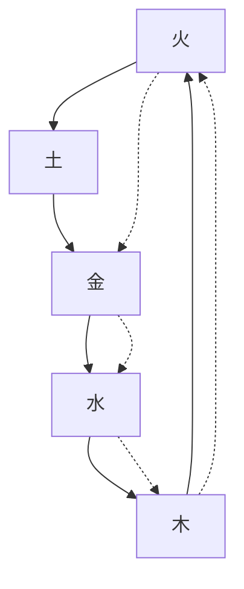
</details>

圖1.2 五行生、剋關係圖

(實線表示「相生」關係；虛線表示「相剋」關係)

於是，氣在與陰陽、五行的縱橫聯結中，構成了「氣—陰陽—五行」的結構模式，形成了中國傳統文化獨特的認識世界的方法，體現了中華民族特有的智慧。

有了「氣—陰陽—五行」的認識框架，「天」就可能得到比較具體的刻畫了。也就是說，宇宙生生不息的運動過程，可以表現為具體的氣的運動。而氣的運動狀態又可以通過陰陽的消長、五行的流行來予以認識和描寫。

# 命理學：命與運

接着，要談到「人」。

《黃帝內經》說：「人以天地之氣生，……夫人生於地，懸命於天，天地合氣，命之曰人。」(4)又說：「人與天地相參也，與日月相應也。」(5)顯然，在我們先哲的眼裏，人，作為天地之間的一個實體，存在於天地之間，跟天地是息息相通的。天地是個大宇宙，人是一個小宇宙。

既然人是宇宙的產物，生存在宇宙中，他必然要受到自然運行規律的影響和制約。那麼，是否可以設想：從人出生時候的宇宙狀態出發，去揭示它對人的生命以及生命過程的影響呢？或者說，在人出生的時刻，當時的宇宙狀態是否就給他留下了一個獨特的「印記」呢？

經過千年時間的觀察和驗證，古代的命理探索者對此終於做出了肯定的回答。

具體來說，命理學把跟人出生時對應的宇宙狀態的片刻看作是人的先天稟賦，把它稱之為「命」。換言之，人的「命」，就是他出生當時的特定的宇宙狀態。

既然出生時的宇宙狀態固結為「命」，命理學就有了十分具體的研究對象和探求的起點，它嘗試根據這個固結狀態所透露的「信息」，去揭示人先天所具有的生命特徵。

當然，宇宙的運動是永不停息的。它不會因為某人的出生而停止運動。它是按照本身固有的法則不間斷地朝前運動著的。於是，相對於任何一個特定的固結狀態的「命」，那個仍在不斷流變的宇宙狀態，就成了這個「命」的外部環境或後天環境。命理學把這個流變的外部環境稱之為「運」。

這樣，從傳統命理學的角度來看，人的「命運」，究其根本，就是一個固結了的特定宇宙狀態，在不斷變化的宇宙狀態中的遭遇。

八字命理學就是應用陰陽五行原理來描寫、並進而預測這樣的遭遇。

打個比喻，命，好比是一輛新車，它的品質規格在它出廠時已經被確定了。它出廠時的合格證書和使用手冊已經注明了它的性質和功能。運，好比是這輛車所要行駛的道路。我們觀察到的人生過程，就好比是這車行駛在路途上所遇到的各種遭遇。

可見「命」和「運」都很重要。命是根據，運是環境；命是內因，運是外部條件和過程。命理學就是通過探討「命」和「運」的相互作用，來揭示和展現一個人豐富多彩的人生起伏軌跡。

談到「命」，表現出我們古人對人的初始狀態的關注。這跟現代混沌理論對初始條件的敏感性是一致的。所謂「蝴蝶效應」正是對初始條件作用的形象性描述。(6)

# 八字：時空結構

既然說「命」是人出生時所對應的宇宙狀態，那麼，如何來標記這個狀態呢？如何來具體刻畫這個特定的氣運動片段的陰陽五行內涵呢？這是具體推演的起點。

八字命理學採用的是干支符號系統。

干支符號系統是由十個天干和十二個地支組成：

天干: 甲、乙、丙、丁、戊、己、庚、辛、壬、癸

地支: 子、丑、寅、卯、辰、巳、午、未、申、酉、戌、亥

在遠古時期，天干用來紀日，地支用來紀月。然而，單憑十個天干來紀日，則每個月可能有三個天干相同的日子，這就不易辨別了。於是，就用一個天干和一個地支，按次序搭配起來的辦法來紀日期。這就產生了「干支紀日法」。十天干和十二地支的最小公倍數是六十，於是有了六十干支的組合，稱為「六十甲子」或「花甲子」：

表1.1 六十甲子表

<table><tr><td>甲子</td><td>乙丑</td><td>丙寅</td><td>丁卯</td><td>戊辰</td><td>己巳</td><td>庚午</td><td>辛未</td><td>壬申</td><td>癸酉</td></tr><tr><td>甲戌</td><td>乙亥</td><td>丙子</td><td>丁丑</td><td>戊寅</td><td>己卯</td><td>庚辰</td><td>辛巳</td><td>壬午</td><td>癸未</td></tr><tr><td>甲申</td><td>乙酉</td><td>丙戌</td><td>丁亥</td><td>戊子</td><td>己丑</td><td>庚寅</td><td>辛卯</td><td>壬辰</td><td>癸巳</td></tr><tr><td>甲午</td><td>乙未</td><td>丙申</td><td>丁酉</td><td>戊戌</td><td>己亥</td><td>庚子</td><td>辛丑</td><td>壬寅</td><td>癸卯</td></tr><tr><td>甲辰</td><td>乙巳</td><td>丙午</td><td>丁未</td><td>戊申</td><td>己酉</td><td>庚戌</td><td>辛亥</td><td>壬子</td><td>癸丑</td></tr><tr><td>甲寅</td><td>乙卯</td><td>丙辰</td><td>丁巳</td><td>戊午</td><td>己未</td><td>庚申</td><td>辛酉</td><td>壬戌</td><td>癸亥</td></tr></table>

在長期的歷史文化浸淫中，干支符號逐漸具有了陰陽五行的內涵，形成了干支符號模型。這個模型的基本內容可以表述為（以下「+」表示陽；「-」表示陰）：

表1.2 干支符號模型

<table><tr><td>天干</td><td>甲</td><td>乙</td><td>丙</td><td>丁</td><td>戊</td><td>己</td><td>庚</td><td>辛</td><td>壬</td><td>癸</td></tr><tr><td>陰陽</td><td>+</td><td>-</td><td>+</td><td>-</td><td>+</td><td>-</td><td>+</td><td>-</td><td>+</td><td>-</td></tr><tr><td>五行</td><td colspan="2">木</td><td colspan="2">火</td><td colspan="2">土</td><td colspan="2">金</td><td colspan="2">水</td></tr><tr><td>方位</td><td colspan="2">東</td><td colspan="2">南</td><td colspan="2">中</td><td colspan="2">西</td><td colspan="2">北</td></tr></table>

<table><tr><td>地支</td><td>寅</td><td>卯</td><td>辰</td><td>巳</td><td>午</td><td>未</td><td>申</td><td>酉</td><td>戌</td><td>亥</td><td>子</td><td>丑</td></tr><tr><td>陰陽</td><td>+</td><td>-</td><td>+</td><td>-</td><td>+</td><td>-</td><td>+</td><td>-</td><td>+</td><td>-</td><td>+</td><td>-</td></tr><tr><td>五行</td><td colspan="2">木</td><td>土</td><td colspan="2">火</td><td>土</td><td colspan="2">金</td><td>土</td><td colspan="2">水</td><td>土</td></tr><tr><td>方位</td><td colspan="3">東</td><td colspan="3">南</td><td colspan="3">西</td><td colspan="3">北</td></tr><tr><td>四時</td><td colspan="3">春</td><td colspan="3">夏</td><td colspan="3">秋</td><td colspan="3">冬</td></tr><tr><td>月份</td><td>正</td><td>二</td><td>三</td><td>四</td><td>五</td><td>六</td><td>七</td><td>八</td><td>九</td><td>十</td><td>十一</td><td>十二</td></tr></table>

有了干支符號系統，命理學就有了描寫和推演的工具。它用四組天干地支符號來標記人的出生時間。

比如，現在是2019年12月10日晚上7點多，這個時空結構是怎麼樣的呢？


<details>
<summary>flowchart</summary>

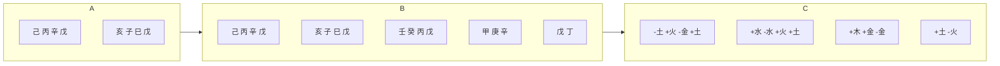
</details>

圖1.3 2019年12月10日戌時的干支結構

圖中左側是這個時段的干支結構，最右側是它具有的陰陽五行內涵。通過干支符號的組合，我們可以表述一個特定時間段的氣的運動狀態。如果現在有個嬰兒出生，這就是他的八字，或他出生時的「時空結構」。

為甚麼圖中間的八字地支下面又有了天干的標記？這牽涉到八字命理學中的「地支藏遁」的概念。

就天干、地支而言，天干象徵天，地支象徵地。天干為陽、為清，地支為陰、為濁；清者單純，濁者混雜。因此每一個天干僅具有一種五行內容；而大地包藏着萬物，地支則可以藏有多種五行內涵。它的內涵也可以直接用天干來表述，命理學稱之為「地支藏遁」，即地支中包藏着天干。下面是十二地支藏遁表：

表1.3 地支藏遁表 $^{(7)}$ 

<table><tr><td>子</td><td>丑</td><td>寅</td><td>卯</td><td>辰</td><td>巳</td><td>午</td><td>未</td><td>申</td><td>酉</td><td>戌</td><td>亥</td></tr><tr><td>癸水</td><td>己土癸水辛金</td><td>甲木丙火戊土</td><td>乙木</td><td>戊土乙木癸水</td><td>丙火庚金戊土</td><td>丁火己土</td><td>己土丁火乙木</td><td>庚金壬水戊土</td><td>辛金</td><td>戊土辛金丁火</td><td>壬水甲木</td></tr></table>

我們把地支所藏的天干標記出來。這樣，它們所具有的陰陽五行內涵也就充分顯露出來了。(8)

由於時間的流逝具有週期性（圖1.4）和層級性（圖1.5），我們很容易用干支系統這22個符號來刻畫每個時段的氣運動的狀態。一個時間序列上較大的週期是60年（圖1.6），那麼共有多少個這樣的時空結構呢？


<details>
<summary>text_image</summary>

a.
b.
c.
</details>

圖1.4 時間序列的週期性表述


<details>
<summary>text_image</summary>

(a)
中午
早晨
黄昏
半夜
(b)
夏
立夏
立秋
春
秋
立春
立冬
冬
(a)
(b)
</details>

圖1.5 時間序列的層級性：日（a）和年（b）


<details>
<summary>text_image</summary>

60年
60月
60日
60時辰
</details>

圖1.6 時間序列的週期性和層級性：60年週期循環

顯然，這是不難推算出的：

$$
\begin{array}{l l l l l} \text {年} & & \text {月} & & \text {日} \\ 6 0 & \times & 1 2 & \times & 6 0 \\ \hline \end{array} \times \begin{array}{l l l l l} \text {時} \\ 1 3 = 5 6 1, 6 0 0 \end{array}
$$

可見今晚這個時空結構（2小時片段）僅僅是這56萬多個時空結構中的一個。這是多麼了不起的構想啊！


<details>
<summary>text_image</summary>

年 月 日 時
己 丙 辛 戊
亥 子 已 戊
2019年12月10日戊時
氣的圓周運動
60年
共有561,600個結構
</details>

圖1.7 氣的圓周運動

由此可見，天人合一的整體觀和「氣—陰陽—五行」的認識框架，以及干支符號系統，為命理學提供了理論基石和推演手段。

# 命理學的局限

寫到這裏，我們經常會遇到人們對八字命理學的詰難：世界上同年同月同日同時生的人，他們的八字結構是一樣的，難道他們的命運也會是一樣的嗎？

其實回答很簡單：當然不一樣。

上面已經展示，在60年的時間跨距中，每2小時具有一個獨特的刻畫宇宙狀態的八字結構，這樣共有561, 600個。其實，在具體推算一個人的命運時，男命的大運走向跟女命的大運是不同的。它們正好處於相反的順序。這樣，命局（包括命和運）總數還需要再乘以2，總共可得1, 123, 200個男女命局。如果再考慮到每一年節氣的差異（它會影響大運的起始點），那就多不勝數了。

現代人喜歡用血型來討論人的性格，血型才4種。有人喜歡用生肖來描寫性格，生肖才12種。西方人喜歡用星座來討論命運，星座共12個。中國古代還有一種推命術，叫紫微斗數，有12宮，30多顆常用星，144個基本盤。這些跟八字命理學要描寫的至少有112萬餘個的命局數來說，真可謂是小巫見大巫了。

這112萬多個的數的命局，跟八字命理學草創時期的中國實際人口數相比，還是相當可觀的。根據歷代文獻記載，至明中葉，中國人口數「可以說始終沒有突破7,000萬。」 $^{(9)}$ 中國人口數量規模出現突破性的增長，是在清代乾嘉時期。然而，在唐、宋時代，或者還早些，我們的先人居然能構想出112萬餘個的命局，去描寫當時中原地區具有的人口數，不能不說是一種極高的智慧的表現。任何具體領域的研究，總需要有一個抽象的過程。天底下沒有兩朵花長得是完全一模一樣的。植物學家的研究，不也是根據一定的分類方法去歸類，比如用「種－屬－科－目－綱－門」的方法，來確定具體某一朵花的歸屬，從而刻畫它在某個層次上的「類」的性質。怎麼就沒有人去詰難植物學家的研究呢？

命理學的描寫自然也不例外，它也只是屬於「類」的描寫，其描寫的結果只是一個關於個人生命特徵和人生軌跡的模糊集。對於這一點，研究者必須要有十分清醒的認識。當然，面對今天這樣龐大的人口數目、以及遠比古代廣闊的地域，以每兩個小時為一個時段（時辰）單位，就顯得很不精細了。這是傳統命理學本身發展所面臨的挑戰。

其次，我們的先人主要是從時間序列上去刻畫宇宙生生不息的運動過程的，並沒有充分表現出空間因素的作用。比如上面討論的八字結構，主要是從時間序列上對宇宙運動狀態片段的複製，並沒有充分刻畫空間分佈上的差異性。這種描寫方式的局限性是顯而易見的。這跟我們東方民族重視時間序列、擅長用時間序列去統攝空間的傳統思維方式是一致的。

顯而易見，八字命理學是存在着局限性。然而，這樣的局限並沒有阻擋人們向前探索的腳步。古希臘德爾斐神廟上刻着一句警世之言：「認識你自己！」——認識你自己，當然也要認識你的命運，這談何容易！我們中華的先人可真的去做了。他們探索的腳步一直可以追溯到遙遠的古代。

# 註釋

(1). 《莊子.知北遊》。  
(2). (宋) 張載: 《正蒙.參兩》。  
(3). (宋) 李覩: 《刪定易圖序論一》。  
(4). 《素問.寶命全形論》。  
(5). 《靈樞.歲露》。

(6) 作為數學的一個分支的「混沌理論」，研究對初始狀態高度敏感的動態系統。在這個系統中，初始狀態的微小不同，比如數值計算中數字捨入的差別，計算的結果會有巨大的差異。1961年，氣象學家Edward Lorenz（1917-2008）開發了一個預報天氣的程式。有一次他在電腦上用那個程式進行第二次計算時，為了使運算快一點，Lorenz沒有讓電腦從頭開始運算，而是從中途開始，把上次的輸出結果直接輸入作為計算的初值。一小時後，他發現了出乎意料的事：天氣變化從第一次的模式迅速偏離，在短時間內，天氣的模型變得完全不一樣了。原因是出在輸入的數據是0.506，精準度只有小數點後3位，但該數據正確的值為0.506127，到小數點後6位。輸入的細微差異竟會導致輸出數值的巨大差別，這種現象就被稱為對初始條件的敏感性。1963年，Lorenz發表論文「決定性的非週期流」分析了這個效應。後來他有一個比喻說：「一隻蝴蝶在巴西扇動翅膀，一個月後會在美國德州引起龍捲風。」因此這種初始條件不同引起的連鎖巨大變化，又被稱為「蝴蝶效應」。

(7). 表中各支所藏的第一位是這個地支的本氣或主氣。比如, 地支寅中有甲木、丙火和戊土。第一位是甲木, 故甲木為其本氣; 丙火和戊土是附屬之氣。  
(8). 這樣，任何一組干支都具有了三個內容：命理學把天干稱為「天元」，地支成為「地元」，地支藏遁所含有的天干內容稱為「人元」。人元者，是指人處於天、地之間，雖由「陰地」孕育而成，但須接受「天之陽氣」始能為功。所以地支「暗藏」了天干之氣，表徵了天、地、人三者的統一。  
(9). 袁祖亮：《中國古代人口史專題研究》，36頁。

# 第二章 命理學史鳥瞰

在較早的命理典籍《淵海子平》裏，有這樣的記載：

竊以奸詐生，妖怪出。黃帝時有蚩尤神擾亂。當時之時，黃帝甚憂民之苦，遂戰蚩尤於涿鹿之野，流血百里，不能治之。黃帝於是齋戒，築壇祀天，方丘禮地。天乃降十干、十二支。帝乃將十干圓布象天形，十二支方布象地形。始以干為天，支為地，合光仰職門放之，然後乃能治也。(1)

這裏，《淵海子平》將干支賦予了神聖的意蘊：它是上帝賜予人間治亂的武器。因為干支是傳統命理學預測人的命運的工具，因此必須為其尋找到神聖的依據。

其實，對於早期術數文化的里程碑——《周易》來說，傳統命理學是十分晚起的學問。雖然從出土的甲骨文資料看，商朝中葉已經使用完整的六十甲子符號系統。根據夏代後期的幾位帝王的名字，還可以斷定，夏代已用天干記日，並以十日為一旬。商代是用天干地支相配來記日、記句的。從現存文獻資料看，干支從春秋時魯隱公三年（西元前722年）二月己巳日起用於記日，一直到清代宣統三年（1911年）止，計有2,600多年的歷史，從未有一日中斷，這是世界上迄今所知最長的記日文字記載。

然而，作為官方曆法，用干支紀月始於西漢太初元年（西元前104年）頒佈的太初律。全盤採用干支紀年、紀月、紀日以及紀時，則始於東漢章帝元和二年（西元85年）的四分曆。那麼，傳統命理學的實際研究大約不會早於東漢中期了。

對於漫長的命理學發展史，我們可以把它分為三個歷史時期：（1）形成時期；（2）深化時期；以及（3）近現代時期。

# 形成時期

自東漢末年開始，到明代中葉，是傳統命理學的形成時期。它從最初命理推演的萌芽，到出現相對完整的論命模型（古法模型），又從繁複的論命模型發展到比較成熟的、直到今日還在使用的論命框架（今法模型），這是一個十分漫長的歷史過程，計有一千三百六十餘年。

這個歷史時期又可以分為三個階段。

首先是孕育階段（東漢末期至唐朝初年）。由於文獻不足，我們雖然可以確定在南北朝時期已經存在着從命理學意義上講的論命活動，但究竟是怎麼「論命」，就很難考察了。

隋朝蕭吉 $^{(2)}$ 的《五行大義》和初唐呂才 $^{(3)}$ 的《敘祿命》，是這個時期最重要的命理文獻。

當命理探索的腳步跨入中唐時，一個初步完整的論命系統開始呈現了。它標誌着命理學進入了一個新的階段——古法階段。這是因為此時出現了命理學史上的第一位大師——李虛中。

李虛中（762-813），字常容。出生河南，祖籍隴西人。唐德宗貞元年間進士及第，後來官至殿中侍禦史。我們今天瞭解他是因為唐代文豪韓愈曾為他寫過的墓誌銘。

李虛中的重要貢獻是開創了第一個論命的理論模型。正因為這個貢獻，後世把李虛中尊為傳統命理學的開山鼻祖，即「後世傳星命之學者，皆以虛中為祖。」 $^{(4)}$

那麼，這是一個怎樣的理論模型呢？

首先，論命的出發點是以年為主。所謂的「三元」，是指天元、地元和人元。它們分別對應於年柱干支：年干為天元祿（即官祿）；年支為地元命（或財）；年干支納音，則為人元身（或壽），對應的是「材能器識」，「故主賢愚、好丑、形貌、材能、度量」。 $^{(5)}$

其次，跟年干支相聯係的，是「四柱」。這四柱是：胎干支、月干支、日干支和時干支。由此可以得到下面這樣一個架構：


<details>
<summary>text_image</summary>

三元
年
天干
地支
納音
四柱
胎
月
日
時
納音
納音
納音
納音
納音
</details>

圖2.1 古法模型架構

筆者把這個架構稱為「古法模型」。顯然，它跟後來通用的八字框架有一定的差異。(6)後來流行的八字命理推演架構是年干支、月干支、日干支、時干支，四柱共八個字；但這裏卻多了「胎元」一柱。為甚麼要列出胎元一柱，而其位置又處於月干支之前呢？

所謂「胎元」，是指「受胎」的月份。通常是以十月懷胎來推算的。這樣，胎月就是出生月份之前的第九個月。具體推算方法：以月柱為起點，天干順推一位，地支順推三位。比如，月柱是「辛卯」，天干順推一位是「壬」；地支順推三位是「午」，所以胎元是「壬午」。

把「胎元」作為一柱，跟月、日、時三柱並列，這是受了早期祿命觀的影響。命理學的先驅——東漢王充，就曾強調過：「凡人受命，在父母施氣之時，已得吉凶矣。」(7)降至晉代，煉丹術家葛洪也持同樣的觀點。(8)因此把胎元引入命理結構，以論吉凶，可謂是源遠流長了。《李虛中命書》說：「胎本立於歲前，因歲得之胎月，故立胎在歲後月前。」這就確定了胎元一柱在框架裏的位置。

再次，這個框架全面引進納音五行，把納音五行作為主要的推算工具。同時，它也應用神煞來幫助推命。全書中約出現了三十個神煞。

《李虛中命書》稍後，有《玉照定真經》，舊題「晉郭璞撰，張顒注」。 $^{(9)}$ 同時，還有一本《玉照神應真經》，舊題「郭璞撰，徐子平注」。 $^{(10)}$ 這兩種《玉照經》的內容基本一致，但注文並不相同。它們都承繼了《李虛中命書》的古法模型框架，並使它的推理規則更加具體化了。

到了南宋中期，出現了作為古法階段總匯的命理學作品——《五行精紀》。

作者廖中 $^{(11)}$ ，是一個科舉場上失意的人。由於對命理的興趣，摘取了當時流行的50多種算命文獻，「章分句析，考驗得失，校量深淺」 $^{(12)}$ ，編成了這本《精紀》，共三十四卷。

廖中完成此書後，請南宋著名學者周必大 $^{(13)}$ 做序。周序中寫道：「今士大夫至田夫野老，人人喜談命，故其書滿天下。」這一方面說明，南宋中期朝野談命之風很盛，而且命理學的古法模型也已經取代了曾經在唐代盛行的五星術，佔有了主導地位。另一方面，它也指出，當時在社會上流行的談命之書之多，這正是廖中編摘的背景。 $^{(14)}$ 現存《五行精紀》還有岳珂 $^{(15)}$ 的序言。

作為古法模型的餘緒還有明代出現的《蘭台妙選》。

尚在宋代古法模型盛行的時候，命理學史上出現了另一個極其重要的人物——徐子平。八字命理學也稱「子平術」或「子平命學」，正是用他的名字來命名的。於是，傳統命理學進入了一個新的階段：今法階段。

徐子平，何許人也？現在我們能看到的資料主要是明代《三命通會》中的《子平說辨》。 $^{(16)}$ 其文說道：

子平姓徐，名居易，東海人，別號沙滌先生，又稱蓬萊叟，隱於太華西棠峰洞。子平其字也。子平之法，以人所生年月日時推其祿命，無有不中。……子平得虛中之術而損益之，專主五行，不主納音，至是則其法又一變也。

顯然，徐子平是一位隱居的世外高人。然而今天能落實到徐子平筆下的唯一的作品——《珞琭子三命消息賦注》，根據台灣鄒文耀先生的考證，判斷為：徐子平作注的年代應該在宋高宗紹興五年（1135年）至紹興十六年（1146年）之間。 $^{(17)}$

那麼，徐子平對於命理的貢獻在哪裏？

最突出的貢獻是創立了一個新的命理分析模型框架，筆者把它稱為「今法模型」。因為這個模型的基本架構一直沿用到今天。

事實上，在北宋與南宋交替之際，正是李虛中的古法模型被術數界許多人所接受的時候。但它的弱點也逐漸顯露出來了。誠如韓愈在李虛中墓誌銘中所說的：「其說汪洋奧美，關節開解，萬端千緒，參錯重出，學者就傳其法，初若可取，卒然失之。」可見這個模型初見世面的時候，就很不容易叫人掌握。經過以後三百多年的發展和補充，更是繁雜不堪，這可以從李仝、王廷光和釋曇瑩的《珞琭子賦注》中體會出來。

徐子平正是在繼承李虛中的命理推演方法基礎上，對它作出了深刻的改造，形成了新的「模型」。從某種意義上講，也是化繁就簡，重新再造。這是任何一種學科發展的正常現象。

徐子平究竟做了哪些改造呢？細讀其《珞琭子三命消息賦注》後，不難發見有以下一些特點：

首先，徐子平確立了四柱論命的框架。

誠如前文所說，古法模型實際上是五柱論命，徐子平取消了其中的胎元一柱。這是符合常理的。事實上，一般人並不清楚自己結胎的月份。十月懷胎只是按正常情況而言的。有些人可能不足月就生下來了，而有些人則超過了預計的胎月時間。所以循例按十個月來推算，顯然不精確。這樣處理後，八字結構就成了比較穩定可靠的命造結構形式。它與個體出生時的時空結構相一致了。

同時，分析的「契入點」從原來的年柱移到了日柱的天干這一個字上，把它作為整個八字結構的「核心」，然後以此核心來建立一套分析程式。這就形成了不同於古法模型的一種新的分析「模型」。可以圖示如下：


<details>
<summary>text_image</summary>

年 月 日 時
天干
地支
</details>

圖2.2 今法模型的八字架構（徐子平）

這裏是說「以日干為重」，因為徐子平此時才從古法模型中脫胎出來，雖然改變了古法，但有些地方尚因襲古法之意，而稍加修正。在古法中，年之干支為三元，即干祿、支命、納音身，此三元均可為主來論命。徐子平則改變了古法，以日干、日支、以及支中所藏人元為三元。而且對地支所藏天干的具體內容，即人元，或稱「地支藏遁」，在注文中已基本完成。 $^{(18)}$ 注文中，在此三元中，以日干為重，日支及支中人元次之，這樣仍還有因襲古法之意。到了南宋末徐大升的《子平淵源》，則完全「以日為主」，即確定以日干為核心了。

其次是「專主五行，不主納音」。

徐子平的注文中雖有一次提到納音，但並沒有用納音五行來做推算工具。這樣，放棄納音，使用「正五行」——天干地支原有的五行內容——來論命，使分析手段不僅相對簡化，而且也比較連貫一致。

再次，徐注文中十分重視「財官」，而且非常強調財官本身所臨之地的旺衰狀況。這是早期命理的顯著特徵。注文也談到日干強弱。但在日干的強弱與財官的旺衰之間，則更着重財官的狀況。

繼承和完善徐子平的論命模型，並由此真正拉開此後今法時代序幕的重要人物，是徐大升。

徐大升，即徐升、徐彥升，號東齋，是南宋理宗寶祐（1253-1258）年間錢塘（今杭州）人。具體生卒年不詳。他從道洪和尚那裏獲得真傳後，系統地整理了「子平術」，寫出了《淵海》和《淵源》兩本命理著作。

由於《淵海》和《淵源》重複的內容較多，明代編纂者便將《淵海》和《淵源》合併成一本書，並加入了當時流行的一些命學詩賦，定名為《淵海子平》。 $^{(19)}$

那麼，徐大升原著的面貌究竟如何呢？可惜在國內已無《淵海》或《淵源》的原來版本。董向慧在韓國漢文古籍微縮圖書中找到了徐大升所著的《淵源》。(20)《淵源》一書全名《子平淵源》，序文名為「子平三命通變淵源序」。這為我們研究南宋後期命理發展提供了較為可信的資料。

徐大升在《淵源》序文中寫道：

子平之法，易學難精。有抽不抽之緒，有見不見之形。以日為主，搜用八字。先觀提綱之輕重，次詳時日之淺深。專論財官元有元無，日下支神財官有者，最要純一。……更看運神相背，自然蘊奧分明。

這裏，提綱挈領地說明了《淵源》在論命方面的一些要點。《淵源》共上、下兩卷，上卷包括了《定真論》、《喜忌篇》、《繼善篇》以及「看命入式」等內容；下卷是「十八格局」。

從《淵源》中，我們可以看到以下徐大升在命理學史上的重要貢獻、以及命理分析的一些特點：

首先，他繼承並完善了徐子平的今法模型的論命框架。《定真論》說：

釋日之法有三要：以干為天，以支為地，以支中所藏者為人元。分四柱者，年為根，月為苗，日為花，時為實。又釋四柱之中，以年為祖上，則知世代宗派盛衰之理；以月為父母，則知親蔭名利有無之類；以日為己身，當推其干，搜用八字，為內外取捨之源：干弱則求氣旺之籍，有餘則欲不足之營。……月為兄弟，……或日為妻，……或時為子息。

配合前面的序文，勾勒出一個更加完整的今法模型架構：


<details>
<summary>text_image</summary>

年
根
月
苗
日
花
時
果
天干
地支
提網
祖上
父母
己身
子息
兄弟
妻
</details>

圖2.3 今法模型的八字架構（徐大升）

這裏明確了以日為主，同時也強調「提綱」——月令地支的重要作用。因為提綱反映了出生時外部環境總體的氣候條件，這是對「天人合一」觀的具體貫徹。在這個框架中，六親的位置也進一步確定了。因為取消了古法模型的胎元一柱，「祖上」就移到了年柱，父母、兄弟則在月柱，日干為己身，日支為妻，時柱為子息。

這裏，徐大升跟徐子平立說不同，分別取年、月、日、時為根、苗、花、果，後人基本上採用了徐大升之說。

其次，完成了「十神系統」的建立。

在《淵源》上卷一開始，就羅列了「天干通變圖」，它顯示了十個天干符號相互之間的關係。這些關係把原來具體的陰陽和五行的生剋關係進一步抽象化了。《淵源》使用比肩、敗財（劫財）、傷官、食神、正財、偏財、正官、七殺（偏官）、正印、偏印等十個名稱來表述天干之間的生剋關係。

十神關係的確立，大大拓展了命理描寫的廣度和深度。它從原本五行「喻象」的分析的層面，即直接用五行生剋關係的類象來討論各成分之間的關係，拓進到了「關係」分析的層面，即通過反映五行生剋關係的代名詞——十神來予以討論，這樣便具有了更大的概括性。

有了比較完備的十神系統，就可以在關係層面定義六親的關係。《李虛中命書》是以「身剋為妻，妻生為子」。它是用納音五行的生剋來談論的，事實上，是以財為妻，以官殺為子。徐子平不用納音，以印為母，以財為父、又為妻，以比劫為兄弟，以官鬼為子，又以傷官為子，都是用正五行來歸屬。

徐大升之法，跟徐子平大體相同。不同之處是：男命以正官、七殺為子；女命用傷官、食神為子。如《定真論》所說的：「男取剋干為嗣，女取干生為子。」這樣，用特定的十神來對應具體的六親內容，至此基本定型了。雖然徐大升繼承了徐子平專重財官的傳統，但同時也提出了「中和」的原則。

再次，在《淵源》中也談到了「用神」。

用神，這個術語，是以後命理學發展中的一個重要概念。它最初出現在《李虛中命書》注文中。 $^{(21)}$ 《淵源》的《繼善篇》中有兩次提到「用神」：

(1) 用神不可損傷，日主最宜健旺。  
(2) 取用憑於生月，當推究其淺深；發覺在於日時，要消詳夫強弱。

事實上, 前者 (1) 指有用之神 $^{(22)}$ ; 後者 (2) 則不同。這裏「取用」是指月令中的用事之神。所以, 用神有兩個概念: 一個是指「有用」, 這是命理分析中最常用的概念; 另一個是指月令地支中具有「用事」作用的五行內容。

事實上，《繼善篇》所言的這兩條，都是十分經典的論述：前者強調在八字結構中出現某個字，它具有「有用之神」的資格，則不可以受到損傷。這開啟了以後對命局用神作深入探究的先河。後者要求注意月令「提綱」中的「用事」之神，並進一步推究其當令的「淺深」狀況，這又為以後八字中諸成分的狀態研究、尤其是後來的格局研究，提供了分析的着眼點。儘管講的是不同的「用」，卻都給了以後探索者重大的啟示。

對於神煞，跟徐子平不同，《淵源》所用很少。可見，隨着命理學的發展，早期眾多的神煞已逐漸失去了光彩。命理研究者已不滿於「對號入座」式的單一干支組合的判斷，而漸漸習慣於八字結構整體的分析。這也是命理學進步和成熟的表現。

作為命理學形成時期的集大成著作，是明朝中葉出現的《三命通會》。

作者萬民英（1523-1603），字汝豪，號育吾，明嘉靖二十九年（1550年）進士。先後任河南道監察禦史、福建兵備參議等職。由於他性情耿直，因直言得罪權貴，於是借扶送其母靈柩之機，歸回故里，從此遠離仕途，隱居三十多年。他建鄉學，熱衷慈善與教育。《三命通會》是他編著的命理學巨著。此外，還著有《星學大成》，是星命術的巨著。這兩部書都被收錄進了《四庫全書》。

《三命通會》卷帙浩繁，內容十分豐富。全書共十二卷。正如《四庫總目提要》所指出的：

自明以來二百餘年，談星命者皆以此本為總匯，幾於家有其書。……特以其闡發子平之遺法，於官印才祿食傷之名義，用神之輕重，諸神煞所系吉凶，皆能採撮群言，得其精要，故為術家所恒用，還有未可遂廢者。

這裏道出了此書「總匯」的特點：選材精當，既博收廣引，又條理分明，內容十分完備，堪稱是命理學的大百科書。這麼厚厚的書卷 $^{(23)}$ ，能夠「幾於家有其書」，可見其流傳之廣。由此推想，明代或許是中國歷史上傳統命理學研究和流傳最深廣的時代。

# 深化時期

自明朝中葉以後、至1911年辛亥革命為止的命理學發展的歷史進程是八字命理學的「深化時期」。

作為這一時期的先鋒人物是明朝的張楠和明末清初的陳素庵。

張楠，字神峰，號逸叟，明代江西臨川西溪人。 $^{(24)}$ 出身於傳統的耕讀之家，自幼就有「青雲志」，可惜早年「多蹇滯」 $^{(25)}$ ，功名未就。於是潛心於命理研究四十餘年，寫成了命理專著——《神峰通考辟謬命理正宗》 $^{(26)}$ 。

在書名中，張楠用了「辟謬」兩字，其理由呢？

第一，張楠認為，已有的命理著作，包括《淵海子平》在內，雖然「理出於正」，但是「無確然一定示人之見」。也就是，其論說尚蕪雜，真正的道理並沒有講清楚。

第二，市面上開業的算命先生水準太差，大多在招搖撞騙，沒有幾個是真正弄懂了命理學道理的。即便在他所在的「窮陬僻壤」，也大有「招搖售術」者。

於是，張楠潛心研究，終於悟到「其理有正途，斷無旁出」。他動筆寫了這本書，目的很明確：「辟諸謬說」，恢復「正理」，即在理論上做正本清源的工作。他把當時命理學中存在的以納音論命、以十二生肖論命、以神煞論命、以呂才所作的《合婚書》論婚姻、以及各種「外格」，統統歸諸於「謬說類」，大加鞭撻。

張楠終究是有「破」、有「立」的人。在「辟謬」的基礎上，他提出了一系列自己論命的主張。其中最重要的是「病藥說」：

何以為之病？原八字中原有所害之神也。何以為之藥？如八字原有所害之字，而得一字以去之之謂也。如朱子所謂各因其病而藥之也。故書云：「有病方為貴，無傷不是奇。格中如去病，財祿兩相隨。」命書萬卷，此四句為之括要。蓋人之造化，雖貴中和，若一一於中和，則安得探其消息，而論休咎也。(27)

繼神峰張楠之後，陳素庵對自宋初以來的八字命理學做出了一次理論上的全面清理和概說。

陳素庵（1605-1658），名之遴，字彥升，晚號素庵老人。浙江海寧人。明崇禎十年（1637年）進士。入清後，擢禮部尚書，授宏文院大學士加少保兼太子太保。後以賄結內監吳良輔，因罪問斬，免死，流放尚陽堡 $^{(28)}$ ，卒於徙所。他是海寧陳氏家族仕清的第一人，家藏甚富，後世許多術數類秘本都出自其家藏。陳素庵著有《命理約言》，以及對命理經典《滴天髓》做出註釋的《滴天髓輯要》。

《命理約言》書成之後，很少流傳。直到民國時代，由韋千里 $^{(29)}$ 於1933年根據浙江紹興蔣清渠提供的宣仲策家藏抄本選輯而成，名《精選命理約言》，刊行於世。全書共四卷。

韋千里在「序」中對《命理約言》推崇備至。他寫道：「余拜讀至再，欽佩莫名，蓋余所欲言者，陳書中已先我言之，余所不敢言不能言者，陳書中已振襟搖筆，侃侃而言之矣。且識見高超，議論透闢，誠為命書中唯一之傑作。不獨文章典雅，考據詳明已也。」

《命理約言》稱得上是一本今法模型「標準化」的精讀本。因為它對當時八字命理的一系列基本問題，都作了提綱挈領的回答。

由於張神峰、陳素庵對於現狀的批評以及要求深化命理的疾聲倡導，入清以後，深化時期的主要特點是對四柱模型做出了全方位、多視角的挺進：

這裏有任鐵樵注《滴天髓》，是沿着喻象分析層面對於八字整體結構進行考察的新進軍；有沈孝瞻進士的《子平真詮》，則是沿着八字結構的關係分析層面，進一步拓展格局理論的精微脈絡；而《窮通寶鑒》，原名《欄江網》，則揭示了日主跟月令所對應的「調候」要素之間的關係；來自民間的《命學玄通》則進一步反映了命理精細化的趨勢。正是這些經典作品，把八字命理學推到了一個前所未有的理論和實踐的高峰。

關於《滴天髓》的作者，大致認為是明朝初年劉基 $^{(30)}$ 所撰。劉基，字伯溫，封誠意伯，是中國文化史上著名的謀略家。但原本題為「京圖撰，劉基注」，這是因為劉伯溫深怕明太祖朱元璋猜忌，有意用「京圖」作為原本的作者。

自清朝以來，絕大多數命理學家對《滴天髓》都推崇備至。民國時代方重審說：子平典籍「首推《滴天髓》和《子平真詮》二書最完備精審。後之言命學者，千言萬語，不能越其範圍，如江河日月，不可廢者。」

然而，《滴天髓》雖見聞於世，但其行文大多是極其精煉的詩賦句子，義理隱晦曲折，實不易為人所領悟。直到道光二十八年（1848年）前後，由任鐵樵 $^{(31)}$ 作了十分詳盡的注解，「方能共曉其義」 $^{(32)}$ ，由此才得到真正的流傳。在命理學史上，任鐵樵可謂厥功甚偉。他是揭開《滴天髓》神秘面紗的第一個人。

任鐵樵是根據自己幾十年從業的實際經驗，援引了大量命例 $^{(33)}$ ，對《滴天髓》做出了批註。但任注《滴天髓》在當時也只是傳抄本，且內容、編次、文字均因傳抄者不同而有差異。直到民國後，任注《滴天髓》經袁樹柵校序，由孫衡甫（蘅園主人）於1933年斥資影印出版，書名為《滴天髓闡微》。1937年春，徐樂吾完成了《滴天髓補注》。這又一次為後人閱讀和理解《滴天髓》敞開了門戶。

《滴天髓》是比較有爭議的經典，識者讚譽為「經典中的經典」 $^{(34)}$ ，但卻常為「讀不懂」的人所詬病。

《子平真詮》出現在清朝乾隆年間。作者沈孝瞻，名燁燔，浙江山陰人。清乾隆四年（1739年）進士。《子平真詮》原是沈氏所寫的一份心得手稿，共三十九篇。當時並沒有署書名，僅在仕紳官宦之間抄錄傳閱。後為胡焜在宛平府中任幕府時所見。胡讀後大為讚賞，遂將此文稿交他的命學同好章君安，章閱後「慨然歎曰：此談子平家真詮也」(35)。於是以《子平真詮》為書名，在乾隆四十一年（1776年）刻版出書。這是一本深入討論四柱格局的佳作。

《窮通寶鑒》原名《欄江網》，不知作者姓名和著作年代。從書中列舉的不少明朝名人的命例來看，可以判斷，此書作於明朝末年。然而，當時僅是以一種「私人密錄式的抄本」 $^{(36)}$ ，在江湖上流傳。到清初康熙年代，「入於日官 $^{(37)}$ 之手，易名曰：《造化元鑰》」。 $^{(38)}$ 到了清朝光緒時代，有抄本落到了楚南余春臺的手中，由余春臺重新編輯，刊刻行世，改名為《窮通寶鑒》。這是一本深入研究「調候」的代表作。

對於以上三本命理深化時期出現的經典著作，民國命理大家徐樂吾先生做過這樣的評論：

僕研究命理有年，生平所最服膺者，為《子平真詮》、《窮通寶鑒》、暨《滴天髓》三書。(39)

他還進一步指出：

孟子曰：「不以規矩，不能成方圓。」又曰：「能使人規矩，不能使人巧。」《真詮》者，命理之規矩也；《滴天髓》者，示人以巧也。 (40)

最後提一下，在清乾隆年間，有錢塘「讀易老人」編輯的《命學玄通》 $^{(41)}$ 流傳。後來由虞泳源發現，在光緒十七年（1891年）經李瑞芝校刊、「有福讀書堂」刻板印行。 $^{(42)}$ 《命學玄通》中比較引人注目的是關於「六親」的判斷。它從十二個時辰來推。先把每一個時辰分為八刻，每一刻再分為十五分。然後，根據「刻」來定「父母、兄弟」；根據「分」，來定「妻、子」。這裏顯現了一種命理精細化的趨勢，即用「時辰」（兩小時的間距）來定「八字」的方法已經過於「粗略」，希望進一步把「時辰」分解到「刻」、到「分」，以此來提高預測的精准度。

# 近現代時期

1911年的辛亥革命，終於使風雨飄搖中的滿清皇朝分崩離析，中國兩千年的中央集權君主專制制度也隨之畫上了句號。由此，在宗法農業社會內部形成和發展起來的八字命理學，進入了一個新的時期。

當命理學蹒跚地跨過這個新時期的門檻時，跟其他具有悠久歷史的中國傳統文化形態——比如，中醫、中國書畫、傳統戲曲、武術等——一樣，呼吸着撲面而來的新鮮氣息，也不可避免地面臨着隨之而來的新的挑戰。

這是舊的文明向新的文明轉變的時刻。在這塊古老的土地上，從經濟形態、社會結構，到意識形態、生活方式、價值觀念等各個方面，都已經發生、並正在發生巨大的變化。如何適應新的社會變化狀況，使這門傳統的「絕學」延續下去，這已是不可迴避的「生存」問題了。

這是八字命理學「近代化」、並緊接着「現代化」的問題。

這個時期可以分為三個階段：（1）民國時期（1911-1949）；（2）港台時期（1949至上世紀90年代）；以及（3）大陸時期（上世紀90年代至今）。

作為民國時期的命理學代表人物有徐樂吾、袁樹珊、韋千里，以及林庚白、潘子展、王心田、任綏卿等。

辛亥革命後，出現最早的具有影響的命理著作，大概要數袁樹珊 $^{(43)}$ 編著的《命理探原》。原書出版於1916年，一時洛陽紙貴。1952年，作者又重加整理，以《新命理探原》書名再版於香港。此書稱得上是近代第一本有價值的命理通論著作。此外，袁樹柵還著有《命譜》八卷。

民國時代的最重要人物是徐樂吾。徐樂吾（1886-1948），江蘇東海人。早年從政。後潛心於命理數十年，先後完成了《窮通寶鑒評注》、《子平真詮評注》、《滴天髓徵義》、《滴天髓補注》、《造化元鑰評注》、《命理尋源.雜格一覽》等一系列命理典籍的整理和註釋，並且著有《子平粹言》、《命理一得》、《子罕言（古今名造閑評）》、《子平一得》等論著。

《子平粹言》是徐樂吾先生的精心之作，希望給讀者一個條理明白的「系統」的命理框架。全書分六編。前三編為「入門初步」的基本知識。第四編「明體立用」，是本書的核心內容。第五編「鑒別等差」，對「論格局高低」提出了六條標準：（一）真假；（二）虛實；（三）清濁；（四）有力無力；（五）有情無情；（六）團結。這是綜合了《滴天髓》和《子平真詮》兩書的觀點，而做出的概括。後來的命理著作，基本上沿用了徐氏在這裏所提出的這類評價標準。第六編是「古法論命」。

差不多徐樂吾在寫作《子平粹言》的時候，韋千里 $^{(44)}$ 出版了《韋氏命學講義》 $^{(45)}$ 。這是作者為命理函授所準備的講義。 $^{(46)}$ 這本講義的最大特點是簡潔明瞭，條理分明。

在命理古籍方面，韋千里校刊了清代陳素庵的《精選命理約言》，還和尤達人一起校訂了明代張楠的《神峰通考命理正宗》等。

這裏還要提一下潘子端 $^{(47)}$ （署名「水繞花堤館主」）的《滴天髓新注》 $^{(48)}$ ，以及《命學新義》。《命學新義》內共有四個部分，第一部分為「水花集」。在「水花集」中，潘先生運用了當時西方精神分析派心理學的研究方法，來探討八字命理中的「六神」和「八格」。可以說，這是命理學史上出現的第一次嘗試將現代心理學分析引進八字研究領域。

此外，還有林庚白 $^{(49)}$ 的《人鑒》，王心田 $^{(50)}$ 《命理用神精華》和任綏卿（署名「四明白水青松」）《命理索隱》 $^{(51)}$ 等。

中國大陸自五十年代起，由於算命被看作是一種迷信活動，屬於被取消的對象，較有系統的研究自然就銷聲匿跡了。因此，有關命理學的探討，只能是在台灣、香港以及海外華人地區展開。因此，五十年代以後進入了現代命理發展的港台時期。在這一時期，台灣命理學家的研究起着主導作用。

台灣早期從事命理研究的知名人物是白惠文和鄒文耀。鄒文耀 $^{(52)}$ 的命理著作主要有《子平命學考證》 $^{(53)}$ 、《命學真源考證（附徐大升命學考證）》 $^{(54)}$ 、《命學尋真》 $^{(55)}$ 、《時空制命書》等。鄒文耀原是留學英國的航空工程師，由於現代科學教育的背景，他對命理學早期文獻都做了非常認真而詳盡的考證。要瞭解早期命理文獻，讀一讀鄒教授的這些作品是很有益的。尤其是《命學尋真》，是一本非常有特色的著作，它開始了現代命理學疑古思潮。

六十年代初出版的台灣吳俊民 $^{(56)}$ 的《命理新論》，標誌了通論性著作由「近代」向「現代」的轉變。此書跟韋千里的《命學講義》相隔不到三十年。原來也是一份「命理函授講義」。從整本書的架構上來看，它確實是韋氏講義的進一步擴展。日主強弱和格局是全書的主要脈絡。但它的特點是，完全用白話文以現代教材的方式來敘述，是一本「現代」的命理通論。

在《命理新論》一書中，吳先生提出了「千古命理的一個突破」——八字年柱必須自冬至點開始更換。這是繼鄒文耀之後的又一個「疑古」的命題。

此時，出現了新一輪的古代命理著作的註釋、評論和白話講解的工作。事實上，這跟民國時期徐樂吾、袁樹珊、韋千里等的古籍詮釋工作相距也不不遠。這現象本身就體現了時代文化風俗變遷之速，以及白話作為書面語言的空前普及。這項工作的扛旗人物，當首推台灣梁湘潤。

梁湘潤（1930-2013）生於上海，祖籍廣東中山縣。自學成才。曾任台灣「星相學會」副理事長、代理事長。梁氏研究命理學五十餘年，著作甚豐。他不僅著有對古籍作註釋的《李虛中命書》、《淵海子平詩集解》、《子平賦集注》、《五行大義今注》、《滴天髓.子平真詮今注》等，而且有介紹古代命學方法的《神煞探原》、《沈氏用神例解》、《余氏用神辭淵》、《金不換大運詳解》、《四角方陣刑沖會合透解》、《祿命法：千年沿革史》等。

梁氏的著作，內容豐富，表現了作者寬廣的閱歷和深厚的命學功底。但可能其書多系「講義」的性質，往往有點兒零亂。與此相比，鍾義明對古籍的註釋和評說，顯得更為嚴謹，同樣體現了對古典命理的深刻理解。

鍾義明，1949年生，台灣省男投縣人。台灣國立師範大學美術系畢業。鐘先生對中國傳統「五術」都有着廣泛深入的研究，其知識面開闊，著作豐碩。有關命理典籍的現代評注，著有《命理用神精華評注》、《命理準繩評注》、《現代破譯滴天髓》等。在現代命理研究方面，有《命理鴻爪》、《命裏乾坤》、《命理腦筋急轉彎》、《現代命理實用集》等。

這個時期值得一提的台灣作者還有：吳懷雲《命理點睛》，司螢居士《八字泄天機》，光蓮居士《八字機緣點巧》《八字氣數研究》，陳柏諭《四柱八字闡微與實務》（上、下冊），以及稍後的吳一鳴《命理精綸》等。

當然，1949年以後，民國時代遺留的命理界知名人物如袁樹珊、韋千里都移居香港，於是香港也成了傳統命理學傳承延綿的一個重鎮。從五十年代到七十年代，除了韋千里仍活動之外，還有有尤達人、陳心讓等。

尤達人，廣東汕頭人，著有《達人命理通鑒》(57)、《達人知命四十年》等。陳心讓(58)則著有《命理真跡》。

此外，上世紀八十年代初，還有何健忠編著的《八字心理推命學》和《千古八字秘訣總解》。何健忠認為命理學是一種「心系學」。九十年代後較有影響的香港命理學家是朱鵲橋 $^{(59)}$ ，出版的命理著作有《鵲橋命理》。

大陸時期始於上世紀九十年代。

作為這個時期開始的標誌，是洪丕謨、姜玉珍著的《中國古代算命術》（1988年）和邵偉華 $^{(60)}$ 的《四柱預測學》（1993年）。這是八十年代後期中國大陸出現的「周易熱」，並由此帶來了八字命理學在內地的「復蘇」。

《中國古代算命術》是中國大陸自「文化革命」後出現的第一本介紹命理學的著作。作者洪丕謨 $^{(61)}$ 對中醫、書法、古籍等，無一不精通。一生勤奮筆耕，著作有百種之多，人稱「江南才子」。洪先生是我年輕時的摯友，曾為拙作《八字與中國智慧》（1998年）作序。

《四柱預測學》則把八字命理納入了《周易》系統，認為「四柱預測學是我國古代勞動人民在信息預測科學上的又一重大發明」 $^{(62)}$ 。因此，八字命理學作為信息預測科學的一個分支，自然就脫掉了「迷信」的帽子。這是在大陸特定環境下，為八字命理的研究爭取「合法」的地位。

《四柱預測學》之後，大陸有關八字命理的作品有郭耀宗《四柱命理預測學》、李洪成《具體斷四柱講義》、王吉厚《八字索秘》、白寶全《命理解真》、李涵辰《八字預測真蹤》、李後啟《八字精析》、李順祥《四柱玄機》、《四柱詳解》和《四柱集錦》、曲煒《四柱詳真》、凌志軒《四柱博觀》、劉文元《四柱命理正源》等。 (63)

本世紀以來，大陸的命理學研究有了較大的進展。就出版的作品而言，有代表傳統格局研究的徐偉剛(64)《八字正解》、《四柱真經》，凌志軒(65)《古代命理學研究：命理格局》，王相山《格局真詮》等；有代表「盲派」命理研究的陳寶良《淵龍命學》，段建業《段氏理象學》，蘇國聖《盲派命理探寶》，陳秉志《八字鉤沉》等，以及代表「新派」命理的祝國英(66)《人生軌跡的干支解讀：新派命理簡論》等。

此外，還有段子昱（方便面居士）的《命理學教材》、董向慧從社會學角度研究命理文化的《中國人的命理信仰》。

對於屬於江湖派的盲派命理的挖掘，成了近二十年來大陸命理發展的一個主要傾向。

# 虛構的「斷層」

穩定、嚴謹的命盤結構是研究與描寫命運的基礎。

「八字」或四柱模型，作為論命的基本架構，在宋代已經形成。距今已逾千年。不然，「八字」算命不會在民俗中流傳這麼廣泛。

其實，在唐代李虛中「古法模型」中，胎元是曾作為基本架構中的一個成分出現的。當時的架構實際上是「五柱」論命：年、胎、月、日、時。正是徐子平對此作了深刻的改造，取消了「胎元」一柱，形成了「子平術」的四柱模型。清初陳素庵在《命理約言》中只是把取消「胎元」的理由作了明確的闡述：

舊又以距生月之前，十月為胎元，或於四柱之後，複列一柱。夫人之生，或不及十月，或逾十月，是何可論？且須至此，亦大可笑也。 $^{(67)}$

由於「十月懷胎」的不確定性，胎元從命理基本架構中「剔除」了。這可以看作是一種歷史的「揚棄」。誠如我在《命運的求索》中寫道；「此後，也有人把胎元

與『命宮』並列，作為論命時的補充。」(68)

當前仍有觀點認為應該把「胎元」放進論命的基本架構中去。比如，何重建在新近出版的《胎命（七柱論命）的原理和實踐：中國命理學文化斷層研究》(69)中提出，應該在通常的「四柱」之後加上胎元、命宮和身宮，合為七柱，即「七柱論命」。他寫道：

「三垣」，即胎元、命宮、身宮，是命理學命盤不可或缺的基本架構。年月日時四柱與胎命身三柱合為七柱論命。

七柱，是一個整體。七柱之間、七柱與大運、流年之間，可以發生拱夾暗帶、刑沖會合。……

三垣中，命宮和身宮分別管轄五十年。 $^{(70)}$

為了論證「七柱論命」的合理性，何先生認為，命理學發展史上存在着一個歷史「斷層」。他指出：

四柱命理學，是特定歷史時期的「簡化命理」學，曾經對啟蒙、普及中國傳統命理術數文化，起到過積極的作用，適用於初學者，或對命理學感興趣的愛好者。(71)

然而，這個「簡化命理」學來自明末清初陳素庵著的《命理約言》。他寫道：

清初，有一本《命理約言》問世，作者陳素庵提出命盤架構的模型不必加胎命。這是歷史典籍中第一次出現公開否定胎元命宮的文字記載。命盤架構模型出現了「斷層」的隱患。……

由《命理約言》引出了文化斷層，在法理體系尤其是命盤架構模型和簡化方面，對後人造成了難以估量的不良影響。 $^{(72)}$

事實上，對於胎元和命宮的應用，命理學家歷來有不同的意見。民國時代的命理大家徐樂吾說：

命宮胎元皆不過供參考。若八字看法已顯著確定者，置不論。命胎不能改變八字之定局也。若疑惑不決，參以命胎。(73)

而當代香港朱鵲橋、台灣鍾義明等則明確表示「命宮胎元不用為佳」。理由這裏就不再贅述了。(74)

對於「斷層」，梁湘潤在《祿命法：千年沿革史》中曾提過「一九四九年後，前三十年祿命子平法——斷層帶」。 $^{(75)}$ 但他從未提及過，「清代以後，從陳素庵《命理約言》開始，命理文化出現的歷史斷層。」 $^{(76)}$ 陳素庵生於1605年，卒於1658年。《命理約言》距今已逾360年。若命理「斷層」自陳素庵始，豈不已經延綿了360年之久？

在《中國命理學史論》中，筆者把《三命通會》作為命理學形成時期完成的標誌，而把明代中葉以後、直至民國時期看作是命理學的深化時期。正是明確了四柱架構，所以才有對其進一步探索的基礎，並由此產生了豐碩的研究成果。正是有了陳素庵《命理約言》在理論上的「清理」，才有了多方面的長足進步：以《子平真詮》為標誌的，對四柱格局的深入研究；以《窮通寶鑒》為代表的，對四柱調候要素的深入研究；以任（鐵樵）注《滴天髓》為代表的，對四柱結構全方位的研究，等等。這些研究成果都是在「八字」框架內做出的，它們早已遠遠超越了陳素庵在《命理約言》中的規劃和期待。如果把此歷史階段說成是命理文化「後子平法」的「斷層」，那麼梁湘潤先生做過的對此階段重要著作的分析作品，如《沈氏用神例解》、《余氏用神例解》等等，恐怕都要付之東流了。

對於何重建先生提出的命理史上的「斷層」說，作為同好的筆者實在不能苟同。

# 註釋

(1). 《淵海子平》：「論天干地支所出」。  
(2). 蕭吉（? -614），出身齊梁宗室，一生經歷四朝十五帝，有着罕見的豐富閱歷。他「博學多通，尤精陰陽算術」。  
(3). 呂才（600-665），博州青平（今山東聊城）人。唐初哲學家。精陰陽、方技、樂律。奉命刪定《陰陽書》，頒佈天下。  
(4). 《四庫總目提要》卷一百零九。  
(5). 《李虛中命書》原注。  
(6). 正是這個原因，我們不難發現，在《李虛中命書》中始終沒有出現過「八字」這個詞。  
(7). 王充：《論衡.命義》。  
(8). 葛洪: 《抱樸子.內篇.辨問》: 「《玉鈐經》主命原曰: 人之吉凶, 制在結胎受氣之日, 皆上得列宿之精。其值聖宿則聖; 值賢宿則賢; 值文宿則文; 值武宿則武; 值貴宿則貴; 值富宿則富; 值賤宿則賤; 值貧宿則貧; 值壽宿則壽; 值仙宿則仙。」

(9). 明代《永樂大典》和《四庫全書》術數類都收錄了它。

(10). 收在清代《古今圖書集成》。

(11). 廖中，字伯禮，南宋清江人。

(12). 見《五行精紀》周序。

(13). 周必大（1126-1204），字子充，一字洪道，自號平園老叟。廬陵（今江西吉安）人。南宋政治家、文學家，為南宋名相。

(14). 周必大的序作於南宋慶元丙辰（1196年），可見廖中成書的時間。

(15). 岳珂（1183-1243），字肅之，號亦齋，晚號倦翁。相州湯陰（今屬河南）人。寓居嘉興（今屬浙江）。岳飛之孫，岳霖之子。南宋文學家、史學家。

(16). 其實《子平說辨》又是引自明代戴冠所撰的《濯纓亭筆記》。（《三命通會》誤寫為《濯纓筆記》。）戴冠（1442-1512），字章甫，自號濯纓，江蘇長洲人。明代學者。而戴冠又是摘自當時吳地一個名叫沈誠的人寫的「子平源流辨」。

(17). 《子平命學考證》的主要證據是，徐子平注文中提及的命例「胡茂老」，即胡松年。「查《宋史.胡松年傳》，胡松年字茂老，曾任尚書，繼於高宗紹興四年（西元1134年）簽書樞密院事，翌年乙卯（西元1135年）罷職，紹興十六年（西元1146年）卒。」（101頁）

(18). 除地支寅中所藏天干尚無戊土之外，其他地支所藏天干內容已基本上跟後來的地支藏遁一致。

(19). 最初的《淵海子平》本子由明代楊淙於嘉靖二十七年（1548年）編成。萬曆二十七年（1600年）又由欽天監李欽增補，未署原作者名字。到了萬曆二十八年（1600年），唐錦池增補，署「宋錢塘東齋徐升編，明清江竹亭楊淙增校」。崇禎七年（1634年）孟冬，唐錦池禮請多位精通子平術的人再做編輯，並重新刊行。目前通常見到的《淵海子平》（全名《新刊合併官板音義評注淵海子平》）就是這個再編的「新刊」本。

(20). 見董向慧: 《中國人的命理信仰》, 62頁。以下所引《子平淵源》文字皆錄自董先生所提供的這個原始印影版本。

(21). 《李虛中命書》注文：「先取上之清輕為用神之福，次看濁氣居下，上雖清而不秀，則取下有用之氣為福。」（《四庫術數類叢書》（七），809-18頁。）

(22). 這跟《李虛中命書》的用神概念是一致的。  
(23). 今台北隆泉書局經銷的《三命通會》（1986年版）就有1,114頁，不要說古代的木刻本了。  
(24). 根據《神峰通考命理正宗》「逸叟自命」: 甲戌、庚午、乙亥、丁醜。(81頁) 張楠當出生於明武宗正德九年 (1514年) 五月十三日丑時。他是《三命通會》的作者萬民英同時代的人。  
(25). 見《神峰通考命理正宗》「逸叟自命」，81頁。  
(26). 以下按通常命理學書籍中的習慣，簡稱《神峰通考》。  
(27). 《神峰通考.病藥說類》。  
(28). 今遼寧開原縣東四十里。  
(29). 關於韋千里，見下一節。  
(30). 劉基（1311-1375），字伯溫，浙江青田人。謀略家，文學家。元末進士。後助朱元璋建立明王朝，官至御史中丞兼太史令，封誠意伯。著有《誠意伯文集》等。  
(31). 任鐵樵生於乾隆三十八年（1773年），出身官宦人家。三十多歲時，家庭發生變故，家產蕩盡，於是潛心命學，為生計而以算命為職業，七十五歲時仍在批命。  
(32). 見徐樂吾《滴天髓補注》「自序」。  
(33). 任鐵樵在註釋中共引用了512個命例。  
(34). 見鍾義明：《現代破譯滴天髓》，23頁。  
(35). 見《子平真詮》胡焜「原序」。  
(36). 見梁湘潤《余氏用神辭淵》，12頁。  
(37). 日官指古時宮廷中從事占候、卜筮的部門。這裏指欽天監——清代掌觀察天象、曆法的官署。  
(38). 徐樂吾《造化元鑰》「序」。  
(39). 徐樂吾《滴天髓補注》「自序」。  
(40). 徐樂吾《子平真詮評注》「跋」。  
(41). 根據《命學玄通》「例言七則」，此書完成於乾隆十二年（1747年），編輯者「讀易老人」時年八十八歲。

(42). 部分影本見拙作《中國命理學史論》附錄。  
(43). 袁樹珊（1881-1968），江蘇鎮江人。八字為：辛巳，丁酉，乙巳，戊寅。生於醫卜世家。二十歲前，競爭科名，不第。乃潛心研究術數，賣卜江湖，名滿當時大江南北。晚年移居香港。還著有《大六壬探原》、《選吉探原》、《述卜筮星相學》等。  
(44). 韋千里（1911-1988），據其《命理談屑》中「千裏自造」：八字為辛亥、辛卯、庚子、庚辰。祖籍浙江嘉興。父親「遜道人」，為上海職業命師。畢業於復旦大學文學系。職業命理學家。晚年旅居香港。還著有《八字提要》、《相法講義》、《占卜講義》、《知命識相五十年》、《命理談屑》等。  
(45). 初版於1934年。  
(46). 1980年修訂，名《命學講義新編》（上集），載《知命識相五十年》（第五冊）。此本去掉「卷」編，直接用篇名。  
(47). 潘子端，號水遶花堤館主，安徽涇縣人。  
(48). 此書後經修改，置入《命學新義》，作為第二部分。  
(49). 林庚白（1897-1941），原名學衡，字淩南，又字眾難，自號摩登和尚，民國時期詩人、政治人物，善八字命理。  
(50). 王心田，生於1887年（清光緒四年）7月11日（農曆六月十二日）丑時，浙江四明（寧波鄞縣）人。《命理用神精華》出版於1935年。  
(51). 出版於1937年。  
(52). 鄒文耀（1895-1988），字任華，別號「活齒居士」，祖籍湖南省衡陽陽縣。航空工程師，教授。創辦台灣「星相學會」，任創會會長。  
(53). 其前言作於民國五十四年（1965年）九月。台中瑞成書局1982年再版。  
(54). 其前言作於民國五十六年（1967年）九月。台北：人生性命學研究社，1968年出版。  
(55). 台北，集文書局，1982年。  
(56). 吳俊民，筆名若萍，1917年生，福建晉江縣人。1945年赴台灣從事教育工作，為警校教官。五十年代開始從事業餘命理函授教學。著有《命理新論》、《命理新論實例》。

(57). 《達人命理通鑒》（第一冊）「自序」所署時間為「民國五十年辛丑仲春」（1961年）。  
(58). 陳心讓，別號西鑰，道號金石老人，浙江慈溪人。上世紀五十年代後在香港開業。《命理真跡》前有應昌期所寫「作者小傳」，說「彼著《命理真跡》近二十年，與人推算，從無不驗。今將次數秘笈，付印出版，以供世人。」作序時間是民國六十八年五月（1978年）。  
(59). 朱鵲橋，1922年生，祖籍廣東新會。教員。退休後於1983年首辦命相班。1994年73歲，開始整理自己授徒講稿，陸續寫出《鵲橋命理》及《帶眼識人》、《榮華富貴指掌間》等。  
(60). 邵偉華（1936-2019），著名的易學專家及命理家。著有《周易與預測學》、《周易預測例題解》、《四柱預測學》、《周易預測學講義》等。  
(61). 洪丕謨（1940-2005）生於上海。1958年就讀於上海市衛生局中醫大專班。從事中醫臨床工作近20年。1981年棄醫從文，到上海華東政法學院語文教研室執教，1986年在該院古籍整理研究所從事古代法律文獻研究、副教授。中國書法家協會會員、學術委員。  
(62). 《四柱預測學》「前言」。  
(63). 關於大陸近二十年來命理作品的介紹和評析，可參閱淩謝冰《中國八字學通論》（2008年）。  
(64). 徐偉剛，江蘇常熟人，大專學歷。89年開始研習易學，傾心於大六壬、子平命學、相學和地理。著作有《袖裏乾坤：大六壬新探》、《八字正解》等。  
(65). 漂志軒，1948年生，深圳人。原籍廣東梅州，中醫世家。中山大學畢業，在特區長期研究中國傳統文化。著有《生命密碼》、《易經解讀》、《四柱博觀》等專著。  
(66). 祝國英，山東德州人。做過多年的新聞工作，後專心於中國古代預測術的研究與實踐。進入二十一世紀後，成為圈子內公認的新派命理領軍人物之一。  
(67). 《精選命理約言》卷三。  
(68). 《命運的求索》，87頁注。  
(69). 台灣行卯出版社，2019年。  
(70). 《胎命（七柱論命）的原理和實踐》，176頁。

(71). 《胎命（七柱論命）的原理和實踐》，137頁。  
(72). 《胎命（七柱論命）的原理和實踐》，141頁。  
(73). 《子平粹言》72頁。  
(74). 《八字命理學動態分析教程》80-81頁。  
(75). 《祿命法：千年沿革史》，700頁。  
(76). 《胎命（七柱論命）的原理和實踐》，236頁。

# 東山篇：「黑箱」的探索

# 第三章 「黑箱」和分析視角

我們已經明確，命理學分析的出發點是個人的出生時間，具體講，就是反映個人出生當時的時空結構。每一個活着的人都離不開他賴以生存的時空場或時空「氣場」。八字命理學只是抓住了這個初始狀態——出生時的宇宙時空「場」或時空結構，作為研究的起點。它由年、月、日、時四組干支組成，也就是通常所說的「八字」。我們用八字結構來表述這個氣場結構的具體陰陽五行狀態的內涵，而這個結構就是我們俗稱的個人的「命」。從本章開始，我們對這個結構做具體的分析。

# 八字結構：日主和提綱

我們再來看一下第一章內提過的那個八字結構。這個結構正是2019年12月10日戌時（晚上7-9點）的宇宙狀態的寫照。假定當時有個呱呱落地的嬰兒，它就是這個嬰兒的「八字」：


<details>
<summary>flowchart</summary>

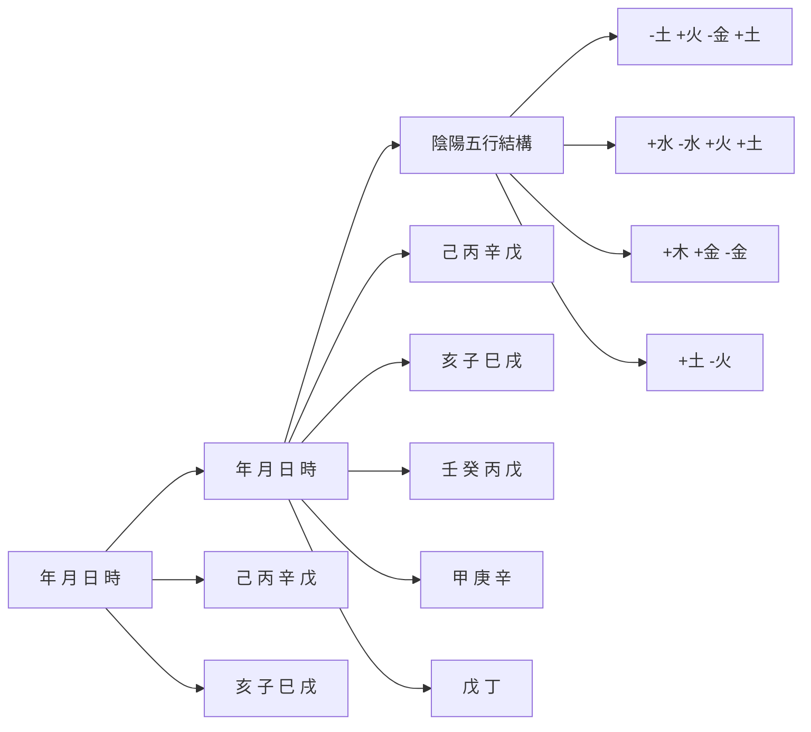
</details>

圖3.1 八字結構（2019年12月10日戌時）

在這個八字結構中有一個核心位置，那就是日柱的天干，我們把它稱作「日主」。這正是前一章命理史中提到的「今法時代」的重要貢獻，或者說，是宋代徐子平的重要歷史貢獻。他把原「古法模型」中年干支的核心地位移到了日干，並把它確定為「日主」。日主，也就是命主「我」，作為了八字結構的核心，圖示如下：


<details>
<summary>flowchart</summary>

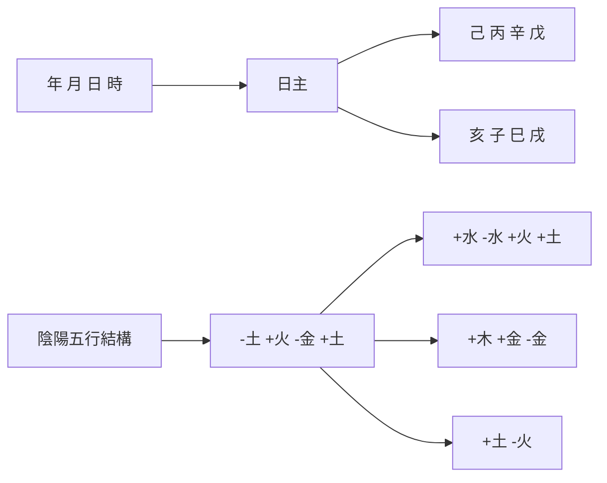
</details>

圖3.2 八字結構（2019年12月10日戌時）

在圖中，我們把標記日柱的天干——辛，用小方框標記了出來，把它稱為「日主」。因為在今天的命理研究中，八字日柱的天干被認定是論命的核心和出發點。它有時也稱為「日元」或「命主」。我們時常聽到說，張三是「火命」，李四是「水命」。這裏所謂的「甚麼命」，就是指當事人八字結構中那個日主的五行屬性。上述八字日柱干支是辛巳，「辛」便成了日主。天干辛在五行中屬「金」，這時出生的嬰兒就是「金命」。辛金的陰陽屬性是陰性，所以也是「陰金命」。

為甚麼要認定日干為八字結構中的核心呢？

事實上，它有天文學的依據的。如果從作為天體之一的地球的運動出發，或許可以印證古人確定日主為八字結構的核心的合理性。地球自轉和公轉是地球運動的兩種主要運動方式。地球自轉導致了晝夜的更替；地球的公轉導致了一年四季氣候的更替。因此，以日柱為軸，輔以時柱，反映了地球的自轉運動；以年柱為軸，輔以月柱和日柱，則可以反映地球的公轉運動。圖示如下：


<details>
<summary>text_image</summary>

地球公轉
地球自轉
年 月 日 時
</details>

圖3.3 八字結構所反映的地球公轉和自轉

在這兩種運動中，日柱是重合部分，所以取日柱天干為核心，強調了作為運動體的地球本身，這不正是我們人類棲息的地方？

若進一步分析。地球圍繞着太陽運轉，月柱的地支——月支，反映着地球運轉的位置。具體來說，就是地球在黃道上運行的位置。所謂「黃道」，是地球上的人所看到的太陽一年內在天空恒星之間所走的視路徑。也就是觀察者以地球為參照物時，太陽繞地球作圓周視運動的軌道。簡單的說，地球一年繞太陽運轉一周。假定地球不動，從地球上看太陽，那是太陽在天空中移動。它一年移動的路線就是「黃道」——它是天球上假設的一個大圓圈。

人們把黃道劃分成了十二等份，每份相當於 $30^{\circ}$ 。每份用鄰近的一個星座命名，這些星座就稱為黃道星座或黃道十二宮。 (1)這樣，相當於把一年劃分成了十二段。太陽在黃道上自西向東運行，每一段時間進入一個星座。比如，在西方，一個人出生時太陽走到哪個星座，就說此人是這個星座的命。最早有關於黃道的歷史紀錄出現在古巴比倫文化當中，以後就形成了西方最初的占星術。

與西方不同，中國古代是用二十四節氣去對應太陽在黃道上運動的軌跡。每一個節氣對應於太陽視運動15°所達到的位置。二十四節氣又分為12個節氣和12個中氣。八字命理學上用的「月份」是以12個「節氣」來分割的。比如，正月（寅月）是從立春開始的；二月（卯月）起自驚蟄；三月（辰月）起自清明……雖然每兩個節氣之間正好相當於黃道軌跡的30°份額。但跟西方對應的星座基本上相差15天。因為星座是以「中氣」為界限的。比如，水瓶座起始於雨水；白羊座起始於春分；金牛座起始於穀雨……尤其值得注意的是，傳統命理學一年的起始點是立春，而西方則是以春分點為一年的起點。因此，傳統命理學的四季起始於立春。立春標記了春天的開始。在西方，春季則始於春分點。

為甚麼會有這樣的差別？

前文談到過「天人」關係是八字命理學的哲學基礎。其實，天人關係的哲學討論是從西方哲學中引進來的。在西方哲學中，強調的是天人相分，天人對立。這可以追溯到早期的希臘神話。希臘神話是多神崇拜的。雖然宙斯是奧林匹斯山上眾神之王，但眾神是各施其職的。跟其他民族神話中的神祇相比，他們更具有世俗性，帶有世俗人的色彩。他們並不是全能或完美的。不但在外形體貌上跟凡人相同，而且也具有人的七情六慾。他們熱衷於加入人間的紛爭。雖然他們要掌控一切的命運，然而，希臘神話中的「天人」關係更多地表現了人對自己命運的認識，同時讚揚了人間英雄對自身命運的反抗。古希臘的悲劇，正是表現人和命運的衝突，從而謳歌崇高壯烈的英雄主義。正因為如此，「人」等同於人間（地球），它與「天」（太陽）的關係，可以通過黃道的軌跡來反映。黃道軌跡反映了太陽與地球的距離位置。春分、夏至、秋分、冬至，是黃道上的四個重要節點，並由此劃分十二個星座，反映了地球跟太陽遠近距離的關係。它們自然是「天人」關係劃分的坐標系。

八字命理學所反映的「天人」關係，事實上是「天、地、人」的關係。它訴求的是天、地、人的和諧。它敬重「天、地」，但着眼於「人」。因為「人」是「天地合氣」 $^{(2)}$ 的產物。八字命理學探討的是人的命運，自然離不開人的「感受」。固然「冬至一陽生」，對於處於北半球的中華大地，太陽已經返程北移了，日照開始長了。但人們的感覺並沒有因日照延長了，而感到溫暖了。八字模型是兼顧天地人的。考慮到「天有陰陽，地有五行」——陽光的照射，對於中華大地特殊的地形地貌，有一個積寒、積熱的過程，也就是有一個轉化為生存在這塊土地上人所能感受到的寒熱、燥濕的過程。冬至以後，還要經過小雪、大雪，三九嚴寒，直到立春，才能迎來春姑娘輕盈的腳步。因此，以四季的循環為主要對象的八字陰陽五行模式，最終選取了立春節氣作為一年循環週期的起始點，是其邏輯的必然。 $^{(3)}$ 而立春、立夏、立秋和立冬，成了八字命理四季自然生態模型的節點。這是不同於西方星座界定的根本點。八字命理的研究者應該注意到這個重要的區分。

以下是在這樣四季自然生態模式下的月令五行分日用事：(4)

表3.1 月令五行分日用事

<table><tr><td>正月</td><td>二月</td><td>三月</td><td>四月</td><td>五月</td><td>六月</td></tr><tr><td>寅</td><td>卯</td><td>辰</td><td>巳</td><td>午</td><td>未</td></tr><tr><td>立春 雨水</td><td>驚蟄 春分</td><td>清明 毼雨</td><td>立夏 小滿</td><td>芒種 夏至</td><td>小暑 大暑</td></tr><tr><td>戊 丙 甲7 7 16日 日 日</td><td>甲 乙10 20日 日</td><td>乙 癸 戊9 3 18日 日 日</td><td>戊 庚 丙5 9 16日 日 日</td><td>丙 己 丁10 10 10日 日 日</td><td>丁 乙 己9 3 18日 日 日</td></tr><tr><td>七月</td><td>八月</td><td>九月</td><td>十月</td><td>十一月</td><td>十二月</td></tr><tr><td>申</td><td>酉</td><td>戌</td><td>亥</td><td>子</td><td>丑</td></tr><tr><td>立秋 處暑</td><td>白露 秋分</td><td>寒露 霜降</td><td>立冬 小雪</td><td>大雪 冬至</td><td>小寒 大寒</td></tr><tr><td>己 戊 壬 庚7 3 3 17日 日 日 日</td><td>庚 辛10 20日 日</td><td>辛 丁 戊9 3 18日 日 日</td><td>戊 甲 壬7 5 18日 日 日</td><td>壬 癸10 20日 日</td><td>癸 辛 己9 3 18日 日 日</td></tr></table>

從表中可以看到，在正月（寅月），先是戊土主事7天，接着是丙火主事7天，再接下來是甲木主事16天。接着是二月（卯月），承接正月甲木，繼續主事10天，接下來是乙木主事20天。……事實上，第一章中的「地支藏遁表」（表1.3），即各地支內所含有的天干即人元的情況，正是根據各月五行分日主事的具體內容歸併出來的。(5).

有鑒於此，八字結構內的月柱地支被稱作為「提綱」。因為月柱地支標記了一年十二個月的時間段落，表述了地球公轉的位置。同時，它也清晰地反映了自然氣候四季的更替狀況。故它是八字結構的一個十分重要的信息點。


<details>
<summary>text_image</summary>

年 月 日 時
日主
提網
</details>

圖3.4 日主和提綱

顯然，日主（日干）和提綱（月支）是八字結構內部的兩個重要的關注點。

# 黑箱

有了對八字結構的基本認識，我們要着手對它進行具體的剖析。

那麼，如何下手呢？

我們不可能再像我們的古人那樣，跟着師傅，依靠長時間的學習、實踐、猜測、頓悟、再學習、再實踐、再猜測、再頓悟……長期積累後，逐漸形成自己的分析手段和「頓悟」經驗（或一種由經驗到靈感而形成的理性認識）。我們應當利用現代的科學思想和工具，對這麼一種古老的、可謂博大精深的關於人的命運的學問，或者說是不易琢磨的「玄學」，做出新的觀察、形成新的認識和相對完備的理論和分析程式。筆者自己就是這樣摸索着走過來的。

現代控制論的創始人維納在《模型在科學中的作用》中指出，所有的科學問題都是作為「閉盒」問題開始的。若干可供選擇的結構被密封閉在「閉盒」中，研究它的唯一途徑是利用閉盒的輸入和輸出。

艾什比在《控制論導論》中對黑箱方法做了比較系統的闡述。這裏的「黑箱」就是維納的「閉盒」。他認為：「黑箱問題是在電機工程中出現的。給電機工程師一個密箱，上面有些插上接頭，可以隨意通上多少電壓、電擊或任何別的干擾；此外有些輸出接頭，可以借此作他所能做的觀察。」

這就給了我們一個「黑箱」的研究方法。黑箱是指人們一時無需或無法直接觀察其內部的結構，只能從外部的輸入和輸出去認識的某種現實系統。

其實，我們古老的中醫學在方法論上也是一種黑箱的應用。中醫師通過對病人的「望、聞、問、切」等外部觀測做出診斷，立足於「有諸內必形諸外」的「司外揣內」觀察方法，就是把病體視作黑箱，根據人體的輸入和輸出，做出「辨證施治」。

同樣，我們可以把黑箱理論應用到八字命理學的分析上去。

首先，個人出生時間跟他的人生經歷之間有着密切的聯繫，這是我們古人的假說。任何科學研究都是從假說開始的。根據這個假說，我們可以畫出下面的圖示：


<details>
<summary>flowchart</summary>

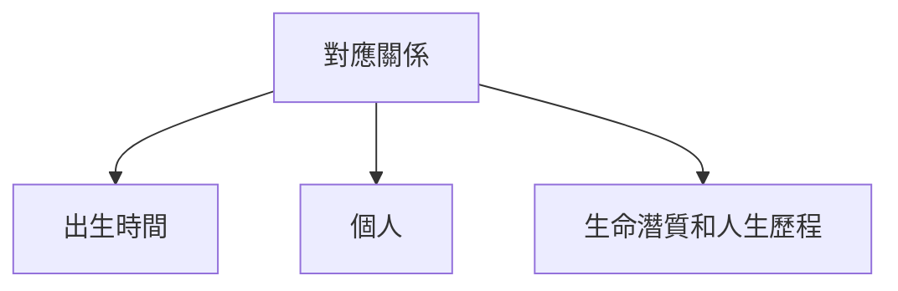
</details>

圖3.5 對應關係

對於每一個具體的人來說，出生時間跟他的潛質和人生歷程，有着對應關係。既然他的出生時間是確定的，他的人生過程也是可以觀察得到的，我們就可以進一步假定其背後存在着某種「機制」，而這樣的聯繫正是受着這個「機制」的制約。這個機制就可以被看作是一個「黑箱」。於是，它們之間的關係可以進一步圖示如下：


<details>
<summary>flowchart</summary>

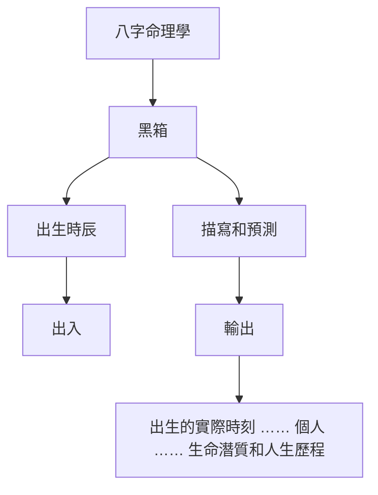
</details>

圖3.6 「黑箱」

如圖所示，作為這個黑箱一端的「輸入」，是一個人的出生時間。作為黑箱另一端的「輸出」，是關於這個人的生命潛質和人生歷程的描寫和預測。關於這個黑箱內部的真實的具體結構，誰也不清楚。如果說人體的「黑箱」還有望有徹底打開的一天，那麼，這個制約人生的「黑箱」，至少到今天為止，我們對它的真實結構、內部構件，一無所知。

但是，當輸入某個人的出生時辰，它可以輸出關於這個人的人生歷程的某種近似的「描寫和預測」。而能做出這種描寫和預測，就是這個黑箱所具備的功能。因為的確存在有觀察得到的某種對應關係存在。命理探索者就是在這種觀察到的對應關係基礎上，嘗試去構建或模擬它的操作系統的。而「天地人」的感應、以及「氣一陰陽一五行」的認識手段，為模擬這個黑箱的功能奠定了理論的基礎。

可以說，八字命理學的發展歷史，就是構建這個黑箱，使其具有描寫和預測功能的歷史。這個歷史到今天還遠沒有結束。

# 多視角的分析

八字命理學，說到底，是一種對「黑箱」的探究，這就決定了它研究方法的基本特點。

物理學、化學、生物學等自然科學，它們的研究對象是具體的物質現象。這些物質現象是可以通過科學儀器測量出來的。因此，實驗室、實驗結果和邏輯推理，是它們不可或缺的研究手段。而命理學所面對的是一個「黑箱」，只能從功能上去「猜測」這個黑箱的機制。而且，它要描寫的範圍又太大、太寬泛，幾乎囊括了人生的各個方面。從現代科學的學科領域來講，它涉及了生理學、心理學、倫理學、社會學等諸多領域。因此，它不可能用一次性「猜謎」的追蹤，就可以完成這樣複雜的任務。或者說，它不可能通過一個觀察角度，來全面地洞察這個黑箱的全部功能。它只能依靠全方位的、從不同的角度，通過揭示這個黑箱不同方面的功能，使其能最大程度上去完成描寫和預測的任務。

事實也是如此。從前一章所述的命理學史來看，至少形成過以下不同的研究視角：


<details>
<summary>flowchart</summary>

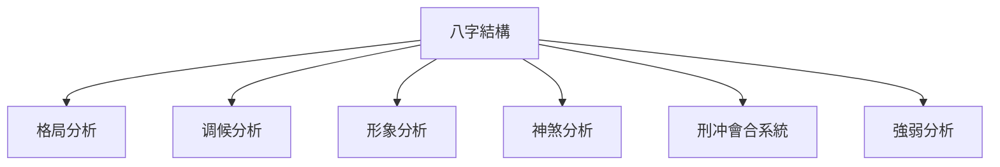
</details>

圖3.7 多視角的分析

在圖中，我們羅列了一些重要的視角，比如早期出現的神煞系統、刑沖會合系統，命理學成熟時期形成的強弱分析、調候分析、格局分析、形象分析等。我們將逐一接觸和展現這些不同的研究視角，介紹它們具體的剖析方法。

由於命理學一直存在於俗文化中，缺乏系統的學術性研究。而江湖算命，常常良莠不齊，真假難辨。正因為如此，不少學了多年命理的人仍摸不着頭腦，常有「易學難精」的感歎。筆者接觸命理已有四十餘年，也曾有過同樣的感受。究其原因，一個重要方面，就是陷入了不同視角探求的迷魂陣裏，常常是好像有所領悟，忽然又如墜雲霧，有失之交臂之感。

當然，出現這樣的情況，也有中國傳統學術本身存在的問題。它重視實用，而輕視理論建構；重視領悟和頓悟，而輕視客觀的理性分析，忽視概念和邏輯推理。同一個術語，比如「格局」、「用神」，常常在不同的地方有不同的含義，讓接受現代教育的人確實很難掌握。有鑒於此，筆者將自己多年的領悟和論命經驗貢獻給讀者，由現代科學控制論的黑箱理論帶來的「多視角」的分析方法來組織以下「東山篇」的剖析進程。

# 註釋

(1). 它們是白羊座、金牛座、雙子座、巨蟹座、獅子座、處女座、天秤座、天蠍座、射手座、摩羯座、水瓶座和雙魚座。  
(2). 「天地合氣，命之曰人。」（《素問.寶命全形論》）  
(3). 參見拙作《中國命理學史論》第三章。  
(4). 主要以《淵海子平》「月律分野之圖編制」。  
(5). 考察「地支藏遁」跟「月令五行分日用事」的差異，基本上是將一月中同類的五行予以歸併，如卯月（二月）中有甲、乙主事，則僅取乙為「藏遁」地支。

# 第四章 喻象：強弱和調候

現在我們開始對八字結構進行多視角的剖析。

八字命理推演的基礎，首先是「喻象」。由於它的哲學基礎是「天人合一」，或「天地人合一」，自然和人是交融在一起的。於是，自然被人化了，而人則被物化了。自然充滿了生命力，而人的生命，又成了一種生動活潑的自然事物，交融在自然之中。這是八字命理學運思方面的重要特點。

# 十干喻象

誠如前文所指出的，八字結構具有兩個重要的關注點，一個是日主（日干），一個是提綱（月支）。作為命局中的「我」，它可以由十個天干中的任何一個天干擔任。比如，以下是著名歷史學家錢穆先生命造（生於1895年7月30日戌時） $^{(1)}$ ：


<details>
<summary>flowchart</summary>

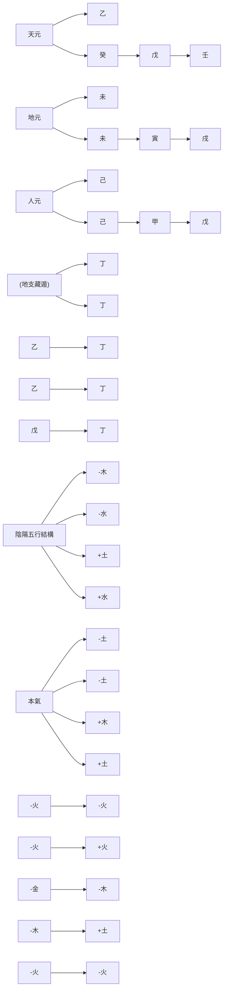
</details>

命例1 乾造：錢穆先生（1895-1990）

這裏，除了標記出「八字」（年干支乙未；月干支癸未；日干支戊寅；時干支壬戌），同時，也標記了「地支藏遁」，即地支中所藏有的天干成分（如地支未的「藏遁」是己土、丁火和乙木）。這樣，整個結構的天元、地元以及人元就都齊全了。

這個結構中，日主為「戊」，即陽土。這就是說，命局的主人「我」被物化為陽土。以下是十個天干的各自的喻象：

表4.1：十干喻象及其性質

<table><tr><td>天干</td><td>陰陽</td><td>喻象</td><td>性質</td></tr><tr><td>甲</td><td>陽木</td><td>松柏,喬木,棟梁</td><td>剛健,正直,積極</td></tr><tr><td>乙</td><td>陰木</td><td>芝蘭,灌木,花草</td><td>柔弱,巧變,韌性</td></tr><tr><td>丙</td><td>陽火</td><td>太陽</td><td>熱情,結實,坦白</td></tr><tr><td>丁</td><td>陰火</td><td>月亮,燈燭</td><td>纖細,敏捷,慧黠</td></tr><tr><td>戊</td><td>陽土</td><td>城牆,堤岸</td><td>厚重,單調,高亢</td></tr><tr><td>己</td><td>陰土</td><td>田園,軟土</td><td>平坦,博厚,謙虛</td></tr><tr><td>庚</td><td>陽金</td><td>頑鐵,寶劍</td><td>堅硬,銳利,硬直</td></tr><tr><td>辛</td><td>陰金</td><td>珠玉,鑽石</td><td>敏感,溫清,秀氣</td></tr><tr><td>壬</td><td>陽水</td><td>江湖,汪洋</td><td>明朗,清澈,爽快</td></tr><tr><td>癸</td><td>陰水</td><td>雨露,泉水</td><td>包容,婉轉,變化</td></tr></table>

從表中可以看到，陽土戊，它被看做是自然界中類似於城牆之類的厚土，或者是擋水的堅硬的堤岸。它顯現出厚重、單調、高亢的特性。因此，對這個命造的日主可以做這樣的描述：沉穩，厚重，重名譽，信實無欺；為人憨厚呆板，生活方式較為枯燥乏味。 $^{(2)}$ 這倒真有點學者的性格。

當然，從「厚重、單調、高亢」的特性聯想開去，戊土還可以引申為虹霓、大地、山丘、高坡、建築、倉庫、寺院、古董、舊物、磚瓦、高台、講台、老成、生硬等一系列類象。

用某種物象來做譬喻，是八字命理解讀干支密碼的主要方式。這或許需要解讀者具備一定的想像力和生活閱歷。八字命理由此來解讀命主的性情，也稱為「十干體性」。

確定了八字結構的核心——「我」以後，接着要討論的問題是「我」的「強弱」。這就進入了第一個結構分析視角：強弱分析。

# 五行四時用事

關於日主的強弱，一般的原則是觀察日主是否：（1）得令，（2）得地，（3）得助。

所謂「得令」，是指八字中月令地支屬於日主比較旺盛的季節。這就要聯繫到八字中的月令地支「提綱」了。通過「提綱」觀察日主出生時的外部氣候環境。因為五行在不同的季節中呈現出不同的旺衰狀態。下面是五行四時用事表：

表4.2 五行四時用事

<table><tr><td>五行\四時</td><td>春</td><td>夏</td><td>秋</td><td>冬</td><td>季</td></tr><tr><td>木</td><td>旺</td><td>休</td><td>死</td><td>相</td><td>囚</td></tr><tr><td>火</td><td>相</td><td>旺</td><td>囚</td><td>死</td><td>休</td></tr><tr><td>土</td><td>死</td><td>相</td><td>休</td><td>囚</td><td>旺</td></tr><tr><td>金</td><td>囚</td><td>死</td><td>旺</td><td>休</td><td>相</td></tr><tr><td>水</td><td>休</td><td>囚</td><td>相</td><td>旺</td><td>死</td></tr></table>

表中的「季」是指春、夏、秋、冬四季的最後十八日，即立春、立夏、立秋、立冬各節氣前十八日，為季土當令之時。

這個表反映了五行在不同季節中的旺衰狀況。所謂「用事」，就是發生影響。它把五行的旺衰程度分成了五個等級：旺、相、休、囚、死。旺，是最強；相，是次強；休，是稍弱；囚，是更弱；死，則為最弱。此表刻畫了自然界中五行在時間序列上呈週期性的旺衰起伏的變化。它為命理上的強弱推演提供了依據。

反觀以上錢穆先生命造，日主戊土生於夏末季月，而且是在未月（六月）的後18天土旺時節，顯然是得令。得令，自然強盛。

# 十天干生旺死絕歷程

日主旺衰判定的第二步：是否得地？

所謂「得地」，是指日主在年、日或時的地支上是否有根基。這就牽涉到探求十個天干周行十二個地支的生旺死絕過程。這個過程可以列表如下：

表4.3 十天干生旺死絕歷程

<table><tr><td></td><td>長生</td><td>沐浴</td><td>冠帶</td><td>臨官</td><td>帝旺</td><td>衰</td><td>病</td><td>死</td><td>墓</td><td>絕</td><td>胎</td><td>養</td></tr><tr><td>甲</td><td>亥</td><td>子</td><td>丑</td><td>寅</td><td>卯</td><td>辰</td><td>巳</td><td>午</td><td>未</td><td>申</td><td>酉</td><td>戌</td></tr><tr><td>乙</td><td>午</td><td>巳</td><td>辰</td><td>卯</td><td>寅</td><td>丑</td><td>子</td><td>亥</td><td>戌</td><td>酉</td><td>申</td><td>未</td></tr><tr><td>丙</td><td>寅</td><td>卯</td><td>辰</td><td>巳</td><td>午</td><td>未</td><td>申</td><td>酉</td><td>戌</td><td>亥</td><td>子</td><td>丑</td></tr><tr><td>丁</td><td>酉</td><td>申</td><td>未</td><td>午</td><td>巳</td><td>辰</td><td>卯</td><td>寅</td><td>丑</td><td>子</td><td>亥</td><td>戌</td></tr><tr><td>戊</td><td>寅</td><td>卯</td><td>辰</td><td>巳</td><td>午</td><td>未</td><td>申</td><td>酉</td><td>戌</td><td>亥</td><td>子</td><td>丑</td></tr><tr><td>己</td><td>酉</td><td>申</td><td>未</td><td>午</td><td>巳</td><td>辰</td><td>卯</td><td>寅</td><td>丑</td><td>子</td><td>亥</td><td>戌</td></tr><tr><td>庚</td><td>巳</td><td>午</td><td>未</td><td>申</td><td>酉</td><td>戌</td><td>亥</td><td>子</td><td>丑</td><td>寅</td><td>卯</td><td>辰</td></tr><tr><td>辛</td><td>子</td><td>亥</td><td>戌</td><td>酉</td><td>申</td><td>未</td><td>午</td><td>巳</td><td>辰</td><td>卯</td><td>寅</td><td>丑</td></tr><tr><td>壬</td><td>申</td><td>酉</td><td>戌</td><td>亥</td><td>子</td><td>丑</td><td>寅</td><td>卯</td><td>辰</td><td>巳</td><td>午</td><td>未</td></tr><tr><td>癸</td><td>卯</td><td>寅</td><td>丑</td><td>子</td><td>亥</td><td>戌</td><td>酉</td><td>申</td><td>未</td><td>午</td><td>巳</td><td>辰</td></tr></table>

這裏，生死旺衰歷程分成了十二個階段，並配入十二個月中。這十二階段是：長生、沐浴、冠帶、臨官、帝旺、衰、病、死、墓、絕、胎、養。它們各自的含義是：

長生——猶如嬰兒之初生。

沐浴——猶出生後沐浴去垢，指幼兒階段。

冠帶——猶人漸長而需冠帶。

臨官——好像人由長而壯，可以出仕做官了。

帝旺——好像人的體力、智力都到達最旺盛的時候了。（但盛極也孕育了衰敗的初兆。）

衰——盛極而衰，開始走下坡路了。

病——由衰败而生病。

死——由病而死。

墓——死而埋葬入墓。

絕——前氣已絕，後氣將續。

胎——後氣繼續結氣成胎。

養——好像人養胎於母腹之中。

顯然，它們表明了五行由盛而衰、由衰複盛、衰旺程度不同的十二個階段。請注意表4.3，這裏陽干和陰干的十二地支生死旺衰歷程是不相同的。它們正好處於相反的順序。

比如，甲木「長生」在亥，乙木則「死」在亥；甲木「死」在午，乙木則「長生」在午。這就是所謂「陽生陰死」，即陽干是順着行走，從長生開始，沐浴、冠帶、臨官……，一直到養，再回到長生；陰干恰好是逆着行走，陽干的「死」正好是陰干的「長生」位置，然後，逆行，由長生開始，沐浴、冠帶、臨官……，一直到養，再回到長生。而陰干的「死」位，正好是陽干的「長生」位置。這種陽生陰死、陰生陽死的順逆行走情況，在《李虛中命書》中已經提到：「陰生陽死，逆順相因，甲氣申方，乙絕酉位。」 $^{(3)}$ 這裏，「申」正是陽干甲的「絕」，而「酉」是陰干乙的「絕」位。

此外，這十個天干周行十二個地支的旺衰過程中，五行中的火與土周行順序是一致的。也就是說，陽干丙火與戊土所臨十二地支的狀況完全相同，陰干丁火與己土完全一致。這是命理學上所謂的「火土同行」。 $^{(4)}$

關於十天干在十二地支的生死旺衰歷程，這是命理學史上經常爭論的問題。不少學者認為，只要有五行在十二地支的生死旺衰就行了，這樣屬於同行的天干就不必再分了。這就是「陰陽同生死」的主張。

然而，當陽干和陰干在「死」與「絕」的位置上，「陽順陰逆」又似乎可以給予更細膩的描寫。比如，甲木死於午，絕於申。午中藏遁是丁火、己土，盡是洩耗之物。而申中，藏遁有庚金，有壬水，有戊土。其中的壬水反倒可以用來灌溉甲木，這是「絕」地逢「生」。反過來，乙木死於亥，絕於酉。亥中有壬水、甲木，則「死」中有「生」。但酉中辛金，可真成了乙木的「絕地」。顯然，陽干和陰干對於「死」和「絕」的不同性質，只有從「陽順陰逆」的角度，才能更好地予以認識。

觀察十天干生旺死絕歷程表，實際上它把整個周而復始的過程劃分為了三個階段：從長生，經過沐浴、冠帶、臨官，到帝旺，這是第一個階段，比喻新生兒從出生，一直到人生最旺盛的時候；然後，從衰開始，經過病、死、墓，一直到絕，這是第二個階段，由強盛走向衰敗；以後是胎和養，這是重新孕育新的生命的階段。然而，在實際操作中，沐浴是強中之弱，而墓庫是弱中之強。

對於十天干生旺死絕歷程，我們在後面的「泰山篇」中還要做進一步的探討。

對於以上錢穆的八字，我們可以從表中查出對應於日主戊木的四個地支的旺衰死絕狀態，標記在八字中：


<details>
<summary>flowchart</summary>

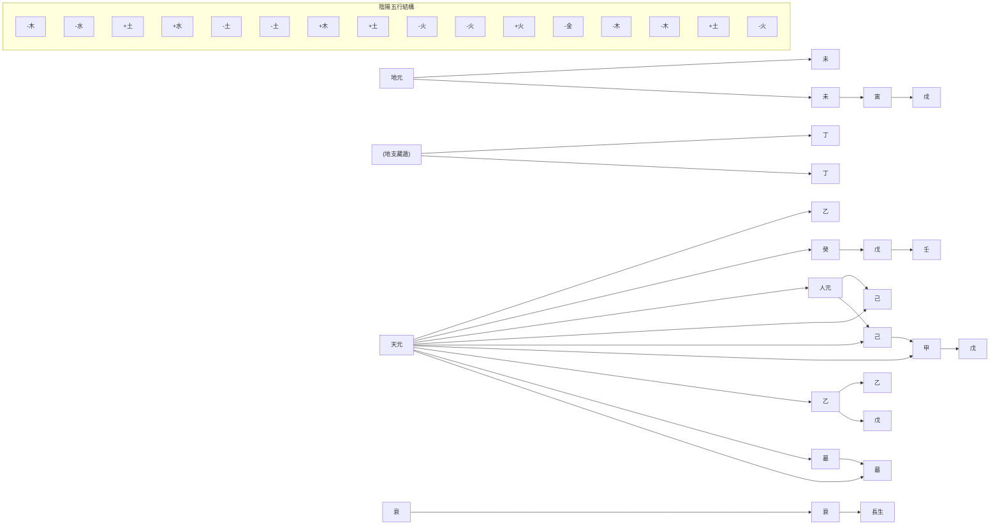
</details>

命例1A 乾造：錢穆先生（1895-1990）

對於日主戊土，日支為長生，是自坐長生。年支、月支為衰；時支為墓。雖不旺盛，但都有根基。

最後，考察日干是否得助？

那就是觀察天干是否有日干同類或生助日干的五行成分。年干乙木，月干、時干為壬、癸水。顯然是不在日主一方的成分，對日主無幫助。

綜合以上的觀察，此命造日主戊土：（1）得令：戊土生於夏天季月，是土當令時節；（2）得地：兩衰、一長生、一墓庫，尚有根基。（3）得助：則全無幫扶。

總的來說，此日主當斷為：偏強。

關於日主強弱的辨別，筆者在《八字命理學基礎教程》中設計了「強弱圖解分析法」，讀者可以參考和並予以演習。

# 扶抑用神

有了基本的強弱評估，也就是找到了問題。問題是八字結構內部作為日主「同方」（包括「我」、「生我」和「助我」者）與日主「異方」（包括「我生」、「我剋」和「剋我」者）之間在五行能量方面處於了不平衡的狀態。接下來是探求解決的辦法，使它們能趨於平衡。一般來說，弱者宜扶，強者宜抑，過強者宜泄。八字內部若有擔當這樣任務的成分或機制，就被稱為「用神」。

再來觀察錢穆命造。既然日主「偏強」，八字結構要趨於平衡，只有對其日主採取抑制或宣洩（消耗）的手段，方能奏效。那麼，這個結構內部有沒有這樣的機制呢？——有！年干透出的乙木正好能夠用來疏此厚土，並且它在年、月、日地支內皆有根基，故可取乙木為候選「用神」。同時，乙木有天干壬、癸水相生。壬、癸水可以作為輔助用神的「相神」。圖示如下：


<details>
<summary>flowchart</summary>

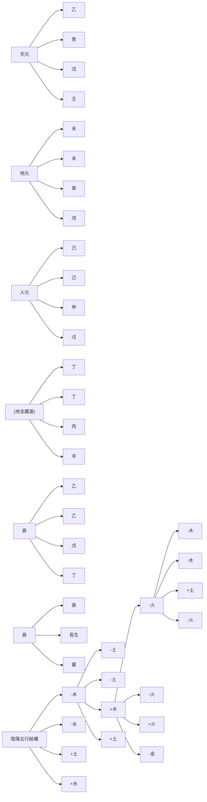
</details>

命例1B 乾造：錢穆先生（1895-1990）

圖中用神（乙木）的功能是幫助命局內部的五行恢復平衡。因為它涉及命局結構分析中的日主強弱問題，這類「用神」也就被稱為「扶抑用神」。

其實，「不平衡」本是自然界中常見的現象。八字結構中出現了不平衡的狀態並不足慮。問題是八字結構內部有沒有使之恢復平衡的機制。有恢復平衡的機制，就有了「生機」。一般來說，具有「用神」的八字結構都是比較良好的結構。

命理經典《繼善篇》說：「用神不可損傷，日主最宜健旺。」這是說，八字結構中既然有了「用神」，就希望它不要受到「損傷」。若受到損傷，它就無法再承擔起它應有的作用。這也是八字結構成功的重要條件。

其實，強弱的評判也有一個「度」的問題。一般來說，命局日主在地支上有個「根」，就不會是弱不堪扶了。

以上是强弱分析的基本内容。

# 調候

作為八字結構分析的第二個重要視角是「調候」。

何謂「調候」？

調候，就是調和氣候，也就是調和人跟環境之間的關係。人生活在這個地球上，必須要有一個「寒暖燥濕」既不太「偏」、也不太「過」的環境。這是人能活動於天地之間的最起碼的外界條件。沒有這樣的條件，人類何以生存呢？故八字結構中出現嚴重的調候偏向時，「調候為急」，即調候必須優先考慮，就成了命理中一條重要原則。

那麼，如何來確定八字結構的寒暖燥濕狀況呢？

實際上，寒暖是溫度；燥濕是乾濕度。寒暖主要是氣候；燥濕當以局勢論。作為克服這類障礙的主要手段，對於「暖燥」太過的狀況，最好是「雨露潤之」——用癸水滋潤；對於「寒濕」太過的狀況，則莫過於「太陽暄之」——用丙火照暖。在一般的情況下，夏天是容易引起暖燥的季節，冬天則是容易引起寒濕的季節，因此，各個日主，夏季基本上都離不開癸水，冬季都離不開丙火。癸和丙，是最重要的調候要素。

下面再來看一下錢穆先生的八字。錢穆先生生於夏季，正是燥熱的時令。所幸的是其八字有壬水、癸水出現在天干，於是八字結構就有了「自足」的調候用神，避免了夏季外部環境的炎燥氣候。圖示右頁：


<details>
<summary>flowchart</summary>

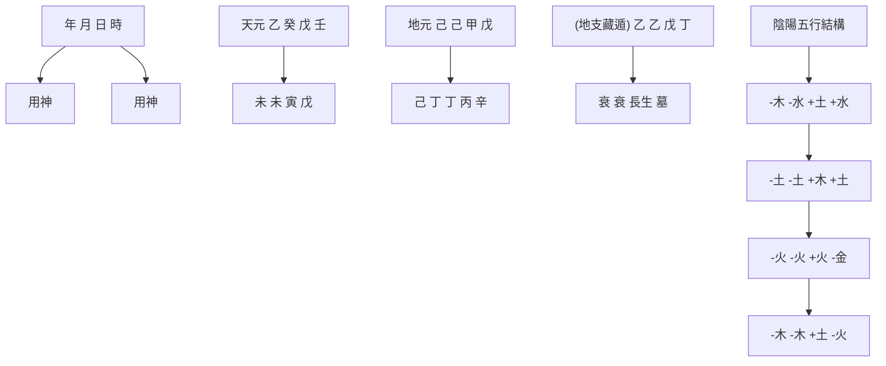
</details>

命例1C 乾造：錢穆先生（1895-1990）

可見，夏天出生的人，命局中有癸水；冬天出生的人，命局中有丙火，都可算得上是「得天獨厚」的人了，至少其八字結構已經在相當程度上排除了「調候」偏頗的問題。

為了幫助初學者瞭解調候分析的內容，筆者在《八字命理學基礎教程》設計了干支寒暖燥濕計分的工具，讀者可以參考。通過計分評估，選取調候用神。

誠如第二章所談到的，命理學史上系統地討論調候問題的經典著作是《窮通寶鑒》（原名《攔江網》）。它是「以十干配十二月，察其生旺休囚，以定取用之準則」(5)。因此它的編排方式，是以十個天干分別對照十二個月，討論其取用的準則和內容，共一百二十組。台灣梁湘潤把它們編錄在以下十日干「調候用神表」中：(6)

表4.4 調候用神表

<table><tr><td rowspan="2"></td><td>寅</td><td>卯</td><td>辰</td><td>巳</td><td>午</td><td>未</td><td>申</td><td>酉</td><td>戌</td><td>亥</td><td>子</td><td>丑</td></tr><tr><td>正月</td><td>二月</td><td>三月</td><td>四月</td><td>五月</td><td>六月</td><td>七月</td><td>八月</td><td>九月</td><td>十月</td><td>十一月</td><td>十二月</td></tr><tr><td>甲</td><td>丙癸</td><td>庚丙戊丁己</td><td>庚丁壬</td><td>癸丁庚</td><td>癸丁庚</td><td>癸丁庚</td><td>庚丁壬</td><td>庚丁丙</td><td>庚甲壬丁癸</td><td>庚丁戊丙</td><td>丁庚丙</td><td>丁庚丙</td></tr><tr><td>乙</td><td>丙癸</td><td>丙癸</td><td>癸丙戊</td><td>癸</td><td>癸丙</td><td>癸丙</td><td>丙癸己</td><td>癸丙丁</td><td>癸辛</td><td>丙戊</td><td>丙</td><td>丙</td></tr><tr><td>丙</td><td>壬庚</td><td>壬己</td><td>壬甲</td><td>壬庚癸</td><td>壬庚</td><td>壬庚</td><td>壬戊</td><td>壬癸</td><td>甲壬</td><td>甲戊庚壬</td><td>壬戊己</td><td>壬甲</td></tr><tr><td>丁</td><td>甲庚</td><td>庚甲</td><td>甲庚</td><td>甲庚</td><td>壬庚癸</td><td>甲壬庚</td><td>甲庚丙戊</td><td>甲庚丙戊</td><td>甲庚戊</td><td>甲庚</td><td>甲庚</td><td>甲庚</td></tr><tr><td>戊</td><td>丙甲癸</td><td>丙甲癸</td><td>甲丙癸</td><td>甲丙癸</td><td>壬甲丙</td><td>癸丙甲</td><td>丙癸甲</td><td>丙癸</td><td>甲丙癸</td><td>甲丙</td><td>丙甲</td><td>丙甲</td></tr><tr><td>己</td><td>丙庚甲</td><td>甲癸丙</td><td>丙癸甲</td><td>癸丙</td><td>癸丙</td><td>癸丙</td><td>丙癸</td><td>丙癸</td><td>甲丙癸</td><td>丙甲戊</td><td>丙甲戊</td><td>丙甲戊</td></tr><tr><td>庚</td><td>戊甲丙壬丁</td><td>丁甲丙庚</td><td>甲丁壬癸</td><td>壬戊丙丁</td><td>壬癸</td><td>丁甲</td><td>丁甲</td><td>丁甲丙</td><td>甲壬</td><td>丁丙</td><td>丁甲丙</td><td>丙丁甲</td></tr><tr><td>辛</td><td>己壬庚</td><td>壬甲</td><td>壬甲</td><td>壬甲癸</td><td>壬己癸</td><td>壬庚甲</td><td>壬甲戊</td><td>壬甲</td><td>壬甲</td><td>壬丙</td><td>丙戊壬甲</td><td>丙壬戊己</td></tr><tr><td>壬</td><td>庚丙戊</td><td>戊辛庚</td><td>甲庚</td><td>壬辛庚癸</td><td>癸庚辛</td><td>辛甲</td><td>戊丁</td><td>甲庚</td><td>甲丙</td><td>戊丙庚</td><td>戊丙</td><td>丙丁甲</td></tr><tr><td>癸</td><td>辛丙</td><td>庚辛</td><td>丙辛甲</td><td>辛</td><td>庚壬癸</td><td>庚辛壬癸</td><td>丁</td><td>辛丙</td><td>辛甲壬癸</td><td>庚辛戊丁</td><td>丙辛</td><td>丙丁</td></tr></table>

# 要素的優化組合

事實上，以上「調候用神表」不僅彰顯了調候的要求，同時，它還展示了各個日干對其他五行要素的選擇。換句話說，它表述了天干要素之間的優化配置的問題。

若把上述在冬、夏雨季中起調侯作用的丙火、癸水暫放一邊，再將「調侯用神表」中與十日干關係最為密切的天干要素羅列出來，可以得到如下的一些重要配置：

甲——庚、丁
乙——丙、癸
丙——壬
丁——甲、庚
戊——甲、丙、癸
己——甲、丙、癸
庚——丁、甲
辛——壬、甲
壬——庚（辛）
癸——辛（庚）

首先, 不難發現, 天干甲、丁、庚三者之間聯繫異常緊密: 對於甲, 調侯用神為庚、丁; 對於丁, 調侯用神為甲、庚; 對於庚, 調侯用神為丁、甲。甲、丁、庚, 三者循環為用, 體現了《窮通寶鑒》中的一個重要創見: 用庚劈甲引丁。

其次，天干乙木跟丙火、癸水關係密切，這也是容易理解的。乙木是陰柔之木，猶如花草籐蘿灌木，自然喜歡丙火陽光的喧暖和癸水雨露的滋潤。

再次，天干丙火跟壬水的關係密切。徐樂吾曾注說：「丙火不畏水剋而懼土洩，日照江湖，分為晶瑩。」可見丙為太陽，壬為湖海，「日照湖海」，通過萬頃碧波的映照，反射出太陽的燦爛光輝來。所以，丙以壬水輔映，是丙、壬結合的特點。

再次，戊土和己土，無論是陽土還是陰土，若是火炎土燥，則為「旱田」，稼禾不長，必須要有雨露——癸水的滋潤，所謂「稼禾在田，最喜甘沛」。相反，濕泥寒凍時，又必須要有陽光——丙火的照暖，所謂「濕泥寒凍，非丙暖不生」。對於土，陽光和雨露都很重要性。然而，《窮通寶鑒》還十分強調甲木對戊、己土的作用。它指出：「戊土厚重，非用甲木疏之，則土不靈。」而己土「令土暖而又潤，複用甲疏之」。顯然，土若沒有甲木的疏闢，則土不靈。

再次，辛金跟壬水的關係，也極為密切。與庚金喜丁火煅煉完全不同，辛金喜壬水淘洗。因此徐樂吾說：「庚金以剋為功，辛金以洩為美，其性質殊也。」為甚麼會如此？因為辛金是陰金，性柔和，比喻為珠寶首飾，是柔弱的金，故特別喜歡壬水的淘洗。

最後，壬、癸水跟庚金、辛金之間的配置關係。事實上，這是水跟其源頭的關係。《窮通寶鑒》說：「水不絕源，仗金生而流遠。」就是說，水依賴於金，方能源遠流長。尤其是在春、夏季節；到了秋季，特別是酉月，月令辛金司權，金水相生，名「金白水清」。此時，壬水「非旺非弱，但取其澄澈」；而「癸水清潤，辛金虛靈，金白水清，相得益彰。」由此可見水、金之間的密切關係。

再回過頭來看錢穆先生的八字。八字以戊土為日主，生於未月。查以上「調候用神表」，喜「癸、丙、甲」的要素組合。八字中未、未燥土，寅戌拱火，因此癸水高懸，輔以壬水，是極好的調候用神和良好的要素組合。八字已經燥熱，不宜丙火，是顯而易見的。然而，局中以乙木為主導勢力，而寅木（含甲木）則因與戊土相拱而損力。誠如徐樂吾在《窮通寶鑒》注文所言：「戊土以甲木為貴，四季皆同。乙木官星，無疏土之力，徒混雜耳。」顯然結構中用乙木來擔任疏土功能，是差強人意了。

# 註釋

(1) 錢穆先生生卒時間見其墓碑鐫刻。  
(2). 見《命運的求索》152頁。  
(3). 《李虛中命書》，《四庫術數類叢書》（七），809-817頁。  
(4). 在西漢京房把五行的態勢引進易卦的時候，採取的是「水土同行」。因此，早期命理學也是採取「水土同行」的。在《李虛中命書》中採取的也還是「水土同行」。到《淵海子平》，則完全是「火土同行」了。  
(5). 徐樂吾語。  
(6). 錄自梁湘潤《余氏用神辭淵》。  
(7). 這裏我們仍用「調候」這個名稱，實際上它已經超出了狹義的「調候」（調節氣候）意義。

# 第五章 關係：格局

本章討論八字結構分析的第三個重要視角——格局分析。

在命理學史上，宋代徐子平的功績並不僅是重新確定了八字結構的核心，同時「專主五行，不主納音」；他還有一個十分重要的貢獻是突破了「喻象」分析層面，開始向「關係」分析層面轉移。這就是「十神」概念的形成和設立，開啟了由十神到格局的全面研究。這正是本章要講述的內容。

# 十神

甚麼是十神？所謂「十神」，就是日干與其他成分的陰陽五行之間關係的代名詞。具體來說，當確定了八字結構中的核心——日主，它跟其他可能遇上的十個天干之間將構成甚麼樣的關係呢？由於有地支藏遁，地支可以表述為不同的天干成分。因此，要討論日主跟結構中其他七個干或支的關係，都可以統一到天干符號上來。故確定它們之間的關係，並冠以一定的名稱，是分析工作的開始。因為有十種關係，就有了十種名稱，統稱為「十神」。它們是：

比肩、劫財、傷官、食神、正財、偏財、正官、七殺、正印、偏印。

右列是「天干十神表」：

表5.1 天干十神表

<table><tr><td>十神日干</td><td>比肩</td><td>劫財</td><td>食神</td><td>傷官</td><td>偏財</td><td>正財</td><td>七殺</td><td>正官</td><td>偏印</td><td>正印</td></tr><tr><td>甲</td><td>甲</td><td>乙</td><td>丙</td><td>丁</td><td>戊</td><td>己</td><td>庚</td><td>辛</td><td>壬</td><td>癸</td></tr><tr><td>乙</td><td>乙</td><td>甲</td><td>丁</td><td>丙</td><td>己</td><td>戊</td><td>辛</td><td>庚</td><td>癸</td><td>壬</td></tr><tr><td>丙</td><td>丙</td><td>丁</td><td>戊</td><td>己</td><td>庚</td><td>辛</td><td>壬</td><td>癸</td><td>甲</td><td>乙</td></tr><tr><td>丁</td><td>丁</td><td>丙</td><td>己</td><td>戊</td><td>辛</td><td>庚</td><td>癸</td><td>壬</td><td>乙</td><td>甲</td></tr><tr><td>戊</td><td>戊</td><td>己</td><td>庚</td><td>辛</td><td>壬</td><td>癸</td><td>甲</td><td>乙</td><td>丙</td><td>丁</td></tr><tr><td>己</td><td>己</td><td>戊</td><td>辛</td><td>庚</td><td>癸</td><td>壬</td><td>乙</td><td>甲</td><td>丁</td><td>丙</td></tr><tr><td>庚</td><td>庚</td><td>辛</td><td>壬</td><td>癸</td><td>甲</td><td>乙</td><td>丙</td><td>丁</td><td>戊</td><td>己</td></tr><tr><td>辛</td><td>辛</td><td>庚</td><td>癸</td><td>壬</td><td>乙</td><td>甲</td><td>丁</td><td>丙</td><td>己</td><td>戊</td></tr><tr><td>壬</td><td>壬</td><td>癸</td><td>甲</td><td>乙</td><td>丙</td><td>丁</td><td>戊</td><td>己</td><td>庚</td><td>辛</td></tr><tr><td>癸</td><td>癸</td><td>壬</td><td>乙</td><td>甲</td><td>丁</td><td>丙</td><td>己</td><td>戊</td><td>辛</td><td>庚</td></tr></table>

從表中，我們可以查到日干與其他任何一個天干之間的關係。比如，日干甲遇到八字中出現的另一個甲，這個甲就是日干的比肩；遇到乙，是日干的劫財；遇到丙，是食神；遇到丁，是傷官；……順序查找，便可以得到它們各自的十神名稱。

前文討論日主強弱時，按五行的生剋關係，從日干出發，可以構成我方（包括「我」、「生我」和「同我」）和異方（包括「我生」、「剋我」和「我剋」）。若再把五行的陰陽區分放進去，五種關係就變成了十種關係。上表羅列的就是這十種關係。十神就是這十種關係的代名詞。

具體來說，「生我」者，為正印、偏印（也稱梟印）；「我生」者，為傷官、食神；「剋我」者，為正官、七殺（也稱偏官）；「我剋」者，為正財、偏財；「同我」者，為比肩、劫財。它們之間的關係可以圖示如下：


<details>
<summary>flowchart</summary>

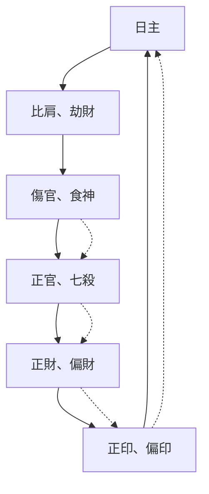
</details>

圖5.1 十神生剋關係  
(圖中實線表示相生關係；虛線表示相剋關係)

因為天干之間有陽見陽、陰見陰、陽見陰、陰見陽的分別，所以把異性相遇（陽見陰或陰見陽）歸納為：正印、傷官、正官、正財、劫財；把同性相遇（陽見陽或陰見陰）歸納為：偏印、食神、七殺、偏財，比肩。顯然，這是根據日主跟各天干陰陽五行之間的生剋關係，對已有的天干符號的再一次符號化。

於是，對一個已經排好的八字，就可以根據上表，把十神符號標記在各個字的上下。這樣，各個天干以及地支內所藏的人元，它們跟日主的關係便通過標記的十神符號而一目了然了。

還是以錢穆的八字為例：


<details>
<summary>flowchart</summary>

```mermaid
graph LR
    A["陰陽五行結構"] --> B["本氣"]
    A --> C["陰陽五行結構"]
    A --> D["陰陽五行結構"]
    A --> E["陰陽五行結構"]
    A --> F["陰陽五行結構"]
    A --> G["陰陽五行結構"]
    A --> H["陰陽五行結構"]
    A --> I["陰陽五行結構"]
    A --> J["陰陽五行結構"]
    A --> K["陰陽五行結構"]
    A --> L["陰陽五行結構"]
    A --> M["陰陽五行結構"]
    A --> N["陰陽五行結構"]
    A --> O["陰陽五行結構"]
    A --> P["陰陽五行結構"]
    A --> Q["陰陽五行結構"]
    A --> R["陰陽五行結構"]
    A --> S["陰陽五行結構"]
    A --> T["陰陽五行結構"]
    A --> U["陰陽五行結構"]
    A --> V["陰陽五行結構"]
    A --> W["陰陽五行結構"]
    A --> X["陰陽五行結構"]
    A --> Y["陰陽五行結構"]
    A --> Z["陰陽五行結構"]
    A --> AA["陰陽五行結構"]
    A --> AB["陰陽五行結構"]
    A --> AC["陰陽五行結構"]
    A --> AD["陰陽五行結構"]
    A --> AE["陰陽五行結構"]
    A --> AF["陰陽五行結構"]
    A --> AG["陰陽五行結構"]
    A --> AH["陰陽五行結構"]
    A --> AI["陰陽五行結構"]
    A --> AJ["陰陽五行結構"]
    A --> AK["陰陽五行結構"]
    A --> AL["陰陽五行結構"]
    A --> AM["陰陽五行結構"]
    A --> AN["陰陽五行結構"]
    A --> AO["陰陽五行結構"]
    A --> AP["陰陽五行結構"]
    A --> AQ["陰陽五行結構"]
    A --> AR["陰陽五行結構"]
    A --> AS["陰陽五行結構"]
    A --> AT["陰陽五行結構"]
    A --> AU["陰陽五行結構"]
    A --> AV["陰陽五行結構"]
    A --> AW["陰陽五行結構"]
    A --> AX["陰陽五行結構"]
    A --> AY["陰陽五行結構"]
    A --> AZ["陰陽五行結構"]
    A --> BA["陰陽五行結構"]
    A --> BB["陰陽五行結構"]
    A --> BC["陰陽五行結構"]
    A --> BD["陰陽五行結構"]
    A --> BE["陰陽五行結構"]
    A --> BF["陰陽五行結構"]
    A --> BG["陰陽五行結構"]
    A --> BH["陰陽五行結構"]
    A --> BI["陰陽五行結構"]
    A --> BJ["陰陽五行結構"]
    A --> BK["陰陽五行結構"]
    A --> BL["陰陽五行結構"]
    A --> BM["陰陽五行結構"]
    A --> BN["陰陽五行結構"]
    A --> BO["陰陽五行結構"]
    A --> BP["陰陽五行結構"]
    A --> BQ["陰陽五行結構"]
```
</details>

命例1D 乾造：錢穆先生（1895-1990）

這裏我們用以下的通用的簡體來標記八字結構中的十神：

官=正官；殺=七殺（偏官）；財=正財；才=偏財；印=正印；

$P$ =偏印（枭神）；比=比肩；劫=劫財；傷=傷官；食=食神

十神關係的確立，大大擴大了命理描寫的廣度和深度。它從原本五行「喻象」的分析的層面，即直接用五行生剋關係的類象來討論各成分之間的關係，拓展到了「關係」分析的層面，即通過反映五行生剋關係的代名詞——十神來予以討論，這樣做便具有了更大的概括性。

# 基本功能

對一個具體的八字，標記了十神以後，就可以運用十神的概念去考察它們對日主的功能。以下是十神的一些基本特徵和功能：

# 1. 正官

正官是克制日主的。日干跟正官是陽見陰剋，或陰見陽剋，因異性相吸，陰陽和諧，剛柔相配，其情和洽，故是「陰陽配合成其道也」 $^{(1)}$ 。官者，管也。但正官對日主的管束，一般是善意的，故認為正官是善神。

· 功能：衛財，生印，拘身，制劫。

因此，日主旺盛，則喜正官，因正官有拘身的作用，使自身不敢胡作妄為；日強財弱，更愛正官，因為正官能克制劫財、護衛財源；若日主既旺，再見劫財，則需要正官制劫，使日主能潔身自好。

倘若身弱財旺，遂怕正官，財強猶恐自身不能勝任，何堪正官引財傷身；日干雖弱但印強，也怕正官，因為母多子病，不堪正官再來扶助印星；日主衰弱，當然怕見正官，身弱賴劫比幫助，自然不喜正官制去比劫了。

# 2. 七殺 (偏官)

偏官是剋日主的，並與日主同性，即陰見陰、陽見陽。因為由日干算起，正好相隔七位，而且，陰陽同性相斥，不能調和，故其情剛烈，其氣暴戾，所以也稱「七殺」。殺者，殺也，是日主的對頭。若無制裁，必傷其身，即是道地的「殺」了。但若有制的話，則能借小人之力，護衛君子，以成威權，此時則稱為偏官。

· 功能：耗财，生印，攻身，制劫。

因此，日主強，喜七殺；若印輕，更喜殺來生印；若財重的話，也喜殺來耗財生印；身強往往劫重，七殺正好可以發揮它制劫的作用。

如果日主弱的話，大多是怕見七殺的：身弱極需比劫相助，而七殺正好是克制比劫的。所以論命時，見到七殺，一般要先行處理，這就是所謂「有殺先論殺，無殺方論用」 $^{(2)}$ ，也就是先看看結構中是否有制神能克制住七殺，或者有印綬來化解七殺。在早期命理中，因七殺暴戾，一般被認為是凶神。

# 3. 正財、偏財

日主所剋，且與日主異性者，為正財；與日主同性者，為偏財。財無論正、偏，都是耗泄自身的，因此，自身必須強健，方堪任財。財雖為養命之物，但並非人人命中皆喜，關鍵在於自身的強弱。

· 功能：生官殺，泄傷食，制梟神，壞正印。

因此，日主強，則喜財。財不僅帶來財富，而且會生出官殺，克制比劫，保護財源，提高社會地位。若身強食神、傷官旺的話，喜財來流通食傷的秀氣，化為財帛可供享用。若身強印也重，更需要財來克制梟印，使自身不至於過旺而失去平衡。

倘若日主弱，就不再喜歡財來了。因為財能生出官殺，惹出禍害；同時財會破印，使自身失去依賴，變得更弱不堪扶了。

# 4. 正印、偏印

生我者，為印綬。但異性相生，為正印；同性相生，則為偏印。印綬是生日主的，猶如父母，多施蔭庇。在早期命理中，一般把正印看作是善神，偏印看作是凶神。這有點跟正官、七殺的情形相似。原因是：正印能克制傷官，保護正官，維護自身的地位；而偏印卻會剋倒食神。食神可以用來制殺，若食神被制，則七殺囂張，日主自然就會受到威脅。這也是偏印遇到食神，被稱為「梟神」的原因。

· 功能：生身，泄官殺，禦傷，挫食。

日主弱，自然喜歡印綬來助身；若官殺力強，則更需印綬來泄官殺之氣而生身。倘若身弱傷食重，也需印綬來挫傷食而扶弱主。在身弱用印時，偏印之力往往大於正印之力，此時用偏印較佳；如果身非過弱，不需要很大的生扶力量，則喜正印勝過偏印。因為正印之氣純，知所進退；而偏印之氣乖，所謂「愛之欲其生，恨之欲其死」，常常不知其進退。

若日主強盛，自然就不喜歡印綬來幫扶了：日干強，財官力薄，印綬會進一步耗泄財官的勢力；日干強，傷食輕，就怕印綬再來挫敗傷食，使自身的秀氣無法流轉，失去生財的機會。然而，在身強無須用印時，正印的出現，還可無大害；偏印太盛，尤其在身旺宜宣洩時，危害較甚。

# 5. 傷官、食神

傷官、食神，同為我生，與我性異者為傷官，同性者為食神。在早期命理中，雖然傷食皆為我所生，但一般將傷官看作凶神，食神看作吉神。原因是：傷官會克制正官。正官是善神，能管束自身，使之循規蹈矩。然而遇上傷官，則被其所傷。日主失去管束，自然會放蕩不羈，傲物妄為了。食神就不同。食神能克制七殺，七殺乃攻身之物，它若得制，日主便可安然自適，悠遊裕餘；而且食神能生財，使其寬裕不竭。

· 功能：泄身，生財，敵殺，損官。

因此，日主強，財官無氣，這時最喜傷食，用傷食來流通自身的秀氣；若身強財弱，也愛用傷食來泄身生財；倘若官殺重而身輕，日主處處受制，也喜傷食來制官殺以存身。在制殺和生財方面，傷官之力不及食神之純之大；但若從泄秀這點而言，傷官之力就遠甚食神了。因為傷官之氣壯而厲，多謀善詐，只求實現目的，不擇手段，不像食神拘謹保守，故往往傷官成就為大。這有點像七殺之於正官，若得用適當，七殺反見顯赫。

倘若身弱，日主自顧不暇，自然就怕傷食來盜泄其氣了。財旺身弱，也不宜傷食。因為體力已弱，既不能任財，傷食再來生財，則未見其利而先蒙其害。如日主強，官殺輕，此時也不喜歡傷食。官殺為權尊，傷食破之，則喪失貴氣。食神過重，可用梟印挫之；傷官過重，則用正印為利。

# 6. 比肩、劫財、祿、刃

與日主同類又同陰陽者，為比肩；與日主同類而不同陰陽者，為劫財。

甚麼是「祿」呢？在「十天干生旺死絕歷程表」中，對照日主天干，地支為「臨官」者，即日主之「干祿」，簡稱為「祿」。甲祿在寅，乙祿在卯，丙、戊在巳，丁、己在午，庚在申，辛在酉，壬在亥，癸在子。

甚麼是「刃」呢？「刃」是「羊刃」的簡稱。《淵海子平.論羊刃》說：「夫羊刃者，號天上之凶星，作人間之惡殺，以祿前一位是也。（如甲祿在寅，卯為羊刃。)……何謂羊刃？甲、丙、戊、庚、壬五陽有刃；乙、丁、己、辛、癸五陰無刃，故名陽刃。」具體來說，甲羊刃在卯，丙、戊在午，庚在酉，壬在子。 $^{(3)}$

不難發見，為祿的，地支中有日干的比肩；為刃的，地支中藏有日干的劫財。早期命理認為，比肩和祿是吉神；劫財和刃是凶神。原因是：比肩之性正而純，劫財之性惡而雜。祿雖旺，但旺猶未艾，因此性較平和；刃則是旺氣到了盡頭，瞬息之間將轉衰敗，故其性剛暴，其氣如刀刃之鋒利，這就頗具險象了。

· 功能：幫身，任官殺，代泄，奪財。

因此，當日主衰弱時，喜比、劫、祿、刃的幫扶，才有生發之機，因為它們能助日干而任官殺，能代日干而受傷食之泄。從幫身的角度講，劫和刃的力量較盛。當日主本身強旺時，比、劫、祿、刃則無用處。這時，劫、刃之害則甚於比、祿。倘如身強財弱，尚憂財之不足，此時劫、刃出現，分財奪財，一掃而盡，則為害尤烈。

顯然，以上這些功能都是從十神相互之間的生剋關係中引伸出來的。如果對於十神之間的生剋關係熟悉的話，這些功能是不難理解的。它們成了八字命理推理的重要工具。

# 如何取格局？

瞭解了八字結構內各成分的十神關係、以及它們的基本功能以後，接下來的任務，就是選取格局。

甚麼是格局？這是命理學中一直令人困擾的名詞。它在命理發展歷史過程中曾有過不同的含義。這裏不去追溯它具體的來龍去脈。對於初學者來說，格局，就是八字結構的大的分類。任何有意義的研究，面對紛雜眾多的現象，總要先做出分類，才能進行深入分析。就像植物學研究，對種類繁雜的植物要進行分類一樣。既然我們從五行走到了十神，那麼，格局也可以分成十種。它們是：

傷官格、食神格、正財格、偏財格、正官格、七殺格、正印格、偏印格，以及建祿格、劫刃格。

那麼，如何取格呢？

《淵海子平》指出：「凡格用月令提綱，勿於旁求年日時為格。」(4)就是說，要從月令提綱中來取。

# 具體方法是:

(1) 首先觀察月令地支，即提綱，若月支本氣透出於天干的，應先取為格。  
(2) 如果天干上未透出月支本氣，而透出月支所藏之神，即以該神取為格局。如果支中藏有兩神，皆透出天干，則酌取其一為格。  
(3) 如果月支與其他地支構成會方或合局，即以此會方或合局為格。  
(4) 如果以上三個條件都不能滿足，此時就酌取有力而無剋合者為格。

這裏，還是以錢穆的命造為例來予以說明。


<details>
<summary>text_image</summary>

年 月 日 時
格局 官 財 才
天元 乙 癸 戊 壬
地元 未 未 寅 戊
人元 己劫 己劫 甲殺 戊比
(地支藏遁) 丁印 丁印 丙口 辛傷
乙官 乙官 戊比 丁印
衰 衰 長生 墓
陰陽五行結構
-木 -水 +土 +水
-土 -土 +木 +土
-火 -火 +火 -金
-木 -木 +土 -火
本氣
</details>

命例1E 乾造：錢穆先生（1895-1990）

命造日主戊土，生於未月（六月），月令提綱是未土。其本氣為己土劫財，還含有丁火正印和乙木正官。按照以上的取格方法，首先注意到月令本氣——己土劫財，但它沒有透露；而屬於地支中附屬之氣的乙木正官，卻透露在年干上。根據取格方法（2），此命造的格局應取為正官格。正官格的人端莊正直，重責任，講規範，有理想目標。這倒是符合國學大師錢穆先生的風範的。

為甚麼要這樣取格呢？筆者認為，取格的根本目的，是發現八字結構中除日干之外的主導力量。這個主導力量一定程度上體現了命局主人的人生價值取向。它對應着人生活動的諸個領域。

因此，從月令去尋找，是符合這個目標的。誠如《三命通會》所說：「以五行之氣，為月令當時為最。」因為這是人出生時，月令地支所直接指向的外部自然生態環境中相關的五行最旺盛的氣息，它直接影響了人的生命機制。從這裏下手，就可以避免紛繁的現象，直接抓住了要領。

對於格局，一般而言：(5)

正官格：利於求名求官，女命旺夫。

正財格：利於求財求利，男命妻緣好。

七殺格：利於權力，但小人多。

偏財格：利於投機之財，桃花運多。

食神格：利於專業享受，女命旺子女。

傷官格：利於藝術，女命不利姻緣。

正印格：利於承繼，安閒生活。

偏印格：利於宗教，女命不利子女緣。

建祿、羊刃格：白手起家，不利婚姻感情。

# 格局用神

同強弱分析、調候分析一樣，格局分析的重要目的是選取格局的用神。它是結構內部的自我完善的機制。

那麼，如何選取格局的用神呢？

這就要談到對格局做出深刻研究的經典著作《子平真詮》。作者沈孝瞻把格局（依據代表格局的「用事之神」）分為兩類：「善」者和「不善」者。前者「財格、官格、印格和食神格；後者是七殺格、傷官格、建祿格和羊刃格。」 $^{(6)}$ 接着，對於「善」者，他的處理法則是「順用之」（即順着相生的線路處理）；對於「不善」者，處理法則是「逆用之」（即沿着相剋的線路處理）。他主張「當順而順，當逆而逆，配合得宜，皆為貴格。」

這裏的「善」和「不善」，雖然在分類上承繼了《淵海子平》中的「善神」和「凶神」，但它們並不真的具有「善」或「凶」的實際內涵。它們只是分類的不同名稱罷了，其目的是為了適應不同處理法則的需要。至於能否成為「貴格」，不在於「善」和「不善」；關鍵在於「配合得宜」四個字上。

那麼，甚麼又是「配合得宜」呢？簡單說，就是「善」類格局要符合「順用」法則；「不善」類格局要符合「逆用」法則。這是選取格局用神的大原則。(7).

具體來說，比如正官格，正官屬於「善神」，不宜見傷官去克制它。正官格見傷官克制，一般情況下就是破格。正官格需要「順用之」，就是說，如果身強官弱，應當以財扶官；如果身弱官強，則宜以印化官。財生官，或官生印，都是沿着相生線路「順用之」。相反，對於「不善」的七殺，就希望「逆用之」，也就是使用克制的手段，用食神制約它，或用傷官駕馭它，或者直接用羊刃與之抗衡。這就是「逆用之」的基本含義。

我們來考察一下作為正官格的錢穆命例，看看如何取用神：


<details>
<summary>flowchart</summary>

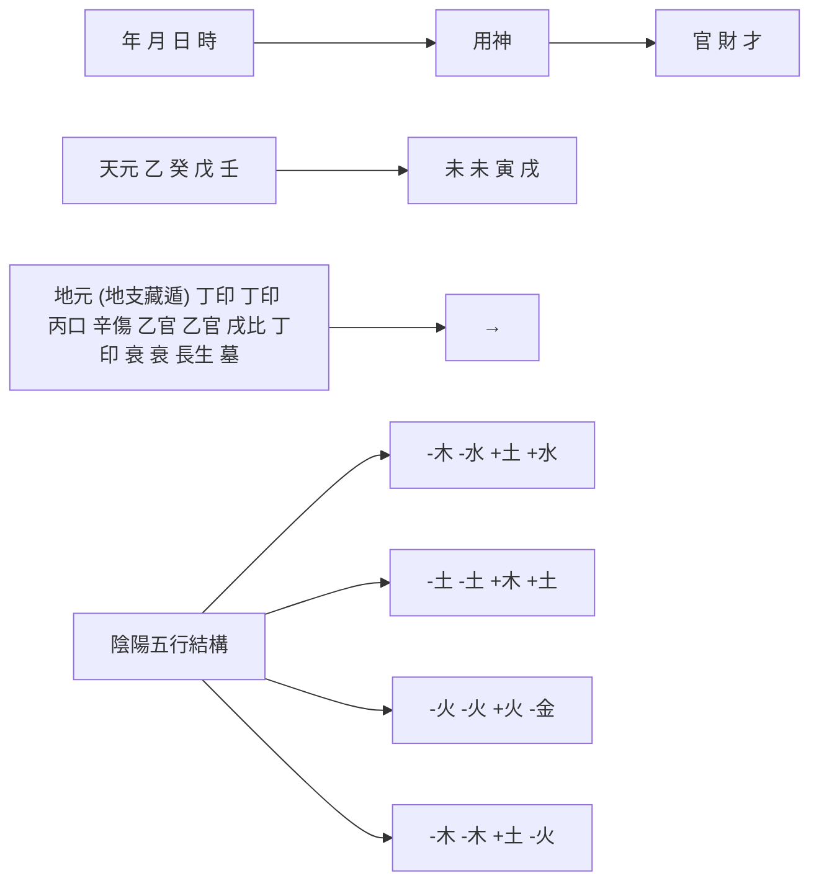
</details>

命例1F 乾造：錢穆先生（1895-1990）

此八字結構中，根據前面的強弱分析，日主方「偏強」。與之對比，正官乙木雖然在地支（未、未、寅）有根基，但仍顯弱勢。官弱身強宜扶官，八字月干和時干有癸水、壬水正、偏財，它們輔助乙木正官，具有格局用神的功能。顯然，從格局到格局用神，這個八字是相當完備的。錢穆先生被中國學術界尊為「一代宗師」，更有學者謂其為「中國最後一位士大夫」，與呂思勉、陳垣、陳寅恪並稱為「史學四大家」，除了其他因素之外，在命理上確有其成功的先天「基因」。

下面再來看一個正官格的案例。這是清代「太平宰相」劉鏞命造。(8)


<details>
<summary>flowchart</summary>

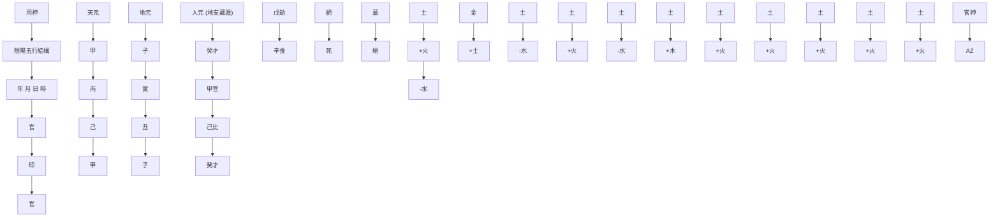
</details>

命例2 乾造：[清] 劉鏞

先看月令提綱，其中本氣是甲木正官，它透出於年干，故取為正官格。也就是說，在這個八字結構中，除日干之外，甲木正官是此環境中的主導力量。同前錢穆命造一樣，根據「善而順用之」法則，與之相配合的「用神」可以有兩種選擇：（1）取財來生官；或者（2）取官來生印。這時，就要瞭解日主本身的強弱。如果日主身強，則取（1）：用財來生官，即起到「生格功能」。此時，正官為格，財為用神。如果日主身弱，則取（2）：正官為格，正印為用神。用官來生印，印再生自身。這就是通過印來宣洩官的能量，即是發揮正官力量，強化自身；同時也起到它的「護格功能」。因為印能克制傷食，保護正官。

觀察這個八字，己土生於正月，是木旺土衰之時，八字中僅有丑土為其根基，勢力孤單，顯然屬於第（2）種情況。所以，應當取月干丙火正印為用神。於是，構成了官印相生的良好順生格調。這是成功的官印相生格。

# 格局「高低」的評判

上面列舉了兩個命例，都是正官格。現在，我們來比較兩者的「高低」。先說格局的高低。

構成格局的主要因素是結構中的主導勢力，我們要求它「單純」、「有力」。

單純，就是命理學中常說的「清」。「清」是跟「濁」相對的。就如上面的八字，主導勢力是正官，就不要再混入七殺。如果正官和七殺都有，就是「官殺混雜」，尤其是都顯現在天干上，就變「濁」了。劉鏞命造干支只有正官，沒有七殺，所以十分單純，好像金剛鑽石沒有一點瑕疵。而錢穆命造日主坐下有寅木七殺。儘管瑕不掩瑜，但與劉造相比，則略有遜色。

其次是「有力」。劉鏞命造正官甲木通根於提綱月支寅木，是月令當旺之氣，十分有力。錢穆命造正官乙木則通根於未土所藏之氣（墓氣）。就有力程度來講，錢造則還是稍嫌不足。

此外，劉鏞命造，月令地支所有成分——本氣寅木、附屬之氣丙火和戊土，都透出天干，可謂「真神」得用。這是要加分的。當然，天干透出兩甲，有重官之嫌，則又有損清純之氣。

在格局方面，兩造都很優秀。若要評分的話，國學大師比起「太平宰相」似乎略輸一籌。

再評用神的高低。簡單說，也有兩條標準：一是「有力」，一是「有情」。

以此標準來評價這兩個命造：錢造身強官弱，壬、癸水為用神，生扶官星；劉造官強身弱，丙火印星化官生身，以此而言，兩造用神都很完善。若要進一步細細較量，劉造丙火正印根植於月令，其力氣盛飽滿；錢造雖干頭呈露壬、癸兩水，但都虛透無根，相比之下，又較遜色了。

格局研究是書房派的「強項」，不斷精益求精，佳作迭出，曾經是命理學的主流。它對於評判命主在社會上的功名地位，積累了豐厚的推算經驗。只是在目前的大眾社會裏，它慢慢消退了其昔日的風彩。

關於八格及建祿、劫刃格的基本特徵和成敗條件，可以參閱拙作《八字命理學基礎教程》「格局述要」。

# 註釋

(1). 《淵海子平.正官論》。  
(2). 《淵海子平.五言獨步》。  
(3). 一般認為，羊刃既是「祿前一位」，在陽干名「陽刃」；在陰干則為「陰刃」。《三車一覽》解釋說：「羊，言剛也。刃者，取宰割之義。祿過則刃生，功成當退，不退則過越其分，如羊之在刃，言有傷也。故羊刃常居祿前一位。」因此，陰干之刃則為：乙在辰，丁、己在未，辛在戌，癸在丑，即陰干的「冠帶」之位。陽干之氣以進為生旺，陰干之氣以退為生旺，故陽干之羊刃在「帝旺」，陰干之羊刃在「冠帶」。但《淵海子平》顯然不主張陰干有刃之說。

(4). 《淵海子平.寶法第一》。  
(5). 以下摘自鄺偉雄《子平正源》，16-17頁。  
(6). 現在一般把七殺、傷官、梟印和羊刃四者列為「不善」者。  
(7). 由於《子平真詮》用「用神」稱「格局」（用事之神），因此用「相神」來指稱實際意義上的「用神」。這是我們讀《子平真詮》時應當注意的。  
(8). 取自鍾義明《現代破譯「滴天髓」》：「劉鏞 嘉慶八年十二月二十八日（1804年2月9日）子時生。」，「這個劉鏞不是中視周日八點檔連續劇《宰相劉羅鍋》的主角——那個雞胸、駝背的劉墉（山東諸城人，1720- 1805）。此『鏞』非彼『墉』也。」（215-216頁）

# 第六章 形象分析

本章要討論結構分析的第四個視角——形象分析。這是一個相對比較特殊的分析視角。並不是所有的八字都呈現出一些比較特殊的形象特徵，適合於做形象的分析。傳統格局研究中的特殊格（或稱「變格」），往往是具有特殊形象的八字結構，它們是形象分析的一個重要內容。

# 專旺格

在傳統命理學中，八字命局可以分為兩大類：正格和變格，或稱普通格和特殊格。正格反映的是五行常規的變化；如果五行出現了「偏勝」，就落入了變格的範疇。誠如民國命理大師徐樂吾所說：

格局有正、有變。正者，五行之常規；變者，五行有所偏勝。然萬變而不離其宗者：五行之理也。《子平真詮》明其常；《滴天髓》明其變。(1)

我們在前一章裏討論的是正格，可以說，《子平真詮》代表了正格研究的高峰；現在討論變格，往往是從《滴天髓》中獲得方法論的啟迪，可惜這本經典因其運思和文字的曲折艱深，往往難住了許多研究者。

以下清代李鴻章的八字常被作為專旺格的經典案例：


<details>
<summary>flowchart</summary>

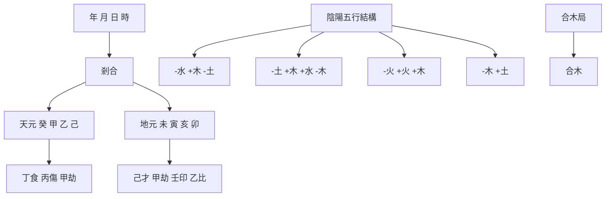
</details>

命例3 乾造：[清] 李鴻章（1823-1901） $^{(2)}$

觀察其八字，可以清楚地看到，由天干甲乙、地支亥卯未（合木局）以及寅（寅亥合木），凝聚成完整的木的「形象」。年干癸水，為木之印綬；水生木，水木氣勢，同聲相應。而且寅月正是萬木競秀的時光。唯有時干己土，為日干乙木偏財，是整個結構中「不諧和」的地方。所幸者，月干甲木，剋合己土，使結構重歸「純真」。故徐樂吾先生將此命造稱之為「格之純粹者也」，是有道理的。

再看一個古代案例——張真人命造：


<details>
<summary>flowchart</summary>

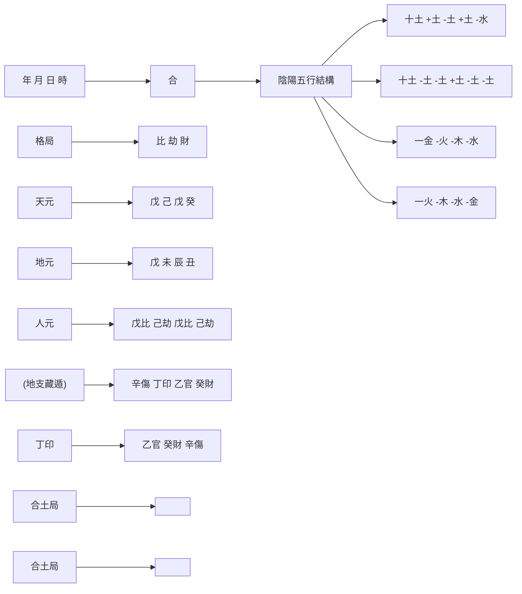
</details>

命例4 乾造：張真人 $^{(3)}$

八字日干戊土，年月天干透出戊、己土，地支辰戌丑未合成土局，唯一透出的時干癸水，也被日主合去（戊癸合），全局是一個純粹的土象。這也是一個一行獨旺的專旺格。

由此可見，專旺就是所謂「獨象」，是指八字結構基本是由某一種五行（包括日干在內）所組成，故也稱「一行得氣格」。既然「地有五行」，故有五種專旺格：曲直格（木）、炎上格（火）、稼穑格（土）、從革格（金）和潤下格（水）。顯然，以上李鴻章命造是曲直格；張真人命造是稼穑格。

誠如任鐵樵所指出：專旺格「皆從一方之秀氣，不同六格之常情，必要得時當令，遇旺逢生。但體質過於自強，須以引通為妙，而氣勢必有所關，務須審察其情。」 $^{(4)}$ 可見，由於專旺格的特點是八字某一五行得時當令，特別旺盛，因此就不能「逆」着來，抗其旺勢了。換言之，不能再按正格以求取五行平衡為宗旨了。

怎麼辦？只能是「順應」其勢，取最旺之物為格，取旺神（比肩、劫財）與旺神所生之物（即食神、傷官）為用神，同時也取生旺神之物（即印星）做喜神。由於命局一行獨旺，必須有食神、傷官來宣洩日主的旺氣。故《滴天髓》強調說：「獨象喜行化地，而化神要昌。」這化神就是食神、傷官，通過食傷來疏通其旺氣，使其源遠流長，從而造就富貴之高峰。如果命局中沒有食傷來流通其氣息的話，其富貴也就有限了。(5)

# 從旺格

還有一種八字結構情況稱為「從旺格」。它與專旺格正好相反。如果說，專旺格在日主強弱等級上處於「極強」一端，而從旺格正好處於此強弱等級的「極弱」一端。《滴天髓》把這種情況稱為「從象」。這是指八字結構中，全局氣勢偏旺一方，而獨有日干逆其旺氣，而且無生無助，於是不得不捨身遷就，棄命向從，由此構成了「從旺格」（也稱「從強格」或「棄命從強格」）。

比如以下任鐵樵注《滴天髓》中的命例：


<details>
<summary>flowchart</summary>

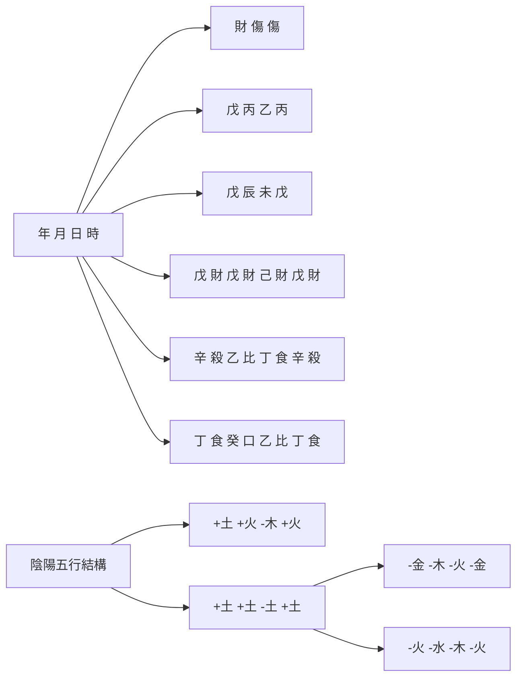
</details>

命例5 乾造：從財格古例 $^{(6)}$

在這個八字結構中，地支皆為財（土），年干又透出正財，而月干、時干皆為丙火傷官，傷官又生財，其財勢何其旺也。而日干乙木，孤立無援，只能放棄自己去隨從土之旺勢。因為土已彙集成一個「形象」。跟專旺格相反，日主此時只能棄命從勢，所以，從旺格也稱「棄命從旺格」。這裏棄命從財，故為從財格。

在八字結構中，除日主外，其他成分都可能構成強勢，如傷食，如財星，如官殺。因此，根據結構中強勢的十神類別，可以形成從兒格（即從傷食星）、從財格、和從殺格。還有一種，雖然不是單獨的一種勢力，但由日主異方的幾種成分共同構成一種強勢，使日主不得不從，這種情況稱為「從勢格」。

對於以上四種「從象」類型，《滴天髓》說：「從得真者只論從，從神又有吉和凶。」「真從之象有幾人？假從亦可發其身。」這裏，一方面指出了，在從格中，日主所遷就、所從的那個強勢主體，構成了八字的主體形象，所以日主只能跟隨這個強勢主體，以強勢主體為自己的用神。故跟專旺格一樣，從旺格也必須遵循「順應」的原則，只是現在順應的對象變了，不是日主自己所屬的強勢集團，而是結構中非日主的強勢集團。

同時，《滴天髓》也提醒研究者，對於這類八字，由於原局的純粹度、干支性情、時令的宜忌及行運的順逆情況，還得十分慎重地判斷其利弊。事實上，純粹而完美的從旺格是很稀少的。常見的富貴命，大都是帶有瑕疵的從財格、從殺格等。然而，這種八字，只要在行運中消除缺點，也可以表現出極大的成功來。

# 「強勢」形象

除了上述專旺格和從旺格之外，事實上，八字中還有不少嚴格意義上講並不屬於特殊格的八字結構，但卻具有一定「強勢」（即一股強盛的氣勢），也需要用形象視角來予以分析。比如，曾為民國時期著名政治家，皖系軍閥首領的段祺瑞命造。在徐樂吾所著《命理一得》中，段祺瑞八字為：


<details>
<summary>text_image</summary>

年 月 日 時
比 才 丁
乙 己 乙 癸
丑 卯 亥 未
己才 乙比 壬印 己才
癸 口    甲劫 丁食
辛殺 祿    乙比
合木局
陰陽五行結構
-木 -土 -木 -水
-土 -木 +水 +土
-水    +木 -火
-金    -木
本氣
</details>

命例6A 乾造: 段祺瑞 (1865年3月6日未時生) $^{(7)}$

這是一個構成「獨象」的曲直格（木）。乙木生於仲春建祿之地，地支有亥卯未木局，且時干有癸水生扶。唯月干有己土偏財透出，不利木勢，但有雙乙左右剋之。然而生於丑年，「而丑為金之分野，有脫離祖基，別創局面之象，」「惟曲直不純，」 $^{(8)}$ 故稍有瑕疵。

然而，據吳廷燮所撰《段祺瑞年譜》記載：「清同治四年乙丑二月初九日午時公誕生於安徽合肥。」因此，段祺瑞應該早一個時辰出生，其八字為：


<details>
<summary>flowchart</summary>

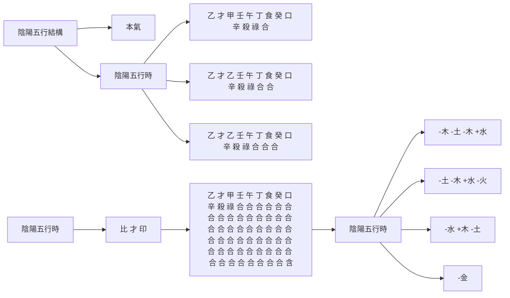
</details>

命例6B 乾造：段祺瑞（1865年3月6日午時生）

於是，這個八字就很難再稱之為屬於專旺範疇的曲直格了。然而，雖然提早了一個時辰，時柱換了壬午，八字結構內部的水木強勢並沒有多大改變。三個木（兩個乙木植根於月令卯祿），兩個水（壬水植根於亥祿），再加上一個午火宣洩強木之氣，而己土偏財依舊遭雙乙克制。查其真實運途情況，與前面專旺格的看法並沒有根本的差異，還是喜水木「順勢」，忌土金破局。謂予不信，可以檢點其主要政途經歷：

大運

<table><tr><td>1865年</td><td>1875年</td><td>1885年</td><td>1895年</td><td>1905年</td><td>1915年</td><td>1925年</td><td>1935年</td></tr><tr><td>1歲</td><td>11歲</td><td>21歲</td><td>31歲</td><td>41歲</td><td>51歲</td><td>61歲</td><td>71歲</td></tr><tr><td>戊</td><td>丁</td><td>丙</td><td>乙</td><td>甲</td><td>癸</td><td>壬</td><td>辛</td></tr><tr><td>寅</td><td>丑</td><td>子</td><td>亥</td><td>戌</td><td>酉</td><td>申</td><td>未</td></tr></table>

段祺瑞是袁世凱小站練兵時的主要骨幹。段是1903年（亥運癸卯年）加入的，與馮國璋、王士珍並稱為「北洋三傑」。袁世凱死後，北洋軍閥集團分裂為直系和皖系，段為皖系軍閥首領，於1916年至1920年、以及1924年至1926年，兩次控制北京政府，任國務總理、執政府執政等職，是北洋軍閥統治時期政治舞台上的重要人物。

查1916年至1920年，段氏是在癸水大運（2015年5月至2020年5月）。1920年，直奉兩系結成反段聯盟進攻皖系，皖軍大敗。7月19日，段祺瑞被迫辭職。此年庚申，已入酉運（2020年5月至2025年5月）。1924年甲子，10月23日馮玉祥發動北京政變，推翻大總統曹錕，先邀請孫中山北上，後與奉系妥協，請段祺瑞出山，任中華民國臨時政府的臨時執政。然而，1926年丙寅，發生了「三一八」慘案，4月9日段祺瑞被馮玉祥驅逐下台，退居天津租界當寓公。這還是在西運。段祺瑞病逝於1936年11月2日，終年71歲。此年丙子，在剛跨進辛未大運不久。

固然，辛未運與段氏八字年柱乙丑天剋地沖，流年丙子與時柱壬午天剋地沖。是年段氏病逝。但根本原因還是辛金出干，破了乙木之勢。縱觀其政壇叱吒風雲的時候，大多在水木運中，而見金則多為風雨飄搖，諸多不利。可見具有「強勢」形象的八字，跟特殊格八字在處置上沒有大的差別。

正是鑒於這樣的原因，筆者提出「形象」這個分析視角，來處理具有「強勢」形象的八字，而傳統命理學中的變格、或特殊格（包括專旺和從旺）只是其中的一部分。筆者覺得，《滴天髓》提到的「兩氣合而成象，象不可破也。」過去一直被解釋為「兩神成象」或「兩行成象」（即兩種五行各佔二干二支，沒有其他五行混雜的八字），是誤解了《滴天髓》的原意。這裏的「兩氣合而成象」並不一定要是指對等的兩行。它們構成相生關係，在數量上也不一定要均等，只要能構成「強勢」就可以了。既然已成形象，那只能順其氣勢而為，不可輕易違逆其勢。

前些日子看到一個「富婆」的八字，也具有特殊形象。八字如下：


<details>
<summary>text_image</summary>

年 月 日 時
食 劫 印
戊 丁 丙 乙
申 巳 戌 未
庚才 丙比 戊食 己傷
壬殺 庚才 辛財 丁劫
戊食 戊食 丁劫 乙印
合 刑
陰陽五行結構
+土 -火 +火 -木
+金 +火 +土 -土
+水 +金 -金 -火
+土 +土 -火 -木
本氣
</details>

大運

<table><tr><td>1971年</td><td>1981年</td><td>1991年</td><td>2001年</td><td>2011年</td><td>2021年</td><td>2031年</td></tr><tr><td>4歲</td><td>14歲</td><td>24歲</td><td>34歲</td><td>44歲</td><td>54歲</td><td>64歲</td></tr><tr><td>丙</td><td>乙</td><td>甲</td><td>癸</td><td>壬</td><td>辛</td><td>庚</td></tr><tr><td>辰</td><td>卯</td><td>寅</td><td>丑</td><td>子</td><td>亥</td><td>戌</td></tr></table>

命例7 坤造：「富婆」（1968年5月16日未時生）

這個八字構成的具體形象可以圖示如下:


<details>
<summary>flowchart</summary>

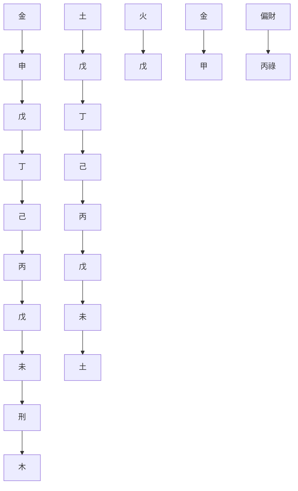
</details>

圖6.1 命例圖解（命例7）

這個八字是火土成勢。具體來說，從時干乙木起源頭，乙木生左側丙丁火（倒也構成了「地上三奇」乙丙丁），火向下擴展到月支巳火。接着，干頭丁火又生年干戊土，同時地支巳火，生右側戌未土。於是命局火土成了大勢。這時，一個重要現象出現了：年干戊土向下生年支申金偏財；同時巳火向左剋合申金。巳本是日主丙火之祿，可以看作日主自己的延伸。從「象」上看，火土積聚了大量能量灌輸到申金偏財，同時作為日主延伸的巨手——巳祿，通過合剋，又一把將此財產搶握在自己手中——以祿制財。由此構成了一幅生動的命主生財、奪財的畫面。此女人的先天「時空基因」已經註定她會有一個「不尋常」的財富生涯。

其實，命主出生在農村尋常人家，沒有受過多少教育，只是趕上了中國改革開放的好時光，家鄉成了當地省級政府的致富樣板地。於是，從癸亥運起下海從商致富，似乎甚麼都幹過：做小商品產銷，開磚廠做磚瓦，倒賣字畫，金融借貸，不一而足。丑運最佳，積累財富幾個億。命理上的原因是日主坐庫戍土去刑開了丑運財庫，於是一發沖天。然而，壬子運中甲午年，歲運交戰，被合作姐妹坑了巨額貸款，至今還陷在追討的官司中。從命理角度講，子運合了申金，成了半個水局，「逆」了命局的火土旺勢，焉能太平？現在只有期待接下來的辛金運，再啟財源，重上層樓。

# 淺談「制局」

這裏，筆者想起許多年前在尤達人著的《達人知命四十年》上讀到的一個真實的八字故事：

這是1936年，在汕頭近郊，幾個朋友一起探討八字。對一位姓蔡的小學教師的八字，尤達人發表了意見。他說：「將來乙運必發，發得不小，丑運必破，破得清光。」

右頁是這位蔡先生的八字：


<details>
<summary>text_image</summary>

年 月 日 時
印 比 食
戊 辛 辛 癸
申 酉 巳 巳
庚劫 辛比 丙官 丙官
壬傷 庚劫 庚劫
戊印 戊印 戊印
祿
陰陽五行結構
+土 -金 -金 -水
+金 -金 +火 +火
+水 +金 +金
+土 +土 +土 +土
本氣
</details>

大運

<table><tr><td>5歲</td><td>15歲</td><td>25歲</td><td>35歲</td><td>45歲</td><td>55歲</td></tr><tr><td>壬</td><td>癸</td><td>甲</td><td>乙</td><td>丙</td><td>丁</td></tr><tr><td>戊</td><td>亥</td><td>子</td><td>丑</td><td>寅</td><td>卯</td></tr></table>

命例8 乾造：蔡先生（戊申年八月二十八日巳時生）

蔡先生當時說：「一個清寒的教書先生，怎麼會發財，而且發得不小。既然發了財，怎麼會破，而且破得清光。」

尤達人的理由是：因為乙運是辛癸乙循序相生，身旺任財，宜其駿發致富。丑運是巳酉丑會劫局，身旺忌劫，故會破得清光。

當時其他人說，既然乙運既發，以後丙寅、丁卯東方運也應是好運。只有尤達人一人力持異議，說道：「好景不常，盛宴難再。」

結果呢？抗戰爆發後，蔡先生到大後方，因人介紹，當了一個田賦分處主任，居然不到幾年就賺了數逾百萬港幣的財富，這正是他走乙運的時候。後來，為了防「劫」，他乾脆辭了主任的職務，回到家鄉，對賺來的財產做了妥善的安置。沒有想到1949年解放軍解放了潮汕地區。蔡先生1950年輾轉逃亡到香港。當年流年庚寅，干頭透「劫」，地支寅申相沖，財產統統被清算了。不僅乙運賺來的錢財，連祖上留下的田產、祖屋都清光了。尤達人10年前的「丑運必破，破得清光」不幸而言中了。以後20年，只是在工廠做職員，再也沒有重振雄風的機會了。

關於這個命例，當時讀了以後印象頗深。尤達人先生是從日主旺衰和地支會局來分析的。現在來看，它就是一個今天「盲派」所謂的「制局」問題。八字結構中沒有木，即沒有財，而日主建祿身強，時干有又食神吐秀。一旦大運出現乙木偏財，天干辛金動員起來，正好把乙木制個乾淨；局中本來就有戊土正印，把乙木的原神癸水也一同制去了。所以這財就大了。自然，過了乙運，地支會成劫局，又回到原地去了，一場戲劇謝幕，「盛宴難再」。

寫到這裏，想到《八字命理學動態分析教程》附錄中王永成先生「專旺格漫談」中例所舉的一個成功的企業家的八字：


<details>
<summary>text_image</summary>

年 月 日 時
官 才 印
乙 壬 戊 丁
巳 午 午 巳
丙 丁 印 丁 印 丙 丁
庚 食 己 劫 己 劫 庚 食
戊 比 戊 比 戊 比
祿 刃 刃 祿
陰陽五行結構
本氣
-木 +水 +土 -火
+火 -火 -火 +火
+金 -土 -土 +金
+土        +土
</details>

大運

<table><tr><td>1974年</td><td>1984年</td><td>1994年</td><td>2004年</td><td>2014年</td><td>2024年</td></tr><tr><td>9歲</td><td>19歲</td><td>29歲</td><td>39歲</td><td>49歲</td><td>59歲</td></tr><tr><td>辛</td><td>庚</td><td>己</td><td>戊</td><td>丁</td><td>丙</td></tr><tr><td>巳</td><td>辰</td><td>卯</td><td>寅</td><td>丑</td><td>子</td></tr></table>

命例9 乾造：著名企業家（1965年7月3日巳時生）

這個八字也是具有特殊形象的，可以圖示如下：


<details>
<summary>flowchart</summary>

```mermaid
graph TD
    A["木"] --> B["乙"]
    C["水"] --> D["壬"]
    E["土"] --> F["戊"]
    G["合"] --> H["丁"]
    I["巳"] --> J["火"]
    K["午"] --> L["火"]
```
</details>

圖6.2 命例圖解（命例9）

它具有火土強勢。從源頭看，年干乙木生坐下巳火，地支巳、午、午、巳，皆是日主戊土之祿、刃，它們構成一片火海。時干再透出丁火，生日主戊土。真是火炎土燥。所幸的是，壬水獨踞月干，可以潤局，有調候之功。然而，水火無情，相激難容。這時，時干丁火遙合壬水，以熊熊火勢，反制其財，構成了大富的局面。這是這個八字的畫龍點睛之處。同時地支兩巳兩午，虛邀亥、子之水，為壬財之根基。這正是王先生在文中所分析的。

然而，這個八字也有隱患。每逢亥、子流年，這個虛邀的壬水之祿、刃得到「填實」，一旦坐實，便出現「反局」。旺水「破」了現存八字的火土強勢。於是「災情」接踵而來。這也為其人創業過程中幾次大的起落經歷所證實。

今年又到了亥、子「週期」，希望這位企業家朋友沒有大的風波。

這裏又要談到《滴天髓》這本經典了。《滴天髓》在「四柱總論」中有個「眾寡論」。其原文是：

強眾而敵寡者，勢在去其寡；強寡而敵眾者，勢在成乎眾。(9)

徐樂吾先生在《子平一得》中對此做了解釋：

四柱氣勢偏旺一方者，以順其旺勢為用，如有一二點逆旺氣之神，必以去之為美。此逆氣者在日干，即是從格；在年月時干，則為強眾敵寡，勢在去其寡。其理一貫相通也。(10)

仔細琢磨《滴天髓》的原意和徐先生的解釋。《滴天髓》的原意是：（1）我方為強勢，對方為弱勢，則「去其寡」——制盡對方；（2）我方為弱勢，對方為強勢，則「成乎眾」——順勢相助對方。

其中（2）所指的是前文講述過的從旺格；而（1）所述的情形，正是這裏討論的情況。以上這位企業家的八字正是「強眾而敵寡者，勢在去其寡」，就是要制盡局中壬水財神，成就大事業。這跟《段氏理象學》中提出的「盲派」「追捕」原理也是相通的。

段氏所謂的追捕原理是：

當命局出現制局做功的情況下，被制的一方因相對孤立，而制方成黨成勢十分強大，這種情況下我們一般稱這類制局為淨制。制方稱捕神，被制方稱賊神。就像警察抓小偷一樣，警察特別強的時候，如果小偷特別少，或者沒有小偷，警察就沒有用武之地。他就希望小偷出現，一出現正好就被他抓住，就可以體現他的價值。這是追捕的原理。(11)

根據「追捕」原理，蔡先生（命例8）命局本身無財星，它是把大運出現的財星制淨了，所以駿發致富。前述「富婆」（命例7）八字中，既然作為局中之「寡」的申金偏財已經被「強眾」的火土「淨制」了。這時，就如強大的警察隊伍希望再出現小偷，讓他們透露出警察的威風來。因此小偷多，並不可怕，反而體現了警察治安的能力。

然而，這位企業家的八字（命例9），也是有強大的警察隊伍，圍剿着「小偷」，然而一旦這個小偷（壬水）去勾結了「土匪」（亥、子旺水），則警察就未見的能解決得了。通過上述案例的分析，顯然，「制局」成功與否，還是要對具體環境條件細加分析後才能下結論。

# 附：神煞舉要

在第二章介紹命理學史的時候，我們提到過「神煞」。所謂「神」，是吉星；「煞」，是凶星。神煞是很早就流傳的一種星宿照命和神煞入命的觀念。把天上星宿、神煞跟人的命運聯繫起來，是出於古代人對星和神的崇拜心理。

神煞本身不是一種穩定的系統。究竟有多少個神煞？很難說清楚。它們隨着歲月的流逝，自生自滅，自然淘汰。吳俊民《命理新論》中曾列出了一百九十餘種名目。這裏，我們選擇一些目前還較常使用的神煞， $^{(12)}$ 列表如下，供研究者參考：

表6.1 以日柱天干為主，見年、月、日、時地支者：

<table><tr><td>日干</td><td>甲</td><td>乙</td><td>丙</td><td>丁</td><td>戊</td><td>己</td><td>庚</td><td>辛</td><td>壬</td><td>癸</td></tr><tr><td>天乙貴人</td><td>丑未</td><td>子申</td><td>亥酉</td><td>亥酉</td><td>丑未</td><td>子申</td><td>丑未</td><td>午寅</td><td>巳卯</td><td>巳卯</td></tr><tr><td>文昌</td><td>巳</td><td>午</td><td>申</td><td>酉</td><td>申</td><td>酉</td><td>亥</td><td>子</td><td>寅</td><td>卯</td></tr><tr><td>干祿</td><td>寅</td><td>卯</td><td>巳</td><td>午</td><td>巳</td><td>午</td><td>申</td><td>酉</td><td>亥</td><td>子</td></tr><tr><td>羊刃</td><td>卯</td><td>辰</td><td>午</td><td>未</td><td>午</td><td>未</td><td>酉</td><td>戌</td><td>子</td><td>丑</td></tr><tr><td>紅艷煞</td><td>午</td><td>申</td><td>寅</td><td>未</td><td>辰</td><td>辰</td><td>戌</td><td>酉</td><td>子</td><td>申</td></tr></table>

比如日干甲，見四柱地支有丑或未，則丑或未為「天乙貴人」；見巳，則為「文昌」；見寅，則為「干祿」；見卯，則為「羊刃」；見午，為「紅艷煞」。關於天乙貴人、文昌、干祿、羊刃和紅艷煞的命理涵義如下：

天乙貴人：吉神，主聰敏智慧，易近貴人。

文昌：吉神，主聰明過人，凡事逢凶化吉。

干祿：吉神。祿是俸祿，是養命之源。祿在年支，叫做歲祿；祿在月支，叫做建祿；祿在日支，叫做專祿；祿在時支，叫做歸祿。一律均怕入空亡或犯沖。

羊刃：羊，有時寫作「陽」，是剛的意思。刃即刀刃，是宰割的意思。羊刃比祿更強旺有力，主剛烈招禍，屬凶煞。有的書主張，五陽干有刃，五陰干無刃。

紅豔煞：主浪漫、色情。

表6.2 以日柱地支為主，見年、月、時地支者：

<table><tr><td>日支</td><td>子</td><td>丑</td><td>寅</td><td>卯</td><td>辰</td><td>巳</td><td>午</td><td>未</td><td>申</td><td>酉</td><td>戌</td><td>亥</td></tr><tr><td>將星</td><td>子</td><td>酉</td><td>午</td><td>卯</td><td>子</td><td>酉</td><td>午</td><td>卯</td><td>子</td><td>酉</td><td>午</td><td>卯</td></tr><tr><td>華蓋</td><td>辰</td><td>丑</td><td>戌</td><td>未</td><td>辰</td><td>丑</td><td>戌</td><td>未</td><td>辰</td><td>丑</td><td>戌</td><td>未</td></tr><tr><td>驛馬</td><td>寅</td><td>亥</td><td>申</td><td>巳</td><td>寅</td><td>亥</td><td>申</td><td>巳</td><td>寅</td><td>亥</td><td>申</td><td>巳</td></tr><tr><td>桃花</td><td>酉</td><td>午</td><td>卯</td><td>子</td><td>酉</td><td>午</td><td>卯</td><td>子</td><td>酉</td><td>午</td><td>卯</td><td>子</td></tr><tr><td>劫煞</td><td>巳</td><td>寅</td><td>亥</td><td>申</td><td>巳</td><td>寅</td><td>亥</td><td>申</td><td>巳</td><td>寅</td><td>亥</td><td>申</td></tr><tr><td>亡神</td><td>亥</td><td>申</td><td>巳</td><td>寅</td><td>亥</td><td>申</td><td>巳</td><td>寅</td><td>亥</td><td>申</td><td>巳</td><td>寅</td></tr></table>

將星：主有領導能力，可掌權柄。

華蓋：主性情恬淡，資質聰穎，但難免孤獨，易傾向哲學、宗教。

驛馬：主遷動。古代驛為傳送官府文書的機關，驛馬是傳遞官文書的交通工具。所以驛馬通常代表動態。驛馬可吉可凶，視與原局五行配合論斷。

桃花：又名咸池，主風流酒色。

劫煞：劫者，奪也。自外奪之謂之劫。多是非破財。

亡神：亡者，失也。自內失之謂之亡。易是非官訟。

表6.3 以年柱地支為主，見月、日、時地支者：

<table><tr><td>年支</td><td>子</td><td>丑</td><td>寅</td><td>卯</td><td>辰</td><td>巳</td><td>午</td><td>未</td><td>申</td><td>酉</td><td>戌</td><td>亥</td></tr><tr><td>孤辰</td><td>寅</td><td>寅</td><td>巳</td><td>巳</td><td>巳</td><td>申</td><td>申</td><td>申</td><td>亥</td><td>亥</td><td>亥</td><td>寅</td></tr><tr><td>寡宿</td><td>戌</td><td>戌</td><td>丑</td><td>丑</td><td>丑</td><td>辰</td><td>辰</td><td>辰</td><td>未</td><td>未</td><td>未</td><td>戌</td></tr></table>

命帶孤辰、寡宿，六親緣薄。男命不喜帶孤辰，較易孤獨；女命不喜帶寡宿，容易夫早別離。

表6.4 以月柱地支為主，見日干或日支者：

<table><tr><td>月支</td><td>子</td><td>丑</td><td>寅</td><td>卯</td><td>辰</td><td>巳</td><td>午</td><td>未</td><td>申</td><td>酉</td><td>戌</td><td>亥</td></tr><tr><td>天德</td><td>巳</td><td>庚</td><td>丁</td><td>申</td><td>壬</td><td>辛</td><td>亥</td><td>甲</td><td>癸</td><td>寅</td><td>丙</td><td>乙</td></tr><tr><td>月德</td><td>壬</td><td>庚</td><td>丙</td><td>甲</td><td>壬</td><td>庚</td><td>丙</td><td>甲</td><td>壬</td><td>庚</td><td>丙</td><td>甲</td></tr></table>

天德貴人：最大安詳之福星。主貴顯、仁慈、敏慧、溫順，逢凶化吉，終身吉祥。較易接近宗教。

月德貴人：安詳福壽兩全之星，為人多仁慈，萬事呈祥。

表6.5 以年柱、日柱六甲干支見地支者：

<table><tr><td colspan="10">六甲旬(年干支或日干支)</td><td>空亡</td></tr><tr><td>甲子</td><td>乙丑</td><td>丙寅</td><td>丁卯</td><td>戊辰</td><td>己巳</td><td>庚午</td><td>辛未</td><td>壬申</td><td>癸酉</td><td>戌、亥</td></tr><tr><td>甲戌</td><td>乙亥</td><td>丙子</td><td>丁丑</td><td>戊寅</td><td>己卯</td><td>庚辰</td><td>辛巳</td><td>壬午</td><td>癸未</td><td>申、酉</td></tr><tr><td>甲申</td><td>乙酉</td><td>丙戌</td><td>丁亥</td><td>戊子</td><td>己丑</td><td>庚寅</td><td>辛卯</td><td>壬辰</td><td>癸巳</td><td>午、未</td></tr><tr><td>甲午</td><td>乙未</td><td>丙申</td><td>丁酉</td><td>戊戌</td><td>己亥</td><td>庚子</td><td>辛丑</td><td>壬寅</td><td>癸卯</td><td>辰、巳</td></tr><tr><td>甲辰</td><td>乙巳</td><td>丙午</td><td>丁未</td><td>戊申</td><td>己酉</td><td>庚戌</td><td>辛亥</td><td>壬子</td><td>癸丑</td><td>寅、卯</td></tr><tr><td>甲寅</td><td>乙卯</td><td>丙辰</td><td>丁巳</td><td>戊午</td><td>己未</td><td>庚申</td><td>辛酉</td><td>壬戌</td><td>癸亥</td><td>子、丑</td></tr></table>

這是由年干支或日干支查周圍地支中是否有入空亡者。空亡，就是沒有、消失的意思。天干僅十干，地支有十二支，因此，每十個天干配上地支之後，地支剩餘的二支，則為空亡。

比如，甲子旬（以甲子為首的順序十個干支）中沒有戌、亥，所以，戌、亥為空亡。命中所忌的地支，若帶空亡反為吉；命中所喜的地支，若帶空亡則為凶。帶有空亡的地支，若與他支合，則無妨；有相沖的地支，遇空亡可以解沖。年、月、日、時地支所主的人事，如帶空亡，必不得力或難以成功。但若有三者皆入空亡，反主大貴。

表6.6 以年月日時天干見者：

<table><tr><td>天上三奇</td><td>地上三奇</td><td>人中三奇</td></tr><tr><td>甲 戊 庚</td><td>乙 丙 丁</td><td>壬 癸 辛</td></tr></table>

以日主為主，到年為順者，主貴，如甲日、戊月、庚年；以年為主，到日為逆，主富，如甲年、戊月、庚日。物以奇為貴，三奇為貴人。

表6.7 以日柱干支見者：

<table><tr><td>魁罡</td><td>庚辰 壬辰 庚戌 戊戌</td></tr></table>

日柱魁罡，表示聰明、果斷。魁罡入命，若生旺力強，顯貴發福；如身衰力薄，則貧寒。怕刑沖。

比如，錢穆先生的命造，根據以上表格，可以查到具有的幾個神煞，羅列右頁：


<details>
<summary>text_image</summary>

年 月 日 時
官 財 才
乙 癸 戊 壬
未 未 寅 戌
己劫 己劫 甲剎 戊比
丁印 丁印 丙卩 辛傷
乙官 乙官 戊比 丁印
衰 衰 長生 墓
貴人 貴人 華蓋
陰陽五行結構
本氣
-木 -水 +土 +水
-土 -土 +木 +土
-火 -火 +火 -金
-木 -木 +土 -火
</details>

命例1G 乾造：錢穆先生（1895-1990）

年、月地支未為戊土日主之天乙貴人，為吉神，主聰明智慧，易近貴人。時支戌，對照日支寅，為華蓋，主性情恬淡，資質聰穎，但難免孤獨，易傾向哲學、宗教。這兩者似乎都是符合錢穆先生的人生經歷的。錢穆先生是自學成才。已近中年，經顧頡剛推薦，被聘為燕京大學國文講師，開始了大學教授的生涯。這不是遇上了伯樂？時帶華蓋，一生淡泊名利，追求學問；尤其是晚歲獨自離家赴香港，創辦新亞書院，成就一代宗師。

# 註釋

(1). 徐樂吾: 《子平真詮評注》「跋」。  
(2). 見徐樂吾《滴天髓補注》，81頁。李鴻章，字少荃，安徽合肥人。清末淮軍軍閥，近代洋務派首領。  
(3). 見《神峰通考》「稼穑格」，147頁。  
(4). 任鐵樵注《滴天髓闡微》卷一，78頁。  
(5). 在《神峰通考》中, 張楠根據自己推命的經驗指出: 「從革格, 謂庚辛日干, 見申酉戌全, 或巳酉丑全, 此多剝雜, 原非純粹可觀, 與壬癸潤下格理同。此二格吾見多矣, 未嘗有富貴者, 但當以別理推之。止有曲直、稼穑兩

格，多富貴。火全巳午未格，亦未見其美。由是尊其所正，而辟其所謬也。」（150頁）錄此供參考。

(6). 見任鐵樵注《滴天髓闡微》卷三。其大運為：

大運: 丁 戊 己 庚 辛 壬

巳午未申酉戌

任鐵樵批：「乙木生於季春，蟠根在未，餘氣在辰，似乎財多身弱。但四柱皆財，其勢必從。春土氣虛，得丙火以實之，且火乃木之秀氣。三者為全，無金以洩之，無水以靡之，更喜運走南方火地，秀氣流行，所以第發丹墀，鴻筆奏三千之績；命題金榜，鼇頭冠五百之仙。」

(7). 段祺瑞（1865-1936）安徽合肥人，字芝泉。畢業於北洋武備學堂，曾赴德學習軍事。1912年被袁世凱任為陸軍總長，次年代理國務總理。1916年出任參謀總長、代國務卿。袁死後，成為皖系軍閥首領，以國務總理操縱北洋政府。1920年被曹錕、吳佩孚南擊敗下台。1924年被奉系及馮玉祥推為北京臨時政府執政。1926年4月狼狽下台。1936年11月2日病死。

(8). 徐樂吾《命理一得》，106頁

(9). 鍾義明《現代破譯「滴天髓」》對此「語釋」為：「八字中，與主體相生助的五行因力量很大、數量很多，形成一個集團，而與這個集團對抗的五行只有一、二點極微弱的氣力時，必須顧全大局，把氣力微弱的對抗五行消除（剋泄）。相反的，主體氣力微弱，而對抗的五行力量很大、數量很多，形成一個強盛的反對集團時，必須順從，放棄主體，去生助反對集團的五行。」（6頁）

(10). 《子平一得》，17頁。載徐樂吾《命理一得》。

(11). 《段氏理象學》，77頁。

(12). 神煞的用法除了從八字命理著作中查到，還可以從《果老星宗》、《星平會海》、《星學大成》、《星海詞林》、《聿期經》、《易隱》及擇日的《叢辰》等書籍中查得。而清代《協紀辨方書》是一部集選擇之大成的著作，收錄了大量神煞。

# 第七章 動態：大運和流年

又要回到前文我們對命運做出的比喻：「命」是車，「運」是車經過的道路。從第四章到第六章，我們一直在「考量」這輛車子，用多視角的方法，剖析這輛車子的內部結構，找出它所屬的種類和主要性能。現在，我們要開始考察路況了。如果說前者是靜態研究，現在就是動態研究。因為路途既是連續的，又是一程一程的。在命理學中，刻畫動態的過程，主要有「大運」和「流年」。一個大運是十年；流年即是每一年。它如流水，一年接着一年。它們都是由六十甲子中的一組干支來標記的。

# 大運和流年

要考察動態的「運」，首先要排出命造的大運和流年來。其實，我們在前章命例7「富婆」和命例9企業家的八字討論時都已經羅列了他們的大運。

大運是從八字結構中的月柱推導出來的。推導之前，先要確定是「順行」還是「逆行」。順行或是逆行的法則是：陽男陰女順行，陰男陽女逆行。所謂「陽男陰女」指的是：男命出生於年干為陽的年份，名為「陽男」（即男命生於年干為甲、丙、戊、庚、壬的年份）；女命生於年干為陰的年份，名為「陰女」（即女命出生於乙、丁、己、辛、癸的年份）。反之，「陰男」是指男命出生於年干為陰的年份；「陽女」是指女命出生於年干為陽的年份。

接着，就可以推大運了：陽男陰女，大運從月柱干支順推；陰男陽女，大運從月柱干支逆推，由此排除大運的干支序列。

比如，命例7「富婆」八字——戊申，丁巳，丙戌，乙未。年柱「戊申」，戊為陽土，因此是「陽女」，故大運從月柱「丁巳」逆推，第一步為「丙辰」，第二步為「乙卯」，……循序羅列。

再如，命例9企業家八字——乙巳，壬午，戊午，丁巳。年柱「乙巳」，乙為陰木，因此是「陰男」，故大運從月柱「壬午」逆推，第一步為「辛巳」，第二步為「庚辰」，……也是循序羅列。

再下去是求出大運的起始點。順推者，按出生的時間順序數至未來的節氣（不是「中氣」），「折除乃三日為年」，得到大運的起始時間；逆推者，則從出生時間倒推、數至已過的那個節氣，也是「折除乃三日為年」，得到大運的起始時間。無論大運是順行還是逆行，每一柱干支管十年。

這樣，命例7出生於1968年5月16日未時。當年立夏是5月5日18時56分，芒種是6月5日23時19分。因為是逆推，從16日未時倒數至前一節氣立夏5日酉時，然後除以3，約數為3，所以是3歲起運；若更精確的講，是出生後3年7個月2天2小時，即1971年12月18日15時交運。

同樣，命例9出生於1965年7月3日巳時。當年芒種是6月6日6時02分，小暑是7月7日16是22分。也因為是逆推，從7月3日巳時倒數至芒種6月6日卯時，然後除以3，約數為9，所以是9歲起運；更精確的講，是出生後9年零21天14小時，即1974年7月25日0時交運。

至於流年，也稱「太歲」、「歲君」，是按原局年柱干支順序排列出來的。每組干支管一年。比如命例7是1968年5月16日未時出生，年柱戊申即為當年流年，1969年則為己酉流年，1970年是庚戌流年……按序順推就是了。(1)

對於大運，命理早期經典《淵海子平》的看法是：大運重地支，流年重天干，即「大運看支，歲君看干」。同時，大運須跟八字結構中日主旺衰相聯係，所謂「干旺宜行衰運，干弱宜旺運。」就是說，日主弱，大運須行幫扶日主的五行；日主強，則大運須走抑制或耗泄日主的五行，這樣方才稱得上是好運。

命理巨著《三命通會》更重申了「大運重地支」的看法。理由是「有東方、南方、西方、北方之辯」。 $^{(2)}$ 這是因為在大運中，地支無論順序或逆序，都可能依次出現構成三會方的三個連續成分，比如東方一氣，就是寅、卯、辰三個連續成分，這樣，載上天干，三柱就是三十年。三十年在人生的旅途中可不是一個短暫的時間，大運地支指示了發展的趨勢，故值得予以重視。

同時，《三命通會》還指出，大運的喜忌應該跟八字內的用神掛起鉤來：對扶持用神的成分，要儘量幫助；同時，對於「損用神者」，即破壞用神的成分，要做出抑制。這也是辨別大運優劣的重要原則。

然而，近幾十年來，命理學界似乎更強調歲運「要一柱一柱地看」。香港朱鵲橋先生說：

大運每一柱管十年，流年每一柱只管一年。但歲運有干有支，古時曾經有人把歲運的干支分開來看，即大運每個字管五年，行運先行天干那五年，然後再行地支那五年，干支各自獨立。流年呢，是天干管上半年，地支管下半年。現在幾乎所有書本都同意了：歲運必須一柱一柱地看，而不是干支分割開來逐個字看。(3)

筆者基本上同意這樣的觀點，尤其是大運跟流年、跟八字結構各柱發生刑沖會合的時候，要干支同時兼顧；但大運的干和支，還是有分別對應於十年大運的前半期（上五年）和後半期（下五年）的區分的。同時，也要兼顧大運地支的方向，因為大運地支確實是以三會方的順序出現的。

# 四柱運限

其實，在八字內部也有一個動態的過程，稱「四柱運限」。只是過去沒有得到充分的重視和應用。

八字結構內部本身含有人一生過程的縮影式的段落。它是以時間的順序來做出安排的：年柱代表幼年和少年；月柱代表青年時期；日柱代表中年時期，時柱代表晚年時期。若更進一步，還可以標出具體的時段，稱為「運限」：


<details>
<summary>boxplot</summary>

| 年份   | 天干地支 | 年龄段       |
| ------ | -------- | ------------ |
| 年     |        | 幼年少年     |
| 月     |        | 青年         |
| 日     |        | 壯年         |
| 時     |        | 晚年         |
| 年     |        | 1-16歲       |
| 月     |        | 17-32歲      |
| 日     |        | 33-48歲      |
| 時     |        | 49歲以後    |
</details>

圖7.1 四柱運限

古人一般給八字每一柱分配15年，即年柱為出生至15歲；月柱為16至30歲；日柱為31至45歲，46歲以後的時間就歸於時柱了。這裏，我們根據今天人們的壽命，略加了一年，如上圖所示：年柱為出生至16歲，月柱為17至32歲，日主為33至48歲，時柱為49歲以後。注意：這裏的運限只是個約數。

對於運限在推命中的應用，可參考拙作《八字命理學動態分析教程》有關章節。

# 案例分析

現在我們可以從八字結構出發，聯繫運限、大運和流年來具體分析一個命例的生命過程。比如，前面例舉過的錢穆先生命造：


<details>
<summary>text_image</summary>

年 月 日 時
合
官 財 才
乙 癸 戊 壬
未 未 寅 戌
己劫 己劫 甲剎 戊比
丁印 丁印 丙冂 辛傷
乙官 乙官 戊比 丁印
衰 衰 長生 墓
貴人 貴人 華蓋
拱
刑
</details>

大運

<table><tr><td>1903年</td><td>1913年</td><td>1923年</td><td>1933年</td><td>1943年</td><td>1953年</td><td>1963年</td><td>1973年</td><td>1983年</td></tr><tr><td>8歲</td><td>18歲</td><td>28歲</td><td>38歲</td><td>48歲</td><td>58歲</td><td>68歲</td><td>78歲</td><td>88歲</td></tr><tr><td>壬</td><td>辛</td><td>庚</td><td>己</td><td>戊</td><td>丁</td><td>丙</td><td>乙</td><td>甲</td></tr><tr><td>午</td><td>巳</td><td>辰</td><td>卯</td><td>寅</td><td>丑</td><td>子</td><td>亥</td><td>戌</td></tr></table>

命例1H 乾造：錢穆先生（1895-1990）

首先簡述一下錢穆先生的生平和學術成就。

錢穆先生是現代著名史學家、教育家和思想家。字賓四。1894年生於江蘇省無錫縣。家世清貧，幼時喪父，中學畢業就無力求學。自1911年始任鄉村小學教師，開始教師生涯。同時發奮苦讀，自學成材。他是從鄉土中國走出來的一位史學巨擘。1930年發表《劉向、歆父子年譜》，名聲大噪，經顧頡剛推薦，被聘為燕京大學國文講師，結束了早年求學教書的艱苦年代，開始了以後幾十年的大學教書生涯。歷任北京大學、北平師範大學、西南聯大、齊魯大學、華西大學、四川大學、雲南大學、江南大學教授。

1930年至1949年期間，錢穆把民族憂患意識與自己的學術研究有機結合起來，建立了自己的史學思想體系。代表作有《先秦諸子系年》、《中國近三百年學術史》、《國史大綱》、《中國文化史導論》等。期間，抗戰勝利後，北大複校，散在各地舊的北大同仁都收到信函請返回北京，錢穆沒有得到邀請，故沒有再回北大。1949年南赴香港，1950年與諸友創辦新亞書院，並任院長，開啟了錢穆人生的一個新階段。此後15年，錢穆在極其艱苦困難的條件下，使新亞書院逐漸壯大。他在處理繁重的教務之外，還承擔許多課程，並著有《中國思想史》、《宋明理學概述》、《中國學術通義》等。1965年後，新亞書院與其他兩校合併為香港中文大學。1967年錢穆辭去新亞書院職務後，遷居台北，開始晚年生活。1968年膺選中央研究院院士。1990年在台北逝世，享年95歲。

錢穆著述頗豐，專著多達80種以上。他畢生弘揚中國傳統文化，高舉現代新儒家的旗幟，在大陸、香港、台灣都產生了巨大的影響。

我們來看其八字結構。

誠如前文已經分析的，日主戊土，生於未月。（1）從強弱來看，日主偏強。因為偏強，故喜年干乙木疏此厚土；更喜壬、癸水生助乙木。（2）從調候看，夏季土眾燥熱，幸有干頭壬、癸水顯露，有潤土解燥功能，能生養萬物。（3）再從格局看，乙木正官自月令提綱透出，並自坐木庫，為結構中非日主的主導勢力，故命局取為正官格。相對於日主厚土，官星略嫌柔弱，故喜財來扶官。現月干與時干有壬、癸兩財星，正好可以扶助官星，成就道德文章。（4）若再從形象論，《滴天髓》說：「戊土固重，既中且正，靜翕動辟，萬物司令。」此造戊土日主，四個地支皆有根基，穩定而厚實，確有固重中正之象。

綜合以上分析，正官為格，日主健旺，而官星位置恰當，其人必循規蹈矩，奉公守法，具有高雅氣質和優秀的領導才能。據錢穆先生的高足余時英教授說：

錢穆給人的第一印象是個子不高，但神定氣足，尤其是雙目炯炯，好像把你的心都照亮了。同時他是一位十分嚴肅、不苟言笑的人。跟他打成一片以後，就會發現，他是一個感情十分豐富，而情誼渾厚的人。他與學生交談時偶爾幽默一下也是有的。但是他的尊嚴永遠是在那裏的，使你不可能有一刻忘記。這絕不是老師的架子，絕不是知識學問的傲慢，更不是世俗的矜持。他一切都是自然而然的，這是經過人文教養浸潤以後的那種自然。這也許是中國傳統所謂的「道尊」，或現代西方人所說的「人格尊嚴」。……總之，他是一個感情豐富、情誼渾厚，而又有尊嚴、樸實無華的人。(4)

這正是錢穆命格的活生生寫照！

統觀全局，八字結構中壬、癸兩水為其用神，既可調候，又可鼎助官格。然而兩水虛浮，在地支中皆無根基，因此，這兩個「虛財」不能看作財富，只能解為才華。正是它們使錢穆成為現代學術史上自學成才的楷模。

從四柱運限講，癸水在月柱，壬水在時柱，意味着青壯年時期和晚年有兩個較大的發展機緣。事實上，錢穆第一個人生轉折點在1930年（35歲），在辰運庚午流年。首先，辰為水庫，八字結構中兩個虛浮的水通了根了。其二，流年庚金，使夏天的水有了源頭。據《窮通寶鑒》，夏月壬、癸水都需要金（辛、庚）來開源。其三，辰土財庫沖了局中戌庫，戌為印庫，既是學界揚名、也是升職之象。於是從中小學一步跨入了高等學府。

錢穆人生的第二個轉折點是1949年（54歲），他別妻離子、隻身南下香港，並在1950年創辦新亞學院。這是在戊寅大運。

1943年開始的戊寅運，與日柱戊寅伏吟。伏吟即兩柱干支相同。命書有「反吟伏吟，淚水淋淋」之說。確實，原局土厚，戊運難言好運。抗戰勝利後，由於錢穆與「疑古派」領袖的傅斯年有學術分歧，北大複校，校長胡適在美國，校務由傅斯年代理，錢穆竟不在被邀之列，這恐怕是重要原因之一。雖然錢穆此時已名重士林，然而離開北大，不能不存在內心的遺憾。

1949年錢穆已入寅運，寅為七殺，是戊土之長生，也為土之根基。此年成為錢穆人生的第二個轉折點，跟出現的己丑流年是分不開的。歲干支己丑，跟其八字結構中的年柱乙未、月柱癸未，都構成了天剋地沖，結構動搖不穩。而且己土出干，剋了癸水正財（妻星）；地支丑跟原局未、戌構成了三刑，傷及子女宮，故別妻離子，隻身天涯去，命乎？運乎？

1950年庚寅流年，錢穆開創了新亞書院，並任院長。正官得七殺之輔助，於是身體力行，在艱難困苦的條件下，排除萬難，培養人才。這裏，庚金食神又一次生財滋官。1953年後，錢穆大運轉入北方水地，水為財。新亞書院得到美國雅禮董事會的贊助。不久又得到美國福特基金會的捐助，並在哈佛燕京社的資助下開辦新亞研究所，一時學院的財務困難得到了解決。

1967年（72歲）錢穆告別新亞書院，遷居台灣。1968年遷入素書樓，膺選「中央研究院」院士，1969年任中國文化學院歷史所教授、台北故宮博物院特聘研究員。這時進入了子水大運，子為癸水之祿，局中戊癸合，潤土有情。接着是乙亥運，水木連環，晚年生活安定，專注於講學和著述。

1990年，又是庚午流年，在戌運。寅午戌合為火局，火炎土燥。此時錢穆已95歲高齡。由於台灣黨爭，民進黨以「非法霸佔」之名，要收回錢穆居住的素書樓。此時早已雙目失明的錢穆因不願受辱，於6月1日遷出，8月30日去世。1992年歸葬太湖之濱。

錢穆一生有過三次婚姻。

妻為財星，命局干頭正財、偏財俱顯，是多婚之象；水為財，為用神，故皆能得益。但是都是虛浮，容易為運歲比劫剋去。而妻宮無財星，似乎先天婚緣不足。

第一位妻子是無錫後宅鄒氏，1928年去世，新生嬰兒夭折。這是在辰運戊辰年。運歲相刑，同時戊辰流年與時柱壬戌天剋地沖，戊通根辰土，合剋癸水正財，沖剋壬水偏財，雙辰再衝子女宮，於是此年帶來痛心的悲劇。

第二位妻子叫張一貫，1929年與錢穆成婚。這是己巳年。已為日主之祿，刑動寅宮（妻宮）。張一貫是一位知識女性，畢業於蘇州女子師範學校，曾做過蘇州北街第二中心小學校長。她為錢家生有三子二女。抗戰時錢穆流轉西南，隻身一人而去；1949年又南走廣州、香港，亦是一人而去，不免有一點為學「棄家」之嫌。這大概是妻緣不足的體現。他的子女全由張一貫一手帶大。

第三位妻子是胡美琦。1949年來香港，在新亞書院求學，成為錢穆的學生。1956年1月30日（還在農曆乙未年）與錢穆結為夫婦。胡氏未育，著有《中國教育史》等書。她是錢穆晚年的好伴侶。大概是應了時柱壬水偏財吧。

錢穆是1980年（85歲）在香港與三子、幼女見面，相聚七日，距1949年南下已卅一載。第二年又見到了長女、長侄。這時已在亥運。亥引動時干壬水，流年庚申、辛酉推潑助瀾，終於有了這樣暮歲的親人相聚。

# 註釋

(1). 目前電腦網絡上有不少「四柱八字線上排盤系統」可供免費使用。它們在排出八字結構的同時，一般也顯現大運和流年。但要注意輸入正確的出生時間以及性別。出生年份和性別是決定大運順逆的關鍵。  
(2). 《三命通會.論大運》，第127頁。  
(3). 朱鵲橋《命運推算法則與操作第二冊》，143頁。  
(4). 轉引自郭齊勇《錢穆評傳》，37頁。

# 泰山篇：符號學的開拓

# 第八章 符號論

在「東山篇」裏，筆者應用了現代控制論的「黑箱」方法，將命理學史上出現過的不同的探求途徑，通過不同的視角組合在一起，為學習者呈現入門的方略和命理分析的基礎知識。其實，它也是筆者近年出版過的三本八字命理《教程》的簡編。

孟子曰：「登東山而小魯；登泰山而小天下。」

讀完了「東山篇」的朋友，你們不會滿足眼底呈現的僅是「魯國」的景象吧？你們一定期盼更廣闊的視野，更蔥龍壯麗的山河奇景？那麼，讓我們整理一下行囊，背上我們前輩的典籍和今人的書卷，重新再出發。這次會有些艱難了。因為前程有些路段還荊棘叢生，只有依稀可辨的探索者留下的足跡，尚未有已經修建成的大路。我們就摸索着前行吧！記得小時候背誦的馬克思的壯語：「在科學上沒有平坦的大道，只有不畏艱險沿着陡峭山路攀登的人，才有希望達到光輝的頂點。」

當前，與傳統命理誕生和發展所處的時代不同，這是一個從農業社會向現代工業社會演變的時代；一個從階級分層比較鮮明的「小農」社會，轉向都市化、市民公眾群體化的現代社會。在這一時期，社會經濟結構、文化形態、價值觀念都在經歷着深刻變化。尤其是進入信息時代後，人們的生活方式日新月異，對「命運」的描寫也進入了更加生動和細緻的階段。一邊是自主創業、超前享受、閃婚閃離、宅男宅女等全新生活方式層出不窮，另一邊是當前的命理學研究尚缺乏相對統一的價值標準。是時候嘗試用現代思想工具、現代方法來對傳統命理學進行新一輪論證了！

在傳統命理研究的歷史長河裏，始終存在着兩股主要的潮流：江湖派和書房派。徐樂吾先生曾說：

研習命理之人，自來分兩派：一江湖，二書房。江湖派根底太淺，缺乏常識，經驗雖富，不能融會貫通，且志在謀食，不足以語於作者之林，固無足怪；書房派之研習，又多視為消閒遣興之具，缺乏恒心與練習，義理較深，即似解非解，無確定不移之知見，一任術者信口雌黃，不能辨別其是非。此命理之所以失傳也。(1)

其實，江湖派人士的實踐是命理學發展的基礎。沒有江湖派人士的日常算命活動，積累大量的經驗，就很難會有書房派人士在理義上的分析和總結。然而，沒有書房派人士的探究總結，命理學的理論和實踐水準又無法得到進一步的提高。實驗、總結、提高，再實驗、再總結、再提高……，這本該是對事物認識深化的良好途徑。可惜，誠如徐先生所嘆惜的，自古而來就從未形成過良好的互動作用，這正是命理學發展遲緩、始終很難成為一門精湛的學術科目的重要原因之一。

其實，這樣的狀態後面有着深刻的社會原因。這是當時社會結構存在的不同的群體層次所造成的。書房派大都為士大夫或讀書人，他們所重視的社會價值取向，跟過街串巷的江湖算命師（大多為盲人）的服務對象迥異。前者關心的是功名成就；後者關心的是「家計小事」。(2).

今天的情況則大不相同了。城市、鄉鎮的市民群體已逐漸成為命理從業者的主要服務對象。而整個社會因為經歷着改革浪潮，人們對於「個體價值」的關注度上升到了前所未有的水準。相比尋找某種「範式」的答案，新時代的弄潮兒們更傾向於「定義」自己的人生。在這一時代背景下，職業算命師的業務推算也演化成了全方位的「人生指南」：從創業、財富、教育、職場，到戀愛、育兒、健康、養老等等，其範圍已經擴展到生活的各個領域。

多元的生活方式也帶來了「個性化」的困惑，有些甚至是沒有先例可循的。書本上的理論知識或是有限的個人經驗及體悟，此時已不足以覆蓋不斷更新的人生議題。這正是八字命理學發展至今面臨的全新挑戰。因此，書房派和江湖派不僅要實現合流，還應該合力探索反映當今社會特徵的話語，解讀更為瑣碎的生活信息，從而實現八字命理學研究的與時俱進和現代轉型。

# 語言的符號性

由於筆者所受的專業教育——語言學（計算語言學），因此，在研究命理的過程中，常常會跟語言學的理論和方法做比較。語言學是研究語言的科學。語言的本質是一種符號系統。

首先揭示語言符號的系統性、把語言成分放在與其他成分相互制約的各種關係中進行研究的，是瑞士語言學家費爾迪南.德.索緒爾（1857-1913） $^{(3)}$ 。他的代表性著作《普通語言學教程》指出：「語言是一種表達觀念的符號系統。」這個定義概括了語言的社會性、符號性和系統性。索緒爾的語言學思想使他成為了現代語言學的重要奠基者，被後人稱為現代語言學之父。

由於看到了語言的符號性，索緒爾將語言研究納入符號研究的範圍，並首次提出來符號學的概念。在索緒爾看來，語言學是符號學中一個最特殊、也是最為核心的部分。符號學的研究方法和規律同樣適用於語言學。

他認為，語言符號由「能指」（Signifier）與「所指」（Signified）兩個部分組成。所指的就是概念。能指是聲音的心理印跡，或音響形象。語言符號有兩個基本特性: (1) 符號的任意性。這是指語言現象的社會性, 惯例性。正是這種任意性的存在, 才使語言現象變得如此紛繁複雜, 同時又十分具有規律。(2) 符號構成的線性序列。一個人說話只能一詞一句地說, 不能同時說幾句話。同時, 索緒爾又有兩點補充: (1) 語言始終是社會成員每人每時都在使用的系統, 說話者只是現成地接受, 因此具有很大的持續性。(2) 語言符號所代表的事物和符號本身的形式, 可以隨時間的推移而有所改變, 因此語言是不斷變化和發展的。

接着，索緒爾把這種能指和所指的二元對立上升到系統的高度，因為語言中各個要素是一個有機聯繫的整體。在索緒爾看來，語言系統是個關係系統，也是個區別性系統。這是說，其中的每個成分的存在都離不開與其他成分的關係。正是這種成分之間在系統中的區別性關係構成了語言的價值。因此，索緒爾認為，語言是一個價值系統。

索緒爾還指出，語言中的關係有「句段關係」和「聯想關係」兩類。句段關係指語言的橫向組合。聯想關係由心理的聯想而產生，指語詞的縱向聚合。索緒爾揭示的這兩類關係，代表縱橫兩條軸線，成為每個語言單位在系統中的座標。

「句段關係」也稱組合關係，以符號的橫向的線性序列呈現出來。它包括兩方面的內容：一方面是句段各個成分之間的關係；另一方面是整體和部分間的關係。索緒爾指出：「整體的價值決定於它的部分，部分的價值決定於它們在整體中的位置，所以部分和整體的句段關係跟部分和部分間的關係一樣重要。」

「聯想關係」也稱聚合關係，相互有某種或某些關係的語言要素會在人的記憶中聯合成一個集合體，集合體中的某一要素在句段中的存在，常常使人想起該集合體的其他要素。以這種心裏聯想為基礎建立起來的要素間的關係，就稱之為聯想關係。聯想關係的表現形式是多種多樣的，有多少關係類型就會有多少聯想聚合體。

句段關係是以語言符號的線性特徵為基礎的，而聯想關係是以語言符號的任意性原則為基礎的。但這兩種關係又是相互依存、不可分割的。句段關係的建立離不開對聯想集合體中的要素進行選擇，而聯想關係類型的確定也少不了句段關係所做的有益提示。正如索緒爾所說的：「空間上的配合可以幫助聯想配合的建立，而聯想配合又是分析句段各部分所必需的。」

索緒爾在對語言符號的研究基礎上，提出：「我們可以設想一種研究社會生活中符號生命的科學，它將構成社會學心理學的一部分，因而也是普通心理學的一部分，我們管它叫符號學。」索緒爾認為，符號學應該研究社會生活中符號的生命，研究社會所接受的、以集體習慣和約定俗成為基礎的符號表達手段。

由此索緒爾被公認為符號學，特別是歐洲符號學的創始人。

# 現代符號學

索緒爾的代表作《普通語言學教程》是他去世三年以後由他的兩位學生對部分學生的課堂筆記進行編輯、整理、出版的。符號學的另一位巨擘——美國皮爾斯（1839-1914） $^{(4)}$ ，生前也沒有出版過符號學方面的專著。直到上世紀30年代後，隨着他的著作《皮爾斯著作全集》八卷本的出版，他的符號學理論才引起人們的注意。從上世紀70年代後，哲學界和符號學界對皮爾斯的研究逐漸升溫，不僅對皮爾斯筆記式原典的解釋和發揮構成了今日最具美國特色的符號學的重要內容，而且其符號分類的思想也被視為人類現代符號學思想史上最豐富的貢獻之一。

在皮爾斯的符號理論中，「範疇」思想佔有重要的地位。範疇概念是古希臘時代的亞里士多德開始提及的。他認為任何對象或事件只有它作為一個實體並至少具有一種屬性時，才能被表述出來。皮爾斯在研究了哲人的「範疇」思想以後，嘗試性地提出自己的「範疇」觀點。他認為，範疇應該建立在思維和判斷的關係邏輯上。任何一個判斷都涉及到對象、關係和性質這三者之間的結合。比如，在語言中，它表現為「主語——連詞——表語」的形式。換言之，任何判斷或命題的成分都應包括：（1）第一項（表語）；（2）第二項（主語）；（3）第三項（連詞）。要想確定「第二項」（對象），就必須已經知道「第一項」（特性），並且通過第三項（連詞）將特徵與對象聯繫起來。這樣一來，皮爾斯為人們勾勒出一個範疇表，它的構成要素只有三個範疇，可以抽象地表述為「第一項」、「第二項」和「第三項」，它們分別以基本範疇的身份共同構築起「普遍範疇」。

於是，皮爾斯認為，與「普遍範疇」的三個基本範疇相對應，任何一個符號都是由媒介、指涉對象和解釋這三種要素構成，這就是符號的「三位一體」性質。圖示於右頁(5):


<details>
<summary>text_image</summary>

I
M O
</details>

圖8.1 符號「三位一體」性質

圖中M是媒介（即符號形體），O是指代對象，I是解釋。比如，M即是如「玫瑰」的發聲或書寫文字；O是如「玫瑰」指代的一種薔薇科的植物；I即符號可以表達的意義，如「玫瑰」可以引起「示愛」意義的聯想。皮爾斯說：「我把符號定義為這樣一個東西，這個東西被稱作是符號的指代對象，同時這個符號對一個人確定地釋放出一種效應，這個效應我把它叫做解釋，這樣的話，這種連帶關係說明解釋項也有對象所決定。」由此可見，在皮爾斯看來，一個符號裏有三樣東西：符號本身，符號的指代對象，以及符號的解釋項。

索緒爾的符號模型是二元的（即能指和所指之間的關係），是封閉系統。這個系統並不指向任何對象，也沒有所依存的語境。更重要的，是它不研究再現。而皮爾斯的三元式考察的是實際中的、包括其他的領域中的符號關係。他的三分模型有解釋項，它跟再現體相關聯，使符號變得有效且有意義。顯然，「符號解釋」概念的引入是皮爾斯理論中開拓性的創新，使它成為一種開放的系統，具有更大的伸縮性和解釋力。皮爾斯非常關注符號的實際效果和解釋，可以說他的符號學是一種「解釋符號學」。

皮爾斯在把三個範疇應用於符號媒介與指代對象之間的關係具體分析，進而得出這樣三種符號的類型：象似符（icon）、索引符（index）、象徵符（symbol）。象似符是通過寫實或模仿來表徵其對象，它與所指對象之間的聯繫靠的是性質上的某種相似性。照片、圖像、雕塑、電影形象、方程式和各種圖形就是該類符號的典型例子。 $^{(6)}$ 而索引符與指稱對象之間的關係不是模擬性的，而是因果關係或者時空上的連接關係，屬於這類符號的有路標、箭頭、指針、專有名詞、指示代詞等。象徵符則是這樣一種符號，它通過某種法規指稱其客體，這種法規通常是一般觀念的聯想，致使該象徵被解釋為指稱那個客體。它與指稱對象完全是約定俗成的，自然語言和各種標記系統基本上都是該類符號的代表。

皮爾斯的符號理論為分析當代社會生活中的各類符號提供了有效的分析手段。皮爾斯也被譽為「現代符號學之父」。

# 中國古代的符號思想

其實，皮爾斯符號學中的象似性概念，對我們中華古老的文化，尤其漢語語言文化有着重要的意義。因為象似性可以是知覺上的，也可以是聯想關係上的，而形象感知是決定因素。語言是思維的工具。從思維看，西方人以抽象的「音」為符號思維的基本樣式，這也就決定了西方人注重抽象思維的素質。中國人的符號思維以形象為主體，因為漢字就是象形文字，因此，漢民族更注重具體的形象思維，由此生發的符號思維也具有更強的創造性和想像力。

比起上世紀初開始形成的西方符號學，中國幾千年前就已是「符號學」的故鄉了，只是「百姓日用而不知」而已。

符號的象似性傾向在中國原始文化中就佔有重要的地位。上古時代的圖騰、偶像崇拜、禮儀、魔法等都是象似性的表現。而稍具系統的象似理論可以追溯到《易經》的象似主義。

在《易經》的系統裏，指涉象似性的相關概念就是「象」。以下是《易經·系辭》中的經典闡述：

古者苞犧氏之王天下也，仰者觀相於天，俯則觀相於地，觀鳥獸之文與地之宜，近取諸身，遠取諸物，於是始作八卦，以通神明之德，以類萬物之情。

這裏的觀物取「象」，指的正是我們現在研究的符號創制的最初過程。何為「象」？簡單說：「象也者，像也。」用符號學理論來解釋，即「能指」和「所指」之間的關係為相似關係。以上《易經》的這段話表達了：天下之現象，可以稱為意或法，它們客觀存在在先，並有固有「象」之傾向；然後聖人加以模擬形容而賦之以卦象，從而以「象」來觀察並擬象宇宙人事。我們以八卦為例，它的基本語言符號為兩種：用「\_\_\_\_」代表陽，用「\_\_\_\_」代表陰。進一步用這兩種符號，組成八種不同形式，叫做八卦，代表一定的事物。即：乾（\_\_\_\_）代表天；坤（\_\_\_\_）代表地；坎（\_\_\_\_）代表水；離（\_\_\_\_）代表火；震（\_\_\_\_）代表雷；艮（\_\_\_\_）代表山、巽（\_\_\_\_）代表風；兌（\_\_\_\_）代表沼澤。然後，以觸類旁通之法，每一個卦象再引申為一系列的指稱（所指），如乾為君，為父等等。在老子的《道德經》中也曾提到：「道可道，非常道；名可名，非常名；無名天地之始；有名萬物之母。故常無，欲以觀其妙；常有，欲以觀其徼。」它指出萬物有了指示它們的名字（一種符號），人們才能將它們更好的加以區別和研究，甚至才可能形成可以流傳的文化，以備後人使用。

老子之後，有莊子中的象罔說、《尚書堯典》、王弼的「盡意莫若象，盡象莫若言」說、劉勰的「意象」說、劉禹錫的「境生於象外」說等等，事實上都很精彩的闡述了現代符號學的思想。

其實，八字命理所用的干支符號系統，從文字本身就具有取象的內涵。《史記·律書》及《漢書·曆律志》對十個天干和十二個地支作了以下的詮釋：

甲：「出甲於甲」，「甲」字同「莢」，指嫩芽破土而出的初生現象；

乙：「奮軋於乙」，指草木抽軋而生長；

丙：「明柄於丙」，意為陽氣充盛，生長顯著；

丁：「大盛於丁」，是說草木成長壯實；

戊：「豐茂於戊」，即日益茂盛；

己：「理紀於己」，指草木抑屈而起，到了成熟時期；

庚：「歛更於庚」，意思是果實已經收穫；

辛：「悉新於辛」，指萬物肅然更改，新的生機又開始醞釀；

壬：「懷任於壬」，意謂新的生命已開始孕育；

癸：「陳揆於癸」，指新的生命已經準備就緒，待時而萌。

子：「萬物滋於下」，「孳萌於子」，指草木的種子正吸收土中水分而萌芽，為一陽萌生的開始；

丑：「紐芽於丑」，謂草木在土中出芽，屈曲着要冒出地面；

寅：「萬物始生蟬然也」，是指寒土中屈曲的草木迎着春陽從地面伸展；

卵：「言萬物茂也」，即生物逐漸繁茂；

辰：「振美於辰」，指生物速長如振，姿容秀美；

巳：「陽氣之巳盡」，謂陽氣壯實至極；

午：「陰陽交於午」，即陽極陰生，生物成壯；

未：「萬物皆成，有滋味也」，指果實成熟，香濃味厚；

申：「陰用事，申賊萬物」，指陰氣之用漸顯，秋收過後，萬物蕭瑟；

酉：「萬物之老也」，謂生物衰敗變老；

戌：「萬物盡滅」，即草木凋零，生氣絕滅；

亥：「陽氣藏於下」，即陽氣伏藏於下，陰氣肅殺之力也快到盡頭了。

這裏，十天干和十二地支的「象」都與太陽出沒有關，而太陽的循環帶來陰陽往復消長的週期，對萬物的生長壯衰產生着直接的影響。

《史記》成書離我們已逾兩千年了。誠如胡壯麟教授所感歎的：「但時間老人在數千年中沒有讓我們的先輩在符號問題上有更大的作為。 $^{(7)}$ 」

# 八字的符號學框架

事實上，八字命理學就是一種符號學。

它是由以上所述的十天干和十二地支組成。天干和地支不就是符號嗎？八字結構就是由這二十二個符號構成的。只是它們通過字元（文字形式）出現，看起來不像八卦那樣直接、形象，一望就可以把它們稱為是皮爾斯模型中類似圖形的象似符。

談到干支，筆者自然想到自己的研究專業——語言學。傳統語言學認為，語言有三要素：語音、辭彙和語法。辭彙中的語詞是材料，它們是音、意結合的符號。語法是組詞造句的規則。它把語詞材料按照一定的規則組合起來，生成出無數不同的句子，來表達思想和進行交際。因此，語言是特殊的符號系統，語言學本身是一種符號學。

聯繫到命理學，命理學的「詞庫」就是十天干加上十二地支這二十二個符號。它的基本「辭彙」是六十個干支。它的「語法」就是天干間的「生剋制化」和地支間的「刑沖合會」。它們反映了不同符號的組合關係，表達出不同的意義和信息。當然，由這二十二個符號組成的四柱結構，並不像自然語言那樣是「開放」的系統，造出的句子可以是「無限」的。它只有561, 600個四柱結構。但就其特性來說，命理學不就是一種符號學？

因此，我們可以用符號學的理論和方法建立八字的符號框架，並在傳統命理已有的操作和剖析基礎上，進一步挖掘它們所具有的更多信息，由此為八字結構剖析提供一種新的現代研究程式。這是筆者面對現代愈益豐富多彩的現實生活所做出的一種大膽嘗試。

按目前三元（天元、地元和人元）所分的八字框架，可以記下後頁的符號時空框架：

<table><tr><td></td><td>年</td><td>月</td><td>日</td><td>時</td></tr><tr><td>天元</td><td> ${\mathrm{T}}_{\mathrm{Y}}$ </td><td> ${\mathrm{T}}_{\mathrm{M}}$ </td><td> ${\mathrm{T}}_{\mathrm{D}}$ </td><td> ${\mathrm{T}}_{\mathrm{T}}$ </td></tr><tr><td>地元</td><td> ${\mathrm{D}}_{\mathrm{Y}}$ </td><td> ${\mathrm{D}}_{\mathrm{M}}$ </td><td> ${\mathrm{D}}_{\mathrm{D}}$ </td><td> ${\mathrm{D}}_{\mathrm{T}}$ </td></tr><tr><td>地支藏遁</td><td> ${Z}_{Y1}$ </td><td> ${Z}_{M1}$ </td><td> ${Z}_{D1}$ </td><td> ${Z}_{T1}$ </td></tr><tr><td></td><td> ${Z}_{Y2}$ </td><td> ${Z}_{M2}$ </td><td> ${Z}_{D2}$ </td><td> ${Z}_{T2}$ </td></tr><tr><td></td><td> ${Z}_{Y3}$ </td><td> ${Z}_{M3}$ </td><td> ${Z}_{D3}$ </td><td> ${Z}_{T3}$ </td></tr></table>

圖8.2 八字符號框架

圖中T表示天干，D表示地支，Z表示地支藏遁。T區域與Z區域使用的符號是十天干，D區域使用的符號是十二地支。

在八字符號框架中，共有三個層面：天干層面，地支層面，以及地支藏遁層面。同一層面分別用Y、M、D、T的下標指示年、月、日、時，它們也是按序排列的橫向關係。穿越層面的成分之間的相互聯繫，就是縱向關係了，或稱豎向關係。

目前符號間的縱向關係以考察相合為主。

下面用錢穆命造來標記其中各層面存在的會合刑沖關係為例：


<details>
<summary>text_image</summary>

年 月 日 時
官 財 才
乙 癸 戊 壬
未 未 寅 戌
己劫 己劫 甲殺 戊比
丁印 丁印 丙口 辛傷
乙官 乙官 戊比 丁印
衰 衰 長生 墓
貴人 貴人 華蓋
年 月 日 時
(1)合
T_Y T_M T_D T_T
D_Y D_M D_D D_T
(2)拱
(3)刑
(4)刑
(8)合
Z_Y1 Z_M1 Z_D1 Z_T1
(5)合
(6)合
Z_Y2 Z_M2 Z_D2 Z_T2
(7)合
Z_Y3 Z_M3 Z_D3 Z_T3
地支藏遁
天干
地支
地支藏遁
</details>

圖8.3 乾造：錢穆先生（1895-1990）

圖中指示了: 1. 天干層面: (1) 戊癸合; 2. 地支層面: (2) 寅戌拱; (3) 未 (月支) 戌刑; (4) 未 (年支) 戌刑; 3. 地支藏遁層面: (5) 甲己合; (6) 甲己合; (7) 丙辛合; 4. 跨層面: (8) 丁壬 (時干) 合。共八種關係。它為我們分析提供了依據。

當然，同一層面內部本身，又有組合關係和聚合關係，如前述索緒爾所指出的語言中存在的句段關係和聯想關係，以天干層面為例，可以表述如下：


<details>
<summary>text_image</summary>

戊
庚
壬
丙
聚合關係
⋮
⋮
⋮
己
丙
甲
丁
⋮
⋮
T_Y
T_M
T_D
T_T
組合關係
</details>

圖8.4 天干層面組合關係和聚合關係示意

在天干層面中，天干符號共有十個，在組合關係上，年、月、日、時，每一個位置只能出現它們中的一個；在聚合關係上，每一個位置都可能有十個置換。至於具體的出現，還要受到八字排盤的五虎遁月、五鼠遁日，以及地支藏遁內容等規則的制約。

在完整的八字分析框架中，有天干層面、地支層面和地支藏遁層面，即所謂的天元、地元和人元，反映了天地人的時空結構。在這結構中，雖然有天干、地支兩種不同的符號集，但是天干是單純的，或者說，其成分是單一的，而地支則是複雜的，內部可以具有多種成分。然而，這些成分可以用地支藏遁的方式，轉化為天干形式。由此可見，八字內部各符號之間的關係，可以通過天干作為基本元素來做出運算。因此，我們可以把天干符號作為分析程式的起始點。

這與「氣—陰陽—五行」的認識世界的手段，以及「天地人合一」的八字命理推演的哲學基礎，在本質上是統一的。

下面，我們就在這個符號框架內嘗試新的八字分析程式。

# 註釋

(1). 《命理一得》，72頁。  
(2). 梁湘潤語。  
(3). 瑞士語言學家費爾迪南.德.索緒爾（Ferdinand de Saussure 1857-1913）是現代語言學的重要奠基者，也是結構主義的開創者之一。他的代表性著作《普通語言學教程》（Cours de Linguistique Generale），集中體現了他的基本語言學思想，對二十世紀的現代語言學研究產生了深遠的影響。  
(4). 皮爾斯（Charles Senders Peirce，1839-1914），美國實用主義哲學先驅之一、邏輯學家和符號學家。生前只發表過兩篇論文。  
(5). 這是符號學家瓦爾特（E. Walter）用的圖示。

(6). 皮爾斯再把象似符按照它們的複雜程度分為三個小類：影像（image），該符號與其對象單純是屬性上的相似，如照片；擬象（diagram），此類符號的各組成部分與對象各部分之間相似，如地圖；隱喻（metaphor），這類符號與對象之間存在一般的類似關係，是通過此物與彼物的平行性來反映所指物特徵的符號，例如句子「這個人是一頭獅子」，就是一個隱喻符號。

(7). 《語言符號學》（王銘玉著）「序」。

# 第九章 符號内涵：天干

我們首先嘗試用符號學的觀點來勾勒每個天干符號的基本屬性。

按照索緒爾的語言價值觀，語言系統中每一個符號是在跟其他符號的聯繫中，或在跟其他符號的區別性關係中顯現它自身的價值的。在第一章中，我們論述了命理學認識世界的「氣——陰陽——五行」框架。因此，要探究十天干符號解釋的基礎，也要將其置於這一認知框架下，從陰陽、五行的形成過程來揭示它們的性質。

# 五行系統

醫易同源。這裏借用古中醫學天人觀的表述來刻畫十天干的背景系統。

前文已經引用了《黃帝內經》之句：「夫人生於地，懸命於天，天地合氣，命之曰人。」那麼，天地之氣是如何構成的？

清代名醫黃元禦在《四聖心源》中說：

陰陽未判，一氣混茫。氣含陰陽，則有清濁，清則浮升，濁則沉降……清濁之間，是謂中氣，中氣者，陰陽升降之樞軸，所謂土也。

樞軸運動，清氣左旋，升而化火，濁氣右轉，降而化水。化火則熱，化水則寒。方其半升，未成火也，名之曰木。木之氣溫，升而不已，積溫成熱，而化火矣。方其半降，未成水也，名之曰金。金之氣涼，降而不已，積涼成寒，而化水矣。

水、火、金、木，是名四象。四象即陰陽之升降，陰陽即中氣之浮沉……四象輪旋，一年而周，陽生於歲半之前，陰降於歲半之後。陽之半升則為春，全升則為夏，陰之半降則為秋，全降則為冬。

春生夏長，木火之氣也，故春溫而夏熱；秋收冬藏，金水之氣也，故秋涼而冬寒。土無專位，寄旺於四季之月，各十八日，而其司令之時，則在六月之間。土合四象，是謂五行也。

由此可以看出，宇宙的初期是個混沌的世界。只有先天一氣周流其間，這「一氣」中化生出了陰陽，因此也有了清濁。隨着清氣上升，濁氣下降，發生了氣的運動，有了五行中的木火金水。而陰陽之間，是中氣。中氣是土。土是陰陽升降之樞軸。於是，我們有了一幅完整的天地之氣周流、五行循環周轉的「天地氣交」構成的宇宙圖景。

<table><tr><td colspan="10">五行 十千</td><td></td></tr><tr><td rowspan="10">氣</td><td rowspan="5">陽</td><td rowspan="2">少陽</td><td rowspan="2">木</td><td rowspan="2">東</td><td rowspan="2">春</td><td rowspan="2">升</td><td rowspan="2">曲直</td><td rowspan="2">仁</td><td>陽</td><td>甲</td></tr><tr><td>陰</td><td>乙</td></tr><tr><td rowspan="2">太陽</td><td rowspan="2">火</td><td rowspan="2">南</td><td rowspan="2">夏</td><td rowspan="2">浮</td><td rowspan="2">炎上</td><td rowspan="2">禮</td><td>陽</td><td>丙</td></tr><tr><td>陰</td><td>丁</td></tr><tr><td rowspan="2">陰陽</td><td rowspan="2">土</td><td rowspan="2">中</td><td rowspan="2">長夏</td><td rowspan="2">中氣</td><td rowspan="2">稼穑</td><td rowspan="2">信</td><td>陽</td><td>戊</td></tr><tr><td rowspan="5">陰</td><td>陰</td><td>己</td></tr><tr><td rowspan="2">少陰</td><td rowspan="2">金</td><td rowspan="2">西</td><td rowspan="2">秋</td><td rowspan="2">降</td><td rowspan="2">從革</td><td rowspan="2">義</td><td>陽</td><td>庚</td></tr><tr><td>陰</td><td>辛</td></tr><tr><td rowspan="2">太陰</td><td rowspan="2">水</td><td rowspan="2">北</td><td rowspan="2">冬</td><td rowspan="2">沉</td><td rowspan="2">潤下</td><td rowspan="2">智</td><td>陽</td><td>壬</td></tr><tr><td>陰</td><td>癸</td></tr></table>

圖9.1 「一氣周流」的宇宙圖

其實，這幅圖景正是《子平真詮》開首所言的：「天地之間，一氣而已。唯有動靜，遂分陰陽。有老少，遂分四象。……有是四象，而五行具於其中矣。」

從圖中，我們可以看到春、夏之氣是少陽和太陽，是陽氣，是春生夏長，木火一家。而秋、冬之氣是少陰和太陰，是陰氣，是秋收冬藏，故金水一家。

這樣的聯繫很重要。 $^{(1)}$ 木火一家，木為母，火為子；木是火的源頭，火是木的成就。陽為氣，陰為形。木為少陽，陽中帶陰；火為太陽，是陽中之陽。從木到火，是從形到氣的轉換。木火是向上的，可以看成是由物向精神的轉化：木是書本、文字等有形的載體，火是書本知識的應用和昇華。木火可以象徵對知識、理想的追求，彰顯精神的活動，因為火代表了文明之象。

同樣，金水一家，金為母，水為子。秋天是成熟、收穫，冬天是終老、歸藏。這時，已經沒有春夏的活力，春、夏的願望都已塵埃落地，收穫的大小已成現實，體現了「陰」的特徵。金為少陰，還沒有完成對陰的轉化，故為重形之物體，是人群中辛苦做事的人。水為陰中之陰，是至陰之物，物極必反，形衰氣旺，故變化多端，隱秘不顯，多為幕後人物、謀略之士，為了生活動盪不定的人。

注意，火和水是兩種不同的氣，一個為陽，一個為陰。前者是朝上的，是上揚的，追求精神、理想；後者的朝下的，是沉潛的，追求物質、現世。前者奔向光明，給生命以永生，後者則把生命帶向了死亡。

至於土，它是陰陽的過渡與包容體。《子平真詮》說：「土者，陰陽老少、木火金水沖氣所結也。」故「土無專位，寄旺於四季之月，各十八日。」即立春前十八天，土氣開始鬆動；立夏前十八天，土氣最為疏鬆，呈現勃勃生機；立秋前十八天，土氣燥熱；立冬前十八天，土氣開始閉合，收斂，讓萬物蟄伏修養。五行中，唯土沒有方向。這在人生中也具有真實的意象，凡土月出生的人，他的理想和追求都比較模糊。

再進一步深入瞭解五行之間的關係，既然木火一家，木為母，火為子。這母子關係若出現偏向，就會有兩種情況：（1）母旺兒弱（命理中稱「母慈子滅」）；或（2）母弱子旺。這是相生關係出現的問題。前者，「火賴木生，木多火塞」；後者，「木能生火，火多木焚」。


<details>
<summary>flowchart</summary>

```mermaid
graph TD
    A["火"] --> B["木"]
    B --> C["火"]
    style A fill:#fff,stroke:#000
    style B fill:#fff,stroke:#000
    style C fill:#fff,stroke:#000
    note1["火賴木生，木多火塞"] 
    note2["木能生火，火多木焚"]
```
</details>

圖 A

同樣，金水一家，金為母，水為子。這母子關係若出現偏向，也有兩種情況：（1）母旺兒弱，即「水賴金生，金多水濁」；或（2）母弱子旺，則「金能生水，水多金沉」。


<details>
<summary>flowchart</summary>

```mermaid
graph TD
    A["水"] --> B["金"]
    B --> C["水"]
    style A fill:#fff,stroke:#000
    style B fill:#fff,stroke:#000
    style C fill:#fff,stroke:#000
    note1["水賴金生，金多水濁"] 
    note2["金能生水，水多金沉"]
```
</details>

圖B

對於土，從母子關係講，有火土相生和土金相生兩類。若出現偏向的話，前者火土相生會有：（1）母旺兒弱，即「土賴火生，火多土焦」；（2）子旺母弱，則「火能生土，土多火晦」。


<details>
<summary>flowchart</summary>

```mermaid
graph TD
    A["土"] --> B["火"]
    B --> C["土"]
    style A fill:#fff,stroke:#000
    style B fill:#fff,stroke:#000
    style C fill:#fff,stroke:#000
```
</details>

圖C

後者土金相生會產生的偏向：（1）母旺兒弱，即「金賴土生，土多金埋」；（2）子旺母弱，則「土能生金，金多土虛」。


<details>
<summary>flowchart</summary>

```mermaid
graph TD
    A["金"] --> B["土"]
    B --> C["金"]
    style A fill:#fff,stroke:#000
    style B fill:#fff,stroke:#000
    style C fill:#fff,stroke:#000
```
</details>

圖D

當然，從五行的相生關係講，還有「兩家」之間的交集：水生木。若出現偏差的話：（1）母旺兒弱，即「木賴水生，水多木漂」；從以上對「兩家」的分析，水追求現實，而木帶有精神的追求，兩者有點兒矛盾。水母越是灌輸物慾的東西，木子反而不知所從。相反，（2）子旺母弱，則「水能生木，木多水縮」。這是木氣太旺，肝陽上亢，腎水不足，很有思想的人反而變得沒有思想了。


<details>
<summary>flowchart</summary>

```mermaid
graph TD
    A["木"] --> B["水"]
    B --> C["木"]
    style A fill:#fff,stroke:#000
    style B fill:#fff,stroke:#000
    style C fill:#fff,stroke:#000
    note1["木賴水生，水多木漂"] 
    note2["水能生木，木多水縮"]
```
</details>

圖E

其實，除了五行相生關係的偏差問題，還有相剋關係的偏差，以下通過列表指示，就不贅述了。

表9.1 五行相剋關係的「偏差」

<table><tr><td>五行相剋</td><td>財重我寡型</td><td>敵強我弱型</td></tr><tr><td>木土</td><td>木能剋土,土多木折</td><td>土弱逢木,必為傾陷</td></tr><tr><td>火金</td><td>火能剋金,金多火熄</td><td>金弱遇火,必見銷熔</td></tr><tr><td>土水</td><td>土能剋水,水多土流</td><td>水弱逢土,必為淤塞</td></tr><tr><td>金木</td><td>金能剋木,木多金缺</td><td>木弱逢金,必為砍折</td></tr><tr><td>水火</td><td>水能剋火,火多水幹</td><td>火弱遇水,必為熄滅</td></tr></table>

以上是深入認識十天干性質的前提——陰陽五行的大框架。這是圖9.1所展現的，即：從「氣」經過陰陽，到五行，構成了系統的第一個大層次。

下面要進一步探討系統的第二個大層次：由五行到十天干。

# 十干體性

《子平真詮》說：「蓋有陰陽，因生五行，而五行之中，各有陰陽。」這是說，由五行，再分陰陽，便有了十個天干符號。

按照皮爾斯對符號「三位一體」的認識：符號，符號的指代對象，以及解釋項。比如，天干符號甲，如前文表4.1所示，它指代的「象」：喬木、松柏、棟樑；解釋項是：剛健，正直，積極。由於這個系統是開放的，解釋項可以是動態的，隨着論命經驗的擴展和深化，持續不斷的添加新的內容。事實上，這就是傳統命理中的「十干體性」。


<details>
<summary>text_image</summary>

剛健，正直，積極
甲
喬木、松柏、棟樑
</details>

圖9.2 「三位一體」（甲木為例）圖示

事實上，按照一定的取象原則，符號甲在各領域的投射可以是無窮無盡的。

《子平真詮》說：「即以木論，甲乙者，木之陰陽也。甲者，乙之氣；乙者，甲之質。在天為生氣，而流行萬物者，甲也；在地為萬物，而承茲生氣者，乙也。……以木類推，餘者可知。」這裏，因為陰陽不同的性質，同一五行的天干又被劃分為「氣」與「質」。陽對應的是氣，氣是動態的，是能量；陰則對應於質，質是靜態的，是物質。故甲木為木之氣，乙木為木之質。

以氣而論，陽干旺於陰干；以質而論，陰干堅於陽干。故清初陳素庵說：「陽干任剋之力輕而生物之力重，故陽日用印，有時喜偏，而丙、壬尤喜；陰干生物之力輕而任剋之力重，故陰日遇殺不畏其強，而丁、己尤不畏。」 $^{(2)}$ 這裏指出了陰陽天干性質的差別。

關於十干的性質，命理史上較早的有《十干體象》詩 $^{(3)}$ 。它們分別勾勒出十干的基本形態（象）和特徵。茲錄於下，並歸納其要點：

# 1. 甲木:

甲木天干作首排，原無枝葉與根荄。

欲存天地千年久，直向泥沙萬丈埋。

斲就棟樑金得用，化成灰炭火為災。

蠢然塊物無機事，一任春秋自往來。

# 象：喬木，棟樑

(1) 甲木無須乙木的幫助; (2) 甲木喜歡以辰、未為根基; (3) 木強盛時喜庚金的砍鑿; (4) 喜濕泥 (己土、丑土) 的滋扶; (5) 怕火旺木焚。

# 2. 乙木:

乙木根荄種得深，只宜陽地不宜陰。

漂浮最怕多逢水，刻斲何須苦用金。

南去火炎災不淺，西行土重禍猶侵。

楝樑不是連根木，辨別工夫好用心。

# 象：花草，灌木

(1) 喜陽支 (如寅、辰) 生根, 忌寒濕之地; (2) 忌壬水氾濫; (3) 不喜金砍伐; (4) 弱時喜甲扶持; 強時喜丙泄秀; (5) 運行南方時, 忌火太旺; 行西方運時則怕土和金過重。

# 3. 丙火:

丙火明明一太陽，原從正大立綢常。

洪光不獨窺千裏，巨焰猶能遍八荒。

出世肯為浮木子，傳生不作濕泥娘。

江湖死水安能剋，惟怕成林木作殃。

# 象：太陽

(1) 丙火幾乎不接受他干的生剋作用; (2) 遇壬水反有日照江湖之用; (3) 太強時易成燥命; (4) 出於天干時, 可以救助浮木 (壬水太多的甲、乙木); (5) 不透天干時, 則不能防止濕泥 (癸太多之己土) 之害; (6) 過於虛弱時, 遇甲反而有害。(7) 濕木不能生火, 反而晦火。

# 4. 丁火:

丁火其形一燭燈，太陽相見奪光明。

得時能鑄千斤鐵，失令難熔一寸金。

雖少幹柴猶可引，縱多濕木不能生。

其間衰旺當分曉，旺比一爐衰一槓。

象：燈燭，爐火

(1) 丁火和丙火是互不相干的火; 見丙反而奪其光; (2) 強時能鍛鑄庚金; (3) 喜干燥的甲木扶持; 濕木 (乙) 則無用, 需丙曬之方可用; (4) 與戊土有相互調整的作用。

# 5. 戊土:

戊土城牆堤岸同，振江河海要根重，

柱中帶合形還壯，日下乘虛勢必崩。

力薄不勝金漏泄，功成安用木疏通。

平生最愛東南健，身旺東南健失中。

象：城牆，堤岸

(1) 有強根可抑制壬水; (2) 月令盛衰很重要; (3) 強時以庚、辛金泄之,則勝過用甲木克制; (4) 在諸根 (辰、戌、丑、未) 中, 跟辰關係密切, 因為辰中有水分調節; (5) 太虛時喜戊土幫身, 己土無甚作用。

# 6. 己土:

己土田園屬四維，坤深能為萬物基。

水金旺處身還弱，火土功成局最奇。

失令豈能埋劍戟，得時方可用鎧基。

漫誇印旺兼多合，不遇刑沖總不宜。

象：田園

(1) 以辰、戌、丑、未四者為根; (2) 本身弱而水、金旺時, 則喜火 (丙)或木 (甲)的資助; (3) 強時才可以生金或埋金; (4) 濕土泄火力強; (5) 喜戊土相助。

# 7. 庚金:

庚金頑鈍性偏剛，火制功成怕水鄉。

夏產東南過鍛煉，秋生西北亦光芒。

水深反見他相剋，木旺能令我自傷。

戊己干支重遇土，不逢衝破即埋藏。

象：刀斧，劍戟

(1) 性質剛直, 喜怒無常, 惟喜丁火控制, 忌癸水接近; (2) 水太多, 會沉金; (3) 春木不能見庚金; (4) 戊、己土能生金, 但過量則會埋金; (5) 最忌土或水過多的狀態。

# 8. 辛金:

辛金珠玉性通靈，最愛陽和沙水清。

成就不勞炎火煅，滋扶偏愛濕泥生。

木多火旺宜西北，水冷金寒要丙丁。

坐祿通根身旺地，何愁厚土沒其形。

象：珠玉

(1) 辛金似珠玉, 喜愛丙暖、壬洗; (2) 強時也不喜丁火克制; (3) 弱時喜濕土相生; (4) 木火過強時, 宜西北地支的救助; (5) 水冷金寒時, 則要丙、丁取暖。

# 9. 壬水:

壬水汪洋並百川，漫流天下總無邊。

干支多聚成漂荡，火土重逢涸本源。

養性結胎須未午，長生歸祿屬乾坤。

身強原自無財祿，西北行程厄少年。

# 象：汪洋

(1) 壬水太強, 易進難退, 惟有順其勢; (2) 遇己土對自身有傷害; (3) 與丙火有良好關係; (4) 戊土可作堤岸, 對壬水有抑制作用; (5) 壬水與癸水之間, 有互助效果。

# 10. 癸水:

癸水應非雨露麼，根通亥子即江河。

柱無坤坎身還弱，局有財官不尚多。

申子辰全成上格，午寅戌備要中和。

假饒火土生深夏，西北行程豈太過。

# 象：雨露

(1) 癸水強度跟通根和季節有密切關聯, 見亥、子水通根, 就變得強大了; (2) 無根則弱, 不喜財、官過強; (3) 見申子辰水局, 則喜寅午戌會財; (4) 有壬水相助, 則成江河。

對於十天干，《滴天髓》也有經典的論說。可見於下表 $^{(4)}$ ：

表9.2 《滴天髓》十干體性

<table><tr><td>十干</td><td>象</td><td>宜忌</td></tr><tr><td>甲</td><td>參天之木</td><td>春寒宜火,忌金。夏火熾宜辰土。秋土虛不用。冬水旺宜寅通根。</td></tr><tr><td>乙</td><td>柔木</td><td>丑濕土、未木庫,可培木。見丙丁,不畏申酉月生。生冬,有午亦無用,喜甲。</td></tr><tr><td>丙</td><td>猛烈之火</td><td>能剋庚金,忌辛合。土多,性慈。水多,顯節。寅午戌全,忌甲,焚滅。</td></tr><tr><td>丁</td><td>內柔之火</td><td>抱乙,孝。合壬(正官),忠。衰而不窮,旺而不烈。見甲,可秋可冬。</td></tr><tr><td>戊</td><td>重土</td><td>得水,能生萬物。火燥,喜潤。生於寅、申,忌沖。</td></tr><tr><td>己</td><td>卑濕蓄藏</td><td>不愁木盛,不畏水旺。火少火晦,金多金明。喜土助,能生萬物。</td></tr><tr><td>庚</td><td>剛強帶殺</td><td>見水,動而清。火煅,銳利。喜濕土,忌燥土。剋甲木,忌乙木。</td></tr><tr><td>辛</td><td>溫潤軟清</td><td>忌土多埋金。喜水,有救世之心。夏喜己土,冬喜丁火。</td></tr><tr><td>壬</td><td>汪洋剛中</td><td>支申子辰,干透癸則沖天奔地。合丁有情。從火土、相濟。</td></tr><tr><td>癸</td><td>至弱通天</td><td>能生木、制火、潤土、養金。合戊,地支見巳午,則化火。</td></tr></table>

《滴天髓》「論天干」開首兩句是：「五陽皆陽丙為最，五陰皆陰癸為至。」民國潘子端（水遶花堤館主） $^{(5)}$ 曾對此指出：丙之性必強於其他四陽干，而癸之性也必弱於其他四陰干。水有剋火功能，對於丙火（喻為太陽）不過是雲遮日而已。對比其他陽干，其性多會受環境影響，如甲木「春不容金」、「秋不容土」；戊土有「火燥物病」；庚金有「土乾則脆」；壬水則會有失其剛性之可能。再看癸水，柔弱之至，亦不畏一切了。其他陰干則不然。乙木有「藤蘿系甲，可春可秋」；丁火有「如有嫡母，可秋可冬」；己土少不了「宜助宜幫」；辛金則「畏土」等。

此外，除壬癸外，陽干似不缺火，陰干似不缺水。陽干喜水濟之，陰干則喜火喧之。大約火為陽干之特性，水為陰干之特性。同時，陽極則陰生，陰極則陽生，所以丙辛合易化水，戊癸合易化火，物極則反。這都是很有見地的看法。

# 強度和活力

對於在八字結構中出現的天干符號，我們不僅要瞭解它們本身的體象和屬性，還要進一步瞭解它們的強度（旺衰，強弱程度）和活力（氣數狀態，生機，活躍度）。

關於強度，我們在前文討論強弱視角時已經做了分析。關鍵點在提綱——月令地支，它指示了八字結構所聯繫的外部環境時令的情況。同樣是天干符號甲木，在春天和秋天的旺衰程度是截然不同的。最簡單的方法，是觀察它在「五行四時用事」表（表4.2）中的位置。表中對不同五行用事的時段，用旺、相、休、囚、死五種狀態來予以標記。這也是我們強調提綱在八字結構中的重要性的原因。

接着，我們要討論天干的「活力」，這就要聯繫它的坐支了。事實上，干支總是一柱一柱地進入八字結構的。因此，真正揭示天干的所屬意象，往往離不開干支一體的考察，也就是要聯繫天干的坐支——地支。

每一個天干對應於十二個地支所呈現出來的不同的狀態，就是命理中十天干周行十二個地支的生旺死絕歷程，或天干十二運。前文（第四章）在觀察日主強弱狀態時，考察日主是否「得地」，就應用了十二生旺死絕歷程（見表4.3）。為了方便讀者，我們把天干的十二生旺死絕表再羅列於下：

# 表9.3 十干十二宮生旺死絕表

<table><tr><td></td><td>長生</td><td>沐浴</td><td>冠帶</td><td>臨官</td><td>帝旺</td><td>衰</td><td>病</td><td>死</td><td>墓</td><td>絕</td><td>胎</td><td>養</td></tr><tr><td>甲</td><td>亥</td><td>子</td><td>丑</td><td>寅</td><td>卯</td><td>辰</td><td>巳</td><td>午</td><td>未</td><td>申</td><td>酉</td><td>戌</td></tr><tr><td>乙</td><td>午</td><td>巳</td><td>辰</td><td>卯</td><td>寅</td><td>丑</td><td>子</td><td>亥</td><td>戌</td><td>酉</td><td>申</td><td>未</td></tr><tr><td>丙</td><td>寅</td><td>卯</td><td>辰</td><td>巳</td><td>午</td><td>未</td><td>申</td><td>酉</td><td>戌</td><td>亥</td><td>子</td><td>丑</td></tr><tr><td>丁</td><td>酉</td><td>申</td><td>未</td><td>午</td><td>巳</td><td>辰</td><td>卯</td><td>寅</td><td>丑</td><td>子</td><td>亥</td><td>戌</td></tr><tr><td>戊</td><td>寅</td><td>卯</td><td>辰</td><td>巳</td><td>午</td><td>未</td><td>申</td><td>酉</td><td>戌</td><td>亥</td><td>子</td><td>丑</td></tr><tr><td>己</td><td>酉</td><td>申</td><td>未</td><td>午</td><td>巳</td><td>辰</td><td>卯</td><td>寅</td><td>丑</td><td>子</td><td>亥</td><td>戌</td></tr><tr><td>庚</td><td>巳</td><td>午</td><td>未</td><td>申</td><td>酉</td><td>戌</td><td>亥</td><td>子</td><td>丑</td><td>寅</td><td>卯</td><td>辰</td></tr><tr><td>辛</td><td>子</td><td>亥</td><td>戌</td><td>酉</td><td>申</td><td>未</td><td>午</td><td>巳</td><td>辰</td><td>卯</td><td>寅</td><td>丑</td></tr><tr><td>壬</td><td>申</td><td>酉</td><td>戌</td><td>亥</td><td>子</td><td>丑</td><td>寅</td><td>卯</td><td>辰</td><td>巳</td><td>午</td><td>未</td></tr><tr><td>癸</td><td>卯</td><td>寅</td><td>丑</td><td>子</td><td>亥</td><td>戌</td><td>酉</td><td>申</td><td>未</td><td>午</td><td>巳</td><td>辰</td></tr></table>

跟五行四時用事相比較，實務上，天干對十二生旺死絕的考察則用得並不多。究其原因，是其中應用的所謂「陽生陰死」原則，在歷史上引起過命理學者的爭論。最著名的有評注《滴天髓》的任鐵樵。任鐵樵說：「陰陽順逆之說，其理出於洛書。然五行流行之用，不過陽主聚，以進為退；陰主散，以退為進。若論命理，則不專以順逆論。……至於長生、沐浴等名，乃假借形容之辭。」(6)由此可見，任鐵樵是反對「陽生陰死」原則，主張「陰陽同生死」。

顯然，任鐵樵把十二宮當做是強弱旺衰的依據，跟五行四時用事混為一談了。這種見解一直影響到現在。對此，劉文元在《四柱命理正源》中指出：

現代研究易經的人群中，有相當數量的人把五行旺衰與五行氣數混淆在一起。……五行的旺、相、休、囚、死與五行的十二生旺死絕有着本質上的區別。旺、相、休、囚、死是以月令為基準來衡量每種五行的旺衰程度的一種標準。而十二狀態（長生、沐浴、冠帶……）是確認某種五行氣數狀態的一種標誌。……

這裏需要重點說明一下的是：旺、相、休、囚、死反映的是五行的能量級別大小，而十二狀態（長生、沐浴、冠帶……）則是反映了在一定能量級別下的某種五行的活潑程度 $^{(7)}$ 。

這裏，劉文元澄清了十干十二宮生旺死絕與五行四時用事的根本差別。前者涉及旺衰程度，或強度；後者涉及「氣數」或「活潑程度」。

甚麼是「氣數」？可以把它理解為是一種活力，一種生機，一種活潑程度、積極性、靈敏性 $^{(8)}$ 。

這裏，我們對天干生旺死絕十二宮再做一次考察。十二宮是：

長生、沐浴、冠帶、臨官、帝旺、衰、病、死、墓、絕、胎、養。

長生，是生長的基礎。比如，植物的種子得到了適宜的生長環境就有了生氣。因此，任何一種五行，不管目前力量大小，見了長生，也就是有了發展和壯大的基礎。實務中，對於四生（寅申巳亥），就要以發展的眼光來對待它們。

沐浴，若繼續用植物的成長來比喻，就是發芽階段。從形體上講，已經進入成長階段了，但是正是剛剛發芽，還很稚嫩，反而十分脆弱，有相當的風險。所以沐浴也稱為「敗地」、桃花。怕感情脆弱，遭受刑傷。反而更希望得到一種關愛。

冠帶，從人的成長來看，相當於人剛要成熟，卻又未成熟的狀況，好像剛剛長大又未明世事的孩子。它比沐浴的狀態要好多了，但還是在成長的過程中。

臨官，也就是祿位。這是福祿的祿，並不是官祿或祿馬的祿。如果長生是為了以後的發展，那麼現在就是最理想的位置了。前可進，到帝旺；後可退，回冠帶。甲祿在寅，乙祿在卯，丙戊祿在巳，丁己祿在午，庚祿在申，辛祿在酉，壬祿在亥，癸祿在子。八字結構中的天干都喜歡見到地支有其祿，甚至「交互得祿」，彼此都處於得祿通根的狀態。

帝旺，對於陽干也叫羊刃、臨官或祿，是旺而不烈，進退皆宜，但帝旺則到了旺極的地步。中國古人崇尚「中庸」，認為物極必反，反而容易走向反面。正是因為到了這種情狀，羊刃十分忌沖，一沖則加速變動，容易發生意想不到的悲劇。

衰，這是帝旺過後的狀態，它是開始走下坡路了。但是「衰」字容易造成誤解，好像「完了」。其實它只是衰落的開端，五行之氣並不真弱，講活力，其氣數並不低於臨官多少，只是趨勢變了，前程開始暗淡了。衰地還是有其天干之根的。

病，這是因衰弱而染病，有受傷害的體驗了。比如，甲木在卯為帝旺，在辰為衰，到了巳就是病地。巳是金的長生，木就易受金的傷害，故而有危險了。

死，是氣絕了。對於人的生命而言，是陽壽階段結束了。陽死陰生，對於陽氣來說，氣絕了，只剩下一個軀殼了。當然不是好狀態。這是對陽干而言。對於陰干來講，還要仔細觀察。

墓，是死後的喪葬之地。入墓，也稱入庫，或者入墓庫。墓是歸宿，其中還是有相應的五行成分，墓中的墓神都是陰性的，大概是陽氣返魂。因此就氣數而言，墓的氣機不能忽略。

絕，當然是最低落的階段，甚麼也沒有了。但是，絕處逢生，很可能孕育了新的轉機。這就要仔細琢磨了。一般講，陰干是真絕，而陽干則有絕地逢生的機緣。

胎，過了絕地，要重新結胎了。養，繼續養胎。胎和養，比之死絕要好了些，畢竟有了新的生命，有了新的期待。養以後，則進入長生，開始新一輪的循環。

顯然，承前文所述，十干分陰陽後，由於四時的分佈流行不同，起始的宮位就不同。十二宮中，氣的第一個能量狀態就是長生，但陽長生與陰長生不同，因四時的運行，以生為順，以剋為逆，功成者退，知來者進。陽主氣，主動，以進為退，故陽干長生順行；陰主質，主靜，以退為進，故陰干長生逆行，於是有了陽順陰逆之分。

再觀察上表，陽干順行，其長生始於四生（寅申巳亥）；陰干逆行，長生始於四正（子午卯酉）。而陽干的長生，正是陰干的死地；陰干的長生，是陽干的死地。彼此正好互換。

以上簡述了從長生到養這十二個宮的狀況。作為坐支，它也影響了坐於其上的天干的屬性和狀態。通過以上的考察，我們可以把長生、臨官、帝旺看作是氣數中最具活力的節點；其次為冠帶、衰、墓；再次為沐浴、胎、養；最欠活力的是病、死、絕。茲列表如下：

表9.4 十二生旺死絕坐支「活力」表

<table><tr><td>等級</td><td>生旺死絕十二宮</td></tr><tr><td>4</td><td>長生 臨官 帝旺</td></tr><tr><td>3</td><td>冠帶 衰 墓</td></tr><tr><td>2</td><td>沐浴 胎 養</td></tr><tr><td>1</td><td>病 死 絕</td></tr></table>

上表中將坐支所影響的天干活力分為4級。最高的為4，逐級下降，1級最弱。如果我們把它們標記在錢穆命造下方，可見錢穆先生還是一個很有生命活力的人。

<table><tr><td></td><td>年</td><td>月</td><td>日</td><td>時</td></tr><tr><td></td><td>官</td><td>財</td><td></td><td>才</td></tr><tr><td></td><td>乙</td><td>癸</td><td>戊</td><td>壬</td></tr><tr><td></td><td>未</td><td>未</td><td>寅</td><td>戊</td></tr><tr><td></td><td>己劫</td><td>己劫</td><td>甲殺</td><td>戊比</td></tr><tr><td></td><td>丁印</td><td>丁印</td><td>丙口</td><td>辛傷</td></tr><tr><td></td><td>乙官</td><td>乙官</td><td>戊比</td><td>丁印</td></tr><tr><td>活力：</td><td>3
(衰)</td><td>3
(衰)</td><td>4
(長生)</td><td>3
(墓)</td></tr></table>

圖9.3 錢穆命造的日主「活力」標記

當然，其中最主要的是日柱戊寅，戊土自坐長生，長生為4級，因此，錢穆先生是對自己的追求是充滿「活力」的。

以下是六十甲子各干支的「活力」表:

表9.5 干支活力表:

<table><tr><td rowspan="2">干支</td><td>甲</td><td>甲</td><td>甲</td><td>甲</td><td>甲</td><td>甲</td><td>乙</td><td>乙</td><td>乙</td><td>乙</td><td>乙</td><td>乙</td></tr><tr><td>子</td><td>寅</td><td>辰</td><td>午</td><td>申</td><td>戌</td><td>丑</td><td>卯</td><td>巳</td><td>未</td><td>酉</td><td>亥</td></tr><tr><td>活力</td><td>4</td><td>4</td><td>3</td><td>1</td><td>1</td><td>2</td><td>3</td><td>4</td><td>2</td><td>3</td><td>1</td><td>1</td></tr><tr><td rowspan="2">干支</td><td>丙</td><td>丙</td><td>丙</td><td>丙</td><td>丙</td><td>丙</td><td>丁</td><td>丁</td><td>丁</td><td>丁</td><td>丁</td><td>丁</td></tr><tr><td>子</td><td>寅</td><td>辰</td><td>午</td><td>申</td><td>戌</td><td>丑</td><td>卯</td><td>巳</td><td>未</td><td>酉</td><td>亥</td></tr><tr><td>活力</td><td>2</td><td>4</td><td>3</td><td>4</td><td>1</td><td>3</td><td>3</td><td>1</td><td>4</td><td>3</td><td>4</td><td>2</td></tr><tr><td rowspan="2">干支</td><td>戊</td><td>戊</td><td>戊</td><td>戊</td><td>戊</td><td>戊</td><td>己</td><td>己</td><td>己</td><td>己</td><td>己</td><td>己</td></tr><tr><td>子</td><td>寅</td><td>辰</td><td>午</td><td>申</td><td>戌</td><td>丑</td><td>卯</td><td>巳</td><td>未</td><td>酉</td><td>亥</td></tr><tr><td>活力</td><td>2</td><td>4</td><td>3</td><td>4</td><td>1</td><td>3</td><td>3</td><td>1</td><td>4</td><td>3</td><td>4</td><td>2</td></tr></table>

<table><tr><td rowspan="2">干支</td><td>庚</td><td>庚</td><td>庚</td><td>庚</td><td>庚</td><td>庚</td><td>辛</td><td>辛</td><td>辛</td><td>辛</td><td>辛</td><td></td></tr><tr><td>子</td><td>寅</td><td>辰</td><td>午</td><td>申</td><td>戌</td><td>丑</td><td>卯</td><td>巳</td><td>未</td><td>酉</td><td>亥</td></tr><tr><td>活力</td><td>1</td><td>1</td><td>2</td><td>2</td><td>4</td><td>3</td><td>2</td><td>1</td><td>1</td><td>3</td><td>4</td><td>2</td></tr><tr><td rowspan="2">干支</td><td>壬</td><td>壬</td><td>壬</td><td>壬</td><td>壬</td><td>壬</td><td>癸</td><td>癸</td><td>癸</td><td>癸</td><td>癸</td><td>癸</td></tr><tr><td>子</td><td>寅</td><td>辰</td><td>午</td><td>申</td><td>戌</td><td>丑</td><td>卯</td><td>巳</td><td>未</td><td>酉</td><td>亥</td></tr><tr><td>活力</td><td>4</td><td>1</td><td>3</td><td>2</td><td>4</td><td>3</td><td>3</td><td>4</td><td>2</td><td>3</td><td>1</td><td>4</td></tr></table>

# 再考陰陽生死

《三命通會》有「論天干陰陽生死」一節，專門討論了十天干經歷地支十二生旺死絕的情況。根據上面的考察，聯繫其文，再來進一步觀察十干的屬性：

# 1. 甲木

甲木乃十干之首，主宰四時。在天為雷為龍，在地為棟樑，為陽木，祿在寅。據《三命通會》：甲為死木。死木者，剛木也。需要斧斤（金）坎削，方成其器。長生於亥，亥為河潭池沼死水，死木放在死水中，日益堅固，可成棟樑之材。然而至午地離火，火旺木焚，故死於午。經曰：木不南奔。

# 2. 乙木

乙木為陰木，在天為風，在地為樹，祿在卯，根深枝茂，為活木，柔木。因此怕陽金砍伐，怕秋季木落凋零，喜潤土（己）培植其根，喜活水（癸）滋其枝葉。己祿在午，一陰複生，所以稻花開於午時，乙木生於午地。到亥月（十月），壬祿當權，死水氾濫，土薄根虛，故乙木死於亥。經曰：水泛木浮。

# 3. 丙火

丙火麗於中天，在天為日，為陽火，祿在巳，為死火。死火者，剛火，喜死木（甲）發生其焰，不喜金土掩息其光。丙火生於寅，如太陽之火自東升起，至西而沒，故死於酉。經曰：火無西向。

# 4. 丁火

丁火為文明之象，在天為列星，在地為燈火，謂之陰火。祿於午，乃六陰之首，內有乙木，能生丁火。乙為活木，丁為活火，乃陰生陰，如菜油點燈燭。至酉時黃昏，燈燭能輝煌，列星能閃爍，故丁生於酉。至於寅地，如日東升，群星退隱，燈燭無光，故死於寅。經曰：火明則滅。

# 5. 戊土

戊土厚載萬物，聚於中央，散在四維，為陽土。祿在巳。喜陽火相生，畏陰金盜氣。陽火者，丙火，生於寅。寅屬艮，艮為山，山為剛土，即戊土。至於酉地，酉屬兌金，盜泄其氣。故戊土生於寅，死於酉。經曰：土虛則崩。

# 6. 己土

己土也在中央，是天之元氣，地之真土，為陰土。喜丁火而生，畏陽火而煉。祿在午，午中丁火，能生己土，但又被乙木盜泄其栽培之氣，因此，到酉地，丁火長生得旺，己土也因之而生。到寅位，寅中木火掌權，鍛煉己土，己土因被燒烤，喪失生育能力，故死於寅。經曰：火燥土裂。

# 7. 庚金

庚金掌握着天地間的肅殺之權，決定人間的兵革戰爭，是陽金。其祿到申，申是剛金，喜戊土而生，畏癸水而溺。長生於巳，巳中戊土能生庚金，是陽生陽；巳中又有丙火，可以鍛煉庚金，使庚金成鐘鼎之器，叩之有聲。若遇水土沉埋，則沒有聲響了。庚金到子地，子是旺水，金寒水冷，庚金會遭沉沒之災。所以，庚金生於巳，死於子。經曰：金沉水底。

# 8. 辛金

辛金是五金的首位，隱藏在山石深處，為陰金。辛祿在酉，酉中己土（酉為己之長生）可以生辛金，為陰生陰，謂之柔金。子位是辛金的長生之地，因為子水蕩漾，淘去浮砂，方能出色，此乃水濟金輝，色光明瑩。至於巳地，巳為爐冶之火，將辛金鍛成死器，同時，其中戊土，埋沒其形。故辛金生於子，而死於巳。經曰：土重金埋。

# 9. 壬水

壬水喜陽土來做堤岸，害怕陰木盜走水氣。在天為雲，在地為澤，為陽水。其祿在亥，亥為沼澤存留下的死水，死水為剛水，賴庚金而生。庚祿到申，能生壬水，乃五行轉養之氣。至於卯地，木旺於卯，即能剋土，土虛則崩，故堤岸崩塌，壬水沒有阻攔，壬水走泄，散漫四野，流而不返，此時又被陰木盜泄，怎麼存活？所以壬水生於申，而死於卯。經曰：死水橫流。

# 10. 癸水

癸水是天干終始的交接之地，所以清濁分明，流向四方，有潤下助土之功，滋生萬物之德，在天為雨露，在地為泉脈，是陰水。其祿在子，子乃陰極陽生之地，辛生庚死之地，癸為活水、柔水，喜陰金而生，畏陽金而滯。癸水希望卯木掘地開通泉脈，這樣癸水就可以通達四方。至於申地，申中庚金築成圍堰，使癸水不能流暢，困於池沼，無所作為。所以癸水生於卯，而死於申。經曰：水不西流。

其實，以上《三命通會》對各天干性質的刻畫和評說，主要在十二生旺死絕歷程的三個節點上：一個是祿，一個是長生，一個是死。然後提出了「經曰」這樣的經典式的四字評斷。茲列表於下：

表9.6 十干生、祿、病、死

<table><tr><td>天干</td><td>長生 祿</td><td>病 死</td><td>經日</td></tr><tr><td>甲</td><td>亥 寅</td><td>巳 午</td><td>木不南奔</td></tr><tr><td>乙</td><td>午 卯</td><td>子 亥</td><td>水泛木浮</td></tr><tr><td>丙</td><td>寅 巳</td><td>申 酉</td><td>火无西向</td></tr><tr><td>丁</td><td>酉 午</td><td>卯 寅</td><td>火明則滅</td></tr><tr><td>戊</td><td>寅 巳</td><td>申 酉</td><td>土虛則崩</td></tr><tr><td>己</td><td>酉 午</td><td>卯 寅</td><td>火燥土裂</td></tr><tr><td>庚</td><td>巳 申</td><td>亥 子</td><td>金沉水底</td></tr><tr><td>辛</td><td>子 酉</td><td>午 巳</td><td>土重金埋</td></tr><tr><td>壬</td><td>申 亥</td><td>寅 卯</td><td>死水横流</td></tr><tr><td>癸</td><td>卯 子</td><td>酉 申</td><td>水不西流</td></tr></table>

仔細觀察此表，它反映了天干「陽生陰死」的特徵。它的跨距就在各天干經歷地支從長生、經過祿，然後至病、死的八個字的範圍內，以後就是墓、絕、胎、養。陽干生於陽，而死於陰（指地支藏遁主氣）；陰干生於陰而死於陽。而「經曰」簡明扼要地指明到了病、死這個端點（當然還包括下面的墓、絕）上時，此坐支上面的相關天干可能會遇到的不利、甚至災難。這裏反過來刻畫了天干的性質。

這是十分重要的文獻，可惜當代很少有人注意到它。筆者曾在網上看到過所謂「盲師秘笈」，內有這樣四句：「木在火中焚，金在水中亡；水在木中死，火死一方酉。」估計就是從這個文獻來的。

# 命例分析

這裏，筆者想到大家熟識的偉人的晚年。下面是他的命造：

<table><tr><td>年</td><td>月</td><td>日</td><td>時</td><td></td></tr><tr><td>殺</td><td>印</td><td></td><td>印</td><td>大運</td></tr><tr><td>癸</td><td>甲</td><td>丁</td><td>甲</td><td>1970年</td></tr><tr><td>巳</td><td>子</td><td>酉</td><td>辰</td><td>77歲</td></tr><tr><td>丙劫</td><td>癸殺</td><td>辛才</td><td>戊傷</td><td>丙</td></tr><tr><td>庚財</td><td></td><td></td><td>乙口</td><td>辰</td></tr><tr><td>戊傷</td><td></td><td></td><td>癸殺</td><td></td></tr><tr><td>帝旺</td><td>絕</td><td>長生</td><td>衰</td><td></td></tr></table>

命例10A 乾造

此命造是丁火日主，七殺旺，身弱，以甲木正印化殺生身，構成殺印相生的良好格局。按照丁火弱，晚年丙火大運比助日主，應該是上等好運。但事實並非如此。尤其是1971年「九一三」事件以後，按照身邊護理醫生說：「從那天起，我發現他的身體日漸衰老，食慾也大大下降了。他老人家病重後，則以鮮牛奶、豆漿和肉湯、雞湯等流食為主。」

這就是上文丁火所聯繫的象：「火明則滅」。或者說，「丙奪丁光」。因為丁火的喻像是地上的燈燭，天上的星，它們在黑夜裏明亮閃爍，到了白天則隱去了。想起小時候常聽到的歌曲：「抬頭望見北斗星……迷路時想你有方向，黑夜裏想你心裏明」這短短幾句，的確刻畫了夜間星斗的寓意。

據親自為他做手術的眼科大夫回憶，1975年7月28日，即他剛剛做了白內障手術的第五天，當時「房間裏只有他和我兩個人，戴上眼鏡的他起先靜靜地讀書，後來小聲低吟着甚麼，繼而突然嚎啕大哭，我看見他手捧着書本，哭得白髮亂顫，哭聲悲痛又感慨。事發突然，我既緊張又害怕，不知如何是好，趕快走過去勸慰他，讓他節制，別哭壞了眼睛。過了一會兒，他漸漸平靜一些，同時把書遞給我看，原來是南宋著名思想家陳亮 $^{(9)}$ 寫的《念奴嬌·登多景樓》」。陳亮力主抗金，曾多次上書南宋孝宗皇帝，反對「偏安定命」。此詞大氣磅礴，是開拓萬古心胸的強音：「正好長驅，不須反顧，尋取中流誓。」它觸動了晚年躺在病榻上的斗士的心弦。真是「烈士暮年，壯心不已」呵！

再看宋代著名理學家邵雍的命造：

<table><tr><td>年</td><td>月</td><td>日</td><td>時</td></tr><tr><td>官</td><td>官</td><td></td><td>比</td></tr><tr><td>辛</td><td>辛</td><td>甲</td><td>甲</td></tr><tr><td>亥</td><td>丑</td><td>子</td><td>戌</td></tr><tr><td>壬</td><td>己財</td><td>癸印</td><td>戊才</td></tr><tr><td>甲比</td><td>癸印</td><td></td><td>辛官</td></tr><tr><td></td><td>辛官</td><td></td><td>丁傷</td></tr><tr><td>長生</td><td>冠帶</td><td>沐浴</td><td>養</td></tr><tr><td>空亡</td><td>貴人</td><td></td><td>空亡</td></tr><tr><td colspan="4">水會方</td></tr></table>

大運

<table><tr><td></td><td>6歲</td><td>16歲</td><td>26歲</td><td>36歲</td><td>46歲</td><td>56歲</td><td>66歲</td></tr><tr><td></td><td>庚</td><td>己</td><td>戊</td><td>丁</td><td>丙</td><td>乙</td><td>甲</td></tr><tr><td></td><td>子</td><td>亥</td><td>戌</td><td>酉</td><td>申</td><td>未</td><td>午</td></tr><tr><td></td><td>沐浴</td><td>長生</td><td>養</td><td>胎</td><td>絕</td><td>墓</td><td>死</td></tr><tr><td>活力:</td><td>(2)</td><td>(4)</td><td>(2)</td><td>(2)</td><td>(1)</td><td>(3)</td><td>(1)</td></tr></table>

命例11 乾造：[宋] 邵雍（1011-1077）

邵雍（1012年1月21日戌時生），字堯夫，諡號康節，自號安樂先生。北宋著名哲學家、理學家、易學家、詩人。與周敦頤、張載、程顥、程頤並稱「北宋五子」。少有志，喜刻苦讀書並遊歷天下，並悟到「道在是矣」，而後師從李之才學《河圖》、《洛書》與伏羲八卦，學有大成，並著有《皇極經世》、《觀物內外篇》、《漁樵問對》、《伊川擊壤集》等。

觀邵雍命造，月令丑土中辛金正官雙透，為正官格；地支亥子丑匯成北方一氣，為正印，於是構成官印相生，是很好的格調。日主甲木通根在亥，自坐子水，不算弱。但是，生於臘月，不見丙火太陽出干，則輸於了調候要求。全局金寒水冷，印重官輕；且重官（干頭兩辛）不貴，印旺而木不納，似是有情而實無情。這必然導致命主不喜歡官印。官星雖為名譽，然寒金虛懸，官星便只會使人有名無利，為清高寒儒而已。故命主一生「淡泊名利」，不喜功名仕途，卻能一生近貴。這是符合邵雍的人生經歷的。

邵雍之所以走進玄學的殿堂，關鍵是時支戍土。戍為火庫，內藏丁火傷官，藏火暖身，為文明之庫。尤其是甲戌柱顯現晚年，等寒印暖化之日，就是文才風流之時。冬令木火凋殘，然木以生火，以顯其光。火，就是那團埋藏在戍庫裏面的顯學，才是他畢生的追求。因為藏之於庫內，不正符合了「玄學」之象？

考察他的大運，是逆行退氣，中年西方胎、養、絕之地，愈發天寒地凍，自然難顯貴氣了。66歲大運進入甲午，午為甲木之死地。流年丁巳，丁火傷官，傷官見官，破了正官格局；巳火本能生財，但遇亥水回沖，逢喜不喜，反遭其累。加之亥未拱木，巳丑拱金，金木沖戰，命局動搖。是年孟秋，邵雍臥病百餘日不起，自覺時日不多，一日大書《病亟吟》：「生於太平世，長於太平世，老於太平世，死於太平世。客問年幾何，六十有七歲。俯仰天地間，浩然無所愧。」次日黎明溘然長逝。邵康節死於午地，也應了前文討論陰陽生死時提到的甲木「經曰：木不南奔」之說。

還可見一命例，也是「木不南奔」。那是清代名將岳鐘琪。


<details>
<summary>text_image</summary>

年 月 日 時
合
食 財 比
丙 己 甲 甲
寅 亥 辰 戌
甲比 壬卩 戊才 戊才
丙食 甲比 乙劫 辛官
戊才 癸印 丁傷
臨官 長生 衰 養
合 沖
</details>

大運

<table><tr><td></td><td>1歲</td><td>11歲</td><td>21歲</td><td>31歲</td><td>41歲</td><td>51歲</td><td>61歲</td></tr><tr><td></td><td>庚</td><td>辛</td><td>壬</td><td>癸</td><td>甲</td><td>乙</td><td>丙</td></tr><tr><td></td><td>子</td><td>丑</td><td>寅</td><td>卯</td><td>辰</td><td>巳</td><td>午</td></tr><tr><td></td><td>沐浴</td><td>冠帶</td><td>臨官</td><td>帝旺</td><td>衰</td><td>病</td><td>死</td></tr><tr><td>活力:</td><td>(2)</td><td>(3)</td><td>(4)</td><td>(4)</td><td>(3)</td><td>(1)</td><td>(1)</td></tr></table>

命例12A 乾造：[清] 岳鐘琪（1686-1754）

岳鐘琪，生於1686年（清康熙廿五年）11月8日戌時。字東美，號容齋，是民族英雄岳飛第21世嫡孫。為清代康熙、雍正、乾隆三朝名將。其父岳升龍，曾隨康熙皇帝征伐噶爾丹，由軍功被提拔為四川提督。岳鐘琪24歲隨父來到四川。次年，岳鐘琪為任四川松潘鎮中軍遊擊，開始軍旅生涯。

1719年（33歲年），以准噶爾部入擾西藏，奉命率兵入川。次年奪橋渡江，直抵拉薩平亂。1723年（37歲）率部平定青海，授川陝總督，加兵部尚書銜。接着在雲貴兩地實行「改土歸流」政策（攤丁入畝制度）。1729年（43歲）受命為寧遠大將軍率師出西路，攻准噶爾部遊牧地伊犁。1732年（46歲）十月，以「誤國負恩」等罪被奪官拘禁。1737年（51歲）被釋放，貶為庶人。1748年（62歲），重新以總兵啟用，複授四川提督。1750年（64歲），西藏珠爾默特那木劄勒叛亂，岳鐘琪奉命出兵康定，成功討平叛亂。1754年，時年68歲的岳鐘琪，抱病出征鎮壓邪教陳琨，兵勝而病卒於四川資州。

觀察岳鐘琪八字，甲木日元，生於亥月，提綱通根有源。初看似乎平談無奇，其實妙在命主甲木通根寅祿，寅亥相合，亥印為我所用。寅中丙火又透年干，於是水印生「我」（祿），「我」生丙火食神，丙火又通戍庫。食神有氣，吐秀有情有力，應了命書所說的「食神有氣勝財官」。故自幼熟讀經史，博覽群書，習武學射，樣樣精通。局中己土財星合甲木日元，為財來合身，更得辰戌二土之勢，財星不弱，若為任一方，則有經濟頭腦，重視地方經濟建設。縱觀全局，印星為源，冬陽高照，一片中正溫和之象，貴氣天成。唯嫌日元甲木自坐財庫，時上甲木又坐戍土，辰戌相沖，為自我反背，有生涯起伏之象。同時，結構用印喜食，但印星在下，不能透干，一透則直剋丙火食神，易惹人忌妒，自相傷殘。這是命局的主要特徵。

61歲入丙午運，為乾隆朝重新啟用。因為丙火引動了年干食神，食神吐秀，重新顯露結構之精神。但66歲後入午地，68歲流年甲戌，三甲林立，又坐火庫，辰戌相沖，寅午戌三合火局，寅祿也隨火而焚，亥水也因火而化蒸氣，火旺木焚，雖功成名就，如日中天，卻將星隕落，應了「經曰：木不南奔」之象。

# 註釋

(1). 以下參考了王相山《相也太極命理學》（基礎卷）。  
(2). 《命理約言》卷四「雜論」。  
(3). 見《淵海子平》、《神峰通考》和《星平會海》。  
(4). 錄自鍾義明《命理乾坤》「盤根篇」。略有更動。  
(5). 見潘子端《滴天髓新注》（1938年）。  
(6). 徐樂吾編注《滴天髓徵義》，58頁。

(7). 《四柱命理正源》，7-8頁。  
(8). 《四柱命理正源》指出：「氣數指的是某個干支在一定的時空中所儲存某種五行能量多少與大小的一種標誌。相當於物理學上所講的『勢能』。勢能大的物體，其未來產生的動能也大。勢能小的物體，其產生的動能也小。」(28頁)  
(9). 陳亮（1143-1194），字同甫，號龍川，學者稱為龍川先生。婺州永康（今屬浙江）人。南宋思想家、文學家。

# 第十章 干支與「環境」

前一章我們從十個天干符號出發，討論了它們的體性，並聯係其坐支，討論了它們的強度、活力，以及一些應用的情況。現在，要進一步聯繫它們在結構中的「環境」，探討它們跟周邊其他一些成分發生的關係。

從干支角度看，天干為陽，地支為陰。陽主動，陰主靜。《子平真詮》說：「干動而不息，支靜而有常。」這是說，天干主氣，其性好動，遇生則生，遇合喜合，遇剋則戰；而地支主質，主形，其性好靜，處於相對穩定的狀態。《易經》說：「保合利貞」。靜是保合，是中和，是吉利的狀態。

其實，八字結構中地支保持「靜」的狀態的，並不多見。誠如王相山所說：「不論是江湖大師，還是研命的學者，對這一點感觸都很深：越是大富大貴的命，越簡單，越好看，不是氣場清純，格局純粹，就是沒有刑沖破害；越是普通命局，貧賤命局，越複雜，越難看，到處是刑沖破害，令人眼花繚亂，難以把握。」 $^{(1)}$ 這確是經驗之談。

當然，靜止是相對的。一旦發生刑沖會合害破絕，地支就會「動」起來。究竟發生甚麼關係，怎麼變動，這就要結合干支做具體的分析了。

《玉井奧訣》 $^{(2)}$ 說：「天干專論生剋制化，地支專取刑沖破害。」這短短十六個字，指示了觀察干支組合關係的基本綱要：天干以生剋制化為關注點，地支則以刑沖破害為關注點。

正是干支與其「環境」之間發生的相互關係，構成了命理學的一個基本組成部分——刑沖會合系統。這是八字操作的基本工具。能否熟練應用，成了命理推演去刻畫豐富多彩的人生現象的重要方面。

# 刑沖會合

事實上，命理中的刑沖會合，包括了合、會、沖、刑、害（穿）、破、絕等多種形式。這裏逐一做個簡述。

# A. 天干相合

十個天干，每隔五位相合，共有五組：

甲己合；乙庚合；丙辛合；丁壬合；戊癸合

每一組都是一陰一陽的組合。當這十個天干充當命局日干時，若日干為陽，它所合的是財星。比如，甲日干合己，甲屬陽，己屬陰，己為甲之正財。相反，若日干為陰，它所合是官星。比如，己日干合甲，甲為己之官。

這五組相合，都是合中帶剋、剋中見合的。既然陰陽異性相合、相吸，終為有情，故有親近、管理、控制的意義。有些命理學家乾脆直接把這相合之物，作為日主的「價值取向」來看待。因為財與官，正是世俗中人們所嚮往、追求的東西。

命理學中，對於相合的干支，還有「化」的情況：

甲己合土；乙庚合金；丙辛合水；丁壬合木；戊癸合火

當然，從合到化，是需要條件的。這要看八字的配置情況而定。化，會改變原性；合而不化，則保留原性，大多是「兩失其用」。(3)

# B. 天干相沖

天干之間有如下的沖：

甲庚沖，乙辛沖，丙壬沖，丁癸沖

這四對相沖，主要來自於方位的對峙。甲與庚沖，乙與辛沖，是東與西的對峙；丙與壬沖，丁與癸沖，是南與北的對峙。顯然，相沖也有相剋的含義。就陰陽而言，它們又都是同性的，即陽剋陽、陰剋陰，相剋是無情的。剋本身也主「動」。

# C. 地支六合

地支六合如下:

子丑合；寅亥合；卯戌合；辰酉合；巳申合；午未合

這六組可以分成兩類，一類是「剋合」或「合剋」：

子丑（土剋水），卯戌（木剋土），巳申（火剋金）

另一類是「生合」：

寅亥（水生木），辰酉（土生金），午未（火生土）

因此八字結構中出現六合，都應當仔細觀察它們內部五行發生了甚麼變化。 $^{(4)}$ 六合在傳統命理中也有「合而化」和「合而不化」的問題： $^{(5)}$

子丑合土；寅亥合木；卯戌合火；辰酉合金；巳申合水；午未合土

# D. 三會局和三會方

地支三會局，是指以下的組合：

木局：亥、卯、未；

火局：寅、午、戌；

金局：巳、酉、丑；

水局：申、子、辰；

以及：

土局：辰、戌、丑、未。

木、火、金、水局是各取其長生、帝旺、墓庫三個位置組成，表示了五行的起始、旺極和終結三個點。土局則取方位的辰未戌丑四隅組成。

地支三會方，是指地支會合成東方、南方、西方和北方，即：

東方木：寅、卯、辰；

南方火：巳、午、未；

西方金：申、酉、戌；

北方水：亥、子、丑。

這裏，會方必須是相關的三個地支同時出現，缺一不可，只有這樣才能代表該五行強盛的旺氣。三合局則不同，若僅有兩字，只要中間那個代表專氣的中神在，如亥卯，或卯未，只要卯字在，依然合木氣，此時為「半合局」，合力遜於三字合局。在命局中，無論是三合局還是三會方，都具有較強的凝聚性，成為一股強勢。

# E. 地支六冲

地支六冲是:

子午沖；丑未沖；寅申沖；卯酉沖；辰戌沖；巳亥沖

沖，是衝突、相戰之意。但要考量相沖地支的五行內涵。子午相沖，是子中癸水剋午中丁火；午藏己土剋子中癸水。丑未相沖，是丑中辛金剋未中乙木；未中己土、丁火剋丑中癸水、辛金。辰戌沖，是辰中癸水剋戌中丁火，戌中辛金剋辰中乙木。巳亥沖，是巳中庚金剋亥中甲木；亥中壬水剋巳中丙火。寅申沖和卯酉沖，比較簡單，都是金剋木。

相沖的本意是往來互換，表示得到、互有、交換、保持聯繫。只有在沖中帶剋的情況下，才有破壞的作用。

# F. 地支相刑

地支之間有四種相「刑」的關係：

無禮之刑：子刑卯，卯刑子

三刑（無恩之刑）：寅刑巳，巳刑申，申刑寅

三刑（恃势之刑）：丑刑戌，戌刑未，未刑丑

自刑：辰刑辰，午刑午，酉刑酉，亥刑亥

一般而言，命帶子卯刑者，較應注意色慾之厄；帶巳寅申三刑的人，較不利骨肉六親；帶丑戌未三刑者，較容易突遭挫折或多病災；帶自刑者，較缺乏獨立精神，常常會有始無終，固執己見，與人意見不合。 $^{(6)}$

# G. 地支害（穿）和破

地支由於有「六合」和「六沖」這樣的雙重關係，於是產生了「六害」：

子未害；丑午害；寅巳害；卯辰害；酉戌害；亥申害

盲師稱「害」為「穿」。歌訣為：

鼠羊一斷休（子未穿），白馬怕青牛（丑午穿）；

虎見蛇如刀斷（寅巳穿），兔龍犯着不合美（卯辰穿）；

豬和猿猴不到頭（亥申穿），金雞與狗不交流（酉戌穿）。

「盲派」特別重視「穿」，認為它的危害性很大。穿有排斥、不容、破壞、傷害等含義；以相剋又帶穿的情況最嚴重，包括子未穿、卯辰穿、酉戌穿。(7)

地支還有「破」的關係：

子卯破；丑寅破；卯午破；亥辰破；申未破；午酉破；戌巳破

其詩訣為：

兔鼠兩相不成婚（子卯破），牛虎相配兩爭紛（丑寅破）；

玉兔最怕烈馬跳（卯午破），黑豬就怕跳龍門（亥辰破）；

猴羊場裏斷頭婚（申未破），烈馬就怕金雞叫（午酉破），

狗在巳上難臨宿（戌巳破）。

一般命書上不談「破」，只有盲師談論「破」。破，有破壞、無情、破解、破耗等含義。

# H. 地支暗合

地支間還有「暗合」：

寅丑暗合；午亥暗合；卯申暗合

理由是：寅中所有的甲木、丙火、戊土與丑中所有的己土、辛金、癸水各自正好六合；午中丁火、己土與亥中壬水、甲木也是六合；卯中乙木與申中主氣庚金也是六合。這裏首先是地支之間的主氣（或本氣）是相合的。

# I. 地支互絕

地支中有四絕；

子巳，午亥，卯申，寅酉

其原理來自地支陰陽相剋。同性相剋為沖，比如寅申，巳亥，子午，卯酉。異性相剋則為絕，把兩個五行相沖的地支同五行調換一個陰陽位置，就變成絕了。它來自江湖流傳的口訣：

子已絕在婦女，寅酉絕車馬財，

午亥絕在口舌，卯申絕在道路。

絕，代表互相傷害之後徹底斷絕關係這種狀態。互相不來往了，但要注意，這幾種絕又是暗合，子中癸水與巳中戊暗合，寅中丙與酉中辛暗合等。所以，絕實際又開始陰消陽長，開始了下一步合的過程，進入新一輪循環。

# 天干層面

在第八章裏，筆者以現代符號學理論，構建了八字符號的基本框架；現在又有了以上刑沖會合的基本工具，我們可以討論八字在各個層面上的具體操作了。

首先是天干層面。

# A. 連環相生

比如明代時的「學霸」商輅的命造：


<details>
<summary>text_image</summary>

年 月 日 時
生
官    呂    食
甲    丁    己    辛
午    卯    巳    未
丁 呂    乙 殺    丙 印    己 比
己 比        庚 傷    丁 呂
            戊 劫    乙 殺
火會方
</details>

命例13 乾造：[明] 商輅（1414-1486）

「學霸」是現代網路語言，專指學界中的「霸主」。為甚麼說明朝名臣商輅是「學霸」呢？因為他是有明皇朝近三百年科舉考試中唯一一個得過「三元及第」 $^{(8)}$ ，即同時獲得解元（鄉試）、會元（會試）、狀元（殿試）第一名的人。看這個八字，天干四字處於「順生」的情況：年干甲木生月干丁火，月干丁火生日干己土，日干己土生時干辛金。五行連環相生，氣勢順暢，也稱「天干連珠」，自然是有情、貴顯的表現。

商輅，明代首輔。字弘載，號素庵，浙江淳安人。仕英宗、代宗、憲宗三朝，曆官兵部尚書、戶部尚書、太子少保、吏部尚書、謹身殿大學士，時人稱「我朝賢佐，商公第一」，卒諡文毅。著有《商文毅公集》等。

# B. 日干相合

前文已經提到，以日干為主，日干與月干、或日干與時干可能發生五種相合的情況：陽日干合財；陰日干合官。前者為「財來就我」；後者為「官來就我」。陰陽相合，皆為有情。相合有和合、親近、管理、控制之意。前一章所舉的清代名將岳鐘琪命造中就有這種狀況：


<details>
<summary>flowchart</summary>

```mermaid
graph TD
    A["年"] --> B["月"]
    B --> C["日"]
    C --> D["時"]
    D --> E["合"]
    E --> F["合"]
    F --> G["食"]
    F --> H["財"]
    F --> I["比"]
    J["丙"] --> K["己"]
    J --> L["甲"]
    J --> M["甲"]
    N["寅"] --> O["亥"]
    N --> P["辰"]
    N --> Q["戌"]
    R["甲比"] --> S["壬□"]
    R --> T["戊才"]
    U["丙食"] --> V["甲比"]
    W["戊才"] --> X["癸印"]
    Y["臨官"] --> Z["長生"]
    AA["衰"] --> AB["養"]
    AC["合"] --> AD["沖"]
```
</details>

命例11B 乾造：[清] 岳鐘琪（1686-1754）

此八字己土正財合日主甲木，正財為妻星，「財來就我」，夫妻情深。查岳鐘琪生平，兩位夫人都是清正的官家之女：結發原配夫人宋氏，是時任廣東肇慶府總兵宋秀之女；繼配夫人高氏，娶的是時任貴州巡撫高起龍之女。俱封一品夫人。他是16歲與宋氏結婚；21歲宋氏亡故。24歲與高氏結婚。高氏嫺熟弓馬，明悉軍事，佐理內政，井井有條。岳鐘琪每出征戰，署中內外，莫不肅然。待人以寬，人咸敬服。尤工吟詠，著有《高夫人集》四卷。

高氏與岳鐘琪伉儷情深，陪伴他遭冤曲以及隨後的布衣生活。她去世後，岳鐘琪哭之以詩云：「五載西曹我困危，長安寄食賴謀為。全家幸得歸田裏，相守反成永別離。一字如金愛惜之，卻因相敬故如斯。從今永擱閏中筆，自此無人解和詩。鬢增白髮面增癯，行亦無雙坐亦孤。仍向合歡床上臥，入簾涼月照鰥夫。」言辭真切，感人至深。

觀察岳鐘琪八字，月干正財不僅「財來就我」，而且還與坐支亥水中甲木相合，亥又合寅，寅為甲祿，乃甲木日主之延伸。足見情義之纏綿。惜日時雙甲，下面妻宮辰戌相沖。所以前妻僅相守五年，繼配高夫人生前也能未見到岳鐘琪重被召回朝廷之日。

下面是明代著名書畫家董其昌的命造：


<details>
<summary>text_image</summary>

年 月 日 時
比 財 官
乙 戊 乙 庚
卯 寅 卯 辰
乙比 甲劫 乙比 戊財
丙傷 乙比
戊財 癸口
木會方
</details>

大運

<table><tr><td>4歲</td><td>14歲</td><td>24歲</td><td>34歲</td><td>44歲</td><td>54歲</td><td>64歲</td><td>74歲</td></tr><tr><td>丁</td><td>丙</td><td>乙</td><td>甲</td><td>癸</td><td>壬</td><td>辛</td><td>庚</td></tr><tr><td>丑</td><td>子</td><td>亥</td><td>戌</td><td>酉</td><td>申</td><td>未</td><td>午</td></tr></table>

命例14 乾造：[明] 董其昌（1555-1636）

董其昌（1555年2月10日辰時生），字玄宰，號思白，別號香光居士，松江華亭（今上海市）人。明朝後期大臣，著名書畫家。1589年（萬曆十七年），中進士，授翰林院編修，官至南京禮部尚書。

董其昌擅畫山水，筆致清秀中和，恬靜疏曠；用墨明潔雋朗，溫敦淡蕩；青綠設色，古樸典雅。以佛家禪宗喻畫，倡「南北宗」論，為「華亭畫派」傑出代表。董其昌曾說：「晉人書取韻，唐人書取法，宋人書取意。」這是用韻、法、意三個概念概括了晉、唐、宋三代書法的審美取向。他的書法出入晉唐，自成一格。

最饒人興味的是，董其昌從34歲走上仕途到80歲告老還鄉，為官18年，歸隱27年。看董其昌八字，日干與時干乙庚相合，是官來就我。其「價值取向」是做官。八字結構也是戊土正財透出月干，生時干庚金正官，是財生官的格調。可是地支寅卯辰匯成東方一氣，故財官都成了虛浮，所以一生對政治異常敏感，一有風波，就堅決辭官歸鄉，傾心於書畫。固然，這和明代晚期的黨爭不休、風雲詭譎有關。董其昌居然把明哲保身的政治智慧能用得這麼出神入化，自然跟他大運一路西北而行有關。

以上討論的是日主逢合，那麼，日主之外的天干出現逢合的情況呢？

# C. 天干逢合

這就要看被合的成分在結構中的功能了。一般來說，按《子平真詮》對十神的分析，四吉神不宜被合，四凶神則被合為宜。故有「合官不貴」、「合財不富」的說法；反過來，「合殺為貴」、「合傷為喜」。當然，這個結論還是要回到原局去考量：這個成分是用神，被合去是用神受絆，降低了它在局中的作用，顯然不是好事；若是它是忌神，當然絆之為喜了。

下面是清末民初的著名政治活動家康有為命造：


<details>
<summary>text_image</summary>

年 月 日 時
合
殺 傷 口
戊 乙 壬 庚
午 卯 子 子
丁 財 乙 傷 癸 劫 癸 劫
己 官 陽刃 陽刃
刑
</details>

大運

<table><tr><td>6歲</td><td>16歲</td><td>26歲</td><td>36歲</td><td>46歲</td><td>56歲</td><td>66歲</td></tr><tr><td>丙</td><td>丁</td><td>戊</td><td>己</td><td>庚</td><td>辛</td><td>壬</td></tr><tr><td>辰</td><td>巳</td><td>午</td><td>未</td><td>申</td><td>酉</td><td>戌</td></tr></table>

命例15A 乾造：康有為（1858-1927）

康有為（1558年3月20日子時生），原名祖詒，字廣廈，號長素，廣東省南海縣丹灶蘇村人，人稱康南海。中國晚清民初時期重要的政治家、思想家、教育家，資產階級改良主義的代表人物。

康有為出生於封建官僚家庭，1879年（光緒五年）開始接觸西方文化。1888年（光緒十四年），康有為再一次到北京參加順天鄉試，借機第一次上書光緒帝請求變法，受阻未上達。1891年（光緒十七年）後在廣州設立萬木草堂，收徒講學。1895年（光緒二十一年）得知馬關條約簽訂，聯合1300多名舉人上萬言書，史稱「公車上書」。

1898年（光緒二十四年）進行戊戌變法。變法失敗後流亡日本，組織保皇會。辛亥革命後，作為保皇黨領袖，他反對共和制。1917年，康有為和張勳發動復辟，擁立溥儀登基，不久宣告失敗。1927年病死於青島。

觀察康有為命造，實際上，這是具有特殊形象的八字。可以圖示如下：


<details>
<summary>flowchart</summary>

```mermaid
graph TD
    A["年 月 日 時"] --> B["合"]
    B --> C["殺 傷 口"]
    C --> D["戊 乙 壬 庚"]
    D --> E["午 卯 子 子"]
    E --> F["丁 財 乙 傷 癸 劫 癸 劫"]
    F --> G["己 官 陽 刃 陽 刃"]
    G --> H["刑"]
    I["生"] --> J["剋 生 生"]
    J --> K["土 木 木 水 金"]
    K --> L["火 水 水"]
    L --> M["生"]
```
</details>

圖10.1 康有為八字圖示

從圖示可以看到嗎，日時兩柱為水，月柱乙卯為木，為旺水生強木，有水木清華之象。進一步觀察，地支卯木生午火，午火再生年干戊土。這樣，從時干庚金始，金生水、水生木、木生火、火生土，全局能量灌注到戊土七殺。七殺為權威，為號召力，為影響力。接着，月干乙木傷官，制約戊土，為傷官駕殺，控制住這個權力，影響力。所以命主是一個在歷史舞台上具有深遠影響力的政治人物。

從格局講，這是一個清純的傷官格，傷官駕殺，獲取權貴。可惜，這個乙木被時干庚金合去，庚金偏印合絆了這個乙木。儘管是遙合，乙木的智慧和行動力還是要被打個折扣的。戊戌變法，僅是「百日維新」（1898年6月11日-1898年9月21日），除了種種客觀的歷史原因，作為變法的主要領導者的八字也顯露了失敗的緣由。顯然，不能小覷這個「合」啊！

再看清代學者畢沉的命造：


<details>
<summary>text_image</summary>

年 月 日 時
合
殺 劫 官
庚 乙 甲 辛
戊 酉 寅 未
戊才 辛官 甲比 己財
辛官 丙食 丁傷
丁傷 戊才 乙劫
祿
</details>

大運

<table><tr><td>2歲</td><td>12歲</td><td>22歲</td><td>32歲</td><td>42歲</td><td>52歲</td><td>62歲</td></tr><tr><td>丙</td><td>丁</td><td>戊</td><td>己</td><td>庚</td><td>辛</td><td>壬</td></tr><tr><td>戌</td><td>亥</td><td>子</td><td>丑</td><td>寅</td><td>卯</td><td>辰</td></tr></table>

命例16 乾造：[清] 畢沅（1730-1797）

畢沅，字纕蘅，亦字秋帆，江蘇鎮洋（今江蘇太倉）人。幼年失父，由母親張藻養育成人。因從著名學者沈德潛學於靈岩山，自號靈岩山人。1760年（乾隆二十五年）進士，廷試第一，狀元及第，授翰林院編修。累官至河南巡撫，湖廣總督。1797年病逝，壽67。

畢況是清代著名學者。經史小學金石地理之學，無所不通，續司馬光書，成《續資治通鑒》，又有《傳經表》、《經典辨正》等。

觀察這個八字，月支酉金正官，但天干透出庚殺、辛官，為官殺混雜。月干乙木合住庚金，正好是去殺留官，結構便由此去濁澄清，以正官為格，成就這位著名學者。這是天干相合為喜的例子。

寫到這裏，想起最近遇見的一位熟識的朋友。他在美國讀的學位，以後留下工作並成了家。五年前「海歸」回來開公司，不料「後院」起火了。他的太太要跟別人走了。他的命造如下：


<details>
<summary>text_image</summary>

年 月 日 時
合
財 丁 殺 大運
庚 乙 丁 癸 45歲
戊 酉 未 卯 庚
戊傷 辛官 己食 乙 丁 寅
辛才 丁比
丁比 乙 丁
合
</details>

命例17 乾造：鐘先生（1970年9月24日卯時生）

命造年干與月干也是乙庚相合，庚為日主之正財，為妻星。目前正在庚金大運中。財運讓他回來謀財，不料也引動了年干庚財妻星，讓鄰邊的乙木有機可乘，來奪其愛了。看他一副沮喪的樣子，好像已經很難挽回了。他們還育有兩個女兒，都未成人。莫非又是命運在跟人開玩笑？

# D. 阻隔

下面是最近一位朋友來問的案例。朋友的學生有一位女友，已經同居了好幾年了。去年（2019年）11月，原來正談及婚嫁之事，突然那位女友變了臉，要求終止戀愛關係。他的學生感到十分不解，感情上不能接受：「是否神經不正常了？」於是拿來這位女友的八字，看看有沒有命理上的緣由。命造如下：


<details>
<summary>flowchart</summary>

```mermaid
graph TD
    A["年"] --> B["合"]
    B --> C["合"]
    C --> D["官"]
    C --> E["食"]
    C --> F["印"]
    G["月"] --> H["戊"]
    G --> I["辰"]
    G --> J["卯"]
    G --> K["癸"]
    G --> L["酉"]
    G --> M["庚"]
    N["日"] --> O["戊"]
    N --> P["己"]
    N --> Q["辛"]
    N --> R["庚"]
    S["時"] --> T["戊"]
    S --> U["己"]
    S --> V["辛"]
    S --> W["庚"]
    X["合"] --> Y["己"]
    X --> Z["庚"]
    Y --> AA["辛"]
    Y --> AB["壬"]
    Y --> AC["戊"]
    AD["害"] --> AE["冲"]
    AF["合"] --> AG["甲"]
```
</details>

<table><tr><td>大運</td><td>流年</td><td>流月</td></tr><tr><td>2012年</td><td>2019年</td><td>11月</td></tr><tr><td>24歲</td><td></td><td></td></tr><tr><td>壬</td><td>己</td><td>乙</td></tr><tr><td>子</td><td>亥</td><td>亥</td></tr></table>

命例18 坤造：1988年3月19日申時生

觀察這個八字，年柱戊辰，跟日柱癸酉正好是干支相合，戊為日主之正官，坐辰土，為日主夫星，可謂是「官來就我」，官有情於「我」。可是月柱乙卯，正好「豎」在兩者之間，成了天干通道的阻隔。好在乙木與時干庚金也遙合，減輕了阻隔之力度。前幾年，流年丙申（2016年）、丁酉（2017年）以及戊戌（2018年），不是火來化木，就是戊土直接來合日主，消了這個障礙。現在已走在子運了。子卯刑，申子辰合，顯然都不利戊土官星之根基。今年己亥流年，己土七殺來混官，亥水又合卯木，顯然都是有礙婚姻的信號。11月流月乙亥，乙木出干，直接引動了乙卯柱「豎」在年、日之間。儘管戊土官星有情，奈何乙木食神無情。食神也反映着命主自己的思想情感。於是就發生了要求「分手」的情況，莫非是「命」？據說，我朋友的學生已是坤造的第三個男友了。可見此坤造成婚的確不易（如果再把夫宮卯酉沖考慮進去）。

# E. 虚浮

日前看到一個女孩的命造：


<details>
<summary>text_image</summary>

年 月 日 時
印 印 官
甲 甲 丁 壬
戊 戊 酉 寅
戊傷 戊傷 辛才 甲印
辛才 辛才 丙劫
丁比 丁比 戊傷
害
</details>

<table><tr><td>大運</td><td></td><td>流年</td><td></td></tr><tr><td>10歲</td><td>20歲</td><td>18歲</td><td>24歲</td></tr><tr><td>癸</td><td>壬</td><td>壬</td><td>戊</td></tr><tr><td>酉</td><td>申</td><td>辰</td><td>戌</td></tr></table>

命例19 坤造：1994年11月7日寅時生。

這個女孩在16歲喜歡上一個男生，追了兩年，在2012年（壬辰年）終於如願以償。遂與之同居，還幫助男友還債，並打算2019年25歲時結婚。可是2018年（戊戌年）5月（丙辰月）男友突然提出分手。原因是男友原來的女友追來了，還帶着一個幼兒。

從命造看，壬水正官透出在時干上，合進日干，也是官來就我，有情分。可是它在四個地支上沒有根基。這是天干成分虛浮的現象。命主15歲進入酉運。西引動夫宮，少女情竇初開。18歲流年壬辰，跟日柱丁酉天合地合，壬水為官星，故追上了一個自己喜歡的男朋友。進入壬水正官運，與男朋友同居。2018年戊戌流年，丙辰月，冒出一個男友原來的女朋友，於是男友跟她分手。因為戊土傷官直剋壬水正官，因為虛浮，所以很容易被剋去。當然，丙辰流月，丙火生戊土，三戌沖辰，更是推潑助瀾。

仔細觀察天干層面符號之間的關係，可以提取出很多有關命造生命特徵、以及人生過程的具體信息。

# 地支層面

下面我們探討地支層面的符號關係。地支要比天干複雜。前述的刑沖會合主要發生在這個層面上，它們帶來了命局豐富多彩的變化，需要分析者仔細識別。

# A. 連環相生

天干層面時，我們談到天干連環相生，這是有情的表現。其實，地支也是如此。
見下面命造：


<details>
<summary>text_image</summary>

年 月 日 時
劫 才 比
己 壬 戊 戊
亥 申 辰 午
壬才 庚食 戊比 丁印
甲殺 壬才 乙官 己劫
戊比 癸財
壬祿 己祿
大運 流年
32歲 37歲
戊 丙
辰 子
</details>

命例20 乾造：1959年8月24日（農曆7月11日）午時生 $^{(9)}$

這是一個台灣的「富二代」。局中地支從時支午火生日支辰土，辰土生月支申金，申金再生年支亥水，一路順生，十分有情。雖然地支一般處於靜態狀態，但並不是說它們之間沒有一點影響了。此命局最妙處在於月干透出壬水偏財，此壬水以亥水為祿。可見此順生之「結穴」，正是月干之根源。月干為命主之父位。偏財為父星。其星坐其宮，故其父是某大企業的大股東，十分富有。

當然，此結構也有瑕疵，即年干己土劫財，緊鄰月干偏財，所以命主不慎的話，就有破財的機會。的確如此，在辰運丙子年（1996年），朋友向人調頭寸，由他代為背書，結果朋友跑到國外去了，害他承擔了2千多萬債務，被其父罵得狗血噴頭。究其原由，流年子，與大運辰，以及結構中之申、辰，會成申子辰水局，沖時支午火，引動了年干己土（午為己之祿），己土劫了壬水之財。局中瑕疵被引動了，成了應期。

這裏顯示，地支的活動聯繫着其上的天干成分。

# B. 貪合忘剋

在中國歷史上，八字命理學最盛行的時期大概是明朝了。明朝歷代皇帝的名字，都是按照五行相生的關係來起的。 $^{(10)}$ 喜好命理的風氣一直延續到清代。清朝定都北京後第三個皇帝——雍正皇帝，或許是他們中對八字興趣最濃、最擅長操作的一個。據《明清皇室與方術》一書記載，雍正最信命運，以為人的休咎榮枯，甚至品操能力，在他誕生時已經決定了，推算八字就可明白。故雍正喜歡親自為大臣批八字。甚至，批八字，居然成了雍正觀察考核臣子德性與才能的重要窗口。他把臣子分為上中下、再分上中下共九等，作為日後選拔任用官員的初步依據。被劃入下等的人，可能就不能提拔重用了。

那麼，我們來看看這位喜好命理的皇帝自己的八字 $^{(11)}$ :


<details>
<summary>text_image</summary>

年 月 日 時
傷 印 殺
戊 甲 丁 癸
午 子 酉 卯
丁比 癸殺 辛才 乙冂
己食 文昌
貴人
丁旺 癸祿 長生 甲刃
戊刃
沖 沖
</details>

大運

<table><tr><td>9歲</td><td>19歲</td><td>29歲</td><td>39歲</td><td>49歲</td><td>59歲</td></tr><tr><td>乙</td><td>丙</td><td>丁</td><td>戊</td><td>己</td><td>庚</td></tr><tr><td>丑</td><td>寅</td><td>卯</td><td>辰</td><td>巳</td><td>午</td></tr></table>

命例21A 乾造：[清] 雍正皇帝（1678-1735）

愛新覺羅.胤禛（1678年12月13日卯時生），康熙帝第四子，母為孝恭仁皇后。1698年（康熙三十七年）封貝勒；1709年（康熙四十八年）胤禛被封為雍親王。在二廢太子胤礽之後，胤禛積極經營爭奪儲位，1722年（康熙六十一年）繼承皇位，次年改年號雍正。

雍正帝在位期間，勤於政事，自詡「以勤先天下」、「朝乾夕惕」。他的一系列社會改革對於康乾盛世的連續具有關鍵性作用。1735年（雍正十三年）去世。

雍正帝日干丁火，地支恰好是子、午、卯、酉。子午卯酉為四正，傳統命理稱為四位純全格。然而子午相沖，卯酉相沖。一般而言，子午沖，子水剋午火；卯酉沖，酉金剋卯木。同時，子午卯酉為四桃花，是五行的沐浴之地，命主容易風流成性。

觀察雍正八字全局，四個天干在地支上都有根基：丁火通根在午（祿），甲木通根在卯（刃），癸水通根月支子（祿），戊土通根坐支午（刃）。從格局上講，時干癸水七殺通根月令，為七殺格。冬月火弱，正好月干透出甲木正印，以甲木為用神，構成殺印相生的宏大局面。

雍正是在戊辰大運跨進辰的時候繼位做皇帝的，時年44歲，流年壬寅。為甚麼要到辰運呢？固然有許多外部無法估算的條件，但從命理上講，日主終究生於冬月，地支子水剋午火，酉金剋卯木，木火根基均有損傷。雖然歷經丙寅、丁卯大運，扶助日主，終究避免不了地支的沖剋。現在，大運辰土出現，辰合酉，辰合子，把爭鬥兩個主動方一下子都牽制住了。

由此可見，會合能解刑沖，是具體論命中的一條重要的規則。《子平真詮》說：「八字支中，刑沖俱非美事，而三合六合，可以解之。」這就是論命時常說的「合能解沖」或「貪合忘剋」。

# C. 巳寅申三刑

在地支刑沖會合中，相對比較兇險的是巳寅申三刑。即寅刑巳，巳刑申，申刑寅，是氣雜不能融合而刑，稱作「無恩之刑」。《三命通會》說：「寅有生火刑巳上生金，巳上寄生土刑申上長生之水，申中生水刑寅中生火。不恤所生，遙相剋制，故曰無恩。」下面是鍾義明《命理腦筋急轉彎》中所載的一個八字 $^{(12)}$ ，局中帶有巳寅申三刑：


<details>
<summary>text_image</summary>

年 月 日 時
印 口 殺
辛 庚 壬 戊
巳 寅 辰 申
丙才 甲食 戊殺 庚 口
庚 口 丙才 乙傷 壬比
戊殺 戊殺 癸劫 戊殺
三刑
大運 流年
1974 年 1980 年
33 歲
丙 庚
戌 申
</details>

命例22 乾造：某先生（1941年2月13日申時生）

命主去美國在兒子別墅內被炸死。事情發生在1980年庚申，命主在丙戌大運之戊中。台灣吳懷雲評說：「命中寅巳申帶三刑，三刑逢沖大部分不能自然逝世，都會遭到意外之不幸。」事實上，丙戌運跟日柱壬辰天剋地沖，已經埋下了動盪不寧的因素。流年庚申再引動原局中已有的寅巳申三刑，於是就發生了這樣的慘案。《三命通會》說：「辰是水庫，屬天罡。戌是火庫，屬地魁。辰戌相見，為天沖地擊。」這裏，辰上坐壬，戌上坐丙，火庫與水庫都裝滿了各自的五行能量，兩庫相沖，其象確似爆炸一般。自然，八字殺重而財運壞了印星，也是造成這慘案的命理原因。

這是一個空難的八字 $^{(13)}$ :

<table><tr><td colspan="6">年 月 日 時</td></tr><tr><td>印</td><td>食</td><td></td><td>比</td><td>大運</td><td>流年</td></tr><tr><td>己</td><td>壬</td><td>庚</td><td>庚</td><td>27歲</td><td>32歲</td></tr><tr><td>丑</td><td>申</td><td>寅</td><td>子</td><td>己</td><td>辛</td></tr><tr><td>己印</td><td>庚比</td><td>甲才</td><td>癸傷</td><td>巳</td><td>酉</td></tr><tr><td>癸傷</td><td>壬食</td><td>丙殺</td><td></td><td></td><td>陽刃</td></tr><tr><td>辛劫</td><td>戊口</td><td>戊口</td><td></td><td></td><td></td></tr><tr><td></td><td>祿</td><td></td><td></td><td></td><td></td></tr><tr><td></td><td>冲</td><td></td><td></td><td></td><td></td></tr></table>

命例23 乾造：空難者（1949年8月28日子時生）

這是台灣遠東航空公司1981年8月22日空難中的罹難者。命局內有寅申相沖。
32歲進入巳運，構成寅巳申三刑。流年辛酉，正是庚金日主之陽刃，巳酉丑又合金局，陽刃逢沖合，都容易造成突發事故，故有此奇禍。夫人和孩子都同機遇難。究其原因，財（妻星）和殺（子星）都在日支寅中，寅巳申三刑，將寅木徹底傷盡了。

筆者想起了一位故友的八字：


<details>
<summary>text_image</summary>

年 月 日 時
食 食 殺
丙 丙 甲 庚
戊 申 寅 午
戊才 庚殺 甲比 丁傷
辛官 壬卩 丙食 己財
丁傷 戊才 戊才
庚祿 甲祿
沖
合火局
大運 流年 流月
2006年 2013年 6月
60歲
壬 癸 戊
寅 巳 午
丙祿
</details>

命例24 乾造：羅先生（1946-2013）

這是我熟悉的曾一起研討命理的朋友。他逝世前三天，我們還一起聚談。三天後的晚上，他外出散步，竟摔倒在路上。過路行人叫救護車把他送往醫院，在途中他就走了。醫生診斷是心肌梗死。

查看他的八字，局中木火炎炎，好在中年一路走的是金水運。60歲進入第六柱壬寅運。第六柱大運通常跟月柱天剋地沖，若結構內喜用在月柱上，則要十分注意，往往會成了「壽關」。2013年，已入寅運。流年癸巳，正好構成巳寅申三刑。當年流月戊午，又添火勢，又增燥氣，竟然發生了這樣的生命悲劇。

再進一步分析，局中天干為甲、丙、庚。是七殺格，食神制殺格局。寅為日主甲之祿，申為七殺庚之祿，流年地支巳為丙火食神之祿，三個祿正好碰上了，構成了巳寅申三刑，怎能不引起生命之患呢？可惜當時大家都沒有引起重視。

# D. 傷禄

其實，干支通祿，也就是干通於支。干支是有連體之意的，有以下八組：

甲寅、乙卯、庚申、辛酉、丁巳、丙午、壬子、癸亥

其中前四組是坐祿；後四組，因為水火是陰陽錯配，依然可以當作為坐祿看。它們充當日柱時，干支一體，一般不宜被刑或被沖，容易引起災禍。如果放寬一些，以下干支也可以包括進去：

甲辰、乙未、乙亥、丙寅、丁未、戊午、己巳、辛丑、壬辰、壬申

這十柱中干要依靠支來生存，支壞了干也跟着壞了，因此也不宜遭受刑或被沖。

右頁我們來看北宋著名政治家、文學家歐陽修的命造：


<details>
<summary>text_image</summary>

年 月 日 時
食 財 財
丁 戊 乙 戊
未 申 卯 寅
己才 庚官 乙比 甲劫
丁食 壬印 丙傷
乙比 戊財 祿 戊財
合
合
沖
</details>

<table><tr><td>大運</td><td></td><td></td><td></td><td></td><td></td><td></td><td>流年</td><td>1071年</td><td>1072年</td></tr><tr><td>1歲</td><td>11歲</td><td>21歲</td><td>31歲</td><td>41歲</td><td>51歲</td><td>61歲</td><td></td><td>64歲</td><td>65歲</td></tr><tr><td>丁</td><td>丙</td><td>乙</td><td>甲</td><td>癸</td><td>壬</td><td>辛</td><td></td><td>辛</td><td>壬</td></tr><tr><td>未</td><td>午</td><td>巳</td><td>辰</td><td>卯</td><td>寅</td><td>丑</td><td></td><td>亥</td><td>子</td></tr></table>

命例25A 乾造：[宋] 歐陽修（1007-1072）

歐陽修（宋真宗景德四年六月廿一寅時生），字永叔，號醉翁、六一居士，吉州永豐（今江西省吉安市永豐縣）人。北宋政治家、文學家。官至翰林學士、樞密副使、參知政事，諡號文忠。他是「唐宋散文八大家」 $^{(14)}$ 之一。

觀察歐陽修的八字，日柱是乙卯，正是日主乙木坐祿。這個八字的關鍵點在卯（祿）跟申暗合，把月令正官合了進來，為我所用，如同「官來就我」；同時，它又阻礙了寅申遙沖，不破官星。這是此八字官貴的根據。然而，年干食神高透，生戊土雙財，戊土又坐寅、申，為氣質較弱之地，故為虛，為才華。所以命主又能文冠天下，開創宋代文壇一代風氣。筆者至今還能記得小時候讀的《醉翁亭記》中的佳句。

進一步觀察此造晚年61歲開始的辛丑大運。乙木為嫩木，忌辛金剋伐。八字幸有丁火食神制殺，反而成就了歐陽修政治生涯的巔峰。64歲辛亥年，辛金七殺強盛，但地支亥卯未三合祿局，是年，歐陽修授觀文殿學士、太子少師，這是他仕途生涯之巔。6月，歐陽修卻堅辭官職，隱居潁州（今安徽阜陽）。這種急流勇退的態度，令當時朝廷士大夫無不驚歎：「近古所無也」。可是第二年，65歲，流年壬子，局勢完全反背：壬水自坐強根合去年干食神丁火，於是七殺無制，直剋日元乙木；同時，子又刑卯，傷了祿身。是年9月，歐陽修在家中逝世。莫非他有知命的預感？

其實歐陽修對命運的確是有深入思考的。他在《夫子罕言利命仁論》中寫道：「貧富窮達，死生壽夭，賦分而有定，循環而無端。聖人達之，內照乎神明；小人逆之，外滅乎天理。則命之為義，豈不達哉！」所以歐陽翁生性樂觀，樂天知命，有「醉翁之意不在酒，在乎山水之間也。山水之樂，得之心而寓之酒也」這樣的灑脫之句。

下面是明朝中後期政治家、改革家張居正的命造：


<details>
<summary>text_image</summary>

年 月 日 時
才 比 比
乙 辛 辛 辛
酉 巳 酉 卯
辛比 丙官 辛比 乙才
庚劫
祿 戊印 祿
合 合 沖
大運
7歲 17歲 27歲 37歲 47歲 57歲
庚 己 戊 丁 丙 乙
辰 卯 寅 丑 子 亥
</details>

命例26 乾造：[明] 張居正（1525-1582）

張居正（嘉靖四年五月初三卯時生），字叔大，號太岳，江陵人。明朝中後期政治家、改革家，萬歷時期的內閣首輔，輔佐萬曆皇帝朱翊鈞開創了「萬曆新政」。

1547年（嘉靖二十六年），23歲的張居正考中進士。1567年（隆慶元年）任吏部左侍郎兼東閣大學士。後遷任內閣次輔，為吏部尚書、建極殿大學士。1572年（隆慶六年），萬曆皇帝登基後，張居正為首輔，內閣進入張居正時代。當時明神宗朱翊鈞年幼，張又是皇帝的老師，因此一切軍政大事均由張居正主持裁決。在任內閣首輔10年中，張居正實行了一系列改革措施。財政上清仗田地，推行「一條鞭法」，總括賦、役，皆以銀繳，帶來了「太倉粟可支十年，周寺積金，至四百餘萬」局面。軍事和吏治上也都有革新，政體肅然，史稱「萬曆新政」。1582年（萬曆十年）夏，張居正突患急症去世，享年57歲。張居正也是明代唯一生前就被授予太傅、太師的大臣。但他為萬曆所忌恨，去世後被抄家、家屬流放，至1622年（明熹宗天啟二年）才恢復名譽。

張居正的八字日柱辛酉，也是日主坐祿。初看天干三辛一乙，地支兩酉一卯，比肩奪財，似乎一無是處。但仔細辨認，巳火正官在月令，官星有氣，而日主辛金之祿恰在巳火左右，合住此官。這個位置實在是太關鍵了。兩個酉金貪合巳火，而不沖卯，財星絕處逢生。三辛金通根兩酉祿，乙財通根卯祿，雙祿交互；而一巳火官星居中，兩酉爭合一巳，而不化官為劫。這樣官為用神，財為相神，專論財官，財官成格而取貴。其實，全局功在祿合官貴，「官來就我」，為我所用。

命造47歲進入丙子大運。丙火正官透出，再合三辛，把地支合官的優勢延伸到了天干，於是大權在握，成了政壇的中心，力圖精進，成就了「萬曆新政」。這是中國封建社會晚期的一次涉及政治、經濟、軍事和民族關係領域的全面而較深刻的改革，具有深遠的歷史影響。

1582年，張居正57歲，流年恰逢壬午，歲運天剋地沖，壬水剋丙火，即是傷官見官，官星被剋，群比無制而爭財，格局大破。同時，地支子刑卯，子午卯酉匯成四沖局面，整個結構像是突然轟塌了一樣，一代名臣，竟勞猝而死。不僅如此，他死後被抄家，累及家屬，長子張敬修上吊自盡，張的另兩個兒子被充軍到邊塞，生死不知。事實上，八字年柱乙酉與時柱辛卯反吟（天剋地沖），已經預示了他身後的下場。

後人評說：「他是一個天才，生於紛繁複雜之亂世，身負絕學，他敢於改革，敢於創新，不懼風險，不怕威脅，是一個偉大的改革家，他獨斷專行，待人不善，生活奢侈，表裏不一，是個道德並不高尚的人。」

「張居正有着天使與惡魔這兩面。他也是一個真正的英雄，是一個孤獨的英雄。即使是現在又有多少人能夠懂他。」

# E. 地支互絕

關於地支互絕，命理書上一般都很少見，只有某些「盲派」應用。它們是：

子巳，午亥，卯申，寅酉

《盲派命理探寶》說：「絕：異性相剋伐，意外之傷災，大凶、破壞、失和、病等意象，絕是相互的。」 $^{(15)}$

最近看到一例解放軍已故烈士飛行員的遺腹子的八字 $^{(16)}$ :


<details>
<summary>text_image</summary>

年 月 日 時
合 合
比 官 Ⅱ
丁 壬 丁 乙
酉 寅 亥 巳
辛才 甲印 壬官 丙劫
丙劫 甲印 庚財
戊傷 戊傷
絕 合 沖
</details>

命例27 乾造：遺腹子（2017年3月1日巳時生）

這個八字的父星偏財在年支酉金，上面蓋着丁火，而且月支寅木緊挨着：寅酉互絕，且在上運前，以月柱壬寅為運。由於酉金（父星）遭丁剋寅絕，故此命造一出生就未能見到其親生父親。

於是筆者想到那位偉人的八字：


<details>
<summary>text_image</summary>

年 月 日 時
殺 印 印
癸 甲 丁 甲
巳 子 酉 辰
丙 劫 癸 殺 辛 才 戊 傷
庚 財 乙 口
戊 傷 癸 殺
絕 合 合
</details>

<table><tr><td>大運</td><td></td><td></td><td>流年</td><td></td><td></td><td></td></tr><tr><td>1910年</td><td>1920年</td><td>1930年</td><td>1920年</td><td>1928年</td><td>1937年</td><td>1938年</td></tr><tr><td>17歲</td><td>27歲</td><td>27歲</td><td></td><td></td><td></td><td></td></tr><tr><td>壬</td><td>辛</td><td>庚</td><td>庚</td><td>戊</td><td>丁</td><td>戊</td></tr><tr><td>戊</td><td>酉</td><td>申</td><td>申</td><td>辰</td><td>醜</td><td>寅</td></tr></table>

命例10B 乾造

這個八字結構內的正財妻星在年支巳火之中。巳火跟妻宮酉金是相合的（巳酉是半個金局）。他們之間是有情分的。但是月支子水與年支巳火是處於互絕狀態，也就是子阻礙了巳中庚財進入妻宮（酉）。這大概是命運的捉弄吧。可是筆者發現，一旦子水被合去，這個障礙物就被消除了。這好像是秦觀詞《鵲橋仙》所寫的「纖雲弄巧，飛星傳恨，銀漢迢迢暗度」那樣。

謂予不信，請看事實：命主的第一次婚姻在1920年，大運在辛（偏財），流年在庚申，庚為正財，申合局中子和辰，於是巳中庚財就入了妻宮。

1928年，他有了第二次婚姻。大運在酉，酉引動夫妻宮，流年戊辰，辰合月支子水，又一次消除了互絕障礙。

他的第三次婚姻在申運中。申合子和辰，又一次為巳酉合打開了通道。1937年丁丑，巳酉丑成財局，是戀情萌生的開始，於是有了1938年的結婚。

因為互絕的兩個地支，同時又有暗合的關係，比如，子巳，子中癸水合巳中戊土；寅酉，寅中丙火合酉中的辛金。所以，把它理解為：破壞、結束，接着重新開始，進入新一輪循環，或許更確切些。自然，這已經牽涉到地支藏遁的內容了。

# 地支藏遁層面

這是本書要開拓的一個重要方面，也是設計這個符號大架構的主要原因。命理的一般分析，僅在天干、地支之間進行。涉及到一些比較特殊的現象時，自然會引進地支藏遁的內容，來予以說明。但是迄今為止，並沒有將這樣的分析系統化。筆者在本書中要做的，是架構一個理論分析框架，把地支藏遁的分析容納進這個框架裏。這樣，不僅可以整理以往命理前輩和當代人已經做過的分析，還可以進一步在大的理論框架下做出新的開拓，挖掘新的信息，形成新的認識，獲取新的經驗，去接受日益豐富的現實生活的挑戰。這是本書寫作的主要宗旨。

實際上，對以下干支上下暗合的認識，已經為這方面探索拉開了帷幕。它們是：

丁亥、戊子、辛巳、壬午

我們可以標記如下：


<details>
<summary>text_image</summary>

丁
亥
壬
甲
合
戊
子
癸
合
辛
巳
丙
庚
戊
合
壬
午
丁
己
</details>

圖10.2 干支相合圖示（1）

從圖示中可以看到，干支丁亥上下相合，可以剖析為天干丁火與地支亥水中的主氣壬水相合；戊子上下相合，是戊土與地支子水的主氣癸水相合，……這四組，都是天干跟地支藏遁中的主氣相合。如果它們是八字結構中的日柱的話，跟天干五合一樣，陽干所合為財（財來就我），陰干所合為官（官來就我）。因此，陽男陽女大多得夫妻之福，陰男陰女大多得夫妻之貴。

其實，還有：甲午、己亥、癸巳、丙戌、庚辰、壬戌、戊辰等，也是同樣的情況，只是天干所合的並非地支藏遁之主氣。丙戌、庚辰、壬戌、戊辰四柱，因為戌、辰為墓庫，所以相合更需要條件，就是只有當戌庫被丑、未刑開的時候，或辰庫被戌沖開時，暗合才有實際效果。這幾柱干支相合的情況圖示如下：


<details>
<summary>text_image</summary>

甲
午
丁
己
合
己
亥
壬
甲
合
癸
巳
丙
庚
戊
合
丙
戊
戊
辛
丁
合
庚
辰
戊
乙
癸
合
壬
戊
戊
辛
丁
合
</details>

圖10.3 干支相合圖示（2）

筆者見過這樣的八字：


<details>
<summary>text_image</summary>

年 月 日 時
合
劫 才 合 口
丙 辛 丁 乙
辰 丑 亥 巳
戊傷 己食 壬官 丙劫
乙 口 癸殺 甲印 庚財
癸殺 辛才 貴人 戊傷
沖
</details>

<table><tr><td colspan="6">大運</td></tr><tr><td>9歲</td><td>19歲</td><td>29歲</td><td>39歲</td><td>49歲</td><td>59歲</td></tr><tr><td>庚</td><td>己</td><td>戊</td><td>丁</td><td>丙</td><td>乙</td></tr><tr><td>子</td><td>亥</td><td>戌</td><td>酉</td><td>申</td><td>未</td></tr></table>

命例28 坤造：張女士（1977年1月30日上午10時生）

張女士是影視劇演員，人長得很漂亮。現今40多歲了，舉止還是像個姑娘似的。她的夫君是菲律賓富商，長期在東南亞經商。夫妻聚少離多。筆者當時看了八字後，覺得她亥運成婚的可能性較大。因為亥水（25至29歲）引動了她的夫妻宮（亥）。於是進一步推測那幾年的流年：2002年壬午（她25歲），正好跟日柱丁亥干支上下相合，而且壬為正官夫星，來合日主丁火，是十足的「官來就我」。於是就斷：2002年有結婚之慶。——居然言中了。雖然日支（夫宮）亥與時支已是巳亥相沖，但這麼多年來，婚姻還十分穩定，沒有大的風波。筆者認為，需要感謝丁亥干支暗合的功效。當然，她和丈夫的年紀相差較大（有20來歲），巳亥六沖是亥（水）勝巳（火）敗，以及聚少離多等因素，也有作用。

這裏我們來看一下台灣地區領導人馬英九的八字。


<details>
<summary>text_image</summary>

年 月 日 時
傷 才 食
庚 癸 己 辛
寅 未 酉 未
甲 官 己比 辛食 己比
合
丙 印 丁 口 丁 口
戊 劫 乙 殺 文昌 乙 殺
殺庫 殺庫
</details>

<table><tr><td>大運</td><td></td><td>流年</td><td></td><td></td></tr><tr><td>1999 年</td><td>2009 年</td><td>2008 年</td><td>2012 年</td><td>2016 年</td></tr><tr><td>49 歲</td><td>59 歲</td><td></td><td></td><td></td></tr><tr><td>戊</td><td>己</td><td>戊</td><td>壬</td><td>丙</td></tr><tr><td>子</td><td>丑</td><td>子</td><td>辰</td><td>申</td></tr></table>

命例29 乾造：馬英九（1950年7月13日未時生）

八字結構裏，天干傷食生財，癸水偏財無根坐在土庫上，顯然是才華。驟眼一看，這應該是一個教授的八字。為甚麼命主確是一個政治人物呢？因為地支上有兩個未庫。未庫是己土日主的七殺庫。然而，一個重要的線索不能忽視，那就是年支寅官與未庫的關係。儘管在地支層面，寅與未似乎沒有太多的聯繫。但如以上命造圖示，寅中主氣甲木官星與未庫主氣己土相合。年柱主祖上，主政府，主官方權威。命主為己土，未中主氣己土可以看作是命主到了地宮，它與年支中甲木官星相合，也就是它得到了來自官方的資源。

證之事實，馬英九自美國留學回台灣，就在當時蔣經國身邊做英文秘書，陪伴了蔣經國八年。這是一筆不容忽視的政治財富，也由此使馬英九走上了政壇的不歸路。因此，當走到己丑大運時，成為了台灣地區兩屆最高領導人的時候，由丑這個食神庫（丑金庫為日主己土之食神）打開了七殺庫（未）、並控制七殺庫的時候，這個庫中儲存其內的甲木正官之政治能量也一併發揮出來了。

顯然，這種分層次、全面展現結構內涵的命理符號學框架，可以幫助我們進一步挖掘八字所具有的的信息。

最後，把天干層面、地支層面和地支藏遁層面則三個層面組合起來，以錢穆命造來予以展示它們之間的關係。下面是前文中已經標記了各層面存在的會合刑沖關係

的圖示:


<details>
<summary>text_image</summary>

年 月 日 時
官 財 才
乙 癸 戊 壬
未 未 寅 戌
己劫 己劫 甲殺 戊比
丁印 丁印 丙口 辛傷
乙官 乙官 戊比 丁印
衰 衰 長生 墓
貴人 貴人 華蓋
年 月 日 時
(1)合
T_Y T_M T_D T_T
D_Y D_M D_D D_T
(2)拱
(3)刑
(4)刑
(8)合
Z_Y1 Z_M1 Z_D1 Z_T1
(5)合
(6)合
Z_Y2 Z_M2 Z_D2 Z_T2
(7)合
Z_Y3 Z_M3 Z_D3 Z_T3
地支藏遁
天干
地支
地支
</details>

圖8.3 乾造：錢穆先生（1895-1990）

圖中指示了: 1. 天干層面: (1) 戊癸合; 2. 地支層面: (2) 寅戌拱; (3) 未(月支) 戌刑; (4) 未(年支) 戌刑; 3. 地支藏遁層面: (5) 甲己合; (6) 甲己合; (7) 丙辛合; 4. 跨層面: (8) 丁壬(時干) 合。共8種關係。它為我們分析提供了依據。

現在我們可以逐一檢點它們在命理上的詮釋意義：

首先是從日主開始。日主戊土，是陽土，具有中正固重的性質。其像是堅實、厚重，如城牆，如堤岸。土為稼穑，種植稱稼，收割稱穑。它顯示土是生長萬物的，既為萬物提供能量，也管萬物的收藏。故土具有誠實、奉獻、包容、博愛的性情。這是命主個性的顯露。

戊土生於立秋前18天，土氣最為燥熱，象烘乾爐那樣，催着萬物快快成熟。現天干層面有戊癸相合（1），是癸水正財來就我日主。癸水如雨露，滋潤六月火燥的戊土，實有甘霖一般的效用。這是命主調候所需的元素，避免了「旱土」的危險。（若是「旱土」的話，就會喪失生育能力，變成死硬派了。）

日主戊土支坐寅木，是得甲木為用。土厚需甲木疏耘。《窮通寶鑒》認為，土多得一甲木出干，無庚、辛金相剋，乃獨殺為用，為人做事軒昂，篤厚好名聲。此八字雖無甲木在干，但日主自坐寅木，也有同樣的效果。這是錢穆在學術上創新精神的根源。

在地支層面上：有寅戌拱（2），和兩個戌未刑（3，4）。一方面戌刑開未土，使乙木正官出庫，於是天干乙木得根，使錢穆一下子出了名。這印證了錢穆人生的第一次大轉折（1930年），因發表了《劉向、歆父子年譜》論文，贏得了學術聲譽，經顧頡剛的推薦，錢穆進入了大學學府，開始了大學教授的生涯。

另一方面，未刑開時支戍庫，戍為火庫，正印庫，文明庫。它居於時支，是處於晚年，意義就更大了。它使錢穆的學問積累出現了火山噴湧的境地。接着，日支寅又與戍庫相拱火局，增加了火勢的能量，使錢穆先生通過自己的學術思想、學術著作，光照學術界，成為了國學的一代宗師。寅是日支，通過它，合了戍庫，回到了日柱，使命主可以擁有這樣的聲譽。

再進一步觀察地支藏遁層面，首先是寅未有暗合，表現在未中己土合寅中甲木（5，6），這樣，把兩個未都跟命主聯繫起來了。兩個未都是日主的貴人，己是劫財，可以看作是學術同道，甲木是日主的坐支，其中主氣甲木七殺，反映了命主的創新精神。甲己合，其像是命主的創新精神，被同道所欣賞，所認同，他們又都是貴人，或者說，是當時學術界頗具影響力的人物。

這又是印證了錢穆生命歷程的第一個轉折點：是當時史學界已享有名聲的古史辨領軍人物顧頡剛教授推薦了錢穆，去燕京大學任課，而最主要的原因是錢穆發表的《劉向、歆父子年譜》 $^{(17)}$ 。這篇論文梳理出兩漢經學諸史實，逐年列出，進而指出康有為《新學偽經考》說劉歆偽造古文經之不通有二十八處，解決了近代學術史上的一大疑案。這是錢穆的成名作。錢穆這種勇於在學術上挑戰並取得了成功，贏得了同道的讚譽。

在地支藏遁層面，我們還看到日支藏遁丙火偏印與戌庫中的辛金傷官相合（7），這是將思想的創新引歸到公眾的學術認識上去。而戌中丁火正印穿越地支層面，直接跟上面時上天干壬水相合（8）則更耐人尋味。壬水為偏財，這個偏財可以看作是才華，這個顯露的才華卻合剋了戌庫中的丁火正印，豈不是才華反而影響了他的學術聲譽？如果聯繫錢穆的真實人生，的確是這種情況。由於錢穆對古史的真知灼見，反而得罪了胡適的高足傅斯年。錢穆隨着自己史學理論體系的日漸成熟，對史料考據派曾進行過全面批評。為此，作為該學派領袖的傅斯年竟然在抗戰勝利後不聘錢穆回北大，同時也把錢穆拒之於中央研究院之外。才華反而帶來了困擾，這段現代學術史上的恩怨不是也明明白白的寫進了這個八字結構中了嗎？

以上對錢穆八字通過符號學框架的觀察和刻畫，可以展現出許多人生的細節來。

# 註釋

(1). 王相山《相也太極命理學》（基礎卷）。  
(2). 載《三命通會》卷十。  
(3). 現代「盲派」是否定「化」的功能的。  
(4). 在這方面，「盲派」刻畫得比較細膩。不僅注意到地支之間的「合」，也注意到因合而產生的內部生剋、動靜關係。  
(5). 但現代「盲派」不理會這六合究竟各自「合」成甚麼、「化」成甚麼。在他們看來，「地支六合並不講合化，只講合。」（《段氏理象學》，25頁。）  
(6). 對於沖與刑的差別，朱鵲橋先生有過一個通俗的講法：沖是方位相沖，立場不同，是對抗；刑不是對抗，就是人與人之間「合不來」。天干沒有刑，只有地支才有刑，因為地支每一個宮位都代表了一種六親關係，於是刑必及六親。這種看法確實是經驗之談，頗有見地。  
(7). 「穿」除了破壞的含義，還有一層「倒」的意思。正的東西可以被穿偏，偏的東西可以被穿正。這又是「象」了，具有象徵意義。  
(8). 據稱第一個應該是黃觀，但被明王朱棣除名。  
(9). 取自許羽賢《子平命學錦囊》，119頁。  
(10). 見拙作《命運的求索》，436頁。  
(11). 見劉躍軍《清朝皇室命譜》，2頁。  
(12). 摘自鍾義明《命理腦筋急轉彎》，300頁。  
(13). 摘自高景炎《八字實例解析》，119頁。  
(14). 唐宋散文八大家是韓愈、柳宗元、歐陽修、蘇軾、蘇洵、蘇轍、王安石、曾鞏。  
(15). 蘇國聖、蘇雙聖《盲派命理探寶》，31頁。  
(16). 見《相也論命筆記》（油印本）。  
(17). 最初發表在1930年《燕京學報》第七期上。

# 第十一章 角色和大舞台

命理學是通過個人出生的時空結構來刻畫個體生命的特徵以及他的生命過程的。有了前文已經展現的命理符號學的分析工具，本章嘗試應用它來對個體生命做全方位的描述。

人天生是社會的動物。人離不開社會的大舞台。人是社會大舞台上的一個的角色。誠如每一個人出生的時空結構（八字）只是二十二個干支符號庫（字庫）中取出的八個符號（可以重複取出）的組合，這個組合僅僅只是宇宙場氣運動循環中的561, 600個片段結構之一，故他具有與生俱來的自己的獨特性。他比戲劇舞台上演出的角色要更加複雜，面目更加多樣，個性更加豐富。根據符號學原理，這個獨特性是在系統的比較中存在的，也就是它的區別性特徵。

那麼，傳統命理是如何把這樣獨特的組合跟社會大舞台聯繫起來的呢？

在《中國命理學史論》中，筆者把它歸納為兩個主要映射網絡：財官網絡和六親網絡。本章從財官網絡談起。

# 財官網絡

「財」，是錢財；「官」，是官貴，即權力和地位。

在中國歷史上，自秦始皇統一中國以後，建立了一整套中央集權的君主專制制度。秦皇朝只有十五年，但其影響十分深遠。跟這種集權官僚政治制度相適應的文化，稱作官文化。它以儒家道統為主幹，推崇官本位，用以維繫官僚地主階級內部的等級。同時，它明確和強化權力意識，將政治權力作為主體，並以此來控制經濟、文化以及社會生活的各個領域。因此，官是主導性的。自然，宋明以後，都市的擴展，尤其是近代出現的「富國強民」潮流，也把資本主義對財富的追求帶了進來，於是官和財逐漸結合一體。這種文化形態一直延伸到1911年的辛亥革命。

五四以後，這種文化形態受到了衝擊。尤其是到了現代社會，隨着農業社會向現代工業社會的轉型，社會民主、公正和公民群體獨立自由意識開始廣泛流行，對權力和財富的認識有了某種程度上的轉變。但權力地位和財富畢竟是許多人心目中追求的東西。尤其在國內目前的經濟大潮之下，以個人利益本位為導向的市場觀念逐漸成為主流。高速發展的社會既創造了機遇，也帶來了極大的不確定性和焦慮感。於是，人們尋求社會定位和認同的外部指標，大都集中到了財富的積累以及社會影響力上。「財」和「官」具有了更大的吸引力。八字命理學是世俗文化中的一員，作為描寫和預測人生的工具，它不能不把「財官」作為重要的推算內容之一。

下面來看一下五行生剋圖中具有的十神的分佈跟論命中的「財官」之間的關係：


<details>
<summary>flowchart</summary>

```mermaid
graph TD
    A["日主"] --> B["比肩 劫財"]
    B --> C["我"]
    C --> D["傷官 聰明"]
    D --> E["食神 才華"]
    E --> F["正財 收入"]
    F --> G["偏財 財產"]
    G --> H["正官 七殺"]
    H --> I["官位 正官"]
    I --> J["聲譽 印信"]
    J --> K["正印 偏印"]
    K --> L["體力 行動力"]
    L --> M["(吸收)"]
    M --> N["相生"]
    N --> O["相剋"]
    O --> P["虚线箭头指向我"]
    P --> Q["虚线箭头指向傷官"]
    Q --> R["虚线箭头指向食神"]
    R --> S["虚线箭头指向正財"]
    S --> T["虚线箭头指向偏財"]
    T --> U["虚线箭头指向官位"]
```
</details>

圖11.1 財官網絡

從圖中可以看到，傷官、食神是「我」所生，代表了聰明、才華；正、偏財是「我」所剋，代表了收入、財產；正官、七殺是剋「我」，代表了官位、權力；正、偏印是生「我」，代表了聲譽、印信。這裏，通過十神，把八字結構跟社會形態聯繫起來了。

事實上，體現五行生剋關係的十神對現實生活的映射可以分為三大主要領域：（1）經濟領域；（2）政治領域；（3）知識領域，或精神領域。可以圖示如下：


<details>
<summary>flowchart</summary>

```mermaid
graph TD
    A["日主"] --> B["比肩 劫財"]
    B --> C["我"]
    C --> D["正印 偏印"]
    D --> E["正官 七殺"]
    E --> F["正財 偏財"]
    F --> G["傷官 食神"]
    G --> H["(1) 經濟"]
    H --> I["正財"]
    I --> J["正官"]
    J --> K["正印 偏印"]
    K --> L["(2) 政治"]
    L --> M["(3) 知識"]
```
</details>

圖11.2 人生活動的三大領域

從圖中可以看到，（1）由日主與財星之間構成了第一個領域，是經濟領域，涉及「我」的經濟狀況，包括工作、收入、投資、財產等。核心是「我」與「財」星。我與財星是「我剋」的關係。（2）由日主與官殺星之間構成了第二個領域，這是政治領域，涉及「我」的政治社會地位、職業、官職、權力等。核心是「我」與「官殺」星。這裏，我與官殺之間是「剋我」關係。（3）由印星，經過「我」到傷食星，構成了第三個領域，這是精神領域。這裏，我把它稱之為「知識」領域。從印星到「我」，是「吸收」，由「我」到傷食是「釋放」，它們屬於精神活動範疇。

除了用十神或稱「星」去對應社會，八字命理還用四柱的位置，或稱「宮」，來映射「星」能出現的社會時空環境：

# 表11.1 宮位的時空環境

<table><tr><td>年柱</td><td>月柱</td><td>日柱</td><td>時柱</td></tr><tr><td>早年</td><td>青年</td><td>中年</td><td>晚年</td></tr><tr><td>國家,祖上</td><td>祖籍,家鄉,根</td><td>居所</td><td>門戶,遠方</td></tr><tr><td>遠方,國外,邊緣</td><td>家業,單位</td><td>家</td><td></td></tr><tr><td>長輩,老人,外人</td><td>同事,老鄉,領導</td><td>至親</td><td>晚輩,街鄰</td></tr><tr><td>外部環境</td><td>父母影響</td><td>內心世界</td><td>交際能力,影響能力</td></tr></table>

這就是八字命理分析的基本社會框架。

# 「我」是誰？

在本書的第一章裏，提到了古希臘德爾斐神廟上刻着一句警世之言：

認識你自己！

面對一個現代人，命理分析第一步要回答的，大概就是：「我」是誰？

「我」是誰？——就是「我」在人生大舞台上究竟是一個怎樣的角色？

許多人終其一生可能並不清楚自己是「誰」。孔子說：「五十而知天命。」一個有知識文化的人也要年過半百的時候，方才知道自己的「天命」所在。傳統命理學根據「天人合一」的理念，通過八字結構的分析，居然能夠窺視這個「我」是誰？筆者不能不為中華古代先哲的睿智而由衷地折服。

根據前文的分析，關注的起點是日主（日干）。它是八字結構的核心，它展示了「我」的個性。要瞭解個性，這就聯繫到了十干體性。「我」是哪一種天干符號？「我」具有怎樣的屬性？接着，再聯繫到月令和坐支，瞭解「我」的強度和活力。再下面就要進一步展開「我」和所處的環境的各種關係，從中整理出各種與「我」相關的線索來。

下面我們以近代著名學者王國維的八字為例，來做分析。


<details>
<summary>text_image</summary>

年 月 日 時
官 劫 比
丁 辛 庚 庚
丑 亥 戌 辰
己印 壬食 戊 口 戊 口
癸傷 甲才 辛劫 乙財
辛劫 丁官 癸傷
墓 病 衰 養
冲
刑
</details>

大運

<table><tr><td>9歲</td><td>19歲</td><td>29歲</td><td>39歲</td><td>49歲</td></tr><tr><td>庚</td><td>己</td><td>戊</td><td>丁</td><td>丙</td></tr><tr><td>戊</td><td>酉</td><td>申</td><td>未</td><td>午</td></tr></table>

命例30 乾造：王國維（1877-1927）

王國維（1877年12月3日辰時生），字靜安，初號禮堂，晚號觀堂，又號永觀。浙江省海寧州（今浙江省嘉興市海寧）人。清末秀才。早年追求新學，把西方哲學、美學思想與中國古典哲學、美學相融合，形成了獨特的美學思想體系；繼而攻詞曲戲劇；後又治史學、古文字學、考古學。他平生學無專師，自辟戶牖，在哲學、文學、戲曲、美學、史學、古文學等方面均有深厚的造詣和創新，是近現代成就卓越的學術鉅子，國學大師。

然而，這樣一位傑出的學者，正當盛年的時候，卻選擇了自沉頤和園昆明湖的結局。生命由此戛然終止，給歷史留下了一個謎團。

我們來看王國維的命造。

日主庚金。庚金是刀斧，是頑鐵。金屬於秋氣，是收斂，是蕭殺。金曰從革，是革故鼎新，是實幹，是拼搏，是攻擊，是毀滅，是更新，具有很強的殺傷性。

庚金自坐戌土之上；時干也是庚金，坐於辰土之上。庚戌、庚辰兩柱均是魁罡。魁罡坐命的人，性格聰明有才氣，文章振發，但同時又有剛強不屈，獨斷專行的個性一面。前文曾提到，辰為天罡，戌為河魁，乃陰陽絕滅之地。辰水庫屬天罡，戌火庫屬地魁，辰戌相見為天沖地擊。現在結構內，兩柱天干並列，地支辰戌相沖，水火之間的衝擊力之大，可想而知。火是熾熱、理想；水是寒冷、現實，若引申到精神層面，這樣水火的爭戰，真叫人處於不能自主的分裂狀態。

由此可見，王國維給歷史留下的「謎團」，可以從他的八字結構裏找到「謎底」。他的遺書開頭寫的是：「五十之年，只欠一死。經此世變，義無再辱。」事實上，他忍受不了這樣精神上的交戰，可是他又是一塊陽剛之金，孤僻，固執，無法妥協、苟且，只能用一死的方式來做個了斷了。

其實，這樣的爭戰還不僅在日時兩柱，它也充斥在整個結構。天干層面上是：丁（火）、辛（金）、庚（金）、庚（金），是火金相戰；地支層面則是：丑（土）、亥（水）、戌（土）、辰（土），是水土之戰。


<details>
<summary>flowchart</summary>

```mermaid
graph TD
    A["火金相戰"] --> B["Y"]
    A --> C["M"]
    A --> D["D"]
    A --> E["T"]
    F["T"] --> G["火"]
    F --> H["金"]
    F --> I["金"]
    F --> J["金"]
    F --> K["D"]
    L["D"] --> M["土"]
    L --> N["水"]
    L --> O["土"]
    L --> P["土"]
    Q["水土之戰"] --> R["箭头指向"]
```
</details>

圖11.3 命造五行示意

帶有這樣的認識，我們再去查看他的大運，一切都豁然開朗了。王國維成年後，19歲走己酉運，29歲走戊申運。天干為戊、己土，正好消除了火金之戰，因為火生土，土生金；地支為申、酉金，正好消除了水土之戰，因為土生金，金生水。尤其是地支，提綱亥水，內含壬水食神和甲木偏財。它是這個八字結構中精神生產、學術創造的基本元素。由於強金轉換了土水之戰，反而成了水的源頭，所以這段時光成了王國維學業上精進，成果斐然的年月。

王國維是1898年（21歲）年初到上海，開始他離開家鄉的求學之路。1901年在羅振玉資助下，去日本留學。後來因病回國，在各學堂任教習。1906年，又由羅振玉推薦，他到了北京，從事教育、編譯等工作。哲學和美學是他這時期的主攻領域。《人間詞話》和《宋元戲曲考》都是叫人矚目的研究成果。

辛亥革命後，他隨羅振玉亡命日本，成了「勝朝遺老」。在僑居的四年多時間裏，研究方向逐步轉向經史、小學。在協助羅氏整理大雲書庫藏書，得以盡窺其所藏彝器及其他石器物拓本，並與日本學者有了廣泛的交流。這為他後來從事甲骨文字及商周歷史研究，作出了超越前人的成就打下了厚實的基礎。

王國維1916年回國，進入了丁未運。丁火是官星。八字結構中丁火正官在年干上，因為出生於冬天，且坐於丑土之上，並無大的能量。但它終究可以驅寒，可以鍛金。丁火是庚金的最佳配置，也是這結構中的用神。現在丁火在大運上出現了，他受聘於倉聖明智大學教授，後又為清華大學研究院教授。他在甲骨文、殷周金文等方面作出了輝煌的貢獻，成為譽滿中外的學者。1923年受清廢帝溥儀徵召，任南書房行走。

1926年進入丙午運，七殺來混正官。第一年流年丙寅。寅（流年）、午（大運），戌（日支）會成火局，是年長子病逝，隨之是與親家羅振玉的交惡。因為丙火剋合干頭辛金劫財。辛金（月干）劫財位在庚金之前，其象可以喻為兄長，現實中可以涉指羅振玉。羅振玉在王國維的生命中，一直是財力和精神的支柱。三十年金石之交竟然不堪一擊，這對王國維來說，無疑是心靈上的重創。

1927年流年丁卯，運歲干頭炎火直逼日主庚金，地支卯戌合火，亥卯合木，卯辰相穿。6月2日，時在乙巳月，巳再沖去亥水；丁卯日，午間，又是炎火，先生深藏內心的痛苦，無處傾訴；而孤僻、執着的個性，又使他無法釋懷，於是只有投水赴死，得到永久的解脫。雖然，記載說，那天先生似乎十分平靜，還是問友人借了錢，叫了一輛人力車前往頤和園。進了園。吸完一支煙後，躍身頭朝下紮入水中，自沉於園中昆明湖。可能這已經是風暴（炎火）激蕩後的平靜了。時支辰為水庫，竟然成了先生的歸宿，命乎？

王國維先生是筆者敬仰的國學大師。即使在我飄洋過海去異鄉的時候，他的《人間詞話》這本小冊子我一直帶在身邊。他給我印象最深的是兩個論說：

一個是「三種境界」論。在《人間詞話》之2（26）：「古今之成大事業、大學問者，罔不經過三種之境界。『昨夜西風凋碧樹，獨上高樓，望盡天涯路』，此第一境界也；『衣帶漸寬終不悔，為伊消得人憔悴』，此第二境界也；『眾裏尋他千百度，驀然回首，那人卻在燈火闌珊處』，此第三境界也。」這三種境界(1)，可以用在學問上，也可以用在人生境界上。當然也可以用在命理的研究中。這是一種逐層的昇華。

另一個是他曾談到的「可信」和「可愛」的說法。他認為「哲學上之說，大多可愛者不可信，可信者不可愛。」王國維確實是一個文學天才，他的鑽研總在理性探索中包容着感情，比常人多一份對生命的敏感和領悟，何等的真率！他說：「知其可信而不能愛，覺其可愛而不能信，此近兩三年中最大之煩悶。」或許正是這樣的困惑，讓他選擇了自沉的結局。

性格決定命運，此話的確不錯。八字命理學打開了一扇窺探內在性格的窗戶。

我們再來看與王國維同時代的康有為。前文已經談到過康有為的命造，茲羅列於下：


<details>
<summary>flowchart</summary>

```mermaid
graph TD
    A["年"] --> B["月"]
    B --> C["日"]
    C --> D["時"]
    D --> E["合"]
    F["殺"] --> G["傷"]
    H["丁"] --> I["戊"]
    J["己官"] --> K["卯"]
    L["刑"] --> M["沖"]
    N["癸劫"] --> O["壬"]
    P["庚子"] --> Q["子"]
```
</details>

命例15B 乾造：康有為（1858-1927）

康有為的弟子梁啟超，對於乃師有這麼的評論：「先生是最富有自信力的人，他所堅持的主義，無論任何人都不能搖動。在學術上是這樣，做事情也是這樣，從來不肯為了做事而讓自己的主義有所遷就，但卻每每曲解事實來遷就他的主義，所以批評先生的人，總是說他武斷、執拗、專制。」或者說，剛愎自用，是康有為有的個性。

反觀康有為本人，不到十歲就寫下了這樣的對聯：「大翼垂天四萬裏，長松拔地三千年」。他後來描繪自己：「其來世也，專為而已，故不居天堂而故入地獄，不投淨土而故來濁世，不為帝王而故為士人，不肯自潔，不肯獨樂，不願自尊，而以與眾生親。」儼然是一種入世的「教主」意識，是「救眾生」的聖人！

這樣的強烈的與眾不同的性格色彩，是否能從他的八字中透露出來呢？

的確能。觀察康的八字，日主壬水，自坐子水陽刃；時柱庚子，子又是陽刃。月柱乙卯傷官，接連日時的旺水，構成了一股水木旺勢。在命理中，傷官、陽刃，皆為凶神。它們乘着這股旺勢，自然不可一世，舍我其誰。傷官為自由星，最具有叛逆、反抗傳統、破舊立新、銳意進取的氣象。康的八字又是傷官制殺局面，七殺為輔，主特立獨行、天翻地覆的大作為！由此成就了歷史上著名的戊戌變法。

然而，命局中有強烈的陽刃加傷官組合，兩者都有過於自我的象。這種過於自信的心性仿佛一頭強牛，很容易迷失。它不適合從事實際的政壇操作，不適合現實政治運動的組織和多方的協作，這就種下了戊戌變法失敗的根子 $^{(2)}$ 。真是成也蕭何，敗也蕭何！

# 「我」的追求？

通過對八字結構的分析，打開了「我」的心靈窗戶，瞭解到「我」是誰，「我」的內心世界。那麼，下一個問題就是：「我」想做甚麼？或者說，「我」的追求？「我」的人生目標？這就是在人生大舞台上，「我」對自己的期待，「我」究竟應該是怎樣的一個角色？

為了展開這個問題，筆者認為，可以把日主（日干）「我」範圍再擴展一些，把比肩、劫財和傷官、食神都包括進來，來進一步認識我的主觀世界。以上財官網絡可以做新的調整，圖示如下：


<details>
<summary>flowchart</summary>

```mermaid
graph TD
    A["日主"] -->|我| B["主觀"]
    B -->|體力 行動力| C["聲譽 印信 正印 偏印"]
    B -->|聽明 智慧| D["傷官 食神"]
    C --> E["官位 正官 權力 七殺"]
    D --> F["正財 收入 偏財 財產"]
    E --> G["客觀"]
    F --> G
    style A fill:#f9f,stroke:#333
    style B fill:#ccf,stroke:#333
    style C fill:#cfc,stroke:#333
    style D fill:#fcc,stroke:#333
    style E fill:#ffc,stroke:#333
    style F fill:#fcc,stroke:#333
    style G fill:#ffc,stroke:#333
```
</details>

圖11.4 財官網絡的主觀和客觀領域

這裏，作為主觀方面，把「我」做了擴展，它還包括了比肩、劫財，傷官、食神。比肩、劫財主要象徵「我」的體力、行動力，是我的肢體（肉體）的延伸；傷官、食神則象徵「我」的精神世界——聰明、智慧，是我精神的延伸。財、官、印三者，則是外部世界，是「我」的訴求，「我」可能要追求的目標。顯然，不同的「我」，有不同的追求。我們能不能通過對先天時空結構的進一步分析，把它展現出來。這又是面對現代人，八字命理需要去努力、去探索的一項重要的解讀任務。

下面我們來看被稱為中國歷史上最後一位學者兼「賢相」的典型人物——曾國藩的命造。


<details>
<summary>flowchart</summary>

```mermaid
graph TD
    A["年"] --> B["合"]
    B --> C["財"]
    B --> D["傷"]
    C --> E["辛"]
    C --> F["己"]
    D --> G["未"]
    D --> H["亥"]
    E --> I["己傷"]
    E --> J["壬殺"]
    F --> K["丙辰"]
    F --> L["己亥"]
    G --> M["戊食"]
    G --> N["壬殺"]
    H --> O["丁劫"]
    H --> P["甲口"]
    I --> Q["乙印"]
    J --> R["癸官"]
    K --> S["甲口"]
    L --> T["甲口"]
    M --> U["乙印"]
    N --> V["癸官"]
    W["拱"] --> X["拱"]
```
</details>

大運

<table><tr><td>7歲</td><td>17歲</td><td>27歲</td><td>37歲</td><td>47歲</td><td>57歲</td></tr><tr><td>戊</td><td>丁</td><td>丙</td><td>乙</td><td>甲</td><td>癸</td></tr><tr><td>戊</td><td>酉</td><td>申</td><td>未</td><td>午</td><td>巳</td></tr></table>

命例31A 乾造：[清] 曾國藩（1811-1872）

曾國藩（1811年11月26日亥時生），字伯涵，號滌生，湖南長沙府湘鄉（今湖南省婁底市雙峰縣）人。晚清重臣。湘軍的創立者和統帥。中國近代政治家、戰略家、理學家、文學家。官至兩江總督、直隸總督、武英殿大學士，封一等毅勇侯，諡曰文正。

曾國藩是歷史上頗具爭議的人物。他的身上集中了中國傳統官僚所具有的特點，也摻雜着文人的品格。前人曾這樣評論過：「譽之則為聖相，讞之則為元兇。」這是說，如果稱讚他的話，可以把他當做「聖相」；如果要審判他的話，說他是「元兇」也沒有甚麼不可。那麼，他究竟是一個怎樣的人呢？

觀察曾國藩命造。日干丙火兩側都是傷官。兩個傷官直接透露在日主左右，說明了命主性格帶有強烈的傷官特點。在分析康有為命造時，我們已經談到過傷官的特徵。傷官是一種靈秀之氣，但它張揚、外露，往往聰明過人，但又不循規蹈矩。它不怕權威，敢於創造，有率直的個性，可以做出突破性的成就。但也可能離經叛道，唯我獨尊，不為社會所接受。因此，我們可以看到，從骨子裏說，曾國藩是聰明，有才華，並具有叛逆心性的人。

然而，他並沒有成為剛愎自用、唯我獨尊的人。原因在哪裏？因為傷官順泄生了年干的辛金。辛金坐未土，是正財，正財在心性上比較現實，拘謹，它至少讓傷官的智慧有了發揮的地方。所以命書中說：「傷官見財者，又官高而財足。」相反，「傷官無財可依，雖巧必貧。」

事實上，曾國藩不僅沒有驕橫跋扈，相反提倡「慎獨」，以「誠」來檢討自己的所作所為，常懷敬畏之心。這當然是他修行的結果。他每天記日記，對每天言行進行檢查、反思，一直貫穿到他的後半生。他不斷地給自己提出更多的要求：要勤儉、要謙對、要仁恕、要誠信，知命、惜福等等，力圖將自己打造成當時的聖賢。無可非議，對於曾國藩一生的事業，修身是他走向成功的最重要的原因。實際上，只要我們認真探索，命造中是有這樣的線索的。

注意局中兩個己亥柱，誠如所標出的那樣，己土傷官穿越地支層面直接與地支藏遁中的甲木相合。甲木是偏印，它跟己土的關係是剋合。也就是說，印制了傷官。《子平真詮》說：「有傷官佩印者，印能制傷，所以為貴，反要傷官旺，身稍弱，始為秀氣。」也就是說，在傷官旺，身弱的情況下，印星的能力的發揮可以達到最大化。一方面，它約束了傷官的傲氣，讓命主變得接近中庸；另一方面，它又生助了日元，顯得自然而有情有義。這是符合曾國藩命造的。曾國藩是求仁得仁，在追求中自有他成為「聖賢」的一面。這固然與他後天的不懈努力有關，但先天命局中的確深藏着這樣的種子。

事實上，人性是複雜的。如果曾國藩只是生活在一個平靜的年月，或者在朝為官，或着閉門修行，歷史上就沒有曾國藩的位置了。真正讓他躋身於「最後」一個「聖相」位置的，還是他的軍功，還是他在艱難困苦中撐住了搖搖欲墜的滿清皇朝。他組織和領導了湘軍，用了12年時間，把太平天國運動扼殺在血泊之中，故也有一個「曾剃頭」的譚號。

# 「我」會成功嗎？

這就來到下一個問題：「我」有追求，「我」的追求會成功嗎？

每個人都有夢。這個夢，會成為真實，還始終是在虛幻之中？這是我們研究命理的又一個現實任務，它要嘗試回答：這種追求僅是不切合實際的空想呢，還是通過人生的奮鬥，是可以實現的？如果可以實現，那又如何實現它？

帶着這個問題，我們接着分析曾國藩的命造：


<details>
<summary>text_image</summary>

年 月 日 時
財 傷 傷 大運
辛 己 丙 己 1848 年 1858 年
未 亥 辰 亥 37 歲 47 歲
己傷 壬殺 戊食 壬殺 乙 甲
丁劫 甲 口 乙印 甲 口 未 午
乙印 癸官
合
</details>

命例31B 乾造：[清] 曾國藩（1811-1872）

在前圖（命例31A）中，我們可以看到在地支上有未與亥之間的「拱」，這是「拱」木局。但是天干並沒有木的存在。所以這個「拱」只是「待命」而已。當然「拱」木局對於日主是有利的。因為木能生火，而局中丙火偏弱。

然而，如果深入到地支藏遁層面，從圖示（命例31B）可以看到，年支未土中有丁火劫財。日主丙火在四個地支中，只有未土中有這麼一個火的根苗。未土是丙火的衰地（活力：3），對於丙火來說，還是比較活躍的。其中含有的劫財，可以看作是日主丙火在地支上的延伸。上文已經談到，比肩、劫財可以看作「我」的擴展，尤其是體力和行動力方面。比肩、劫財原本的象就是同我之物，如同伴、同夥、同學、同事、同黨、同道、戰友、合作者、股東等等。而且，與比肩相比，劫財更加膽大、剛烈、粗野、有攻擊性。這裏我們有理由把它喻為是曾國藩麾下的一個團隊，也就是曾國藩統帥的湘軍。跟一般的軍隊相比，湘軍確有它的特殊性。它的士兵都來自質樸健壯的湖南農民，而且有意把父子、兄弟以及有其他血緣關係的士兵編制在同個營隊裏，用宗族親緣關係維繫士兵。在組織上，每營士兵只服從營官一人，而全軍指揮權歸曾國藩一人。這事實上就是一支私人「家族」部隊。由它去合殺，殺是殺戮，殺是戰鬥力。注意，正是地支藏遁中，丁火劫財合了兩個亥水中的壬水七殺。曾國藩依靠這只打不散的家族部隊，在多次戰敗，自己兩次投水被救之後，終於從湖南一路打到了天京（南京），在1864年（同治三年）把曾經席捲了大半個中國的轟轟烈烈的太平天國運動鎮壓了下去。

我們可以對照一下曾國藩的運程。

他是在1853年（咸豐三年）受命組織湘勇的。1854年（咸豐四年）2月，湘軍傾巢出動。曾國藩發表了《討粵匪檄》。在這篇檄文裏，他聲稱太平天國運動是「荼毒生靈」，「舉中國數千年禮義人倫詩書典則，一旦掃地蕩盡。此豈獨我大清之奇變，乃開闢以來名教之奇變，我孔子、孟子之所痛哭於九泉」。這樣，他站到了道德的最高點，動員了當時廣大的知識份子參與到對太平軍的鬥爭當中。這是曾的傷官智慧的充分展現。

這時曾命造進入乙未運的未土了。它引動了原局的年支之未，開始了走上組軍爭戰的征途。可是是年5月，在靖港水戰中被太平軍擊敗，曾投水自盡，被部下所救。此年流年為癸丑，癸水為忌，丑再衝開未庫，此敗陣自然是為根子動搖所致。

1858年（咸豐八年）進入甲午運。甲為印，自亥水中出來，合己傷官，助丙火日主。甲是印信、印章，象徵着權力。為了圍剿太平天國，曾國藩不斷得到朝廷的加官進爵，權力賦予。而午，為丙火之強根，同時暗合兩個亥水七殺，大權在握，躊躇滿志。在此甲午運中，曾國藩走到了他人生的巔峰。

1864年（同治三年），曾國荃攻破天京（南京）。在曾國藩默許之下，湘軍燒殺搶掠，以致「秦淮河屍首如麻」。「曾剃頭」這個譚號正是這個時候得來的。此年流年甲子。子水跟大運午火相沖，它合命局辰庫，穿年支未土。這是曾國藩人生的大抉擇的時候。幾十年性格的磨練和洗滌，他已經克服了與身而來的近於剛愎倔強（傷官）的性格，他已經修成了剛柔並濟的儒家風範。他裁減湘軍，交出兵權，一變為溫厚寬容的聖相。於是，位列三公，權傾當朝，得到了清政府下一個漢族官吏前所未有的名利和權勢。故《清史稿》說：「嗚呼！中興以來，一人而已。」

作為個人，作為一個歷史人物，曾國藩成功了。梁啟超認為：曾國藩「終身在拂逆之中」，卻能「立德、立功、立言三並不朽，所成就震古鑠今」。其成功秘訣在於：「一生得力在立志自拔於流俗，而困而知，而勉而行，歷百千艱阻而不挫屈，不求近效，銖積寸累，受之以虛，將之以勤，值之以剛，貞之以恒，帥之以誠，勇猛精進，卓絕艱苦，如斯而已，如斯而已。」這是從主觀方面而言。若是從客觀方面而言，時代和命運，都是造就歷史人物不可或缺的因素。

作為歷史人物的曾國藩，還引起過另一個歷史偉人的感慨。在1917年，當時24歲的他在給朋友的一封信裏寫道：「愚於近人，獨服曾文正，觀其收拾洪（秀全）、楊（秀清）一役，完美無缺。使以今人易其位，其能如彼之完美乎？(3)」

我們再來看他的命造。


<details>
<summary>flowchart</summary>

```mermaid
graph TD
    A["年"] --> B["生"]
    A --> C["印"]
    D["月"] --> E["生"]
    D --> F["印"]
    G["日"] --> H["生"]
    G --> I["印"]
    J["癸"] --> K["甲"]
    J --> L["乙"]
    M["丁"] --> N["甲"]
    M --> O["子"]
    P["酉"] --> Q["辰"]
    R["丙劫"] --> S["癸殺"]
    T["辛才"] --> U["戊傷"]
    V["庚財"] --> W["乙口"]
    X["戊傷"] --> Y["癸殺"]
    Z["合"] --> AA["合"]
    AB["合"] --> AC["合"]
```
</details>

命例10C 乾造

通過命理符號學的框架，日主丁火通根於年支巳火。巳是丁火的帝旺（活力：4）。我們同樣可以把它看作是日主在地支上的延伸。

進一步看巳火中具有的藏遁：巳中的主氣是丙火，它是丁火的劫財。同以上對曾國藩命造的分析一樣，也可以看做是跟日主一起的一個團隊，也是日主行動力的體現。

已中的戊土傷官，它體現了日主的智慧。這是一種才氣，一種叛逆精神，一種造反精神，一種大無畏精神。——「問蒼茫大地，誰主沉浮？」正是這種精神的寫照。

現在，它合住了月支子水中的癸水七殺。戊癸合是剋合。戊土傷官合制了癸水七殺，也就是說，日主的精神——「敢叫日月換新天」精神，控制了七殺所代表的「武裝力量」，於是精神化為了行動——革命行動：打破舊世界，創造新世界！

月支癸水又透現於年干。天干是顯性的，透露在天干，就是說，這種「造反」行動，是昭示於大眾社會的，是一種社會運動。請注意，這個處於地支藏遁層面的戊土傷官，直接穿越了地支層面，跟年干癸水七殺相合，直接控制了這個七殺。這兩個上下「合」癸之象，充分顯示了命主的智慧、命主的思想的巨大威力呵。

再分析下去，這個年干癸水七殺（權力），出自月令地支而出。冬天水旺，天地之間，由水當令主宰，其強度就可想而知了。這年干癸水（權力）還一直延伸到時支辰土。月支子水也遙合辰土。時柱主晚年時光。這說明命主的生涯註定是終生的革命家。辰土為水庫，它收攏、聚滿了水的能量。於是又一個亮點出現了：日支酉金，跟辰相合，它是「生合」，土生金，辰合進於酉。因此，這個聚滿了水的水庫（權力），仍然全部歸「我」掌控，它在日主座下。

這個「權力」又產生了甚麼呢？年干癸水生月干和時干甲木正印。正印是甚麼？
正印是印章，是文書。這裏可以喻為權力的合法性。它不是「割据」，它是合法的，它成了正统，它創造了一個新的時代：東方紅，太陽升！

最後，甲木正印都生了日主丁火。——「數風流人物，還看今朝。」何等豪邁景象！這樣的運思，充分顯露了歷史人物的誕生還是有命理的緣由的。

當我們分析了這兩位歷史人物以後，接着一個問題就又來了：「我」會成功，那麼，「我」的成就會有多大？

# 「我」的成就大小？

其實，仔細琢磨以上兩個命造，命主成就能有多大，已經可以得到啟示了。命局所顯現的跟他們成就聯繫在一起的自然是七殺星了。《子平真詮》說：「煞以攻身，似非美物，而大貴之格，多存七煞。蓋控制得宜，煞為我用，如大英雄大豪傑，似難駕馭，而處之有方，則驚天動地之功，忽焉而就。此王侯將相所以多存有七煞也。」

反觀這兩個八字，都是七殺當令：一個是亥水七殺，一個是子水七殺；一個出生在亥月，一個出生在子月。這裏又要提到命理經典《滴天髓》了。《滴天髓》說：「令上尋真聚得真，假神休要亂真神；真神得用平生貴，用假終為碌碌人。」《滴天髓》這個「真神得用」，是具有深意的。

那麼，何為「真神」？

筆者在《命運的求索》中曾談及過，一種就是「得時秉令之神也」 $^{(4)}$ 。或者說，命局中主導勢力是從月令地支中出來的成分。因為月令地支聯繫着出生時外部天地環境的氣候狀態，它所具有的成分自然是當時宇宙氣場中最有力量的元素。上述兩個命造都符合這樣的要求。局中的七殺都是月令的當旺之氣，所以有如此「驚天地，泣鬼神」之力，引領了歷史的進程。可謂：「時來天地皆同力，運去英雄不自由。 $^{(5)}$ 」

我們同樣可以應用這個原則來討論富命。

以下是中國近代著名的民族資本家榮宗敬的命造。他是榮氏家族的第一代開創者，是原中華人民共和國副主席榮毅仁（1916-2005）的伯父。


<details>
<summary>text_image</summary>

年 月 日 時
財 食 殺
癸 庚 戊 甲
酉 申 午 寅
辛傷 庚食 丁印 甲殺
壬才 己劫 丙口
戊比 戊比
半火局
大運
10歲 20歲 30歲 40歲 50歲 60歲
己 戊 丁 丙 乙 甲
未 午 巳 辰 卯 寅
</details>

命例32 乾造：榮宗敬（1872-1938）

榮宗敬（生於同治十二年七月十二日寅時），名宗錦，字宗敬，江蘇省無錫榮巷人。榮德生之兄。早年經營過錢莊業。1901年起，與榮德生等人先後在無錫、上海、漢口、濟南等地創辦保興麵粉廠，福興麵粉公司（一、二、三廠），申新紡織廠（一至九廠），被譽為中國的「麵粉大王」、「棉紗大王」。九一八事變後，日本的麵粉和棉紗開始大量湧入中國市場，榮氏企業陷入了困境。

對於榮宗敬命造，有這樣的評論：「戊生申月，透庚露甲，庚甲皆坐祿地，日時午寅會成火局以生身。殺旺食強而身健，食神生財兼制殺，故為上等格局。」這樣的評論，言簡意明，的確闡述了這個命造的優點。但是，為甚麼榮宗敬在近現代中國歷史上能成為少數排得上號的民族資本家的代表呢？這還需要進一步挖掘。若從命造來講，關鍵在於天干食神生財，其食神，其財，皆出於月令地支申金中。這就是「真神」的作用，故能成其為大富局面。事實上，申之藏遁：申金、壬水、戊土，皆透出天干為用。這是最重要的因素。這就是命局分析中所謂「真神得用」。當然，時干透甲木七殺，使他身體力行，勇於創業。再加上己未、戊午、丁巳、丙辰幾十年火土連環大運，成就這了這位中國民族工商業的歷史人物。

下面是一個普通的台灣農家子弟的命造。早年不喜讀書，父母務農，初中畢業後在家幫忙，沒有一技之長，卻由於趕上了台灣「地產飆升」的好時光，由地產而成了富人 $^{(6)}$ 。


<details>
<summary>text_image</summary>

年 月 日 時
合
財 財 食
己 己 甲 丙
丑 巳 寅 寅
己財 丙食 甲比 甲比
癸印 庚殺 丙食 丙食
辛官 戊才 戊才 戊才
空亡 刑
</details>

大運

<table><tr><td>6歲</td><td>16歲</td><td>26歲</td><td>36歲</td><td>46歲</td><td>56歲</td></tr><tr><td>戊</td><td>丁</td><td>丙</td><td>乙</td><td>甲</td><td>癸</td></tr><tr><td>辰</td><td>卯</td><td>寅</td><td>丑</td><td>子</td><td>亥</td></tr></table>

命例33 乾造：1949年5月24日（農曆4月27日）寅時生

36歲入乙丑運。乙運，其父將市區兩棟舊平房以及市近郊兩甲農田過繼在他名下。進入丑運，農田重劃為建地，市區的舊屋拆除建大樓，於是一切改觀，一躍而成富人。觀其八字，命局確實有成為富人的先天基因。月令巳火，內含丙火食神、庚金七殺和戊土偏財，現天干透出時上丙火食神和年、月己土正財，構成食神生財的格調，可謂是真神得用，儼然是富格。同時，結構略嫌燥熱，己土為濕土，可以晦火。這個財來就我，真是天上落下了金元寶了。「目前住豪華別墅，出門賓士代步，一生至今若光靠他自己勞力所得，恐怕連一根大樓柱子都買不起。」這只能說是命運使然了。

對於「真神」，還一種解釋，那就是命局中日主具有在調候配置方面所需要的元素 $^{(7)}$ 。下面是民國初年上海灘屈指可數的「地皮大王」程霖生的命造 $^{(8)}$ ：

年 月 日 時

<table><tr><td>傷</td><td> $\square$ </td><td> $\square$ </td></tr></table>

<table><tr><td>丙</td><td>癸</td><td>乙</td><td>癸</td></tr><tr><td>戊</td><td>巳</td><td>亥</td><td>未</td></tr></table>

<table><tr><td>戊財</td><td>丙傷</td><td>壬印</td><td>己才</td></tr></table>

<table><tr><td>辛殺</td><td>庚官</td><td>甲劫</td><td>丁食</td></tr></table>

<table><tr><td>丁食</td><td>戊財</td><td>乙比</td></tr></table>


大運

<table><tr><td>7歲</td><td>17歲</td><td>27歲</td><td>37歲</td><td>47歲</td><td>57歲</td></tr><tr><td>甲</td><td>乙</td><td>丙</td><td>丁</td><td>戊</td><td>己</td></tr><tr><td>午</td><td>未</td><td>申</td><td>酉</td><td>戌</td><td>亥</td></tr></table>

命例34 乾造：程霖生（1886-1943）

程霖生的父親程謹軒，是清末民初上海租界洋行的買辦。他佔有當時上海的大量荒地。程霖生繼承父業。因上海日趨繁榮，地價猛漲，數年以後，資金累積達白銀6000萬兩，成為上海灘上屈指可數的鉅商。到上世紀二十年代末，程霖生熱衷黃金買賣，恃富狂言要操縱上海黃金市場，結果受到官僚資本傾軋和社會勢力圍攻，加上時局不穩，金價和房地價大幅下降而最終破產，靠變賣家財度日。

命局以乙木為日主。從調候角度講，乙木為花草之木，最喜陽光和雨露，也就是丙火和癸水是它的最佳配置。現在，丙火在年干，兩個癸水分別在日主兩側，真可謂得天獨厚。這是完全符合上述真神得用的情況的。同時，月令為四月巳火，年干丙火通根於此（丙之祿），成為傷官格。兩癸則通根於亥（癸之帝旺），乙木自坐亥水，通根於未，亥未拱木局。丙火自坐戌庫。天干字字有根基，構成了水生木，木生火之勢。火是命局的發用，在年月兩柱，所以得到父親留下的巨額遺產。

早年木火連環，自然順暢。關鍵在酉運（43至47歲）。日柱乙亥為活木，活木最怕埋根之鐵，即怕金來壞木之根。再鮮艷美麗的花草，根被切斷了，就很難成活。所以，這一步運成了這位巨富的人生大轉折。何況酉合巳火，酉穿戌庫，破壞了結構的發用。當然，也有主客觀原因。主觀上講，命主個性過於狂妄（也是傷官的特徵），錯誤估計形勢，把資產全盤砸入；客觀上，也有全球性經濟蕭條寒潮，於是帶來了「雪崩」式的一敗塗地，僅短短二三年，就以破產告終（1931年），時在酉運末，辛未流年。接下來是戊戌運，戊土直接合剋干頭癸水印星，已無東山再起的可能了。

這裏值得補充一下，對於木的體性，《窮通寶鑒》跟《三命通會》的看法並不一致。一般來說，《三命通會》把甲木（陽木）看作是死木，乙木（陰木）看作是活木。死木為剛木，喜金來雕琢；而活木則怕金來砍伐。《窮通寶鑒》則根據甲乙木的坐支來區分活木和死木。它指出：

甲戌、乙亥木之源，甲寅、乙卯木之鄉，甲辰，乙巳木之生，皆活木也；甲申、乙酉木之剋，甲午、乙未木之死，甲子、乙丑金剋木，皆死木也。生木得火而秀，丙丁相同；死木得金而造，庚辛必利。生木見金自傷，死木得火自焚 $^{(9)}$ 。

這是研究中值得注意的地方。

# 註釋

(1). 《人間詞話新注》（王國維著，滕咸惠校注），5頁。  
(2). 這可以從康有為組織京強學會中表現出來。當時許多封疆大吏也受到維新思想的感染，或者報名參加，或者慷慨解囊，捐錢支持。李鴻章也表示願意損資二千兩，申請入會。但強學會卻拒絕了他。這使李鴻章大為惱火，立場也發生根本轉變，從此把強學會看作是敵對者。  
(3). 給黎錦熙的信（1917年8月23日）。  
(4). 《滴天髓》註釋者任鐵樵語。  
(5). 唐代羅隱的《籌筆驛》。  
(6). 取自許羽賢《子平命學錦囊》，188頁。  
(7). 這是徐樂吾在《滴天髓徵義》中所強調的。  
(8). 見韋千里《命運談屑》，67-68頁。  
(9). 見《窮通寶鑒》「論木」。

# 第十二章 人間重親情

親情，就像一縷秋日裏的陽光，總能在蕭瑟的風雨中，溫暖失落者的心田；親情就像一場冬日裏的白雪，總能在污濁的旅途中，滌盡跋涉者的征塵。它就是這樣，沒有雜質，沒有距離，更沒有虛偽，僅僅是相通的血脈間彼此默默地相互關懷。

這是筆者從網上摘下的描寫親情的句子。是的，當你身在異鄉，遠離親人的時候，你會更加體會到它的溫暖、纏綿和可貴。重親情，是中國的古老傳統，也是中國漫長的農業社會形成的文明形態重要的組成部分，它已經浸透在我們的血液中了。這或許就是東方儒家文化與西方基督教文明的重要區別。

那麼，八字命理學是如何表述個體的親屬關係的呢？這就是前文提到的六親網絡。

# 六親網絡

所謂六親，這裏主要指：父母、夫妻、子女和兄弟姐妹，也就是主要的親屬關係。在命理學中，指示六親信息的，主要是「星」與「宮」。

所謂「星」，就是指十神。十神表述了日主與其他成分在陰陽、五行之間交叉構成的十種關係，它們也被用來具體指稱六親的內容。

下面是筆者在《八字命理學基礎教程》中所展示的男命和女命不同的六親網絡：


<details>
<summary>flowchart</summary>

```mermaid
graph TD
    A["日主：甲"] --> B["比肩：兄弟"]
    A --> C["劫財：姐妹"]
    A --> D["兒媳"]
    A --> E["甲"]
    A --> F["乙"]
    A --> G["丁"]
    A --> H["傷官：祖母 孫女"]
    A --> I["食神：孫兒 女婿"]
    A --> J["丙"]
    A --> K["己"]
    A --> L["庚"]
    A --> M["辛"]
    A --> N["正官：女兒"]
    A --> O["七殺：兒子"]
    A --> P["正印：母親"]
    A --> Q["偏印：祖父"]
    A --> R["壬"]
    style A fill:#f9f,stroke:#333
    style B fill:#ccf,stroke:#333
    style C fill:#ccf,stroke:#333
    style D fill:#ccf,stroke:#333
    style E fill:#ccf,stroke:#333
    style F fill:#ccf,stroke:#333
    style G fill:#ccf,stroke:#333
    style H fill:#ccf,stroke:#333
    style I fill:#ccf,stroke:#333
    style J fill:#ccf,stroke:#333
    style K fill:#ccf,stroke:#333
    style L fill:#ccf,stroke:#333
    style M fill:#ccf,stroke:#333
    style N fill:#ccf,stroke:#333
    style O fill:#ccf,stroke:#333
    style P fill:#ccf,stroke:#333
    style Q fill:#ccf,stroke:#333
    style R fill:#ccf,stroke:#333
    style S fill:#ccf,stroke:#333
    style T fill:#ccf,stroke:#333
    style U fill:#ccf,stroke:#333
    style V fill:#ccf,stroke:#333
    style W fill:#ccf,stroke:#333
    style X fill:#ccf,stroke:#333
    style Y fill:#ccf,stroke:#333
    style Z fill:#ccf,stroke:#333
```
</details>

圖12.1 男命（以甲日主為例）六親網絡  


<details>
<summary>flowchart</summary>

```mermaid
graph TD
    A["日主：乙"] --> B["比肩：姐妹"]
    A --> C["劫財：兄弟"]
    A --> D["公公"]
    A --> E["甲"]
    A --> F["乙"]
    G["丙"] --> H["傷官：兒子"]
    G --> I["食神：女兒"]
    G --> J["祖母"]
    K["戊"] --> L["正財：父親"]
    K --> M["偏財：婆婆"]
    K --> N["己"]
    O["己"] --> P["正官：丈夫"]
    O --> Q["七殺：兒媳"]
    O --> R["辛（偏夫）"]
    S["庚"] --> T["正印：祖父"]
    S --> U["偏印：母親"]
    S --> V["癸"]
    W["女婿"] --> X["孫兒"]
    W --> Y["孫女"]
    Z["壬"] --> AA["正印：祖父"]
    Z --> AB["偏印：母親"]
    Z --> AC["癸"]
    AD["丁"] --> AE["祖母"]
    AF["己"] --> AG["七殺：兒媳"]
    AH["庚"] --> AI["正官：丈夫"]
    AH --> AJ["七殺：兒媳"]
    AH --> AK["辛（偏夫）"]
    AL["丁"] --> AM["正財：父親"]
    AL --> AN["偏財：婆婆"]
    AL --> AO["己"]
    AP["己"] --> AQ["正官：丈夫"]
    AP --> AR["七殺：兒媳"]
    AP --> AS["辛（偏夫）"]
    AT["丁"] --> AU["正財：父親"]
    AT --> AV["偏財：婆婆"]
    AT --> AW["己"]
    AX["己"] --> AY["正官：丈夫"]
    AX --> AZ["七殺：兒媳"]
    AX --> BA["辛（偏夫）"]
    BB["丁"] --> BC["正財：父親"]
    BB --> BD["偏財：婆婆"]
    BB --> BE["己"]
    BF["己"] --> BG["正官：丈夫"]
    BF --> BH["七殺：兒媳"]
    BF --> BI["辛（偏夫）"]
    BJ["丁"] --> BK["正財：父親"]
    BJ --> BL["偏財：婆婆"]
    BJ --> BM["己"]
    BN["丁"] --> BO["正官：丈夫"]
    BN --> BP["七殺：兒媳"]
    BN --> BQ["辛（偏夫）"]
    BR["丁"] --> BS["正財：父親"]
    BR --> BT["偏財：婆婆"]
    BR --> BU["己"]
    BV["丁"] --> BW["正官：丈夫"]
    BV --> BX["七殺：兒媳"]
    BV --> BY["辛（偏夫）"]
    BZ["丁"] --> CA["正財：父親"]
    BZ --> CB["偏財：婆婆"]
    BZ --> CC["己"]
    CD["丁"] --> CE["正官：丈夫"]
    CD --> CF["七殺：兒媳"]
    CD --> CG["辛（偏夫）"]
    CH["丁"] --> CI["正財：父親"]
    CH --> CJ["偏財：婆婆"]
    CH --> CK["己"]
    CL["丁"] --> CM["正官：丈夫"]
    CL --> CN["七殺：兒媳"]
    CL --> CO["辛（偏夫）"]
    CP["丁"] --> CQ["正財：父親"]
    CP --> CR["偏財：婆婆"]
    CP --> CS["己"]
    CT["丁"] --> CU["正官：丈夫"]
    CT --> CV["七殺：兒媳"]
    CT --> CW["辛（偏夫）"]
    CX["丁"] --> CY["正財：父親"]
    CX --> CZ["偏財：婆婆"]
    CX --> DA["己"]
```
</details>

圖12.2 女命（以乙日主為例）六親網絡

這裏就不再贅述它們的推導過程了。讀者可以參閱《八字命理學基礎教程》第11章。

在六親推導的邏輯基礎上，我們選取了以下的十神與六親「星」的對應關係：

# A. 男命六親:

表12.1 男命六親表

<table><tr><td>十神</td><td>六親</td></tr><tr><td>正印</td><td>母親</td></tr><tr><td>偏財</td><td>父親</td></tr><tr><td>正財</td><td>妻子</td></tr><tr><td>七殺</td><td>兒子</td></tr><tr><td>正官</td><td>女兒</td></tr><tr><td>比肩、劫財</td><td>兄弟姐妹</td></tr></table>

# B. 女命六親:

表12.2 女命六親表

<table><tr><td>十神</td><td>六親</td></tr><tr><td>正印</td><td>母親</td></tr><tr><td>偏財</td><td>父親</td></tr><tr><td>正官</td><td>丈夫</td></tr><tr><td>傷官</td><td>兒子</td></tr><tr><td>食神</td><td>女兒</td></tr><tr><td>比肩、劫財</td><td>兄弟姐妹</td></tr></table>

這樣的對應關係，也是目前命理界比較流行的應用方式。男命和女命的差異，主要在於夫妻和子女「星」的十神對應差別上。事實上，這裏只是定下一個基準，並不是劃一的教條。在具體應用時，往往需要活看。比如，一個具體八字中，沒有出現正印，難道這個人就沒有母親了？——這是違背常識的。這時，需要找一找，有沒有偏印？可以用偏印去取代正印，求取命主母親的信息。如果正印和偏印都沒有，也不能說此人沒有母親，只是跟母親的緣分較淺而已。

確定了「星」，我們再來看「宮」：

表12.3 六親宮位表

<table><tr><td></td><td colspan="2">年</td><td colspan="2">月</td><td>日</td><td>時</td></tr><tr><td>天干</td><td>祖父</td><td>父親</td><td>父親</td><td>兄姐</td><td>己身(我)</td><td>兒子</td></tr><tr><td>地支</td><td>祖母</td><td>母親</td><td>母親</td><td>弟妹</td><td>丈夫/妻子</td><td>女兒</td></tr></table>

這是六親與四柱宮位的對應關係。在古時候，年柱代表祖上或祖輩，所以祖父、祖母安置在年柱。舊時代男女結婚早，百歲之內，四世同堂和五世同堂都有可能。現代社會，由於教育普及，受教育的時間較長，因而就業延晚等諸多原因，男女結婚年齡顯然是推遲了。同時小家庭的形式較普遍，所以這裏把原在月柱的父母，也延伸到了年柱。在實踐中，它的確有準驗度。

當然，也有的命理學家反對以天干代表宮位的理論，他們認為，只有地支才能充當宮位。

下面我們應用命理符號的框架，逐一探討六親的幾個主要側面。

# 父母

首先是父母。按照星來說，主要是偏財（父親）和正印（母親）；依宮來說，主要是年柱和月柱。下面我們就來看看前文已經探討過的幾個命例。

比如，清代名將岳鐘琪，出生武將世家，是宋代抗金民族英雄岳飛的第21世嫡孫。其父岳升龍，曾隨康熙皇帝西征噶爾丹，立了大功，被升為四川提督。岳鐘琪小時候也頗受父親教益，熟讀經史、博覽群書。23歲（1709年）時，父親還為他捐了個官，做了候補知府。

1710年（康熙四十九年），岳升龍因為母親年過九旬，向康熙帝提出入籍四川。獲准後，岳升龍全家遷入四川金堂縣棲賢鄉的松秀山（今岳公山）。岳鐘琪也隨之入了川籍。1712年（康熙五十一年）岳升龍逝世。此年岳鐘琪26歲，流年壬辰。

我們再來看一下岳鐘琪命造：


<details>
<summary>text_image</summary>

年 月 日 時
合
食 財 比
丙 己 甲 甲
寅 亥 辰 戌
甲比 壬卩 戊才 戊才
丙食 甲比 乙劫 辛官
戊才 癸印 丁傷
祿
合 沖
大運 流年
21歲 26歲
壬
寅
祿
</details>

命例12B 乾造：[清] 岳鐘琪（1686-1754）

前文已經分析過，年支寅是甲木之祿，寅上之丙火是全局用神，因為時令在冬天，日主甲木需要丙火照暖，方才不寒。丙火居年干，正是父位。若從父星講，則是寅中之戊土偏財，也在年柱。喜用在年柱，故家世自有名望。

命主21歲起走壬寅大運，26歲轉入寅運。寅是日主之祿，同時也引動局內年支之寅（內有偏財父星）。命理有稱祿運為祿堂運，尤其是身偏旺的情況：「運走祿堂，不剋自己剋爹娘。」所以，的確有損父親的徵兆。而流年壬辰成了應期。壬水坐辰水庫，直撲年干丙火父位，這是其一；其二是流年與大運壬寅夾拱出一個卯字，地支寅卯辰匯成一劫局，故是年父親岳升龍亡故。

我們來看前述偉人命造的情況。

1919年，命主26歲，那年患病多年的母親在10月5日病故，僅三個半月後，父親因感染傷寒於1920年1月23日去世。這在命造壬戌大運末，流年己未。


<details>
<summary>text_image</summary>

年 月 日 時 大運 流年
殺 印 印 17歲 26歲
癸 甲 丁 甲 壬 己
巳 子 酉 辰 戌 未
丙劫 癸殺 辛才 戊傷
庚財 乙卩
戊傷 癸殺
空亡
合
</details>

命例10D 乾造

此命造是七殺格，殺印相生，甲木正印是全局用神。正印為母，故自幼跟母親親近。他後來回憶說：「我家分成兩『黨』。一個是我父親，是執政黨。反對黨由我、我母親和弟弟組成，有時甚至於連僱工們也包括在內。」他深受母親疼愛。他說：「我母親是個仁慈的婦女，為人慷慨厚道，隨時都願意接濟別人。她同情窮人，並且當他們在荒年裏前來討米的時候，常常送米給他們。」再從宮位看，甲木正印占了父宮（月干）之位，同時母宮（月支）之水又透出於年干，再生甲木，故甲木生機盎然。命主出生以後，家境也逐漸改善，由貧農而中農、而近於富農。這是他父親節儉和善於經營的結果。

戍運，戍穿酉（偏財），戍沖辰（甲印之根），不利父母。然而己未流年到來，成了應期。己土剋年干癸水（癸水自母宮來），合甲木正印，同時，未戌刑，未穿子（母宮），這樣，一下子把父母的星和宮都影響了。

1959年6月，命主回到闊別三十二年的故鄉韶山。在故居，他深情地佇立在父母的遺像前，自言自語道：「如果是現在，他們就不會死了。」次日拂曉，他踏着濕漉漉的晨露，前往父母的墓地弔唁。他雙手給父母獻上一束松枝，深情地說：「前人辛苦，後人享福。」

我們再來看北宋著名文學家歐陽修的命造。

歐陽修是三歲喪父。他是家裏的獨子，與母親鄭氏相依為命。孤兒寡母只得去投奔歐陽修的叔叔。叔叔家也不是很富裕，好在母親鄭氏是受過教育的大家閨秀，用荻稈在沙地上教歐陽修讀書寫字。叔父盡其所能，照顧生活。歐陽修自幼喜愛讀書，少年習作詩賦文章，文筆老練，有如成人，其叔由此看到了家族振興的希望，曾對歐陽修的母親說：「嫂子不必擔憂家貧子幼，你的孩子有奇才！他日必然聞名天下。」歐陽修三歲喪父那年是1010年（大中祥符三年），流年庚戌。圖示如下：


<details>
<summary>text_image</summary>

年 月 日 時 大運 流年
食 財 財 1 歲 3 歲
丁 戊 乙 戊
未 申 卯 寅 未 戌
己才 庚 官 乙 比 甲 劫
丁食 壬印 丙 傷
乙比 戊 財 祿 戊 財
合
天河水 大驛土
</details>

命例25B 乾造：[宋]歐陽修（1007-1072）

命局年柱丁未，納音天河水；月柱戊申，納音大驛土，月土剋年水。年、月兩柱架構不穩，往往會有損嚴親的情況。這是《進階教程》裏談到過的。 $^{(1)}$ 命造一歲起運，走丁未大運，恰與年柱反吟。而偏財己土父星正在年支未土，三歲庚戌年，戍未刑就成了喪父的應期。局中壬水正印（母星）在月支母宮，時在秋月，化金生木，解了滿局的燥氣，的確有慈母的恩澤。歐陽修之母「畫荻教子」已成了千古佳話。

下面是一個網上看到的一個男嬰命造：


<details>
<summary>flowchart</summary>

```mermaid
graph TD
    A["年"] --> B["月"]
    B --> C["日"]
    C --> D["時"]
    D --> E["殻"]
    D --> F["印"]
    D --> G["口"]
    E --> H["甲"]
    E --> I["丁"]
    E --> J["戊"]
    E --> K["丙"]
    E --> L["午"]
    E --> M["卯"]
    E --> N["子"]
    E --> O["辰"]
    H --> P["丁印"]
    H --> Q["乙官"]
    H --> R["癸財"]
    H --> S["合"]
    I --> T["戊比"]
    I --> U["己劫"]
    I --> V["乙官"]
    I --> W["癸財"]
    I --> X["陽刃"]
    X --> Y["納音：沙中金 爐中火 霹靂火 沙中土"]
    Y --> Z["[空亡"]]
    Z --> AA["破 刑 合"]
    AA --> AB["沖"]
```
</details>

命例35 乾造：男嬰（2014年3月18日辰時生）

這是一起真實的「廈門車禍男嬰神奇爆胎案」。2014年3月18日早晨，市民段某的媳婦趙某肚子突然疼了起來。媳婦身懷六甲，可能要生了，段某就用摩托車載着媳婦去醫院。8點30分左右，剛到廈門市海滄區「馬青路」與「角嵩路」交叉路口附近，不料天降橫禍瞬間來臨。前面拐來一輛鏟泥車，和電單車相撞。段氏夫婦當場死亡。媳婦肚子中的嬰兒卻像被人踩破氣球樣，神奇爆出三米多遠。隨後被警方及好心人送往海滄醫院搶救。好心的網友，也隨即將此發往微信。當時嬰兒臉部、四肢等都有不少擦傷。醫護人員簡單處理傷口後，立即匯集了普外科、骨科、神經外科、兒科等醫生對嬰兒進一步進行了會診。結果男嬰生命特別頑強，除了點擦傷，並沒有大問題，體重8.4斤。醫護人員說，「到下午，孩子的眼睛就睜開了，眼睛很大，很機靈，吃奶時也一直在踢被子，力氣很大、哭聲也很洪亮。」以上正是這個神奇降世的男嬰的命造。

當他來到這個世界的時候，他的父母卻去了另一個世界。究竟怎麼回事？命造中有徵兆嗎？

觀察這個命局，有以下一些特徵：

(1) 跟上述歐陽修的八字一樣，月柱丁卯納音爐中火剋年柱甲午納音沙中金。這是年月兩柱不穩，有損嚴親的重要信號。

(2) 年柱甲午跟日柱戊子天剋地沖。《繼善篇》說：「年傷日干，明為主本不和。」其注曰：「年逢七殺剋日，祖宗無力過房。」這是跟祖上無緣之兆。  
(3) 年支午與月支卯相破。午為月干丁火正印之祿，正印為親生母親。卯破午，正是傷了正印。時干透出偏印，命造還會有養母。  
(4) 年支午為日主戊土陽刃。卯午破, 其象是「我」揮刃破了母腹出來。從另一個角度看, 午中己土劫財合了年干甲木七殺, 甲木羊刃在卯, 卯午破是自己操刀破了出來。  
(5) 局中没有壬水偏財（父星）。若借用日支癸水正財，子卯刑，子午沖，都是不利生父的。  
(6) 年柱處於空亡。年柱所對應的祖輩和親生父母，都成了「空」了。

如果把這些因素放在一起，這個男嬰的奇特遭遇就不是完全偶然的了。（當然，並不是這個時間出生的男嬰都會有同樣的遭遇。）然而，朝前看，時干丙火偏印（養母），貼着生日干戊土；戊子日柱，日干戊土合子水主氣癸水正財（養父），子辰再合，可見這個男嬰會遇上疼愛他的養父養母的。

# 夫妻

談到夫妻，歐陽修的婚姻又是值得講述的。


<details>
<summary>text_image</summary>

年 月 日 時
食 財 財
丁 戊 乙 戊
未 申 卯 寅
己才 庚官 乙比 甲劫
丁食 壬印 丙傷
乙比 戊財 祿 戊財
合
合
沖
</details>

<table><tr><td>大運</td><td>流年</td><td></td><td></td><td></td><td></td></tr><tr><td>21歲</td><td>25歲</td><td>27歲</td><td>28歲</td><td>29歲</td><td>31歲</td></tr><tr><td>乙</td><td>辛</td><td>癸</td><td>甲</td><td>乙</td><td>丁</td></tr><tr><td>巳</td><td>未</td><td>酉</td><td>戌</td><td>亥</td><td>丑</td></tr></table>

命例25C 乾造：[宋] 歐陽修（1007-1072）

命局中月干和時干雙透戊土正財妻星，各自坐寅坐申。《滴天髓》論戊土有「若在艮坤，怕沖宜靜」之句。它的意思是，寅是土的「氣」的生長點，申是土的「質」的生長點，都是戊土較弱的位置，要穩定而不宜動搖，生機才不會受到破壞。現在兩者各坐申和寅，它們又隔位遙沖着。同時，日支和時支為卯和寅，一為臨官（祿），一為帝旺，兩者為木之同類，有妻宮伏吟之象。局中的妻星和妻宮透露的信息，顯然有多婚之兆。加上年支未土偏財，又遙合妻宮卯木，也是婚姻的線索。

# 來看事實：

21歲進入乙巳大運。22歲戊辰，歐陽修攜《上胥學士偃啟》文，謁知漢陽軍胥偃。胥偃讀後，大為讚頌，留下歐陽修，悉心調教。23歲己巳，由胥偃舉薦，歐陽修春天參加國子監考試，得第一名，為監員，補為廣文館生。秋，赴國學解試，又得第一，為解元。24歲庚午，參加殿試，取為甲科第十四名，中進士，可謂「連中三元」。

25歲辛未，歐陽修迎娶恩師胥偃之女為妻。27歲癸酉，此年嬌妻胥氏去世，年僅十七歲。

28歲甲戌，再娶楊大雅之女為妻。29歲乙亥，續弦楊氏又去世，年僅十八歲。

31歲丁丑，再娶已故宰相薛奎之二女為妻。這次總算安定了。

簡而言之，這十年，先是遇上了恩師胥偃，由他推薦，一路功成名就。於是，「洞房花燭夜，金榜題名時。」居然是一年結婚，兩年即喪偶；來年再婚，第二年再喪偶。所配新娘皆是大家閨秀，花樣年華，這麼就迅忽凋零了？

我們來檢點一下：

大運乙巳，乙是比肩，是不利於財星的。巳則構成巳寅申三刑，刑動兩個戊土正財的坐支申和寅。25歲辛未年，引動年支未土，未合妻宮卯木，故而成婚。第三年癸酉，癸合戊財，酉沖卯妻宮，妻宮有災，嬌妻亡故。下一年甲戌，財星戌土再合卯木，合動妻宮，又有姻緣之喜；同時，甲木劫財從時支寅中透出，統攝財神，亦為喜慶之象。再一年乙亥，亥水沖大運巳火，斷戊財之原神，正財戊土受傷；亥水又合動未土與卯木，成亥卯未比劫局；同時，穿動申金，合動寅木，四支皆動，一片亂象。怎能不又殃及妻星？五年內，這一喜一悲，再一喜一悲，如此無常，只能歸結於命運了！

這裏又要談到康有為。

1898年的戊戌變法是中國近代的一次具有愛國救亡意義的變法維新運動，跟它聯繫在一起的自然是康有為、梁啟超等維新派人士。康有為在近現代史上的歷史地位是不容置疑的。然而，這位提倡男女平等、提倡一夫一妻制、宣導世界大同的維新派領袖，自己卻先後擁有六個太太，這是經常為人詬病的。

這是事實：

第一位妻子叫張雲珠。1876年（丙子）跟康有為結婚。康有為是年19歲 $^{(2)}$ ，她22歲；她是1922年去世的。

第二位妻子梁隨覺。1897年（丁酉）結婚。康39歲，梁17歲。梁1969年去世。

第三位妻子何旃理。美籍華人。1907年（丁未）跟康有為結婚。康50歲。何16歲。辛亥革命後，何隨康回到國內，死於1915年，是年24歲。

第四位：市岡鶴子，日本人，1911年（辛亥）康有為流亡日本時所娶。當時日本姑娘16歲。1974年在日本自殺。

第五位：廖定征。1915年（乙卯）結婚。

第六位：張翠。這是1919年（己未），62歲的康有為在杭州西湖泛舟時遇見了西湖邊上浣紗的鄉村姑娘。康有為固執的認為這就是當年的西施，於是將這個19歲農家女孩娶回家。家人對康有為的這段婚姻極不祝福，他們的婚禮家人都沒有參加。她成了康有為晚歲最寵倖的姨太。她是1945年去世的。

其實，看一下康有為的八字，對此並不讓人感到驚詫：


<details>
<summary>text_image</summary>

年 月 日 時
合
殺 傷 口
戊 乙 壬 庚
午 卯 子 子
丁財 乙傷 癸劫 癸劫
己官 陽刃 陽刃
破 刑
沖
沖
</details>

大運

<table><tr><td>16歲</td><td>26歲</td><td>36歲</td><td>46歲</td><td>56歲</td><td>66歲</td></tr><tr><td>丁</td><td>戊</td><td>己</td><td>庚</td><td>辛</td><td>壬</td></tr><tr><td>巳</td><td>午</td><td>未</td><td>申</td><td>酉</td><td>戌</td></tr></table>

命例15C 乾造：康有為（1858-1927）

第一，命主為壬子日，壬水自坐陽刃。子為妻宮，羊刃為凶星，妻宮逢刃，妻子有損。其二，日支和時支都為子，這是妻宮重現，又是陽刃疊現，這是多次婚姻的明確徵兆。其三，子午卯酉為桃花星，命局地支都佔有了，有遍地桃花之象。其四，《淵海子平》說：「金水若相逢，必招美麗容。」金水太旺，主多情風流。命局金水甚旺，自然有風流的內心情懷。再次，局中傷官旺，也聯繫着欲望強烈、喜新厭舊、追求浪漫的個性色彩。最後，局中的正財妻星在年支，逢月支卯破，以及日支、時支的遙沖，這都是婚姻不穩定的因素。

顯然，從八字分析，康有為有六位太太就不奇怪了。他若生活在今日，那只有不斷的去結婚殿堂、又不斷的去法院離婚了。

我們還可以分析一下，前三次婚姻的時間。第一次結婚在1876年，大運丁運，流年丙子。丁運是正財運，正財為妻，丁又合日主壬水，財來就我，顯然是婚姻的時機。流年丙子，丙是財，子引動妻宮子，是婚姻應期。康有為娶了比他大三歲的表姐。第二次在1897年，流年丁酉。丁是正財妻星，又來合日主壬水，酉是日主的桃花，於是有了婚姻。第三次在1907年，流年丁未，又是丁財，地支未合午，未合卯，穿妻宮，居然合出了浪漫，年過半百的康有為吸引了異國長大的年輕姑娘，再結連理。

寫到這裏，我想到今年看到過的一個年輕人的八字，是在我學生家，是命造的父母來詢問兒子的婚事。命造如下：


<details>
<summary>text_image</summary>

年 月 日 時
合 合
劫 財 財
丁 辛 丙 辛
卯 亥 子 卯
乙印 壬殺 癸官 乙印
甲 口
合 刑
</details>

<table><tr><td>大運</td><td></td><td></td><td></td><td>流年</td><td></td><td></td></tr><tr><td>5歲</td><td>15歲</td><td>25歲</td><td>35歲</td><td>2016年</td><td>2017年</td><td>2018年</td></tr><tr><td></td><td></td><td></td><td></td><td>比</td><td>劫</td><td>食</td></tr><tr><td>庚</td><td>己</td><td>戊</td><td>丁</td><td>丙</td><td>丁</td><td>戊</td></tr><tr><td>戊</td><td>酉</td><td>申</td><td>未</td><td>申</td><td>酉</td><td>戊</td></tr><tr><td></td><td></td><td>庚才</td><td></td><td>庚才</td><td>辛財</td><td>戊食</td></tr><tr><td></td><td></td><td>壬殺</td><td></td><td>壬殺</td><td></td><td>辛財</td></tr><tr><td></td><td></td><td>戊食</td><td></td><td>戊食</td><td></td><td>丁劫</td></tr></table>

命例36 乾造：小姚先生（1987年11月23日早晨6點30分生）

看了排出的八字和大運後，我對其父母說：「你兒子的婚姻要慎之又慎。他女性緣好，但第一次婚姻失敗的幾率很高啊！」他們沒有吭聲。

我於是就給我的學生分析這個八字：

為甚麼婚姻要慎重？因為月干和時干透出兩個辛金正財，正財為妻星。它們都合日主丙火，是財來就我，故命主女性緣很好。但是，它們都是虛透，在地支上沒有根基。更緊要的是，年干丁火劫財直接剋月干辛金，這就是為甚麼說，第一次婚姻尤其要慎重，不然會有較大的失敗可能性。其次，日支和時支有子卯相刑，妻宮也不安定。

接着看大運，25歲走戊申運。今年32歲，已經在申運了。顯然，這幾年談婚論嫁已經是轟轟烈烈的了。因為申金可以是天干辛金財星的根基，它又合妻宮的子水，妻星和妻宮都動起來了，難道不是談婚論嫁？何況確實也是結婚的年齡了。

現在就看流年了。從2016年丙申看起。此流年申金出現，會談上女朋友。2017年丁酉，酉為辛金財星之祿，可以談論婚姻大事了。無奈申酉兩金都有丙丁火比劫蓋頭，很可能功敗垂成。去年，2018年戊戌，倒是富於戲劇性的一年。

講到這裏，命造的父母終於忍不住開口了：「你說，會發生甚麼？」

戊戌年，戌去合卯，解了子卯相刑，也就是解了卯印對妻宮的影響，申就有更好的機會，合進妻宮去了。下半年流月：庚申（約八月）、辛酉（九月），正是財星旺盛之時，有交女友的機會。

「是啊。」命造的母親說：「談了一個演奏演員，是甘肅人。誰知道十二月去甘肅看女方的家長，居然在那裏領了結婚證了。」

她繼續說：「他們從甘肅回來，已經是領了證的，只等着辦酒席了。這樣的情況，我們做父母的也只能接受。那婚房呢？我們是為兒子做了準備，但需要裝修。今年一月，為了買新房的傢俱，這位準媳婦在商場裏就跟我大鬧了起來……我兒子在一旁也看不過去了，於是提出離婚。結果婚離了，給女方的彩禮拿不回來了。」

是的，十二月甲子，子是妻宮，甲印為文書，竟然變成了一張結婚證書，「閃婚」了。今年一月，還在戊戌年，流月是乙丑。乙為正印，命主的媽媽登場了。丑刑戌，卯就又出來了。卯刑妻宮，亥子丑匯成殺局，於是「閃離」緊跟着「閃婚」了。

這位媳婦性格暴烈，似乎也應了局中第一個正財月干辛金所坐地支亥水，亥水中有壬水七殺，故有性暴之象。好在第二個辛金正財，也就是未來的媳婦，坐卯印，應該是有學歷的，而且妻宮子水正官，應該家庭出身和修養都不錯。——我也只能這樣安慰這對老人了。

最近在一本命書上看到這樣的八字 $^{(3)}$ :


<details>
<summary>text_image</summary>

年 月 日 時
剋
殺 比 食
丁 辛 辛 癸
酉 亥 卯 巳
辛比 壬傷 乙才 丙官
甲財 庚劫
祿 戊印
合
沖
沖
</details>

命例37A 坤造：台灣姑娘（農曆1957年9月24日巳時生 $^{(4)}$ ）

<table><tr><td>大運</td><td></td><td></td><td></td><td>流年</td><td></td><td></td><td></td><td></td></tr><tr><td>9歲</td><td>19歲</td><td>29歲</td><td>39歲</td><td>19歲</td><td>22歲</td><td>25歲</td><td>27歲</td><td>30歲</td></tr><tr><td>壬</td><td>癸</td><td>甲</td><td>乙</td><td>乙</td><td>戊</td><td>辛</td><td>癸</td><td>丙</td></tr><tr><td>子</td><td>丑</td><td>寅</td><td>卯</td><td>卯</td><td>午</td><td>酉</td><td>亥</td><td>寅</td></tr></table>

這是一個台灣女孩子的命造。事實是：19歲乙卯年，高中畢業後跟表姐去日本打工。22歲戊午年跟店鋪的老闆結婚。25歲辛酉投資不利，跟丈夫相處也不融洽。27歲癸亥年離婚。30歲丙寅年，遇到一個異性男友，很欣賞她，發生了戀情。但這位男友是有婦之夫，拿了一筆錢給她，讓她自己開店。以後二十年就一直留在日本照看她的店鋪，雖有男性朋友，並沒有婚姻。

我們可以對事實做進一步詮釋：

為甚麼會遠離家鄉去異國生活？

首先是前文已經談到的「主本不和」。命局年柱丁酉與日柱辛卯正好是天剋地沖。這顯示與祖基緣薄，與長輩不和。因此大多數是離祖的命，會別祖離鄉去遠方。其次，時支巳火為日主之驛馬，而且月支亥水與之遙沖，為馬上催鞭。這是離鄉的信息。而19歲正是進入癸丑大運，轉運之際，流年乙卯，地支沖年支酉祿，所以該年去了日本。

# 第二，為甚麼戊午年結婚？

八字丁火七殺（男友或丈夫）在年干，年支又是酉金日主之祿，年柱主早年，故交男友或結婚時間會較早。這是命局內的信息。此時大運在癸水食神。食神剋七殺，本來是不利婚姻的。但是，戊午流年，戊土合剋癸水，反而解脫了對七殺的束縛。同時午為丁火之祿，也就是丁火（男友）到地支上來了，午破酉，酉為自身，這不就是有了親密關係嗎？而且，午合了亥，局中亥卯本是半合局，這樣男友不就順着這個通道進了夫宮了。所以戊午年結婚是在情理之中。

# 第三，為甚麼辛酉年生意不利、癸亥年離婚？

25歲辛酉年已入丑運。丑與命局中的巳、酉成巳酉丑的比劫局，金成局顯然不利八字結構內的財星。生意不好是顯而易見的。27歲癸亥流年，癸水剋丁火七殺，亥水引動月支亥水沖巳火，已有丙火官星，是年干丁火七殺之根基，現在天干地支夫星一起被去掉了，只能是離婚了。

第四，為甚麼丙寅年會有男友，得到一筆投資開業資金？

這時大運已經到甲寅了。甲木是命主的正財。流年丙寅，是大運在流年中又紮了根。寅又是命主的天乙貴人。寅上坐丙火正官，丙合日主辛金，是官來就我，命主遇上了新的戀情。雖然沒有婚事，但拿到了一筆開業的錢，算真的是有財運了。

為甚麼此女遇上的是已經有家室的男友呢？那就留待下一章再進一步探討。

# 子女

下面我們來討論命局的子女問題。

我們知道，康熙皇帝晚年為了接班人的問題傷透了腦筋。在兩廢太子的情況下，康熙已經心力交瘁。在生命的最後一年，他見到了胤禛（即後來的雍正皇帝）的第二個兒子弘曆（即後來的乾隆皇帝）。弘曆的相貌、言辭對答都使康熙感到驚奇，於是決定要讓這個聰明靈秀、身體健壯的12歲小孫子跟自己一起回去，養育在宮中。此後，雖然只有半年時光，祖孫二人常在一起談經論史，一起遊玩，結下了很深的感情。乾隆後來自己回憶說：「康熙六十年，隨皇考（雍正）至山莊，命予背誦所讀經書，不遺一字。時皇祖（康熙）在旁，咸驚穎異。皇考奏皇祖，令予隨侍學習。」因此，在康熙最終決定接班人的時候，這個小孫子也成了一個十分重要的考量因素。甚至雍正自己也說：「康熙帝病危時曾對閣老重臣馬齊說：『四子雍親王胤禎最賢，我死後立為嗣皇。胤禎第二子有英雄氣象，必封為太子。』」這也十分坦誠地道出自己在取得皇位上倚重了弘曆這第二個兒子的優勢。

那麼，我們不妨再看一看雍正的命造：


<details>
<summary>text_image</summary>

年 月 日 時
傷 印 為
戊 甲 丁 癸
午 子 酉 卯
癸長生、文昌、貴人
丁比 癸殺 辛才 乙卩
己食 文昌
貴人
丁旺 癸祿 長生 甲刃
戊刃
沖 沖
</details>

命例21B 乾造：[清] 雍正皇帝（1678-1735）

前文已經討論過，這個結構是七殺為格。對於男命，七殺也是子星。現在子星正在子位。它以月令子水為根基，是局中最強的勢力。它的坐支是卯，卯是癸水的長生、文昌、貴人。同時，月干甲木正印是全局用神，而甲木的根基正在時支卯木。八字結構的確反映出雍正的確有個好兒子——即後來的乾隆皇帝。看來，作為中國封建皇朝最後的盛世，延綿了一百三十餘年的康乾盛世，冥冥之中也有天意。

下面我們可以看一下命例10的子女情況。

命主共有十個兒女：六個兒子，四個女兒。但在殘酷的戰爭和苦難的環境下，一些子女或不幸夭折，或失卻音信，或壯烈犧牲。最令命主心痛的大概莫過於長子的犧牲。

命主的長子出生於1922年10月24日出生長沙。1950年他要求入朝參戰，得到命主支持，在志願軍司令部任俄語翻譯兼機要秘書。同年11月25日上午因回指揮部取作戰圖時被凝固汽油彈擊中而壯烈犧牲了。直到1951年1月2日，命主才得知愛子已經在朝鮮捐軀的消息。他沉默了好長時間，最後沙啞地發出一聲催人淚下的歎息：「誰讓他是我的兒子呢……」

我們已經多次解讀過這個命造，現在，我們來探究一下他的子女現象，以及為甚麼1950年會發生喪子的原因。

<table><tr><td>年</td><td>月</td><td>日</td><td>時</td></tr><tr><td>殺</td><td>印</td><td></td><td>印</td></tr><tr><td>癸</td><td>甲</td><td>丁</td><td>甲</td></tr><tr><td>巳</td><td>子</td><td>酉</td><td>辰</td></tr><tr><td>丙劫</td><td>癸殺</td><td>辛才</td><td>戊傷</td></tr><tr><td>庚財</td><td></td><td></td><td>乙口</td></tr><tr><td>戊傷</td><td></td><td></td><td>癸殺</td></tr><tr><td></td><td></td><td></td><td>空亡</td></tr><tr><td></td><td></td><td colspan="2">合</td></tr><tr><td>大運</td><td></td><td colspan="2">流年</td></tr><tr><td>57歲</td><td></td><td colspan="2">1950年</td></tr><tr><td>戊</td><td></td><td colspan="2">庚</td></tr><tr><td>午</td><td></td><td colspan="2">寅</td></tr></table>

命例10E 乾造

根據前文所列的男命六親表，七殺是兒子，正官為女兒；而時干支為子女宮位。命造中七殺很旺，透露在年干，通根在月令地支。這是此命造多子女的命理根據。然而，為甚麼兒子沒有很好的存留，更無法接班呢？因為時支為辰，辰為水庫。七殺落於辰庫中了。而日支酉金又去合了辰庫，把庫給關上了，庫便成了墓。東西落入了墓中，就很難期待它發揮作用。況且辰為空亡。

那麼，1950年發生的事如何解讀？1950年，命造進入戊午大運。戊是傷官，戊合剋年干癸水。從財官網絡看，它是傷官駕殺，大權在握。但從六親網絡看，子星七殺遭到了戊土傷官的合剋，是傷子的信號。然而，局中有保護神甲木正印，它可以制住傷官，不讓它傷癸水。不幸的是，流年庚寅，庚金財星傷了甲木正印這個保護神，當然包括時干上的甲木正印。時干是兒子的宮位。這時，傷官戊土乘虛而入，合剋癸水，星宮同時被制，於是慘劇發生了。

這裏，我們可以看到同樣的符號，在不同的功能網絡中，它們的指示意義是不相同的。

最後，就以這個命造為例，把命局中出現的已經討論過的關係標記在右頁的命理符號學的框架裏：


<details>
<summary>flowchart</summary>

```mermaid
graph TD
    A["年 月 日 時"] --> B["年 月 日 時"]
    A --> C["天干 地支"]
    A --> D["地支藏遁"]
    
    subgraph A
        E["殺 印 印"]
        F["癸 甲 丁 甲"]
        G["巳 子 酉 辰"]
        H["丙 劫 癸 殺 辛 才 戊 傷"]
        I["庚 財 乙 口"]
        J["戊 傷 癸 殺"]
        K["帝 旺 絕 長 生 衰"]
        L["(4) (1) (4) (3)"]
        M["空 亡 文 昌 空 亡"]
        N["貴 人"]
    end
    
    subgraph B
        O["Ty (7) (8) TM (6) TD (Tt)"] --> P["Dy (7) TM (6) TD (Tt)"]
        Q["Ty (7) (8) TM (6) TD (Tt)"] --> R["DM (7) TM (6) TD (Tt)"]
        S["Ty (7) (8) TM (6) TD (Tt)"] --> T["DM (7) TM (6) TD (Tt)"]
        U["(2) 绝 (3) 合"] --> V["(4) 半合局"]
        W["(5) 半合局"] --> X["(4) 半合局"]
        Y["(5) 半合局"] --> Z["(4) 半合局"]
    end
    
    subgraph D
        AA["ZY1 (9) 合"] --> AB["ZM1 (9) 合"]
        AC["ZY2 合"] --> AD["ZM2 (9) 合"]
        AE["ZY3 (9) 合"] --> AF["ZM3 (9) 合"]
        AG["ZY1 (9) 合"] --> AH["ZD1 (9) 合"]
        AI["ZY2 (9) 合"] --> AJ["ZD2 (9) 合"]
        AK["ZY3 (9) 合"] --> AL["ZD3 (9) 合"]
        AM["(10) 合"] --> AN["ZD1 (9) 合"]
        AO["(10) 合"] --> AP["ZD2 (9) 合"]
        AQ["(10) 合"] --> AR["ZD3 (9) 合"]
    end
    
    style A fill:#f9f,stroke:#333
    style B fill:#ccf,stroke:#333
    style D fill:#cfc,stroke:#333
    style E fill:#fcc,stroke:#333
    style F fill:#cff,stroke:#333
    style G fill:#ffc,stroke:#333
    style H fill:#fcc,stroke:#333
    style I fill:#fcc,stroke:#333
    style J fill:#fcc,stroke:#333
    style K fill:#fcc,stroke:#333
    style L fill:#fcc,stroke:#333
    style M fill:#fcc,stroke:#333
    style N fill:#fcc,stroke:#333
    style O fill:#fcc,stroke:#333
    style P fill:#fcc,stroke:#333
    style Q fill:#fcc,stroke:#333
    style R fill:#fcc,stroke:#333
    style S fill:#fcc,stroke:#333
    style T fill:#fcc,stroke:#333
    style U fill:#fcc,stroke:#333
    style V fill:#fcc,stroke:#333
    style W fill:#fcc,stroke:#333
    style X fill:#fcc,stroke:#333
    style Y fill:#fcc,stroke:#333
    style Z fill:#fcc,stroke:#333
    style AA fill:#fcc,stroke:#333
    style AB fill:#fcc,stroke:#333
    style AC fill:#fcc,stroke:#333
    style AD fill:#fcc,stroke:#333
    style AE fill:#fcc,stroke:#333
    style AF fill:#fcc,stroke:#333
    style AG fill:#fcc,stroke:#333
    style AH fill:#fcc,stroke:#333
```
</details>

圖12.3 符號學框架圖示

圖中標記了框架中13個符號之間的關係：

天干層面：（1）相生關係：癸水生甲木，甲木生日主丁火。

地支層面: (2) 巳、子互絕 (又暗合); (3) 辰酉六合; (4) 巳酉半合金局; (5) 子辰半合水局。

天干地支層面: (6) 日干丁火延伸到年支巳火; (7) 月支子水透出年干癸水; (8) 年干癸水入時支辰庫。

地支藏遁層面: (9) 年支巳中丙火合日支酉中辛金; (10) 月支子水中癸水七殺合時支辰中戊土傷官; (11) 年支巳火中戊土傷官合月支子水中癸水七殺; (12) 年支巳火中戊土傷官穿越地支層面而合年干癸水七殺; (13) 年支巳火中戊土傷官合時支辰土中癸水七殺。至於它們相互關係的具體寓意, 在前文命造 (命例10) 的多次分析中都已經一一予以闡述了。

# 註釋

(1). 見拙作《八字命理學進階教程》，127頁。  
(2). 這裏用的是虛歲。跟文獻一致。

(3). 翁秀花《八字十二宮推論》，251-253頁。  
(4). 公曆1957年11月9日。

# 第十三章 推開一扇窗

自第八章開始，在「東山篇」基礎分析上，我們嘗試做新的開拓。這就是從符號論的角度，將命理分析融入命理符號的大架構中去，由此來深化命理分析程式，尋找更細膩的命局信息，以適合目前十分豐富多彩的現實生活形態。

我們從天干符號開始，揭示它的基本屬性，然後，根據其月令，去刻畫它的強度；根據其坐支，去探究它的活力。接着，根據它與八字內部環境各個符號之間的關係，尋找它受到的不同的影響。然後，放進映射網絡中，對應於社會和六親兩大人生活動領域，從星和宮兩條基本線索下手，找出相應的描寫和預測內容。這是我們在「泰山篇」所做的拓展工作之概要。

下面我們進一步向前探索。這裏筆者強調，以下只是探索，並不是定論。

# 家人信息同步

這是命理研究者曾探討過的題目。親人之間的命造，具有一定的對應性。不僅在先天八字中，而且在後天生命過程中，也俱有某種「同步」的信息。尤其是當其中某人發生重大事件時，和他關係親密的親人的八字及運歲中也往往能找到相應的指示信號。

在第十章中，我們引用過一個空難的男命八字（命例23）。他的妻子和幼兒是同機罹難的。他的結構中有損妻損兒的信息。前文已經做了分析。現在來看看他妻子的命造：


<details>
<summary>text_image</summary>

年 月 日 時
食 傷 殺
壬 癸 庚 丙
辰 卯 午 子
戊 丁 乙 財 丁 官 癸 傷
乙 財 己 印
癸 傷
沖
</details>

<table><tr><td>大運</td><td>流年</td><td>流月</td><td>流日</td></tr><tr><td>26 歲</td><td>29 歲</td><td></td><td></td></tr><tr><td>庚</td><td>辛</td><td>丙</td><td>壬</td></tr><tr><td>子</td><td>酉</td><td>申</td><td>申</td></tr></table>

命例38 坤造：空難者（1952年2月30日子時生） $^{(1)}$

原作者把此命造解釋為「從旺」，似乎不妥。這裏，筆者重新予以詮釋：

首先，命造為甚麼會有如此大災？觀察命局，再聯係大運、流年、流月以及流日，可以看到，它們正符合我們在第九章中討論十干體性時所說的庚金「金沉水底」的狀況。八字結構內部，日柱和時柱天剋地沖。子水沖剋午火。大運庚子，與日柱天比地沖，進一步沖午火。流年辛酉，由於酉的加入，地支匯成子午卯酉四敗地之沖戰，加上酉合辰土、酉破午火，命局地支全部動搖。同時酉為日主之陽刃，沖合陽刃，凶情已經構成。流月丙申，申與原局子、辰相合成水局，推波助瀾，同時卯申暗合。流日再見壬申，竟成一片汪洋。其象不是金沉水底嗎？原局出現了反局，導致了命主的凶災。

那麼，丈夫和兒子也同時罹難，如何解？丈夫是日支午火中的丁火正官夫星，時支子與日支夫宮午火相沖，星和宮同時沖壞。大運庚子，更引動子水攻午火。到流年辛酉，再酉午破。流月地支申再與子辰合水局，沖午火，夫星已經無處可躲藏了。其實，不僅夫星夫宮，就連時干上的丙火七殺，也被流年辛金合去；流月天干丙火再出現，流日干壬水再把它剋去。結構和運歲及流月中的火都被剋盡，其夫豈能太平安詳？再說兒子，女命傷官為子，局中有月干為癸水傷官，引之時支子水，遭子午沖，子卯刑。加上日、時雙柱反吟，命局中子息原本就不穩。最終申子辰水勢泛濫。自然兒子也一起遭殃。

這裏可以找到夫妻兩人同時遇難的相互「同步」的信息關係。

再看以下三個命例。

這是一個三口之家，先生是我八十年代美國留學時的同窗，他一直稱我為師兄。他太太跟我妻子一起在大學城裏的車衣廠裏打過工，女兒是我女兒小時候的玩伴。畢業後他找到一個教職，我們才分開。隨着時間流逝，漸疏音訊，只知道他換了就職的大學，升任院長了。2011年春節聯絡時，才知道他家出了大事了。原來2010年6月30日深夜，女兒在南方的高速公路上發生了車禍，當時是男友駕車。第二天凌晨都不治身亡。我找出了當年記錄着他們一家人八字的小卡片，命造如下：


<details>
<summary>flowchart</summary>

```mermaid
graph TD
    A["年"] --> B["食"]
    A --> C["月"]
    A --> D["日"]
    A --> E["時"]
    B --> F["財"]
    C --> G["甲"]
    D --> H["辛"]
    E --> I["己"]
    F --> J["亥"]
    G --> K["子"]
    H --> L["巳"]
    I --> M["亥"]
    N["壬傷"] --> O["癸食"]
    P["甲財"] --> Q["丙官"]
    R["庚劫"] --> S["戊印"]
    T["壬傷"] --> U["甲財"]
    V["合"] --> W["合"]
    X["沐浴"] --> Y["長生"]
    Z["死"] --> AA["沖"]
    AB["沐浴"] --> AC["沖"]
    AD["絕"] --> AE["沖"]
```
</details>

<table><tr><td>大運</td><td></td><td></td><td>流年</td><td>流月</td></tr><tr><td></td><td></td><td></td><td>2010 年</td><td></td></tr><tr><td>6 歲</td><td>16 歲</td><td>26 歲</td><td>27 歲</td><td></td></tr><tr><td>乙</td><td>丙</td><td>丁</td><td>庚</td><td>壬</td></tr><tr><td>丑</td><td>寅</td><td>卯</td><td>寅</td><td>午</td></tr><tr><td></td><td></td><td>絕</td><td></td><td></td></tr></table>

命例39 坤造：劉女（1983年12月19日晚上9時45分生）

這是出事女兒的八字。從命局看，日柱辛金生於冬月，局中有四水，波濤洶湧，泄之過甚，故身甚弱。同時辛金又自坐巳火死地，受巳中丙火合剋。幸有亥水沖巳火，限制了巳火的克制能力。全局用神為時干己土偏印，可以生辛金，但己土坐亥水，又遭月干甲木遙合，其用也乏力。辛金是柔金，性虛靈，身弱尤其怕丁火七殺，所謂「成就不勞炎火鍛」。

26歲入丁卯大運。丁火七殺通根巳火，是凶神出來了；卯又為辛金絕地，辛金自身無氣，顯然此運有凶險。27歲流年庚寅，寅合絆亥水，巳火更有力了，換言之，丁火更強勁，施逆的時候到了。流月壬午，辛金剋泄交加，於是應期來了：辛亥日車禍，壬子日去世。亥是本命之驛馬，禍事發生在路途中。還有一個信息：駕車的是她的男友，巳為夫宮，從年支亥水看，巳是驛馬，正應了其象。丁火七殺為男友，丁火剋辛金，竟兩人同去見了上帝。這個意外，對於我同學夫婦來說，真是晴天霹靂啊！

下面是女孩父母的八字:


<details>
<summary>flowchart</summary>

```mermaid
graph TD
    A["年"] --> B["月"]
    B --> C["日"]
    C --> D["時"]
    D --> E["剋"]
    E --> F["剋"]
    F --> G["比"]
    F --> H["比"]
    F --> I["才"]
    J["丙"] --> K["申"]
    J --> L["丙"]
    J --> M["申"]
    J --> N["丙"]
    J --> O["子"]
    P["庚"] --> Q["庚才"]
    R["壬殺"] --> S["壬殺"]
    T["戊食"] --> U["戊食"]
    V["癸官"] --> W["甲口"]
    X["丙比"] --> Y["戊食"]
    Z["戊食"] --> AA["戊食"]
    AB["沖"] --> AC["沖"]
    AD["合"] --> AE["合"]
```
</details>

<table><tr><td>大運</td><td>流年</td><td>流月</td></tr><tr><td></td><td>2010年</td><td></td></tr><tr><td>51歲</td><td>54歲</td><td></td></tr><tr><td>壬</td><td>庚</td><td>壬</td></tr><tr><td>寅</td><td>寅</td><td>午</td></tr></table>

命例40 乾造：劉教授（1956年9月6日寅時生）

乾造丙火日主，原局時柱庚寅與年月丙申兩柱天剋地沖，丙火剋庚金，申沖寅，時柱主子女，顯然子女柱不穩。51歲入第六柱大運壬寅，匯成兩寅、兩申沖戰，局中震蕩；54歲流年再見庚寅，與時柱庚寅伏吟，引動子女宮，應期來了。流月壬午，又沖日柱丙子，四柱全部動搖了。子中有正官女兒星，竟降禍在女兒身上，讓「白髮人送黑髮人」，真是悲切！按此八字論，應該還有兒子（申中有壬水七殺），但我們那個時代是「一胎化」的時代，政策只能生一個孩子。出國前是大學教師，不可能去違背政策。出國後，又需要在異鄉奮鬥求生存，再加上年歲大了，也無精力去養孩子了。居然遇上這樣的不幸，的確叫人唏噓！


<details>
<summary>text_image</summary>

年 月 日 時
合 剑
劫 官 才
丙 壬 丁 辛
申 辰 巳 亥
庚財 戊傷 丙劫 壬官
壬官 乙卩 庚財 甲印
戊傷 癸殺 戊傷
合 沖
害
</details>

<table><tr><td>大運</td><td>流年</td><td>流月</td></tr><tr><td></td><td>2010 年</td><td></td></tr><tr><td>45 歲</td><td>54 歲</td><td></td></tr><tr><td>丁</td><td>庚</td><td>壬</td></tr><tr><td>亥</td><td>寅</td><td>午</td></tr></table>

命例41 坤造：劉太太（1956年4月20日亥時生）

再看坤造，命局內日柱丁巳和時柱辛亥天剋地沖，也是時柱動搖，子女宮不穩。年支申金又與時支亥水遙遙相害。亥水又是局中具有的子女星戊土傷官的絕地。這些都是不利子女的因素。45歲進入丁亥運，引動子女宮亥水沖巳火，同時亥亥自刑，都指向子女宮了。大運的最後一年——流年庚寅，與局中地支匯成寅申巳亥四沖，四柱動搖，應期來了。流月壬午，亥午暗合，午為日主之祿，亥中壬水合剋午中丁火，甲木正印合剋午中己土食神，災星真是接踵而來。

從以上案例的觀察和分析中可以看到，當家中有親人發生重大事故時，在各自的命造結構和運歲中還是存在着某種「同步」信息的。

# 「太極點」轉換

前一章裏談到一個台灣到日本謀生的姑娘（案例38）離婚後，30歲時遇到了一個男友，相互欣賞，但是男友已是有家室的人了。從她的八字中能看到這個信息嗎？再來看這個命造：


<details>
<summary>text_image</summary>

年 月 日 時
殺 比 食
丁 辛 辛 癸
酉 亥 卯 巳
辛比 壬傷 乙才 丙官 太極點「我」
甲財 庚劫 偏財
祿 戊印
合
大運 流年
29歲 30歲
甲 丙
寅 寅
</details>

案例37B 坤造：台灣姑娘（1957年11月9日巳時生）

若仔細觀察，可以找到這樣的信息。如何看出來呢？就在那個時支巳火內。巳火內有丙火正官。如果把這個丙火作為「太極點」，即丙火是她的男友「我」，那麼同處在巳的藏遁內的庚金，就是丙火的財星，故可以看作命主男友丙火已經有自己的女人了。

這裏所謂的「太極點」只是一個借用語。宋代理學家朱熹說：「人人有一太極，物物有一太極。」 $^{(2)}$ 任何事物都可以看作是一個小太極。在八字結構中，日干是核心。自然可以把它看作是「太極點」。然而，結構中的任何一個符號，若作為一個新的出發點，它也可以被認作是一個新的太極點。這裏，地支巳火官星，作為她的男友，把丙火作為觀察點，或把丙火作為「日主」，庚金就是丙火的偏財，這樣，就可以做出推理，作為她的男友已經有自己的女人了。這是符合事實的。

這是八字研究中很有趣味的地方。當然，這個八字的情況也可以做另一種解釋。因為30歲流年丙寅，丙火自地支巳火中出來，見於天干。也就是巳火中的男友在現實生活中出現了。但天干有兩辛金，丙火同時合兩個辛金，它們都是丙火之財星，日主處於第二個位置上，按序是後到的，所以這位男友已經有自己的女人了。

再看一個案例。


<details>
<summary>text_image</summary>

年 月 日 時
才 比 丁
丙 壬 壬 庚
申 辰 子 戌
庚 丁 戊 殺 癸 劫 戊 殺
壬 比 乙 傷 辛 印
戊 殺 癸 劫 陽刃 丁 財
合水局
</details>


<details>
<summary>flowchart</summary>

```mermaid
graph LR
    A["申"] --> B["庚"]
    A --> C["壬"]
    A --> D["戊"]
    B --> E["食神"]
    C --> F["偏財"]
    D --> G["我"]
    H["辰"] --> I["戊"]
    H --> J["乙"]
    H --> K["癸"]
    I --> L["「我」"]
    J --> M["官"]
    K --> N["正財"]
    O["戌"] --> P["戊"]
    O --> Q["辛"]
    O --> R["丁"]
    P --> S["「我」"]
    Q --> T["傷官"]
    R --> U["正印"]
```
</details>

<table><tr><td>大運</td><td></td><td></td><td>流年</td><td></td><td></td></tr><tr><td>3歲</td><td>13歲</td><td>23歲</td><td>22歲</td><td>24歲</td><td>28歲</td></tr><tr><td>辛</td><td>庚</td><td>己</td><td>戊</td><td>庚</td><td>甲</td></tr><tr><td>卯</td><td>寅</td><td>丑</td><td>午</td><td>申</td><td>子</td></tr></table>

命例42 坤造：1956年4月15日戌時生 $^{(3)}$

事實: 寅運戊午年 (22歲) 結婚, 生一子。己運庚申年 (24歲) 離婚。丑運甲子年 (28歲) 因工作關係認識有婦之夫, 「以偏夫為夫, 反而穩定」。

我們來分析。

此八字四個地支中有三個是含有戊土成分的：申、辰、戌。戊土是日主的七殺星，可以看作是男友或夫星。如果我們把申、辰的地支藏遁展開，各自以戊土為太極點，作為命主所遇到的可能發生兩性關係的男性，它們有個共同點，都有財星在一起。比如申中有庚、壬、戊。以戊為太極點，壬就是戊土的偏財。若以辰來看，以戊土為太極點，癸水就是它的正財。這就是說，日主遇上申或辰，都可能是有婦之夫，或已有確定女友的男子。而地支戌中，有戊、辛、丁，以戊土為太極點，此殺星並沒有跟自己的財星同現。用這樣的認識來解讀此八字，似乎比較能表述實際發生的事態。

命造走寅運，寅沖開申子辰合局，22歲戊午流年，構成寅午戌合局，戊土為七殺，午沖子，引動夫宮，把戊土送進去，於是結婚了，生一子。接着己丑運。原局日主壬水坐陽刃，夫宮坐刃本不利婚姻。庚申流年，申子辰又合比劫局，於是出現離婚。丑運，丑合子，又動了夫宮。甲子流年，把申或辰再合進來，申或辰都是有已婚男人的「象」，於是成了有婦之夫的相好，這就成了命理推理的結果。

# 轉盤論法

香港林國雄在《八字精解》一書裏有一節題為「一個八字與無限」，他說：

通常一個人的八字就是推算那一個人的命運，你有沒有想過憑一個人的八字可以推算出所有與這個人有聯係的人的命運，甚至可以推算出跟這個人沒有直接或間接關係的人的命運呢？這並不是癡人說夢。我就是這樣做的，這並不是自我吹牛。

後頁是他的做法：


<details>
<summary>text_image</summary>

年 月 日 時
劫 財 食
丁 辛 丙 戊
亥 亥 申 子
壬殺 壬殺 庚才 癸官
甲 口 甲 口 壬殺
戊食
</details>

大運

<table><tr><td>3歲</td><td>13歲</td><td>23歲</td><td>33歲</td><td>43歲</td><td>53歲</td><td>63歲</td><td>73歲</td></tr><tr><td>庚</td><td>己</td><td>戊</td><td>丁</td><td>丙</td><td>乙</td><td>甲</td><td>癸</td></tr><tr><td>戊</td><td>酉</td><td>申</td><td>未</td><td>午</td><td>巳</td><td>辰</td><td>卯</td></tr></table>

命例43 乾造：

林先生說：

這是一個男命。丙生於亥月。亥藏壬甲，天干並沒有透壬甲。壬是亥的主氣，壬是丙的七殺，這個男命是七殺格。

辛金是丙火的正財，男命以正財為妻，辛金就是丙的妻子。月支亥中壬水是辛金的傷官，丙的妻子就是傷官格。

丙以乙木為正印，為母親，亥月壬水為乙木的正印，所以丙的母親是正印格。

丙以庚金為偏財，為父親，壬水是庚金的食神，丙的父親便是食神格。

……如此類推，先找出六親的天干，比對原八字的月令，便能定出格局。寫格局是為了推算，要推算就是要斷強弱，明喜忌。(4)

然後，由格局進而討論各指稱五行的強弱，再去跟此命造的大運五行去比對，來確定吉凶。可惜，林先生只是談方法，並沒有比對命造以及相關親人的實際發生情況。 $^{(5)}$

跟林國雄相比，香港鄺偉雄《子平正源：轉盤論法》就比較具體了。書中有這樣一個案例分析：


<details>
<summary>text_image</summary>

年	月	日	時
正夫	正夫			卩
劫	劫	才	卩
癸	癸	丙	庚
巳	亥	寅	寅
丙才			甲食	甲食
庚卩	壬●偏夫	丙才	丙才
戊殺	甲食	戊殺	戊殺
沖
夫星作合：夫不正
</details>

案例44 坤造：

# 鄺先生寫道：

· 丙火命，生於亥月，火生冬季身極弱，以寅木吸水生火為用神，年月癸水為夫，年月夫星出現，必然早有婚姻，可惜年月相沖，婚姻早離。

·亥水為偏夫，是情人，是男朋友，亥與寅合，寅中有丙，是亥水本身的情人，暗合是是「暗度陳倉」，秘密情人、地下情，這就是「夫星作合，夫不正」。

·這個亥水情人一邊與寅合，一邊與巳沖，上面有兩個癸水劫財，是以未有結婚，與父無緣，兄弟不和睦，生意常常周轉不靈，經濟拮據，入不敷支，要命主接濟。

為甚麼與父無緣呢？

以「轉盤」看，亥水以巳為偏財，偏財與命相沖。

· 偏財為父，與父無緣。  
· 財又為妻，與妻無緣。  
· 劫財為兄弟，兄弟分財，與兄弟不睦。  
·這個亥水合寅，有三重意思：

(1) 寅中有甲, 甲是晚輩, 可以與晚輩作合。  
(2) 寅中有丙，丙是金錢，可以是「發錢寒」。(6)  
(3) 寅中有戊, 戊是七殺, 可以是「工作狂」。

· 重點是亥水合寅而化木，只戀寅木，不戀丙火。

· 這麼忙碌的一個人，能夠有空餘時間付出感情給丙火事主嗎？(7)

這裏，鄺先生主要是以地支亥中之壬水為太極點，作為日主的男友（偏夫），把八字結構中的其他成分與之對比，形成新的十神關係，然後逐一分析。分析的結果，就是這個男人與父親、妻子、兄弟都無緣，只是愛錢。他對命主也不會真心付出。

由此，我們可以看到「轉盤論法」的具體分析過程。至於，究竟是不是這種情況呢，他與命主的相處過程如何，可惜沒有予以說明。

用同樣的方法，我們對以下命造，做一個分析：


<details>
<summary>text_image</summary>

年 月 日 時
殺 食 食
壬 戊 丙 戊
戊 申 子 子
戊食 庚才 癸官 癸官
辛財 壬殺
丁劫 戊食
合
</details>

大運

<table><tr><td>1986年</td><td>1996年</td><td>2006年</td><td>2016年</td><td>2026年</td></tr><tr><td>4歳</td><td>14歳</td><td>24歳</td><td>34歳</td><td>44歳</td></tr><tr><td>丁</td><td>丙</td><td>乙</td><td>甲</td><td>癸</td></tr><tr><td>未</td><td>午</td><td>巳</td><td>辰</td><td>卯</td></tr></table>

命例45 坤造：方小姐（1982年8月21日子時生）

方小姐出生時，父親還是一個團級幹部。如果我們把太極點移到月支申金的主氣庚字上，把它作為太極點，指稱方小姐的父親。整個八字結構新的十神關係見後頁：


<details>
<summary>text_image</summary>

年 月 日 時 大運
食 丁 殺 丁 1986年 1996年 2006年 2016年 2026年
壬 戊 丙 戊 4歲 14歲 24歲 34歲 44歲
戊 申 子 子 丁 丙 乙 甲 癸
戊 丁 庚 父親 癸傷 癸傷 未 午 巳 辰 卯
辛 劫 壬 食
丁 官 戊 丁
祿
合
</details>

圖13.1 「轉盤論法」圖示

這裏以庚金為太極點，指稱命主的父親，庚變成了「我」，八字中的其他成分跟它形成了新的十神關係（見圖13.1）。月令地支申對於庚金來說，是祿，故其父親為建祿格。建祿格一般為身強，實際上，局中有四個偏印，完全可以論強。因為「強」，可取火來煉秋金，就用天干丙火七殺為用神。如果聯係其父親的實際情況，1996年到2006年是他職位升遷的最好階段，即命主的丙午運，尤其在午運，被晉級到少將。

這個八字還有一個特點，申子相合，這就牽制了庚金的奮發之力。午運正好沖子水，解除了庚金戀水的情義，走到他官運的巔峰。果然，到巳運，巳合申，其父親從軍職上退下來了。

可見，通過「轉盤論法」可以從八字結構中找到與命主有較密切親屬關係的人的人生軌跡。但是，這種描述還是有一定範圍，有一定的條件的，需要做進一步探索。大概不可能像林國雄先生講的「無限」吧。

# 註釋

(1) 取自高景炎《八字實例解析》，620頁。  
(2). 《朱子語類．卷九十四》。  
(3). 取自王姿尹《八字實錄：女命專論》，80頁。  
(4). 引文摘自林國雄《八字精解》，71-72頁。  
(5). 因此，網上也有易友批評林國雄的《八字精解》：「從他的那本書裏不難發現，通篇就是自我表演！如此嘩眾取寵的不倫不類的東西也敢稱是『八字精解』，實在令人無語！」（新浪博客：楊森批八字，2019-6-29）  
(6). 「發錢寒」是粵語，就是「很愛錢的意思」。  
(7). 《子平正源》，131-133頁。

# 名人命例索引

# 第四章

錢穆 命例1 （第五章、第六章、第七章、第八章、第十章）

# 第五章

劉鏞 命例2

# 第六章

李鴻章 命例3

張真人 命例4

段祺瑞 命例6

# 第九章

邵雍 命例11

岳鐘琪 命例12（第十章、第十二章）

# 第十章

商輅 命例13

董其昌 命例14

康有為 命例15（第十一章、第十二章）

畢沅 命例16

雍正 命例21（第十二章）

歐陽修 命例25（第十二章）

張居正 命例26

馬英九 命例29

# 第十一章

王國維 命例30

曾國藩 命例31

榮宗敬 命例32

程霖生 命例34

# 主要參考文獻

陸致極：《八字命理學基礎教程》，圓方出版社，香港，2016年

陸致極：《八字命理學進階教程》，圓方出版社，香港，2018年

陸致極：《八字命理學動態分析教程》，圓方出版社，香港，2018年

陸致極：《中國命理學史論：一種曆史文化現象的研究》，上海人民出版社，2008年

陸致極：《命運的求索：中國命理學簡史及推演方法》，上海書店出版社，2014年

陸致極：《中國命理學簡史及推演方法》（繁體本），萬里機構，香港，2015年

徐升：《淵海子平》（《評注淵海子平》，星相研究社編刊，上海春明書店，1938年）

萬民英：《三命通會》，隆泉書店，台北，1986年

任鐵樵注：《滴天髓闡微》，李雨田校訂，上海，1947年

徐樂吾評注：《子平真詮評注》，武陵出版社，台北，1986年

徐樂吾評注：《造化元鑰》，香港上海印書館印行，1980年

徐樂吾：《子平一得》，香港上海印書館印行，1980年

潘子端：《滴天髓新注》，1938年

韋千里：《相命全書》，大眾書局，台南，1973年

韋千里：《命運談屑》，武陵出版社，台北，1987年

尤達人：《達人知命四十年》，香港上海印書館，1984年

袁樹珊：《命譜》，中州古籍出版社，1995年

張耀文：《四柱推命十干密解》，台灣朋友出版社

吳俊民：《命理新論》，台北，1981年

吳懷雲：《命理點睛》，希代書版有限公司，台北，1985年

鍾義明：《現代破譯滴天髓》，武陵出版有限公司，台北，1997年

鍾義明：《命理腦筋急轉彎》，武陵出版有限公司，台北，1998年

梁湘潤：《祿命法：千年沿革史》，行卯出版社，台北，2013年

高景炎：《八字實例解析》，星相世界雜誌社，1982年

朱祖夏：《命理應用精粹》（下），內部資料

韓雨墨：《中華帝王名臣命譜》，雨墨文化事業有限公司，1994年

林國雄：《八字精解》，新疆科技出版社，1996年

許羽賢：《子平命學錦囊》，武陵出版社，台灣，1997年

朱鵲橋：《命運推算法則與操作》（1-3冊），聚賢館文化有限公司，香港，1996年

王姿尹：《八字實錄：女命專論》，武陵出版社，台灣，2000年

陳寶良：《淵龍命學》，武陵出版有限公司，台北，2010年

翁秀花：《八字十二宮推論》，大元書局，台灣，2011年

凌志軒：《古代命理學研究：命理格局》，中山大學出版社，2012年

劉文元：《四柱命理正源》，中國工商出版社，2009年

段建業：《段氏理象學》，中國商業出版社，2011年

蔡昔瓊：《十干精粹》，西藏人民出版社，2012年

蘇國聖、蘇雙聖：《盲派命理探寶》，中國廣播電視出版社，2015年

劉躍軍：《清朝皇室命譜》，華齡出版社，2016年

鄺偉雄：《子平正源：轉盤論法》，圓方出版社，香港，2018年

相也：《格局真詮》，厚德堂國學工作室，2018年

相也：《相也論命筆記》（油印本）

何重建：《胎命（七柱論命）的原理與實務》，行卯出版社，台灣，2019年

陸致極：《八字命理新論》，益群書店，台北，1996年

陸致極：《八字與中國智慧》（《八字命理新論》增訂版），益群書店，台北，1998年

陸致極：《又一種「基因」的探索》，上海人民出版社，2012年

陸致極：《解讀時空基因密碼：疾病有數》，圓方出版社，香港，2017年

陸致極：《疾病早知道：再探讀時空基因密碼》，圓方出版社，香港，2019年

董向慧：《中國人的命理信仰》，上海人民出版社，2011年

王國維：《人間詞話新注》（滕咸惠校注），齊魯書店，1981年

費爾迪南．索緒爾：《普通語言學教程》，商務印書館，1980年

王銘玉：《語言符號學》，高等教育出版社，2004年

郭齊勇、汪學群：《錢穆評傳》，百花洲文藝出版社，2015年