<details>
<summary>flowchart</summary>

```mermaid
graph TD
    A["水"] --> B["木"]
    B --> C["火"]
    C --> D["土"]
    D --> E["金"]
    E --> A
    style A fill:#f9f,stroke:#333
    style B fill:#f9f,stroke:#333
    style C fill:#f9f,stroke:#333
    style D fill:#f9f,stroke:#333
    style E fill:#f9f,stroke:#333
    note right of C 陆致極著
```
</details>

# 八字命理學

# 進階教程


<details>
<summary>flowchart</summary>

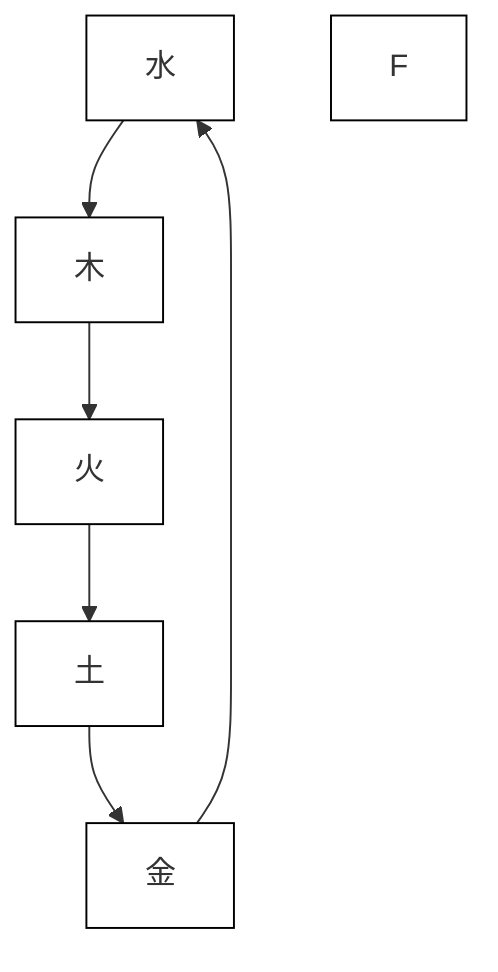
</details>

# 八字命理學

# 進階教程

# 序一

陸致極先生，吾之師友也。與他結識這十餘年來，正是他退休後徜徉於命學蠡海、勤奮耕耘的十餘年。其間著作頗豐，《中國命理學史論》、《命運的求索》、《又一種「基因」的探索》、《八字命理學基礎教程》、《解讀時空基因密碼：輕鬆知道你的先天體質》相續推出，洋洋可觀。而今又撰成《八字命理學進階教程》一書，索閱之下，不得不感佩其匠心。

從「基礎教程」到這本「進階教程」，陸致極先生反覆將四個視角分析作為命理剖析的綱要。四個視角即強弱視角、調候視角、格局視角、形象視角。這是陸先生憑藉自己深厚的命理學功底，綜合了命理學各種論點，提煉出來的分析命造的正確方法。

命理學從萌芽狀態發展至今，已有二千餘年的歷史。經過代代充實，已是洋洋大觀。仁者見仁，智者見智，其中不乏真知實學的命理經典，但也摻雜了不少偽命題，泥沙俱下，讓後學者難辯真偽。重視和應用這四個視角的分析方法，實際上是對命理學正本清源的結果。

「天人合一」是中國古代哲學的精粹，亦是玄學和中醫學理論基石，是古代先哲關於自然與人和諧相處的探索。正是在這種探索中產生了五行學說。它通過金、木、水、火、土五種元素此長彼消，互相摩蕩來模擬日月盈昃、辰宿列張、寒來暑往的自然現象。而命理學的基本出發點就是截取嬰兒落地，打開肺門吸第一口空氣時的五行分佈狀態，然後根據五行間相互作用而推演出此新生兒的人生軌跡。格局、形象這兩個視角就是分析人出生時五行分佈狀態和相互間作用的具體方法，由此凸現出格局和形象是分析命理學的基本大法。

調候是命理學的又一種重要法則。它的出發點是在五行分佈嚴重失衡狀態下，即大燥或大寒的環境下，首要條件是防暑降溫、保暖驅寒，以保證其基本生存條件，故命理學強調調候為先的法則。因忽視調候而誤判命局的現象屢見不鮮。梁湘潤先生將失去調候要素的命局稱之為廢局，實為確論。

最後是強弱視角。強弱則是模擬天爭物競的能力的描述，是人與客觀環境匹配的觀察。由此可以清晰瞭解命主喜忌，才能針對性地補其不足，損其有餘，為正確分析命局提供保證。近年來，命學界興起一種不看格局，不看日主強弱，直接用「做功」來剖析命局的思潮。試想：否定日主旺衰強弱，就是將主要考察對象——人，剝離出命局；否定格局，也就是忽視命局客觀五行分佈狀態（天）。天人俱失，「天人合一」，從何談起？皮之不存，毛將焉附？

顯而易見，此四視角乃緊扣命理學創始宗旨，正如淵海子平《四言獨步》所言「要知來處，便知去處」，先生縱橫於命理學發展史，溯本清源，為命理學分析方法重塑規模，提供了可靠的思路。

陸致極先生是位謙謙學者，學富五車，眾採博覽，上自古籍經典，下自坊間各家之說，無一不攬，無一不閱，細細推究，埋首於書城，十餘年如一日。不為名、不為利，只求將中國古老文化經典發揚光大。苦苦求索，終有所成。這本《八字命理學進階教程》是他多年探究的碩果。他將自己體悟到的珍貴心得，毫無保留，傾囊相授。他毫無門戶之見，不貪天之功，凡文中引用各論點和案例，皆一一列出出處，一掃命理界的各種舊風陋習。他懷若虛谷，只要別人一見之長，都樂意推薦，真長者之風也。

先生文筆流暢，嫺熟於歷史掌故，行筆之間將一個個案例演繹成一幅幅人間喜、怒、哀、樂的風情畫，妙趣橫生，讀來令人口齒留香。

王永成

丁酉年丁未月記

# 序二

五十年前的一次算命，在屢屢應驗之後，使陸致極先生對這門中國傳統學術產生了極大的興趣，並由此開始走上了收集、閱讀、整理、研究命理書籍的漫漫求索之路；為了集中精力專門探求這門古老的學問，10年前他辭去一切工作提前退休，終日埋頭在書堆裡，抓緊每一分鐘時間閱讀、摘錄、編寫卡片，用陸先生自己的話來說，「不是啃書，就是筆耕」，「對中華先哲所創建的這門『絕學』真是到了十分痴迷的地步。」

從 1996 年陸先生出版了第一本命理學專著《八字命理新論》開始的 20 多年間，陸續推出了《中國命理學史論：一種歷史文化現象的研究》、《又一種「基因」的探索》、《命運的求索：中國命理學簡史及推演方法》、《八字命理學基礎教程》、《解讀時空基因密碼：輕鬆知道你的先天體質》等著作，如今又呈獻給大家《八字命理學進階教程》。

陸先生功底深厚，立論精確，思路縝密，廣引博證，文筆流暢。他的命理學專著系列可分為三大板塊，第一板塊是對於命理學發展史的論述，第二板塊是先天八字與疾病預測的研究，第三板塊是八字命理學的教程。

在陸先生的每一本著作中，不但帶給我們博大精深的中國傳統智慧，還一次又一次地做到了諸多第一。比如，陸先生是明確指出徐樂吾對「用神」誤解的第一人，讓人們辨清了「格局用神」與「有用之神」的區別；陸先生是把八字算命術提升到命理學高度的第一人，讓民間的江湖俗文化走進了學術研究的殿堂；他又是第一個將八字命理學與先天疾病預測掛鉤，引進現代數據處理方法，研究兩者相關性的學者，並且取得了階段性的成功；陸先生還是近現代系統性地梳理命理學歷史、起源、人物、著作、推演方法的第一人，他為這門古老絕學在新時代的傳承與發展，指出了方向。

《八字命理學進階教程》的付梓出版，不但對於剛入命理學門檻的讀者來說是一大福音，而且對於已經入門的命理學研究者來說，也有著極大的參考價值。該書中，陸先生引用分析了大量近現代著名人物的八字命局，以及自己多年積累的身邊朋友的八字實例，在回歸傳統的基礎上，以切合現今生活形態的話題，緊緊圍繞著「實務」這一主題展開，為後學者提供了有理可據、有跡可尋的古代哲學思維方法。

在《八字命理學基礎教程》、《八字命理學進階教程》之後，水到渠成的應該還有一本《八字命理學高階教程》，那麼，讓我們翹首以盼吧！

戴理宏 鲍卿

丁酉年丁未月吉日於上海

# 前言

今年年初，接到應象中醫學堂郵件，期待我春季繼續開講命理課程。我當時剛完成《解讀時空「基因」密碼》一書，很想進一步做這方面的開拓。但應象告訴我，有兩位北京和天津的命理愛好者，讀了《八字命理學基礎教程》後，來詢問是否我會繼續開課；如果開課的話，則要求報名參加。他們願為每周六下午三個小時的課程，乘坐高鐵往返於京滬兩地。這兩位異地讀者真誠的求學心，著實感動了我，於是就答應下來了。既然已講過初級班，再開的自然就是中級課程了。

如果說基礎教程的主要任務是給出了一個分析框架，引領初學者「入門」，那麼，中級教程自然就是登堂入室後的「實務」了。也就是說，在這個分析框架下如何展開人生各個不同領域的實際演繹，學會具體推算的準則、方法，以及操作技法等。

說實話，講授命理課程，對我自己也是一種挑戰。我不是職業命理師。我學習命理完全是出自好奇，由好奇而愛好，由愛好而逐漸懷上了一種「為往聖繼絕學」的使命感，並為此不懈努力。我周圍不少朋友，到了我這樣已近古稀的年齡，都在抓緊時間享受人生，或世界漫遊，或含飴弄孫，而我自己還是終日埋頭在書堆裡，不是閱讀，就是筆耕。因為在我心靈裡，沒有任何東西比得上中華先哲的這種睿智了。他們對時空與人生關係的探索所積累下的碩果，應該得到現代社會的尊重，並在重新驗證的基礎上，傳承下去。對於炎黃子孫來說，這是何等寶貴的文化遺產啊！我在努力重拾這些精神財富時，心裡常常回蕩起《詩經》的沉吟：「知我者，謂我心憂；不知我者，謂我何求？」

我的學習過程，是從經典著作下手的。從《淵海子平》、《三命通會》、《神峰通考》，到《命理約言》、《滴天髓》、《子平真詮》、《窮通寶鑒》等，我都細細琢磨過。當然，這些傳統經典，主要是屬於書房派的。其實，書房派也並不是「空中樓閣」。它本身就是各代名士對命理實踐——也包括江湖派的推命實踐——所做出的匯集和總結，只是它們更多地反映了當時的知識階層所處的社會層面、以及追求功名利祿的實際心態。

由於時代的變遷，命理實踐的對象和範圍出現了新的轉變。隨著中國近幾十年來從農業社會向工商社會的演變，社會的世俗化進程也逐漸滲透到了命理研究和應用的領域。誠如已故台灣命理學家梁湘潤所敏銳觀察到的，那種論「富貴」和論「家計小事」的懸殊差別，他因此強調「實務」。顯然，時代已經提出了新的課題，要求命理學現代化，要求尋找出更多切合現代生活形態的推演原則和技法。

十年前，我完成了《中國命理學史論》一書。自此之後，我一直關心著「實務」。我深知，這是我自己命學知識的一塊「短板」，需要下功夫補上。要更好地承繼先人的遺產，繼續朝前走，是離不開今日的命理實踐的。只有深入到具體的推演層次，才能夠辨別精華和糟粕，揚棄不適合時代的東西，推陳出新。除了注意港台的命理作品之外，我還不斷地研讀了大陸出現的「格局派」、「新派」、「盲派」等作品。這本中級教程裡就吸收了當代命理作品中許多有益的內容，在此謹向這些時賢們致敬。

這十年來的學習和探究，就構成了《基礎教程》和這本《進階教程》的底本。希望不久的將來，再能寫出一本《高階教程》，傾倒一下我這些年來的研究心得。其中最重要的一條是：要回歸傳統，在傳統的基礎上，引進現代實務，使命理學適應新時代的生活形態，實現真正的現代轉型。

為什麼說要「回歸傳統」？雖然目前命學界出現不少「流派」，標新立異，爭奇鬥豔，常叫人眼花繚亂。但當你靜下心來，抽絲剝繭，實際上還是離不開傳統的框架的。這或許跟我追求的目標有關。我不追求碎片化的「靈光」，我追求系統化、邏輯化、學術化，期待命理學成為一門平實無華、但名副其實的學問——學術。這樣，它才能像近現代科學一樣，日積月累，與時俱進。

回顧十年來的命理探索，我慶幸自己在上海能遇到不少命學上的同道。我的進步與他們的真情鼓勵、坦誠切磋是分不開的。尤其是王永成先生，我很慶幸能與他十年如一日的暢懷探討、商榷、甚至相互駁難。即使當我在遙遠的大洋彼岸，一有疑惑，就會情不自禁地拿起電話，跟他越洋商討。同樣的愛好和追求，澆鑄了我們深厚的友情。感謝他為本書作序。「苟日新，日日新，又日新。」——希望這是我們共同的座右銘。

當然，要道謝的朋友很多。感謝鮑卿老師和戴理宏先生，不顧如此炎暑的天氣，為本書寫序。此外，盧津源、何重建、陳業孟、莊圓諸位先生，以及我的學生謝平、夏林、王建濤、秦敏禾、孫曉龍等，恕我不一一羅列他們的姓名了，他們的關心和幫助一直是我向前探索的動力。感謝我的妻子魏曉明，放任我在中華傳統文化沃土上盡興徜徉了十年。

今天，中級班授課講義終於編裁成書了，心裡輕鬆了許多。希望我的學生們能在命理探索的道路上，百尺竿頭更進一步。最後，要向香港萬里機構的吳春暉先生致謝，是他的信任和付出的辛勞，使這本進階教程能夠呈現在喜愛傳統文化的讀者之前。

# 陸致極

2017年7月29日揮汗於滬上五行齋

# 目錄

序一 王永成 3

序二 戴理宏 鲍卿 5

前言 7

# 第一章 八字分析模型回顧 15

引言 16

強弱分析 17

調候分析 19

格局分析 22

形象分析 25

結構評判標準 27

大運和流年 29

# 第二章 再探八字分析模型 33

強弱視角 34

調候視角 47

天干間的優化配置 49

格局視角 52

形象視角 56

# 第三章 干支詳析（上） 61

干支類象 62

干支納音 68

干支評判 74

刑沖會合 78

# 第四章 干支詳析（下） 97

原身和祿 98

墓庫 100

空亡 104

再探運程 107

生旺庫「會合期」 113

# 第五章 六親：父母分析 117

六親：星與宮 118

早年喪父或喪母 120

父母離異 130

父母高壽 131

父母地位 133

與父母緣份 136

# 第六章 婚姻分析（男） 143

星宮概説 144

戀愛觀 146

比財對立 147

身不宜太弱 150

偏正雜出 151

妻宮動靜 153

妻星入墓 160

郁達夫八字賞析 161

男命婚配忌日 163

# 第七章 婚姻分析（女） 165

夫星和夫宮 166

「女命八法」 168

男性緣 172

早婚 173

晚婚和「單身貴族」 176

離婚 179

喪夫 183調候法則在女命婚姻

中的應用 185

孟小冬八字賞析 187

女命婚配忌日 190

第八章 子女分析 193

子女星宮 194

子女的優劣 196

得子女的時間 200

奉子成婚 203

頭胎男女辨别 205

無子女 207

從調候論子息 209

第九章 學歷和職業 215

學歷分析 216

學而優者 219

再議胡適八字 222

考試運 224

職業分析 228

第十章 官貴地位 239

何知其人貴？ 240

「好大一棵樹」 243

台灣政壇人物八字剖析 248

傷官佩印 253

# 第十一章 財富分析 257

何知其人富？ 258

財氣通門戶 260

傷食生財 265

身弱財旺 268

命中無財 271

# 第十二章 壽元與災禍 275

壽元 276

壽關 278

五行偏頗 282

民國將領的凶災案例 283

車禍致死 287

官非牢獄 289

# 第十三章 疾病分析 297

前瞻性 298

總體分析 299

弱臟 305

強臟 310

寒暖燥濕 315

日主和十神 318

# 名人命例索引 322

# 主要參考文獻 323


<details>
<summary>flowchart</summary>

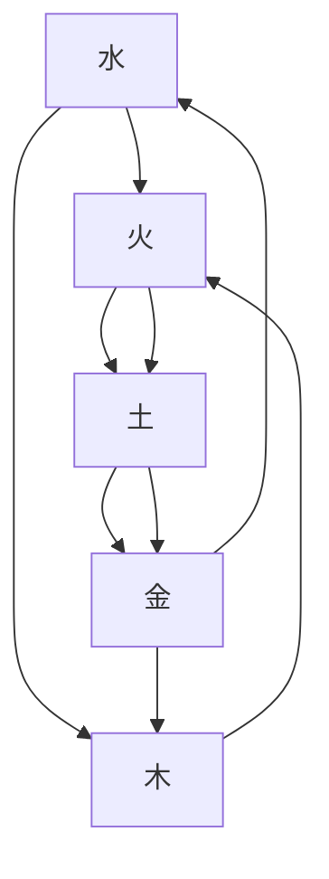
</details>

# 第一章

# 八字分析模型回顧

# 引言

按照中國古代傳統的生命觀來看，人具有兩個生命體。一個是父母給的遺傳生命體，也就是胎兒生命體，這是一種有血有肉的有形生命體；另一個是人的「自然」遺傳生命體。

《黃帝內經》中有這一段名言：

人以天地之氣生，四時之法成……夫人生於地，懸命於天；天地合氣，命之曰人。人能應四時者，天地為之父母……①

這就是說，當你從母親腹中生出來，剪斷臍帶、脫離母體成為一個個體自然人的時候，就在哇的一聲、打開口門和肺門之時，開始接受天地自然之氣。也就是在這個瞬間，大自然在你身上打下了自然時空運行規律的烙印，形成了一個人的自然遺傳生命體。這是宇宙天地贈與每一個新生兒的一個「無形」 $^{②}$ 生命體。傳統中醫學不同於西醫或現代醫學的地方，就是它要關注這個「無形」的生命體。這個生命體在自然和社會環境中的成長和發展，構成了中醫學的核心內容。

那麼，與中醫學同根於中華傳統文化沃土上的八字命理學呢？它要關注的是這個生命體本身及其生命活動的過程。用現代科學的語言來說，它要從生理學、心理學、社會學等各個方面，全方位地觀察和描寫這個生命體的「初始」狀態及其生命活動的全過程。當然，心理和社會方面，或許是它關注的重點。

因此，概括地說，八字命理學研究人的「命運」。

命運是人的生命所經歷的全過程。它包括了兩個方面：一個是「命」，即人出生的時空結構，它是由八字（或四柱天干地支）所標記的出生時自然「氣」運動狀態的片段；另一個是「運」，它包括了大運、流年等部分，也就是「命」所經歷的不斷演變的外部環境。前者是靜態研究；後者是動態研究。八字命理學就是一門以人的出生時間為依據，去描寫和預測其生命過程的學說。

作為「命」的部分，也就是對八字（人出生時的時空結構）的分析，在《八字命理學基礎教程》 $^{③}$ 中，採用了四個主要的分析視角：強弱、調候、格局和形象，來進行剖析。這是筆者根據傳統命理學是「黑箱」探究的特點，從歷代命理研究中——主要是書房派經典作品裡——總結出來的分析方法。這是本教程與以往同類著作的不同之處，也是本教程的分析框架。

以下逐一回顧這些分析視角，顯現它們是如何工作的。這也是對去年出版的《基礎教程》所述內容的複習。

# 强弱分析

強弱分析是八字結構分析的基礎。命理經典《滴天髓》說：「能知旺衰之真機，其於三命之奧，思過半矣。」它指明了掌握八字內部旺衰的重要性。

強弱分析主要從五行的角度，分析八字結構中的核心成分——日主（即日干）與它所處的內部環境（其他七個字）之間構成的強弱關係。具體來說，八字內部日主（「我」）的五行確定了，它跟其他成分，根據五行生剋關係可以分為：生我，我生，剋我，我剋，以及同我。在《基礎教程》中，為了方便初學者，筆者設計了數量圖解分析流程。

下面以清朝晚期著名湘軍將領左宗棠的八字為例，逐步展開分析：

命例 1：乾造 左宗棠（1812 年～1885 年），晚清名臣。

日主

<table><tr><td>壬</td><td>辛</td><td>丙</td><td>庚</td></tr><tr><td>申</td><td>亥</td><td>午</td><td>寅</td></tr></table>

左宗棠（1812年11月10日～1885年9月5日），字季高，湖南湘陰人，號湘上農人，清朝大臣，著名湘軍將領。一生經歷了湘軍平定太平天國、洋務運動、鎮壓陝甘回變和收復新疆等重要歷史事件。

他出身貧寒，自幼聰穎。14歲考童子試中第一名，曾寫下「身無半文，心憂天下；手釋萬卷，神交古人」的對聯以銘心志。左宗棠少時屢試不第，轉而留意農事，遍讀群書，鑽研與地、兵法。後竟因此成為清朝後期著名大臣，官至東閣大學士、軍機大臣，封二等恪靖侯。

# 操作 -1：陰陽五行結構


<details>
<summary>text_image</summary>

日主
壬 辛 丙 庚
申 亥 午 寅
庚 壬 丁 甲
壬 甲 己 丙
戊 戊
陰陽五行結構
+水 -金 +火 +金
+金 +水 -火 +木
+水 +木 -土 +火
+土
+土
</details>

# 操作-2：強弱圖解分析


<details>
<summary>flowchart</summary>

```mermaid
graph TD
    A["日主"] -->|2 (1)| B["火"]
    B --> C["死"]
    C --> D["土"]
    D --> E["囚"]
    E --> F["金"]
    F --> G["休"]
    G --> H["旺"]
    H --> I["水"]
    I --> J["相"]
    J --> K["木"]
    K --> L["日主同方"]
    L --> M["日主异方"]
    M --> N["3"]
    N --> O["金"]
    O --> P["休"]
    P --> Q["旺"]
    Q --> R["水"]
    R --> S["相"]
    S --> T["木"]
    T --> U["相"]
    U --> V["土"]
    V --> W["阴"]
    W --> X["火"]
    X --> Y["土"]
    Y --> Z["阴"]
    Z --> AA["火"]
    AA --> AB["土"]
    AB --> AC["阴"]
    AC --> AD["火"]
    AD --> AE["土"]
    AE --> AF["阴"]
    AF --> AG["火"]
```
</details>

日主強弱：極強 很強 強 稍強 中和 稍弱 弱 很弱 極弱

此八字強弱分析結果是：日主身「稍弱」；宜採用的扶抑用神：木或火，即增加日主同方要素的力量，以求取平衡。

# 調候分析

調候，即調和氣候。八字分析中所謂「調候」，是日主對出生時外部節令氣候（寒暖燥濕）的要求，是「我」得以生存的基本的環境條件。調候問題，也就是八字結構內部的寒暖燥濕問題。「調候為先」是八字命理學中的一條重要原則。

作為調候的最重要的要素，是天干丙火和癸水。誠如《滴天髓》所說：「五陽皆陽丙為最，五陰皆陰癸為至。」它們也是最易造成調候偏頗的兩個季節——夏天和冬天——中最重要的平衡要素：夏季炎熱基本上離不開雨露的滋潤——癸水，冬季寒冷離不開太陽的照暖——丙火：

春——夏——秋——冬

癸水

丙火

為了幫助初學者，在《基礎教程》中，筆者設計了「干支寒暖燥濕計分」 $^{①}$ 方法，轉引如下：

表 1.1 天干寒暖燥濕計分表

<table><tr><td>甲</td><td>乙</td><td>丙</td><td>丁</td><td>戊</td><td>己</td><td>庚</td><td>辛</td><td>壬</td><td>癸</td></tr><tr><td>+3</td><td>+1</td><td>+6</td><td>+4</td><td>+5</td><td>-4</td><td>-1</td><td>-3</td><td>-5</td><td>-6</td></tr></table>

表 1.2 地支寒暖燥濕計分表

<table><tr><td>寅</td><td>卯</td><td>辰</td><td>巳</td><td>午</td><td>未</td><td>申</td><td>酉</td><td>戌</td><td>亥</td><td>子</td><td>丑</td></tr><tr><td>+3</td><td>+1</td><td>-4</td><td>+5</td><td>+6</td><td>+3</td><td>-2</td><td>-3</td><td>+4</td><td>-5</td><td>-6</td><td>-4</td></tr></table>

表 1.3 月令寒暖燥濕加分

<table><tr><td>正</td><td>二</td><td>三</td><td>四</td><td>五</td><td>六</td><td>七</td><td>八</td><td>九</td><td>十</td><td>十一</td><td>十二</td></tr><tr><td>寅</td><td>卯</td><td>辰</td><td>巳</td><td>午</td><td>未</td><td>申</td><td>酉</td><td>戌</td><td>亥</td><td>子</td><td>丑</td></tr><tr><td>0</td><td>+1</td><td>+2</td><td>+3</td><td>+4</td><td>+3</td><td>0</td><td>-1</td><td>-2</td><td>-3</td><td>-4</td><td>-4</td></tr></table>

《基礎教程》認為：一個八字結構的寒暖燥濕度在-6至+6之間，可以看作是基本「中和」（平衡），若大於+6或小於至-6，就是進入偏頗狀態了。③

根據以上計分法，左宗棠八字的寒暖燥濕情況如下：

# 操作 -3：干支寒暖燥濕計分

日主  


<details>
<summary>text_image</summary>

陰陽五行結構
-5 -3 +6 -1
壬 辛 丙 庚
申 亥 午 寅
-2 -5 +6 +3
-3
+水 -金 +火 +金
+金 +水 -火 +木
+水 +木 -土 +火
+土
+土
</details>

計分結果：-4 結論：略偏寒濕

顯然，結果是-4，但其數值處於-6至+6之間，此八字調候問題並不嚴重。

調候的另一個方面，是結構成分的優化配置。這是展開調候主題的經典著作《窮通寶鑒》一書予以詳加探討的。已故台灣梁湘潤先生曾把此書十干在十二個月中調候需求要點列於下表：

表 1.4 十干調候用神表

<table><tr><td rowspan="2"></td><td>寅</td><td>卯</td><td>辰</td><td>巳</td><td>午</td><td>未</td><td>申</td><td>酉</td><td>戌</td><td>亥</td><td>子</td><td>丑</td></tr><tr><td>正月</td><td>二月</td><td>三月</td><td>四月</td><td>五月</td><td>六月</td><td>七月</td><td>八月</td><td>九月</td><td>十月</td><td>十一月</td><td>十二月</td></tr><tr><td>甲</td><td>丙癸</td><td>庚丙戊丁己</td><td>庚丁壬</td><td>癸丁庚</td><td>癸丁庚</td><td>癸丁庚</td><td>庚丁壬</td><td>庚丁丙</td><td>庚甲壬丁癸</td><td>庚丁戊丙</td><td>丁庚丙</td><td>丁庚丙</td></tr><tr><td>乙</td><td>丙癸</td><td>丙癸</td><td>癸丙戊</td><td>癸</td><td>癸丙</td><td>癸丙</td><td>丙癸己</td><td>癸丙丁</td><td>癸辛</td><td>丙戊</td><td>丙</td><td>丙</td></tr><tr><td>丙</td><td>壬庚</td><td>壬己</td><td>壬甲</td><td>壬庚癸</td><td>壬庚</td><td>壬庚</td><td>壬戊</td><td>壬癸</td><td>甲壬</td><td>甲戊庚壬</td><td>壬戊己</td><td>壬甲</td></tr><tr><td>丁</td><td>甲庚</td><td>庚甲</td><td>甲庚</td><td>甲庚</td><td>壬庚癸</td><td>甲壬庚</td><td>甲庚丙戊</td><td>甲庚丙戊</td><td>甲庚戊</td><td>甲庚</td><td>甲庚</td><td>甲庚</td></tr><tr><td>戊</td><td>丙甲癸</td><td>丙甲癸</td><td>甲丙癸</td><td>甲丙癸</td><td>壬甲丙</td><td>癸丙甲</td><td>丙癸甲</td><td>丙癸</td><td>甲丙癸</td><td>甲丙</td><td>丙甲</td><td>丙甲</td></tr><tr><td>己</td><td>丙庚甲</td><td>甲癸丙</td><td>丙癸甲</td><td>癸丙</td><td>癸丙</td><td>癸丙</td><td>丙癸</td><td>丙癸</td><td>甲丙癸</td><td>丙甲戊</td><td>丙甲戊</td><td>丙甲戊</td></tr><tr><td>庚</td><td>戊甲丙壬丁</td><td>丁甲丙庚</td><td>甲丁壬癸</td><td>壬戊丙丁</td><td>壬癸</td><td>丁甲</td><td>丁甲</td><td>丁甲丙</td><td>甲壬</td><td>丁丙</td><td>丁甲丙</td><td>丙丁甲</td></tr><tr><td>辛</td><td>己壬庚</td><td>壬甲</td><td>壬甲</td><td>壬甲癸</td><td>壬己癸</td><td>壬庚甲</td><td>壬甲戊</td><td>壬甲</td><td>壬甲</td><td>壬丙</td><td>丙戊壬甲</td><td>丙壬戊己</td></tr><tr><td>壬</td><td>庚丙戊</td><td>戊辛庚</td><td>甲庚</td><td>壬辛庚癸</td><td>癸庚辛</td><td>辛甲</td><td>戊丁</td><td>甲庚</td><td>甲丙</td><td>戊丙庚</td><td>戊丙</td><td>丙丁甲</td></tr><tr><td>癸</td><td>辛丙</td><td>庚辛</td><td>丙辛甲</td><td>辛</td><td>庚壬癸</td><td>庚辛壬癸</td><td>丁</td><td>辛丙</td><td>辛甲壬癸</td><td>庚辛戊丁</td><td>丙辛</td><td>丙丁</td></tr></table>

參考以上調候用神表，丙火日主生於亥月的調候用神是：甲、戊、庚、壬。 $^{③}$ 不難發現，左宗棠的八字中天干有庚金和壬水、地支有寅木（甲木）。在成分要素的優化配置上，這個八字具有先天得天獨厚的地方。

如果要選取這個八字的調候用神的話，可取寅（木）、午（火），理由是：命局本身還是略偏於寒濕。

# 格局分析

如果說，強弱分析和調候分析都是基於五行分佈的基礎分析，那麼，格局分析則突破五行的「喻象」層面，進入到五行的「關係」層面，開啟了由十神到格局的全面研究。

格局研究的代表著作是清代乾隆年間進士沈孝瞻的《子平真詮》。此書原為沈氏的筆記。但近年發現，明末敬一堂鈔本《耕寸集》與《子平真詮》全文基本相似，很可能它就是沈先生所「筆記」的原著 $^{①}$ 。這樣，系統的格局的研究成果，就可以追溯到明代後期。明代中後期無疑是中國命理學發展史上的最鼎盛時期。

# A. 十神分佈：

所謂「十神」，就是日主與其他成分的陰陽五行關係的代名詞。日主本是十個天干中的一個，確定了它的陰陽五行性質，它與可能出現的其他十個天干之間就構成了比肩、劫財、傷官、食神、正財、偏財、正官、七殺、正印、偏印十種關係。

例如左宗棠的八字，對除日主之外的天干以及地支藏遁各成分的十神關係可以標記如下：

操作 -4：標記十神

<table><tr><td>七殺</td><td>正財</td><td></td><td>偏財</td></tr><tr><td>壬</td><td>辛</td><td>丙</td><td>庚</td></tr><tr><td>申</td><td>亥</td><td>午</td><td>寅</td></tr><tr><td>偏財</td><td>七殺</td><td>劫財</td><td>偏印</td></tr><tr><td>七殺</td><td>偏印</td><td>傷官</td><td>比肩</td></tr><tr><td>食神</td><td></td><td></td><td>食神</td></tr></table>

# B. 取格：

取格就是確定八字結構的格局。

什麼是格局？《基礎教程》認為，在比較結構中存在的諸多勢力以後，選取最能影響此結構的主導勢力，以代表這個主要勢力的成分（十神）為格局。它決定了此結構的主要傾向。

由於月令地支是標記外部節令——當時的天地之氣狀態——的樞紐，因此一般選取格局就從月令地支出發，選取其透出天干的成分作為該結構的格局。當然，當月令地支與其他地支成分構成三合局、三會方時，也可直接以此十神為格局。總之，格局是主導這個結構的某個十神之勢力，並以此十神來命名。

比如左宗棠的八字：

# 操作 -5：選取格局


<details>
<summary>text_image</summary>

七殺 正財 偏財
壬 辛 丙 庚
申 亥 午 寅
偏財 七殺 劫財 偏印
七殺 偏印 傷官 比肩
食神 食神
</details>

格局：正官格 正印格 正財格 偏財格 食神格

建祿格（七殺格）偏印格 傷官格 劫刃格

八字月支亥水，藏有月令主氣壬水七殺、以及附屬之氣甲木偏印。冬令水旺，現在七殺透出年干，自然是此結構的主導勢力，故此八字取為七殺格。

# C. 取格局用神：

確定格局以後，自然要選取格局用神。

對於格局，《子平真詮》首先把它們分成兩大類；「善者」和「不善者」。前者是財、官、印、食，即：正財格、偏財格、正官格、正印格和食神格；後者是殺、傷、枭、刃，即：七殺格、傷官格、偏印格和劫刃格。

接著，對於「善」者（或稱「吉神」），《子平真詮》給出的處理法則是「順用之」，即採取相生的方式；對於「不善」者（或稱「凶神」），處理法則是「逆用之」，即採取制約的方式。

請注意，這裡的「善」與「不善」（或「吉神」與「凶神」），只是分類的名稱，並不具有實際善惡的內涵。於是，「當順而順，當逆而逆，配合得宜，皆為貴格。」（《子平真詮》）

進一步看左宗棠的八字：

# 操作-6：選取格局用神


<details>
<summary>flowchart</summary>

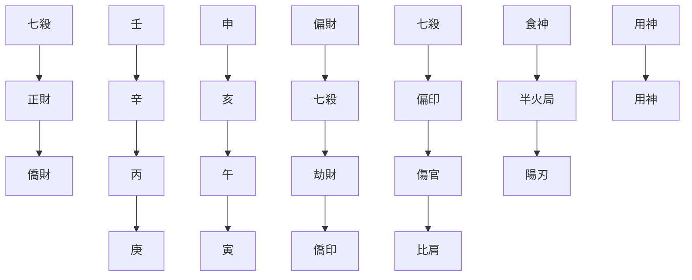
</details>

七殺格是「逆用」格局，一般以食神來制殺，求取自身、七殺的平衡。查此八字並無食神透出天干，或為地支主氣。此時就須考慮另一種情況，即身弱殺強，用印星（正、偏印）來化殺生身。在這個八字中，時支寅木似乎可以取為用神。但寅與緊鄰的日支——午，半合火局，木性已失，它已無法承擔化殺生身的功能了。可見制殺和化殺，都行不通。

關於七殺格，還有一種情況，稱為「陽刃駕殺」，即以陽刃助身，以「凶神」（陽刃）來對抗「凶神」（七殺）的方式來求取平衡。觀此八字，日柱為丙午，即丙火坐午支陽刃。因此，可取日支午火為用神，寅木為喜神：喜木用火。這樣就形成了「陽刃駕殺」的格調。

實際上，以上討論了七殺格的三種取用方法：制殺，化殺和抗殺（或合殺）。用食神制殺，是智取；用印星化殺，是仁化，化敵為友；用陽刃駕殺，是以凶敵凶。的確，這第三種方法未免過於激烈。左宗棠的八字確實採取了這第三種方式。從格局視角做出評判，此八字的格局和用神都完好有力。

# 形象分析

誠如《基礎教程》所說，這是一個比較特殊的視角。它主要處理八字格局中的特殊格，如專旺格和從旺格，但同時也包括具有特殊強勢特點的非特殊格的八字。自然，它還可以應用於顯現出「形象」的普通格八字。比如這個八字，還是有不同於一般八字結構的形象：

# 操作 -7：形象分析


<details>
<summary>flowchart</summary>

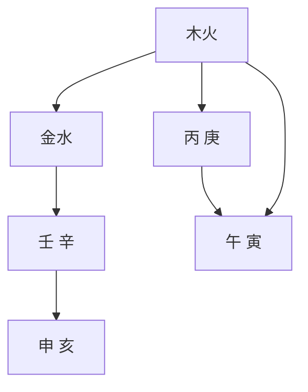
</details>

這裡可以觀察到，年月兩柱為金水，日時兩柱基本為木火。顯然具有木火與金水對峙的形象。就好的方面來說，木火為陽，金水為陰，各自分明，有清純的形象特點。但這種對峙，落實到人的個性上，就有些偏激：水火不容。再加上前文討論的「陽刃駕殺」的格局，左宗棠在近代史上的確是一個頗有爭議的人物。他狂傲自大，盛氣凌人，個性比較躁烈。在當湖南巡撫的幕僚時，曾失手打了當時的滿人總兵樊變一個耳光。以一個沒有地位的幕客打了具有二品官銜的總兵，這個舉動曾震動了當時整個湖南政壇，險些給他帶來殺身之禍。幸得胡林翼、郭嵩燾等人的仗義執言，潘祖蔭、肅順等大臣的披瀝上陳，才使一場軒然大波得以平息。然而，也正是他的智慧和勇猛，不顧65歲的高齡，率軍西征，收復新疆，成了近代史上一位積極抗禦外侮的愛國將帥。

當然，還可以從刑沖會合和神煞等多個方面來分析這個八字：

操作 -8：刑沖會合與神煞分析  


<details>
<summary>text_image</summary>

七殺
正財
偏財
壬 辛 丙 庚
申 亥 午 寅
偏財 七殺 劫財 偏印
七殺 偏印 傷官 比肩
食神
食神
暗合 半火局
合
驛馬 貴人 陽刃
文昌
</details>

這裡可以看到，天干丙辛合，地支寅午半合火局，寅亥遙合木。事實上，還有申亥相害，亥午暗合，寅申遙沖。年支有驛馬（主遷動）、文昌（主聰敏），月支有貴人（主逢凶化吉，得貴人相助），都是好的神煞。日支是陽刃，上文已經談到了。

這裡值得一提的是，日元丙火與月干辛金正財相合，是命學中所謂「財來就我」。左宗棠年輕時家境貧寒，入贅湘潭大姓望族周家「招女婿」，娶得賢惠的富家小姐周詒端，是否正是這個「財來就我」的徵驗呢？同時，天干透出正財、偏財，因為丙辛合，合去正財，干頭財星就轉清了。

有了以上多視角的分析，對左宗棠的命造就可以做出一個綜合的小結了：

分析依據：

（1）強弱：身稍弱，擬扶身，用木火；  
(2) 調候：稍嫌寒濕，喜暖燥（火）；  
（3）格局：七殺格，陽刃駕殺，用火喜木；  
（4）形象：木火與金水對峙，金水強於木火；

以及刑沖會合和神煞諸方面。

結論：喜木火，忌金水，土中性。即：用神為火，喜神為木；忌神為水。八字用神完好。

八字評判：七殺格，殺清（無正官混雜）——格局清純；具有陽刃駕殺格調，午火陽刃為用神，寅木為喜神，身殺兩停，主權（武）貴。格、用俱佳，為上等命造。

# 結構評判標準

為什麼說這個八字是「上等」命造？

簡而言之，這裡有兩桿重要標尺：一桿是「有力、無力」；一桿是「有情、無情」。而總原則是「中和」為貴。

「中和」也就是平衡。這是對絕大多數的八字結構來說的。至於一些內部具有「強勢」的八字結構，已無法達到中和，只能「順勢」而為。這是特殊情況，也是形象分析的關注點。

何謂「有力、無力」？最重要的體現是看結構中諸成分是否都「通根」強健。比如左宗棠八字，我們可以再標記一下它的各成分的上下關係：

# 操作 -9：結構剖析


<details>
<summary>flowchart</summary>

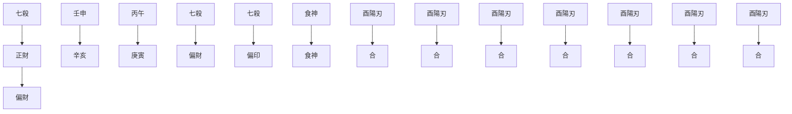
</details>

圖中顯示天干每一個成分都有「強根」：壬水七殺通根月令地支亥水（亥為壬水之祿）；辛金正財、庚金偏財通根於年支申金（申為庚金之祿、辛金之帝旺）；日干丙火通根於日支午火和時支寅木（午為丙火之陽刃，寅為丙火之長生）。全局天覆地載，上下配合，十分有力。

何謂「有情、無情」？在格局方面，要重點觀察其「清」和「濁」的問題：純粹為清；混雜為濁，破局為濁，過於偏頗也為濁。比如正官格，干頭透出七殺，則為官、殺混雜，這就「濁」了；或者局中正官透出，天干見到傷官，則傷官剋官，此為破格。這都是「無情」的表現。

反觀左宗棠之命造，七殺格局中無絲毫正官來混七殺，午火用神得寅木相助，堪稱有情。甚至亥午暗合，化敵為友，蕭殺之氣中又多了一絲溫情。

由此可見，左宗棠命造可以評為「上等」貴造。

# 大運和流年

以上是對《基礎教程》中八字結構分析的回顧。這是對「命」的剖析，屬於靜態分析。接下來，還要進一步對「運」做出剖析，也就是進入動態分析。

誠如筆者在《基礎教程》中做過的比喻：命，就好比一輛新車。它出廠時的規格、性能都已經在使用手冊上注明了。運，就是它要行駛的路。人生，也就是這輛車在路上行駛的過程。顯然，車況（命）加路況（運），演繹了多姿多彩的人生旅程。

仍以左宗棠命造為例，看他的大運：

操作-10：大運分析

大運

<table><tr><td>9歲</td><td>19歲</td><td>29歲</td><td>39歲</td><td>49歲</td><td>59歲</td><td>69歲</td></tr><tr><td>1822年</td><td>1832年</td><td>1842年</td><td>1852年</td><td>1862年</td><td>1872年</td><td>1882年</td></tr><tr><td>壬</td><td>癸</td><td>甲</td><td>乙</td><td>丙</td><td>丁</td><td>戊</td></tr><tr><td>子</td><td>丑</td><td>寅</td><td>卯</td><td>辰</td><td>巳</td><td>午</td></tr></table>

左宗棠 14 歲考童子試中第一名，1832 年左宗棠中舉第 18 名。然而 1833 年、1835 年、1838 年三次會試均落第。窮困潦倒的左宗棠邊讀書，邊教學，立志走經世致用之路。

1851 年，左宗棠入湖南巡撫張亮基及後來駱秉章幕府，他的出色軍事才能引起朝野關注。八年幕府生涯，鞠躬盡瘁。終於在 1862 年被清廷封為浙江巡撫。此後平定太平軍，辦洋務，平捻軍回亂，收復新疆，創豐功偉業，官職連升，位極人臣。

運程簡析：

八字原局分析的結論是喜木火，忌金水。大運早年走水運，是助忌神的，自然不得志。中年木運，不是喜用木火嗎？為什麼依然不能大展宏圖呢？因為甲、乙木居於天干，遭八字天干庚、辛金回剋，干頭之木發揮不了作用；地支呢？寅、卯為空亡，且寅木遭局內申金之沖。故一直要到49歲後，進入丙火運，於是連創豐功偉績。命主可謂是大器晚成。

左宗棠死於 1885 年 9 月 5 日（農曆七月廿七），時年 73 歲。在戊午大運，乙酉流年，甲申月，癸亥日。可以做這樣的分析：

1985年尚在戊土（食神）運中。土本為中性。它泄日元火氣不利，但也可以用來制水（七殺）為功。然而戊在天干，便形成了土生金（庚、辛財星），金生水（七殺），最終還是助了旺殺凶神。（注意成分出現的位置）

1985 年流年乙酉，乙庚合金，酉為庚金陽刃、辛金之祿，加上原有申金，旺金生旺水，終於旺水撲滅了日元之火，一代名將壽終正寢。

以上通過左宗棠命案的逐步剖析，展示了《基礎教程》所述的八字分析程式。這個程式是為初學者設計的，猶如登山的「手杖」，一步一個腳印地幫助攀登者爬上山巔，完成一段剖析的旅程。這是領君「入門」，是《基礎教程》的教學目的。

最後來一段花絮：

侯相恪靖侯左公，有中表弟曰吳偉才，與侯相同以嘉慶十七年十月初七日寅時生。所居相距九里許，兩家報喜者相遇於適中之地。其八字則壬申、辛亥、丙午、庚寅也，少有奇童之目，與侯相同。道光壬辰，侯相與兄景橋中書（宗植）同舉於鄉，而偉才改業屠豕。侯相督閩浙時，偉才嘗一至閩。侯相勛業爛然，殺賊以千萬計，而偉才祿命中之殺刃，僅用之於屠豕。昔有與文潞公同命者，僅得同席而食者數十日，以此類也。偉才好大言，嘗曰：「太公隱於屠沽，何獨余也。」同治八年，已不在屠肆，而親舊歲時用牲或召之，輒欣然鼓刀而往云。侯相在涇州軍次，與王孝鳳（家璧）言之。

這是說左宗棠與其表弟吳偉才是同年同月同日同時出生的，兩家相隔僅九里多路。為什麼兩人的命運竟如此不同？一個是曠世良將，一個是殺豬的屠夫，於是人們用「殺人」與「殺豬」來解釋其同象異趣。當然，我們並不知道這段文字是否紀錄的是事實。

# 註釋

①《素問·寶命全形論》。  
② 事實上，它是有形的。它是由「氣」構成的，只是在目前的條件下，我們的肉眼還不能識別罷了。  
③ 以下簡稱《基礎教程》。  
4《八字命理學基礎教程》，103頁。  
⑤《八字命理學基礎教程》，100頁。  
6 其理由是，十月壬水秉令，水旺用木化之；身殺兩旺，用戊制之；火旺用壬，木旺宜庚。  
⑦ 見《耕寸集》校訂者莊園的「本書提要」。  
8 或傷官駕殺，或傷官合殺。

# 第一章

# 再探八字分析模型

在《基礎教程》的「序言」中，筆者強調了登山的「手杖」的作用。《基礎教程》是面對初學者的，因此為他們設計了「手杖」（分析程式和量化分析方法），作為登山的工具。這是入門的需要。現在是中級教程，是新的征程，是要逐步扔掉「手杖」的時候了。「手杖」是為了便利，但它有局限性。

其實，對於任何一種學問的探究和應用，總要經歷一個從有「法」到無「法」的進程。民國時期命理大師徐樂吾在談到《子平真詮》和《滴天髓》這兩部經典時曾說：

《真詮》者，命理之規矩也；《滴天髓》者，示人以巧也。①

這裡，「規」和「矩」是木匠用來校正方圓的工具。然而只懂得使用「規矩」的木匠，並不一定是個「巧匠」。因為天底下的器物是形形色色的，正如八字結構就超過56萬個，加上男女運程的不同，有112萬之多，它們不一定個個都是「中規中矩」的。這就要求一個「巧」字了。從「規矩」到「巧」，從理論框架到實務以及論命技法——這正是這本中級教程的目標。

因此，首先要做的是重探《基礎教程》給出的分析模型。

# 強弱視角

# A. 強弱有個「度」

強弱是命局五行分析的基礎。然而它也困擾了當今不少命理研習者。不少學了命理多年的人，還一直在強弱問題上繞圈子，於是就有了命學界「盲派」取消強弱分析的主張，認為強弱分析是沒有實際意義的。 $^{②}$

事實上，日主強弱有一個「度」的問題。分析中的困惑產生於對這個「度」的把握。

下面以晚清名臣曾國藩命造為例，來探討這個問題：

正財 傷官 傷官

<table><tr><td>辛未</td><td>己亥</td><td>丙辰</td><td>己亥</td></tr><tr><td>傷官</td><td>七殺</td><td>食神</td><td>七殺</td></tr><tr><td>劫財</td><td>偏印</td><td>正印</td><td>偏印</td></tr><tr><td>正印</td><td></td><td>正官</td><td></td></tr></table>

大運

<table><tr><td>6歲</td><td>16歲</td><td>26歲</td><td>36歲</td><td>46歲</td><td>56歲</td></tr><tr><td>戊</td><td>丁</td><td>丙</td><td>乙</td><td>甲</td><td>癸</td></tr><tr><td>戌</td><td>酉</td><td>申</td><td>未</td><td>午</td><td>巳</td></tr></table>

曾國藩（1811年11月26日～1872年3月12日），初名子城，字伯涵，號滌生。中國近代政治家、戰略家、理學家、文學家，湘軍的創立者和統帥。官至兩江總督、直隸總督、武英殿大學士，封一等毅勇侯，謚曰文正。

曾國藩自幼勤奮好學，6歲入塾讀書。8歲能讀四書、誦五經，14歲能讀《周禮》《史記》文選。道光十八年（1838）中進士，入翰林院。累遷內閣學士，禮部侍郎，署兵、工、刑、吏部侍郎。太平天國時期，曾國藩組建湘軍，經過多年鑒戰後攻滅太平天國。曾國藩修身律己，以德求官，禮治為先，以忠謀政，在官場上獲得了巨大的成功。曾國藩的崛起，對清王朝的政治、軍事、文化、經濟等方面都產生了深遠的影響。

對此八字結構做強弱分析：

操作 -1：強弱圖解分析


<details>
<summary>flowchart</summary>

```mermaid
graph TD
    A["火"] -->|1 (1)| B["土"]
    B --> C["金"]
    C --> D["水"]
    D --> E["旺"]
    E --> F["相"]
    F --> G["0 (4)"]
    G --> H["日主同方"]
    H --> I["日主异方"]
    I --> J["金"]
    J --> K["休"]
    K --> L["土"]
    L --> M["火"]
    M --> N["火"]
    N --> O["土"]
    O --> P["金"]
    P --> Q["水"]
    Q --> R["旺"]
    R --> S["相"]
    S --> T["0 (4)"]
    T --> U["日主同方"]
    U --> V["火"]
```
</details>

日主強弱：極強 很強 強 稍強 中和 稍弱 弱 很弱 極弱

從圖解中可以看到，命局日主很弱。那麼，為什麼曾國藩會成為如此著名的歷史人物呢？居「同治中興」三大名臣（曾國藩、左宗棠、胡林翼）之首。事業勛名，盛極一時。

可見，日主強弱有個「度」。不能一見日主弱就否定了整個結構的價值。仔細觀察這個八字，日主雖然「很弱」，但它是有「根」的。丙火通根於年支未土。未土中有餘氣丁火，可以為根。同時，月支亥和年支未還暗拱了個木局。

圖 2.1 「暗拱」  


<details>
<summary>flowchart</summary>

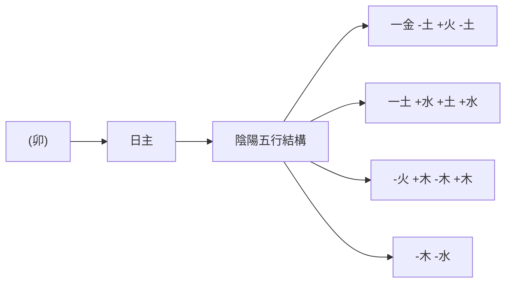
</details>

這裡，對於暗拱要說幾句。我們知道，地支出現三合局的情況，比如，亥、卯、未三者都出現，合為東方木局。如果只出現亥、卯，或卯、未，則為半合局，即合為半個木局，因為此時相合之中仍具有三合局的中心點——卯字，卯為甲木之刃、乙木之祿。如果僅出現亥與未，這時就稱為「拱」了。由於缺少了中心點，它們不能像亥卯或卯未那樣發揮作用了。這個時候，如果天干出現甲或乙，拱局就「邀進」了虛神卯木，亥、未加上「暗拱」的虛神卯，就構成了完整的亥卯未三合木局。命理學中十分重視這種「虛神」的作用，所謂「向實尋虛，從無取有」 $^{②}$ 。

顯然，曾命造中年月地支有亥、未暗拱，它只是提供了形成木局的潛在條件，一旦運程中天干出現甲、乙木時，這個拱局就「邀進」了虛神卯木，構成了亥卯未三合木局，這時就可以發揮木印扶身的大作用了。

實際上，再做進一步剖析，這個八字結構還暗藏了「玄機」。格局上，它是七殺格，是傷官駕殺格調——以土制旺水。但身弱喜扶身，用神應為木火。月柱、時柱都是己亥，其中天干己土與地支亥水中的甲木暗合有情。己土混壬水，使之成泥漿，從而生木。這就是《窮通寶鑒》所謂的「己土混壬」的格式。④

正因為如此，到了 46 歲走甲午運，甲木透出，不僅使暗拱的木局發揮作用，而且還把地支中暗藏的木氣引了出來，午火又為丙火陽刃，木火助身，風雲際會，成就了一番驚世的業績。

這裡，筆者想說明的是，在結構分析中，我們要注意全局。不要以一個視角的現象，就輕易下結論。而且，命局內在因素的實現還離不開大運和流年，只有全面的細緻考量，才能得到正確的判斷。假如曾國藩命造遇不到那一步甲午大運，不知還會有晚清的「同治中興」嗎？——或許正是這個「中興」讓風雨飄搖的滿清政府苟延殘喘了五十年。

謝武藤在《八字深入》中說：

一個八字的構造，應先看其日主身強、身弱如何，這是入門的看法。一個八字的好壞與日主的身強弱，兩者的影響最輕微，因此筆者常強調，調候第一、格局第二、日主第三。日主只要不是太強或太弱即可。③

這種認識是值得參考的。它並不排斥命局強弱分析，只是說明「度」與「八字好壞」的關係。在筆者眼裡，命理學是一種學術，對於學術研究最犯忌的就是偏執態度。

事實上，強弱問題的重要方面，就是日主要有「根」。

什麼是「根」呢？「根」就是地支中出現的同類成分（主氣或附屬之氣）。

我們可以深究一下，在干支系統中每一種五行在十二個地支中總有五個地支是藏有相應的五行成分的。以「木」為例。在地支藏遁中有甲、乙木的，共有五個地支：亥、寅、卯、辰、未。它們分佈可見圖2.2。

圖 2.2 天干甲乙在地支中的藏干  


<details>
<summary>text_image</summary>

夏
癸 ②戊
春 ②卯
丙 甲
戊
冬
壬
子
亥
戌
酉
申
丑
寅
巳
午
未
己
丁
秋
①
</details>

圖中可以看到，春季是木旺之時，故地支寅、卯、辰中都有木。此外，春季之前的第三個月——亥月，就有了木氣的發生；春季以後的第三個月——未月是木氣的終結點。亥卯未三者合為木局，不正是天地之間的木氣由發生，到最旺盛、再到終結的過程？

還有一個值得注意的地方：在這個過程的前半段，出現的是陽木甲；從中心點到終結點出現的是陰木乙。前者表明木氣的上升，為陽；到了最高點則陽極而陰，以後是下降，都是陰的了。因此，五個具有木氣的地支中，前兩個藏有陽干，是進氣的過程；後三個藏有陰干，是旺極而退的過程。

五行中火、金、水在十二地支中也是同樣情況。

# B. 十天干生旺死絕歷程

現在，我們可以進一步引進十天干生旺死絕歷程（「旺衰十二運」）：

表 2.1 十天干生旺死絕歷程

<table><tr><td></td><td>長生</td><td>沐浴</td><td>冠帶</td><td>臨官</td><td>帝旺</td><td>衰</td><td>病</td><td>死</td><td>墓</td><td>絕</td><td>胎</td><td>養</td></tr><tr><td>甲</td><td>亥</td><td>子</td><td>丑</td><td>寅</td><td>卯</td><td>辰</td><td>巳</td><td>午</td><td>未</td><td>申</td><td>酉</td><td>戌</td></tr><tr><td>乙</td><td>午</td><td>巳</td><td>辰</td><td>卯</td><td>寅</td><td>丑</td><td>子</td><td>亥</td><td>戌</td><td>酉</td><td>申</td><td>未</td></tr><tr><td>丙</td><td>寅</td><td>卯</td><td>辰</td><td>巳</td><td>午</td><td>未</td><td>申</td><td>酉</td><td>戌</td><td>亥</td><td>子</td><td>丑</td></tr><tr><td>丁</td><td>酉</td><td>申</td><td>未</td><td>午</td><td>巳</td><td>辰</td><td>卯</td><td>寅</td><td>丑</td><td>子</td><td>亥</td><td>戌</td></tr><tr><td>戊</td><td>寅</td><td>卯</td><td>辰</td><td>巳</td><td>午</td><td>未</td><td>申</td><td>酉</td><td>戌</td><td>亥</td><td>子</td><td>丑</td></tr><tr><td>己</td><td>酉</td><td>申</td><td>未</td><td>午</td><td>巳</td><td>辰</td><td>卯</td><td>寅</td><td>丑</td><td>子</td><td>亥</td><td>戌</td></tr><tr><td>庚</td><td>巳</td><td>午</td><td>未</td><td>申</td><td>酉</td><td>戌</td><td>亥</td><td>子</td><td>丑</td><td>寅</td><td>卯</td><td>辰</td></tr><tr><td>辛</td><td>子</td><td>亥</td><td>戌</td><td>酉</td><td>申</td><td>未</td><td>午</td><td>巳</td><td>辰</td><td>卯</td><td>寅</td><td>丑</td></tr><tr><td>壬</td><td>申</td><td>酉</td><td>戌</td><td>亥</td><td>子</td><td>丑</td><td>寅</td><td>卯</td><td>辰</td><td>巳</td><td>午</td><td>未</td></tr><tr><td>癸</td><td>卯</td><td>寅</td><td>丑</td><td>子</td><td>亥</td><td>戌</td><td>酉</td><td>申</td><td>未</td><td>午</td><td>巳</td><td>辰</td></tr></table>

這裡，每一個天干在地支上的「生死旺衰歷程」分成了十二個階段，並配入十二個月中。這十二階段是：長生、沐浴、冠帶、臨官、帝旺、衰、病、死、墓、絕、胎、養。

它們各自的含義是：

長生——猶如嬰兒之初生。

沐浴——猶出生後沐浴去垢，指幼兒階段。

冠帶——猶人漸長而需冠帶。

臨官——好像人由長而壯，可以出仕做官了。

帝旺——好像人的體力、智力都到達最旺盛的時候了。(但盛極也孕育了衰敗的初兆。)

衰——盛極而衰，開始走下坡路了。

病——由衰败而生病。

死——由病而死。

墓——死而埋葬入墓。

絕——前氣已絕，後氣將續。

胎——後氣繼續結氣成胎。

養——好像人養胎於母腹之中。

顯然，它們表明了五行由盛而衰、由衰復盛、衰旺程度不同的十二個階段。我們可以進一步觀察天干五行在地支中的「根」的情況，仍以木為例：

圖 2.3 天干甲乙在地支中的「根」  


<details>
<summary>text_image</summary>

夏
巳
午
未
己
乙
丁
春
癸
戊
辰
衰
帝旺
禄
丑
子
亥
冬
戊
丙
甲
壬
甲
冬
秋
酉
戌
</details>

從圖中的情況推演，就陽干木、火、金、水來看，其「根」（五行同類）出現在地支長生、臨官（祿）、帝旺（陽刃）、衰和墓五個位置上，見下表：

表 2.2 木、火、金、水通根地支情况

<table><tr><td>五行</td><td>長生</td><td>臨官</td><td>帝旺</td><td>衰</td><td>墓</td></tr><tr><td>木</td><td>亥</td><td>寅</td><td>卯</td><td>辰</td><td>未</td></tr><tr><td>火</td><td>寅</td><td>巳</td><td>午</td><td>未</td><td>戌</td></tr><tr><td>金</td><td>巳</td><td>申</td><td>酉</td><td>戌</td><td>丑</td></tr><tr><td>水</td><td>申</td><td>亥</td><td>子</td><td>丑</td><td>辰</td></tr></table>

五行土的情況就比較複雜了。土旺於四季月，自然以辰、未、戌、丑四土為根。然而，觀察以上「十天干生旺死絕歷程」（表2.1），戊土跟丙火是一致的，這就是現在採用的「火土同行」。但在歷史上，曾經是「水土同行」，它又跟水有淵源。申為水之長生，內也含有戊土。

根據「旺衰十二運」，這些「根」可以分為強根和弱根。一般而言，祿、帝旺（陽刃）為強根；衰為次強；長生和墓，位置在兩頭，為弱根。 $^{⑥}$

然而，請注意，上表中陽干和陰干的十二地支生死旺衰歷程是不相同的。它們正好處於相反的順序。於是歷史上就有了「陰陽同生死」呢，還是「陽生陰死、陰生陽死」的爭論，即如上表中陽干順行，陰干逆行：陽干的死地正好是陰干的長生；而陽干的長生恰是陰干的死地。

《子平真詮》是主張「陽生陰死、陰生陽死」的。它把陽干稱作「氣」（生氣），把陰干稱作「質」（形質）。這裡，我們不去深究它所謂的「氣」和「質」的差別。然而，筆者也是贊成「陽生陰死、陰生陽死」論的。

為什麼呢？筆者以為，比如，它可以更細膩地描寫十二運中「死」與「絕」的差別。看前表（表2.1），陽干甲木之「死」為午，「絕」為申；陰干乙木之「死」為亥，「絕」為酉。顯然，陰干之「絕」為真絕，如乙木見酉則遭酉金砍伐，無回天之力；而陽干之「絕」，卻是絕中逢生。如甲木見申為絕，申中有庚金、壬水和戊土。庚金雖然剋甲木，但庚金也生壬水，水能生木，豈不是絕地逢生嗎？此外，甲木見午，耗泄其氣，無可救藥；但乙木見亥，亥中壬、甲皆是助身之物。因此，陽干可謂是「真」死，陰干只是「假」死而已。

顯然，只有應用「陽生陰死、陰生陽死」論，才能認識這樣的差別。由此細分的話：陽干之長生和陰干之墓其實並不柔弱。

於是，我們只要觀察「根」的狀況，就能初步判斷強弱的基本狀態。比如以下宋代名將岳飛命造：

命例 3：乾造 岳飛（1103 年～1142 年），宋代抗金民族英雄。


<details>
<summary>text_image</summary>

合
正印 劫財 正財
癸 乙 甲 己
未 卯 子 巳
正財 劫財 正印 食神
傷宮 七殺
劫財 偏財
半木局 刑
陽刃
墓 帝旺 沐浴 病
</details>

岳飛，字鵬舉，宋相州縣（今河南安陽湯陰縣）人，南宋抗金名將，中國歷史上著名軍事家、戰略家，民族英雄。

1140 年，完顏兀兌毀盟攻宋，岳飛揮師北伐，於酆城大敗金軍，進軍朱仙鎮。宋高宗、秦檜卻一意求和，以十二道「金字牌」下令退兵，岳飛被迫班師。在宋金議和過程中，岳飛遭受秦檜、張俊等人的誣陷，被捕入獄，並以「莫須有」的罪名被殺。

宋孝宗時岳飛冤獄被平反，追謚武穆，後又追謚忠武，封鄂王。

我們見到月令處於日主甲木之帝旺根，再卯未半合木局，基本上就可以判斷為日主身強了。當然，這裡月干還透出了劫財，劫財也可稱「刃」，於是月柱俱為劫刃，身旺無疑了。岳飛39歲時，在辛亥大運，辛酉流年。辛酉直攻月柱乙卯，沖剋劫刃，於是過剛則折，凶禍立至，英雄不幸罹難。

# C.「母多滅子」

這裡要進一步談「根」與「印」的差別。

因為根與印星（「同我」和「生我」）同處於在日主同方，有時會把兩者混為一談，似乎兩者同等重要。其實，根和印之間是不能劃等號的，地支的比劫為日主的根，地支的印星則不是日主的根，二者不能混為一談，就好像比劫代表兄妹和同輩，而印綵代表了父母及長輩。

《滴天髓》「反局」節中探討了「母多滅子」的現象。這裡「母」即印綬，「子」即日主。比如以下案例：

命例 4：乾造 （古案）  


<details>
<summary>text_image</summary>

正印 正官 正印
戊 丙 辛 戊
戊 辰 丑 戊
正印 正印 偏印 正印
比肩 偏財 食神 比肩
七殺 食神 比肩 七殺
陰陽五行結構
+土 +火 -金 +土
+土 +土 -土 +土
-金 -木 -水 -金
-火 -水 -金 -火
</details>

# 大運

丁 戊 己 庚 辛 壬
巳 午 未 申 酉 戌

任鐵樵評注：

辛金生季春，四柱皆土，丙火官星，元神泄盡，土重金埋，母多滅子。初運火土，刑喪破敗，蕩焉無存；一交庚申，助起日元，順母之性，大得機遇；及辛酉，拱合辰丑，捐納出仕；壬戌運，土又得地，詣誤落職。

從這個案例中，我們看到「母多滅子」（也稱「母慈子滅」）的現象。由於「母」很旺，常常會誤以為「子」——日主就很強，這顯然是錯誤的。命局中雖然有旺土印星相生，但由於辛金自身弱，地支無強根、干頭無比劫，日主勢孤，所以日主並不受生，反而是土多金埋了。

這是強弱視角操作中要特別注意的一種特殊現象。不能因為印綬和「我」及比劫都在「日主同方」就輕易判為身強。誠如此案所分析的，在「母多滅子」的形況下，喜用反而應是扶日主，是制印星，而不是跟著「母」走，故《滴天髓》把它稱為「反局」——「兒能救母泄天機」。

這有點像現實生活中，母親太強了，事事為子女安排，而做子女的，不懂自力更生，不懂處世之道，從小養成了依賴家長的習慣，結果到了社會上處處碰壁，不知如何應對。這不就是「母慈子滅」嗎？

在命理中，類似的現象還有水旺木漂、木旺火塞、火多土焦等非正常的相生情況。當然，這些現象也可以作為「形象」視角的內容來處理。

# D. 根和印

通過對「母慈子滅」現象的認識，我們看到，印星雖然生身，但它畢竟不同於作為根的日主同類。

再看下例：


<details>
<summary>text_image</summary>

合
偏印 傷官 偏印
戊 癸 庚 戊
子 亥 寅 寅
傷官 食神 比肩 比肩
偏財 七殺 七殺
偏印 偏印 偏印
合
文昌
</details>

# 大運

7 歲 17 歲 27 歲 37 歲 47 歲 57 歲

七殺 正官

甲 乙 丙 丁 戊 己
子 丑 寅 卯 辰 巳

冼冠生（1888～1952），冠生園創始人，原名柄生，廣東佛山人，畢業於廣雅書院。冼冠生從早年在上海老城廂九畝地戲院門口的一個小商販，到成為上海舊時四大食品公司之一的「冠生園」的總經理，這期間只用了短短十年時間。1952年自殺身亡。

此命造傷食生財，但身弱有印無根。早年木運破印，自然窮苦。進入丙寅運後，旺火生土，得印星轉化生身，白手起家。這裡可以看到，身弱有印，走官殺運不是「剋」身，而是通過「印」的轉化，起到了扶身的實際效果。從這裡我們可以看到，在強弱劃分中，那根分開「日主同方」和「日主異方」的直線並不是漢界楚河：

圖 2.4 洗冠生命局強弱分析  


<details>
<summary>flowchart</summary>

```mermaid
graph TD
    A["日主"] -->|1 金休| B["土囚"]
    B -->|2 (2)| C["大運: 丙丁 → 0 (2)"]
    C -->|正官 死死 相| D["火"]
    D -->|七殺 2 (1)| E["木"]
    E -->|3 旺水| F["日主異方"]
    F -->|2 (1)| E
    E -->|相| D
    D -->|死| B
    B -->|土 因| A
```
</details>

官、殺星本是剋「我」的，但天干透出印星，因為「貪生忘剋」，官、殺生印星，印星再生「我」，官、殺此時發揮的不是「剋」、而是「生」的功能了。這又是強弱分析中是值得重視的一種現象。已故香港命理學家朱鶴橋先生常稱「官殺是兩頭蛇」，此話確有其深意。

然而，命主到了64歲，流年壬辰，在巳運。子辰合水，亥沖巳（戊土之祿），寅刑巳，旺水破了印祿而不幸身亡。它說明，戊土偏印為局中唯一用神，一旦破了其祿，因為日主無根，整個八字就馬上傾倒了。

這再次表明了，在日主強弱問題上，印星並不能替代根的作用。根對日主的旺衰影響最大，沒有根的日主，是旺不了的。當然，在有根的前提下，如果再有印星生日主，日主的旺度自然會增強。若無根又無印，日主就更弱了。這是強弱分析中值得注意的問題。

# 調候視角

調候是八字結構與外界自然環境的關係，牽涉到八字結構在氣候的寒暖燥濕方面能否自足的問題。誠如冬天不能沒有暖日，夏天不能沒有雨水，「調候」往往放在論命的第一個位置上，「調候為急」成了命理學中的一條重要原則。

然而，八字的調候真發生了問題，是否就一無可取了呢？請看下面章太炎命造：

命例 6：乾造 章太炎 1869 年 1 月 12 日申時生。清末民初的革命家，國學大師。

<table><tr><td>正官</td><td>食神</td><td></td><td>正印</td></tr><tr><td>戊</td><td>乙</td><td>癸</td><td>庚</td></tr><tr><td>辰</td><td>丑</td><td>卯</td><td>申</td></tr><tr><td>正官</td><td>七殺</td><td>食神</td><td>正印</td></tr><tr><td>食神</td><td>比肩</td><td></td><td>劫財</td></tr><tr><td>比肩</td><td>偏印</td><td></td><td>正官</td></tr><tr><td>空亡</td><td></td><td>貴人</td><td>劫煞</td></tr><tr><td></td><td></td><td>文昌</td><td></td></tr></table>

大運

<table><tr><td>8歲</td><td>18歲</td><td>28歲</td><td>38歲</td><td>48歲</td><td>58歲</td><td>68歲</td></tr><tr><td>丙</td><td>丁</td><td>戊</td><td>己</td><td>庚</td><td>辛</td><td>壬</td></tr><tr><td>寅</td><td>卯</td><td>辰</td><td>巳</td><td>午</td><td>未</td><td>申</td></tr><tr><td></td><td>東方</td><td></td><td></td><td>南方</td><td></td><td></td></tr></table>

章太炎，名炳麟（1869～1936），初名學乘，字枚叔。後改名絳，號太炎。浙江餘杭人。清末民初民主革命家、思想家、著名學者，研究範圍涉及小學、歷史、哲學、政治等等，著述甚豐。

我們來看看這個八字的調候狀態：

圖 2.5 章太炎命局調候分析  


<details>
<summary>text_image</summary>

陰陽五行結構
+5 +1 -6 -1
戊 乙 癸 庚
辰 丑 卯 申
-4 -4 +1 -2
-4
+土 -木 -水 +金
+土 -土 -木 +金
-木 -水 +水
-水 -金 +土
</details>

月令：冬季丑月

寒暖燥濕度：-14

結論：暖燥

中和

(寒濕

命造日主癸水生於冬月，需要丙火照暖。八字中不僅沒有丙火暖日，連丁點兒火星也沒有。調候不足，顯而易見。

那麼，章太炎先生為什麼能成為一位重要的歷史人物呢？

韋千里先生在《千里命稿》曾做過這樣的評論：

章太炎先生。名滿天下，立德立功立言，謂三不朽。視其命造，確非凡品。蓋官印兩透。印食又皆得祿，日坐文昌貴人，宜其博通今古。尤為國學之師。惟財星絕跡，所以貴而不富。已往運程，除己巳運混官羈印，繫獄六年。餘皆平順。

我們可以做進一步分析：


<details>
<summary>text_image</summary>

正官 食神 正印
戊 乙 癸 庚
辰 丑 卯 申
正官 七殺 食神 正印
食神 比肩 劫財
比肩 偏印 正官
空亡 貴人 劫煞
文昌
</details>

日主生於丑月，是陽曆1月12日（陰曆戊辰年十一月三十），時間還在丑月初。《繼善篇》云：「取用憑於生月，當推究於深淺。」這小寒後前9日是癸水用事。因此日主不弱。年干戊土正官坐辰土，亦根落丑土；月干乙木食神通根卯祿；時干庚金正印自坐申祿，皆為天覆地載，十分有力。正官透出年干，通根月令，為正官格，構成了官印相生格調。這是清貴之象。八字缺火，也就是缺了財星，故「貴而不富」。

顯然，這是成功的正官格。雖然從「調候為急」角度來看，首先要用火。缺了火，八字寒濕。因此大運喜火，忌金水。木、土宜慎用。因為無火忌木來破官星，更忌殺（己土）來混官（戊土）。可喜、可貴的是中年大運走南方火地，扶起官星，在清末民初的政壇上名揚遐邏。

通過這個案例，筆者想說明的是，當八字結構內部不能滿足調候的基本要求時，我們並不能根據「調候為先」這個教條，就把對這個八字的高低評判一棍子打死。因為，如果在大運的途中，補足了這個要求，命主依然可以奮起，騰飛於青雲裡。或者說，儘管調候視角很重要，但具體論命，還是要從全局來予以評判，才能得其正果。

# 天干間的優化配置

這裡，筆者想進一步談談《窮通寶鑒》中對「調候」的認識。

固然調候的本意是調和氣候，是命局的寒暖燥濕問題。但另一方面，《窮通寶鑒》也展示了各個日干對其他五行要素的選擇問題。換句話說，這裡有一個天干要素之間最優化配置的問題。

打個比喻，十天干好比是十個兄弟，雖說是一家人，但兄弟之間也總有親疏之分。有的兄弟，說起話來特別投機，心有靈犀；有的就有年齡的隔閨，不能暢所欲言。優化配置就刻畫了這樣的親疏關係。

我們若把上述在冬、夏兩季中起調候作用的丙火、癸水暫放一邊，再將前一章「十干調候用神表」中跟十日干關係最為密切的天干要素羅列出來，可以

得到如下的一些重要配置：

甲——丁、庚

乙——丙、癸

丙——壬

丁——甲、庚

戊——甲、丙、癸

己——甲、丙、癸

庚——丁、甲

辛——壬、甲

壬——庚（辛）

癸——辛（庚）

這樣的組合關係可以見於下表：

表 2.3 天干優化配置

<table><tr><td>甲</td><td>乙</td><td>丙</td><td>丁</td><td>戊</td><td>己</td><td>庚</td><td>辛</td><td>壬</td><td>癸</td></tr><tr><td>丁庚</td><td>丙癸</td><td>壬</td><td>甲庚</td><td>甲丙癸</td><td>甲丙癸</td><td>丁甲</td><td>壬甲</td><td>庚(辛)</td><td>辛(庚)</td></tr></table>

從這些組合中，不難發現，天干甲、丁、庚三者之間的聯繫異常緊密。對於甲，調候用神為庚、丁；對於丁，調候用神為甲、庚；對於庚，調候用神為丁、甲：三者循環為用。《窮通寶鑒》通過「用庚劈甲，方引丁火」這樣淺顯的生活常理，將這三個要素拴在一起，成為命理學上一條重要的具有準驗度的理論。

其次，天干乙木和丙火、癸水關係密切，這也是容易理解的。乙木是陰柔之木，猶如花草藤蘿灌木，自然喜歡丙火陽光的喧暖和癸水雨露的滋潤。

再次，天干丙火跟壬水的關係密切。所謂「水輔陽光」或「日照江湖」，說的是同一個涵義：丙為太陽，壬為湖海，通過萬頃碧波的映照，反射出太陽的燦爛光輝來。所以，丙以壬水輔映，是丙、壬結合的特點。

接著是戊土和己土。無論是陽土還是陰土，若是火炎土燥，則為「旱田」，稼禾不長，故必須要有雨露——癸水的滋潤。相反，濕泥寒凍，則又要有陽光——丙火的照暖。對於土，陽光和雨露的重要性，是不言而喻的。同時，《窮通寶鑒》還十分強調甲木對戊、己土的作用。它指出：「戊土厚重，非用甲木疏之，則土不靈。」而已土「令土暖而又潤，復用甲疏之」。這是說，土若沒有甲木的疏闢，則土不靈。總之，戊己土跟甲、丙、癸三者關係最為密切。

下一位是辛金，它跟壬水的關係極為密切。與庚金喜丁火鍛煉完全不同，辛金喜壬水淘洗。這個區別很重要。為什麼？因為辛金是陰金，性柔和，比喻為珠寶首飾。因為它是柔弱的金，故特別喜歡壬水的淘洗，就像採金者須用水去沖刷金砂上的污泥雜質一樣。而且，又因為辛金有「樂水之盈」的特點，就害怕土來制水，土厚則埋金。為了防止這種狀況的出現，自然喜歡具有疏土功能的甲木了。因此，「用甲破土」，可以看作是辛、壬結伴關係的進一步延伸和保證。

最後是壬、癸水跟庚金、辛金之間的配置關係。事實上，這是水跟它們的源頭之間的關係。水只有依賴於金，方能源遠流長。尤其是在春、夏季節，「如無庚金發其源，則有涸竭之虞，故必先以庚金為用。」到了秋季，特別是酉月，月令辛金司權，金水相生，名「金白水清」。此時，壬水「非旺非弱，但取其澄澈」；而「癸水清潤，辛金虛靈，金白水清，相得益彰。」由此可見水、金之間有相輔相成的關係。

《窮通寶鑒》通過各種「喻象」，深刻地闡述了十干之間的最優化配置，這是我們在論命時需要加以重視的。比如，前文談到的章太炎命造，日主癸水，雖有年月盛土止水，但時柱庚申，化土生水，則日主就源遠流長了。這就是上文談到的壬、癸水與庚、辛金的配置關係。

# 格局視角

以《子平真詮》為代表的格局研究成果，是八字命理學成為一門成熟的學術的重要標誌。當然，格局的高低成敗，主要顯現在命局主人的社會地位、功名和財富上。在漫長的封建等級制社會裡，它自然成了書房派命理研究的興趣和重點。然而，隨著社會的變遷，封建等級制的逐步消亡，命學界中對格局的探討也逐漸淡化，代之以台灣梁湘潤先生所謂的「家計小談」，即轉向了日常瑣事細節推斷的實務方面。這是當代命理學的一種不可忽視的趨向，也是現代標榜「很少用格局」 $^{③}$ 的「盲派」得以盛行的時代背景。

不過，筆者認為，「實務」固然重要，但格局的研究並不與實務相對立。格局研究的目的是找出八字結構內部的條理，只有在條分縷析的基礎上，才能抓住重點，綱舉目張。前人對格局的研究和制定的處理法則並沒有「過時」，只是更需要注意變通，活學活用，方能應用自如。

比如以下命造：

命例 7：乾造 1941 年 3 月 6 日巳時生。

<table><tr><td>偏印</td><td>偏印</td><td></td><td>偏財</td></tr><tr><td>辛</td><td>辛</td><td>癸</td><td>丁</td></tr><tr><td>巳</td><td>卯</td><td>丑</td><td>巳</td></tr><tr><td>正財</td><td>食神</td><td>七殺</td><td>正財</td></tr><tr><td>正印</td><td></td><td>比肩</td><td>正印</td></tr><tr><td>正官</td><td></td><td>偏印</td><td>正官</td></tr><tr><td>貴人</td><td>貴人</td><td></td><td>貴人</td></tr><tr><td></td><td>文昌</td><td></td><td></td></tr></table>

事實：年幼喪父，妻財子祿全無，以撿人丟棄之物為生，窮困終身，59歲亡故。

八字分析：月支卯木食神當令，為食神格。干透辛金偏印，為梟印奪食而破格。若用時上偏財破梟印護食神，奈何身弱又要用偏印扶身。顯然兩者都難顧及。這是破格壞用的情況。

再看下例，與前造僅有時柱兩字差別：

命例 8：乾造 章士釗（1881 年～1973 年），民國司法總長、教育總長，學者。

<table><tr><td>偏印</td><td>偏印</td><td></td><td>食神</td></tr><tr><td>辛</td><td>辛</td><td>癸</td><td>乙</td></tr><tr><td>巳</td><td>卯</td><td>丑</td><td>卯</td></tr><tr><td>正財</td><td>食神</td><td>七殺</td><td>食神</td></tr><tr><td>正印</td><td></td><td></td><td>比肩</td></tr><tr><td>正官</td><td></td><td></td><td>偏印</td></tr><tr><td>貴人</td><td>貴人</td><td></td><td>貴人</td></tr><tr><td></td><td>文昌</td><td></td><td>文昌</td></tr></table>

章士釗（1881～1973），湖南善化（今長沙）人，字行嚴。1901年就學於兩湖書院。1905年留學日本、英國。1912年主持上海《民主報》。次年起草二次革命宣言書，被孫中山委為討袁軍秘書長。失敗後亡命日本。1916年起歷任廣東軍政府秘書長、北京農業大學校長等職。1924年任北洋段祺瑞政府司法總長，次年任教育總長。1930年起，任東北大學文學院主任、上海政法學院院長。抗日戰爭時期，任國民參政會參政員。1949年後曾任全國人大常委、全國政協常委等職。1973年（92歲）在香港病逝。

此命造癸水生於卯月，透乙食神，為食神格。按食神為吉神，格局宜「順用」。然而食神眾多，泄身過度，身弱，只能用偏印扶身。古書稱這種情況為「靈梟得用」。「靈梟得用」者，頭腦特別靈活，直覺性強。

實際上，在結構中，某種成分數量過多，以此成分為主導力量的格局會發生轉化。比如，官多變殺，食多變傷，正印變梟神（偏印）等。這是格局分析中必須注意到的變通問題。

其實，章士釗的八字也可以看作是食神數量多了變成了傷官的案例。身弱傷官旺則需要用印（正印或偏印）來制傷扶身，構成了傷官佩印的格調。「靈梟得用」本質上是傷官用印，即印星為用神。

為什麼章造與命例 7 僅一柱不同，其人生境遇竟有如此之大的差別？

問題又在一個「度」字上。筆者發現，一般來講，當某個成分（指主氣成分）多於3個以上， $^{①}$ 「善神」就會變成了「凶神」。這時也要用「制」（逆用）的方法了。它仍然符合《子平真詮》制定的善神順用、凶神逆用的格局處理法則。只是要注意應用的條件，隨實際狀況而變通。這是格局分析中的一個重要變通現象。

再看下例：

命例 9：乾造 1963 年 3 月 1 日寅時生。 $^{⑩}$


<details>
<summary>text_image</summary>

合
偏財 正官 正印
癸 甲 己 丙
卯 寅 亥 寅
七殺 正官 正財 正官
正印 正官 正印
劫財 劫財
合 合
</details>

# 大運

<table><tr><td>7歲</td><td>17歲</td><td>27歲</td><td>37歲</td></tr><tr><td>癸</td><td>壬</td><td>辛</td><td>庚</td></tr><tr><td>丑</td><td>子</td><td>亥</td><td>戌</td></tr></table>

事實：幼年貧困。20歲壬戌年入獄，關了兩年。30歲壬申年乙巳月內，一連二度犯官司，皆因財引禍。

這是官多變殺的例子。八字中月柱甲寅，正官天透地藏，取為正官格。地支眾木成群，實際上官星因過旺而變成殺星（凶星）了，此時要以七殺格來處理。日主已土身弱，且遭嚴重剋制，用神自然取時干丙火，化殺生身。然而日主無根，元神太弱，只要丙火正印一受到傷害，命主就會馬上出事。所以20歲壬戌流年，30歲壬申流年，壬水剋丙火，立見官司上身。

最後，還有一種可以稱之為「格局不顯」的情況：

命例 10：坤造 1945 年 12 月 11 日酉時生。

大運  


<details>
<summary>text_image</summary>

劫財
偏財
食神
乙
戊
甲
丙
酉
子
寅
子
正官 正印 比肩 正印
</details>

<table><tr><td>10歲</td><td>20歲</td><td>30歲</td><td>40歲</td><td>50歲</td><td>60歲</td></tr><tr><td>己</td><td>庚</td><td>辛</td><td>壬</td><td>癸</td><td>甲</td></tr><tr><td>丑</td><td>寅</td><td>卯</td><td>辰</td><td>巳</td><td>午</td></tr></table>

食神

偏財

此案例引自謝武藤的《八字深入》。作者評論說：「冬木用火喜土，忌水木。用神無破有根，命格不錯，唯婚姻不利。」 $^{①}$ 此命是職業婦女，「不是全靠丈夫的經濟來過活的人。」卯運39歲流年癸亥，喪夫。

觀察這個八字，月令子水正印不透，天干卻出現了食神生財的格調。而時干丙食（用神）和月干戊財（喜神）皆從日支透出。因此，日支成了全局的樞紐。若取格的觀察點從月支子水移到日支寅木，那麼會發現寅木所藏的食神、偏財，甚至自身，都透出於天干，故可以用日支來取格，格成食神生財。這也符合本命是職業婦女的實際情況。當然，日支的力量要小於月支的力量，自然比「財氣通門戶」要遜色多了。這是格局分析中的又一種「變通」。

# 形象視角

《基礎教程》中談到，「形象」是一個比較特殊的視角。在以往的命理書籍中，很少有把「形象」歸為一個特別的範疇來加以討論的。只有命理經典《滴天髓》涉及過「形象」的問題，但言辭過於隱晦，不易掌握。但筆者以為，這是一個重要的視角，有必要予以充分重視。有了這個視角，命局中的不少組合就一目了然了。

形象分析不僅包括特殊格（專旺格與從旺格），還應當包括一些具有特殊「氣勢」的八字。如果不從形象視角加以特殊處理，很難確切地抓住命局的「強勢」特徵。比如以下宋代理學家朱熹的命造：

命例 11：乾造 朱熹（1130 年～1200 年），宋代著名理學家。


<details>
<summary>text_image</summary>

七殺 食神 七殺
庚 丙 甲 庚
戊 戊 寅 午
偏財 偏財 比肩 傷官
正官 正官 食神 正財
傷官 傷官 偏財
合火局
</details>

大運

<table><tr><td>3歲</td><td>13歲</td><td>23歲</td><td>33歲</td><td>43歲</td><td>53歲</td><td>63歲</td></tr><tr><td>1133年</td><td>1143年</td><td>1153年</td><td>1163年</td><td>1173年</td><td>1183年</td><td>1193年</td></tr><tr><td>丁</td><td>戊</td><td>己</td><td>庚</td><td>辛</td><td>壬</td><td>癸</td></tr><tr><td>亥</td><td>子</td><td>丑</td><td>寅</td><td>卯</td><td>辰</td><td>巳</td></tr></table>

朱熹（1130～1200），字元晦，又字仲晦，號晦庵，謚文，世稱朱文公。祖籍徽州府婺源縣（今江西省婺源），出生於南劍州尤溪（今屬福建省尤溪縣）。宋朝著名的理學家、思想家、哲學家、教育家和詩人，閩學派的代表人物，儒學集大成者，世尊稱為朱子。

朱熹是程顥、程頤的三傳弟子李侗的學生，任江西南康、福建漳州知府、浙東巡撫，做官清正有為，振舉書院建設。

這個命造，雖然不是專旺格（炎上格 $^{12}$ ），但它構成了一個鮮明的形象，即木火通明，尤其是火勢炎炎。可以標記如下：

圖 2.6 朱熹命局形象分析  


<details>
<summary>flowchart</summary>

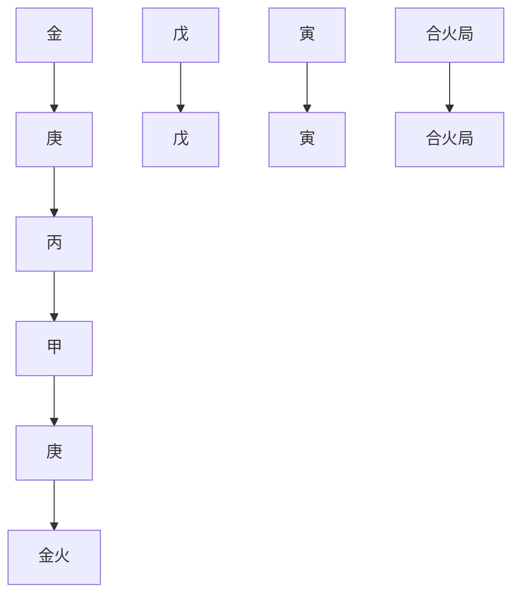
</details>

觀此八字，日主甲木生月干丙火，地支寅午戌合成火局，火勢甚旺。年干和時干透出雙金，年干庚金遭月干丙火剋去，只有時干庚金不能盡剋。在這種情況下，不可能再用金水去剋木火，強求平衡了。唯有順勢而為，繼續走木火了。這是具有旺勢的八字的處理之道。

再進一步觀察，在木火勢中，火是主勢，也就是傷食之氣充分洋溢。木火本主文明之象，傷食秀氣橫溢，正是這種秀氣造就了這位理學大師的經世學問。朱熹是儒學的集大成者，世人尊稱為朱子。他是唯一非孔子親傳弟子而享祀孔廟，位列大成殿十二哲者之中的儒家代表人物。

實際上，朱熹的晚年是十分淒慘的。歷史經過是：

南宋寧宗慶元二年（1196年丙辰）二月，外戚韓侂胄使用權術使朱熹在朝廷的支持者趙汝愚罷相。三月，韓侂胄當政，朱熹學說被誣為「偽學」。當時凡與韓侂胄意見不合的都稱為偽學之人，發生了史稱「慶元黨禁」案。十二月，監察御史沈繼祖以捕風捉影、移花接木、顛倒捏造手法奏劾朱熹「六大罪狀」，朝廷權貴對理學掀起了一場史所罕見的殘酷清算。

當時開列了一份五十九人的偽逆黨籍，凡名列黨籍者都受到了不同程度的處罰。朱熹被斥之為「偽學魁首」，位列黑名單之中的第五位，以偽學罪首落職罷祠，其門人流放、坐牢。甚至有人提出：「斬朱熹以絕偽學」。

慶元六年（1200年庚申）朱熹足疾大發，服藥無效，引動臟腑，病情惡化。朱熹生命垂危，左眼已瞎，右眼也幾乎完全失明。但他卻以更旺盛的精力加緊整理殘篇。4月23日，朱熹在陰冷的黨禁中幽憤去世。

「慶元黨禁」案發生在命造64歲開始的癸巳大運裡。「高潮」在1196年丙辰的冬天，此時命造尚在癸水運中。天干是水剋火，地支是辰（水庫）沖戍（火庫），壞了寅午戌火局，逆命局之火勢，一時真是黑雲壓城城欲摧。

到了 1200 年庚申，流年與日柱天剋地沖，命造、大運、流年地支構成寅、巳、申連環三刑，一代理學大師終於含恨走完自己的人生之路。 $^{16}$

命理經典《滴天髓》說：「兩氣合而成象，象不可破也。」當八字結構中形成了一股強勢時，這股強勢也是不能「破」的。這是形象分析的基本原則。朱熹命例充分說明了這條基本原則。

①《子平真詮評注》「跋」。  
② 如段建業在《段氏理象學》中指出：「事實上，盲派命理放棄了傳統命理所注重的日主衰旺和用神，……日主衰旺既說明不了任何東西，也代表不了命主能力的大小或身體的好壞，更不能解釋命主的命運軌跡，所以是沒有任何實際意義。」（第71頁）  
③ 見《淵海子平》「氣象篇」。  
4 參閱拙作《命運的求索》，第 391～393 頁。  
⑤ 謝武藤：《八字深入》（1），第66頁。  
這裡值得指出，在充當五行長生的四個地支中，已是比較特殊的。已為金之長生，它本身主氣是火，所以為相剋之長生，故它具有兩重性。要隨環境來確定屬性，木火旺時它會發揮火性，金水旺時它會隨金。  
⑦ 鑒於這種錯誤的認識，也有不少命理學者認為此種結構是「從印格」（即印太旺，只好棄命從印）。其實，「母多滅子」，再從母，子不就更難救了？  
段建業在《段氏理象學》中說：盲師郝金陽先生「斷命既不講用神，也很少用格局，卻能將過去發生的具體事情推斷出來。」（第71頁）  
9 章命造內雖然只有三個卯木，但卯木當令，其勢已經相當旺了。  
10 見謝武藤：《八字深入》（1），第64頁。  
⑪《八字深入》(1)，第17頁。  
12 炎上格需以丙丁火為日主，生於夏天，或寅午戌月。  
13 將朱熹的理學尊為主流的意識形態始於元朝。元朝皇慶二年（1313年）恢復科舉，詔定以朱熹《四書章句集注》為標準取士，朱學定為科場程式。


<details>
<summary>flowchart</summary>


</details>

# 第三章

# 干支詳析（上）

在進入各類實務領域之前，我們先討論八字分析中的一些基本材料和操作法則。首先是干支，因為它們是八字構造的基本材料。

談到干支，筆者常常想到自己的研究專業——語言學。傳統語言學認為語言有三要素：語音、詞匯和語法。詞匯中的語詞是材料，它們是音、意結合的符號。語法是組詞造句的規則。它把語詞材料按照一定的規則組合起來，生成出無數不同的句子，來表達思想和進行交際。因此，語言是特殊的符號系統，語言學本身是一種符號學。

聯繫到命理學，命理學的「詞庫」就是10個天干加上12個地支，共22個符號。它的基本「詞匯」是60個干支。它的「語法」就是通常講的「生剋制化」、「刑沖合會」。它們反映了不同符號的組合關係，表達出不同的意義或信息。當然，由這22個符號組成的四柱結構，並不像自然語言那樣是「開放」的系統，造出的句子可以是「無限」的。它只有561,600個四柱結構。但就其特性來說，命理學也是一種符號學。

期待命理學能跨入學術殿堂是筆者的不懈追求。因此，有必要再次認識命理學的這些基本材料（干支符號）和組合單位（六十干支）。

# 干支類象

八字命理學的干支符號是由漢字來書寫的，因此具有漢語文字特有的功能。漢字不同於其他民族使用的拼音文字，它具有特殊的筆劃形體，造字時就帶有象形的功能，所以，干支具有「類象」的意義。它具有認識和描寫現實生活的強大活力。

# A. 十干類象 $^{①}$

1. 甲（陽木）象：高大的樹木。在天為雷，在地為喬木。在人為首領。其類象為：木頭，棟樑，松柏，電桿，高樓，神位。其形「直」。寬仁，磊落，剛健，積極。

甲木有公門之意，甲木官印多，多數會入公門。

2. 乙（陰木）象：藤曼之木。在天為風，在地為花草。其類象為：禾苗，軟條木，藤條，蔬菜，莊稼，綠地，蘭蕙，花園，毛筆，織物，絲線；樸實，善良，柔情，儒雅。其形「曲」。

乙木在現代社會有傳播之象，只要通於年時，多數會表示文字傳媒。

3. 丙（陽火）象：光焰之火。在天為日，在地為光。其類象為：光芒，權力，溫暖，色彩，影視，信息，名氣，裝飾，城門，宮室，劇場，文章，書畫，電器，熱能；熱情，多言，猛烈，廉潔。其形為「大」。

丙火現代社會有影視傳媒之象，配壬水有色彩之意。

4. 丁（陰火）象：燈燭之火。在天為星，在地為燈。其類象為：星光，靈光，燈火，文明，文化，思想，醫道，玄學，神學，香火，電子，網絡，文章，書籍，報刊，榮譽，名望；文雅，多思，神秘，智慧。其形為「小」。

丁火有文字之意，可以用來表示文化水平的高低。

5. 戊（陽土）象：高崗之土。在天為霞，在地為厚土。其類象為：虹霓，大地，山丘，高坡，堤岸，城牆，建築，倉庫，寺院，古董，舊物，磚瓦，高台，講台；忠厚，慢性子，老成，生硬。其形為「方」。

戊土獨透者，容易當老師，因為戊有講台的意思。

6. 己（陰土）象：田園之土。在天為雲，在地為柔土。其類象為：雲霧，巒煙，田園，庭院，平原，墓地，土產，農業，水泥，建材，裝飾材料，果實，書本，管道，道路，斑點，粉塵；含蓄，謹慎，多疑。其形「彎」。

己土臨食神，表示愛讀書。

7. 庚（陽金）象：刀斧之金。在天為霜，在地為硬金。其類象為：頑鐵，利器，五金，鋼材，礦物，機器，製造業，金融，軍隊，警察，車，大路，手術，醫院；剛強，威武，暴躁，固執。其形為「棱角」。

庚金喜火煉方能成器，金旺無火為頑金。

8. 卒（陰金）象：手飾之金。在天為月，在地為柔金。其類象為：金子，珠寶，玉器，鑽石，首飾，晶體，樂器，針，剪刀，筆，錢幣，金融，醫藥，精加工，法律；通達，柔潤，靈動，好面子。其形為「緻密」。

辛酉金之財，職業有可能是律師。

9. 壬（陽水）象：江河之水。在天為雲海，在地為江河湖海。其類象為：大海，水澤，江河，湖泊，運輸，貿易，水產，石油，水彩，運算，數字；智謀，好動，任性。其形為：「無規則」。

壬水與數字相關，加上別的組合，其職業易為會計師。

10. 癸（陰水）象：雨露之水。在天為雨，在地為泉。其物象為：春露，泉水，霜雪，池塘，結晶，眼淚，墨，水產，浴業，後面，玄學，智業，謀略，美容，提煉物，藥；智謀，聰明，機敏，溫柔。其形為「圓潤」。

# B. 十二地支類象

1. 寅（陽木）象：類似甲木。表示木質的象：樹木，木材，傢具，電桿；引申為高大，高貴，生機，初始。其象有：高樓，堂廟，會所，首領，公門，官府，獎賞。另外，因其含火，可類象為：槍彈，發動機，動力，武裝，暴力。

2. 卯（陰木）象：類似乙木。表示木性的象：花草，藤條，木條；彎曲、細軟的東西：絲線，繩索，織物等；也可引申為：建材，鋼筋，門窗，波，傳播，蔓延，釋放，報刊。

3. 辰（濕土）象：陽土，性溫濕。表示土本性的象有：泥巴，水庫，池塘，水井，堤岸，田園。為水庫，可以引申出與癸、子水相關的象：

車輛，機器，電腦，網絡，化工。辰土之象還有：牢獄，中藥，大機構，大市場等。

4. 巳（陰火）象：巳火佔陰位而藏陽，其象與丁火較接近，有文明、文化之象徵。其象為：文章，思想，幻想，務虛；可以引申為：色彩，影像，靚麗，圖像，網絡，變化；已同於八卦中的巽卦，有道觀，交易，鬧市之意。

5. 午（陽火）象：佔陽位而藏陰，彰顯陽火的特點，其象與丙火相似。表示火熱之象的有：大熱，火器，動力，冶煉；可以引申為：光彩，電子，信息，廣告，色彩，文學，語言，文章，熱情，激動；此外還有：高血壓，血光，出血。

6. 未（燥土）象：為陰土，其性乾燥收斂，溫而不火。未為太常，有酒食、休閒之意。其象為：田園，公園，庭院，果實，酒店，休閒，情趣，飾物，食物；土中含木，為：建築，營造，樓台，高牆等。

7. 申（陽金）象：類似於庚金，表示金質、硬質的物像：鐵器，鋼材，刀，鏟，礦產；也可以是：機器，車輛等。申金有秋季蕭殺之性，引申為：軍隊，兵戈，政法，司法，律令，金融，理性，理科，西醫，手術。

8. 酉（陰金）象：類似辛金，如：首飾，玉器，金石，器皿，鐘錶；酉為陰中之陰，表示許多陰性事物：碑碣，寺院，隱學，玄學，奸邪，妓女，病人，死人，隱性收入；還可以類象為：酒店，法律，技術，技巧等。

9. 戌（燥土）象：其性溫燥。表示土性的象有：窖冶，爐，城牆，高崖，墳墓，崗嶺；因為其為火庫，引出與熱相關的象：槍彈，軍火，加油站，電站，動力，發動機，汽車，互聯網，煤礦；又可引申為：影院，鬧市，市場，歌舞，色情等；戌表示武庫，同時又可表示文庫，因為火主文，如：學校，編輯部，教育部門等；此外還有：牢獄，建築，高樓，建材，化工（反應爐之類），數學（戌在乾位，乾主數學）。

10. 亥（陰水）象：佔陰位而藏陽，但其象與癸水接近，表示水質的象有：池塘，井泉，灌溉，筆墨，酒，水產，濕毒；戌、亥是八卦乾位，表示數學，可引申為：數學，運算，科技等，這一點與壬水接近。  
11. 子（陽水）象：佔陽位而藏陰，表現的陽水特點與壬水接近。亥水為止水，子水則為流動之水，其象為：河流，江海，流動，流轉，可引申為：輪子，旋轉，轉動的機器，圓形之物。子是冬至月，一陽初動，有初始、根本之意；引申象有：種子，細微，仔細，根源，玄學，哲學，數字，數學。  
12. 丑（濕土）象：為陰土，其性寒濕，為陰中之陰。表示土質之象有：凍土，濕土，泥，沼澤，堤壩；除陰冷外，還有黑暗之意，引申為：地下室，下水道，廁所，礦井，煤炭，墳墓，牢獄，黑社會，私情，淫亂，玄學，目盲；還有：銀行，軍營，地產，田園等。

關於如何運用干支類象來推理，生動形象者莫過於民國任綏卿《命理索隱》中這個分析案例了：

# 命例12：乾造

<table><tr><td>辛</td><td>丁</td><td>丁</td><td>庚</td></tr><tr><td>卯</td><td>酉</td><td>卯</td><td>戌</td></tr></table>

作者利用干支類象，做出這樣的分析 $^{②}$ ：

生時天晴，天干辛為秋霜，丁為星辰，庚為月。生日在九月初旬，寒露未過，新月如蛾。月光不大，星光尚明，而在夜黃昏時候。秋深夜靜，寒霜下降，星月明徹，此天象也。地支卯為瓊林，酉為寺鐘，戌為原野，曠野無人。但有深林隱寺而聞疏鐘。合之天象，乃是秋深黃昏時候，在曠野無人之處，星月高照，寒霜漸下，但聞林間寺鐘之聲。

這裡，任氏依據干支類象，描繪了一幅星月皎潔的夜景圖。接著，他做出了這樣的推理：

其圖像如此，揆之天道，參之地理，而人事在其中矣。然後斷其為人：作事頗精，如星月之皎潔也；多愁思，是在深秋靜時也；多寒冷，有濃霜侵肌也；六親少力，因野無人煙也；凡百之事，全靠自為，乃寺僧報鐘也；名利多虛，謂空聞其聲也。於是乎富貴榮辱定矣。

這也點明了我們常常可以把一個八字作為一幅圖畫來賞析，從圖畫中推演出許多人世的事理來。

再看一個現代案例：

命例 13：乾造 馬雲 1964 年 10 月 15 日申時生。阿里巴巴集團創始人。


<details>
<summary>text_image</summary>

正印 正印 傷官
甲 甲 丁 戊
辰 戌 酉 申
(財)
</details>

會西方一氣

此案例取自《段氏理象學》。作者段建業分析道：「戊土傷官獨透，傷官主思想，也主講台，所以他曾當過八年老師。後創建阿里巴巴，搭建了世界上最大的電子商務平台，還是與戊土之台象有關。」 $^{③}$

在《基礎教程》中，筆者在「財官網絡」裡把十神對現實生活的映射分為三個主要領域：政治領域、經濟領域和知識領域。印星和傷食星在知識領域。在精神活動中，印星到「我」（日主）是相生關係，因此是一個吸收過程；「我」（日主）到傷官、食神也是相生關係，是一個釋放過程。所以傷食星是「我」精神宣泄的結果，代表了日主才華的發揮。尤其是傷官，比較外向，思想活躍，多才多藝，敢於挑戰習俗，富於創造性。上述馬雲命局中天干上顯露的十神是正印和傷官，正好表述了由正印到我、由我到傷官、即吸收和釋放的全過程。顯然命主是精神活動十分活躍的人，能吸收知識，也能運用知識，具有強烈的精神創造活力。這是符合我們看到的馬雲的個性的。傷官旺，善於知識的運用和發揮，自然很適合於當老師。這是命理邏輯的推導。

至於段先生根據類象，把「戊」土看做為講台，甚至聯繫到「電子商務平台」，正好符合了馬雲的經歷，這或許是「事後諸葛亮」的詮釋吧。

借助類象來比類推理，思維顯得十分富有彈性。它是建立在對生活現象的豐富經驗之上的，常常給人無窮的回味餘地。但由於推理的模糊性，也時常會帶來似是而非、頗顯率強附會的結論。這是我們在應用類象時該有的清醒認識。

# 干支納音

納音是五行跟五音的匹配。這是古人用律呂樂器測量「地磁氣」而發明的音之五行。古代的五音是：宮、商、角、徵、羽。跟這五音相匹配的五行則是：土、金、木、火、水。六十甲子每一對干支，跟它們所匹配的五音所生的五行相一致。下面是「六十花甲子納音歌」：

甲子乙丑海中金，丙寅丁卯爐中火，

戊辰己巳大林木，庚午辛未路旁土，

壬申癸酉劍鋒金。甲戌乙亥山頭火，

丙子丁丑澗下水，戊寅己卯城頭土，

庚辰辛巳白蠟金，壬午癸未楊柳木。

甲申乙酉井泉水，丙戌丁亥屋上土，

戊子己丑霹靂火，庚寅辛卯松柏木，

壬辰癸巳長流水。甲午乙未沙中金，

丙申丁酉山下火，戊戌己亥平地木，

庚子辛丑壁上土，壬寅癸卯金箔金。

甲辰乙巳覆燈火，丙午丁未天河水，

戊申已酉大驛土，庚戌辛亥釵釧金，

壬子癸丑桑拓木。甲寅乙卯大溪水，

丙辰丁巳沙中土，戊午己未天上火，

庚申辛酉石榴木，壬戌癸亥大海水。

根據這首納音歌，就知道，干支甲子、乙丑屬於「海中金」，干支丙寅、丁卯屬於「爐中火」，等等。

如何較快地求出某個干支的納音來？這可以通過一個簡單的數字轉換，得到某干支所屬納音。以下是一個轉換表格：

表 3.1 干支納音數字轉換表

<table><tr><td rowspan="2">天干</td><td>甲</td><td>丙</td><td>戊</td><td>庚</td><td>壬</td></tr><tr><td>乙</td><td>丁</td><td>己</td><td>辛</td><td>癸</td></tr><tr><td rowspan="4">地支</td><td>子</td><td>寅</td><td>辰</td><td></td><td></td></tr><tr><td>丑</td><td>卯</td><td>巳</td><td></td><td></td></tr><tr><td>午</td><td>申</td><td>戌</td><td></td><td></td></tr><tr><td>未</td><td>酉</td><td>亥</td><td></td><td></td></tr><tr><td>納音</td><td>木</td><td>金</td><td>水</td><td>火</td><td>土</td></tr><tr><td>數</td><td>1</td><td>2</td><td>3</td><td>4</td><td>5</td></tr></table>

按照此表，如果要知道干支甲子的納音，只要查表，堅列甲為1，子也為1，將這兩個數相加，則為2，再查表，2數為金，所以，甲子納音為金（海中金）。那麼，今年丁酉，納音是什麼？丁數為2，酉數為2，兩數相加為4。查表，4為火（山下火）。五行最大數是5，如果干支所得數超過5，則減5。比如壬辰，壬為5，辰為3，兩者相加為8，8減去5，餘3。以此餘數查表，壬辰的納音則為水（長流水）。

在命理學史上，由中唐李虛中開創的「古法」時期 $^{②}$ ，納音是推命的主要工具。自五代、北宋開始的今法時期，徐子平的論命模型崛起。這個模型的特點是「專主五行，不主納音」，於是，納音五行就逐漸在後來的命理分析中逐漸「淡化」了。

不過，我們還是要瞭解納音的應用。比如以下案例：⑥

命例 14：乾造  


<details>
<summary>text_image</summary>

甲 己 辛 丙
寅 巳 申 申
刑 刑
大溪水 大林木 山下火 山下火
生 生
</details>

雖然八字中，年、月、日地支出現了三刑，因為年柱納音生月柱納音，月柱納音生日柱納音，於是雖見三刑，並無凶事發生。因此，當八字正五行方面出現了刑沖時，可以再參看一下納音的情況，如果納音也發生相剋，則為雪上添霜；如果納音反而是相生的，可能會因禍得福，至少減去了凶情。

此外，命理古籍《玉井奧訣》說：「缺用納音全為補氣。」它的意思是，如果八字五行不全，這時可以查查納音，是否有納音可以補足命局所缺的五行。比如以下八字：

命例 15：乾造  


<details>
<summary>text_image</summary>

食神 傷官 正官
壬 癸 庚 丁
午 丑 午 丑
正官 正印 正官 正印
正印 傷官 正印 傷官
劫財 劫財
楊柳木 桑拓木 路旁土 潤下水
陰陽五行結構
+水 -水 +金 -火
-火 -土 -火 -土
-土 -水 -土 -水
-金 -金
</details>

這個八字正五行缺了木，但年柱壬午和月柱癸丑納音正好是木。由於納音的補足，使之五行俱全了。「此為檢察長之命。」 $^{⑦}$

目前論命時納音應用得最多的地方是用在年柱和月柱上，忌年柱納音遭月柱納音所剋。這是《三命通會》指出過的。月納音剋年納音多夭折，至少會影響命主33歲前的運限。例如：

命例 16：乾造 1983 年 4 月 1 日卯時生。 $^{8}$


<details>
<summary>flowchart</summary>

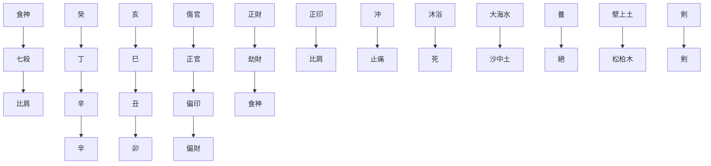
</details>

事實：僅活了14天的嬰兒。

分析：命局年柱癸亥和月柱丁巳天剋地沖，月柱納音沙中土又剋年柱納音大海水，符合了夭折的條件。

當然，造成夭折的理由不僅於此。再進一步分析：辛金日主生已月死地，時支卯木又是辛金之絕地。加之月支巳與日支丑暗拱金局，即巳與丑之間有個西祿，這個西祿又正好遭到時支卯木暗沖。這些因素匯集在一起，使這個嬰兒僅在世14天就一命嗚呼了。

再舉一例 $^{⑨}$ ：

命例 17：乾造 1956 年 1 月 27 日戌時生。


<details>
<summary>text_image</summary>

剣
食神 七殺 劫財
乙 己 癸 壬
未 丑 巳 戌
七殺 七殺 正財 七殺
偏財 比肩 正印 偏印
食神 偏印 正官 偏財
沖
沙中金 霹露火
剣
</details>

大運

<table><tr><td>9歲</td><td>19歲</td><td>29歲</td><td>39歲</td></tr><tr><td>戊</td><td>丁</td><td>丙</td><td>乙</td></tr><tr><td>子</td><td>亥</td><td>戌</td><td>酉</td></tr></table>

事實：10歲甲辰大病半年，幾乎夭折。16歲辛亥年喪父，繼而失學，兩年後才得以復學。年輕時所交之女友，一段時日後皆遭第三者所奪愛。

分析：年柱與月柱天剋地沖，加上納音月柱火剋年柱金，因此，33歲前恐一事無成。進一步分析，10歲甲辰，與命局構成辰戌、丑未四沖。16歲辛亥，辛金鼻神奪乙木食神，七殺無制。19歲起丁亥運，雙沖日柱。姻緣難成。

這裡可以看到年柱納音遭到月柱納音相剋的影響。然而，應當注意到納音的應用，只是作為正五行推理的一種補充。

最後，附上日柱納音十二運斷訣。古法論命，以年柱（年干支）天干為「祿」，地支為「命」，納音為「身」，因此納音顯示的是一個人內在的、潛在的性格。

表 3.2 日柱納音十二運 $^{10}$ 

<table><tr><td rowspan="2">十二運</td><td colspan="5">納音</td><td rowspan="2">備注</td></tr><tr><td>金</td><td>木</td><td>水</td><td>火</td><td>土</td></tr><tr><td>自生</td><td>辛巳</td><td>己亥</td><td>甲申</td><td>丙寅</td><td>戊申</td><td>成長,發生,是創新之星。</td></tr><tr><td>自敗</td><td>甲午</td><td>壬子</td><td>乙酉</td><td>丁卯</td><td>己酉</td><td>即沐浴,多成多敗。</td></tr><tr><td>自冠帶</td><td>乙未</td><td>癸丑</td><td>壬戌</td><td>甲辰</td><td>丙戌</td><td>青少年階段,是功名之星。</td></tr><tr><td>自臨官</td><td>壬申</td><td>庚寅</td><td>癸亥</td><td>乙巳</td><td>丁亥</td><td>茁壯,是富貴亨受之星。</td></tr><tr><td>自旺</td><td>癸酉</td><td>辛卯</td><td>丙子</td><td>戊午</td><td>庚子</td><td>旺盛,是富貴星。</td></tr><tr><td>自衰</td><td>庚戌</td><td>戊辰</td><td>丁丑</td><td>己未</td><td>辛丑</td><td>平凡之星。</td></tr><tr><td>自病</td><td>辛亥</td><td>己巳</td><td>甲寅</td><td>丙申</td><td>戊寅</td><td>孤獨寂寞之星。</td></tr><tr><td>自死</td><td>甲子</td><td>壬午</td><td>乙卯</td><td>丁酉</td><td>己卯</td><td>孤獨寂寞之星。</td></tr><tr><td>自墓</td><td>乙丑</td><td>癸未</td><td>壬辰</td><td>甲戌</td><td>丙辰</td><td>又名「葬神」、「正印」,是財富星。</td></tr><tr><td>自絕</td><td>壬寅</td><td>庚申</td><td>癸巳</td><td>乙亥</td><td>丁巳</td><td>又名「胞胎」,是還原星。</td></tr><tr><td>自胎</td><td>癸卯</td><td>辛酉</td><td>丙午</td><td>戊子</td><td>庚午</td><td>半吉半凶,是變化星。</td></tr><tr><td>自養</td><td>庚辰</td><td>戊戌</td><td>丁未</td><td>己丑</td><td>辛未</td><td>小長生,是精靈之星。</td></tr></table>

自生：有理性，能孚眾望，向上發展、健康、長壽，少年時就有不平凡的際遇，家庭幸福。個性開朗、進取，心境常青。

自敗：做事容易半途而廢，命運多舛，起伏不定，外在的性格令人難以捉摸，是亦正亦邪的人物。行事常輕舉妄動，好色，浪漫。

自冠帶：處事練達，善於交際應對，有先見之明，少年老成，頗有人望。做事有幹勁，充滿活力。早年家境困苦，中年發達，有長者風範。

自臨官：溫厚圓滿，聰明，人品好。富有感情，言行有禮，做事勤奮，內心有些固執。外表善解人意，能予人好感。

自旺：耐力特強，自我觀念很重，精力充沛，意志力強，能貫徹始終，富有實行力，容易致富貴。女性容易再婚。

自衰：溫文，不積極，疑心重，易空想，沒有大志，精神不穩定，是

悲觀的人物。守本分，雖然有進取的氣概，野心卻不大。

自病：富有人情味，有同情心，能推己及人，喜愛清靜生活，有藝術氣質，嫉妒心重。內在性格平和，達觀，看起來不健康。

自死：極為聰明，容易杞人憂天，自尋煩惱，宜於研究、技術之發展。外表很有氣質，稍倔強，重感情。

自墓：內向，稍偏激，財運特佳。若能抑制短處而努力，必有大成功。性淳樸、誠實，很會搜集東西，有儲蓄的美德，不浪費，是圓滿主義者。

自絕：不安定，常會輕舉妄動。若按部就班、循規蹈矩努力，亦能大有發展。個性有些陰沉，不能沉著應變，基本上是溫和的一個人。

自胎：有義氣，人情味濃厚，諧謔風趣，但心情極易變動是為失敗的致命傷。待人忠心，有俠義之風，喜好研究、發明，惜不專精。

自養：獨立能力很強，做事認真，講究實在。有很強的發展潛力。能尊敬體貼長輩，性格是先天下之憂而憂、後天下之樂而樂者。信心稍不夠。

以上納音五行自運，也可以四柱參酌，以日柱為主，月柱為佐。同時，也可以應用於運限，判斷心情心性之變化。比如年柱運限是1歲至16歲，如果干支是己丑，其五行自運是自養，則可以用自養的性質，論16歲之前的性格。月柱是戊辰，運限是17歲至32歲，納音五行是自衰，則以自衰的性質來判斷此階段潛在的性格變化。餘則類推。

# 干支評判

前文談過，干支是命理推演的最基本符號。由10個天干和12個地支按序搭配起來，就構成了60組不同的干支，俗稱「六十甲子」。一個命局，本質上就是個人出生的那個時間片段的標記。它包含了年、月、日和時辰。這四個不同的時間單位，正好由四個干支組合來表述。一個干支組合就是一柱。命局結構就稱作「四柱」。可見六十甲子即是八字運算的基本部件。

# A. 干支類型

在《基礎教程》中，我們討論過干支的五種基本類型 $^{①}$ ：

（1）上生下：即天干生地支，有12組：

甲午 乙巳 丙辰 丙戌 丁未 丁丑 戊申 己酉 庚子 辛亥 壬寅 癸卯。

(2) 下生上：即地支生天干，也有 12 組：

甲子 乙亥 丙寅 丁卯 戊午 己巳 庚辰 庚戌 辛未 辛丑 壬申 癸酉。

（3）上剋下：即天干剋地支，也有12組：

甲辰 甲戌 乙未 乙丑 丙申 丁酉 戊子 己亥 庚寅 辛卯 壬午 癸巳。

（4）下剋上：即地支剋天干，也有12組：

甲申 乙酉 丙子 丁亥 戊寅 己卯 庚午 辛巳 壬辰 壬戌
癸未 癸丑。

（5）上下同：即天干和地支五行歸屬相同，也有12組：

甲寅 乙卯 丙午 丁巳 戊辰 戊戌 己丑 己未 庚申 辛酉 壬子 癸亥。

對於這五種類型，如何予以評判？這時，我們自然會想到《子平真詮》對八字格局成敗提出過兩個重要的評判標準：一個是「有情、無情」；一個是「有力、無力」。在筆者看來，這是八字研究中具有普遍意義上的評判標準。簡而言之，有情、無情，是指各要素成分配合是否得宜；有力、無力，是指各個要素本身是否具有根基。

對照以上五種類型，我們可以看到，（1）和（2）是相生關係；（3）和（4）是相剋關係；（5）是同類關係。若要做出簡單的優劣判斷，自然會取相生和同類為「優」，因為相生為有情，同類如兄弟，有互助之力，因此它們可以屬於

「上等」層次。

對於相剋關係，還要做進一步分析。（3）上剋下為「蓋頭」；（4）下剋上為「截腳」。然而，天干對於地支而言，是天干為陽，地支為陰；天干為「尊」，地支為「卑」。因此，「上剋下」，是「尊」制「卑」；而「下剋上」，則是「卑」剋「尊」，成了一種「冒犯」。所以雖然（3）（4）皆次於（1）（2）（5）類，但其中類型（4）更要放到「下等」層次中去了。

# B. 上下相合

談到「有情」，這裡值得一提的是，有一類干支具有「上下相合」的情況。比如戊子。戊為陽土，子為癸水（癸為地支子之主氣）。戊子正好上下相合，自然是有情了。這類上下相合的干支有：丁亥、己亥、辛巳、癸巳、壬午、甲午、戊子、丙戌（戊逢未刑時，丙能合戌中之辛）、壬戌（戊逢未刑時，壬能合戌中之丁）等。

由這些干支來充當日柱的話，一般來說，婚姻都比較美滿。因為此時地支為夫宮或妻宮，上下相合，合則有情，自然夫妻更有情義。

前文提到過的曾國藩八字：

命例 2：乾造 曾國藩  


<details>
<summary>text_image</summary>

月、時干支
正財 傷官 傷官
辛 己 丙 己
未 亥 辰 亥
傷官 七殺 食神 七殺
劫財 偏印 正印 偏印
正印 正官
傷官
己
亥
七殺 壬
偏印 甲
合
</details>

其中月、時兩柱是己亥。己亥正是上下相合的干支，具有黏合力。在此命局中，己是八字的傷官；亥中有壬、甲，壬是七殺，甲是偏印。天干己土傷官通過下合甲木偏印，由此達到傷官制殺的目的。這是上下相合的功能體現。

# C. 干支虛實

在《段氏理象學》中，有「盲派」的「干支虛實原理」，即把干支分為虛、實兩大類如下：

表 3.3 干支虚實表

<table><tr><td>實</td><td>虛</td></tr><tr><td>甲寅、甲辰、甲子</td><td>甲申、甲戌、甲午</td></tr><tr><td>乙亥、乙卯、乙未</td><td>乙巳、乙酉、乙丑</td></tr><tr><td>丙寅、丙午、丙戌</td><td>丙子、丙申、丙辰</td></tr><tr><td>丁巳、丁卯、丁未</td><td>丁亥、丁丑、丁酉</td></tr><tr><td>戊戌、戊午、戊辰</td><td>戊子、戊申、戊寅</td></tr><tr><td>己巳、己未、己丑</td><td>己亥、己酉、己卯</td></tr><tr><td>庚申、庚辰</td><td>庚子、庚午、庚寅、庚戌</td></tr><tr><td>辛丑、辛酉</td><td>辛巳、辛亥、辛未、辛卯</td></tr><tr><td>壬申、壬子、壬辰</td><td>壬戌、壬午、壬寅</td></tr><tr><td>癸亥、癸酉、癸丑</td><td>癸巳、癸未、癸卯</td></tr></table>

段先生說：「盲派講的虛實只就一柱干支而言，與周圍的生剋關係沒有聯繫。……天干之氣弱，地支之氣強，天干要依附於地支才能得旺，地支不生扶天干，則為虛。虛實的基本原則是：天干無根無生者虛，天干有根有生者實。」 $^{②}$ 他指出：實和虛是兩個不同的象，具有不同的信息，並舉了胡適先生的八字為例：


<details>
<summary>text_image</summary>

干支：
虚 虚 虚 實
偏財 正財 比肩
辛 庚 丁 丁
卯 子 丑 未
偏印 七殺 食神 食神
七殺 比肩
偏財 偏印
</details>

八字中年干和月干透出偏財和正財，因為這兩柱干支為「虛」，這財星在本干支無根，因此，「當財星以虛狀態出現時，不表示財富，而表示才能。胡適之才學、文章都緣於財星虛透。當然並不是所有財虛透的人都有這樣的才學，有的命並無學識，財虛透僅表示能說會道而已。」 $^{③}$

如果對照前述干支類型，「實」的干支基本上是上下同類（類型 5）或者是下生上（類型 2）；「虛」的干支則基本上包括了上生下（類型 1）、上剋下（類型 3）和下剋上（類型 4），但要做分析。如果地支是辰、戌、丑、未四土的話，要看它們的藏遁中是否有天干的「根」，有根的則為實；無根的則為虛。但注意燥土不生金，金遇燥土戌、未不作相生看。

# 刑沖會合

本章開始時就已經談到，命局是由干支符號以及它們的組合搭建起來的架構。其中符號之間的相互關係，是通過生剋制化、刑沖會合來刻畫和表述的。命理學正是通過八字結構內部的成分以及這些成分的生剋制化、刑沖會合關係來映射色彩繽紛的社會生活的。

首先，天干為陽，地支為陰。陽性動，陰性靜。因此，在八字結構內，天干氣動，處於運動狀態、活躍狀態，遇生則生，遇剋則剋；地支氣靜，則處於相對靜止、孤立的狀態。因此，一般來說，地支與地支相互之間生剋作用並不十分顯著。只有當這種靜止、孤立的狀態被刑沖會合所打破，也就是說，刑沖會合能使它們「動」起來，「動」就發揮作用了。這種「動」也可以理解為具有「引動」、「激活」的含義。命理典籍《玉井奧訣》有兩句十分經典的話：

天干專論生剋制化，地支專取刑沖破害。

這就是：天干以生剋制化為關注點，地支則以刑沖破害為關注點。

命理中的刑沖會合，實際上包括了合、會、沖、刑、害（穿）、破等多種形式。下面分別予以探討。

# A. 天干相合

十個天干，每隔五位相合，共有五組：

甲己合；乙庚合；丙辛合；丁壬合；戊癸合

每一組都是一陰一陽的組合。當這十個天干充當命局日干時，若日干為陽，它所合的是財星。比如，甲日干合己，甲屬陽，己屬陰，己為甲之正財。相反，若日干為陰，它所合是官星。比如，己日干合甲，甲為己之官。

事實上，這五組相合，都是合中帶剋、剋中見合的。既然陰陽異性相合、相吸，終為有情，故有親近、管理、控制的意義。有些命理學家乾脆直接把這相合之物，作為日主的「價值取向」來看待。因為財與官，正是世俗中人們所嚮往、追求的東西。

命理學中，對於相合的干支，還有「化」的情況：

甲己合土；乙庚合金；丙辛合水；丁壬合木；戊癸合火

當然，從合到化，是需要條件的。這要看八字的配置情況而定。化，會改變原性；合而不化，則保留原性，大都是「兩失其用」。然而現代「盲派」則乾脆否定「化」的功能。

# B.天干相冲

天干之間有如下的沖：

甲庚沖，乙辛沖，丙壬沖，丁癸沖。

這四對相沖，主要來自於方位的對峙。甲與庚沖，乙與辛沖，是東與西的對峙；丙與壬沖，丁與癸沖，是南與北的對峙。顯然，相沖也有相剋的含義。就陰陽而言，它們又都是同性的，即陽剋陽、陰剋陰，相剋是無情的。剋本身也主「動」。

# C. 地支六合

地支六合如下：

子丑合；寅亥合；卯戌合；辰酉合；巳申合；午未合

這六組合可以分成兩類，一類是剋合或合剋：

子丑（土剋水），卯戌（木剋土），巳申（火剋金）

另一類是生合或助合：

寅亥（水生木），辰酉（土生金），午未（火生土）

因此八字結構中出現六合，都應當仔細觀察它們內部五行發生了什麼變化。在這方面，「盲派」刻畫得比較細膩。不僅注意到地支之間的「合」，也注意到因合而產生的內部生剋、動靜關係。比如以下命造 $^{②}$ ：

命例19：乾造  


<details>
<summary>text_image</summary>

正官 正印 傷官
甲 丙 己 庚
辰 寅 亥 午
劫財 正官 正財 偏印
七殺 正印 正官 比肩
偏財 劫財
合
</details>

事實：結婚不久，便離異。

分析：原局寅亥合。亥為妻宮，有壬水妻星。寅亥合，水生木，「妻宮之妻子被月令合絆，這種合主不利婚姻，表示自己的妻子離開妻宮的位置，跟外邊的東西合了。」 $^{①}$ 這是寅亥六合，究其原因是亥中壬水（正財）去生了寅中甲木所產生的後果。

再如以下命造：

命例 20：坤造 2000 年 9 月 23 日戌時生。


<details>
<summary>text_image</summary>

合
七殺 劫財 比肩
庚 乙 甲 甲
辰 酉 申 戌
偏財 正官 七殺 正財
劫財 偏印 正官
正印 偏財 傷官
合 會西方一氣
</details>

事實：幼兒死於乙酉年（2005年），丁亥月，己酉日，癸酉時。肝病去世。

分析：命局尚未起大運。結構中年月柱有乙庚合，辰酉合。八字日主甲木，身弱，地支上唯有辰中有乙木為根。辰酉合，是土生金。地支還有申酉戌會西方一氣。因此地支全成了一片金氣，殺旺可知。乙酉年，跟月柱伏吟，除了天干乙庚合，還引動了酉金。雖然辰酉合，土生金，但要看到酉金此時也乘機進入辰土，鏟去了辰土中藏有的乙木餘氣。於是甲木完全無根可依了。木在五臟屬肝，故肝病不治而死。

六合在傳統命理中有「合而化」和「合而不化」的問題：

子丑合土；寅亥合木；卯戌合火；辰酉合金；巳申合水；午未合土

但現代「盲派」不理會這六合究竟各自「合」成什麼、「化」成什麼。在他們看來，「地支六合並不講合化，只講合。」 $^{16}$

# D. 三合局和三會方

地支三合局，是指以下的組合：

木局：亥、卯、未；

火局：寅、午、戌；

金局：巳、酉、丑；

水局：申、子、辰；

以及：

土局：辰、戌、丑、未。

在前文中已經談到，木、火、金、水局是取長生、帝旺、墓庫三個位置組成，表示了五行的起始、旺極和終結三個點。土局則取方位的辰未戌丑四隅組成。

地支三會方，是指地支會合成東方、南方、西方和北方，即：

東方木：寅、卯、辰；

南方火：巳、午、未；

西方金：申、酉、戌；

北方水：亥、子、丑。

當然，會方必須是相關的三個地支同時出現，缺一不可，只有這樣才能代表該五行強盛的旺氣。三合局與三會方不同的地方是，如果僅有兩字，只要中間那個代表專氣的中神在，如亥卯，或卯未，只要卯字在，依然合木氣，此時為「半合局」。只是合力遜於三字合局。

這些在《基礎教程》中都談過。比如以上命例 20，地支申酉戌全，匯成

西方一氣。

無論是三合局還是三會方，都具有很強的凝聚性，成為一股強勢。晚清慈禧太后的八字就有三合局：

命例 21：坤造 慈禧太后（1835 年～1908 年）。晚清兩朝的最高統治者。


<details>
<summary>text_image</summary>

比肩 食神 偏財
乙 丁 乙 己
未 亥 丑 卯
偏財 正印 偏財 比肩
食神 劫財 偏印
比肩 七殺
合木局
</details>

葉赫那拉（1835年11月29日～1908年11月14日），滿洲鑲藍旗人。清咸豐帝奕諄之妃，同治、光緒兩朝的實際最高統治者。

八字日主為乙木，地支亥卯未三合木局，再加上年干乙木，木已構成強勢，日主可謂強矣。這正是慈禧太后實際掌控清朝達47年之久的命理基礎。

由於三合局的「凝聚力」很強，當它們合去喜用神時，常常是「無藥可救」。比如下面這個命造：

命例 22：乾造 1966 年 4 月 11 日（農曆 3 月 21 日）申時生。


<details>
<summary>text_image</summary>

七殺 食神 正財
丙 壬 庚 甲
午 辰 子 申
正官 像印 傷官 比肩
正印 正官 食神
傷官 偏印
合水局
</details>

這個案例取自《八字深入》，作者將之稱為「真正『弱不堪扶』的八字，是原局的生機敗絕，連大運也不必看，就知道會窮苦一輩子。」 $^{①}$

為什麼這樣說？在八字結構中，日主庚金，通根於申祿，雖弱，但有強根。然而申子辰三合水局，合去了申祿，申中原有的庚金之力因合而化為水氣，日主從有根變成了無根，故變得弱不堪扶了。因此，「一個八字地支見三合局合成忌神時，比沖還要不利許多。」此話純屬不假。

這裡要提一下：當四柱與運、歲之間構成兩個三合或三會局相沖剋之年，往往會有一場大災難，即使在好運中都很難免。比如以下案例 $^{①}$ ：

命例 23：乾造 1949 年 5 月 17 日（農曆 4 月 20 日）亥時生。


<details>
<summary>text_image</summary>

大運 流年
食神 食神 偏財
己 己 丁 辛
丑 巳 未 亥
(酉) (卯)
15歲 21歲
丁 己
卯 酉
</details>

事實：丁卯運，21歲己酉，尚在大學求學期間。一次參加露營活動，因口舌引發打群架，遭小流氓打傷頭部而致腦震蕩。

分析：命局中巳丑拱金局，亥未拱木局。這兩個拱局在21歲時正好都被填實：卯運填實了日時地支，流年酉又填實了年月地支，於是形成巳酉丑金局與亥卯未木局的沖剋，發生了群毆被傷這等凶事。

再看一例： $^{19}$


<details>
<summary>text_image</summary>

偏財 偏印 偏印
庚 甲 丙 甲
戊 申 子 午
大運 流年 流月 流日
15歲 1990年 4月 19日
壬 庚 庚 甲
午 午 辰 寅
刑 刑
合水局
合火局
</details>

事實：1990年4月19日，家庭因瑣事爭吵，命主又氣又惱，竟自殺身亡。

分析：觀察命局、大運、流年、流月、流日干支情況，天干三庚沖剋三甲；地支申子辰合水局沖剋寅午戌三合火局；剩餘的午、午自刑，這些沖剋加在一起，造成了這個不可挽救的慘劇。自然，其中水火兩局的沖剋是主要因素。

# E. 地支六冲

地支六冲是：

子午沖；丑未沖；寅申沖；卯酉沖；辰戌沖；巳亥沖

沖，是衝突、相戰之意。但要考量相沖地支的五行內涵。子午沖，是子中癸水剋午中丁火；午藏己土剋子中癸水。丑未沖，是丑中辛金、癸水剋未中乙木、丁火；未中己土、丁火剋丑中癸水、辛金。寅申沖，是寅中的甲木、丙火分别克申中的戊土、庚金；申中的庚金、壬水分別克寅中的甲木、丙火。卯酉沖，比較單純，是酉中的辛金克卯中的乙木。辰戌沖，是辰中癸水、乙木分別剋戌中丁火、戊土；戌中辛金剋辰中乙木。巳亥沖，是巳中庚金剋亥中甲木；亥中壬水剋巳中丙火。

「盲派」認為，相沖的本意是往來互換。這是兩者建立一種相互往來的關聯性。因此，相沖表示得到、互有、交換、保持聯繫。只有在沖中帶剋的情況下，才有破壞的作用。這樣的看法比一般認為「沖」就是破壞的解讀要來得細膩、準確。在《基礎教程》中，我們舉過英國戴安娜王妃的八字：

命例 25：坤造 戴安娜王妃（1961 年～1997 年）。


<details>
<summary>text_image</summary>

七殺 劫財 傷官
辛 甲 乙 丙
丑 午 未 戌
偏財 食神 偏財 正財
偏印 偏財 食神 七殺
七殺 比肩 食神
害 合 刑
沖
</details>

在八字結構中，辛金七殺為夫星（指查爾斯王儲），坐丑。未為夫宮。丑未沖，這裡表示關聯，夫星進入夫宮，有了婚姻關係，當時戴安娜才20歲。然而，丑午相害，戌未相刑，丑中的夫星受傷，夫宮（未）也受傷，這場「世紀婚禮」終於以離散為結局。

其實，在命理經典《滴天髓》中有這麼一個案例：

命例 26：乾造（古案）

<table><tr><td>偏財</td><td>七殺</td><td></td><td>偏印</td></tr><tr><td>甲</td><td>丙</td><td>庚</td><td>戊</td></tr><tr><td>申</td><td>子</td><td>辰</td><td>寅</td></tr><tr><td>比肩</td><td>傷官</td><td>偏印</td><td>偏財</td></tr><tr><td>食神</td><td></td><td>正財</td><td>七殺</td></tr><tr><td>偏印</td><td></td><td>傷官</td><td>偏印</td></tr><tr><td colspan="4">合水局</td></tr></table>

任鐵樵做了這樣的評注：

此寒金冷水，木雕土寒，若非寅時，則年月木火無根，不能作用矣。所謂寒雖甚，要暖有氣也。由此論之，所重者寅也。地氣上升，木火絕處逢生，一陽解凍。然不動丙火亦不發。妙在寅申遙沖，謂之動，動則生火矣。凡四柱緊沖為剋，遙沖為動。更喜運走東南，科甲出身，仕至黃堂。

這裡最重要的是：凡四柱緊沖為剋，遙沖為動。它指出了，命局裡地支六沖由於位置的不同而存在著性質的差異。

然而，六沖也要看具體情況。如果是沖了忌神，反而是有利而無害。例如以下命造 $^{20}$ ：

命例 27：乾造 1957 年 10 月 29 日（農曆 9 月 7 日）辰時生。


<details>
<summary>text_image</summary>

傷官 七殺 偏財
丁 庚 甲 戊
酉 戌 戌 辰
正官 偏財 偏財 偏財
正官 正官 劫財
傷官 傷官 正印
沖
</details>

這裡日支戌與時支辰相沖。一般而言，日柱與時柱天剋地沖，不利於晚年和子息。但這裡並非如此。因為此命造從格局上講，已經是從財格了。唯時支辰中有日元甲木之弱根，是與從財格局相抵觸的。現在辰戌相沖，土財沖旺，而將此微根（乙木）拔去，反而使格局澄清了。所以，刑沖會合所可能產生的影響還是要以命局的喜忌為旨歸。

# F. 地支相刑

地支之間還有四種相「刑」的關係：

無禮之刑：子刑卯，卯刑子

三刑（無恩之刑）：寅刑巳，巳刑申，申刑寅

三刑（恃勢之刑）：丑刑戌，戌刑未，未刑丑

自刑：辰刑辰，午刑午，酉刑酉，亥刑亥

一般而言，命帶子卯刑者，較應注意色慾之厄；帶巳寅申三刑的人，較不利骨肉六親；帶丑戌未三刑者，較容易突遭挫折或多病災；帶自刑者，較缺乏獨立精神，常常會有始無終，固執己見，與人意見不合。

對於沖與刑的差別，朱鵲橋先生有過一個通俗的講法：沖是方位相沖，立場不同，是對抗；刑不是對抗，就是人與人之間「合不來」。天干沒有刑，只有地支才有刑，因為地支每一個宮位都代表了一種六親關係，於是刑必及六親。 $^{24}$ 這種看法確實是經驗之談，頗有見地。請看以下命例 $^{25}$ ：

命例 28：乾造  


<details>
<summary>text_image</summary>

比肩 劫财 七殺
辛 庚 辛 丁
巳 寅 卯 酉
正官 正財 偏財 比肩
劫財 正官
正印 正印
刑 冲
</details>

事實：出生破落戶家庭，六親緣薄。

分析：年月地支相刑；日時地支相沖，六親星（偏財、正印、正財）與宮都被沖壞、刑壞了，故六親緣薄。

# G. 地支害（穿）和破

地支由於有「六合」和「六沖」這樣的雙重關係，於是產生了「六害」：

子未害；丑午害；寅巳害；卯辰害；酉戌害；亥申害

比如，子未相害：

圖 3.1 六害關係解說  


<details>
<summary>flowchart</summary>

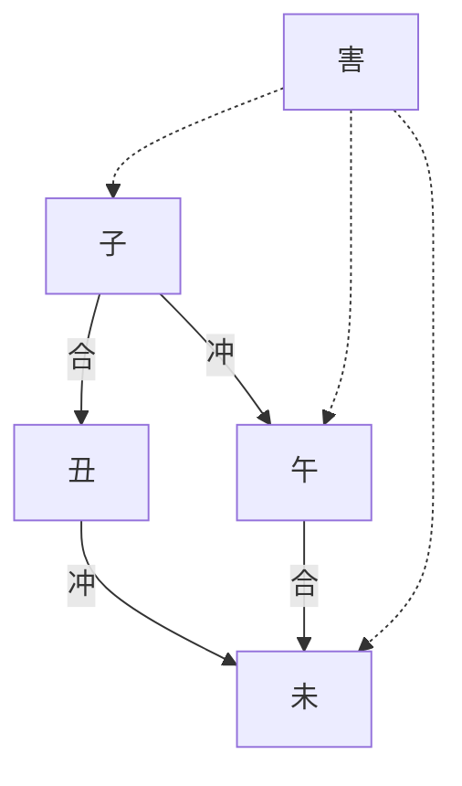
</details>

從圖中可以看到，子丑合、子午沖；午未合、丑未沖。如果說，合是朋友；沖是敵人。就子、未來而言，我合的是你的敵人，我沖的是你的朋友。於是，我們倆的關係也就自然不會好了，所以稱作「害」。十二個地支，共有六組。

盲師稱「害」為「穿」。歌訣為：

鼠羊一斷休（子未穿），白馬怕青牛（丑午穿）；

虎見蛇如刀斷（寅巳穿），兔龍犯著不合美（卯辰穿）；

豬和猿猴不到頭（亥申穿）。

「盲派」特別重視「穿」，認為它的危害性很大。穿有排斥、不容、破壞、傷害等含義；以相剋又帶穿的情況最嚴重，包括子未穿、卯辰穿、酉戌穿。《段氏理象學》中舉了下面一位書法家的例子：

命例 29：乾造  


<details>
<summary>text_image</summary>

合
劫財 正官 劫財
戊 甲 己 戊
戊 子 未 辰
劫財 偏財 比肩 劫財
食神 偏印 七殺
偏印 七殺 偏財
穿
</details>

事實：一位很有名氣的書法家，至今沒有結婚。

分析：因為妻宮未與妻星相穿之故。穿為排斥之意，女人進不了他的家中，只能單身。 $^{20}$

「穿」除了破壞的含義，還有一層「倒」的意思。正的東西可以被穿偏，偏的東西可以被穿正。這又是「象」了，具有象徵意義。下面是《段氏理象學》中的案例：

命例 30：乾造  


<details>
<summary>text_image</summary>

合
比肩 正財 劫財
丙 辛 丙 丁
子 卯 辰 酉
正官 正印 食神 正財
正印
正官
穿 合
</details>

段建業先生這樣分析：「此命丙日主坐支辰為食神，食神之心性表示心眼好，寬仁大度之意。不幸被卯木穿倒，謂穿倒食神，心性走向食神相反的方向去了，所以可以判斷這個人心眼小，不仁不義，過河拆橋，事實確實如此。」 $^{②}$

這裡用「穿」日支來描寫人的心性，確實有耳目一新的感覺。

然而也要注意，穿雖有破壞的含義，但是，有時穿也有正面意義。比如，穿了財庫便是得到財了。

地支還有「破」的關係。盲師相破的詩訣為：

兔鼠兩相不成婚（子卯破），牛虎相配兩爭紛（丑寅破）；

玉兔最怕烈馬跳（卯午破），黑豬就怕跳龍門（亥辰破）；

猴羊場裡斷頭婚（申未破），烈馬就怕金雞叫（午酉破），

狗在巳上難臨宿（戌巳破）。

一般命書上不談「破」，只有盲師談論「破」。破，有破壞、無情、破解、破耗等含義。盲師夏仲奇有個運用「破」的案例已經成為了命學界的「經典」案例，如下：

命例 31：坤造 刺繡廠車間主任。  


<details>
<summary>flowchart</summary>

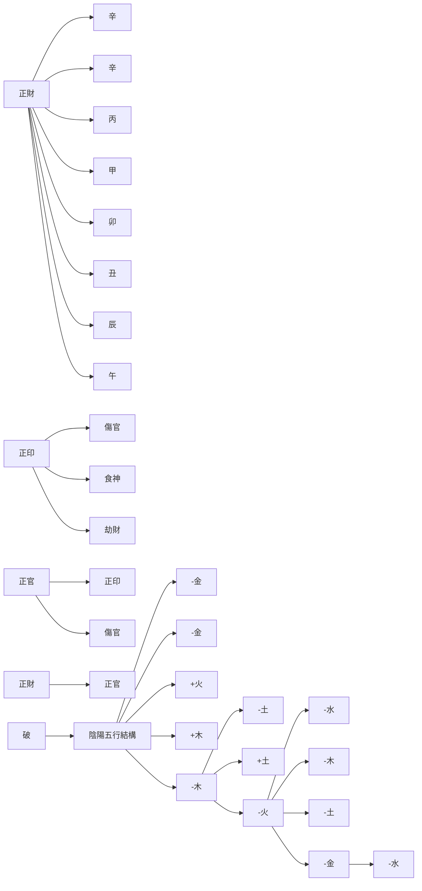
</details>

盲師夏仲奇斷此命為製衣廠或刺繡廠的小官。事實上，她確是刺繡廠的一個車間主任。為何做出這樣的判斷呢？因為原局中有卯午破。印象徵布，卯午之破就是將布破開。天干上有兩個辛金，辛金是針，破了再縫，這就是她的職業。 $^{②}$

無獨有偶，盲師郝金陽也有一個絕案。請看以下案例：

命例 32：乾造 乞丐。  


<details>
<summary>text_image</summary>

比肩 劫财 偏财
壬 癸 壬 丙
子 卯 子 午
劫财 傷官 劫财 正财
正宫
刑 刑 冲
破
</details>

此命造是乞丐。郝先生為什麼會這樣斷？因為時柱可以表示「門戶」。一出門就見到財。子午相沖，表示財沖入我家。壞在卯來破午，被破的財就成了零錢。因為這個「破」——既然財破了，就表示他能得到的只是零碎錢，所以斷此人為乞丐。果真如此。

這是將刑沖破害與類象結合起來做出的判斷，非是有充分的生活閱歷和豐富的想像力則不能為之。

# H. 地支暗合

地支間還有「暗合」:

寅丑暗合；午亥暗合；卯申暗合

理由是：寅中所有的甲木、丙火、戊土與丑中所有的己土、辛金、癸水各自正好六合；午中丁火、己土與亥中壬水、甲木也是六合；卯中乙木與申中主氣庚金也是六合。注意：這裡首先是地支之間的主氣（或本氣）相合。不能把地支藏遁中有合的情況都論為暗合，比如寅與酉，子與巳。

以下是暗合的應用：

命例 33：乾造 $^{®}$   


<details>
<summary>text_image</summary>

正官 偏印 七殺
甲 丁 己 乙
寅 丑 丑 酉
正官 比肩 比肩 食神
正印 偏財 偏財
劫財 食神 食神
暗合 半金局
</details>

事實：第一任妻子與外人相通，故而離異。

分析：命局中無正財，以偏財（癸水）為妻星。妻星（偏財）分別在月支和日支丑中。寅丑暗合，即月支丑中的偏財（癸水）與年支寅中的劫財（戊土）相合，因此第一任妻跟人跑了。這是由地支暗合得到的信息。

① 以下內容主要摘編於《段氏理象學》。  
②《命理索隱》「說八字演成圖像」，第38～39頁。  
③《段氏理象學》，第16頁。  
4 見《八字命理學基礎教程》第十二章。  
⑤ 見拙作《中國命理學史論》，第四章。  
6 取自梁湘潤：《四角方陣刑沖會合透解》。  
⑦ 見鍾義明《命理乾坤》，第 268 頁。  
⑧ 取自戴惠俐《八字觀象實例詳解》，第 174 頁。  
⑨ 取自《八字深入》(1)，第40～43頁。  
10 錄自鍾義明：《現代命理實用集》，台灣武陵，1997年。  
11 見《基礎教程》第九章「干支性質的再認識」節。   
⑫《段氏理象學》，第82頁。  
13《段氏理象學》，第80頁。  
14 《段氏理象學》，第25頁。  
15《段氏理象學》，第25頁。  
16 《段氏理象學》，第25頁。  
17 謝武藤：《八字深入》（1），第172頁。  
18 取自《八字深入》(1)，第49～51頁。  
19 取自凌志軒《四柱博觀》，47～50頁。  
20 取自《八字深入》(1)，第28頁。

21 見朱鵲橋《命理推算法則與操作》(1)，第 140 頁。  
② 取自《命理推算法則與操作》(1)，第 142～143 頁。  
23 見《段氏理象學》，第 25 頁。  
24《段氏理象學》，第35頁。  
25《段氏理象學》，第35頁。  
26 《段氏理象學》，第29頁。


<details>
<summary>flowchart</summary>


</details>

# 第四章

# 干支詳析（下）

這裡要進一步討論干支組合中的一些特殊現象。

# 原身和祿

干支中天干直接坐地支臨官（祿）的只有甲寅、乙卯、庚申、辛酉四柱。這是木和金（東、西方）。而火和水（南、北方）可以直接坐下的地支是帝旺，有丙午、丁巳、戊午、己巳、壬子、癸亥六柱。其中陽干的坐支也為陽刃。

其實，天干與它在地支上的祿的關係很重要。這已成了「盲派」論命的要點之一。祿，不僅是天干的強根，這點前文討論過的，它還被看做是天干在地支上的延伸，是代表天干進入地支行使權力；而地支祿所通的天干，則為此祿的「原身」，看做是地支在天干的延伸，是代表了地支在天干發揮作用。這種關係，「盲派」稱之為「干支互通原理」：

表 4.1 原身和祿

<table><tr><td>原身</td><td>甲</td><td>乙</td><td>丙</td><td>丁</td><td>戊</td><td>己</td><td>庚</td><td>辛</td><td>壬</td><td>癸</td></tr><tr><td>祿</td><td>寅</td><td>卯</td><td>巳</td><td>午</td><td>巳</td><td>午</td><td>申</td><td>酉</td><td>亥</td><td>子</td></tr></table>

這裡要注意：由於巳和午在天干上有兩個原身，即丙和戊、丁和己，這樣，丙和戊，或丁和己，就存在所謂的「半通祿」的象，表明它們之間的關係比較親密。

此外，未土中有丁火，丑土中有癸水，因此，丁見未，癸見丑，也被看做是半個祿。不難發現，辰戌丑未四墓神沒有天干的原身，故不能主觀地認為辰戌的原身是戊，丑未的原身是己。

《段氏理象學》有這樣一個案例：

命例 34：坤造  


<details>
<summary>text_image</summary>

丙 甲 丁 己
子 午 巳 酉
七殺
沖
祿
</details>

事實：少年時曾被人強姦。

為什麼會得出此女少年時曾被人強姦過？理由是月支午是原身日主丁火之祿，是日干在地支上的顯現，所以被看做是此造的身體。月祿被年支七殺沖剋，因此作者說：「這種組合可斷少年時被人強姦。」 $^{①}$

顯然，根據干支互通原理，可以把八字結構中天干和地支充分聯繫起來，討論它們的命理指向和社會映射意義。

我們再來看前面多次討論過的曾國藩命造：

命例 2：乾造 曾國藩（1811 年～1872 年），晚清重臣。

<table><tr><td>正財</td><td>傷官</td><td></td><td>傷官</td></tr><tr><td>辛</td><td>己</td><td>丙</td><td>己</td></tr><tr><td>未</td><td>亥</td><td>辰</td><td>亥</td></tr><tr><td>傷官</td><td>七殺</td><td>食神</td><td>七殺</td></tr><tr><td>劫財</td><td>偏印</td><td>正印</td><td>偏印</td></tr><tr><td>正印</td><td></td><td>正官</td><td></td></tr></table>

<table><tr><td>大運</td><td></td><td></td><td></td><td></td><td></td><td>流年</td></tr><tr><td>6 歲</td><td>16 歲</td><td>26 歲</td><td>36 歲</td><td>46 歲</td><td>56 歲</td><td>62 歲</td></tr><tr><td></td><td></td><td></td><td></td><td></td><td></td><td>1872 年</td></tr><tr><td>戊</td><td>丁</td><td>丙</td><td>乙</td><td>甲</td><td>癸</td><td>壬</td></tr><tr><td>戊</td><td>酉</td><td>申</td><td>未</td><td>午</td><td>巳</td><td>申</td></tr><tr><td></td><td></td><td></td><td></td><td></td><td>丙祿</td><td></td></tr></table>

曾國藩死於 1872 年 3 月 12 日，享年 62 歲。他的第六步大運是 56 歲開始的癸巳運。已是日主丙火的祿。按理說，此命身弱，喜木火，走巳火運應是好運，然而怎麼會突然死亡呢？

按照干支互通原理，原因就很清楚了：巳運是原身日主丙火的在大運地支上的延伸，代表了日主自己的身體（可以看作是生命）。這是一步「沖提」大運，即第六步沖剋月柱的大運。由於命局月柱與時柱相同（伏吟），巳祿就雙沖月支和時支亥水，命局動搖，日主也隨之動搖。

1872 年流年壬申，申再合剋已祿，則雪上添霜。是年 3 月 12 日，曾國藩在自家後花園散步，突然感到手腳發麻，舌頭發硬，不能講話。長子曾紀澤攙扶著回到書房，端坐四十五分鐘後去世，死於兩江總督任上。從病症狀態看，是死於腦溢血。

# 墓庫

在 12 個地支中，辰、戌、丑、未為四墓庫。辰為水庫（也為土庫），未為木庫，戌為火庫，丑為金庫。60 千支中，天干自坐地支墓庫的有以下 12 個：

甲辰、乙未、丙戌、丁未、戊戌、己未、己丑、庚戌、辛丑、壬辰、癸丑。

這裡，自坐墓庫是指天干在墓庫中有根。

當然，自坐墓庫的力量變化因坐支的不同，對於天干所起的作用也不相同：

戊辰、戊戌、己丑、己未，是坐支為比劫而得到助力，因而較強；

庚戌、辛丑是印星生干，也是增力 $^{②}$ ；

壬辰，是陽水坐水庫，古人稱「壬騎龍背」，又為魁罡，還是很有力；

癸丑，是官殺剋干，自然遜色了；

乙未，是財星耗損天干之力，丙戌、丁未，是食傷泄氣，故力量微弱。

由此可見，當天干需要增力時，土金坐墓喜沖，而木火水則坐墓忌沖。因為土之相沖，首先是沖旺土氣，土氣旺自然土金得力；而木火水則容易被沖敗。

於是，干支之間，地支之間，就有了墓庫的問題。墓庫代表五行被收藏起來的一種狀態，它的意象是收藏、獲取、控制、擴充、增強、佔有等。同時，也能表徵人之死亡與牢獄。

《滴天髓》的註釋者——清代任鐵樵說：「墓者，墳墓之意；庫者，木火金水收藏埋根之地。」簡而言之，墓庫，就是墳墓和倉庫之意。

那麼，何時為墓？何時為庫？這也是命理學中一直爭論不休的問題。

墓與庫的區別，是以墓庫中所藏人元是否透天干為標誌。透干為庫，因其人元透出，就像車庫的門可以打開，車可以開出來；不透為墓，就像墳墓，沒有「門」，所藏之物深不可見，不能為用。

所以，一般認為，墓庫之氣，喜透不喜墓。命理古歌有「少年不發墓中人」之句，指的是遇墓之五行必死氣沉沉，不能堪用。只有當墓神透出或被引出時，方為有用。如果沒有透出或被引出的話，那只有用刑沖的方式，把墓打開，才可啟用。

請看以下案例：

命例 35：坤造 1980 年 12 月 24 日未時生。


<details>
<summary>text_image</summary>

劫財 正印 偏財
庚 戊 辛 乙
申 子 未 未
劫財 食神 偏印 偏印
傷官 七殺 七殺
正印 偏財 偏財
半水局 穿
</details>

事實：曾有過男友，但至今未婚。碩士畢業，工作收入很不錯。

分析：八字中日支（夫宮）和時支皆為木庫，是日主的財庫，有乙木偏財透出，故在同齡人中，收入很不錯，已有三套房。但夫星七殺皆入庫，子未穿，子水將丁火七殺穿倒，雖曾有過男友一起同居過，但不久就分離了，至今37歲仍沒有結婚。

命例 36：坤造 1979 年 8 月 20 日巳時生。


<details>
<summary>text_image</summary>

比肩 正財
己 壬 己 己
未 申 未 已
比肩 傷官 比肩 正印
偏印 正財 偏印 傷官
七殺 劫財 七殺 劫財
</details>

事實：2004年（甲申）與一有婦之夫同居，2002年（壬辰）又與廣西男子戀愛同居，本欲與男方結婚，奈何男方家人不同意，婚姻難成。

分析：夫星不顯，在重重木庫之內，無沖無刑，庫門不開。夫星就如縮頭烏龜，藏而不露，故婚姻難成。 $^{③}$

從這兩個案例看，女命官星入墓不顯，沒有刑沖，則婚事的確有點困難。

如果再進一步深究，對於入墓，還可以分為兩類：一類可以稱為「逢墓」；另一類倒是真正的「入墓」。前者，所涉十神是墓庫的主氣，例如，女命癸日主，其官星為戊土。如果遇到戊土，戊是戊中的主氣，因此可以視作是官星逢墓。後者，十神是墓庫中的附屬之氣（即餘氣或墓神）。例如女命己日主，其官星為乙木，那麼，如果遇到未土，乙木是未中的墓神，可以視作是官星入墓。兩者在入墓的深淺上有著一定的差異：後者（入墓）自然比前者（逢墓）

所居層次更深，因此更難出來。觀察以上兩個女命造，官星都處於附屬之氣上，也就是官星埋得很深，故不易成婚。這是值得做出這樣的分辨的。

下面再看前文例舉過的慈禧太后的八字：

命例 21：坤造 慈禧太后（1835 年～1908 年）。


<details>
<summary>text_image</summary>

比肩	食神	偏財
乙	丁	乙	己
未	亥	丑	卯
偏財	正印	偏財	比肩
食神	劫財	偏印
比肩	七殺
沖
</details>

在這個命造中無庚金正官夫星，以辛金七殺為夫星。日主乙木坐下丑土恰是金庫，藏有夫星七殺，還有財星和印星。雖然命局夫星七殺沒有透出天干，然而，此七殺庫（丑）遭年支未土（比肩庫）沖開，於是一切為己所用，竟獨掌晚清朝廷大權達47年之久。

可見墓庫內成分如果不透，需要用沖刑的方式打開墓庫，使這些成分能為命主所用。然而又不宜沖刑太過，破壞了墓中所藏的成分。從以上慈禧命例來看，命局通過年支未隔位沖開日支丑墓，開了七殺庫，使命主大權在握，應該是沖刑墓庫的成功例子。

至於墓庫發生變化的吉凶，要與全局的喜忌聯繫在一起判斷。《滴天髓》說：「吉神太露，起爭奪之風；凶物深藏，成養虎之患。」比如，財星入庫主聚財。這時，如果天干上有比劫，財更宜深藏。因為一露頭，則「槍打出頭鳥」，容易引起賊來惦記，親朋也會來借用，財就容易有去無還。所以有「財星宜藏不宜露」的說法。民國徐樂吾先生舉過這樣一個例子：

大運

<table><tr><td>正財</td><td>正財</td><td></td><td>比肩</td></tr><tr><td>丙</td><td>丙</td><td>癸</td><td>癸</td></tr><tr><td>戊</td><td>申</td><td>丑</td><td>丑</td></tr><tr><td>正官</td><td>正印</td><td>七殺</td><td>七殺</td></tr><tr><td>偏印</td><td>劫財</td><td>比肩</td><td>比肩</td></tr><tr><td>偏財</td><td>正官</td><td>偏印</td><td>偏印</td></tr></table>

事實：出生華貴，親屬貴顯。歷當捐稅優差，計其所入，不下數十萬金。然從無一文之積。金錢到手，立刻揮霍殆盡。交入亥運，水火相擊，貧病交迫。流年丁巳，觸電而死。

徐先生分析道：「癸水生於七月，金水相生，身旺用財。財星並透通根。但水火相戰，無木通關。」 $^{①}$ 因為年支戌是財庫，透出丙火正財，所以早年很富裕。但干頭有癸水比肩奪財，無木通關。亥運是癸之帝旺，水獲得強根，強水襲火，財被劫去，結果反富為貧。

因此，財在庫中無事；財露出干頭，干頭還有比劫，那正好劫了個精光，即所謂「槍打出頭鳥」也。

# 空亡

空亡，即沒有、消失之意。例如，甲子旬中沒有戌、亥。因為甲子為首的10個天干配上12地支，總有2個地支要輪空，輪空的這兩個地支即是空亡。四柱命局是以年干支與日干支對照其他干支來得知空亡的。這在《基礎教程》中已經談過。

這裡想談談四柱遇到空亡的含義：

# (1) 年柱空亡者：

年柱是少年運限（1～16歲），年柱被空亡，多主幼少年未能受到良好的照顧。祖上無力，多需白手起家。年柱又是祖上兼父母宮，被空亡則祖上或父母力量薄弱，命主早年艱辛。若年柱有傷官，又是空亡者，恐祖父母中有一位短壽者。

# (2) 月柱空亡者：

月柱經管青年運限（17～32歲），若被空亡，此階段阻逆較多，求學也易受到阻礙和波折。月柱又是兄弟宮，見空亡有兄弟別離或不睦。月柱空亡則多見家庭不興或家業不順而導致自己遭累。

# (3) 日柱空亡者：

日主經管中年運限（33～48歲），又是夫妻宮位，遇空亡的話，夫妻容易聚少離多，甚至發生婚姻之波折，本人、家庭、夫妻多困厄。

# (4) 時柱空亡者：

時柱是管轄 49 歲以後的晚年運限（49 歲至晚年），同時又為子女宮和事業宮之所在，遇空亡的話，表示子息少或乏力，甚至晚景易陷入孤獨、貧寒、困頓之境。若出現大運不佳則更容易應驗，而且事業也易遇到阻逆。

然而，空亡逢合，或逢貴人（天乙貴人、天德、月德、金神、將星、三奇貴、魁罡等），可以解空，也就是減低空亡的不良效應。但逢沖則不能減凶，反而添凶。

以下是遇到空亡的案例：⑤

命例 38：坤造 1946 年 1 月 1 日丑時生。


<details>
<summary>text_image</summary>

比肩 正財 食神
乙 戊 乙 丁
酉 子 亥 丑
七殺 偏印 正印 偏財
劫財 偏印
七殺
會北方一氣
空亡
</details>

日主乙亥空亡在申、酉。命局年支酉金七殺為夫星，遇空亡，無解救，丈夫先亡。同時，年干乙木比肩也坐空亡，兄弟姐妹中有一位早夭。

命例 39：乾造 1951 年 1 月 22 日亥時生。


<details>
<summary>text_image</summary>

比肩 正印 正官
庚 己 庚 丁
寅 丑 申 亥
偏財 正印 比肩 食神
七殺 傷官 食神 偏財
偏印 劫財 偏印
空亡
貴人
</details>

此造庚申日柱，空亡在子、丑。月柱恰落空亡。正印母星在月柱，雖有天乙貴人在，但未能完全解空亡之害。此造母親雖在，但身體病弱，雙目失明。

# 再探運程

在《基礎教程》中我們已經談到，命局分析基本上屬於靜態分析，它可以揭示命主潛在的特徵，包括性格、六親、財官等多方面的個體信息；這些個體特徵的展現以及隨著時間演變而出現的窮通禍福情況，則依賴於大運、流年（甚至流月、流日、流時等）干支的轉換。八字命局與大運、流年的相互作用，便構成了命造的動態分析。自然，命局特徵是內因，大運、流年等是外因，外因要通過內因發生作用。

因此，我們首先分析原局的喜用：通過強弱、調候分析，得到初步的五行喜用；再通過格局分析，進一步確認原局十神成分的用神、喜神和忌神，必要時還要應用形象分析來求取原局具有強勢情形下的喜用神狀況。接著，根據原局的判斷，聯繫大運和流年來做運程分析。

下面我們以現代台灣女作家三毛命造為例，來展現這樣的分析過程：

命例 40：坤造 三毛 1943 年 3 月 26 日寅時生。現代著名作家。


<details>
<summary>text_image</summary>

比肩 食神 傷官
癸 乙 癸 甲
未 卯 未 寅
七殺 食神 七殺 傷官
偏財 偏財 正財
食神 食神 正官
半木局 半木局
文昌
貴人
</details>

<table><tr><td colspan="5">大運</td><td colspan="4">流年</td></tr><tr><td>3歳</td><td>13歳</td><td>23歳</td><td>33歳</td><td>43歳</td><td>29歳</td><td>30歳</td><td>36歳</td><td>47歳</td></tr><tr><td></td><td></td><td>1966年</td><td></td><td>1986年</td><td></td><td></td><td></td><td></td></tr><tr><td>丙</td><td>丁</td><td>戊</td><td>己</td><td>庚</td><td>壬</td><td>癸</td><td>己</td><td>庚</td></tr><tr><td>辰</td><td>巳</td><td>午</td><td>未</td><td>申</td><td>子</td><td>丑</td><td>未</td><td>午</td></tr></table>

三毛（1943～1991），原名陳懋平（後改名為陳平），中國現代作家。1943年出生於重慶，1948年，隨父母遷居台灣。1967年赴西班牙留學，後去德國、美國等。1973年定居西屬撒哈拉沙漠和荷西結婚。1981年回台後，曾在文化大學任教，1984年辭去教職，而以寫作、演講為重心。1991年1月4日在醫院去世。

這個命局除了日主癸水之外，結構中只有年干癸水，地支無根、無印星。天干透出甲、乙傷官、食神，地支卯未合、卯未合（合半木局），再加上一個寅字，全都是木，因此「從」木傷官（木多，食神也變為傷官），稱「從兒格」。因為干頭有一個癸水比肩，無法去掉，所以可以看作是「假從」格。顯然，這是具有「形象」的特殊格八字。木傷官已經構成強勢，只能「順」而不能「逆」了，故只能順勢走木火，木是日主之「兒」，見火是「兒又生兒」。故用神為木，喜神為火；不能走金水，尤其忌金，壞了木勢，則全局倒坍。

正因為旺木成象，使她具有倔強、任性、叛逆的鮮明性格，同時是傷官為用，故口才佳、多才多藝、富創造力、不拘禮法、悟性高。這些天賦成就了這位備受海內外讀者喜愛的現代女作家。

再來看大運。從早年到 43 歲庚申運前，總的來說，以火為主，宣泄傷官之氣，構成木火通明，這是才華橫溢的時期。

自 3 歲看了一本漫畫《三毛流浪記》，就顯現出對書籍的愛好，5 歲半時就在看《紅樓夢》，初中時幾乎看遍了市面上的世界名著。14 歲開始向報刊雜誌投稿，17 歲時在《現代文學》雜誌上發表了第一篇習作《惑》。

尤其在 1974 年與西班牙人荷西在撒哈拉沙漠結婚後，白手成家，她的文學創作生涯從此開啟；接著移居加納利群島後，她的生活漸趨安定，創作也達到了高峰；直到 1979 年，荷西意外去世，三毛的心靈受到巨大創傷，她的筆端也不再有笑容了。

再看幾個她生命歷程中發生重大事件的流年。29歲（1972年）流年壬子，在戊午大運。大運和流年發生天剋地沖（反吟），三毛原本要結婚的未婚夫突然因心臟猝死而去世。事實上，八字木傷官太重，戊土官星進入原局遭木回剋，加上歲運交戰，慘劇竟然發生在制訂了結婚名片的當天晚上。30歲（1973年）流年癸丑，三毛與故友荷西重逢，癸水與戊土相合有情，是年公證婚約。

33 歲交入己未大運。1979 年流年也是己未，構成歲運並臨。這是她與荷西結婚 6 年之後，又發生了人生慘劇：荷西因潛水而意外身亡。歲、運都是土，土為日主夫星，再次犯命局眾木之怒，遭命局內旺木的回剋，兩任夫君都是意外身亡，正應了命書上所說的：「傷官見官，為禍百端。」

43 歲進入庚申大運，這是運程的大轉折，入了西方金地。金為命局的忌神，庚申又直沖甲寅時柱，凶象已經顯露。1991 年 1 月 4 日，此時尚在庚午流年。歲運兩庚，正好把局中用神甲、乙或剋去、或絆去，地支申沖剋寅木，午火合未土，破卯未之半合局；再加上戊子月、甲戌日，地支更是一片混亂。這位著名女作家，經過一生對愛情和文學執著的追求，兩次喪夫的沉重打擊，此時已心力交瘁，最後自殺身亡。事實上，命局木眾，木也主神經系統，在進入金運以及金的流年，旺金剋木，整個命局裡葱郁的木勢已被破壞殆盡，傷官主人的智慧、思想，此時已被剋損無救，無奈地選擇了自殺來結束自己年僅 48 歲的生命，真令人痛惜！

從以上的案例分析中，我們可以看到動態分析的一般程式：

（1）大運是原局動態性演進或生命過程的時間段，以十年為一個階段。大運的優劣，首先看原局的喜用，扶助喜用的是好運；損害喜用的是劣運。

（2）大運干支要與原局四柱做比較，與原局干支上下發生作用的，要上下統觀。如果不發生此類現象的，可以將大運天干做前五年運程的依據；大運地支做後五年運程的依據。大運重地支，主要是注重大運所走的方向，即寅卯辰為東方、巳午未為南方等。因此，觀察天干運時，要聯繫地支；觀察地支運時，某些時候可以丟棄天干，注重趨勢。

接著是觀察流年：

（3）流年首先跟大運發生作用。觀察流年干支與大運干支之間是否有歲運交戰（反吟）、歲運並臨（伏吟）以及各種刑沖合害等現象，表述由此產生的命理含義。一般來說，大運與流年有「君臣」關係。流年太歲為君，大運為臣。大運與流年有相生關係，則君臣和睦；大運與流年成相剋關係，自然君臣不和。君臣相戰，則日主難安。  
（4）流年干支再跟原局四柱結構逐一比較，看看對原局是否產生了各類作用，並求取相互作用後會發生什麼情況的有關信息。這裡又有流年太歲與日主的沖剋關係。如果是流年太歲剋日主，即使有災，也不為大害；但日主剋流年太歲，則可能引起大災，即所謂「日犯歲君」。如果此時天干有一字通關，可以反凶為吉，反倒有進財的機會。

以上是動態分析的一般過程。

當然，大運反映了人生的旅程，需要配合人生過程的年齡段來予以觀察。原則上，幼小時，宜走扶助運，獲取生活資源，得到親人的照顧和接受良好的教育；中年要走旺運，使日主健旺，能勝任財官，博取名利、地位，而不遭財官的反壓迫，鬱鬱不得志，碌碌無為；到了老年，倒要行弱運，反而以墓運為好，桑榆佳景，生活無虞。若走長生運，生扶日主已衰之氣，老驥伏櫪，志在千里，反容易被財官所累。這只是一般的看法，具體問題還要視命局、大運和流年具體情況來分析定奪。

下面要進一步探討動態分析中的一些的現象。

首先，在觀察大運時，不僅要觀察大運五行內容對原局喜用的作用，而且也要注意，大運對確定原局在此時間段中命主將發生什麼樣的事情、它的範圍和影響，也有重要的提示作用。比如，上述三毛案例，23歲起的戊午以及33歲起的己未大運，都會跟戀愛和婚姻有關聯。為什麼？因為這是日主的官殺運。官星和殺星，對於女命，是男友或丈夫。尤其是戊午與日柱癸未是上下相合，合則有情，又是適婚的年齡段，可以預計會有婚姻事實。然而，命局中又高聳了甲乙傷官食神，它們是官殺的剋星，可以預斷其戀愛和婚姻是不會一帆風順的。果然，三毛早年的戀愛確實歷經了坎坷風霜。到了28歲，邂逅了一位年長的德國教師，沉浸於愛河之中。29歲，答應了德國愛侶的求婚。可誰會想到，在臨結婚前這位未婚夫竟然因心臟病猝死。當然上文已經分析過了，是年歲運交戰，引發了這樣的意外，但命局的內因不可忽視。第二年，30歲流年癸未，癸未是命局中日柱的重現。這時，可以看作是「引發」或「激活」了原局信息：癸是日主，未是夫宮。癸未與大運戊午又一次相合，於是有了命主與荷西的婚姻。合能解沖，躲過了局中虎視眈眈的眾木。

到了已未大運，己是七殺，大運又重複提示了將發生事情的內容和範圍——婚姻和夫君（已婚）。己土出現在運干上，又遭到命局中甲乙木的回剋，凶多吉少。遇到流年己未，歲運並臨，再次引發木、土大戰，這就是「應期」到了。結果是命主痛失夫君。

從這個分析中，可以看到大運和流年的功能。因此，「盲派」喜歡說「大運看吉凶，流年看應期」，也不無道理。

其次，在動態分析中，要注意大運成分出現的干支位置。有的時候，大運的五行成分是原局的喜用，但因為出現的位置不理想，並不一定能得到預期的效果。比如第一章討論過的左宗棠命例，可見其一斑：

命例 1：乾造 左宗棠（1812 年～1885 年），晚清名臣。  


<details>
<summary>text_image</summary>

七殺
正財
壬
辛
丙
庚
申
亥
午
寅
偏財
七殺
劫財
偏印
七殺
偏印
傷官
比肩
食神
食神
半火局
合
</details>

大運

<table><tr><td>9歲</td><td>19歲</td><td>29歲</td><td>39歲</td><td>49歲</td><td>59歲</td><td>69歲</td></tr><tr><td></td><td></td><td>偏印</td><td>正印</td><td></td><td></td><td></td></tr><tr><td>壬</td><td>癸</td><td>甲</td><td>乙</td><td>丙</td><td>丁</td><td>戊</td></tr><tr><td>子</td><td>丑</td><td>寅</td><td>卯</td><td>辰</td><td>巳</td><td>午</td></tr></table>

從五行角度講，左命局身略弱，用火喜木。然而，在走甲、乙木運時，雖聲名鶴起，但始終輔佐湘幕，不能出將入相。原因是大運印星露於干頭，遭局中高透的財星回剋，不能有效地起到輔助日主的功能。這跟上面三毛命例中的運歲情況是類似的。

再次，當大運出現命主之「祿」，即祿運的時候，也要引起特別的注意。因為祿是日主在地支上的延伸。本章「原身和祿」節裡提到的曾國藩命例晚年走祿運就是一個生動案例。其實，流年出現祿，也要引起注意。比如《基礎教程》曾談到過的杜月笙命造：

命例 41：乾造 杜月笙（1888 年～1951 年），民國上海聞人。


<details>
<summary>text_image</summary>

大運
流年
56歲 63歲
正財 正官 正印
戊 庚 乙 壬
子 申 丑 午
偏印 正官 偏財 食神
正印 偏印 偏財
正財 七殺
半水局
</details>

這個命局月支申金透出庚金正官在月干上，成為命局的主導勢力，取為正官格。由於身弱官旺，以壬水正印為用神，水木扶身為喜用。

到了 56 歲開始的丙寅「沖提」大運，情況急轉而下。第一，丙寅與月柱庚申天剋地沖，月令提綱猶如「堤壩」，它被沖垮，來勢洶洶，災情難擋。加上庚申柱是格局正官星所在，沖剋庚申是傷官見官，破了格局。第二，原局內部，年柱戊子與時柱壬午本身就天剋地沖，主晚年運限不穩，現在加上第六步沖提運，八字架構更動搖不穩了。第三，日主乙木原本地支無根，依賴年支子水和月支申金半合水局，成為用神壬水印星之來源，前兩柱動搖，用神根基動搖。顯然，丙寅運是步敗運。

杜月笙去世的流年是63歲辛卯。辛卯，辛金剋日主乙木；卯是乙木之祿，是乙木在地支上的延伸，也是日主本身（局中日主無根）。現在年支子刑卯，於是日主與祿盡去，這位有「三百年幫會第一人」之稱的傳奇人物終於魂歸西天。可見日主在命局中無根或弱根的情況下，日祿到了大運地支或流年地支上逢到刑沖剋害，都是性命攸關的時候。

# 生旺庫「會合期」

下面談談命局和大運、流年出現的地支生旺庫「會合期」的現象。

首先，十二個地支可以分成三組：

四生：寅、申、巳、亥；

四旺：子、午、卯、酉；

四庫：辰、戌、丑、未。

這是根據它們在十天干旺衰十二運中的性質歸組的：寅、申、巳、亥，它們是天干在十二地支上的「長生」（生）位，寅申相沖，巳亥相沖；子、午、卯、酉，是「帝旺」（旺）位，子午相沖，卯酉相沖；辰、戌、丑、未，是「墓庫」（庫）位，辰戌相沖，丑未相沖。

如果每一組四個地支以下面的形式分別出現在命局、大運、流年裡，便構成了生旺庫的「會合期」，這一年就作「凶」論。比如：

<table><tr><td>四柱</td><td>大運</td><td>流年</td></tr><tr><td>辰、戌</td><td>未</td><td>丑</td></tr></table>

這裡，屬於「四庫」組的四個地支，兩個（辰戌）出現在命局，一個（未）出現在大運，一個（丑）出現在流年。這是一種特殊的四沖組合，稱為「會合期」。這時可以不論其五行具體生剋內容，便可下此年命造應凶事的判斷。其它「四生」、「四旺」兩組也是如此。這是梁湘潤先生在《子平教材講義》（第二級次）中歸納出來的。請看以下案例：

命例 42：乾造 1929 年 12 月 7 日辰時生。 $^{8}$

<table><tr><td></td><td></td><td></td><td></td><td>大運</td><td>流年</td></tr><tr><td>傷官</td><td>正印</td><td></td><td>七殺</td><td>40歲</td><td>44歲</td></tr><tr><td>己</td><td>乙</td><td>丙</td><td>壬</td><td>辛</td><td>癸</td></tr><tr><td>巳</td><td>亥</td><td>戊</td><td>辰</td><td>未</td><td>丑</td></tr><tr><td>比肩</td><td>七殺</td><td>食神</td><td>食神</td><td></td><td></td></tr><tr><td>偏財</td><td>偏印</td><td>正財</td><td>正印</td><td></td><td></td></tr><tr><td>食神</td><td></td><td>劫財</td><td>正官</td><td></td><td></td></tr><tr><td colspan="2">沖</td><td colspan="2">沖</td><td></td><td></td></tr></table>

事實：1973年（癸丑）辛酉月，命造妻子宮外孕大量出血死亡。

這裡，命局中有辰、戌兩字，大運中有未，流年正好有丑，辰戌沖，丑未沖，四庫四支構成了「會合期」，命主此年應了凶事：妻子死了。

再舉一例：

命例 43：乾造 1940 年 7 月 22 日申時生。 $^{⑦}$ 

<table><tr><td colspan="4"></td><td>大運</td><td>流年</td></tr><tr><td>偏財</td><td>正官</td><td></td><td>比肩</td><td>36歲</td><td>37歲</td></tr><tr><td>庚</td><td>癸</td><td>丙</td><td>丙</td><td>丁</td><td>丁</td></tr><tr><td>辰</td><td>未</td><td>寅</td><td>申</td><td>亥</td><td>巳</td></tr><tr><td>食神</td><td>傷官</td><td>偏印</td><td>偏財</td><td></td><td></td></tr><tr><td>正印</td><td>劫財</td><td>比肩</td><td>七殺</td><td></td><td></td></tr><tr><td>正官</td><td>正印</td><td>食神</td><td>食神</td><td></td><td></td></tr><tr><td></td><td></td><td>沖</td><td></td><td></td><td></td></tr></table>

事實：1977年（丁巳）甲辰月台灣花蓮市市區發生大火災，共焚毀75家商店，命造為災戶之一，家業付之一炬。

可以觀察到：命局內有寅、申，大運有亥，流年有巳，正好湊成四個「四生」地支，構成寅申沖、巳亥沖的「會合期」，故命主發生了家業付之一炬的凶事。顯然，生旺庫的「會合期」發生凶事的原因在於全局地支戰剋劇烈無情。至於發生怎樣的凶事，再要到局中去進一步尋找線索。

# 註釋

①《段氏理象學》，第68頁。  
② 但要注意雖然庚戌是魁罡，若局中無水，則燥土難生金。   
③ 摘自《相也太極命理學》(基礎卷)。  
④ 見徐樂吾：《子平一得》。  
⑤ 摘自陳柏諭：《四柱八字闡微與實務》（上），第117頁。  
6 此案例取自鍾義明《現代破譯「滴天髓」》，第90頁。  
⑦ 此案例取自鍾義明《現代破譯「滴天髓」》，第104頁。

# 第五章

# 六親：父母分析

在討論了八字的分析模型以及對其組成部件干支的認識基礎上，現在我們進入實務論命。

實務論命的第一個主題是六親。

# 六親：星與宮

所謂六親，這裡主要指：父母、夫妻、子女和兄弟姐妹，也就是主要的親屬關係。當然還可以包括祖父、祖母等。在命理學中，指示六親信息的主要是「星」與「宮」。「星」就是十神，它們指稱具體的六親內容。「宮」就是指它們在八字中的具體位置。以下是有關六親的指稱十神以及六親的宮位圖示：

表 5.1 男、女命的六親表  
男命六親：

<table><tr><td>十神</td><td>六親</td></tr><tr><td>正印</td><td>母親</td></tr><tr><td>偏財</td><td>父親</td></tr><tr><td>正財</td><td>妻子</td></tr><tr><td>七殺</td><td>兒子</td></tr><tr><td>正官</td><td>女兒</td></tr><tr><td>比肩、劫財</td><td>兄弟姐妹</td></tr></table>

女命六親：

<table><tr><td>十神</td><td>六親</td></tr><tr><td>正印</td><td>母親</td></tr><tr><td>偏財</td><td>父親</td></tr><tr><td>正官</td><td>丈夫</td></tr><tr><td>傷官</td><td>兒子</td></tr><tr><td>食神</td><td>女兒</td></tr><tr><td>比肩、劫財</td><td>兄弟姐妹</td></tr></table>

圖 5.1 六親宮位圖示

<table><tr><td></td><td colspan="2">年</td><td colspan="2">月</td><td>日</td><td>時</td></tr><tr><td rowspan="2">天干地支</td><td>祖父</td><td>父親</td><td>父親</td><td>兄姐</td><td>己身(我)</td><td>兒子</td></tr><tr><td>祖母</td><td>母親</td><td>母親</td><td>弟妹</td><td>丈夫/妻子</td><td>女兒</td></tr></table>

自然，有時十神要兼用，但只能用同類五行的十神。比如，根據六親表，偏財為父，如果沒有偏財，可以用正財來替代。正印為母，如果八字中沒有正印，則可以用偏印替代。如果八字中，沒有偏財，也沒有正財，命主不可能沒有父親，只能說與父親的緣份偏弱或偏淺。至於六親的五行生剋關係和推導過程，可見《基礎教程》中的男、女命的六親網絡。

有了六親的星和宮，我們進一步探討，如何觀察八字中六親的狀況？

首先考察六親星自身的旺衰。有以下幾個途徑：

（1）參考月令時節，瞭解星所處的外部氣候節令五行的強弱情況。  
（2）如果星透出天干，觀察它的坐支是否通根有力；如果在地支，同樣可以觀察地支所處的旺衰十二運的狀態。  
（3）還可以考察生此星的「原神」。所謂原神，就是生此星的十神。比如星的五行是火，木生火，故生此火的木就是它的原神。  
（4）考察星在局內的刑沖會合情況。它們會產生影響，甚至改變星的原有性質。

通過這樣的考察，可以瞭解此星所指稱的六親本身的能力以及社會地位。

接著，考察星與宮位的關係。比如，正財星在日支，在男命中代表妻子在妻子的正位上，即是妻在家中，常跟命主在一起。而正官星在日支，對女命來講，丈夫常在家中。

當然，不可能所有的六親星都在它們自己的宮位裡。這時，不在自己宮中的星，可以稱為「游走」在外。比如，正印母親星不在月柱，而在命主日支妻宮內，可以看作母親星「游走」於日支，如果歲運沒有重大的刑沖破害，很可能命主結婚後，母親跟他長期生活在一起。

那麼，六親星跟命主的關係呢？有兩個方面：

一是跟日主的「緣份」，也就是親疏關係。這和六親星跟日干的位置有較大關係。對於日干來說，有三個位置距離最近：日支，月干和時干。因此，處於這三個位置上的星，跟日干最親近。此外是月支，年干、時支。最後是年

支，距離最遠。可以標記如下：

圖 5.2 八字內部干支與日主「我」的親疏關係  


<details>
<summary>text_image</summary>

年 月 日 時
5 2 我 3
7 4 1 6
</details>

圖中用數字 1 至 7 表示親疏關係，數字小的較親近。

二是對於命主的喜忌。這就要對命局做通盤的研究和分析，從而確定命局的用神、喜神以及忌神，由此來確定各個六親成分對命主來說，是受益還是拖累。

這是六親分析的基本原則和方法。

有了這樣的原則和方法，首先來分析命局中的父母情況。最基本的途徑是星宮同參。

父星為偏財，柱中沒有偏財，可以用正財；月干是父宮，如果不透月干，也可以用年干作為父位。母星為正印，沒有正印，可以用偏印；月支為母宮，也可以參見年支。由於年柱運限是1至16歲，月柱運限是17至32歲，在觀察父母的情況時，動態觀察以年、月兩柱為主要線索。最後是觀察大運、流年的變化與命局中父母星宮之間發生的關係。

下面，通過具體的案例來闡述和印證這一分析思路。

# 早年喪父或喪母

先討論早年失去父親或母親的命理狀態：

（1）父星或母星處於衰弱狀態，這時很怕發生會合刑沖剋害，父星或母星會因之受到傷害。比如：

命例 44：乾造 1954 年 9 月 29 日丑時生。  


<details>
<summary>text_image</summary>

七殺
甲
午
正印
劫財
破
合
正財
戊
子
傷官
合
大運
3歲
甲
戊
己
亥
流年
1959年
</details>

事實：5 歲時母親亡故。

分析：八字中財星很旺，唯一母星正印在年支午火，受到旁支酉破、以及日支子水遙沖，先天母星衰弱。5歲流年己亥，亥子丑會成北方一氣，沖午，導致母親亡故。

命例 45：坤造 1985 年 11 月 13 日未時生。

<table><tr><td></td><td></td><td></td><td></td><td>大運</td><td colspan="2">流年</td></tr><tr><td></td><td></td><td></td><td></td><td>8歲</td><td>6歲</td><td>9歲</td></tr><tr><td>正印</td><td>劫財</td><td></td><td>正印</td><td></td><td>1991年</td><td>1994年</td></tr><tr><td>乙</td><td>丁</td><td>丙</td><td>乙</td><td>戊</td><td>辛</td><td>甲</td></tr><tr><td>丑</td><td>亥</td><td>辰</td><td>未</td><td>子</td><td>未</td><td>戌</td></tr><tr><td>傷官</td><td>七殺</td><td>食神</td><td>傷官</td><td></td><td></td><td></td></tr><tr><td>正官</td><td>偏印</td><td>正印</td><td>劫財</td><td></td><td></td><td></td></tr><tr><td>正財</td><td></td><td>正官</td><td>正印</td><td></td><td></td><td></td></tr></table>

事實：6歲（1991年）父車禍，癰瘓失語。9歲（1994年）父病故。

分析：八字中無偏財，唯一正財辛金藏於年支丑土中。以此正財為父星，很柔弱。6歲流年辛未，與年干支乙丑天剋地沖，未中丁火剋丑中辛金，其父發生嚴重車禍。9歲甲戌年，丑戌相刑，丑中弱金被刑去，父亡故。

命例 46：乾造 1936 年 10 月 27 日午時生。 $^{②}$


<details>
<summary>text_image</summary>

偏財 七殺 偏財
丙 戊 壬 丙
子 戌 午 午
劫財 七殺 正財 正財
正印 正官 正官
正財
半火局
大連 流年
4歲 2歲
丙 戊 戊
子 寅
子
</details>

事實：2歲（戊寅年）喪母。

分析：命局正印辛金母星很弱，僅藏於月支戌庫之中。午戌合半個火局。流年戊寅，寅午戌三合成全火局，戌中弱金被旺火融化，故母亡。

（2）父母星弱，再在干頭透露，自然就更怕遇到相剋或合剋的情況了。

比如父星偏財透干，命局干頭還有比劫，所謂「比劫重重定剋父」；又如母星正印透干，干頭還有財星透出，則「財多而母年不固」。例如：

<table><tr><td colspan="4"></td><td>大運</td><td>流年</td></tr><tr><td>偏財</td><td>比肩</td><td></td><td>正官</td><td>5歲</td><td>6歲</td></tr><tr><td>庚</td><td>丙</td><td>丙</td><td>癸</td><td>丁</td><td>丙</td></tr><tr><td>子</td><td>戌</td><td>戌</td><td>巳</td><td>亥</td><td>午</td></tr><tr><td>正官</td><td>食神</td><td>食神</td><td>比肩</td><td></td><td></td></tr><tr><td></td><td>正財</td><td>正財</td><td>偏財</td><td></td><td></td></tr><tr><td></td><td></td><td>劫財</td><td>食神</td><td></td><td></td></tr><tr><td>庚死</td><td></td><td></td><td></td><td></td><td></td></tr></table>

事實：6歲（丙午年）父病故。

分析：年干庚金偏財，坐子水死地，父星弱；同時又遭月干丙火相剋，局中剋父信息明顯。大運丁亥，丁劫財剋庚金；再遇上流年丙午直接沖剋年柱庚子，庚偏財被剋去，這是應期到了，故父病故。

命例 48：坤造 1955 年 3 月 11 日寅時生。

<table><tr><td colspan="4"></td><td>大運</td><td>流年</td></tr><tr><td>偏財</td><td>(偏印)</td><td></td><td>劫財</td><td>8歲</td><td>9歲</td></tr><tr><td>乙</td><td>己</td><td>辛</td><td>庚</td><td>庚</td><td>甲</td></tr><tr><td>未</td><td>卯</td><td>未</td><td>寅</td><td>辰</td><td>辰</td></tr><tr><td>偏印</td><td>偏財</td><td>偏印</td><td>正財</td><td></td><td></td></tr><tr><td>七殺</td><td></td><td>七殺</td><td>正官</td><td></td><td></td></tr><tr><td>偏財</td><td></td><td>偏財</td><td>正印</td><td></td><td></td></tr><tr><td colspan="4">半木局 半木局</td><td></td><td></td></tr></table>

事實：9歲（甲辰年）喪母。

分析：命局以己土偏印為母星。己土坐卯病地，並遭年干乙木偏財相剋。年支和日支未土本可為己土之根，但卯未左右合成半個木局，局中己土岌岌可危。大運庚辰，庚金進一步泄己土；而辰土會局中寅、卯，成東方一氣。於是流年甲辰是剋母應期，甲到，合剋己土，己土無生存機會了，故9歲喪母。

（3）局中沒有父星或母星，尤其是年月兩柱不見父或母星，這時大運流年中出現父母星時，很容易被沖剋去。例如：

命例 49：乾造 1984 年 8 月 23 日申時生。

<table><tr><td rowspan="2" colspan="4"></td><td>大運</td><td>流年</td></tr><tr><td>1歲</td><td>1986年</td></tr><tr><td>正官</td><td>正財</td><td></td><td>正財</td><td></td><td>正印</td></tr><tr><td>甲</td><td>壬</td><td>己</td><td>壬</td><td>癸</td><td>丙</td></tr><tr><td>子</td><td>申</td><td>丑</td><td>申</td><td>酉</td><td>寅</td></tr><tr><td>偏財</td><td>傷官</td><td>比肩</td><td>傷官</td><td></td><td></td></tr><tr><td></td><td>正財</td><td>偏財</td><td>正財</td><td></td><td></td></tr><tr><td></td><td>劫財</td><td>食神</td><td>劫財</td><td></td><td></td></tr><tr><td colspan="6">半水局</td></tr></table>

事實：2歲1986年（丙寅）母亡故。

分析：原局中無印星而財旺有餘。1 歲起大運癸酉，也為財運。2 歲丙寅流年，丙火印星出現。丙寅與原局月柱、時柱壬申天剋地沖，頓遭群財攻擊，是年母亡。

此外，局中父母星不現，尤其是年月兩柱沒有父母星，這時也可以把年干當作父位，把年支當作母位，來作為父母狀態的觀察點。例如：

命例 50：坤造 1980 年 3 月 7 日巳時生。


<details>
<summary>text_image</summary>

大運
流年
傷官 比肩 比肩 1歲 3歲
庚 己 己 己 戊 癸
申 卯 卯 巳 寅 亥
傷官 七殺 七殺 正印
正財 傷官
劫財 劫財
暗合
</details>

事實：3歲（癸亥年）喪父。

分析：八字中無偏財，僅有一點正財在年支中，且卯申暗合，而局中比劫重重，已經顯現了剋父的徵兆。取年干庚金為父位。庚坐申祿。1 歲起戊寅大運，寅沖申，父位根動。3 歲流年癸亥。癸水偏財為父星，出現在天干，遭戊運合剋，是年喪父。同時，年干庚金為傷官，也應了「年上傷官，父母不全」的說法。

顯然，在比劫重重的情況下，當大運流年出現父星的情況，那正好「槍打出頭鳥」，剋去父星，造成損嚴親的哀痛。

（4）當命局中父星或母星出現旺相情況，這時就很怕被合而去之。例如：

命例 51：坤造 1992 年 9 月 19 日酉時生。


<details>
<summary>text_image</summary>

大運
流年
1 歲
5 歲
壬 己 戊 己
申 酉 戌 酉
食神 傷官 比肩 傷官
偏財 傷官
比肩 正印
會西方一氣
</details>

事實：5歲（丁丑年）喪父。

分析：年干父星壬水偏財坐申支（長生），年、月、日地支會成西方一氣，金旺生水。旺者怕合。戊申大運丁丑流年，戊土剋年干壬水，流年丁又進一步合去壬水，竟成了喪父的應期。

命例 52：乾造 1982 年 2 月 3 日巳時生。 $^{5}$


<details>
<summary>text_image</summary>

偏財
辛 辛 丁 乙
酉 丑 巳 巳
偏財 食神 劫財 劫財
七殺 正財 正財
偏財 傷官 傷官
合金局
19歲 20歲
丙 辛
辰 巳
大理 流年
</details>

事實：2001年（辛巳）父親病逝。

分析：八字中偏財父星重重，19歲起大運丙辰，丙得局中兩巳（丙祿）之根，丙火劫財不弱。20歲流年辛巳，丙再得巳根，而辛金透出，遭丙合剋去之，是年父親病故。

（5）年月架構不穩，這時月柱納音剋年柱納音，往往會出現損嚴親的情況。這在前文中已經提到過。請看下例：

命例 53：乾造 1926 年 2 月 1 日亥時生。 $^{8}$


<details>
<summary>text_image</summary>

剣
偏財 偏印 偏印
乙 己 辛 己
丑 丑 酉 亥
偏印 偏印 比肩 傷官
食神 食神 正財
比肩 比肩
半金局
海中金 霹靈火
剣
</details>

事實：未滿周歲，父就陣亡，母改嫁，由祖父養大。

分析：乙木偏財坐丑金庫，月令地支丑，木衰可見。而局中己土偏印甚旺。年月地比天剋，架構不穩。月柱納音火剋年柱納音金，所以父死母離，由祖父撫養長大（年干為喜神）。


<details>
<summary>text_image</summary>

比肩 劫財 劫財
甲 乙 甲 乙
子 亥 子 亥
正印 偏印 正印 偏印
比肩 比肩
海中金 山顕火
剣
5歲 4歲
丙 戊
子 辰
</details>

事實：4歲（戊辰年）父車禍死。

分析：命局中比劫重重，沒有父星偏財。月柱納音火剋年柱納音金，都隱含了剋父的信息。4歲流年戊辰，偏財透出天干，正好被局中比劫剋去，這是應期到了，父親死於車禍。

命例 55：坤造 1976 年 3 月 1 日丑時生。 $^{8}$


<details>
<summary>flowchart</summary>

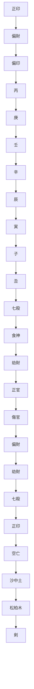
</details>

<table><tr><td>大運</td><td>流年</td><td></td></tr><tr><td>8歲</td><td>6歲</td><td>9歲</td></tr><tr><td>己</td><td>壬</td><td>乙</td></tr><tr><td>丑</td><td>戌</td><td>丑</td></tr></table>

事實：6歲（壬戌年）父死；9歲（乙丑年）母亡。

分析：年干丙火偏財剋月干庚金偏印；月柱納音木剋年柱納音土；月支空亡。顯然，年月兩柱架構不穩。丙火偏財父星坐辰水庫，通根月支空亡，偏財不強。6歲流年壬戌，沖剋年柱，壬水剋去丙火偏財，由此父亡。

再看印星，正印辛金在時干，坐丑墓庫。偏印庚金在月干遭年干丙火相剋。庚寅柱又在空亡。己丑運乙丑年，運歲出現丑庫，引辛金正印入墓；同時乙木合庚金，於是庚、辛金皆去，故此年母亡。

以上案例都有早年痛失椿萱的命理信息。

通過這些案例，我們基本上也能判斷：命主是先失去父親、還是先去失母親？這只要比較父星和母星在局中的旺衰情況就可以了。一般來說，衰者容易是先失去的那位。

命例 56：乾造 1974 年 10 月 12 日未時生。

<table><tr><td>偏印</td><td>偏印</td><td></td><td>正印</td></tr><tr><td>甲</td><td>甲</td><td>丙</td><td>乙</td></tr><tr><td>寅</td><td>戌</td><td>戌</td><td>未</td></tr><tr><td>偏印</td><td>食神</td><td>食神</td><td>傷官</td></tr><tr><td>比肩</td><td>正財</td><td>正財</td><td>劫財</td></tr><tr><td>食神</td><td>劫財</td><td>劫財</td><td>正印</td></tr></table>

事實：父親在10歲時亡故。

此八字取自戴惠俐《八字觀象實例詳解》。作者說：「全盤印旺，母持家，不見父星出干而藏庫中。火旺必熔金，且全盤火土極固，土旺亦埋金，一看就知道與父無緣，其父在十歲時亡故。」③

顯然，只要比較一下父星和母星在局中的強弱對比，就可以有基本的估量了。記得過去到盲師那裡去算命，他往往會問：「你18歲時，父母都健在嗎？」如果父母已經缺一的話，他完全可以通過推敲父母星的旺衰情況以及大運流年，把已故的那位失去的年份算出來。如此看來，明瞭了推理的線索，便推開了神秘的紗幕。

# 父母離異

還有一種情況，是父母離異。離異的原因自然是不和。八字中財印交戰是最主要的信息。

命例 57：坤造 1982 年 9 月 18 日亥時生。 $^{⑩}$   


<details>
<summary>text_image</summary>

合
偏印 正財 劫財
壬 己 甲 乙
戊 酉 辰 亥
偏財 正官 偏財 偏印
正官 劫財 比肩
傷官 正印
穿 合
大海水 大驛土
烈
大運 流年
14歲 16歲
丁 戊
未 寅
</details>

事實：命主16歲時，父母離異。

此八字月柱納音剋年柱納音，月干己土剋年干壬水，年支戌土又與月支酉金相穿，年月兩柱（父母宮）十分不穩。局中財印交戰，表示父母嚴重不和，最後終至離婚（命主16歲，1998年戊寅）。然而，我們看到，父星和母星都有根基，財星己土根於戌和辰，印星壬水通於亥祿辰庫，因此雙親都能安享天年。

命例 58：乾造 1984 年 10 月 29 日寅時生。 $^{11}$


<details>
<summary>text_image</summary>

偏印 偏印 偏財
甲 甲 丙 庚
子 戌 申 寅
正官 食神 偏財 偏印
正財 七殺 比肩
劫財 食神 食神
沖
庚祿 甲祿
海中金 山頭火
剎
</details>

事實：命主的父母在他小時候就離婚了。之後他爸爸因為做假鈔票被勞改兩年。自己小學也沒上幾年。

分析：八字年月天干兩甲偏印，通根寅祿，時干庚金偏財通根申祿，地支寅申相沖，構成全局財、印大戰。再加上月柱納音火剋年柱納音金，架構嚴重不穩。因此，早年父母就離異了。

# 父母高壽

下面是父或母高壽的情況：


<details>
<summary>text_image</summary>

正官
己
丑
正官
劫财
正印
比肩
壬
申
偏印
比肩
七殺
傷官
七殺
辛
辰
亥
食神
正印
</details>

這是我的一位老同學，是美國一所大學的教授。 $^{25}$ 他的媽媽生於1920年（庚申），今年四月才去世，已是97歲了。只有我同學80年代初離家赴美求學時，不在一起。到90年代初，他就把母親接去美國了。

考察八字，局中辛金正印很強健，從年支丑（金庫）到月支申金（秋令），一直到時干，跨越了四柱四個運限。四柱宮位也沒有沖剋的情況。這是母親長壽的徵兆。今年流年丁酉，丁火剋辛金正印，母親去世。八字中沒有財星，父親相對緣薄，去世得也早，是1985年（乙丑）去世的。

這裡值得注意的是，局中正印星跨越了四柱，就是沒有出現在日支。事實是，母親被接到美國時，他已經結婚，有了自己的家。母親僅在其家住了較短的時間，就搬進了當地政府的老人公寓。其母本是國內的英語教授，在老人公寓裡並不寂寞。我的老同學也十分孝順，幾乎天天去看她。

命例 60：坤造 1952 年 1 月 25 日辰時生。


<details>
<summary>text_image</summary>

劫財 劫財
辛 辛 庚 庚
卯 丑 午 辰
正財 正印 正官 偏印
傷官 正印 正財
劫財 傷官
</details>

這也是我的朋友的命造。她的媽媽是1913年出生，在2010年7月謝世，享年97歲。觀察其八字，正印母星當令，一直流至時支，沒有大的刑沖，故能長壽。她的父親則於1993年（癸酉年）過世。

前文曾談到過「比劫重重定剋父」，然而，還是要根據實際命局的情況來判定。例如：

命例 61：乾造 1952 年 9 月 23 日寅時生。


<details>
<summary>text_image</summary>

比肩 正官 比肩
壬 己 壬 壬
辰 酉 申 寅
七殺 正印 偏印 食神
傷官 比肩 偏財
劫財 七殺 七殺
合 沖
</details>

事實：父親長壽，享年84歲。

分析：這個八字雖然比劫重重，但年月兩柱沒有父星偏財，經過的大運也沒有偏財，而年干父位壬水根深蒂固，因此並沒有剋父現象發生，父親活到了84歲。

# 父母地位

命主的家庭出身和父母的條件，主要還是從八字年月兩柱來看。

一般來說，四「吉神」，即財、官、印、食，在年月透出，可以不論喜用，家庭出身都會不錯，父母的社會地位和經濟收入也都不錯。四「凶神」，即殺、傷、梟、劫，透露在年月天干上，這時就要注意觀察喜用了。若是命局喜用神，那麼家庭出生不錯；若不是喜用神，出身的家庭和父母條件就差強人意了。

請看以下案例：

命例 62：乾造（古案）  


<details>
<summary>text_image</summary>

正官 正印 偏印
乙 丁 戊 丙
卯 亥 午 辰
正官 偏财 正印 比肩
七殺 劫财 正官
正財
半木局
</details>

這是《滴天髓闖徵》之古案，評說是：「身出官家，連登科甲，生五子皆登仕籍，富貴福壽之造也。」此造年上正官，月上正印，官印相生。而且官印都有理會：乙木正官坐卯祿，丁火正印通根午祿。故出身官宦之家，也在情理之中。

命例 63：乾造 連戰 1936 年 8 月 27 日戌時生。台灣政治家，國民黨名譽主席。


<details>
<summary>text_image</summary>

合
正官 正官 正印
丙 丙 辛 戊
子 申 巳 戌
食神 劫財 正官 正印
傷官 劫財 比肩
正印 正印 七殺
半水局 合
</details>

丙、戊祿

連戰和他的父親連震東、祖父連橫，人稱「台南三連」，是中國近、現代史上的台灣望族。

連橫（1878～1936），晚清民初的一代大儒。他用十年時間撰寫成我國第一部台灣史籍《台灣通史》。連震東（1904～1986），曾任台灣「內政部」部長，「行政院」政務委員，「總統府」資政。

連戰（1936～），台灣政治家。芝加哥大學政治學博士學位。1990年台灣省主席。1993年任行政院院長。2001年6月17日，連戰當選國民黨主席，2005年卸任。

這個八字年月透出正官，表現出身不平凡，祖、父輩皆是名人。年月天干丙火正官和時干戊土正印，官印相生，而且都通根於日支巳火，巳火又為丙、戊之祿，真不失為是三代榮顯。

再看以下案例，這是我熟識的朋友，父母都是高級幹部：

命例 64：乾造 1955 年 1 月 11 日戌時生。


<details>
<summary>text_image</summary>

合
食神 正財 偏印
甲 丁 壬 庚
午 丑 申 戌
正財 正官 偏印 七殺
正官 劫財 比肩 正印
正印 七殺 正財
</details>

事實：其父是老革命，曾任某省省長。

分析：壬水生於冬日，首先需要陽暖。八字無丙火，但月干透出丁火，通根年支午祿。同時，年干有食神來生此丁火。丁火為用神，甲木為喜神。局中無偏財，以此正財為父星，且居父宮，故出身於高幹家庭。

# 與父母緣份

再談與父母的緣份。

命例 65：坤造 1952 年 6 月 16 日亥時生。


<details>
<summary>text_image</summary>

劫財 正財 比肩
壬 丙 癸 癸
辰 午 巳 亥
正官 偽財 正財 劫財
食神 七殺 正印 傷官
比肩 正官
沖
</details>

這也是我熟識的朋友。其父也是老革命，生於1911年，在2011年去世，享年100歲。我的朋友中年去美國學習和工作。待她父親到了耄耋之年時，她就回來侍奉左右，直到她父親百歲後安詳離去。

從命局看，父星偏財丁火於五月很旺。此火延伸到月干，也延伸到日支，圍住了日主。可見其父緣很深。雖然干透比劫，但偏財在月令地支，相安無事。相對而言，其正印母親在日支，遭時支亥水沖剋，母緣就差了些。母親是很疼愛她的，但在1993年（癸酉）去世。

下面這個命例是我朋友的兒子。他的父母在 1996 年（丙子）離婚，他跟著母親。自那時起再也沒有見到過父親：

<table><tr><td></td><td></td><td></td><td></td><td>大運</td><td>流年</td></tr><tr><td></td><td></td><td></td><td></td><td>15歲</td><td>17歲</td></tr><tr><td>正印</td><td>比肩</td><td></td><td>傷官</td><td></td><td>1996年</td></tr><tr><td>己</td><td>庚</td><td>庚</td><td>癸</td><td>戊</td><td>丙</td></tr><tr><td>未</td><td>午</td><td>申</td><td>未</td><td>辰</td><td>子</td></tr><tr><td>正印</td><td>正官</td><td>比肩</td><td>正印</td><td></td><td></td></tr><tr><td>正官</td><td>正印</td><td>食神</td><td>正官</td><td></td><td></td></tr><tr><td>正財</td><td></td><td>偏印</td><td>正財</td><td></td><td></td></tr><tr><td colspan="6">合</td></tr></table>

事實：17 歲父母離異後，再沒有見到過父親。

分析：命局中印星旺、比劫旺，而沒有父星偏財。以乙木正財看父，乙木在年支未墓中，且與月支午六合，此墓閉鎖，故父星甚弱。

父母離婚在 1996 年丙子，此時其大運在戊辰。大運戊土印星很旺，流年丙子又與月柱（父母宮）天剋地沖，因此家庭發生變故，自此跟隨母親，再沒有見過生父，可謂父緣甚淺。

還有一個命造，此命例早出生60年，與此八字僅相差幾個時辰。命主是15歲喪父。

<table><tr><td></td><td></td><td></td><td></td><td>大運</td><td>流年</td></tr><tr><td></td><td></td><td></td><td></td><td>10歲</td><td>15歲</td></tr><tr><td>正印</td><td>比肩</td><td></td><td>七殺</td><td></td><td>1934年</td></tr><tr><td>己</td><td>庚</td><td>庚</td><td>丙</td><td>己</td><td>甲</td></tr><tr><td>未</td><td>午</td><td>申</td><td>戌</td><td>巳</td><td>戌</td></tr><tr><td>正印</td><td>正官</td><td>比肩</td><td>偏印</td><td></td><td></td></tr><tr><td>正官</td><td>正印</td><td>食神</td><td>劫財</td><td></td><td></td></tr><tr><td>正財</td><td></td><td>偏印</td><td>正官</td><td></td><td></td></tr></table>

事實：命主 15 歲喪父。

分析：此命造與前例只差三個時辰，但大運起始時間不同。八字中唯一乙木正財在年支未墓中，父緣之淺顯而易見。15歲時，大運已經入巳運。巳與年支未、月支午匯成南方火；加上流年甲戌，甲木合年干己土，戌土刑年支未土；未中父星（唯一財星）去矣。

在現代命書中看到議論孝敬父母的命例，這裡摘引兩則：

命例 68：乾造 1952 年 3 月 22 日申時生。


<details>
<summary>text_image</summary>

正官 七殺 傷官
壬 癸 丁 戊
辰 卯 卯 申
傷官 偏印 偏印 正財
偏印 正官
七殺 傷官
穿 暗合
</details>

事實：生性節儉，但孝敬父母，可以傾囊，是遠近聞名的孝子。

劫財 偏財 正財

<table><tr><td>己</td><td>壬</td><td>戊</td><td>癸</td></tr><tr><td>酉</td><td>申</td><td>午</td><td>丑</td></tr></table>

傷官 食神 正印 劫財

偏財 劫財 正財

比肩 傷官

事實：極不孝順，置父母生活於不顧，只圖自己享受。

對於此兩造的分析是：前者五行俱全，干支流通，相互制約，剋父之物不見，剋母之物勢弱；後者劫與財交戰，偏財根深，日主奈何又剋之不盡。可見，孝敬父母的命造大多五行分佈均勻，趨勢有利於父母；不孝順的命造，常以比多剋父而父有根，財多剋母而母得身旺，由於這種交戰狀態的出現，反映出當事人往往不夠孝順的性情。這種情形有時還以日柱與月柱、年柱的相沖表現出來。

# 附：

# 1. 斷父死亡訣：

比劫重重雖剋父，不見偏財命也固。

歲運要遇偏財來，父親必上黃泉路。

偏財入墓又逢沖，歲運逢墓父壽終。

天剋地沖見偏財，父亡之時定會來。

年干受剋父先死，年食月梟父早埋。

年柱納音被月剋，歲運再傷父死埋。

# 2. 斷母死亡訣：

財星重重雖剋母，不見印綬不用哭。

歲運若逢印綬來，快為母親備棺材。

印綬臨墓又逢沖，母親進入棺材中。

天剋地沖見印綬，母病華佗也難救。

年支受沖母早亡，年印月財母必傷。

官殺死絕財特旺，歲運逢之母亡期。

四柱印旺財星衰，旺極歲運母死埋。

# 註釋

①《八字命理學基礎教程》第十一章「六親的推導」一節。  
② 取自藍傳盛：《八字實務研究》，第132頁。  
③ 取自《盲派大師夏仲奇命學精粹》，第15頁。  
④ 取自星雲山人：《八字用神流年點斷真訣》，第103頁。  
⑤ 取自曲煒：《六親命例集》，第53頁。  
⑥ 取自《八字實務研究》，第99頁。  
⑦ 取自《八字實務研究》，第 105 頁。  
⑧ 取自《盲派大師夏仲奇命學精粹》，第 18 頁。  
⑨《八字觀象實例詳解》，第262頁。  
10 取自曲煒：《六親命例集》，第 163 頁。  
1 取自曲煒：《六親命例集》，第 164 頁。  
⑫《八字命理學基礎教程》，第280頁。


<details>
<summary>flowchart</summary>


</details>

# 第六章

# 婚姻分析（男）

# 星宮概説

古命書中，男命以十神中的正財星為妻，偏財星為妾。因為在古代，有地位、有錢的人可以納妾。納妾，即娶小老婆也。今天，時代進步了，男女地位平等了，婚姻法上也規定了一夫一妻制。故從法律上講，只有妻而沒有「妾」了。「妾」只是一個歷史名稱，留在歷史的塵埃中。當然，命局中如果沒有正財，則可以視偏財為妻。但命局中有正、偏財雜出的話，這時，可以把偏財看作是有情感上聯繫的女性朋友了。

然而，近二十多年來，經濟大潮在國內洶涌澎湃，「妾」也隨著拜金主義思潮而應運復生，不過它的現代名稱是「二奶」、「小三兒」，不一而足。社會形態的某些方面又以新的面貌回復到古命理的規範中，不禁令人唏噓。

我們先從下圖中來看男命「我」和財星（妻）以及其他星的關係：

圖 6.1 男命妻星關係  


<details>
<summary>flowchart</summary>

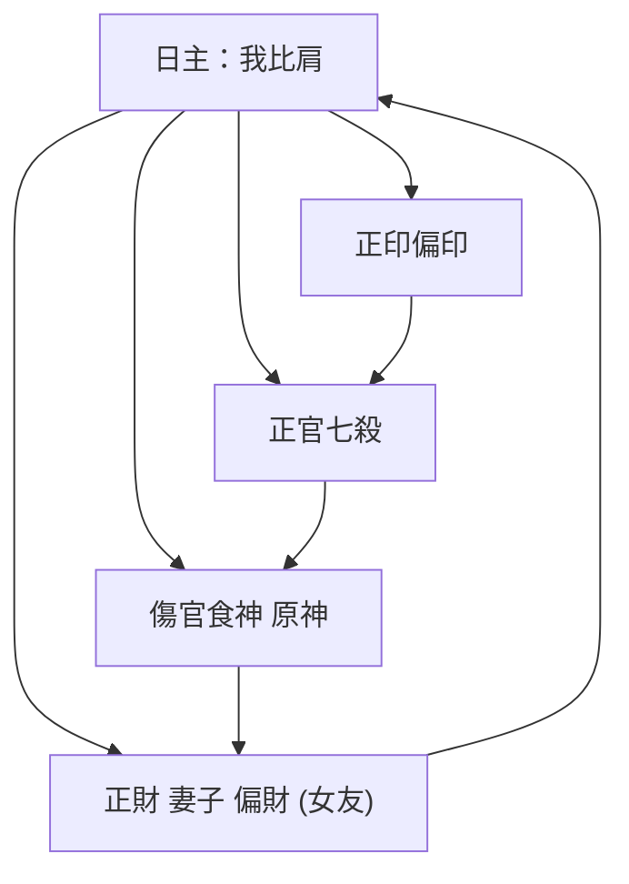
</details>

從圖中可以觀察到，財星是「我」所剋的十神，包括正財和偏財。也就是說，比肩、劫財與財星是對立的。在八字框架裡，妻子或情感上的女友，都是「我」剋的對象。

為什麼要把妻子設置為丈夫所剋的對象？也許從陰陽和夫婦之道來講，在合體交歡的時候，總是男方「剋入」女方，故男命以我剋者（財星）為妻，女命以剋我者為夫（官星）。這是合乎自然法則的。

再進一步觀察，如果比劫旺——「我」旺，財星弱，這時要考慮到傷官、食神的作用。傷官、食神是財星的原神（注意：不是原身），因為傷食星是生財星的。傷食可以通過生財星而增加財星的力量。同時，傷食還可以消耗比劫的能量，緩解比劫與財星的對立。因為比劫生傷食，傷食生財星，比劫就「貪生忘剋」了。這是從上圖右側相生的路線上來講的。此外，財星所生的正官、七殺，也是財星的保護神。因為官殺星可以剋制比劫，也就是命理上所說的「子來救母」。

反過來，「我」弱——比劫弱，財星旺，則需印星來幫助日主，以及比劫星的自助，才能保持我和財星的平衡。這是五行生剋關係。八字命理原本是關於平衡的哲學。這是總體認識。

談戀愛，主要觀察財星的動靜和位置。所謂位置，是指在命局四柱中的位置。四柱內的運限，反映了在時間序列上不同的人生階段。財星出現在年柱，戀愛較早；出現在月柱，正是青年時期，也是正常的戀愛時期；出現在日柱或時柱，就相對較晚了。當然，也要考慮大運、流年出現財星的情況。

然而，論婚姻，則要注意宮位了。男女命都以日支為夫妻宮，因為日支是日干「我」的坐支，關係最親近。談婚論嫁，就要看宮位了。夫妻生活的穩定和幸福，更要看宮位了。

對男命來說，妻宮要安靜，不見刑沖破害，則夫妻和順，婚姻穩定。無論身強身弱，男命還是喜妻星在妻宮，不要到處游走，這樣有家庭的歸屬感。當然，身旺，財星為喜，財居妻宮，妻賢守家，賢內助也；即使身弱，財星為忌，妻星在位，仍然有歸屬感。如果自己有好運輔助，有官印化解，依舊可以有較美滿的婚姻生活。

這是男命婚姻情況星、宮的概說。

# 戀愛觀

接下來談談男命對戀愛與婚姻的看法。

一般來說，以正財為妻的男命，喜歡端莊賢淑、治家有方的女人。因為正財在八字中本身具有節儉、穩重的特徵。而以偏財為妻的男人，則喜歡冶豔風騷的女人。因為偏財帶有更多的情慾衝動，激情、瀟灑，風情萬種，引人注目。

朱鶴橋先生曾談到男性的戀愛與「眼緣」有關。他是從命理中日主天干之合出發的：①

表 6.1 男命日主「眼緣」

<table><tr><td rowspan="2">甲己合</td><td>甲人喜歡豐腴、淳厚、有真才實學,外表樸實無華,有內在美的賢內助;</td></tr><tr><td>己人喜歡身材高大、落落大方、心地善良,而工作能力強、可以助丈夫一臂之力的女性。</td></tr><tr><td rowspan="2">乙庚合</td><td>乙人喜歡清秀、潔白、剛直、正派而帶有男子味道的事業型女強人;</td></tr><tr><td>庚人喜歡柔弱、溫順、清秀、文靜、不卑不亢的賢妻良母型。</td></tr><tr><td rowspan="2">丙辛合</td><td>丙人喜歡衣履講究、瀟灑脫俗、矜持自重的帶刺的玫瑰;</td></tr><tr><td>辛人喜歡個性率直、見義勇為、熱情奔放、甚至熱力逼人的火球。</td></tr><tr><td rowspan="2">丁壬合</td><td>丁人喜歡矯健、敏捷、豪邁、像運動家似的海上飛魚;</td></tr><tr><td>壬人喜歡溫柔體貼、富同情心、心思細、能力強、可以內外兼顧的左右手。</td></tr><tr><td rowspan="2">戊癸合</td><td>戊人喜歡情調、有藝術修養、小鳥依人、柔情似水的名門淑女;</td></tr><tr><td>癸人喜歡忠誠老實、穩重可靠、不愛出風頭願意坐鎮家中的家庭主婦。</td></tr></table>

事實上，這是一種由命局日主決定的求偶的心理傾向，僅供參考。

但戀愛與婚姻終究不是一回事。戀愛可以講情調，講「眼緣」，講浪漫，婚姻則是實在的終身大事，有許多社會因素參雜進來，比如學歷、職業、出身家庭、經濟收入、甚至宗教等等。因此，世間有緣無份、有份無緣的情況都大有人在。最後常常是：「此情可待成追憶，只是當時已惘然。」

# 比財對立

根據上文圖 6.1，男命戀愛和婚姻的主線是財星與比劫的關係；因此，要尋求和解讀這方面信息，不能不抓住這條主線。在適婚的年齡段裡，抓住這條主線可以細察到戀愛和婚姻的基本線索。

命例 70：乾造 1970 年 11 月 9 日（農曆 10 月 11 日）早子時生。美髮店業主。 $^{②}$


<details>
<summary>text_image</summary>

合
正印 偏財 劫財
庚 丁 癸 壬
戊 亥 巳 子
正官 劫財 正財 比肩
偏印 傷官 正印
偏財 正官
沖
祿
大運
10歲 20歲
戊 己
子 丑
</details>

流年

<table><tr><td>20歲</td><td>22歲</td><td>23歲</td><td>24歲</td><td>26歲</td><td>27歲</td><td>28歲</td></tr><tr><td>正印</td><td>劫財</td><td>比肩</td><td>傷官</td><td>正財</td><td>偏財</td><td>正官</td></tr><tr><td>庚</td><td>壬</td><td>癸</td><td>甲</td><td>丙</td><td>丁</td><td>戊</td></tr><tr><td>午</td><td>申</td><td>酉</td><td>戌</td><td>子</td><td>丑</td><td>寅</td></tr></table>

事實：出生農村，20歲已丑運始有女友。22歲（壬申）女友嫌他窮，漸行漸遠。23歲（癸酉）丁巳月，女友另結新歡走了。

24 歲（甲戌）乙亥月結婚。26 歲（丙子）夫妻不和。97 年（丁丑）丙午月，妻子挨命主打後出走；壬子月，妻子正式交男友。妻子走後，他與自己店裡的女子交往。98 年（戊寅）癸亥月命主與原妻離婚，重新結婚。

分析：此造癸水日主，生於亥月，時柱壬子，身強。查看財星：丁火偏財透出月干，年支戌為火庫，日支妻宮巳中有丙火正財。然而，丁火與時干壬水遙合，妻宮遭月支亥水直沖，財星和妻宮都不穩定。命局最大的問題是水火相戰，無木通關。先天就埋下了婚姻不穩定的潛在因子。

按照財星在命局中出現的位置來看，年支戍庫中藏有丁火偏財，月柱上又透出丁火偏財，可以判斷戀愛較早。但20歲前子水比肩大運不利於財星，故沒有交女朋友。20歲起，走大運己丑，己土七殺制水，丁火偏財居月干，始有女朋友。

22 歲壬申，壬「激活」時干壬水，合去丁火偏財，女友已有離心；23 歲癸酉，癸水比肩直接剋去丁火，女友離去。24 歲甲戌，甲木傷官能化水生火，緩解了比劫對財星的剋制；甲又合大運己土，能發揮干頭制水功能；戌土再「激活」年支，剋制月支亥水，使妻宮得以穩定，於是財星能「浮現」出來，故能結婚，完成終生大事。

但好景不長，26歲丙子，夫妻間出現裂紋。丙火正財露出天干，出自妻宮（已為丙祿），正好遭壬水相剋，何況丙火坐在子水上，自然婚姻出問題了。27歲丁丑，丁火又露，壬水再來合去；地支會成亥子丑北方水，動搖妻宮巳火，發生夫妻離異。

28 歲戊寅，天干戊癸合，地支寅亥合，合則有情；同時戊土得制壬水，亥逢合，妻宮巳火得到安寧。於是，去舊迎新，開始新的婚姻。

這裡也反映了財星與比劫的對立，男命的婚變往往發生在比劫或財星之年。同時，財星不宜孤露，逢比劫無通關的話，婚姻基礎較難穩定；妻宮不宜逢沖，尤其妻宮已經坐了財星，更要安寧。安寧才能長相厮守。

再看下面案例：

命例 71：乾造 $^{③}$   


<details>
<summary>text_image</summary>

合 合
比肩 正財 比肩
庚 乙 庚 庚
午 酉 子 辰
正官 劫財 傷官 偏印
正印 正財
傷官
沖 半水局
陽刃
</details>

事實：此人從小談過一次戀愛。但被女方家長反對，並強迫女方另嫁他人。此女堅決不從而自殺身亡。命主為感女方真情，至今尚未娶妻，孤身一人。

分析：這真是一個淒婉的愛情故事。命造中比肩重重，正財乙木在月柱孤露，遭庚金合剋。再加上正財坐庚金之陽刃，真是無可逃遁。妻宮還遭年支午火遙沖，可能會終身無妻。（辰中有乙木財星，但子辰合，辰酉遙合，去財星。且辰屬晚年。）

命例 72：乾造 1933 年 10 月 3 日（農曆八月十四日）卯時生。 $^{4}$


<details>
<summary>text_image</summary>

劫財 正印 劫財
癸 辛 壬 癸
酉 酉 寅 卯
正印 正印 食神 傷官
偏財
七殺
</details>

事實：終身沒有結婚。

分析：局中印星、劫財星重重，而妻星太衰弱，僅在寅木藏遁中有一點丙火偏財星，也遭鄰近酉金（辛）相牽絆，所以較難步入婚姻之路。

# 身不宜太弱

在以上的兩個命例中，都是命主身旺。身太旺，財星自然就弱。日主太強的人，容易以自我為中心，妻子處在從屬地位，時間長了，即使心無去意，憂也會傷人，其結果是妻子多病，甚至短命。這是身旺財弱可能發生的常情。

反過來，如果身弱財旺呢？

書云：「身弱財多，財為忌神，家貧妻惡，懼內之人也。」這裡把「家貧」與「妻惡」劃等號，其實並不妥當。「財重身弱，若再行財運，肯定是窮光蛋了。一個人窮到『無以為家』的時候……即使老婆不惡，自己也氣餒。」 $^{②}$ 因此，男命財重時，身不宜太弱。

真正可能成為「妻惡」的，是財重身弱再加上七殺透出。這個時候，財生官殺，官殺可以直接剋身，日主就無法躲避了。在《胡一鳴命例實錄》中有一則題為「頻頻嘆氣」的案例：

命例 73：乾造 1978 年 7 月 29 日（農曆 6 月 25 日）酉時生。

# 大運

23歲

七殺 正官 正官

2001年

戊己壬己

壬

午 未 辰 酉

戌

正財 正官 七殺 正印

正官 正財 傷官

傷官 劫財


胡先生說，2004年（甲申）命主和女友一起到他那兒算命，此人給他最深的印象就是頻頻嘆氣——「是沒有自信，活得很累的人」。後來此人打電話給胡先生詢問感情，還沒開口就「唉」一聲。胡先生問：「是不是昨天（丁亥）和前天（丙戌）給女友欺負？」他又「唉」了一聲說：「是。」

這個命例日主身弱，財生官殺重重透干，尚未結婚已經被女友「壓」得哀聲嘆氣了！真要是結了婚，日子怎麼過？不過胡先生問得真是十分到位啊。

# 偏正雜出

在命理分析中，一般都喜歡十神星要單純，即正官不要混雜七殺，正印不要混雜偏印，傷官不要混雜食神，比肩不要混雜劫財，這就是所謂「清」。反之，則容易陷入「濁」的境地。唯有對於財星，似乎放寬一些。怎麼說財也是日主所剋的東西。然而，在戀愛和婚姻上，正財和偏財雜出，卻帶來重要的信息。

曾算過下面一個八字，命主是我一位好友的朋友，是內地成功的一位房地產商：

命例 74：乾造 1952 年 2 月 23 日辰時生。房地產商。


<details>
<summary>text_image</summary>

合
偏財 正財 偏印
壬 癸 戊 丙
辰 卯 辰 辰
比肩 正官 比肩 比肩
正官 正官 正官
正財 正財 正財
穿 穿 刑
</details>

我看了八字後對他說：「你是雙妻之命。在過去時代，你會有兩個太太。」他回答說：「我現在就有兩個太太。」原來他是澳門身份。大太太生有一女；小太太生有一女一子，似乎兩房太太之間尚且和睦。

為什麼我會這麼斷的呢？從八字看，此命造偏、正財天干雜出，地支妻宮雙顯，即日支辰，時支也是辰，而自身並不弱。因此做出了這樣的判斷。

事實上，即使不是偏、正財雜顯，兩個正財或兩個偏財同時顯露在天干上，都有可能出現雙妻的情況。請看下面這個命例 $^{①}$ ：

命例 75：乾造 1963 年 11 月 21 日辰時生。


<details>
<summary>flowchart</summary>

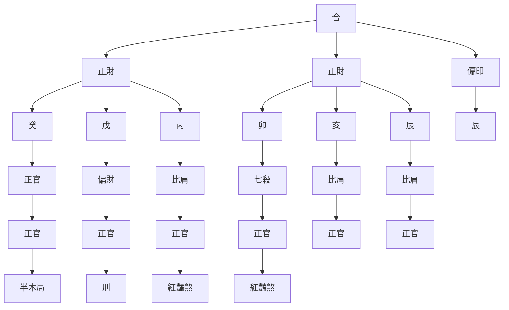
</details>

事實：本造未婚前已風流異常。婚後仍繼續與舊時女友同居。

分析：日主自身可稱不弱，年月天干上雙透正財，都與日主相合；地支又妻宮兩顯——辰、辰，因此婚後仍與婚前的女友同居，是事實上的「雙妻」現象。

以上兩例都是自身不弱的情況。如果自身弱的狀況下，偏正財雜透，則會貧而多淫。《命運推算法則與操作》（2）中有這樣一個「婚外情」的案例：

大運

<table><tr><td>正財</td><td colspan="2">偏印</td><td>偏財</td></tr><tr><td>癸</td><td>丙</td><td>戊</td><td>壬</td></tr><tr><td>未</td><td>辰</td><td>申</td><td>子</td></tr><tr><td>劫財</td><td>比肩</td><td>食神</td><td>正財</td></tr><tr><td>正印</td><td>正官</td><td>偏財</td><td></td></tr><tr><td>正官</td><td>正財</td><td>比肩</td><td></td></tr></table>

作者指出：「本造本來是比星秉令，但申子辰財局得壬癸為引，於是成化。……應以身弱論之。本造地支多合，而且是會成財局，天干財星偏正混雜而均有根，好色的基因已顯露無遺。」「運入癸丑，癸（財）來合日主，戀愛結婚。但丑運子丑合比成化，於是夫妻失和。流年癸丑，伏吟大運，二癸（財）爭戊（日主），第三者加入。妻子大為不滿，二丑又合入時柱，女友懷孕得子，於是陷入進退兩難的境地。」

作者繼續說：「本造命無官星，老婆無力管束，沒奈他何。不過壬子、辛亥二十年窮運。即使妻子啞忍，沒有下堂離去，但身弱重財入命，如斯窮窘，怎養得起兩頭住家！」 $^{2}$

財旺身弱，再走財運，看來命主日子是很難過了。

# 妻宮動靜

接著要談到妻宮了。判斷婚姻狀態，妻宮是一個重要環節，因為這是家庭的居所。

首先是婚期。

人出生的時候，是沒有婚姻事實的。戀愛和婚姻的出現，至少要到命主生理上性成熟的時候。因此，婚姻是改變原先的夫妻宮狀態。從邏輯上講，婚期應該是大運和流年引起夫妻宮動靜狀態發生變化的時候。所以，看婚期，主要觀察夫妻宮在大運、流年的影響下，原狀態是否出現了變動？出現變動了，在未婚的情況下，可能就是婚期到了。這是合乎生活邏輯的。 $^{②}$

命例 77：乾造 1973 年 9 月 24 日辰時生。

<table><tr><td>食神</td><td>比肩</td><td></td><td>傷官</td><td>大運</td><td>流年</td></tr><tr><td>癸</td><td>辛</td><td>辛</td><td>壬</td><td>22歲</td><td>25歲</td></tr><tr><td>丑</td><td>酉</td><td>亥</td><td>辰</td><td>戊</td><td>戊</td></tr><tr><td>偏印</td><td>比肩</td><td>傷官</td><td>正印</td><td>午</td><td>寅</td></tr><tr><td>食神</td><td></td><td>正財</td><td>偏財</td><td></td><td></td></tr><tr><td>比肩</td><td></td><td></td><td>食神</td><td></td><td></td></tr><tr><td colspan="2">半金局</td><td>合</td><td></td><td></td><td></td></tr></table>

事實：1998年（戊寅）結婚。

分析：此命造中，妻宮亥水是安靜的狀態。大運戊午，午亥暗合有情。流年戊寅，寅為命主之正財星（妻星），合入妻宮，是年結婚。這是「靜」中有「動」，發生相合，狀態發生了變化。

命例 78：乾造 1972 年 7 月 5 日卯時生。

<table><tr><td>正官</td><td>劫財</td><td>七殺</td><td>大運</td><td>流年</td></tr><tr><td>壬</td><td>丙</td><td>丁</td><td>21歲</td><td>28歲</td></tr><tr><td>子</td><td>午</td><td>酉</td><td>己</td><td>庚</td></tr><tr><td>七殺</td><td>比肩</td><td>偏財</td><td>酉</td><td>辰</td></tr><tr><td></td><td>傷官</td><td></td><td></td><td></td></tr><tr><td></td><td>沖</td><td>沖</td><td></td><td></td></tr></table>

事實：2000年（庚辰）結婚。

分析：命造28歲在大運酉金，酉為偏財，指向妻宮，也就是說，這個大運時段命主可能有與婚姻相聯繫的事情發生。八字中無正財，以偏財為妻星。妻星坐妻宮。但卯酉沖，妻宮不安寧。流年庚辰，庚為財星，辰酉合，辰載財星合入妻宮。妻宮由沖變合，狀態發生了變化，這是結婚的應期到了。

事實上，對於現代人來說，預測婚期已不是一件容易的事了。

台灣命理家胡一鳴說：

算命只是一種分析，我們實在沒有辦法肯定，他會什麼時候戀愛，什麼時候結婚。比如，古代的人，在13歲到16歲之間就結婚了，女子超過17歲還未找到婆家，爸媽就要操心了。現在30歲還未婚都屬於很正常。因此，看現代人的婚姻非常困難，看古人只需在13歲到17歲之間找到可能性較高的年、月即可，範圍較小，準確度很高。現代人從14歲到40多歲都有可能。異性朋友交換過無數任，老早有夫妻之實了，但說起來都還是單身。 $^{③}$

這的確是實話。因為結婚期古今有差別了。不過，還是有一定的信息可以窺見。

曲煒在《婚姻感情命例集》裡提供了一條經驗：「在結婚年齡段，往往印星與配偶星（男財女官殺）相組合相感應是結婚年、領結婚證之年！」因為印星之象是文書，可以代表結婚證，感應到夫妻星、宮，可以看作領了結婚證，是法律上的婚期實現之時。

<table><tr><td rowspan="2"></td><td rowspan="2" colspan="4">合</td><td>大連</td><td>流年</td></tr><tr><td>25歲</td><td>25歲</td></tr><tr><td>偏財</td><td colspan="2">正財</td><td colspan="2">正印</td><td></td><td>正印</td></tr><tr><td>丙</td><td>丁</td><td>壬</td><td colspan="2">辛</td><td>庚</td><td>辛</td></tr><tr><td>戊</td><td>酉</td><td>寅</td><td colspan="2">丑</td><td>子</td><td>亥</td></tr><tr><td>七殺</td><td>正印</td><td>食神</td><td colspan="2">正官</td><td></td><td>壬祿</td></tr><tr><td>正印</td><td></td><td>偏財</td><td colspan="2">劫財</td><td></td><td></td></tr><tr><td>正財</td><td></td><td>七殺</td><td colspan="2">正印</td><td></td><td></td></tr></table>

事實：1971年（辛亥）結婚。

分析：流年辛亥，亥是日主壬水之祿，表示命主之身體，亥合入妻宮寅，寅中有食神和財星，因此為結婚的應期。亥上帶辛金正印，印為文書，故曲煒先生說：「流年干是印星，是有證的性接觸！所以此年結婚。」

其次，是婚姻的穩定與否？

婚姻的穩定和美滿，跟妻宮的安定，不受刑沖破害的影響有關。例如：

命例 80：乾造 1954 年 9 月 29 日巳時生。 $^{⑩}$


<details>
<summary>text_image</summary>

七殺
正財
甲
癸
戊
丁
午
酉
子
巳
正印
傷官
正財
偏印
劫財
食神
比肩
</details>

這是一個婚姻美滿的八字。 $^{①}$ 如果詳加分析，可以有以下幾點：

第一，妻守妻宮。妻星為局中喜用。第二，妻宮安靜。第三，日支子水正財與日干戊土上下相合有情。第四，妻星癸水透出月干，又與日主相合有情。第五，正財星坐月支酉地，得酉金相生有力。

總之，妻星、妻宮皆有情有力。

再看下面的命例：

命例 81：乾造 1954 年 12 月 31 日酉時生。


<details>
<summary>text_image</summary>

七殺 正印 傷官
甲 丁 戊 辛
午 丑 子 酉
正印 劫財 正財 傷官
劫財 正財
傷官
合
</details>

事實：妻有外遇。

分析：「原局財星坐妻宮，與月支丑土相合成忌土，妻有外遇。」 $^{②}$ 這是說，當妻星與旁支相合，所合成忌，表示妻有外情。事實上，這是因合而妻星游走到外面去了。可見，妻宮需要安定，有時也怕合會的影響。再如：

命例 82：乾造 1970 年 3 月 20 日丑時生。 $^{⑧}$ 

<table><tr><td></td><td></td><td></td><td></td><td colspan="2">大運</td><td>流年</td></tr><tr><td></td><td></td><td></td><td></td><td>25歲</td><td>35歲</td><td>37歲</td></tr><tr><td>傷官</td><td>比肩</td><td></td><td>七殺</td><td></td><td></td><td>2007年</td></tr><tr><td>庚</td><td>己</td><td>己</td><td>乙</td><td>壬</td><td>癸</td><td>丁</td></tr><tr><td>戊</td><td>卯</td><td>亥</td><td>丑</td><td>午</td><td>未</td><td>亥</td></tr><tr><td>劫財</td><td>七殺</td><td>正財</td><td>比肩</td><td></td><td></td><td></td></tr><tr><td>食神</td><td></td><td>正官</td><td>偏財</td><td></td><td></td><td></td></tr><tr><td>偏印</td><td></td><td></td><td>食神</td><td></td><td></td><td></td></tr><tr><td colspan="4">合 半木局</td><td></td><td></td><td></td></tr></table>

事實：2007年（丁亥）離婚。

分析：命局中月支卯與日支亥合半局，亥有被合去（水生木）的潛在的不穩定因素。大運在癸未（始於2005年），財星透出，遭到命局月干己土之剋，蘊含了婚姻的曲折；同時，大運地支與命局地支出現亥卯未合局，也影響了妻宮。37歲流年丁亥，丁是印星，亥指向了妻宮，亥亥自刑，於是發生婚變，命主是年離婚。亥中妻星離去了。

命例 83：乾造 1952 年 6 月 2 日卯時生。 $^{4}$ 

<table><tr><td></td><td></td><td></td><td></td><td>大運</td><td>流年</td></tr><tr><td></td><td></td><td></td><td></td><td>31歲</td><td>36歲</td></tr><tr><td>正財</td><td>七殺</td><td></td><td>偏印</td><td></td><td>1998年</td></tr><tr><td>壬</td><td>乙</td><td>己</td><td>丁</td><td>己</td><td>戊</td></tr><tr><td>辰</td><td>巳</td><td>卯</td><td>卯</td><td>酉</td><td>辰</td></tr><tr><td>劫財</td><td>正印</td><td>七殺</td><td>七殺</td><td></td><td></td></tr><tr><td>七殺</td><td>傷宮</td><td></td><td></td><td></td><td></td></tr><tr><td>偏財</td><td>劫財</td><td></td><td></td><td></td><td></td></tr></table>

事實：1998年（戊辰）命主喪妻。

分析：年干正財壬水坐年支辰水庫，局中財星弱。同時，日支卯為妻宮，時支又是卯，為妻宮雙顯。已酉大運，酉合辰庫；酉沖剋妻宮卯木（此八字妻宮雙顯），顯示了大運的關注點是對妻宮的影響。36歲流年戊辰，戊土劫財剋去年干壬水正財，辰土刑年支辰庫，穿妻宮卯木，故而此年喪妻。

這裡提一下「盲派」對結婚變化時間前後的看法。段建業在《段氏理象學》裡舉了下面一個「多婚男命」的案例 $^{16}$ ：

命例 84：乾造  


<details>
<summary>text_image</summary>

比肩 偏財  傷官
乙 己 乙 丙
巳 卯 亥 戌
傷官 比肩 正印 正財
正官 劫財 七殺
正財 食神
半木局
合
沖
</details>

段先生分析說：「從原局看，已為第一個妻子（已亥相沖與妻宮關聯），坐在比肩下，跟別人跑了；第二個妻子是月令己土財星，也坐在比肩之上，跟別人相好，也離了；第三個妻子是戌土財星，戌土也合比肩卯，故第三個妻子也會跟別人好，事實上也離了。」

他的結論是：「從此例中可以看出，從年到時表示婚姻時間次序，而不一定特指哪一個年齡段。」

這樣的指稱和處理的方法可以引為參考。

但也可以從另一個角度看，天干偏財見比肩，妻星遭剋；地支亥卯合，巳亥隔位沖，妻宮沖合俱見，妻宮也不穩，所以命造多婚變。

# 妻星入墓

一般而言，命局中妻星入墓，命主較難得到女人的垂青，故婚姻較晚。

命例 85：乾造 1972 年 4 月 16 日未時生。


<details>
<summary>flowchart</summary>

```mermaid
graph TD
    A["正官"] --> B["合"]
    C["正印"] --> B
    D["比肩"] --> B
    E["壬"] --> F["甲"]
    G["子"] --> H["辰"]
    I["丑"] --> J["未"]
    K["七殺"] --> L["傷官"]
    M["偏印"] --> N["食神"]
    O["七殺"] --> P["比肩"]
    Q["七殺"] --> R["偏財"]
    S["半水局"] --> T["沖"]
    U["合"] --> V["合"]
```
</details>

大運

<table><tr><td>6歲</td><td>16歲</td><td>26歲</td><td>36歲</td><td>46歲</td><td>56歲</td></tr><tr><td>乙</td><td>丙</td><td>丁</td><td>戊</td><td>己</td><td>庚</td></tr><tr><td>巳</td><td>午</td><td>未</td><td>申</td><td>酉</td><td>戌</td></tr></table>

事實：年輕時婚姻挑剔，婚姻未成。現已近不惑，恐難成婚。

分析：此命造身弱，唯一財星在妻宮丑墓中。丑未沖，開庫，應該有機會。但因為命主挑剔，錯失了機會。從另一個角度講，財星埋藏較深，而干透丁火比肩，即使妻財出墓，也易被剋去。因此，很難有比較順利的婚姻機會。

# 郁達夫八字賞析

下面我們來分析現代著名作家郁達夫的命造，以及他浪漫的感情生涯。

命例 86：乾造 郁達夫 1896 年 12 月 7 日子時生。現代著名作家。

大運

<table><tr><td>食神</td><td colspan="2">七殺</td><td>比肩</td><td>10歲</td><td>20歲</td><td>30歲</td><td>40歲</td></tr><tr><td>丙</td><td>庚</td><td>甲</td><td>甲</td><td>辛</td><td>壬</td><td>癸</td><td>甲</td></tr><tr><td>申</td><td>子</td><td>午</td><td>子</td><td>丑</td><td>寅</td><td>卯</td><td>辰</td></tr><tr><td>七殺</td><td>正印</td><td>傷官</td><td>正印</td><td></td><td></td><td>桃花</td><td></td></tr><tr><td>偏印</td><td></td><td>正財</td><td></td><td></td><td></td><td></td><td></td></tr><tr><td>偏財</td><td></td><td></td><td></td><td></td><td></td><td></td><td></td></tr><tr><td>半水局</td><td></td><td>沖</td><td>沖</td><td></td><td></td><td></td><td></td></tr><tr><td>驛馬</td><td></td><td>紅豔煞</td><td></td><td></td><td></td><td></td><td></td></tr><tr><td>絕</td><td>沐浴</td><td>死</td><td>沐浴</td><td></td><td></td><td></td><td></td></tr></table>

流年

<table><tr><td>25歲</td><td>31歲</td><td>32歲</td><td>42歲</td><td>44歲</td><td>45歲</td><td>47歲</td><td>49歲</td></tr><tr><td>辛</td><td>丁</td><td>戊</td><td>戊</td><td>庚</td><td>辛</td><td>癸</td><td>乙</td></tr><tr><td>酉</td><td>卯</td><td>辰</td><td>寅</td><td>辰</td><td>巳</td><td>未</td><td>酉</td></tr></table>

郁達夫（1896～1945），浙江富陽人，中國現代著名小說家、散文家、詩人。精通五門外語。曾經與徐志摩作為同班同學。曾與魯迅創刊合編《奔流》。

郁達夫是民國時代著名作家，五四後新文學團體創造社的發起人之一，一個偉大的愛國者。然而，郁達夫更是一個風流才子，先後有三位妻子和兩位情人。他的詩句：「曾因酒醉鞭名馬，生怕情多累美人！」或許是他自己風流才情的畢生寫照。

事實：1921年（25歲辛酉），與家鄉才女孫荃成婚。

1927 年（31 歲丁卯），遇見 20 歲的南國美人王映霞，墜入愛河。

1928 年（32 歲戊辰），與王映霞在杭州結婚。

1938 年（42 歲戊寅），去新加坡。結織了年僅 21 歲，具有傾國領城之貌的歌星玉嬌，並與她度過了如膠似漆，甜甜蜜蜜的三天夫妻生活。與王映霞在感情上出現了較深的裂紋。

1940 年（44 歲庚辰），與王映霞協議離婚。

1941 年（45 歲辛巳），與情人、當時 26 歲離了婚的李筱英同居。

1943 年（47 歲癸未），與印尼華僑何麗有結婚。

1945 年（49 歲乙酉），9 月（乙酉）17 日在印尼蘇門答臘被日本憲兵殺害在叢林裡。 $^{16}$

分析：甲木生於子月，印旺生身。然寒水成勢，需火調候。年干丙火，通根日支午火，既能陽光普照驅寒，調候暖局，又能泄身吐秀，成木火通明之象；同時，還能制干頭庚金七殺。食神主文學藝術，故郁達夫能獨步文壇，妙筆生花。其代表作《沉淪》、《遲桂花》等在四十多年前就曾震撼過筆者的少年之心。局中殺星庚金透出為忌，生逢民國亂世更是有力，而食神丙火制殺有貴氣，因文字而聲名遠播。

顯然，丙火為用神，夫妻宮午火至關重要，它是丙火之根，也是命局的關鍵處。可惜午火遭左右兩子水夾擊：從五行講，火為喜用，妻宮甚吉，無論孫荃，還是王映霞都是才女，均有很好的家庭背景。但遭子水之沖，則失去了穩定，家室迭有變故，也在命理顯現之中。

這個八字的最大問題是地支中有印，卻無木之「根」，故自25歲進入寅運，以後二十年，至甲運底，日主始終得運之木根，佳作不斷，名聲斐然。然而，進入辰運，申子辰合成水局，辰中乙木微根已去，危矣！故至辰運，水泛木漂，同時，水局撲滅午火喜用，大局已失，而命主此時漂泊天涯，客居南洋，生活在當時日本鐵蹄下的印尼，實屬大不幸！至1945年流年乙酉，乙合局中之庚金，庚金再坐酉刃，刀起木斷，詩魂歸天！

細細檢點郁達夫的戀愛和婚姻經歷，1927丁卯流年或許是詩人一生最有激情的歲月。丁火引動妻宮，地支雙子（沐浴），一午，再加兩卯（桃花），桃之夭夭，灼灼其華，飛飛揚揚，皆為情絲。詩人與王映霞的熱戀，在現代文學史上，與同時代的詩人徐志摩與陸小曼的愛戀，已成了民國時代兩個最具魅力的愛情傳奇。次年戊辰，歲運戊癸合，地支申子辰合，終結連理。

筆者年輕時曾見到過王映霞女士。她是我一起參加研究生考試時相識的朋友之母。當時大家背後都稱這位朋友是「郁達夫兒子」，其實不然。他是王映霞與後來的丈夫所生。王映霞當時已屆暮歲，但容顏清麗、氣度中透露著一種華貴，那是民國佳人獨有的氣息，令人印象深刻。

文學與戀愛，在郁達夫已結為表裡。戀愛的激情，本就融化在他的血液之中。觀其一生，無時不在飛揚著由戀愛所激發的才情，然後傾訴在一篇篇不朽的文學名作裡，永遠閃爍著迷人的光彩。

# 男命婚配忌日

以下羅列對男命婚配不利的日柱，供參考：

1. 甲寅、乙卯、丙午、戊辰、戊戌、己未、己丑、辛酉。這八個日柱都是日坐劫比，即劫比在妻宮，劫比剋財星，自然不利於婚姻。  
2. 丙子、癸丑、甲申。這三個日柱，是日坐七殺，或妻宮坐殺，所謂「天元坐殺，河東獅吼」，可能妻子性情比較暴躁，丈夫壓力較大。

① 見《命運推算法則與操作》(2)，第 247～248 頁。  
② 取自胡一鳴：《命理精論》（2）。  
③ 取自袁斌：《四柱疑難經驗總解》（內部資料）。  
4 取自劉威吾：《盲派算命金鉗訣》，第141頁。  
⑤ 見朱鵲橋：《命運推算法則與操作》（2），第 266～267 頁。  
6 取自黃友輔：《實用子平學闡微》，第58頁。  
⑦ 朱鵲橋：《命運推算法則與操作》（2），第289～290頁。  
8 以下三個案例取自曲煒：《婚姻感情命例集》。  
9 胡一鳴：《命理精論》（2）。  
10 取自陳秉志：《盲派大師夏仲奇命學精粹》。  
《盲派大師夏仲奇命學精粹》中，「邢銘芬注：妻宮得正位，婚姻美滿。陳解析：妻星正財得正位，且相合。八字構成傷官生財，財為相神，婚好。」（第77頁）  
12 見黃友輔《實用子平學闡微》，第73頁。  
13 取自曲煒：《婚姻感情命例集》。  
14 取自曲煒：《婚姻感情命例集》。  
15 見段建業：《段氏理象學》，第 53 頁。  
16 對於郁達夫被害的時間還有不同的異議。

# 第七章

# 婚姻分析（女）

現在我們來談女命的婚姻信息。

由於時代的變遷，演繹女命的方法也需要根據現代社會的實際情況進行變化。舊有的命理著作，囿於封建社會的倫理綱常，常常對女命的論說過於死板，甚至苛責，以至於歪曲婦女的形象，因此在研究中要予以仔細的清理。

現代社會已進入了市場經濟，它也為中國婦女提供了廣闊舞台。在市場經濟面前，憑本事吃飯，按貢獻拿錢，在這一點上是沒有男女之別的。憑的是本事，是知識，看的是貢獻，是效益，故巾輻不讓鬚眉。商界的女「白領」、男「藍領」的現象，政界的女上級、男下級的現象，家庭裡的女主外、男主內的現象，都日漸增多，已慢慢形成風尚了。婦女的參政議政意識、婚姻自主意識、支配財產意識也都在相應提高，那種「嫁雞隨雞，嫁狗隨狗」的時代正在結束，「婦女能頂半邊天」已經不只是政治口號了。

當然，千百年來的男尊女卑思想，並不是立馬就能消失殆盡的，現代社會還在自己的進程中。不管如何，新的現象正在呼喚著新的思維、新的分析方法。

那麼，如何來具體分析女命的婚姻狀態呢？

# 夫星和夫宮

也是先談「星」。

作為女命的異性星是正官和七殺。命局以正官為夫星；以七殺為丈夫以外、有感情上聯繫的男人：情人或男朋友。如果命局中沒有正官，則以七殺為夫星。

正官與七殺都是剋我的五行，其差別是：前者是陰陽相異；後者是陰陽同性。故前者有情；後者的情意則遠遜於前者了。

根據前文談過的對六親星的要求來說，作為女命，也一定是希望自己命局中的夫星有力、有情。所謂「有力」，簡而言之，是要它得月令旺氣，或坐下有力；所謂「有情」，則要清而不雜，無嚴重剋泄刑沖。有力，有情，夫星健

旺，則良緣天成。

接著說「宮」。對於女命，日支為夫宮。

夫宮內所含的十神，反映了配偶的性格、心性或相貌，當然，這些性質與日主的喜忌也是有關聯的：

表 7.1 夫宮內十神所顯露的配偶心性

<table><tr><td>十神</td><td>喜神</td><td>忌神</td></tr><tr><td>正官</td><td>相貌堂堂,思慮周詳,奉公守法</td><td>墨守成規,優柔寡斷,抑鬱寡歡</td></tr><tr><td>七殺</td><td>嚴而有威,剛毅豪爽,勇敢果斷</td><td>外強中乾,固執倔強,外猜疑</td></tr><tr><td>正印</td><td>端莊厚重,仁慈善良,忠厚穩重</td><td>心浮氣躁,意志不堅,虎頭蛇尾</td></tr><tr><td>偏印</td><td>睿智精明,幹練內斂,喜鑽研</td><td>輕浮焦躁,偏頗刁鑽,短視多疑</td></tr><tr><td>比肩</td><td>剛毅穩健,積極進取,任勞任怨</td><td>消極被動,草率馬虎,意志薄弱</td></tr><tr><td>劫財</td><td>勇猛精進,精力充沛,意志堅定</td><td>衝動莽進,有勇無謀,盲目淺見</td></tr><tr><td>傷官</td><td>才氣橫溢,自視頗高,堅韌不屈</td><td>叛逆多變,固執虛榮,偏激執拗</td></tr><tr><td>食神</td><td>溫和善良,多才多藝,心寬體胖</td><td>淡漠疏冷,虛假不實,多疑善變</td></tr><tr><td>正財</td><td>忠厚踏實,安分守己,勤勉樂觀</td><td>好逸惡勞,吝嗇小氣,不求上進</td></tr><tr><td>偏財</td><td>聰敏奇巧,慷慨多情,坦誠隨和</td><td>放蕩奢侈,漫不經心,不負責任</td></tr></table>

自然，人性是複雜多變的，以上的心性描寫僅供參考。一般來說，就丈夫的學歷、家世、外貌、才能等，日支夫宮為喜用時，往往高於日主本身；相反，若為忌神，則反而往往不及日主了。

對於夫宮，喜安靜，不喜受到旁支的刑沖破害。日支逢沖，乃動搖之象，夫妻間易發生爭執和衝突，熱戰的結果容易撼動婚姻的根基，嚴重者會導致婚姻的破裂。日支逢刑，是淡漠之象，夫妻間易發生摩擦、不和睦以及冷戰的現象。

至於夫宮逢合會，過去一般皆以吉象論之。台灣李鐵筆《八字婚姻學》就說：「合者，和合也；意為著夫妻宮安穩安定，夫妻較和睦相處，故婚姻較能久長、白頭偕老。另日支逢合會，乃宛如婚姻的保護傘，可以化解空亡、抵擋刑沖剋；包括歲運沖剋夫妻宮，亦不易動搖婚姻之安固長久。」③

然而，近年來，「盲派」命理對刑沖會合形態的深入剖析，改變了過去見合即為吉的簡單處理。上文論及男命婚姻時，我們已經在具體案例分析的中展現了這方面的較新認識。

# 「女命八法」

我們先回顧已有的命理著作中對女命的「權威」論說。

在命理古籍中，女命往往作為專門一個大類來予以闡述。早在《三命通會》中，就有「女命八法」 $^{②}$ 。先錄其對女命佳造的要求：

1. 純：純者，一也，如純一官星，或純一殺星，有財有印，不值刑沖，不相混雜是也。  
2. 和：和者，恬靜也，如身柔弱，獨有一位夫星，柱無沖破攻擊之神，稟中和之氣，則為和也。  
3. 清：清者，潔淨之稱，女命或一官一殺，不相混雜，謂之清。要夫星得時，柱上有財生官，有印助身，無一點渾濁之氣，方為清貴。  
4. 貴：貴者，尊容之號。命中有官星，得財氣以相資，三奇得其宗，四柱不值病鬼，乃女命堯舜也。

顯而易見，就是要「清」，要「純」，官星一位，或殺星一位；要有力，要與命主自身之間相對趨於平衡（中和），並且不受刑沖破害的危害。這是對女命中上等命造的要求，符合這樣的要求，自然丈夫貴顯，婚姻美滿。我們參照下圖來看女命「我」與官殺星以及其他星之間的關係：

圖 7.1 女命夫星關係  


<details>
<summary>flowchart</summary>

```mermaid
graph TD
    A["日主：我<br>比肩 劫財"] --> B["保护神"]
    B --> C["正印偏印"]
    C --> D["丈夫（男友）"]
    D --> E["七殺"]
    E --> F["正官"]
    F --> G["旧女"]
    G --> H["旧女"]
    H --> I["旧女"]
    I --> J["旧女"]
    J --> K["旧女"]
    K --> L["旧女"]
    L --> M["旧女"]
    M --> N["旧女"]
    N --> O["旧女"]
    O --> P["旧女"]
    P --> Q["旧女"]
    Q --> R["旧女"]
    R --> S["旧女"]
    S --> T["旧女"]
    T --> U["旧女"]
    U --> V["旧女"]
    V --> W["旧女"]
    W --> X["旧女"]
    X --> Y["旧女"]
    Y --> Z["旧女"]
    Z --> A
    C -.-> D
    D -.-> E
    E -.-> F
    F -.-> G
    G -.-> H
    H -.-> I
    I -.-> J
    J -.-> K
    K -.-> L
    L -.-> M
    M -.-> N
    N -.-> O
    O -.-> P
    P -.-> Q
    Q -.-> R
    R -.-> S
    S -.-> T
    T -.-> U
    U -.-> V
    V -.-> W
    W -.-> X
    X -.-> Y
    Y -.-> Z
```
</details>

從圖中可見，這裡的主線是官殺星與「我」的對立：正官、七殺是剋制「我」的五行。因此，如果「我」身強，應當加強官殺，即應以財星來生官星；如果「我」身弱，則可以用印星來化官星而扶身。這是最好的配置。當然，也可以用比劫來幫助「我」，「我」最好不要太強或太弱。

然而，跟男命不同，這裡還有另一條主線需要關注，那就是官殺與傷食的對立：傷官、食神是制剋正官、七殺的五行。如果命局中傷食過強，官殺則無立足之地。這時就要用財星來做轉化工作，化解傷食而增加官殺的力量，財星就是官殺的原神。或者，要用印星來剋制傷食，使傷食不能侵犯官殺，這時，印星則成了官殺的保護神。

相對於男命來說，女命分析顯得比較複雜些。這或許是命理書籍常常以專門章節來討論女性的緣由。

下面是《三命通會》所舉的案例：

命例87：坤造（古案）  


<details>
<summary>text_image</summary>

合
偏財 正官 食神
乙 丙 辛 癸
亥 戌 卯 已
傷官 正印 偏財 正官
正財 比肩 劫財
七殺 正印
合
</details>

《三命通會》解釋道：「辛用乙為財，旺於亥；丙為夫星，坐庫歸祿，巳上癸水，為夫之官，辛金生癸為子，坐巳上，與夫祿同位。……為財官雙美，乃得夫子俱貴，兩遇褒封。」這是說：此命造因丈夫（正官）和兒子（食神）同樣顯貴，於是得到朝廷兩次封誥的殊榮。這自然是女命中的上等命造。

具體來說：（1）月干一位丙火正官，自坐庫，又通根時支巳火（丙火之祿），而且又有年干財生，夫星十分有力。（2）時值晚秋，官星丙火為喜用。丙火調候解寒。（3）月柱丙戌與日主辛卯上下雙合，夫星合進日柱，夫妻情深。（4）時干癸水食神為子星，自坐巳火天乙貴人。有了這些特點，它自然是一個女命佳造。

顯然，純、和、清、貴，都是討論女命局中對夫星的素質要求，其實，還有一個關鍵點，就是夫星為喜用。

接著，是「女命八法」中對不吉的命造的看法：

5. 濁：濁者，混也。乃五行失位，水土互傷，其身太旺，正夫不現，偏夫叢雜，柱多分別，無財官印食，為下賤村濁，或娼妓婢妾，淫巧之人。

6. 濾：濫者，婪也。謂柱中明有夫多，暗中財旺，干支又多帶殺，必因酒色，私暗得財，此等之命，或為奴婢，或剋夫再嫁。

7. 媚：娼者，妓也。乃身旺夫絕，官衰食盛，四柱不見官殺，或而有傷官傷盡，或官殺混雜，而食神盛旺，此必娼妓之命；否者為師尼婢妾，剋夫淫奔。

8. 淫：淫者，渋也，乃本身得地，夫星明暗交集，謂日干自旺，柱中皆官殺是也。在干為明，支者為暗，四柱太過，如一丁見三壬，壬及辰子多之例，謂之交集，於人無所不納也。

它指出了不吉的原因：

其一是「濁」，就是官殺混雜。尤其是官星和七殺同時明顯在天干，而且地支上都有根。

其二，是傷食太重，剋制了官星。誠如上文所言，官殺與傷食是對立的。如果命局中傷食太旺，官殺星就沒有立錐之地了。這時一定要有印星來保護官殺，制約傷食之勢。此外，還要看局中是否有財星，用它來化解傷食之強勢。如果印星和財星皆弱，官殺則無躲避之地了。

其三，是自身太強，比劫旺而官殺又明暗「交集」，這時就成了人皆可夫的浮婦了。

下面是《三命通會》的又一個案例：

命例 88：坤造（古案）

<table><tr><td>劫財</td><td>食神</td><td></td><td>食神</td></tr><tr><td>乙</td><td>丙</td><td>甲</td><td>丙</td></tr><tr><td>亥</td><td>戌</td><td>子</td><td>寅</td></tr><tr><td>偏印</td><td>偏財</td><td>正印</td><td>比肩</td></tr><tr><td>比肩</td><td>正官</td><td></td><td>食神</td></tr><tr><td></td><td>傷官</td><td></td><td>偏財</td></tr><tr><td></td><td></td><td></td><td>祿</td></tr></table>

《三命通會》說：「甲以庚辛為夫，九月金衰氣退。時引食神、長生，木地會局，甲木歸祿身旺。庚金引至寅地，絕而無氣。兩丙食神太旺，傷其金夫，謂之自旺食盛，衣食雖好，不免風塵娼妓。」這是說：此命造身旺、食盛，而官星太衰，雖然衣食不匱乏，難免不是風塵女子的命運。

以上是古籍《三命通會》對女命的綱要性論說。

然而，時代變了，封建社會裡那種一切以丈夫成就、子女成就為歸旨的女命論法已經不適合今天的女性了。因為那時女性社會上沒有平等的地位，在經濟上更難於獨立謀職、乃至發展自己的事業，因此，嫁雞隨雞，嫁狗隨狗，相夫教子成了婦女的本分。現代社會男女平等，女性同樣可以自由戀愛、自主婚姻，憑自己的喜愛、理想和條件去擇良木而栖，甚至有很多人先同居、再決定是否需要結婚、組成家庭。

但是，婚姻終究是「人生之終身大事」，在人生的漫長旅途中，有三分之二的歲月裡過著婚姻生活。故「女怕嫁錯郎」，婚姻的幸福與否，依然是實務論命的重要課題。

# 男性緣

現在，我們具體探討今天女命的戀愛和婚姻的命理信息。

當然是先觀察「星」，異性星是正官和七殺。觀察正官、七殺在命局中的旺衰以及出現的位置——位置也牽涉到「宮」，分析星和宮的關係，可以幫助瞭解女命生命過程中與男性結緣發生的時間和主要經歷。

一般而言，根據正官出現的位置，可以瞭解與男性結緣的年齡段：在年柱，很可能少年就情竇漸開；在月柱，青春期有男歡女愛；在日支，則較晚；在時柱，則更晚，基本上是晚戀、晚婚了。

自然，局中若無正官，則取偏星七殺為夫星，婚緣也稍晚些。

再次，若夫星入墓，或夫星臨空亡，婚緣也會晚。

如果再進一步，女命不見夫星，或夫星被沖剋，或傷食星盛，這些都是較明顯的遲婚信號了。

# 早婚

婚期遲早，因古今習俗不同而社會標準也不相同。在古代，女子雙十年華，還待嫁閩中，可能已被看作是遲婚了。現代社會，因為教育、工作、居所等實際情況，大概25歲前結婚，都還算得上是早婚了吧？

命例 89：坤造 1953 年 3 月 21 日酉時生。 $^{③}$


<details>
<summary>text_image</summary>

大運
流年
15歲
23歲
癸
乙
辛
丁
丁
丙
己
卯
未
酉
己
辰
正官
偏財
偏印
比肩
劫財
七殺
正印
偏財
半木局
</details>

事實：23歲（丙辰）結婚。

分析：命局年支出現巳火正官，這是婚姻較早的信號。20歲後大運又行巳火，「激活」八字中原有的巳火。流年丙辰，已為丙祿，是官星升到了天干，於是丙辛合，官星合入日主。同時，辰與卯相穿，解了原來的卯未（夫宮）合，是應期到了，有洞房花燭之喜。

再看一例：


<details>
<summary>text_image</summary>

合
正官 傷官 傷官
甲 庚 己 庚
辰 午 酉 午
劫財 偏印 食神 偏印
七殺 比肩 比肩
偏財
合
桃花 桃花
大運 流年
8歲 18歲 16歲 22歲
己 戊 庚 丙
巳 辰 申 寅
1980年 1986年
</details>

事實：本造於16歲庚申年「上車」，22歲丙寅年與他人結婚。

分析：這也是早婚情況，但是屬於所謂「先上車，後買票」的情況。

命局中，甲木正官透露在年干，通根於年支辰土中。年柱甲辰與日柱己酉干支上下雙合。這說明交異性朋友的時間較早。16歲尚在已運中，巳與日支夫宮酉相合；流年庚申，申又與巳相合，因此有「先上車」的事實。當然，命局中傷食很重，兩個庚金傷官透出，剋制甲木正官，具有凌夫、排夫之象。但傷食也代表著慾望，再加上月支和時支兩重桃花，故投入愛河較早。然而，庚申年，雖有感情投入，但庚金直剋甲木正官，自然很難結成佳緣。

直到戊辰運，由戊入辰，22歲流年丙寅，才與他人結婚。因為此時，大運地支辰「激活」了年支辰，辰上有甲木官星，而丙火剋制了庚金傷官，顯示了正印保護神的作用，保全了甲木，同時地支寅合午成半合局，抑制了宮酉金對宮殺星的排斥，於是完成了命造的婚姻大事。

還可以指出：丙火對於日主是正印，正印也是文書之象，這裡可以指結婚證書。有了結婚證書，可謂是得到了社會的認可，完成了終身大事。

為什麼結婚的不是初戀的情人？這是否可以從甲辰柱來看，透出是正官，地支所藏是七殺，畢竟官星和殺星是不相同的，在生活中的所指也不相同。這或許是「先上車，後買票」的根本特徵。

還有上了「車」，一下子還「買」不了「票」的：

命例 91：坤造 1970 年 11 月 11 日巳時生。 $^{5}$


<details>
<summary>text_image</summary>

合
正官	食神	七殺
庚	丁	乙	辛
戌	亥	未	巳
正財	正印	偏財	傷官
七殺	劫財	食神	正官
食神	比肩	正財
</details>

<table><tr><td>大運</td><td>流年</td></tr><tr><td>11歲</td><td>20歲</td></tr><tr><td>辛</td><td>庚</td></tr><tr><td>酉</td><td>午</td></tr></table>

事實：本造20歲庚午年失身，有孕；但未婚，男朋友跑掉了。

分析：命局中官殺混，俱顯於天干，愛情多波折。庚金正官透於年干，遙合日主，異性星動早。11歲大運辛酉，又是一柱殺星，可見談男朋友時間頗早。20歲流年庚午，合日柱乙未，有婚配之實；而且，巳午未匯成南方一氣，引動時支子女宮巳火傷官，於是有孕。然而，午戌半合局，巳午未會方，皆為傷食局，不利夫星，所以不僅結不了婚，就連男朋友也逃之夭夭了。

這裡有一條經驗規則：七殺出現在年干的女命，常常有早年失貞的情況。所謂「女命七殺年月現，節操難保攻身過。」例如：


<details>
<summary>text_image</summary>

七殺
比肩
正財
戊
壬
壬
丁
申
戌
子
未
偏印
七殺
劫財
正官
比肩
正印
正財
七殺
正財
傷官
半水局
</details>

陽刃

<table><tr><td>大運</td><td>流年</td></tr><tr><td>11歲</td><td>17歲</td></tr><tr><td>庚</td><td>乙</td></tr><tr><td>申</td><td>丑</td></tr></table>

事實：本造17歲失身。

分析：命造七殺顯於年干，早動異性緣；夫宮卻坐陽刃，又不利婚姻。七殺戊土坐申金，申與日支夫宮子水隔位相合。大運16歲入申運，「激活」年支申金載戊土七殺合夫宮，流年乙丑，丑合動夫宮子陽刃，故有「失身」事實。

# 晚婚和「單身貴族」

如果說現今 25 歲前的姑娘結婚可以稱得上是「早婚」，那麼，什麼時候結婚算得上是「晚」了呢？

據 2012 年國內某婚戀網站發佈的《中國男女婚戀觀系列調查之「剩女」的自白書》的調查顯示，在 26 歲至 39 歲的未婚女性中，29 歲「剩女」剩感最強烈。這樣看來，女性進入 30 歲以後結婚的，大概就算是晚婚了吧？


<details>
<summary>text_image</summary>

大運
傷官 正財 偏印 7歲 17歲 27歲 流年
庚 壬 己 丁 辛 庚 己 乙
午 午 酉 卯 巳 辰 卯 巳
偏印 偏印 食神 七殺
比肩 比肩
刑 冲
桃花 桃花 空亡
</details>

事實：35歲（乙巳）才結婚。

分析：命局前三柱中沒有官殺星，唯一七殺星在時支，與日支酉相沖，且又入空亡，這是明顯的晚婚徵兆。所幸32歲大運入卯木七殺，直指局中時支七殺星，有交男友、動婚事跡象。35歲流年乙木七殺透出天干，同時地支巳又合住夫宮酉金，解了卯酉相沖，於是婚姻成功。

命例 94：坤造 1939 年 12 月 20 日（農曆十一月十日）辰時生。 $^{7}$


<details>
<summary>text_image</summary>

合
偏印 正官 傷官
己 丙 辛 壬
卯 子 卯 辰
偏財 食神 偏財 正印
偏財
食神
刑 刑 穿
</details>

# 大運

<table><tr><td>6歲</td><td>16歲</td><td>26歲</td><td>36歲</td></tr><tr><td>丁</td><td>戊</td><td>己</td><td>庚</td></tr><tr><td>丑</td><td>寅</td><td>卯</td><td>辰</td></tr></table>

事實：命主擁有兩個博士學位，但至40歲尚未結婚。

分析：日主辛金以丙火為正官夫星。局中官星顯於月干，在地支上沒有根基，同時受到鄰干己土偏印耗泄和時干壬水傷官遙剋，夫星孤危矣。再加上日支夫宮卯木，遭到左右鄰支子刑、辰穿，夫宮受損。因此，星、宮俱弱，命主到40歲還是「單身貴族」。

下面是前文提到過的盲師夏仲奇所論過的「經典」案例：

命例 31：坤造 任萍 1952 年 1 月 11 日午時生。刺繡廠車間主任。


<details>
<summary>text_image</summary>

合
正財 正財 偏印
辛 辛 丙 甲
卯 丑 辰 午
正印 傷官 食神 劫財
正官 正印 傷官
正財 正官 傷官
空亡
</details>

大運

<table><tr><td>8歲</td><td>18歲</td><td>28歲</td><td>38歲</td><td>48歲</td><td>58歲</td></tr><tr><td></td><td></td><td></td><td colspan="2">1990年</td><td></td></tr><tr><td>壬</td><td>癸</td><td>甲</td><td>乙</td><td>丙</td><td>丁</td></tr><tr><td>寅</td><td>卯</td><td>辰</td><td>巳</td><td>午</td><td>未</td></tr></table>

這個案例最初收在邢銘芬《命術軼聞》的「老姑娘」一節中。夏仲奇給這位「任萍大姐」算命是1993年（癸酉）的事。夏師傅對她說：「你的婚姻很晚，要等到63歲以後。」

觀察這個八字，晚婚的原因主要有：（1）夫星（癸官）弱，都在墓庫（月支丑和日支辰）中。（2）辛丑柱又落了空亡。（3）自24歲後，大運走的盡是木火，即印比，都是不利於婚緣的。而早年的19～24歲的癸水官運，又在文革年代。所以沒有運來啟開墓庫。

光陰荏苒，如今「大姐」已過了63歲了，希望夏師傅的預言已經成真：「你找的對象條件挺好的，是一個離退休的幹部，你一進門就當奶奶。」這是指望未運能沖開月支丑庫，丑庫中有正官星。

再看一個「夫星入墓」的案例 $^{③}$ ：

命例 95：坤造 1958 年 7 月 29 日丑時生。


<details>
<summary>text_image</summary>

傷官	食神	偏財
戊	己	丁	辛
戊	未	未	丑
傷官	食神	食神	食神
偏財	比肩	比肩	七殺
比肩	偏印	偏印	偏財
刑	沖
</details>

事實：本造為名牌大學研究生，至今未婚。

分析：此命局滿盤傷官、食神，夫星實無立足之地。唯一七殺藏在時支丑墓中。因此婚姻機緣的確很難，看來只能做「單身貴族」了。

# 離婚

古話說：「十年修得同船渡，百年修得共枕眠。」天下之大，人海茫茫，兩個人竟然能相逢相識，進而共結連理，生兒育女，共度一生，實乃姻緣天賜。因此人人都應惜福惜緣，珍惜這比翼雙飛的緣份。

然而，生活往往不會如此美滿。因為結為夫妻，朝夕相處，關係密切，彼此的性格差異，彼此的生活習慣，以及對人生的追求，都暴露無遺。於是，有了爭執、對立、衝突與仇視，甚至離異。

尤其在中國社會裡，婚姻往往不僅僅是夫妻兩個人之間的事，常常會涉及到雙方父母、兄弟姐妹、親戚好友等紛繁複雜的人際關係。生活中發生的瑣碎小事，比如婆媳的爭吵，也可能會日積月累，成為釀成婚姻破裂的導火線。

自然，配偶一方發生了外遇，出現了第三者，那是目前婚姻根基動搖的最大殺手。據最新統計，80%以上的情感關係最終宣告破裂，是因為第三者的介入。據有關數據顯示，60%以上的人遭遇過不同程度的身體出軌或精神出軌；50%以上的人認為自己的出軌是「鬼使神差」，雖然對出軌的後果表示後悔，認為自己是稀裡糊塗地發生婚外情了，但與此同時也承認出軌給自己帶來了前所未有的刺激感。說到是不是會再次故伎重演，大家普遍表示沉默，認為「說不準」。同時幾乎所有的人都認為，出軌後自己再也無法回歸到原先的戀愛婚姻軌道上去了。由此，中國的離婚率已經連續10年在向上攀升。

那麼，婚姻的失敗和離異，在命理上是否有明顯可尋的線索呢？

事實上，的確是有的。對女命來說，還是從夫星和夫宮下手。比如下例：

命例 96：坤造 1977 年 6 月 23 日未時生。 $^{⑨}$


<details>
<summary>text_image</summary>

七殺
丁 丙 辛 乙
巳 午 亥 未
正官 七殺 傷官 偏印
劫財 偏印 正財 七殺
正印
暗合
丙祿 丁祿
</details>

<table><tr><td>大運</td><td>流年</td><td></td></tr><tr><td>25歲</td><td>25歲</td><td>28歲</td></tr><tr><td>己</td><td>壬</td><td>乙</td></tr><tr><td>酉</td><td>午</td><td>酉</td></tr></table>

事實：2002年（壬午）結婚。2005年（乙酉）離婚。

分析：八字天干同時透出正官和七殺，而且官星和七殺在地支上都有祿。官殺混，且互不相讓，這是此命局婚姻最大的問題所在。

其次，命主辛亥日，夫宮傷官旺，也是不利於婚姻的。

25 歲流年壬午，壬水傷官去掉干頭官星，去官而留殺，午為丁殺之祿，亥午暗合，於是七殺進入了夫宮，是年結婚。過了壬午年，官殺相混問題又起，28 歲流年乙酉，與大運己酉不和。酉為日主之祿，是日主在地支上的延伸，酉破午，酉合巳，厭舊喜新，於是離婚，另結新歡。

命例 97：坤造 1963 年 8 月 1 日（農曆 6 月 12 日）巳時生。 $^{⑩}$


<details>
<summary>text_image</summary>

大運
流年
32歲
41歲
2004年
正官 傷官 正官
癸 己 丙 癸
卯 未 子 巳
正印 傷官 正官 比肩
劫財 偏財 偏印
正印 食神
半木局 穿
祿
</details>

事實：本造37歲起亥運中出現外遇，41歲（2004年）時離婚。

分析：命局中癸水官星干頭雙透，通根夫宮子水。夫星不宜多顯，多者易有婚變。月干透出傷官，緊貼剋年干官星，這是造成可能婚變的主要基因，即第一次婚姻很可能會失敗。當然，月支未土穿夫宮子水，夫宮也有不穩之象。所幸地支卯未合成半木局正印，制住傷官。

然而，37 歲起走亥運，出現了七殺。七殺為偏夫，官殺混雜，出現婚外情。更進一步，亥與卯未合木局，合而多情；但亥同時沖丙火日主之祿——時支巳，說明七殺與自己交往已過於火熱，尤其在流年壬午、癸未。到了此運的最後流年甲申，卯申暗合，破壞了原來的合局，使未穿子夫宮，亥沖巳子宮，夫、子兩宮都發生變動，終於以離婚為結局。自然，此造到下一步甲子運，命主又有再婚的機會。

可見，從星的角度講，命局中官殺星混雜，或者出現傷官見官，這都有離婚再嫁的潛在可能性。當然，夫宮不穩定者，也是婚姻出現紅燈的重要緣由。

命例 98：坤造 1955 年 8 月 18 日早子時生。

<table><tr><td colspan="4"></td><td colspan="2">大運</td><td colspan="2">流年</td></tr><tr><td>偏財</td><td>正財</td><td></td><td>正印</td><td>27歲</td><td>37歲</td><td>30歲</td><td>42歲</td></tr><tr><td>乙</td><td>甲</td><td>辛</td><td>戊</td><td>丁</td><td>戊</td><td>乙</td><td>丁</td></tr><tr><td>未</td><td>申</td><td>亥</td><td>子</td><td>亥</td><td>子</td><td>丑</td><td>丑</td></tr><tr><td>偏印</td><td>劫財</td><td>傷官</td><td>食神</td><td></td><td></td><td></td><td></td></tr><tr><td>七殺</td><td>傷官</td><td>正財</td><td></td><td></td><td></td><td></td><td></td></tr><tr><td>偏財</td><td>正印</td><td></td><td></td><td></td><td></td><td></td><td></td></tr><tr><td></td><td></td><td>穿</td><td></td><td></td><td></td><td></td><td></td></tr><tr><td></td><td></td><td></td><td>桃花</td><td></td><td></td><td></td><td></td></tr></table>

事實：1985年（乙丑）結婚。1997年（丁丑）離婚。

分析：這是筆者熟識的朋友。命局日柱辛亥，夫宮傷官旺，不太利於婚姻；申亥穿，夫宮也有損傷。命局中唯一的七殺在年支未土裡。27歲始行丁運，七殺透出天干，是婚姻出現的因子。30歲流年乙丑，乙木偏財助丁火，丑沖未土開庫，是應期到了，是年結婚。

12 年後，又是丑流年。這時 42 歲入子水運，子穿未壞了丁火七殺。流年丁丑，丑未沖，再將丁火七殺收入墓庫，是年離婚。以後曾有男友更換，但時至今日還沒有結婚，原因是七殺困於未土之中。

這個案例，以及類似的案例，都使筆者觀察到：局中僅有的官星入墓，第一次將墓沖開，還未曾結婚的，常常這就是結婚的時機；當歲運再次沖墓，已有婚姻的，這往往是離異的時候到了。

還有一種情況在命書中稱為「風塵女」的，本來就不在乎婚姻生活，是一種人皆可夫、以色相為生的女性命造。比如：

命例 99：坤造 1976 年 4 月 24 日巳時生。 $^{①}$

大運

<table><tr><td>比肩</td><td>七殺</td><td></td><td>正官</td><td></td><td>6歲</td><td>16歲</td><td>26歲</td><td>36歲</td></tr><tr><td>丙</td><td>壬</td><td>丙</td><td>癸</td><td></td><td>辛</td><td>庚</td><td>己</td><td>戊</td></tr><tr><td>辰</td><td>辰</td><td>午</td><td>巳</td><td></td><td>卯</td><td>寅</td><td>丑</td><td>子</td></tr><tr><td>食神</td><td>食神</td><td>劫財</td><td>比肩</td><td></td><td></td><td></td><td></td><td></td></tr><tr><td>正印</td><td>正印</td><td>傷官</td><td>偏財</td><td></td><td></td><td></td><td></td><td></td></tr><tr><td>正官</td><td>正官</td><td></td><td>食神</td><td></td><td></td><td></td><td></td><td></td></tr><tr><td></td><td></td><td>陽刃</td><td>祿</td><td></td><td></td><td></td><td></td><td></td></tr></table>

事實：此人身材較高，是美容廳的小姐，年近30歲仍然從事皮肉生意。

分析：（1）命局官殺混雜，明暗交集；（2）自坐陽刃；（3）傷官、食神也很旺。這些都是風塵女子的命理特徵。

# 喪夫

喪偶，自然是婚姻生活中的最大不幸。但人食五穀、雜糧，焉能不病？夫妻共同生活，健康是能否過上幸福日子的最基本保障。一旦一方得病，或雙方體弱多病，家庭常會籠罩在愁雲慘霧之中。然而，天有不測風雲，人有旦夕禍福。婚姻生活中，無論哪方都難保終生平安。夫妻最可貴的是患難真情。一方遭受病痛或傷殘時，另一方應盡心盡力去照顧、醫護，發揮持恒的夫妻愛情。儘管人人期待夫妻好合，相濡以沫，終生相伴，但世情不可能那麼圓滿：對於女命來說，未至老年就喪失了夫君的情況，還是時有所聞。

那麼，從女命造中是否可能觀察到喪夫的線索呢？請看以下案例：

命例 100：坤造 1966 年 2 月 15 日未時生。


<details>
<summary>flowchart</summary>

```mermaid
graph TD
    A["大運"] --> B["33歲"]
    A --> C["34歲"]
    B --> D["1999年"]
    C --> E["2000年"]
    D --> F["合"]
    E --> G["僑印"]
    F --> H["傷官 正官"]
    G --> I["丙 庚 乙 癸"]
    H --> J["午 寅 巳 未"]
    I --> K["食神 劫財 傷官 偏財"]
    J --> L["偏財 傷官 正官 食神"]
    K --> M["正財 正財 比肩"]
    L --> N["半火局"]
    M --> O["會南方一氣"]
    N --> P["空亡"]
    Q["剋"] --> R["丙 庚"]
    Q --> S["戊 辰"]
    R --> T["沖"]
```
</details>

事實：2000年（庚辰）丈夫因心肌梗塞猝死。

分析：命局中夫星庚金透出月干，根於日支巳火。庚金於春月為弱，自坐寅絕之地，同時遭到年干丙火直剋，官星危矣。地支巳寅又相刑，巳午未又會南方一氣，巳中金氣早已奄奄一息，官星十分疲弱。

1999 年起大運丙戌。次年流年庚辰，歲運天剋地沖，丙、庚同時「激活」局中傷官、正官的貼身之剋，此時夫星真是無處遁逃，突然因心臟病去世，此時命主才 34 歲，莫非命焉？

<table><tr><td colspan="4"></td><td>大運</td><td>流年</td></tr><tr><td>傷官</td><td>正財</td><td colspan="2">正官</td><td>37歲</td><td>40歲</td></tr><tr><td>壬</td><td>甲</td><td>辛</td><td>丙</td><td>1999年</td><td>1992年</td></tr><tr><td>辰</td><td>辰</td><td>丑</td><td>申</td><td>庚</td><td>壬</td></tr><tr><td>正印</td><td>正印</td><td>偏印</td><td>劫財</td><td>子</td><td>申</td></tr><tr><td>偏財</td><td>偏財</td><td>食神</td><td>傷官</td><td></td><td></td></tr><tr><td>食神</td><td>食神</td><td>比肩</td><td>正印</td><td></td><td></td></tr></table>

事實：37歲後夫患絕症，40歲（1992年）夫去世。

分析：命局中丙火正官孤露於時干之上，而傷官透露年干，幸有財星阻隔。待37歲起行庚子大運，金水旺，地支申子辰合水局。夫星已岌岌可危。40歲流年壬申，水得金生，激活局中壬水傷官，剋去局中丙火官星，這是剋夫的應期到了；夫患絕症去世。

還是局中官星弱、逢傷官強剋，一旦運歲引動，便是夫星遭難之時。

# 調候法則在女命婚姻中的應用

在《三命通會》「論女命」中，有被後人稱為「女命十干詩訣」的女命婚姻論斷：

甲夫巳午及寅宮，遇丙合辛被火熔，

身旺食神家富足，獨眠孤枕怨春風。

乙庚夏月正金疲，運向西方夫得時，

丙子不來金水好，東方遇乙貴分之。

丙夫夏癸月藏傷，若遇庚辛西地詳，

水木透干能泄水，夫財雖旺發難長。

己夫秋甲暗傷支，乙見干頭兩度期，

除是東方逢木旺，擊傷金水又交持。

庚夫金水月逢丁，壬丙干透雨見爭，

富貴春風衾枕冷，傷官支上怕分情。

辛官金水月夫輕，再遇辛壬兩度新，

行運木火難勝福，不傷自己也傷人。

癸水生於寅卯月，合戊經行南地宜，

只恐干中明見甲，自憐衾枕與誰依。

這裡記錄了女命日干為甲、乙、丙、己、庚、辛、癸等七個天干的相關婚姻狀態。

細讀這些詩句，可以發現，它是從調候視角出發，對女命婚姻成敗做出分析的結果。比如，上面關於甲日干的四句詩：「甲夫巳午及寅宮，遇丙合辛被火熔，身旺食神家富足，獨眠孤枕怨春風。」這是說，命局甲日主生於巳、午或寅月，它的夫星即是辛金正官。由於寅月、或巳、午月夏日火旺，正是辛金的病、死之時，因此，如果出現丙火的話，強火煉金，很可能會帶來喪偶之痛；如果見到食神的話，則本人會是一個有錢的寡婦。

請看下面這個案例：

命例 102：坤造 1951 年 5 月 14 月巳時生。 $^{⑫}$


<details>
<summary>text_image</summary>

合
正官 正印 正財
辛 癸 甲 己
卯 巳 寅 巳
劫財 食神 比肩 食神
七殺 食神 七殺
偏財 偏財 偏財
刑 刑
祿
辛絕 辛死 辛胎 辛死
</details>

事實：此人事業心強，結婚慾念淺，具有單身思想，因此至目前尚未結婚，然為一家公司之負責人。

分析：這個命造就比較符合上述的甲干的詩句：局中辛金正官處於巳月死地，再自坐卯支絕地，已蕩然無氣。時干己土被甲日干所合，無法遙生辛金。再加上日干坐寅祿，有卯根，木旺金衰已顯現無遺，所以時年已過四十多歲，事業有成，而她的婚姻仍如幻影。

顯然，女命十干詩訣根據氣候環境，直接推理出夫星的節令旺衰情況，並在此基礎上下論斷，這對認識女命婚姻狀態，確有較高的參考價值。

# 孟小冬八字賞析

電影《梅蘭芳》引出了上世紀二十年代末人稱「冬皇」的京劇老生孟小冬與梅蘭芳的一段坎坷情緣。這裡，我們就來看一下孟小冬的命造：

命例 103：坤造 孟小冬（1908 年～1977 年），京劇表演家，余派優秀傳人。


<details>
<summary>text_image</summary>

比肩 七殺 偏印
戊 甲 戊 丙
申 子 戊 辰
食神 正財 比肩 比肩
偏財 傷官 正官
比肩 正印 正財
沖
合水局 魁罡 空亡
</details>

大運

<table><tr><td>0歲</td><td>10歲</td><td>20歲</td><td>30歲</td><td>40歲</td><td>50歲</td><td>60歲</td></tr><tr><td></td><td></td><td colspan="2">1928年</td><td colspan="2">1948年</td><td></td></tr><tr><td>癸</td><td>壬</td><td>辛</td><td>庚</td><td>己</td><td>戊</td><td>丁</td></tr><tr><td>亥</td><td>戌</td><td>酉</td><td>申</td><td>未</td><td>午</td><td>巳</td></tr></table>

流年

<table><tr><td>18歲</td><td>19歲</td><td>21歲</td><td>42歲</td><td>43歲</td><td>69歲</td></tr><tr><td>1926年</td><td>1927年</td><td>1929年</td><td>1950年</td><td>1951年</td><td>1977年</td></tr><tr><td>丙</td><td>丁</td><td>己</td><td>庚</td><td>辛</td><td>丁</td></tr><tr><td>寅</td><td>卯</td><td>巳</td><td>寅</td><td>卯</td><td>巳</td></tr></table>

孟小冬（1908～1977），北平宛平（今北京）人，梨園世家出身，是早年京劇界優秀的女老生，人稱「冬皇」。是京劇著名老生余叔岩的弟子，余派的優秀傳人之一。她的扮相威武、神氣，唱腔端嚴厚重，坤生略無雌聲。孟小冬一生坎坷，先嫁梅蘭芳，後嫁杜月笙，1977年在台灣去世。

命局戊土日主生於冬月，天寒地凍，調候為急。天干透出甲木七殺和丙火偏印，丙甲皆為冬月戊土之調候用神，以丙照暖，以甲疏土，戊土不寒，命局構成了殺印相生的格調。地支申子辰會財局，生扶甲木七殺。由此財生殺，殺生印，印生身，洋洋大觀，故可為一代名伶。唯日主戊戌魁罡，加上四柱純陽，作為女命，則過於強碩剛烈了。

論姻緣，甲木七殺高透，坐支沐浴，通根辰土，夫星強健；但日支夫宮戌土與時支辰土相沖，夫宮不寧，婚姻難求久長。事實是，她先嫁京劇大師梅蘭芳，後嫁上海聞人杜月笙，都是當時的社會名人，而且都是已經有家室的人。

與梅蘭芳的姻緣起自戍運後期，18歲（1926年）丙寅。戍運直指命局夫宮，也正當豆蔻年華，有婚姻緣份。寅為局中甲木七殺之祿，丙是印，是文書，是藝術，孟小冬與梅蘭芳因同台演出而生愛慕之心，進而喜結連理。具體的結婚時間現在已難考證，一說是1926年，一說是1927年正月。無論如何，這一年是這對風華伶人最溫情的日子。19歲（1927年）丁卯，卯是甲木之陽刃，卯戌合動夫宮，是姻緣；但子卯刑，卯辰穿，是非雜沓而來。

1927 年 9 月 14 日發生了轟動當時社會的「大血案」。事情是這樣的：案犯自稱是孟小冬的未婚夫，到梅蘭芳當時居住的馮宅，持槍要挾錢財，最後在慌亂中將梅蘭芳的好友張漢舉打死，自己也被軍警擊斃。北京《晨報》有題為：「北京空前大綁票案，單槍匹馬欲劫梅蘭芳，馮耿光宅中之大慘劇」的長篇報道。當時流傳的一個說法，這起槍擊案後，「梅孟之戀」大受影響。《檔案春秋》記載：事情鬧得滿城風雨，福芝芳（梅蘭芳的二夫人）終於有了理由：「大爺（梅蘭芳）的命要緊。」梅蘭芳自己也深受驚嚇，一度避居上海，他與孟小冬的關係由此而轉淡。

20 歲（1928 年）後，命主入辛酉大運。辛為傷官，合去丙火印星，自然婚姻不甚諧和了。21 歲（1929 年）己巳，己合去甲木七殺，姻緣裂紋明顯，以至於走向分離。1933 年天津《大公報》登出「孟小冬緊要啟事」，徹底宣告這段姻緣的終結。其實孟小冬當時爭的是名份，既然不能得到，性情剛烈的她就直接選擇離開。

孟小冬的另一段姻緣是與杜月笙度過的短短幾年。杜月笙的八字已經在前文中談到過。這是杜月笙生命的最後歲月。杜月笙是京劇迷，早對孟小冬有意。她的四太太姚玉蘭是孟小冬的舞台姐妹。於是杜通過姚玉蘭接近孟小冬。1946年，抗戰勝利後返回滬上的杜月笙，又讓總賬房寫信給孟小冬，催其南下。孟小冬來到上海參加賑災義演。由於姚玉蘭的噓寒問暖，杜月笙不露聲色的敬重體恤，使她感到數年來未曾有的溫暖，她那孤苦無依的心靈又找到了依託。深感於杜月笙數年來的情深意重，加上姚玉蘭的一再撮合，孟小冬赴滬不久，終於以身相許。1949年上海解放前夕，孟小冬隨杜一家遷居香港。此時的杜月笙已非盛年，而是年過花甲的一病翁。孟小冬自入杜門後，就自然地挑起了侍奉杜月笙的擔子。

1950 年的某一天，因為杜家要辦護照，傲岸的她迫不得已，淡淡地說了句至關重要的話：「我跟著去，算丫頭呢還是算女朋友呀？」一語道破實情。杜月笙一楞，當即宣佈馬上與孟小冬成婚。那一晚，杜月笙下了他那幾乎離不開的病榻，由人攙扶著，充當新郎；孟小冬的臉上也現出了笑容。畢竟他們有了女兒杜美娟，杜月笙對其母女倆有不可推卸的責任，給她一個名份。一生傲岸的孟小冬，最終也只能屈從於命運的擺佈了。這是在己土大運，庚寅流年。雖然庚金制殺，甲木已經奄奄一息，但終究見寅木，在地支得祿，拱進了戊土夫宮，有了名份。第二年辛卯，傷官流年，地支為七殺之刃，杜月笙魂歸西天。

孟小冬兩次婚姻，都是寅年在高潮，至卯年則飛流直下，值得研究者細析之。

孟小冬因肺氣腫和心臟病併發症於 1977 年 5 月 27 日去世。此時大運丁巳，流年丁巳，歲運並臨。

# 女命婚配忌日

命書中談到女命與婚配有關的忌日實在不少，羅列於下：

甲寅（孤鸞日、呻吟煞）、甲午（紅豔煞）；

乙巳（孤鸞日、呻吟煞）；

丙寅（紅豔煞）、丙午（陰陽差錯日、日坐陽刃）；

丁巳（孤鸞日、呻吟煞）。丁未（紅豔煞、陰陽差錯日）、丁丑（陰陽差錯日）；

戊寅（陰陽差錯日）、戊辰（紅豔煞）、戊午（孤鸞日、呻吟煞）、戊申（孤鸞日、呻吟煞、土猴、陰陽差錯）、戊戌（魁罡）；

庚辰（魁罡）、庚戌（魁罡、紅豔煞）、庚子（日傷）；

辛卯（陰陽差錯日）、辛酉（紅豔煞）、辛亥（孤鸞日、呻吟煞、金豬）；

壬辰（陰陽差錯日、魁罡）、壬戌（陰陽差錯日）、壬子（孤鸞日、呻吟煞、日刃、紅豔煞）；

癸巳（陰陽差錯日）、癸亥（陰陽差錯日）。

這裡也參與了像孤鸞煞、呻吟煞、紅豔煞、魁罡、陰陽差錯等多種神煞。

①《八字婚姻學》，第93頁。  
② 「女命八法」係草堂丁無咎所作。丁無咎，明代進士。見《淵海子平》「論婦人總決」。  
③ 取自蔡德灝：《揭開女命的奧秘》，第32頁。  
4 取自黃友輔《實用子平學闡微》，第52頁。  
⑤ 取自黃友輔《實用子平學闡微》，第 53～54 頁。  
⑥ 取自黃友輔《實用子平學闡微》，第 22 頁。  
⑦ 取自星雲山人《八字用神流年點斷真訣》，第 245 頁。  
8 見凌志軒：《四柱博觀》，第 306 頁。  
⑨ 取自曲煒：《婚姻感情命例集》。  
10 取自李銘城：《八字命學計量真機》，第206頁。  
⑪ 取自曲煒：《婚姻感情命例集》。  
⑫ 取自陳文遙：《女命八字學傳奇錄》，第 148 頁。94 年版。

# 子女分析

# 第八章

本章討論子女問題。

朱鵲橋在他的著作中，明確指出：對於子女問題，「傳統方法，已經落後。」 $^{①}$ 主要是現代人的觀念變了，環境變了，技術變了，加之上世紀七十年代國內推行的計劃生育政策。為了培養有素質的後代，人們已經自動節育，過去一直被認為生育子女的多少是「天意」，現在已經成了「人意」了。因此，子女推算問題，或許是傳統命理學六親論說和技法中受到衝擊最大的一個部分。

# 子女星宮

不過，我們還是從六親網絡談起。男命的子女星是正官、七殺：

圖 8.1 男命子女星  


<details>
<summary>flowchart</summary>

```mermaid
graph TD
    A["正印偏印"] --> B["傷官·食神"]
    B -.-> C["正財偏財 (女友)"]
    C -.-> D["正官 七殺"]
    D -.-> A
    E["日主：我比肩 劫財"] --> A
    F["女兒兒子"] --> D
```
</details>

為什麼是官殺呢？第一，他們是日主的妻子財星所生。第二，在古代，男子有了家室，有了子女，也就是有了約束。所謂「無子不成家」。因此，在五行中子女星是處於剋「我」的位置上。

至於為什麼取七殺為子，正官為女？這是因為七殺是與「我」陰陽同性的；正官與我是陰陽異性的。

同時，值得注意的是，在這個五行生剋圈裡，剋制官殺星的傷官、食神，它們是不利於子女星的。

再看女命。女命的子女星是傷官、食神。

圖 8.2 女命子女星  


<details>
<summary>flowchart</summary>

```mermaid
graph TD
    A["正印偏印"] --> B["傷官"]
    B --> C["負神"]
    C --> D["正財偏財"]
    D --> E["正官七殺"]
    E --> F["丈夫(男友)"]
    F --> A
    G["日主:我比肩 劫財"] --> A
    H["兒子女兒"] --> C
```
</details>

女命的子女星是傷官、食神，因為子女總是從娘胎裡出來的，是「我」（母親）所生的。為什麼是傷官為子、食神為女呢？同樣的理由，傷官與「我」是陰陽異性的；食神與「我」是陰陽同性的。

在這個五行生剋圈裡，值得關注的是，剋制傷官、食神的是印星。故一般而言，對於女命，正印、偏印是子女星的對頭（剋星）。

在子女星的分配上，上文取男命七殺為子、正官為女；女命傷官為子、食神為女，這是邏輯推演的結果。推演的出發點，男性取陽干，女性取陰干。因此，從邏輯上講，如果男性取陰干，則應是正官為子、七殺為女；女性取陽干，則應食神為子、傷官為女。但在實踐上，過去大多數的命理學家並不做這樣的調整，也就是，直接採用這種男命取陽干，女命取陰干的推演方法： $^{②}$

男命：七殺—兒子；正官—女兒；

女命：傷官—兒子；食神—女兒。

事實上，命理界對於子女星的安排有不同的看法。在具體應用上，有不少人對女命採取食神為子、傷官為女的辦法。比如，前面提到的朱鶴橋先生就是採取這種指稱方法的。

還有一種，不分男女命，皆以傷官、食神為子女星。但這種看法歷來認同的人較少。

還有一種影響較大的看法，是《窮通寶鑒》提出來的。它不分男女，皆以用神為子女星，於是就演繹出「身旺財為子，身衰印作兒」。但這樣做，要付出的代價是極其沉重的，六親系統的「星」的指稱系統就被完全打亂了。同時，對於命局強弱和用神的取捨，本來就常有爭議，這樣，把子女問題捲進去，那就更複雜不堪了。我們不採取這樣的做法。

對於子女宮位，大家的認識基本上是一致的：時柱為子女宮位。若要再細分：時干為兒子宮，時支為女兒宮，因為干為陽，支為陰。

這是子女星、宮的概說。

既然子女的多少，在今天已經不是一個關注的題目了，那麼以下討論：（1）子女的優劣；（2）得子女的時間；（3）頭胎男女的辨別；（4）無子女及剋子女的命造特點。

# 子女的優劣

這又要星、宮同參了。星是子女星，即男命官、殺星，女命傷、食星；宮是子女宮，即時柱，尤其是時支。

同時，要記住兩個最不利於子女星的十神星：對於男命，是傷、食星；在傷官和食神兩星中，傷官更甚，因為它歸屬於「凶神」，傷官要剋去官星。對於女命，是印星；在正印和偏印中，偏印更甚，它是要「食」（吃掉）食神（子女星）的枭神。

類似前面所述的原則和方法，首先觀察子女星在命局中的情況，從全局喜用出發，考察它們的功能：是喜用神，為優；是忌神，則為劣。

其次，考察它們本身的旺衰，以及出現的位置。如果子女星是命局喜用的話，不僅希望它們有力、有情，同時也希望它們「居位」，即出現在時柱上，因為時柱也正是命局主人——其父母的晚年運限，自然晚年得享子女之福，也是人生的樂事。在星、宮兩者之間，對於子女信息的獲取，宮或許更為重要些。

請看以下案例：

命例 104: 乾造 董浩雲 1912 年 9 月 28 日辰時生。東方船王。香港特首董建華之父。


<details>
<summary>text_image</summary>

正官 食神 正印
壬 己 丁 甲
子 酉 未 辰
七殺 偏財 食神 傷官
比肩 偏印
偏印 七殺
合
半水局
</details>

貴人

董浩雲（1912～1982），浙江舟山人，中國東方海外貨櫃航運公司的創辦人，被譽為「現代鄭和」，是「世界七大船王」之一。

1928 年到天津航運公司當職員，後逐步升任為常務董事，踏上了經營航運業的生涯。1956 年（45 歲）中東戰爭爆發逐漸成為世界最大船王，曾開創了中國、亞洲和世界航運史上的多項「第一」。

董浩雲育有兩子三女。香港特區首任行政長官董建華是其長子。

這裡主要討論命局的子女問題。先觀察星的狀態：此命局日主丁火，壬、癸官殺是其子女星。壬水透出年干，通根年支子水，再引歸時支辰庫；同時，秋月是金旺水相，水在進氣之際，子女星十分有力、有情是顯而易見的。

再看宮，日主丁火生於酉月，不得時令，全賴甲木正印輔助，故甲木是全局用神。甲木高踞時干之上，通根辰庫，時柱是命局的喜用之地，可斷子女優秀。若以干為子，支為女來看，甲木居於干，即是子女中兒子更為優秀，可繼承父志，發揚光大。事實也是如此。 $^{③}$ 結合星宮細參，的確，此命造的子女信息是十分美好的。

與之對比，在《命術軼聞》「命剋子女」一節中，有這樣一個女命：

命例 105：坤造 1936 年 10 月 22 日未時生。


<details>
<summary>text_image</summary>

劫財 傷官 比肩
丙 戊 丁 丁
子 戌 丑 未
七殺 傷官 食神 食神
 偏財 七殺 比肩
 比肩 偏財 偏印
合 沖
三刑
</details>

事實：這是一位郊區的農婦。早年死了丈夫。育有三兒二女，一個人把他們拉扯大。大兒是精神病；二兒是瘸子；三兒得過抽風病，半癱了。大女兒在中學教書，離婚後住回娘家，每月從工資裡拿錢補貼家用。小女兒也下崗了，正在跟丈夫鬧離婚，也住回了娘家。她自己有慢性腎炎。

這是盲師夏仲奇算過的一個八字。此農婦丁火日主，生於戌月後18天土旺之季，局中有四土，戊土傷官透出月干，兩傷兩食，傷食混雜，土旺為忌。所以，夏師傅說：「你命中官星壞了，子星傷官、食神犯三刑，注定尅夫傷子……依我看，你的兒子都沒有出息，不是殘疾就是有病。」

夏師傅的分析可謂一針見血。

然而，為什麼兒子是殘疾或疾病，而女兒不是殘疾或疾病呢？夏師傅沒有說。我們是否可進一步剖析下去？這裡，傷官為子，在戊戌一柱，戊土坐墓，丑、戌相刑，所以子星被刑壞了。兩女為食神，分別在丑、未中，丑未沖，土沖旺，雖也是忌神，但不至於傷殘。由此可見，丑戌未三刑，丑未相沖，對於六親星和宮來說，刑的破壞力或許要大於沖的破壞了。當然，它們都是忌神，是做出這樣推理的前提。

再看一例：

命例 106：乾造 1935 年 10 月 26 日子時生。


<details>
<summary>text_image</summary>

比肩 傷官 傷官
乙 丙 乙 丙
亥 戌 亥 子
正印 正財 正印 偏印
劫財 七殺 劫財
食神
</details>

庚之死

事實：三子均啞。

分析：命局庚、辛為子女星，庚金不顯，唯一辛金七殺在火庫內。然而，金引至時支子水，為金之死地，子弱可斷。再加時干丙火，雖在局中為喜用，但傷官是剋子女星的，高居子女宮上，結果子星還是受傷，所以所生之子都是啞巴（殘疾）。 $^{②}$

命理上有這樣的訣法：「女命梟多恐無子，男命多傷，有子難得福。」自然，這裡是就命理的推斷而言的，並不排斥有什麼家族的遺傳問題。

通過以上三個案例的分析和比較，命局子女星和宮的觀察和評判、以及它們跟現實的聯繫，已經十分清晰了。

# 得子女時間

關於子女出生的時間，自然也是星、宮同參。這時要緊扣住大運和流年的進程，尤其是觀察宮的動靜。

朱鵲橋先生的弟子羅量在《點算八字子祿》中羅列了他自己與妻子的八字。他們在1980年生了一個兒子。下面是羅量夫婦的八字：⑧

命例 107：乾造 羅量 1952 年 2 月 8 日卯時生。香港命理家。


<details>
<summary>text_image</summary>

合
偏印 偏印 傷官
壬 壬 甲 丁
辰 寅 申 卯
偏財 比肩 七殺 劫財
劫財 食神 偏印
正印 偏財 偏財
沖 暗合
會東方一氣
18歲 28歲
1980年
甲 庚
辰 申
</details>

<table><tr><td rowspan="2" colspan="4"></td><td>大運</td><td>流年</td></tr><tr><td>24歲</td><td>24歲</td></tr><tr><td>正印</td><td>傷官</td><td>劫財</td><td></td><td></td><td>1980年</td></tr><tr><td>丙</td><td>庚</td><td>己</td><td>戊</td><td>丁</td><td>庚</td></tr><tr><td>申</td><td>子</td><td>未</td><td>辰</td><td>酉</td><td>申</td></tr><tr><td>傷官</td><td>偏財</td><td>比肩</td><td>劫財</td><td></td><td></td></tr><tr><td>正財</td><td></td><td>偏印</td><td>七殺</td><td></td><td></td></tr><tr><td>劫財</td><td></td><td>正官</td><td>偏財</td><td></td><td></td></tr><tr><td colspan="4">合水局</td><td></td><td></td></tr></table>

事實：1980年（庚申）生兒子。

羅先生自己分析道：

羅量八字中有一殺（申），可斷有一子，因殺與日主同陰陽，故斷生子。羅妻八字中有二傷（庚申），申會子辰成財局，歲不化，但因合去不顯，故也可斷有一子，傷與日主陰陽不同，故也斷生子。

1980 年，庚申，羅量歲見殺星干支同氣，羅妻歲見傷官干支同氣，是年生下一子，該子的八字日元也是庚。

這個分析很地道。羅氏夫婦生子像是事前設計好的一樣：八字是劇本，流年如演出。

羅先生提出了以下「推算生育之年三大法則」：

1. 原局子息星被生旺之年。  
2. 見子息星之年。  
3. 時柱被剋合沖刑之年。

前兩條是星的狀況；第三條是宮的狀態。關於宮，強調的是狀態的變動。即受刑沖剋合的情況。因為子女宮也代表生殖系統。當運歲干支合剋沖刑子女宮，不僅表現了狀態的變化——子女出現了，而且，對於女性，生育終究是一個懷孕、生產的生理變化過程，要破體、見血等。合剋沖刑不正是其象的展現嗎？

看以下案例命主生子女的時間推斷：

命例 109：坤造 1972 年 10 月 1 日子時生。


<details>
<summary>text_image</summary>

大理
流年
28歲 28歲 29歲
正印 偽財 傷官
壬 己 乙 丙
子 酉 丑 子
偏印 七殺 偏財 偏印
偏印
七殺
半金局 合
貴人 貴人
丙 庚 辛
午 辰 巳
2000年 2001年
</details>

事實：2000年（庚辰）結婚。2001年（辛巳）生兒子。

分析：2000年流年庚辰，庚金為正官合入日主乙木，成婚。第二年辛巳，巳為子星丙火傷官之祿，引動時干丙火，同時，流年地支巳與局中酉、丑合成金局，原來時支子與日支丑六合被分解，於是星、宮狀態都發生了變化，是應期到了，是年生子。

# 奉子成婚

奉子成婚，這已是近年來年輕人自由婚戀的一種常見的情況。在命局和大運、流年中如何捕捉住這樣的信息呢？請看以下案例：

命例 110：坤造 1984 年 11 月 8 日卯時生。 $^{⑧}$


<details>
<summary>text_image</summary>

合
偏印 正印 正財
甲 乙 丙 辛
子 亥 午 卯
正官 七殺 劫財 正印
偏印 傷官
暗合 破
冲
半木局
空亡
大運 流年
21歲 24歲 25歲
壬 戊 己
申 子 丑
2008年 2009年
</details>

事實：24歲（2008年）因為懷孕而結婚。25歲（2009年）生一子。

分析：這是「奉子成婚」的案例。21歲始行大運壬申，壬為七殺，這五年有戀愛徵兆。流年戊子，子引動正官夫星沖夫宮，同時子又刑動子女宮時支卯木，它還載有天干戊土食神子女星。就這樣，此流年同時影響了夫宮和子女宮，於是奉子成婚。第二年，流年己丑，己為傷官，生一男孩。

再看一例：

命例 111：坤造 1980 年 1 月 25 日辰時生。 $^{⑨}$

<table><tr><td rowspan="2" colspan="4"></td><td>大運</td><td colspan="2">流年</td></tr><tr><td>14歲</td><td>23歲</td><td>24歲</td></tr><tr><td>食神</td><td>比肩</td><td colspan="2">正印</td><td>2002年</td><td colspan="2">2003年</td></tr><tr><td>己</td><td>丁</td><td>丁</td><td>甲</td><td>己</td><td>壬</td><td>癸</td></tr><tr><td>未</td><td>丑</td><td>酉</td><td>辰</td><td>卯</td><td>午</td><td>未</td></tr><tr><td>食神</td><td>食神</td><td>偏財</td><td>傷官</td><td></td><td></td><td></td></tr><tr><td>比肩</td><td>七殺</td><td></td><td>偏印</td><td></td><td></td><td></td></tr><tr><td>偏印</td><td>偏財</td><td></td><td>七殺</td><td></td><td></td><td></td></tr><tr><td>沖</td><td>半金局</td><td colspan="2">合</td><td></td><td></td><td></td></tr><tr><td></td><td></td><td>貴人</td><td>空亡</td><td></td><td></td><td></td></tr><tr><td></td><td></td><td>文昌</td><td></td><td></td><td></td><td></td></tr></table>

事實：2002年（壬午）找到男朋友，確立戀愛關係。2003年（癸未）結婚，生子。

分析：命主 14 歲起交大運己卯。此後 5 年卯運，卯沖夫宮酉，卯穿子息宮辰，破了命局中原有的合局，預示這步大運中有戀愛、婚姻以及懷孕的機緣。

23 歲流年壬午，天干壬水正官合入日主丁火，地支午是桃花，又是日主丁火的祿（代表了日主的身體），破夫宮酉，可以看到此年不僅找到男朋友，還發生了性關係，由此確定了戀愛關係。這是卯運預示信息的應期。第二年癸未，結婚、生子，正是前者發展的結果。

# 頭胎男女辨别

在提倡節制生育的今天，頭胎生男還是生女，自然是年輕夫婦關心的問題。當然，這是指不經流產控制的自然生育的第一胎。現在的命理書籍上有一些方法可以參考。主要是從日干和時干的陰陽關係上尋找生男生女的信號： $^{15}$

日陽時陽陽先到，日陰時陰陰先生；

日陽時陰頭胎女，日陰時陽定生男。

日主強弱有所變，五行生剋細分辨。

這個歌訣的內容可以列表如下：

<table><tr><td>日干</td><td>時干</td><td>頭胎</td></tr><tr><td>陽</td><td>陽</td><td>男</td></tr><tr><td>陰</td><td>陰</td><td>女</td></tr><tr><td>陽</td><td>陰</td><td>女</td></tr><tr><td>陰</td><td>陽</td><td>男</td></tr></table>

拿上一個命局，只要觀察日干和日干的陰陽屬性，就可以做出判斷，頭胎是生男還是生女，但注意，它有個先決的條件，要觀察日主的強弱。 $^{①}$

在實際應用中，此訣的「命中率」並不高，其實，它只是觀察時干陰陽屬性來確定男女。事實上，還是在根據命局、大運及流年所推演出來的結婚時間，以及結婚後幾年的實際運歲情況來推斷，準確率會高些。比如：


<details>
<summary>text_image</summary>

大運
流年
23歲
27歲
28歲
劫財
食神
正印
甲
丁
乙
壬
寅
卯
丑
午
劫財
比肩
偏財
食神
傷官
偏印
偏財
正財
七殺
桃花
庚
辛
壬
午
巳
午
</details>

事實：2001年（辛巳）結婚。2002年（壬午）得女。

分析：此命局若用上文生男生女的判斷方法，顯然不符合事實。時干壬水為陽，卻頭胎得女，雖然這是一個日主身旺的八字。

然而，命局中只有一個辛金七殺，藏在日支丑土中。丑是日主乙木的殺庫。它遭到了時支午火相穿，午中丁火穿壞了丑墓中的辛金，於是它預示，原本殺星為兒子，現在要「換象」為女兒了。事實也是如此。流年壬午，引動命局時柱子女宮，結果命主得了個女兒。

「換象」是「盲派」判斷頭、二胎是男是女的技法之一，即子女星發生了相沖、相穿的情況，需要換象 $^{15}$ ，即男的變為女的，女的變為男的。這的確有一定的應用價值。

# 無子女

以下是一對夫婦的八字。他們沒有生育，抱養了一個女兒。 $^{18}$

命例 113：乾造 1954 年 8 月 14 日辰時生。


<details>
<summary>text_image</summary>

食神
甲 壬 壬 甲
午 申 寅 辰
正財 偏印 食神 七殺
正官 比肩 偏財 傷官
七殺 七殺 劫財
沖
半火局
暗洪水局
空亡
</details>

命例 114：坤造 1957 年 10 月 1 日寅時生。


<details>
<summary>text_image</summary>

劫財 傷官 偏財
丁 己 丙 庚
酉 酉 午 寅
正財 正財 劫財 偏印
傷官 比肩
食神
刑 半火局 空亡
</details>

這對夫婦的八字，有一個共同特點：子女宮臨空亡。可見子女宮逢空亡是他們無親生子女的重要因素。所以，在辨別子女情況時，空亡是需要納入考慮的重要線索之一。

若進一步分析：此男命傷、食重，顯然不利子息。雖然局中官殺土星雜現在地支中，但都在沖合之間「隱」（不顯）去了。女命也是如此。首先，時支寅木，是剋傷食的。寅午再半合火局，成了比劫局，內藏之傷食星又「隱」去了。所以，抱養一個女兒或許是最好的方式了。

這裡我們也可以看到，地支出現合局時，其中的附屬之氣往往會因合而「不顯」，即不發生作用了。

下面是命局中忌神坐子女宮而無子女的例子：

命例 115：乾造 姚德勝（1859 年～1915 年），清末大富豪。 $^{①}$


<details>
<summary>text_image</summary>

合
正財 比肩 劫財
己 甲 甲 乙
未 戌 辰 丑
正財 偏財 偏財 正財
傷官 正官 劫財 正印
劫財 傽官 正印 正官
合土局
</details>

姚德勝（1859～1915），字竣修，平遠縣大柘鎮人，旅居馬來西亞，開採錫礦一舉成為富商。為表彰其開辦實業功績，馬來王曾以鳴禮炮19響的隆重儀式接見姚德勝，英皇則賜其「和平爵士」封號。他還積極支持孫中山的辛亥革命，籌匯7萬銀元，榮獲孫中山頒發的「一等嘉禾勛章」。後回國定居，多次捐巨資在故鄉興辦教育、水利、鋪路架橋等公益事業，為傑出的愛國愛鄉僑領和慈善家。

這是一位去南洋開錫礦而成為巨富的歷史人物。曾娶十多房妻妾，卻沒有人能為他生兒育女。最後用錢領養了許多孩子，但這些孩子則終日沉湎於酒色財氣之中，毫無作為。

從命造結構看，這是一個從財格。地支四庫俱全，己土透出年干。月干甲木，被年干己土所合，局中土財疊疊，格成從財。唯時干乙木與全局氣勢相反，是忌神，又無法去之。忌神坐在子息宮上，可斷子女緣薄。事實竟然也是如此。儘管這位姚君是個大慈善家，但錢財卻買不來膝下的親情，也買不來興盛的後代。

這個實例也說明屬於特殊格的八字，其六親關係還是可以按照正常的六親網絡所屬的星、宮關係來認識。

# 從調候論子息

在命理經典《滴天髓》中有這樣的評論：

火炎土燥無子，土金濕滯無子，水泛木浮無子，金寒水冷無子。 $^{15}$

顯然，這是從調候的角度，來探討命局的子女信息。由於八字內部五行過於偏頗，失去正常自足運行的基本條件，自然也就危及到了命主的子女狀況。當然，請注意，這裡講的是「無子」，是承繼傳統的舊倫理觀念，並沒有說沒有女兒。比如：

命例 116：乾造 1939 年 5 月 13 日戌時生。


<details>
<summary>flowchart</summary>

```mermaid
graph LR
    A["正印"] --> B["己"]
    A --> C["己"]
    A --> D["庚"]
    A --> E["丙"]
    A --> F["卯"]
    A --> G["巳"]
    A --> H["戊"]
    A --> I["戊"]
    J["正財"] --> K["七役"]
    J --> L["偏印"]
    J --> M["偏印"]
    N["比肩"] --> O["劫財"]
    N --> P["劫財"]
    Q["偏印"] --> R["正官"]
    Q --> S["正官"]
    T["合"] --> U["陰陽五行結構"]
    U --> V["-土"]
    U --> W["-土"]
    U --> X["+金"]
    U --> Y["+火"]
    U --> Z["-木"]
    U --> AA["+火"]
    U --> AB["+土"]
    U --> AC["+土"]
    U --> AD["+金"]
    U --> AE["-金"]
    U --> AF["+土"]
    U --> AG["-火"]
    U --> AH["-火"]
```
</details>

事實：生有五女，無子。

分析：命造生於夏季四月，局中盡是火土，沒有點滴水分，可以稱得上是「火炎土燥」了。儘管局中有不少官殺星，而且時干還透出子星七殺，依然是枉然，有五女，而無一子。

這是由於調候的偏頗，應了《滴天髓》的上述論斷。

命例 117：乾造 1967 年 7 月 17 日午時生。 $^{⑰}$   


<details>
<summary>text_image</summary>

陰陽五行結構
七殺 偏印 正官
己 辛 癸 戊
酉 未 巳 午
偏印 七殺 正財 偏財
偏財 正印 七殺
食神 正官
會南方一氣
空亡
</details>

事實：命主結婚後沒有孩子。是性功能有障礙，生育成問題。

分析：這也是一個火炎土燥的結構，沒有半點水濕。在生理和病理上，它造成了命局主人的性功能障礙，自然就沒有孩子。當然，時柱空亡也是一個因素。

再看一個命造。這曾是香港歌壇、影壇雙棲發展的巨星——梅艷芳的八字。據相關報道，她沒有生育過，且最終死於子宮頸癌。其命造如下：


<details>
<summary>flowchart</summary>

```mermaid
graph TD
    A["正官"] --> B["合"]
    C["七殺"] --> B
    D["劫財"] --> B
    E["癸"] --> F["壬"]
    G["丙"] --> H["丁"]
    I["卯"] --> J["戊"]
    K["戌"] --> L["酉"]
    M["正印"] --> N["食神"]
    O["正財"] --> P["正財"]
    Q["劫財"] --> R["劫財"]
    S["合"] --> T["穿"]
    U["沖"] --> V["桃花"]
    W["華蓋"] --> X["貴人"]
```
</details>

大運

<table><tr><td>10歲</td><td>20歲</td><td>30歲</td><td>40歲</td></tr><tr><td>癸</td><td>甲</td><td>乙</td><td>丙</td></tr><tr><td>亥</td><td>子</td><td>丑</td><td>寅</td></tr></table>

梅艷芳（1963年10月10日～2003年12月30日），生於香港，祖籍廣西合浦。少時家境拮据，四歲半已登台演出，是二十世紀後半葉大中華地區的歌壇和影壇巨星，香港演藝人協會的主要創辦人及首位女會長，在華人社會和亞洲地區具有影響力。梅艷芳以醇厚低沉的嗓音和華麗多變的形象著稱，引領粵港一個時代的潮流，是香港樂壇最年輕的終身成就獎得主，被譽為天后。

這裡我們僅討論命造的子息問題。這個命局整體上也是火炎土燥。儘管天干透出壬、癸水，但地支上沒有點滴水氣，仍難去局中之炎燥。時支酉金是伏於地支上的唯一喜神，但它被丁火蓋頭，同時又被雙戍相穿，故也已破損，所以終身無生育，也應該是意料之中的事。

至於最後死於子宮頸癌，其實也是子女宮破損的反映。前面說過，子女宮也是生殖系統。子宮頸癌正是其象的彰顯。再進一步觀察，此八字還存在著年、時兩柱的天剋地沖，俗稱「海底沖」，預示了年壽不永。前文探討過的杜月笙的八字也是如此。只是天后在 40 歲的盛年，就香消玉殞，實在叫人惋惜不已。

以上都是屬於五行分佈偏頗的情況。如果進一步分析，還可以看到，它們也都是印星過重的八字。比如，「火炎土燥」，若日主為戊、己土，火就是其印星，不也就成了母慈子滅嗎？「水泛木浮」、「金寒水冷」，還有「土重金埋」等，都可以作如是觀。這樣，在論及子女星時，印星太多，實在不是好現象，它們往往是命局子息星的破壞者，尤其是女命。比如：

命例 119：坤造 1951 年 8 月 1 日申時生。

<table><tr><td rowspan="2" colspan="4"></td><td>大運</td><td>流年</td></tr><tr><td>42歲</td><td>50歲</td></tr><tr><td>偏印</td><td>食神</td><td colspan="2">正印</td><td colspan="2">2001年</td></tr><tr><td>辛</td><td>乙</td><td>癸</td><td>庚</td><td>庚</td><td>辛</td></tr><tr><td>卯</td><td>未</td><td>酉</td><td>申</td><td>子</td><td>巳</td></tr><tr><td>食神</td><td>七殺</td><td>偏印</td><td>正印</td><td></td><td></td></tr><tr><td></td><td>偏財</td><td></td><td>劫財</td><td></td><td></td></tr><tr><td></td><td>食神</td><td></td><td>正官</td><td></td><td></td></tr><tr><td colspan="4">半木局</td><td></td><td></td></tr></table>

事實：2001年（辛巳）剋一個女兒。

分析：此命局內印星甚旺，不利傷食子星。主要有兩點：（1）年干透出辛金偏印，直接剋月干食神，是「梟鳥奪食」，損子女的潛在信號。幸乙木通根卯祿、未庫，自身強勁，但仍不敵歲運再見梟印。（2）時干透出正印，同時上下干支同氣。所以走到庚子運、辛巳流年，印星過於旺盛，命主折損了一個女兒。

① 朱鵲橋：《命運推算法則與操作》（三），第70頁。  
② 「盲派」也是採用這樣的指派方法。  
③ 董建華在 90 年代，終於將公司扭虧為盈，再創輝煌。  
4 見藍傳盛：《八字實務研究》，第262頁。  
5 辛金主肺、主呼吸道、主喉嚨，也主聲音。故有「金空則鳴」（金入空亡）。今辛金入墓，自然無法發聲，啞巴宜也。  
⑥ 見羅量：《點算八字子祿》，116頁。  
⑦ 取自曲煒：《婚姻感情命例集》。  
⑧ 取自曲煒：《婚姻感情命例集》。  
⑨ 取自曲煒：《婚姻感情命例集》。  
10 見郭耀宗：《四柱命理預測學》，第240頁。  
《四柱命理預測學》指出：「一般來講，凡是陽日陽時，身旺無傷者，一定生男；陰日陰（陽）時，身旺無傷者，一定生男；陰日陰時，身又弱者必先生女。在陽日陽時身弱的情況下，較難判斷正確，這時需要結合大運及流年，在大運旺身，流年又扶的情況下，坐胎必為男，相反定生女無疑了。」（第241頁）  
根據陳秉志：《盲派大師夏仲奇命學精粹》中，主要指：「以年上月上子孫星斷男孩、女孩，如相沖、相穿則換象。」事實上，不限於年上和月上。  
13 取自曲煒：《六親命例集》。  
14 摘自凌志軒《四柱博觀》，第286頁。  
15 《滴天髓》「女命篇」。  
16 取自藍傳盛：《八字實務研究》，第252頁。  
⑰ 取自曲煒：《六親命例集》。  
參見朱鶴橋：《命運推算法則與操作》（三），第80頁。


<details>
<summary>flowchart</summary>

```mermaid
graph TD
    A["水"] --> B["火"]
    B --> C["土"]
    C --> D["金"]
    D --> A
    A --> E["木"]
    E --> B
    B --> C
    C --> D
    D --> E
```
</details>

# 第九章

# 學歷和職業

# 學歷分析

由於時代的進步與現代教育的普及，近幾十年來，中國的學歷教育發生了巨大變化。根據2016年的資料，我國內地已經實現了九年義務教育。目前高中階段毛入學率為87%，高等教育毛入學率為40%，這兩項都已經高於世界中上等收入國家的平均水平。這跟上世紀四、五十年代的人口學歷狀況相比，完全不能同日而語了。

那麼，在八字系統中如何看命主的學歷呢？

在《基礎教程》中，筆者引進了傳統命理學映射現實社會的兩個網絡——「六親網絡」和「財官網絡」。前文有關父母、男女婚姻、子女等內容都是依據六親網絡來探討的。從現在開始，我們要進入財官網絡來探討問題了。以下是《基礎教程》中的財官網絡示意圖：

圖 9.1 財官網絡  


<details>
<summary>flowchart</summary>

```mermaid
graph TD
    A["日主"] --> B["比肩"]
    A --> C["劫財"]
    A --> D["我"]
    A --> E["傷官"]
    A --> F["食神"]
    A --> G["財產"]
    A --> H["收入"]
    A --> I["正財"]
    A --> J["七殺"]
    A --> K["官位"]
    A --> L["正官"]
    A --> M["權力"]
    A --> N["聲譽"]
    A --> O["信信"]
    A --> P["信"]
    A --> Q["聲"]
    A --> R["聲"]
    A --> S["聲"]
    A --> T["聲"]
    A --> U["聲"]
    A --> V["聲"]
    A --> W["聲"]
    A --> X["聲"]
    A --> Y["聲"]
    A --> Z["聲"]
    A --> AA["聲"]
    A --> AB["聲"]
    A --> AC["聲"]
    A --> AD["聲"]
    A --> AE["聲"]
    A --> AF["聲"]
    A --> AG["聲"]
    A --> AH["聲"]
    A --> AI["聲"]
    A --> AJ["聲"]
    A --> AK["聲"]
    A --> AL["聲"]
    A --> AM["聲"]
    A --> AN["聲"]
    A --> AO["聲"]
    A --> AP["聲"]
    A --> AQ["聲"]
    A --> AR["聲"]
    A --> AS["聲"]
    A --> AT["聲"]
    A --> AU["聲"]
    A --> AV["聲"]
    A --> AW["聲"]
    A --> AX["聲"]
    A --> AY["聲"]
    A --> AZ["聲"]
    A --> BA["聲"]
    A --> BB["聲"]
    A --> BC["聲"]
    A --> BD["聲"]
    A --> BE["聲"]
    A --> BF["聲"]
    A --> BG["聲"]
    A --> BH["聲"]
    A --> BI["聲"]
    A --> BJ["聲"]
    A --> BK["聲"]
    A --> BL["聲"]
    A --> BM["聲"]
    A --> BN["聲"]
    A --> BO["聲"]
    A --> BP["聲"]
    A --> BQ["聲"]
    A --> BR["聲"]
    A --> BS["聲"]
    A --> BT["聲"]
    A --> BU["聲"]
    A --> BV["聲"]
    A --> BW["聲"]
    A --> BX["聲"]
    A --> BY["聲"]
    A --> BZ["聲"]
    A --> CA["聲"]
    A --> CB["聲"]
    A --> CC["聲"]
    A --> CD["聲"]
    A --> CE["聲"]
    A --> CF["聲"]
    A --> CG["聲"]
    A --> CH["聲"]
    A --> CI["聲"]
    A --> CJ["聲"]
    A --> CK["聲"]
    A --> CL["聲"]
    A --> CM["聲"]
    A --> CN["聲"]
    A --> CO["聲"]
    A --> CP["聲"]
    A --> CZ["聲"]
    A --> DA["聲"]
    A --> DB["聲"]
    A --> DC["聲"]
    A --> DD["聲"]
    A --> DE["聲"]
    A --> DF["聲"]
    A --> DG["聲"]
    A --> DH["聲"]
    A --> DI["聲"]
    A --> DJ["聲"]
    A --> DK["聲"]
```
</details>

它們可以分成三大領域：（1）經濟領域；（2）政治領域；（3）知識領域，或精神領域。

這人生活動的三大領域可以圖示如下：

圖 9.2 人生活動的三大領域  


<details>
<summary>flowchart</summary>

```mermaid
graph TD
    A["日主"] --> B["正印 偏印"]
    A --> C["正官 七殺"]
    A --> D["正財 偏財"]
    A --> E["傷官 食神"]
    A --> F["劫財 我"]
    G["政治"] --> A
    H["经济"] --> A
    I["(1) 經濟"] --> A
    J["(2) 政治"] --> A
    K["(3) 知識"] --> A
```
</details>

有關學歷問題，主要由財官網絡中涉及知識或精神領域的十神關係來體現，見於下圖：

圖 9.3 知識領域圖示  


<details>
<summary>flowchart</summary>

```mermaid
graph TD
    A["正印"] -->|吸收| B["我"]
    B -->|釋放| C["傷官"]
    C -->|聰明才華| D["食神"]
    D -->|正財偏財| E["正官七殺"]
    E -->|原神| F["學歷聲譽"]
    F --> A
    C -.-> E
    A -.-> F
    style A fill:#f9f,stroke:#333
    style B fill:#ccf,stroke:#333
    style C fill:#cfc,stroke:#333
    style D fill:#fcc,stroke:#333
    style E fill:#cff,stroke:#333
    style F fill:#ffc,stroke:#333
```
</details>

誠如圖中所標記的那樣，作為學歷所涉及的十神主要是印星，以及傷官、食神星。從印星到「我」，是一個吸收的過程，也表現為求知慾，是「我」的學習過程。自然，它是反映了學歷狀況的最主要的信息源頭。如果身弱用印，印星是喜用神，學歷自然就高。這時，官、殺是印星的原神，官、殺扶助印星，尤其是正官，也代表了高學歷。但如果身強，印星為忌神，這時「我」就不容易「學」進去了，且適得其反，學歷就不高了。

此時，就要觀察傷、食星如何？傷食星是我能量的釋放和宣泄，也是聰明才華的流露。如果不受印星的干擾，傷食泄秀，也應該是高學歷。如果進而生財，則學有所用。這是「我」自身強的情況。

如果「我」自身弱的話，而傷食星很強旺，泄秀不止，此時就要反過來看命局中是否有印星？如有印星，為傷官佩印，抑制了過度的宣泄，這又是贏得學歷的良兆，這與上述印星為用是相一致的。如果沒有印星，身弱自顧不暇，再作宣泄，這時則很難成就學歷了。

此外，印星為用時，最怕財星來干擾、破壞。「我」的心思若跟錢財掛上了鉤，財來壞印，求學途中又尋思金錢，心有旁驚，自然就顧不上學業了。

這是從命局來談學歷的狀態。然而，學歷的高低和考運的好壞，還要聯繫命主的大運和流年，這樣才能得到比較全面的認識。

# 學而優者

下面四個命例都是筆者的好友，是上世紀80年代或90年代初留學美國的。他們獲得了名校的博士學位後，就留在美國大學或公司技術部門工作了。

命例 120：乾造 1945 年 1 月 8 日夜子時生。博士。


<details>
<summary>text_image</summary>

合
正印 比肩 正官
甲 丁 丁 壬
申 丑 丑 子
正財 食神 食神 七殺
正官 七殺 七殺
傷官 偷財 偷財
合
</details>

事實：上海交通大學碩士，賓夕法尼亞大學沃頓商學院博士。後任職美國聯合航空公司技術部門，任部門領導。

分析：命局日主丁火生於丑月，天寒地凍，年干透出甲木正印，為全局用神。局中壬水生甲木，甲木生丁火，為官印相生格調。正印為用，故有高學歷。


<details>
<summary>text_image</summary>

偏印 偏印 正官
丙 丙 戊 乙
戊 申 寅 卯
比肩 食神 七殺 正官
傷官 偏財 偏印
正印 比肩 比肩
沖 空亡
</details>

事實：上海外國語學院語言學碩士，匹茲堡大學語言學系博士。後任職加州大學教授、系主任。

分析：這也是官印相生的八字。戊土日主坐寅木，生於申月，金泄氣，且有三木圍攻，自身不強；故取干頭丙火偏印為用神，轉化木氣，從而生扶自身。印為用，故有高學歷。

命例 122：乾造 1950 年 6 月 19 日未時生。博士。


<details>
<summary>text_image</summary>

正官 正印 偏印
庚 壬 乙 癸
寅 午 酉 未
劫財 食神 七殺 偏財
傷官 偏財 食神
正財 比肩
半火局
空亡 空亡
</details>

事實：原上海某區教育局部門領導，留學美國，獲伊利諾大學教育系博士。後任職加州大學教育系教授、系主任。

分析：乙木生於午月，火旺身淺。幸有壬癸印星透出，生木潤木，且有庚金為源，故取水為用神，官印相生，扶持弱木。印星為用，具有高學歷，且長期在大學任教。

命例 123：乾造 1948 年 7 月 27 日酉時生。博士。


<details>
<summary>text_image</summary>

正官 七殺
戊 己 癸 辛
子 未 丑 酉
比肩 七殺 七殺 偏印
偏財 比肩
食神 偏印
冲 半金局
</details>

事實：1985年美國威斯康辛大學獲博士學位。後在多個大學任職教授、系主任、學院院長。

分析：癸水生於未月，土旺水縮，以時干辛金為用神，轉化官殺，成官印相生格調。

縱觀以上四個八字，它們有個共同點，都是印星高透，而且印星為局中用神。印綬主文，主學業，主學識，為學術之星，可以看作是第一文星。若印星在八字中得到官星之助，自然就十分有力了，故八字官印相生，印星為喜用，大都會有高的學歷。有官殺星相助，在學校裡也常擔任領導職務。

# 再議胡適八字

現在我們再來看看作為學貫中西、名滿天下的五四白話文運動的旗手，著名學者胡適博士的八字：

命例 18：乾造 胡適 1891 年 12 月 17 日未時生。著名學者。


<details>
<summary>text_image</summary>

大運
流年
14歲 24歲 26歲
偏財 正財 比肩
辛 庚 丁 丁
卯 子 丑 未
偏印 七殺 食神 食神
七殺 比肩
偏財 偏印
刑 合 沖
半木局
</details>

胡適（1891～1962），安徽績溪人。1909年肄業於上海中國公學。次年留學美國康乃爾大學。1914年前往哥倫比亞大學攻讀哲學，學於哲學家約翰·杜威，後獲哥倫比業大學哲學博士學位。1918年任北京大學教授。1924年參與創辦《現代評論》周刊。1928年任中國公學校長。1931年任北京大學文學院院長。1938年任國民政府駐美國大使。1946年北京大學校長。1962年在台灣病故。著述甚多。

在本書第三章討論干支虛實時，我們曾引用了《段氏理象學》對這八字的評論。段建業先生把它作為論證「財虛透」、「不表示財富，而表示才華」的例證。段先生說：「胡適之才學、文章都緣於財星虛透。當然並不是所有財虛透的人都有這樣的才學，有的命並無學識，財虛透僅僅表示能說會道而已。」 $^{①}$

當時讀到這裡，確有一種耳目一新的感覺。然而，仔細想想，實際上，這只是一種有前提條件的特殊現象，作者並沒有揭示這種現象的本質。這種現象的本質仍然離不開五行生剋的基本法則。實際上，根本點還在於命局的傷、食泄秀上；至於財虛透，只是傷食泄秀以後的一種情況。脫離了全局分析，只重視局部的、個別的現象來下結論，只會給初學者帶來困擾。

先看事實：胡適先生年輕從學階段主要在戊戌大運，接著是丁酉大運起初的三年。26歲（1917年）丁巳流年通過博士學位的最後考試，然後回國任北京大學教授，參加編輯《新青年》，並在是年回安徽績溪與江冬秀結婚。

再來看命局：丁火生於冬月，火弱可知。所幸有時上丁火比肩相助。此丁火是全局用神。丁火比肩通根坐下未土。然而日支丑土與未土相沖，似乎土沖旺，而未中余氣丁火要被丑中癸水沖去。請注意，又「幸」有月支子水合住日支丑土，使丑土貪合忘沖。這樣就保住了未中之丁根（餘氣）。又因為子丑合，減輕了原來的子、卯相刑，使年支卯可以遙合時支末，構成半個印局來扶身。這是這個八字的「玄機」，似破而未破。如果不深入分析到這個點上，是很難解釋胡適這個命造之所以能成為新文化運動健將的。

這裡也告訴我們，對於強弱視角，有一個「度」的問題，只要有扶抑用神在，而且這個用神健全，強弱就不再是關注的焦點，這在第二章裡已經談到過了。

為什麼胡適先生會有高學歷、且終生以學術為主業？

這正是八字中強旺的食神在起作用。他的求學時期主要是在戊戌大運，這正是傷食運。他學業的最後完成期在丁運，這是旺身的吉運，比肩扶身，使自身能擔任宣泄精華（才華）的任務。至於食神生財，表明學有所成。因為是「虛」財，即辛金偏財坐卯木絕地，庚金正財坐子水死地，故命主並沒有去「發財」，也沒有走「經商致富」的人生道路。由此可見，「財虛透」「不表示財富，而表示才華」只能在這樣的命理條件下來應用。若脫離了傷食星來談「財虛透」，跟才華掛鉤，恐怕是風馬牛而不相及了吧！

# 考試運

談到學歷，就常會講到考試或考試運。平時學業不努力的人，肚中無幾點墨水，自然不必奢談什麼考試運了。但常常見到，有的考生平時成績確實不錯，一進考場就頭暈目眩，考試頻頻出故障；與此相反，有些人平時成績並不引人注目，考試時卻因臨場發揮得好，一鳴驚人，金榜題名。年年高考中，這種情況屢見不鮮。那麼，是否的確有考試運一說嗎？

請看以下案例 $^{②}$ ：

命例 124：乾造 1968 年 9 月 29 日辰時生。

<table><tr><td></td><td></td><td></td><td></td><td>大運</td><td>流年</td></tr><tr><td></td><td></td><td></td><td></td><td>13歲</td><td>16歲</td></tr><tr><td>七殺</td><td>正印</td><td></td><td>食神</td><td></td><td>1984年</td></tr><tr><td>戊</td><td>辛</td><td>壬</td><td>甲</td><td>癸</td><td>甲</td></tr><tr><td>申</td><td>酉</td><td>寅</td><td>辰</td><td>亥</td><td>子</td></tr><tr><td>偏印</td><td>正印</td><td>食神</td><td>七殺</td><td></td><td></td></tr><tr><td>比肩</td><td></td><td>偏財</td><td>傷官</td><td></td><td></td></tr><tr><td>七殺</td><td></td><td>七殺</td><td>劫財</td><td></td><td></td></tr><tr><td></td><td></td><td>文昌</td><td>空亡</td><td></td><td></td></tr></table>

事實：自小天資聰明，讀書勤奮，1984年剛滿16歲就考入高等學府深造。

分析：這個八字是正印臨旺地，為正印格。命局中天干七殺生正印，正印生身，自身再生食神，一片順生，正好把知識領域的幾個主要十神都涵蓋了。13歲進入癸亥運，16歲流年甲子，正順著這個順生次序流動，怎能不考試優秀、昂首闕步踏入知名學府呢？

大運 流年

<table><tr><td></td><td></td><td></td><td></td><td>15歲</td><td>19歲</td></tr><tr><td>比肩</td><td>正印</td><td></td><td>七殺</td><td></td><td>1984年</td></tr><tr><td>乙</td><td>壬</td><td>乙</td><td>辛</td><td>庚</td><td>甲</td></tr><tr><td>巳</td><td>午</td><td>巳</td><td>巳</td><td>辰</td><td>子</td></tr><tr><td>傷官</td><td>食神</td><td>傷官</td><td>傷官</td><td></td><td></td></tr><tr><td>正官</td><td>偏財</td><td>正官</td><td>正官</td><td></td><td></td></tr><tr><td>正財</td><td></td><td>正財</td><td>正財</td><td></td><td></td></tr></table>

事實：1984年（甲子）一舉首登龍虎榜。

分析：這個八字與前述八字不同，局中地支是一片火勢，火為乙木之傷食。傷食泄秀，其人聰明異常；但火多，則有木被火焚滅的危險。幸有月干之壬水正印透出，而且時干有辛金七殺生之，水得源頭。有了壬水，它既可以潤局，又可以制傷食，規避焚滅之險，故壬水正印為用神。1984年，大運庚辰，流年甲子，子辰更半合水局，輔助壬水，於是應考一舉成功。

這裡，我們看到，雖然奪魁用的依舊是正印，但不能忽視傷食的作用。傷食也是文星啊。既然前文已把印星列為第一文星，那麼，就把傷食星看作是第二文星吧。它代表了人的靈感、思想、智慧。

人體內的一切精華靠傷食來發揮，有傷食星，則英華發越，才氣縱橫，鋒芒畢露，是先天的聰穎。因此，在考場中，它代表了悟性和發揮能力。然而，傷食太旺，往往會聰明有餘，好高鷲遠，而出現大意失荊州的情況。因此，有了印星，就好像身邊有了師長的約束，使自己有了平和謹慎之心，容易成就學業功名，雖才華出眾而不驕矜。

在這個命局中，食神已經變成了傷官。雖然正印在天干，傷官在地支，它妙在月柱壬午，天干壬水與地支午中丁火上下相合，通過這樣的方式，正印有效地制住了地支上的一片傷食旺星。這是理解這個命局成功的關鍵。

再看下面案例：

命例 126：坤造 1964 年 3 月 2 日酉時生。


<details>
<summary>text_image</summary>

合
偏財 七殺 正財
甲 丙 庚 乙
辰 寅 戌 酉
偏印 偏財 偏印 劫財
正財 七殺 劫財
傷官 偏印 正官
害
空亡 陽刃
大運
9歲 19歲
乙 甲
丑 子
</details>

事實：平時學習成績很好，高考時卻高度緊張，發揮失常，連考兩年不中。

分析：此命造財殺透出，而印星、傷官都在地支，秀氣不能流行，且大運在甲木財星，財多自然耗損印星，不利學業，故屢考不成。

這是考場中不成功的案例。關鍵在於財多損印，更不見傷食流通。

在考運方面，有時也可以參考神煞。有利於考運的神煞有文昌、學堂、詞館、華蓋、天月二德、天乙貴人等吉星，見錄於下表：

<table><tr><td>日干</td><td>甲</td><td>乙</td><td>丙</td><td>丁</td><td>戊</td><td>己</td><td>庚</td><td>辛</td><td>壬</td><td>癸</td></tr><tr><td>天乙貴人</td><td>丑未</td><td>子申</td><td>亥酉</td><td>亥酉</td><td>丑未</td><td>子申</td><td>丑未</td><td>午寅</td><td>巳卯</td><td>巳卯</td></tr><tr><td>文昌</td><td>巳</td><td>午</td><td>申</td><td>酉</td><td>申</td><td>酉</td><td>亥</td><td>子</td><td>寅</td><td>卯</td></tr></table>

天乙貴人：主聰敏智慧。

文昌：好學，有文學、藝術才華，主聰明過人。

<table><tr><td>日支</td><td>子</td><td>丑</td><td>寅</td><td>卯</td><td>辰</td><td>巳</td><td>午</td><td>未</td><td>申</td><td>酉</td><td>戌</td><td>亥</td></tr><tr><td>將星</td><td>子</td><td>酉</td><td>午</td><td>卯</td><td>子</td><td>酉</td><td>午</td><td>卯</td><td>子</td><td>酉</td><td>午</td><td>卯</td></tr><tr><td>華蓋</td><td>辰</td><td>丑</td><td>戌</td><td>未</td><td>辰</td><td>丑</td><td>戌</td><td>未</td><td>辰</td><td>丑</td><td>戌</td><td>未</td></tr></table>

將星：學有專長，是某一方面的權威，或有特殊成就。

華蓋：主性情恬淡，資質聰穎，勤心學藝。

<table><tr><td>月支</td><td>子</td><td>丑</td><td>寅</td><td>卯</td><td>辰</td><td>巳</td><td>午</td><td>未</td><td>申</td><td>酉</td><td>戌</td><td>亥</td></tr><tr><td>天德</td><td>巳</td><td>庚</td><td>丁</td><td>申</td><td>壬</td><td>辛</td><td>亥</td><td>甲</td><td>癸</td><td>寅</td><td>丙</td><td>乙</td></tr><tr><td>月德</td><td>壬</td><td>庚</td><td>丙</td><td>甲</td><td>壬</td><td>庚</td><td>丙</td><td>甲</td><td>壬</td><td>庚</td><td>丙</td><td>甲</td></tr></table>

天德貴人：福星，主貴顯、敏慧，利於考試。

月德貴人：福星，萬事呈祥，利於考試。

<table><tr><td>納音</td><td>木</td><td>火</td><td>土</td><td>金</td><td>水</td></tr><tr><td>學堂</td><td>己亥</td><td>丙寅</td><td>戊申</td><td>辛巳</td><td>甲申</td></tr><tr><td>詞館</td><td>庚寅</td><td>乙巳</td><td>己亥</td><td>壬申</td><td>癸亥</td></tr></table>

以年納音對照日、時及大運。

學堂：聰明，考試得職。

詞館：有口才，學有專精，可當學者教師。

以下是筆者的八字。筆者原是文革中老三屆（68屆高中），在1978年第一次恢復研究生考試中，幸運地考上了上海復旦大學中文系研究生。現在回想那些初試、複試、口試的考場情景，40年過去，仍歷歷在目。查一下當時的運歲，或許也跟這些神煞有關聯：

<table><tr><td rowspan="2" colspan="4"></td><td>大運</td><td>流年</td></tr><tr><td>20歲</td><td>29歲</td></tr><tr><td>偏財</td><td>正財</td><td colspan="2">傷官</td><td></td><td>1978年</td></tr><tr><td>己</td><td>戊</td><td>乙</td><td>丙</td><td>丙</td><td>戊</td></tr><tr><td>丑</td><td>辰</td><td>未</td><td>戌</td><td>寅</td><td>午</td></tr><tr><td>偏財</td><td>正財</td><td>偏財</td><td>正財</td><td>學堂</td><td>文昌</td></tr><tr><td>偏印</td><td>比肩</td><td>食神</td><td>七殺</td><td></td><td></td></tr><tr><td>七殺</td><td>偏印</td><td>比肩</td><td>食神</td><td></td><td></td></tr><tr><td colspan="4">合土局</td><td></td><td></td></tr><tr><td colspan="4">空亡</td><td></td><td></td></tr><tr><td>霹靂火</td><td>大林木</td><td>沙中金</td><td>屋上土</td><td></td><td></td></tr></table>

1978 年，命造大運在丙寅運，流年戊午。八字、大運、流年地支寅、午、戌三合傷官局，傷官泄秀，這是五行的基本情況。從神煞方面看，八字年柱己丑，屬納音霹靂火，見丙寅大運正是學堂（寅為火之長生），可以考試得職（筆者當時在重點中學做代課老師），再加上流年戊午是文昌，利於考試，故以「同等學歷」由高中生直接考上了碩士研究生，跨進了復旦大學的大門——命乎？運乎？流年乎？

# 職業分析

古代「四民」，即士、農、工、商，加上政府的官，是社會階層的基本構成。到了現代社會，職業繁多，各行各業已很難有明顯的劃界了。這給命理的職業分析帶來了困難。它需要在大數據基礎上做新的研究和開拓。這裡，僅是依賴命理的基礎理論和大略的劃分來探討這個問題。

根據以上財官網絡所顯現的三個領域，我們可以找到一些基本的線索。

比如，對於公職人員，我們著重於政治領域的十神關係，關注點在官、殺星和印星；對於經商人員，我們首先尋找經濟領域的相關十神關係，關注點在傷、食星和財星；對於自由職業者，我們注重精神領域的十神關係，關注點在比劫星，以及傷食星，因為比劫代表了自主、自尊、獨立性、自我中心等。

具體來講，主要是觀察命局中的主導勢力和喜用神的相關性質，來捕捉這方面的線索。主導勢力代表了全局的先天價值傾向，喜用神代表了實現這個價值傾向的手段和方法。因此，從主導勢力下手，來確定主體的追求目標和大致領域，由喜用神來尋找主體試圖實現自己目標的途徑，最後再配以五行來窺探具體行業、經營內容等。

以下通過案例來探討這個問題。

命例 128：乾造 1958 年 11 月 26 日丑時生。公職人員。


<details>
<summary>text_image</summary>

合
傷官 七殺 偏財
戊 癸 丁 辛
戊 亥 未 丑
傷官 正官 食神 食神
偏財 正印 比肩 七殺
比肩 偏印 偏財
沖
</details>

貴人

事實：命主為公職人員，某單位黨委書記。

分析：這個八字是七殺格，身弱殺旺，用亥水中的甲木正印為用神。七殺是管理、權威，正印是文職，因此是公職人員。


<details>
<summary>text_image</summary>

正官 七殺 偏印
戊 己 癸 辛
子 未 丑 酉
比肩 七殺 七殺 偏印
偏財 比肩
食神 偏印
冲 半金局
將星
</details>

事實：1985年美國威斯康辛大學獲博士學位。後在大學任職教授，系主任，學院院長。

分析：這是上文已經例舉過的筆者的好友，他一直在美國大學中教書，而且職位從系主任一直升到了學院院長。這也是公職。命局的特點是，土為官殺，月令土旺，且官殺透出天干。然而辛金偏印高踞時干，自坐西祿，印星也不弱，轉化官殺之勢，為我所用。

從某種角度上講，官殺星的本來意義，就是一個「管」字：是「管」人，也被人「管」。能不能有管人的能力和職權，是在於官殺星在局中得氣的深淺。上述兩例，都是官殺星得月令之氣，通根透干，因此，官殺星不弱，是「真官」。這是有公職的基本條件。故可以在公家機構中，管某個部門的人員，同時，也受到其上級、上司的「管」，或者制度、體制的「管」。印星，印者，「蔭」也。因為有職位，所以也有報酬，即受到蔭庇也，也就是今日的薪金和福利。所以說，有官則有權，有印則受薪，官印相生是在政府、學校等部門任職的象。由此可見，殺印相生或官印相生的結構，是比較典型的擔任公職的命理結構。

命例 129：坤造 1974 年 1 月 17 日酉時生。財務人員。


<details>
<summary>flowchart</summary>

```mermaid
graph TD
    A["合"] --> B["正財"]
    A --> C["正官"]
    A --> D["傷官"]
    B --> E["癸"]
    B --> F["丑"]
    C --> G["乙"]
    C --> H["丑"]
    D --> I["戊"]
    D --> J["午"]
    D --> K["辛"]
    D --> L["酉"]
    E --> M["劫財"]
    F --> N["劫財"]
    G --> O["正印"]
    H --> P["劫財"]
    I --> Q["傷官"]
    J --> R["傷官"]
    K --> S["害"]
    L --> T["空亡"]
    M --> U["空亡"]
    N --> V["陽刃"]
```
</details>

事實：碩士畢業，在外資公司從事財務工作。

這是筆者朋友女兒的八字。雖然命局月干有正官透出，而且也有正財來相生。但乙木正官在地支並無根基，因此是「假官」。雖有印星在日支，但命局的主要趨勢是傷官生財，傷官和正財皆出於月令地支，因此從事財務工作，而不是行政管理工作。

命例 130：乾造 1961 年 6 月 4 日午時生。企業家。


<details>
<summary>text_image</summary>

合
傷官 正財 比肩
辛 癸 戊 戊
丑 巳 辰 午
劫財 偏印 比肩 正印
正財 食神 正官 劫財
傷官 比肩 正財
貴人 祿 陽刃
</details>

事實：原是國企的總經理，後辭職開工廠經營蕾絲花邊生意。

分析：此命造戊土生於巳月，身強，年干透出傷官，傷官再生月干正財，正財再合於日干，因此是從商人員。這是筆者的一位經商朋友。

命例 131：乾造 1934 年 6 月 3 日子時生。企業家。 $^{③}$


<details>
<summary>flowchart</summary>

```mermaid
graph TD
    A["劫财"] --> B["甲"]
    A --> C["己"]
    A --> D["乙"]
    A --> E["丙"]
    A --> F["戊"]
    A --> G["己"]
    A --> H["巳"]
    A --> I["子"]
    J["偏财"] --> K["正财"]
    J --> L["傷官"]
    J --> M["傷官"]
    J --> N["偏印"]
    O["食神"] --> P["七殺"]
    O --> Q["正官"]
    O --> R["正官"]
    O --> S["正財"]
    O --> T["正財"]
```
</details>

貴人

事實：生長於台灣台中縣農村，年少時在皮鞋廠當學徒，後來自營工廠，並開設皮鞋店面。

分析：此命造乙木生於巳月，巳中主氣丙火傷官透出，取為傷官格。傷官再生財星，雖然天干之財遭到甲劫所合，但地支年、月、日皆藏財星，財星累累，所以也是經商的人。

以上兩造，都是傷官生財的結構。傷官生財或食神生財，都是比較典型的從商或從事商業、金融、股市、房地產等活動的命理結構。

再看下造：


<details>
<summary>text_image</summary>

正財 劫財 偏印
癸 己 戊 丙
丑 未 申 辰
劫財 劫財 食神 比肩
正財 正印 偏財 正官
傷官 正官 比肩 正財
沖 暗洪水局
貴人 貴人 華蓋
</details>

事實：畫家，自由職業者。

分析：這是筆者熟識的一位中國畫畫家，已開過多次畫展，其作品頗受好評。八字比劫甚旺，偏印透出，為有專業特長的自由職業者。

命例 133：坤造 1954 年 4 月 8 日戌時生。畫家。

<table><tr><td>比肩</td><td>偏財</td><td></td><td>比肩</td></tr><tr><td>甲</td><td>戊</td><td>甲</td><td>甲</td></tr><tr><td>午</td><td>辰</td><td>午</td><td>戊</td></tr><tr><td>傷官</td><td>偏財</td><td>傷官</td><td>偏財</td></tr><tr><td>正財</td><td>劫財</td><td>正財</td><td>正官</td></tr><tr><td></td><td>正印</td><td></td><td>傷官</td></tr><tr><td></td><td></td><td colspan="2">半火局</td></tr><tr><td></td><td>空亡</td><td></td><td>華蓋</td></tr></table>

事實：女畫家，自由職業者。

分析：這也是筆者熟識的好朋友，女畫家。中年辭去工作，成為自由職業者。已多次開過畫展，在國內外都有影響。命局天干三甲，是比肩生傷官，傷官生偏財的結構。因為傷官旺，有藝術才華；然而，干頭偏財逢比肩劫奪，故不是直接經營商業者。

由此可見，比劫旺，獨立性強，不喜歡受人束縛，如前例（命例 132），再加上偏印透出，有藝術創造力，所以辭去公職，成為自由職業者，成為畫家。後者（命例 133）是傷官重，傷食旺者，也不喜約束，不喜人管，加上本身的才華橫溢，容易恃才傲物，於是辭去原來公職，自立門戶。這是從事精神活動人士的基本命理結構。

命例 134：乾造 1958 年 8 月 6 日酉時生。  


<details>
<summary>text_image</summary>

正財 偏財 比肩
戊 己 乙 乙
戊 未 卯 酉
正財 偏財 比肩 七殺
七殺 食神
食神 比肩
刑 半木局 沖
華蓋 祿
</details>

事實：自由職業者，汽車駕駛員，經濟狀況一般。

分析：這是個體戶。命局財旺身弱，財與自身對峙，且日主乙木坐下之祿卯木遭酉金沖破。全局以時干乙木比肩為用神。財旺身弱，比劫為用，也多為自由職業者。由於身弱財旺，再加上地支沖戰不寧，所以謀財也不容易。


<details>
<summary>text_image</summary>

傷官 傷官 正官
庚 庚 己 甲
子 辰 巳 戌
偏財 劫財 正印 比肩
七殺 傷官 食神
偏財 劫財 偏印
半水局 空亡
</details>

事實：命主為自由業人，無固定職業。

分析：己土生於辰月，日主偏旺。用財來生官取貴，但遭干頭雙透的傷官剋制；同時，地支水財也遭相鄰厚土相剋，喜用神皆受傷，故命主無固定職業，也是自由業人。

以下是以五行分類來看所屬行業，可供參考：

# (1) 屬木的行業

木器，木材，傢具，裝潢，花草，樹木，苗，盆栽，竹，音樂，茶，紙器，書文藝，文教書店，文具行，教育界，文化事業，作家，教師，出版業，宗教業，香料及敬神用品，布匹，司法，軍警，政治，公務界，種植界，藥物醫療（中醫類）等。

還包括文學、文藝、文具店、文化事業；文人、作家、寫作、撰文；教員、校長、教育品；書店、出版社、公務界、參政界、新創設界、特殊動植物之學者、植物栽種試驗界；木材、木器、木製品、傢具、裝潢木成品、紙界、竹界、種植界、花界、樹苗界；醫藥界；培養人才界、布匹買賣界、售敬神物品或香料店、宗教應用物界、宗教家之事業、或售賣植物性之素食品等。

# (2) 屬火的行業

高熱性，火藥性，光亮性的行業，放光照明，易燃品，油，酒，瓦斯，加工，製造，再製工廠，修復，食品，自助餐，熱食，手工藝，理燙髮，飾物品，熔鑄，百貨，服飾，印製業，化妝品美容，羊肉爐，化學，電鍍，醫藥品（西醫類），飲料等。

屬火行業還包括熱度性質、火爆性質、光線性質、加工修理性質、做工性質、再自製性質、易燃燒性質、手工藝性質、一切人身裝飾物性質；放光、照光、照明、光學、高熱、液熱、易燃燒物、或油類界、酒類界、熱飲食界、食品界、手工藝品、機械加工品、工廠、製造廠、衣帽行、理電髮院、化妝品界、一切人身裝飾物品；軍界、歌舞藝術（以人對人之營業）、百貨行、印製家、雕刻師、評論家、心理學家、演說家等。

# (3) 屬土的行業

土地買賣，房地產，建築，土產業，農蓄，農牧，飼料，機械買賣，中人，介紹業，管理，企業顧問，設計，秘書，農作物，經銷商，代理商，防水業，喪葬業，水泥業，石板石器，瓷器，代書等。

還包括土產或地產性質、農作性質、畜牧性質、大自然原物性質、中間人之性質；又因土最卑下，最中央，故宜擔任領導性質、人才事業、防水事業等；農人或土壤研究者，售現成菜類、售現成農作物（雜穀、米、麥等），畜牧獸類（如放牛羊或養雞豬等），飼料界、所有農畜界百業；大自然原物售賣界（即石、石灰、土地、水泥等），建築業、房地產業；以及當鋪、古董家、鑒定師、製糊或售糊業；還有商務類行業：中介、代理、律師、說客、法官、代理、管理、護理；替代、買賣、設計、顧問、秘書、附屬品、附屬人（因土附火而生）等。

# (4) 屬金的行業

電腦、電子、通訊、電器、電氣、機械製造、冶煉與金屬材料、金屬商品製造、金屬醫療器材、通訊連接器、網絡硬件、光纖電纜業、監視器、網站經營、電子商務、銀行、證券業、汽車、電線電纜、軟件業、系統組裝、保險業、磁碟片、電池等。

此外，粗鐵材或金屬工具材料等方面之買賣商、堅硬事業、決斷事業、武術家、民意代表、五金商、挖掘、開礦業、鑒定師、大法官、總主宰、汽車界、交通界、金融界、電料界、電氣店、工程店、科學界、珠寶界、醫療器械業等。

# (5) 勺水的行業

進出口貿易、國際企業經營、汽車維修、管理顧問業、零售批發等商品流通業、運輸業、漁業、水族館、航空業、廣告與工商業及建築等設計、網絡美編、補教事業、房屋銷售與中介、傳媒與演藝等娛樂界、出版業、化妝品、政治、加油站、飯店業、醫生、植物種植等農業、花店等農產品銷售等。

屬水行業還包括漂游性質、奔波性質、流動性質、連續運動性質、易變化性質、水屬性質、音響性質、清潔性質，冷溫具不燃性之化學界，靠入海求生活者，靠水發財之事業屬水（如雨衣、雨帆、洗衣粉等）。水運界、魚類養殖等水產品業、冷凍冷藏飲食、水利界、水物界、冷溫不燃液體、製冷界、環保界、泳池界、湖、池塘、浴池、特技表演業、運動家、旅遊業、酒店業、玩具業、聲樂音響業、魔術、馬戲團、記者、偵探、滅火器具、釣魚器具等。

# 註釋

①《段氏理象學》，第82頁。  
② 以下兩例取自肖根崇《算命一點通》，第238～241頁。  
③ 取自李銘城《八字命學計量真機》，第77頁。

# 官貴地位

# 第十章

# 何知其人貴？

談到官貴，不能離開經典《滴天髓》所謂的「何知其人貴？官星有理會。」

《滴天髓》原注是：

官旺身旺，印綬衛官；忌劫而官能去劫，喜印而官能生印，財神旺而官星通達，官星旺而財神有氣；無官而暗成官局，官星藏而財神亦藏者，此皆官星有理會，所以貴也。

這一段話簡要地勾畫了傳統官貴的特徵，也是前述的財官網絡中政治領域的理論根據。在這裡，官星（也包括七殺）是核心，官弱喜財生；官強則喜印星護衛，防止傷官的剋削，這就是「官星有理會」基本觀念。如下圖：

圖 10.1 官貴圖示  


<details>
<summary>flowchart</summary>

```mermaid
graph TD
    A["日主"] --> B["比肩"]
    A --> C["劫財"]
    B --> D["我"]
    C --> D
    D --> E["傷官"]
    E --> F["食神"]
    F --> G["正財"]
    G --> H["收入"]
    H --> I["財產"]
    I --> J["原神"]
    J --> K["七殺"]
    K --> L["正官"]
    L --> M["聲譽"]
    M --> N["印信"]
    N --> O["保祿神"]
    O --> P["聲譽"]
    P --> Q["印信"]
    Q --> R["保祿神"]
    R --> S["聲譽"]
    S --> T["印信"]
    T --> U["保祿神"]
    U --> V["聲譽"]
    V --> W["印信"]
    W --> X["保祿神"]
    X --> Y["聲譽"]
    Y --> Z["印信"]
    Z --> AA["保祿神"]
    AA --> AB["聲譽"]
    AB --> AC["印信"]
    AC --> AD["保祿神"]
    AD --> AE["聲譽"]
    AE --> AF["印信"]
    AF --> AG["保祿神"]
    AG --> AH["聲譽"]
    AH --> AI["印信"]
    AI --> AJ["保祿神"]
    AJ --> AK["聲譽"]
    AK --> AL["印信"]
    AL --> AM["保祿神"]
    AM --> AN["聲譽"]
    AN --> AO["印信"]
    AO --> AP["保祿神"]
    AP --> AQ["聲譽"]
    AQ --> AR["印信"]
    AR --> AS["保祿神"]
    AS --> AT["聲譽"]
    AT --> AU["印信"]
    AU --> AV["保祿神"]
    AV --> AW["聲譽"]
    AW --> AX["印信"]
    AX --> AY["保祿神"]
    AY --> AZ["聲譽"]
    AZ --> BA["印信"]
    BA --> BB["保祿神"]
    BB --> BC["聲譽"]
    BC --> BD["印信"]
    BD --> BE["保祿神"]
    BE --> BF["聲譽"]
    BF --> BG["印信"]
    BG --> BH["保祿神"]
    BH --> BI["聲譽"]
    BI --> BJ["印信"]
    BJ --> BK["保祿神"]
    BK --> BL["聲譽"]
    BL --> BM["印信"]
    BM --> BN["保祿神"]
    BN --> BO["聲譽"]
    BO --> BP["印信"]
    BP --> BQ["保祿神"]
    BQ --> BR["聲譽"]
    BR --> BS["印信"]
    BS --> BT["保祿神"]
    BT --> BU["聲譽"]
    BU --> BV["印信"]
    BV --> BW["保祿神"]
```
</details>

圖中頁顯示了傷官、食神是剋制正官、七殺的「凶神」。一般來說，正官是「吉神」，不宜受傷，故命學有「傷官見官，為禍百端」的論訣，這時需要印星來解救，印星可以制傷食，所以印星是官星的保護神。而且，官印相生是所謂的「清貴」之象。

事實上，印本身是印信、印章、印綬，它象徵了權力的合法性。古時皇帝用的印稱作「璽」，就是國家權力的代表信物。這有一點像現在我們簽協議、簽合同時，要加蓋印章是一樣的道理。

圖中也顯現了作為官殺的原神是財星，身強而官得財星的扶助，則是「富貴雙全」。

接著我們再看任鐵樵注《滴天髓》所給出具體的案例：

命例 136：乾造（古案）  


<details>
<summary>text_image</summary>

七殺 七殺 偏財
癸 癸 丁 辛
卯 亥 卯 亥
偏印 正官 偏印 正官
正印 正印
半木局 半木局
貴人 貴人
</details>

<table><tr><td colspan="6">大運</td></tr><tr><td>壬</td><td>辛</td><td>庚</td><td>己</td><td>戊</td><td>丁</td></tr><tr><td>戌</td><td>酉</td><td>申</td><td>未</td><td>午</td><td>巳</td></tr></table>

# 任鐵樵評說：

此造官殺乘權，原可畏也，然喜支拱印局，巧借栽培，流通水勢，官屋有理會。第嫌初運庚申、辛酉，生殺壞印，偃蹇功名；己未支全印局，干透食神，雲程直上，仕至尚書。然有其命，必得其運。如不得其運，一介寒儒矣。

順著任先生的評說，我們來看，此命造日主丁火生於冬月，天干透露出雙癸旺殺，殺星又得到時干辛金偏財的扶助，殺旺可知。所幸地支亥卯半合木局，流通殺星，生火扶身，因此取木印為用神。然而初運庚申、辛酉，都是財運。財會壞印，所以無功名可求。到了己未大運，地支會成了亥卯未木局，有印生身；天干己土食神制殺，於是「雲程直上」，做官做到了尚書。

這是有功名的八字，財生殺，殺生印，也就是「官星有理會」。任鐵樵在這裡還特別強調，因為此命造有吉運，才能有地位；如果沒有好的大運，終生將只是一個窮書生而已。

這裡任鐵樵用實例講解了「何知其人貴？官星有理會」的命理狀況。

現在，來看當代人的八字。

# 命例 137：乾造 丁榮錦 1944 年 1 月 3 日酉時生。解放軍少將。 $^{①}$

大運

<table><tr><td>正官</td><td>偏印</td><td></td><td>劫財</td></tr><tr><td>癸</td><td>甲</td><td>丙</td><td>丁</td></tr><tr><td>未</td><td>子</td><td>寅</td><td>酉</td></tr><tr><td>傷官</td><td>正官</td><td>偏印</td><td>正財</td></tr><tr><td>劫財</td><td></td><td>比肩</td><td></td></tr><tr><td>正印</td><td></td><td>食神</td><td></td></tr></table>

貴人

<table><tr><td>9歲</td><td>19歲</td><td>29歲</td><td>39歲</td><td>49歲</td><td>59歲</td></tr><tr><td>癸</td><td>壬</td><td>辛</td><td>庚</td><td>己</td><td>戊</td></tr><tr><td>亥</td><td>戌</td><td>酉</td><td>申</td><td>未</td><td>午</td></tr></table>

丁榮錦少將（1944～2005）。幼喪父，隨母改嫁。小時候比較窮苦。1964年入伍。1998年晉升為副軍職，任天津武警指揮學院副院長。2000年患糖尿病。2002年走路摔跤傷手後退休。2005年1月26日患直腸癌去世。

這個案例丙火日主生於仲冬，月令子水，透於年干，為正官格。從格局看，官星純清有力，無點滴殺星混淆，是成功的正官格，可以取貴。日主通根坐下寅木長生，又有時干丁火相助，日主不弱。但與當令正旺的冬水相比，還需要生扶。可喜月干甲木挺立，化官星而生日主，是全局用神。甲木自坐子水，通日支寅祿，用神十分完好。所以出身貧寒，以自己的能力而成為軍職幹部，的確很不容易。因為是偏印用神，官印組合，故任副職。

再看其運，實在算不得幸運。 $^{②}$ 早年水旺，貧寒徹骨；中年庚、辛財星現於天干，不利甲木用神明矣；幸有丁火劫財回剋，終無大礙。59歲（2002年）進入戊午大運，不說戊午是第六步沖提大運，戊土本身合去年干癸水官星，午火直沖月令子水官星，正官格干支根基，一下子蕩然無存。這顯然是破格的凶運。

2004 年流年甲申，申再沖寅，寅為甲木用神之祿，也是丙火日主之根，危矣！——這是壓倒負重駱駝的最後一根稻草！令人惋惜的是，在甲申年、丁丑月、庚戌日、辛巳時，將星隕落。

這個案例是從《干支易象》一書中取來的，從作者對丁將軍的描述，就從他對易學的肯定來說，暢露了將軍超人的學識和寬廣的襟懷，實令人敬仰。這跟其八字官印相生的格調是完全一致的。

# 「好大一棵樹」

下面是另一位令人敬仰的政治家——胡耀邦的命造：

命例 138：乾造 胡耀邦 1915 年 11 月 20 日午時生。中共中央總書記。


<details>
<summary>text_image</summary>

比肩 食神 正印
乙 丁 乙 壬
卯 亥 卯
比肩 正印 比肩 食神
劫財 偏財
半木局 半木局
祿 驩馬 祿 文昌
空亡
</details>

大運

<table><tr><td>4歲</td><td>14歲</td><td>24歲</td><td>34歲</td><td>44歲</td><td>54歲</td><td>64歲</td><td>74歲</td></tr><tr><td></td><td></td><td></td><td colspan="2">1949年</td><td></td><td></td><td>1989年</td></tr><tr><td>丙</td><td>乙</td><td>甲</td><td>癸</td><td>壬</td><td>辛</td><td>庚</td><td>己</td></tr><tr><td>戊</td><td>酉</td><td>申</td><td>未</td><td>午</td><td>巳</td><td>辰</td><td>卯</td></tr></table>

胡耀邦（1915年11月20日～1989年4月15日），字國光，中國湖南瀏陽人。中國共產黨和中華人民共和國的主要領導人之一，曾任中共中央主席和中共中央總書記。

胡耀邦早年加入共產黨、參加工農紅軍、經歷紅軍長征。抗日戰爭及解放戰爭時期，先後擔任中央軍委總政治部組織部副部長、晉察冀野戰軍第四縱隊、第三縱隊政治委員、華北軍區十八兵團政治部主任、第一野戰軍政治部主任等職。共和國成立後，擔任中國共青團書記、第一書記、中國科學院副院長、中共中央黨校常務副校長、中共中央組織部部長。

文革結束後，擔任中共中央政治局常委，兼任中央紀律檢查委員會第三書記、中共中央秘書長兼中共中央宣傳部部長，1981年6月至1982年9月擔任中共中央主席，1982年9月至1987年1月擔任中共中央總書記。是改革開放早期平反冤假錯案和真理標準大討論的具體執行者。1987年辭去職務。

這是一個具有特殊形象的八字：


<details>
<summary>text_image</summary>

比肩 食神 正印
乙 丁 乙 壬
卯 亥 卯
比肩 正印 比肩 食神
劫財 偏財
乙祿 壬祿 乙祿 丁祿
陰陽五行結構
-木 -火 -木 +水
-木 +水 -木 -火
+木 -土
</details>

命局日主乙木生於亥月，天干透出壬水正印、丁火食神。天干乙、丁、壬三者在地支上皆得其祿位。整個結構中五行是水、木、火三行順生。局中年、月、日地支兩卯一亥，亥卯左右各半合木局，木為主勢明矣，旺木構成了曲直仁壽格。這是專旺格中的一種，是木行專旺。在《基礎教程》中，我把專旺格列入形象分析視角的內容。

所謂「專旺」，就是指五行能量全部集中在某一行上了，這一行旺極，其他全都顧不上了。因此，只能以此主勢為中心，或生或泄，但決不能與之對抗，逆其旺勢，破其主勢，這就打破了一般格局求取平衡的原則。這是專旺格成敗的關鍵，也是選擇局中喜用的基本法則。

這個命局，就是秀木成林，鬱鬱葱葱，其生旺之氣就在於木勢。可以想像，具有這樣先天偏盛之氣構造的人，他的人生目標一定很清晰，他會專於一種生活方式，一種人生理想，執著地為之奮鬥，勇往直前，義無反顧。這不正是胡耀邦作為一個傑出的政治領袖所具有的內在性格寫照嗎？

在命理古籍中，一般把成功的專旺格，尤其是這種曲直仁壽格，列為大富大貴的命造之列。比如，晚清有李鴻章命造 $^{③}$ ，羅列如下：

命例 139：乾造 李鴻章（1823 年～1901 年），晚清名臣。  


<details>
<summary>flowchart</summary>

```mermaid
graph LR
    A["偏印"] --> B["劫財"]
    B --> C["負債"]
    C --> D["合木局"]
    E["偏財"] --> F["劫財"]
    F --> G["正印"]
    G --> H["比肩"]
    I["食神"] --> J["傷官"]
    J --> K["劫財"]
    L["比肩"] --> M["正財"]
    M --> N["合木局"]
    
    O["陰陽五行結構"] --> P["-水 +木 -木 -土"]
    O --> Q["-土 +木 +水 -木"]
    O --> R["-火 +火 +木"]
    O --> S["-木 +土"]
```
</details>

李鴻章（1823～1901）字子黻、漸甫，號少荃、儀叟。安徽合肥人。道光進士，晚清軍政重臣，淮軍創始人和統帥，洋務運動的主要倡導者。

從李鴻章的命局看，乙木生於春令，天干透出甲木，地支亥卯未三合成本局，寅亥再合木。於是，地支一片木地，甲乙高聳，林木森森，其象何其巍峨哉。年干再透出癸水，可視為春霖之飄灑，潤物細無聲。顯然，這是一個成功的曲直木之專旺格。

但其中還是有瑕疵，是時干上的那個己土偏財，跟全局水木清華不相融合。水木是清貴的格局，清貴逢財就不「清」了。所幸的是，月干甲木遙合時干己土，去濁澄清，格局轉清。 $^{④}$ 李鴻章身為晚清重臣，官至直隸總督兼北洋通商大臣，授文華殿大學士，雖代表清政府簽訂過不少喪權辱國的屈辱條約，但他的對手——日本首相伊藤博文卻視其為「大清帝國中唯一有能耐可和世界列強一爭長短之人」，可見其勇毅的個性。

與李鴻章命造相比，胡耀邦命造有過之而無不及。乙木葱鬱，生於冬令而有丁火透出，丁火根於午祿，食神泄秀，構成木火通明。胡耀邦雖少年從軍，但熱愛學習，善於獨立思考，是出了名的。時干上又有壬水正印，通根於月令亥祿，故為人正直，忠於理想，為人楷模。木主仁，仁慈心懷，不僅有正義感，更富於同情心。

誠如李銳所寫的：「中國共產黨出現胡耀邦，是歷史的安慰。他出身貧苦，只讀了半年初中，就參加了紅軍。在漫長的烽火年月中，他用心讀書，勤於寫作，親近知識分子，如陸定一所說，他成了大知識分子。當歷史把他推到政治舞台的中心，他殫精竭慮，作風民主，至今海內外的中國人，提到他的名字，無不懷著由衷的敬意。」 $^{③}$ 現今江西共青城胡耀邦墓前有一塊石碑，上刻：「光明磊落無私無愧」，這正是這個偉人高風亮節的寫照啊！

再進一步分析：一般來說，曲直格的用神是木，喜神是水、火，忌神是金，因為金要破木主勢。土也不宜，土逆木勢，且破水印。回過來看胡造，局中無點滴之金，水木火三行順生。尤其可貴的是，壬水正印透出時干，這樣就不怕大運干頭出現庚、辛金了。因為干頭出現庚、辛官殺，可以由壬水正印轉化，反而得其官殺之權貴了。

可以簡略地看一下這個命造走過的大運：34 歲前，地支是西方，所以少年參加紅軍，走過兩萬五千里長征，轉戰在抗日和內戰的炮火硝煙中，真是艱苦備嘗。可見申、酉金運埋伏地支，有斬根、破格之憂。幸好年少氣盛，英勇無畏，犧牲都在所不惜。34 歲後，進入南方運，也是共和國成立以後，於是大運轉為一路風順。1952 年起，主掌全國青年團工作。只是文革期間，像所有的老幹部一樣，受到無情的衝擊，那是午運，午破卯祿之故。

胡耀邦政治生涯的巔峰年月是庚金大運（1979年～1984年）：

1980 年 2 月，在中共十一屆五中全會上當選為中央政治局常委、中央書記處書記、中央委員會總書記。

1981 年 6 月，在中共十一屆六中全會上當選為中央委員會主席。

1982 年 9 月，在中共十二屆一中全會上當選為中央政治局常務委員、中央委員會總書記。

為什麼庚金大運會成為事業的巔峰呢？

這裡，當然有時代的原因、政治的原因。但就命理而言，也是上文所分析的，正是時干上有壬水正印高聳，它就不忌大運天干出現的庚金了。相反，庚金正官可以生壬水，壬水再生乙木，官星反而被應用上了，於是官印相生，大權在握，叱咤風雲，寫下了歷史的宏篇，這是專旺格的「玄機」。何況庚金本身與乙木相合有情呵。因此，在此運中，胡耀邦被推到了國家領導人的最高職位上。

然而，到了辰運（1985年～1989年），情況發生了變化。因為辰土穿卯祿，直接中傷了日主乙木（卯祿是乙木在地支上的延伸），故在1987年（丁卯）辭去黨中央總書記職務。

若不是這樣的高亢格調，年逾古稀，自然可以離開政壇，悠遊於林下，頤養天年。但身在衰年，那股執著的青雲之志，卻依舊激越回蕩。可惜天公不惜世間英華，1989年流年己巳，巳沖月令地支亥水，沖散了亥卯之合，於是辰穿卯祿的惡果立刻顯現出來，矗立的大樹傾倒了，胡耀邦在當年4月15日早晨7點53分（戊辰月、乙巳日、庚辰時）心臟停止了跳動，離開了人世。

有一首歌，叫《好大一棵樹》。據說作詞者是在火車上聽到胡耀邦逝世消息後有感而寫的：

歡樂你不笑，痛苦你不哭，撒給大地多少綠蔭，那是愛的音符。好大一棵樹，綠色的祝福，你的胸懷在藍天，深情藏沃土。

這裡，「好大一棵樹」，正好與胡耀邦命造的形象相互映照。

# 台灣政壇人物八字剖析

下面我們來探討近三十多年台灣政壇三位領導人的命例。

命例 63：乾造 連戰 1936 年 8 月 27 日戌時生。台灣政治家，國民黨名譽主席。


<details>
<summary>text_image</summary>

合
正官 正官 正印
丙 丙 辛 戊
子 申 巳 戌
食神 劫財 正官 正印
傷官 劫財 比肩
正印 正印 七殺
半水局 合
</details>

丙、戊祿

這是在六親分析中談到過的台灣國民黨名譽主席連戰的八字。這個八字能成為「副總統」、「行政院長」，命理上的理由在於官印相生，而且丙官、戊印皆通根日支巳祿、戌庫。

為什麼參選總統會接連失敗呢？如果排除其他因素，僅從命理上找原因，可以看到，月令地支申金與年支子水半合水局、又與日支巳火六合，這兩個「合」限制了命局在官貴地位上的高度。這是這個八字結構中不可忽視的關注點。一是半合水局，水為傷食，不利於丙火官星，而且局中的兩個丙火正官正坐其上；二是此兩個「合」，從人緣親和力來講，是好事，但從競爭力來講，是少了「奮發之機」。就是說，在現代政治競選中，少了競爭的魄力和應變力。這正應了《滴天髓》所謂的「合有宜不宜，合多不為奇」的看法。

再看他當時的競選對手陳水扁的八字：

命例 140：乾造 陳水扁 1950 年 10 月 12 日辰時生。台灣政治領導人。

大運

<table><tr><td>比肩</td><td colspan="3">七殺</td><td>比肩</td></tr><tr><td>庚</td><td>丙</td><td>庚</td><td>庚</td><td rowspan="7">49歲 59歲1999年 2009年辛 壬卯 辰</td></tr><tr><td>寅</td><td>戌</td><td>辰</td><td>辰</td></tr><tr><td>偏財</td><td>偏印</td><td>偏印</td><td>偏印</td></tr><tr><td>七殺</td><td>劫財</td><td>正財</td><td>正財</td></tr><tr><td>偏印</td><td>正官</td><td>傷官</td><td>傷官</td></tr><tr><td colspan="2">暗拱火局</td><td>沖</td><td>刑</td></tr><tr><td colspan="2"></td><td>魁罡</td><td>魁罡</td></tr></table>

陳水扁，生於台灣省台南縣官田鄉西莊村，台灣民進黨籍政治人物。畢業於台灣大學法律系，曾任海商法律師。2000年～2008年任台灣地區第十至十一屆領導人。歷任民進黨第十任和第十一任黨主席、台北市議員、「立法委員」、台北市市長等職位。

2008 年 5 月 5 日陳水扁為「金錢外交」爆發重大醜聞道歉。2010 年 12 月，台灣高等法院裁定陳水扁因為涉及龍潭買官案被依貪污罪判刑，須服刑17年6個月。2011年1月19日，針對「機密外交款案」，陳水扁二審再次判無罪。陳水扁二次金改案二審被判18年。台「高院」2012年11月1日裁定陳水扁應執行有期徒刑18年6個月。2013年6月2日，在舍房浴室以毛巾勒頸企圖自殺未遂。

2015 年 1 月 5 日，台「矯正署」開會審核陳水扁保外就醫案，核准陳水扁保外就醫。

陳水扁的八字是七殺透出月干，坐火庫，並通根寅木長生，是七殺格。日時兩柱庚辰，是魁罡並列，以身敵殺取貴，貴命成立，其個性也甚為剛烈。

然而，辰戌相沖，土沖旺，而辰中癸水剋戌中丁火墓神，挫了七殺之根基，似乎貴氣已被挫損。再進一步分析，年支寅與月支戌暗拱午火，由於丙火透干，拱出的虛神午火成立，寅午戌構成火局，殺氣頓時強旺。這是本命的一個「玄機」。

由於火局成功，也解了辰戌之沖。這時，七殺與自身之間，是殺旺而自身略淺了。故49歲辛運可以合殺取貴。在2000年（庚辰）台灣「總統」大選中，由於國民黨的分裂，陳水扁擊敗了他的對手，就任台灣領導人。

接著大運進入卯運，陳水扁政治生命已經出現危機。因為寅卯辰匯成東方一氣，影響了原先的南方火局。同時，卯戌合，卯與虛神午相破，卯辰又穿，各種關係糾纏紛雜，但2004年（甲申）在發生了「槍擊案」、肚皮擦傷的情況下，陳水扁選舉以險勝而獲得了連任。

再下來，進入壬辰大運，形勢就急轉而下了。因為壬辰直接沖剋月柱丙戌，天干壬水剋去丙火，地支三辰破了戌庫，暗拱失效，七殺局倒，於是有了牢獄之災，昔日「總統」因貪污案，竟成了階下囚，甚至2013年（癸巳）還發生自殺未遂的事情。

可見命局與大運、流年之間的相互作用，可以導致如此戲劇化的人生起伏跌宕。

我們再看陳水扁之後的台灣領導人馬英九的八字：

大運

<table><tr><td></td><td></td><td></td><td></td><td>49歲</td><td>59歲</td></tr><tr><td>傷官</td><td>偏財</td><td></td><td>食神</td><td>1999年</td><td>2009年</td></tr><tr><td>庚</td><td>癸</td><td>己</td><td>辛</td><td>戊</td><td>己</td></tr><tr><td>寅</td><td>未</td><td>酉</td><td>未</td><td>子</td><td>丑</td></tr><tr><td>正官</td><td>比肩</td><td>食神</td><td>比肩</td><td></td><td></td></tr><tr><td>正印</td><td>偏印</td><td></td><td>偏印</td><td></td><td></td></tr><tr><td>劫財</td><td>七殺</td><td></td><td>七殺</td><td></td><td></td></tr><tr><td></td><td></td><td>文昌</td><td></td><td></td><td></td></tr></table>

馬英九，出生於香港，祖籍湖南省衡山縣。1952年隨家人移居台灣。1972年台灣大學法律系畢業。後赴美留學，獲紐約大學法學碩士及哈佛大學法學博士。1981年踏入政壇，曾任台灣「法務部」部長、「行政院大陸委員會」副主任委員、「行政院研究發展考核委員會」主任委員，台北市市長等職。2008年5月「總統」參選成功，任台灣地區領導人。2012年1月獲得連任。2005年、2009年兩度當選國民黨中央委員會主席。2014年12月2日宣佈請辭國民黨主席。2016年5月20日，馬英九正式卸任台灣領導人。

這個八字與他的前任陳水扁的八字風格迥異。

己土生於小暑後五天，炎暑依舊，幸月干透出癸水偏財，是久旱逢甘霖的調候用神。同時，癸水得庚、辛傷食星相生，構成了傷食泄秀的格調。傷食星為喜神，故才貌雙全。中年大運行走北方水地，癸水用神得地，因此在政壇上步步升高，終於在子運戊子年（2008年）獲得台灣領導人高位。雖然進入己丑運，己土剋癸水，但天干有庚、辛通關，地支酉丑再合半個金局，始終有金生水的管道，所以能連任。

若再進一步分析，日柱己酉與時柱辛未，中間夾拱了庚申一柱，庚申是癸水用神的根源，這又是虛神得用的案例了。古籍《珞祿子三命消息賦》說：「見不見之形，無時不有；抽不抽之緒，萬古連綿。」這是說，無形的力量往往比有形的大，問題在於你能不能像蠶婦抽絲一樣尋出頭緒，把它們解開。這已經超越了中級班的教學目標，以後在高級教程中再進一步探討。

從以上曾經縱橫台灣政壇最高層的三位人物的命案分析中，可以看到，以官殺星為觀察重點的傳統八字取貴的主要方式，比如連戰命局是官印相生，陳水扁是七殺格，以敵殺取貴，現今已經發生了一些轉變，比如馬英九的命局，則是傷食生財為主導的。由此，我們可以看到以下兩點：

首先，一個成功的八字，本身就具有社會地位和對公眾的影響力。這和封建專制社會下「普天之下，莫非王土；率土之濱，莫非王臣」的社會形態完全不同了。今天為官的人已不是昔日皇權賦予你手中的權力了。隨著人權的高漲，公眾的形象和對公眾的感召力，也會成為一個重要因素。因此，看一個人的權力或許主要還在於「官星有理會」上，而看一個人的社會地位和影響力，就不能拘泥於官印了。格局本身就是一個重要的評判標準。誠如《子平真詮》所說的：「配合得宜，皆成貴格。」

其二，由於上述理由，傷食為主要成分，輔以財星，從而形成傷食生財的格調，即以智慧取勝，也許是今日官貴命理的一種新的形態。馬英九或許就是一個典型例子。馬英九身高178厘米，容姿英俊斯文，許多媒體都曾以年輕俊秀的政治明星來報道他，而馬英九本人也堅持長期持續的晨跑，並積極參與體育運動，以此來建立健康活力的正面公眾形象。在一些針對台灣女性與同志的票選活動中，馬英九曾被評為政治人物類的夢中情人，媒體慣以「小馬哥」昵稱之。有些調查認為馬英九出色的外在條件是他崛起於台灣政壇的最大因素，《新新聞》曾將該因素解讀為「馬英九神話」。

在性格上，馬英九具有正直自律、儉樸清廉、依法行事的形象，並且極力避免涉入任何有可能惹人非議的應酬與聚會，因而有政治不沾鍋、政治潔癖等可正可反的評價。認同這種政治作風的人會認為馬英九比較溫和理性，不認同的人則會批評馬英九虛偽或缺乏勇於帶領大眾的魄力。無論評論如何，馬英九開創了現代政治人物的一種清新風格大概是沒有疑問的吧？

# 傷官佩印

這裡談到了傷官，在傳統命理中還有一種「貴」的徵兆，稱為傷官佩印格。《滴天髓》裡，雖然官貴以官星為核心，但在討論八格現象時，專門談了官殺和傷官的現象。下面就是此典籍中談到的「傷官用印格」的案例：

命例 142：乾造（古案）  


<details>
<summary>text_image</summary>

傷官 正印 傷官
辛 丁 戊 辛
酉 西 午 酉
傷官 傷官 正印 傷官
劫財
刑 陽刃
</details>

<table><tr><td colspan="6">大運</td></tr><tr><td>丙</td><td>乙</td><td>甲</td><td>癸</td><td>壬</td><td>辛</td></tr><tr><td>申</td><td>未</td><td>午</td><td>巳</td><td>辰</td><td>卯</td></tr></table>

任鐵樵的評注是：

此土金傷官重疊。喜其四柱無財，純情氣象。初運木火，體用皆宜。所以壯歲首登龍虎榜，少年身到鳳凰池。惜中運癸巳、壬辰，金生火剋，所以生平志節從何訴，半世勤勞只自憐。

這是一個完好的傷官格。月令酉金傷官，透出天干，局中沒有絲毫官星，是所謂「傷官傷盡」的格調。秋月金旺而土衰，日主坐下有午火，中有丁火正印，並且透出於月干，生自身，制傷官，為全局用神。

初運木火，扶持用神，至壯歲即舉科第。但到癸巳、壬辰運，大運有背於用神丁火，所以壯志難酬。可見，傷官泄秀，是才華的流露。若得印星的制約，使才華不脫離傳統的規範，自然也是一種「貴」氣，可得官貴，即權力和社會地位。

然而，這裡值得注意的是，這個命造「壯歲首登龍虎榜」的得意時候，是大運干透甲、乙官殺之時，因為命局日干透丁火正印，用神也是此正印，以此印制滿局傷官，有一夫當關、萬夫莫開之勢。因此，天干出現官殺正好扶了此印，因而可以在官場揚眉吐氣。可見傷官用印，還是在見官殺運時得到權貴地位。

下面是筆者的一位朋友的命造。上世紀90年代初，我在美國西海岸遇到他，當時他代表國資企業在美國開「窗口」。我看了他的八字。我說，你是當官的命，何必在這裡耗費時間經商，不如回去做官去。不久他回國一直在市府從事外辦工作，後來果真成了駐外大使、外交家。其八字如下：

命例 143：乾造 1954 年 11 月 4 日卯時生。外交官。  


<details>
<summary>text_image</summary>

大運
比肩	比肩	傷官	42歲	52歲
甲	甲	甲	丁	己	庚
午	戌	子	卯	卯	辰
傷官	偏財	正印	劫財
正財	正官	
傷官
半火局	刑	
陽刃
</details>

命局日主甲木生於秋月，天干三甲，命書中有「三甲天下貴」之句。此人的確長得很帥，作為外交家，真是風度翩翩。月支合年支成半個火局，時上透出丁火傷官，為傷官格。秋月之甲木，雖通根時支卯刃，終不抵局中多重傷官的耗泄，故日支子水正印為用神，生自身而制傷官，成就傷官佩印的清純格調。

命造成為名副其實的外交家是在 52 歲（2006 年）起始的庚辰大運。庚為七殺，這時出現了傷官駕殺的局面；當然，也是陽刃駕殺，命造走向了其外事工作生涯的高峰。

2010 年流年庚寅，被任命為某超級大國的總領事；2013 年癸巳流年，被任命為駐外大使。可見傷官佩印取貴，主要在用印，而印得殺生，是官貴的巔峰時期。

命造在 2015 年乙未下半年卸任，這時已到庚辰大運之尾了。接著是辛巳大運，辛金是正官，傷官不宜見正官，不過此時在國內官場已是退休年齡了。

# 註釋

① 取自賀雲飛《干支易象》（上），第141頁。  
②《干支易象》作者認為「喜行金水運」，是值得商榷的。  
③ 見《基礎教程》，第91頁。  
④ 有的書上把己土看做是有了「盤根」之地，這種說法顯然是值得商榷的。  
5 李銳：《胡耀邦與平反冤假錯案》，修訂版序。

# 財富分析

# 第十一章

# 何知其人富？

如何看財富？還是先引《滴天髓》的話：「何知其人富？財氣通門戶。」《滴天髓》原注說：

財旺身強，官星衛財，……傷官重而財神流通，財神重而傷官有限，無財而暗生財局，財露而傷亦露者，此皆財氣通門戶，所以富也。

再看註釋者任鐵樵給出的案例：

命例 144：乾造（古案）  


<details>
<summary>text_image</summary>

食神 偏財 正印
甲 丙 壬 辛
申 子 寅 亥
偏印 劫財 食神 比肩
比肩 偏財 食神
七殺 七殺
半水局 合
陽刃
</details>

# 任鐵樵的評說是：

壬水生於仲冬，羊刃當權，年月木火無根，日支食神沖破，似乎平常。然喜日寅時亥，乃木火生地；寅亥合，則木火之氣愈貫；子申會，則食神反得生扶，所謂財氣通門戶也。富有百余萬。凡巨富之命，財星不多，只要生化有情，即是財氣通門戶。若財臨旺地，不宜見官，日主失令，必要比劫助之，斯為美也。

看了以上的評注，我覺得評注者們都沒有準確地點明《滴天髓》原文兩句話——「何知其人富？財氣通門戶」——的真義。

首先，什麼是「門戶」？門戶是指月令之地也。「財氣通門戶」，應該是指命局中的財星是從月令地支中出來，也就是它們應是命主出生時的外部環境節令中的氣息，即所謂「真神」得用。它不在於數量，而在於「質量」，它（出現在命局中的財星）是當時主宰天地的流行之氣。

任鐵樵所舉之例，固然是一個身強財旺的好八字。因為壬水生於冬令，通根祿、刃，身強無疑；寅亥合木，甲木食神又透出天干；丙火偏財在月干，通根寅木長生，又得甲木之生。這樣，旺水生木，木生火財，財得順生，自然發富。這是富命的一般格式，但並不是《滴天髓》的這段經文的本意。因此，看原典常常要自己動腦筋，不然很容易被注解者誤導。

還是回到我們的財官網絡，看看經濟領域的十神關係：

圖 11.1 經濟領域  


<details>
<summary>flowchart</summary>

```mermaid
graph TD
    A["日主比肩劫財"] --> B["我"]
    B --> C["聲譽印信"]
    B --> D["正印偏印"]
    B --> E["官位權力"]
    B --> F["正官七殺"]
    B --> G["保護神"]
    B --> H["正財偏財"]
    H --> I["傷官食神"]
    I --> J["聰明才華原神"]
    H --> K["收入財產"]
    B -.-> L["虚线箭头"]
```
</details>

從圖中可以看到，與經濟活動相關的十神是財星，包括正財和偏財。在《基礎教程》中早已談到過正財與偏財的差異。正財，代表著一切正常收入或相對固定的錢財；偏財，也就是「眾人之財」，代表了流動性較大的錢財。在今日來看，諸如工資收入，屬於正財；諸如投資、商業、地產、股市、證券等，則屬於偏財。誠如《三命通會》所說：「偏財身旺，趨求商賈之人。」這點明瞭偏財人的職業趨向——容易成為商界或金融界的人物，或者是經商人士。因此，一般來說，正財的財富穩定，但有限；偏財的財富較大，比較有突發性，但也容易財來財去。

與財星相聯繫的，首先是傷食星，它們是財星的原神，也是生財的手段。傷食是聰明、才識，是生財之道。一般來說，傷官有創新精神，可以通過技術發明、技術創新、競爭、標新立異，來開通走向財富之路，比如開發或經營高科技產品等；食神則比較穩健，通過有條理的安排、持久的努力，來獲取財富，比如經營店舖、服務性行業等。

為什麼官殺星是保護神？

因為與財星對立的是比劫星。事實上，比劫和財星既對立，又相互依存的。因為身強才能任財，身弱則不能任財。身強，自然需要比劫的支持，但比劫與財星直接相遇，比劫又會剋去財星，也就是比劫奪財，破了財星。因此歷代命書中都強調財星要「藏」，不宜「露」，藏者豐厚，就是怕比劫來爭奪。若局中出現比劫與財星對立，這時最好有傷食來調停，使比劫生傷食，傷食再生財。如果無傷食的話，就只能依靠官殺星了，用官殺星來制住比劫，維護財星不受損傷。官殺具有保護財星的功能。

這是有關財星的概況。

# 財氣通門戶

請看下面民國政要宋子文的命局：


<details>
<summary>flowchart</summary>

```mermaid
graph TD
    A["合"] --> B["合"]
    B --> C["偏財 正財 正印"]
    B --> D["甲 乙 庚 己"]
    B --> E["午 亥 辰 卯"]
    B --> F["正官 食神 偏印 正財"]
    B --> G["正印 偏財 正財"]
    B --> H["傷官"]
    H --> I["暗合 文昌 魁罡"]
```
</details>

宋子文（1894～1971）。出生於上海，早年畢業上海聖約翰大學。後去美國哈佛大學攻讀經濟學，獲碩士學位，繼入哥倫比亞大學，獲博士學位。

1917 年回國後受盛宣懷之聘，任漢冶萍公司駐上海總辦事處秘書等職。1923 年 10 月赴廣州任孫中山大元帥府英文秘書兼兩廣鹽務稽核所經理。1924 年 8 月任中央銀行行長。其後調任廣東省政府商務廳長。1925 年任國民政府財政部長，兼任廣東省財政廳長，整理財務頗有成績。1926 年蔣介石獲取國民黨的黨、政、軍大權時，他積極從財政上予以支持。1928 年 2 月蔣介石再次上台後，宋被任為南京國民政府財政部長，隨之任中央銀行總裁。1942 年擔任國民政府外交部長。1945 年出席聯合國大會任中國首席代表。

1949 年去香港，後移居美國紐約。1971 年 4 月 25 日在舊金山逝世。

這個命局的確稱得上是「財氣通門戶」。

這個八字曾難倒過許多研究者。因為它看起來太平常了，這麼可能是一個堪稱富貴雙全的人物、時代的驕子呢？讓我們來分析一下：

首先，庚金生於亥月，亥中有壬水食神、甲木偏財，年干甲木偏財透出，為偏財格。——「財氣」從門戶出來。同時，干頭也透出乙木正財，但乙庚合，於是干頭財星又轉清。其次，日元庚金，雖不得令，但坐下辰土，又有時干己土正印相助，日主不弱，可以挑得起「財擔子」來。再次，冬月金寒，有年支午火暖局，調候具備。午中有官印，於是，財、官、印三寶得全。

再進一步看，庚辰為魁罡日，強身；財星通根亥、卯，得財之長生、祿旺；午中有丁官，午為丁火之祿，午中也有己印，為己土之祿；壬水食神在月令，亥為壬之祿。財、官、印、食四吉神，在命局中皆有「理會」。

通過仔細剖析這個命造，宋子文作為近代宋氏三姐妹（宋靄齡、宋慶齡、宋美齡）的兄弟，在近代史上成了集經濟、財政、官位於一體的富豪和風雲人物，的確也不是偶然的。

再看我們在第三章裡談及的馬雲命造：

命例 13：乾造 馬雲 1964 年 10 月 15 日申時生。阿里巴巴集團創始人。

大運

<table><tr><td>正印</td><td>正印</td><td></td><td>傷官</td></tr><tr><td>甲</td><td>甲</td><td>丁</td><td>戊</td></tr><tr><td>辰</td><td>戌</td><td>酉</td><td>申</td></tr><tr><td>傷官</td><td>傷官</td><td>偏財</td><td>正財</td></tr><tr><td>偏印</td><td>偏財</td><td></td><td>正官</td></tr><tr><td>七殺</td><td>比肩</td><td></td><td>傷官</td></tr></table>


<details>
<summary>text_image</summary>

(財)
沖 會西方一氣
</details>

這也是一個財氣通門戶的案例。

馬雲起步於 1995 年（乙亥），他成立了中國第一家互聯網商業公司杭州海博電腦服務有限公司。當時只有三名員工，其中兩名就是馬雲和他的夫人張瑛。

1999 年（己卯）馬雲正式辭去公職，後來被稱為 18 羅漢的馬雲團隊回到杭州，集資 50 萬元人民幣開始了新一輪創業，開發阿里巴巴網站。

這是在丑運。丑運是日主丁火的財庫，酉丑合，合入日支，引發創業的機緣和決心。對於馬雲創業生涯來說，1999年的確是不平凡的一年。4月15日，阿里巴巴網站正式上線。1999年10月和2000年1月，阿里巴巴兩次從軟銀等國際投資機構總共融資2500萬美元。於是，馬雲開始駿馬騰飛上青雲了。

2002 年，馬雲 38 歲，入戊寅大運，從此跨入了東方運了，東方是甲木正印之地。反觀馬雲命局，丁火生於戌月暮秋，火已到墓地，有衰退之象。現賴年干、月干兩重甲木相生，甲木為丁火之源頭。入東方木地，甲木得根，丁火也得了不竭的能量，電商平台有了不竭的電能，於是越做越大：2003 年創立淘寶網、2004 年底創立支付寶……；2007 年阿里巴巴在香港聯交所主板掛牌上市、2014 年在美國紐約證券交易所上市，等等。2015 年，馬雲名列《福布斯》全球最有權力人物排行榜；2016 年福布斯中國富豪榜公佈，馬雲以 282 億美元財富，排名第二位。馬雲已儼然是中國新興商界的領軍人物了。

誰能想到，當年高考兩次名落孫山、蹬著自行車穿梭於杭州街頭巷尾給雜誌社送書的年輕人，成了現今世界富豪中的一員。《福布斯》評論說：

深凹的顱骨，扭曲的頭髮，淘氣地露齒而笑，擁有一副5英尺（1.53米）、100磅（45公斤）的頑童模樣，這個長相怪異的人有著拿破侖一樣的身材，同時也有著拿破侖一樣偉大的志向。

願這位活躍於今日商界的「拿破侖」能繼續創造奇跡！

下面再看一例：

# 命例 146：乾造 1963 年 2 月 7 日酉時生。企業家。

大運

<table><tr><td>食神</td><td>正財</td><td></td><td>七殺</td><td></td><td>1歲</td><td>11歲</td><td>21歲</td><td>31歲</td><td>41歲</td><td>51歲</td></tr><tr><td>癸卯</td><td>甲寅</td><td>辛巳</td><td>丁酉</td><td></td><td>癸丑</td><td>壬子</td><td>辛亥</td><td>庚戌</td><td>己酉</td><td>戊申</td></tr><tr><td>偏財</td><td>正財</td><td>正官</td><td>比肩</td><td></td><td></td><td></td><td></td><td></td><td></td><td></td></tr><tr><td></td><td>正官</td><td>劫財</td><td></td><td></td><td></td><td></td><td></td><td></td><td></td><td></td></tr><tr><td></td><td>正印</td><td>正印</td><td></td><td></td><td></td><td></td><td></td><td></td><td></td><td></td></tr><tr><td></td><td></td><td>半金局</td><td></td><td></td><td></td><td></td><td></td><td></td><td></td><td></td></tr><tr><td></td><td></td><td></td><td>祿</td><td></td><td></td><td></td><td></td><td></td><td></td><td></td></tr><tr><td></td><td></td><td></td><td>將星</td><td></td><td></td><td></td><td></td><td></td><td></td><td></td></tr><tr><td></td><td></td><td></td><td>空亡</td><td></td><td></td><td></td><td></td><td></td><td></td><td></td></tr><tr><td>甲刃</td><td>甲祿</td><td></td><td></td><td></td><td></td><td></td><td></td><td></td><td></td><td></td></tr></table>

事實：農民子弟，1980年鄉鎮企業普通工人。辛亥運開始創業。現已是某市大型公司的總裁。該公司下有房、車租賃、嬰幼兒製品廠、賓館、酒家等十多家分公司，現有資產數億。

分析：命局寅月甲木正財透出月干，為正財格。年柱癸卯，癸水食神生財，卯木為偏財，財旺可見。日主辛金生於春月，不得令，雖通根酉時，得時祿，日支巳火與時支酉金又合半個金局扶身，但與旺財相比，終究身弱。所幸中年走西方大運：庚戌、己酉、戊申，土金連環，得運生助，身財平衡，從普通工人崛起，白手起家，擁有數億資產。此命造是「財氣通門戶」的又一個例子。

大運

<table><tr><td></td><td></td><td></td><td></td><td>36歳</td><td>46歳</td></tr><tr><td>傷官</td><td>傷官</td><td></td><td>比肩</td><td>1987年</td><td>1997年</td></tr><tr><td>辛</td><td>辛</td><td>戊</td><td>戊</td><td>丁</td><td>丙</td></tr><tr><td>卯</td><td>丑</td><td>辰</td><td>午</td><td>酉</td><td>申</td></tr><tr><td>正官</td><td>劫財</td><td>比肩</td><td>正印</td><td></td><td></td></tr><tr><td></td><td>正財</td><td>正官</td><td>劫財</td><td></td><td></td></tr><tr><td></td><td>傷官</td><td>正財</td><td></td><td></td><td></td></tr><tr><td></td><td>貴人</td><td></td><td>陽刃</td><td></td><td></td></tr></table>

這是筆者的朋友命造。他是80年代末到美國留學。1992年（壬申）開了一輛出租搬家車從紐約來到芝加哥。當時借了公寓房安頓下來，開始做貿易，從國內進口塑料袋到芝加哥市場。接著做軸承進口，慢慢生意做起來了，租了倉庫，買了房子。接著又換了倉庫，買了豪宅，儼然是大陸去美國留學生中做生意成功的佼佼者。此過程在丁酉的西運以及到丙申運。

從八字看，戊土生於丑月，日主坐辰土，又有時干戊土比助，自身強健；丑中辛金透出，是傷官格。冬月天寒，時支午火可以暖局，調候得宜。地支有丑、辰兩庫，丑為傷食庫（帶財），辰為財庫，於是有傷官生財的格調。中年大運西方，傷官得地生財，成了白手起家的成功的異國貿易商。自然，天干辛辛戊戌的排列，兩干不雜，增加了命局的氣勢。

以上命例都說明了「財氣通門戶」的效應。

# 傷食生財

當然，不通「門戶」，命局內能形成傷食生財的流轉，也能發富。前面任鐵樵給出的命例就是一個證據。

再看前文「職業分析」一節中提到的一個案例：

命例 130：乾造 1961 年 6 月 4 日午時生。企業家。

<table><tr><td colspan="4">大運</td></tr><tr><td></td><td></td><td></td><td>40歲 50歲</td></tr><tr><td colspan="3">傷官 正財 比肩</td><td>2001年 2011年</td></tr><tr><td colspan="3">辛 癸 戊 戊</td><td>己 戊</td></tr><tr><td colspan="3">丑 巳 辰 午</td><td>丑 子</td></tr><tr><td colspan="3">劫財 偏印 比肩 正印</td><td></td></tr><tr><td colspan="3">正財 食神 正官 劫財</td><td></td></tr><tr><td colspan="3">傷官 比肩 正財</td><td></td></tr><tr><td colspan="3">貴人 祿 陽刃</td><td></td></tr></table>

此命造原是國企的總經理，40歲後自己出來開工廠，丑運時生產和銷售都很興旺，於是不斷擴大生產規模。不料進入戊土運後，出現了不景氣的情況，目前在苦熬階段，似乎已有些曙光。據說廠房及周邊土地已劃入城市商業區，有地價升值的可能性。

現在來分析此命造，它也是戊土命，跟上例似乎有點類似，也是傷官生財，地支也有丑、辰。實際它們並不相同。前者月令有財，財氣在門戶，也在地支庫中；此造月令地支並無財星，是日主之祿，而財星透露於天干上，財星的根在日支辰中。辰是命局的財庫。就財庫的位置而言，日支之庫比起月令之庫來說，其規模顯然要小了。尤其不足的是，財星明見，最忌見比劫。時干上恰有比肩虎視眈眈。因此，當大運進入戊土時，激活了時干的戊土，戊比肩合癸去財，出現了資金周轉的大問題。可幸目前已進入子運，可望解套。

從這個八字及其行運中我們也可以看到，財星與比劫是對立的，在身強的條件下，走比劫運時難免會破財，尤其是財「露」天干的八字。這就是命理書中反復強調財要「藏」的原由。

在《命術逸聞》一書中有「豆腐佬的傳奇」一節，寫的是盲師夏仲奇斷命的故事。說是1986年，有一個挑擔賣豆腐的人到夏師傅家來算命，詢問夏師傅他明年能否開一個磨豆腐的作坊。不料夏師傅呵呵笑道：「你呀，將來會成為億萬富翁！……你啊，運氣好，趕上好時代了。將來你不用再賣豆腐了，可以幹大事業，最後你要搞房地產、酒店，成億萬富翁。小夥子，好好幹吧。你從1991年開始發財，一年比一年有錢。」

我們就來看看這位「豆腐佬」的命例：

命例 148：乾造 1955 年 3 月 17 日（農曆二月二十四日）戌時生。

<table><tr><td rowspan="2" colspan="4"></td><td colspan="3">大運</td><td>流年</td></tr><tr><td>23歳</td><td>33歳</td><td>43歳</td><td>36歳</td></tr><tr><td>偏印</td><td>食神</td><td colspan="2">正財</td><td colspan="3">1988年</td><td>1991年</td></tr><tr><td>乙</td><td>己</td><td>丁</td><td>庚</td><td>丙</td><td>乙</td><td>甲</td><td>辛</td></tr><tr><td>未</td><td>卯</td><td>丑</td><td>戌</td><td>子</td><td>亥</td><td>戌</td><td>未</td></tr><tr><td>食神</td><td>偏印</td><td>食神</td><td>傷官</td><td></td><td></td><td></td><td></td></tr><tr><td>比肩</td><td></td><td>七殺</td><td>偏財</td><td></td><td></td><td></td><td></td></tr><tr><td>偏印</td><td></td><td>偏財</td><td>比肩</td><td></td><td></td><td></td><td></td></tr><tr><td colspan="2">半木局</td><td colspan="2">刑</td><td></td><td></td><td></td><td></td></tr></table>

這個命例發財的依據在哪裡？在日主丁火自坐財庫——丑金庫。命局中有丑戌未三刑，未沖丑，戌刑丑，財庫被打開，同時庚金正財透出於時干。事實上，如果把觀察點從月令移到日支，就是一個很好的食神生財的發富結構了：

圖 11.2 命例分析  


<details>
<summary>text_image</summary>

偏印 食神 正財
乙 己 丁 庚
未 卯 丑 戌
食神 偏印 食神 傷官
比肩 七殺 偏財
偏印 偏財 比肩
半木局 【財庫】
</details>

丑庫中有食神，有偏財，它們正好分別在月干與時干上透出，構成食神生財的發富格調。那麼，為什麼33歲前是一個沒有文化、以挑擔沿街叫賣豆腐維生的「豆腐佬」呢？

這就要考慮命局干支運限了。其實，這個八字內部分成了兩段：年干支與月干支是偏印奪食的結構，主33歲前的運限。這裡的偏印是名副其實的梟神，「吃」掉了月干透露的食神，切斷了生財的渠道，叫他怎麼能發富呢？

然而，八字的另一半——日干支與時干支是食神生財結構，主33歲後的運限，所以進入乙亥運後，機會就來了。夏師傅實際上是抓住了這個命局結構的特點做出預言的。在乙運，1991年流年辛未，是他發財的起點，原因是未激活了局中的未土，沖開了日主坐下的財庫，同時庫中的辛金偏財透出，於是，進財的機緣開啟了，從此財源滾滾。至於這個八字發財是否真能達到「傳奇」的億萬級水平，筆者是持相當懷疑的態度的，畢竟它不是「財氣通門戶」發富構造；但「運氣好，趕上好時代了」，倒是毋庸置疑的。

# 身弱財旺

那麼，身弱財旺呢？請看下面案例：

命例149：乾造（古案）  


<details>
<summary>text_image</summary>

合
正印 正印 正財
乙 乙 丙 辛
丑 酉 辰 卯
傷官 正財 食神 正印
正官 正印
正財 正官
半金局 合
大運
甲 癸 壬 辛
申 未 午 已
</details>

這是一個古案。日主丙火生於酉月，失令。地支酉丑合半個金局，辰酉又六合金財，辛金正財透出時干，是正財格。財旺身弱，顯而易見。局中全賴乙木正印雙透年月干頭，並通根時支卯木。因此，乙木正印是全局用神。可惜時干辛金正財透出，虎視眈眈，盯住了乙木正印。而雙乙坐金地，本身虛弱不振。此命主大運走午運時，日主丙火得地，娶妻並得一子。進入辛巳大運後，前五年辛金剋乙木，萬般困苦；後五年巳地，巳酉丑三合金財局，用神虧損，竟夫婦雙亡。可見，身弱財旺的命局，財為忌神，需用印星扶身，身強方能任財。若再行財運，財來壞印，則為破敗之凶運。

再看下例：

命例 150：乾造（古案）  


<details>
<summary>text_image</summary>

合
正財 正財 正印
癸 癸 戊 丁
酉 亥 子 已
傷官 偏財 正財 偏印
七殺 食神
比肩
大運
辛 庚 己 戊 丁
酉 申 未 午 已
</details>

這也是一個古案。日主戊土生於亥月，天干透出雙癸正財，地支會亥子水，為財格。財星復有年支酉金相助，其旺可知。日干戊土通根時支之祿，得時干丁火正印相生，仍感力弱，故丁火印星為用神。喜行印、比劫之運。事實呢？「大運辛酉、庚申，食傷生財，寄人籬下，貧乏不堪；一交己未、戊午、丁巳，喜用齊至，一鳴驚人，堆金積玉，亦云命矣。」

以上兩個命例，都是財旺身弱，以印星為用，但它們是有差別的：前者印星在前，財星在後；後者財星在前，印星在後。命理古籍《淵海子平》中「四言獨步」云：「先財後印，反成其福；先印後財，反成其辱。」

為什麼這麼講呢？

因為財星是剋印星的。既然印星為用，就希望財和印隔離開來，財不傷印。財若傷印，則稱「貪財壞印」。但因財、印的位置不同而結果迥異。比如，前一個案例中，印星在年月，財星在時辰。四柱有一個從年、月至日、時這樣一個時間的演進順序，故稱時柱為歸宿之地。局中印星遭時上財星所破，必然會晚景淒涼。相反，後一個案例中，財星透於年月而印星在時干，時逢喜用神生旺，則晚景必佳。由此可見，此類八字，財星和印星在命局中出現的位置很重要。

當然，如果財重身輕，沒有有力的印星或比劫的輔助，則被命書稱為是「富屋貧人」。也就是說，這類人求財不易，即使有財到手，也只能看，而不能享受。最典型的情況就像一個銀行職員，每天經手的錢很多，但終究不是屬於自己的錢。請看以下命例：

命例 151：乾造 1950 年 12 月 19 日子時生。  


<details>
<summary>text_image</summary>

食神
庚
寅
七殺
偏印
比肩
比肩
正財
正財
正財
子
子
子
壬
偏財
</details>

事實：工薪收入，一生節儉。後生病將積蓄耗盡而終。

分析：日主戊土生於冬月，壬水偏財透出，旺於地支三子，且有庚金食神生之，局內財旺可知，日主根本無法勝任這樣旺的財，也算得上是「富屋貧人」，故工薪收入，一生節儉。

# 命中無財

如果八字中無財，自然就跟「發財」無緣了。請見下例：

命例 152：坤造 1940 年 9 月 7 日亥時生。

<table><tr><td>正印</td><td>傷官</td><td></td><td>比肩</td></tr><tr><td>庚</td><td>甲</td><td>癸</td><td>癸</td></tr><tr><td>辰</td><td>申</td><td>丑</td><td>亥</td></tr><tr><td>正官</td><td>正印</td><td>七殺</td><td>劫財</td></tr><tr><td>食神</td><td>劫財</td><td>比肩</td><td>傷官</td></tr><tr><td>比肩</td><td>正官</td><td>偏印</td><td></td></tr></table>

事實：此人家中若有些積蓄，就會東奔西走、積極把錢花掉。為人慷慨樂施，有男子漢氣度。

分析：八字局中無點滴財星，只靠傷官來生財，是身重財輕的一類，因為有比肩、傷官，所以慷慨樂施，自然跟「發財」無緣了。

這裡值得提一下，目前有不少命書，因為財與比劫是對立的，由於身強才能任財，於是反客為主，誤把比劫也看成財了。有些八字因為財旺身弱，故要走比劫大運和流年來扶身取財，這並不是說比劫本身就是財。若命局中無財星，比劫再多，也變不出財星來，所以只能說，它們跟「發財」無緣了。

這裡說跟「發財」無緣，並不是說就是窮困、囊中無錢。八字中無財星，一般來說，不會以商業牟利為主要職業或追求目標。即使在商業行業裡滾爬，也不容易獲大利、得大財。而職場者的正常收入是跟他的社會職務、行業類別相一致的。在政府部門職位高的人，或在國有企業的高層管理人員，他們的收入未必就比直接從事經營商業活動的人收入低。這是跟人命局中的格局、用神等，也就是跟他本身的社會地位、社會層次相匹配的。

比如《基礎教程》談到過的筆者的老同學、美國大學教授的命造：

命例 153：乾造 1949 年 8 月 30 日亥時生。大學教授。

<table><tr><td>正官</td><td>比肩</td><td></td><td>正印</td></tr><tr><td>己</td><td>壬</td><td>壬</td><td>辛</td></tr><tr><td>丑</td><td>申</td><td>辰</td><td>亥</td></tr><tr><td>正官</td><td>偏印</td><td>七殺</td><td>比肩</td></tr><tr><td>劫財</td><td>比肩</td><td>傷官</td><td>食神</td></tr><tr><td>正印</td><td>七殺</td><td>劫財</td><td></td></tr></table>

此命局中確實無一點財星，是官印相生的清純格調。筆者跟他自幼認識，自然對他個性很熟悉。他是一個非常節儉的人。即使中年走過財運，一般也不做任何有風險的投資。他一直在州立大學任教。由於大學是屬於美國州政府的，根據他的工齡，退休也可以享有80%原薪金收入，旱涝保收，不用擔憂。事實上，即使現在退休了，也收入不菲。

# 註釋

① 此命晚年宜守，命局中年、時兩柱天剋地沖。


<details>
<summary>flowchart</summary>

```mermaid
graph TD
    A["水"] --> B["火"]
    B --> C["土"]
    C --> D["金"]
    D --> A
    A --> E["木"]
    E --> B
    B --> C
    C --> D
    D --> E
```
</details>

# 第十二章

# 壽元與災禍

# 壽元

預測人的壽命長短是比較困難的。

中國有句老話：「人生七十古來稀。」在古代，這的確是不爭的事實。實際上，在命造的結構裡，第六步大運總是「沖提」大運，它與月柱構成了天剋地沖。大運起得早的，比如1歲起大運的人，第六步大運則始於51歲，終於60歲；大運起得晚的，比如10歲起大運，第六步大運始於60歲，終於69歲。因此，這第六步沖提大運，人人在70歲之前都要走過。若結構喜用在月柱上，進入此運後會直接受到衝擊；在此十年中，再遇上了不吉利的流年，比如歲運並臨、或者歲運交戰，或許就是壽元的盡頭了。

現在不同了，由於生活和醫療條件的改善，人均年齡在不斷上攀，已經遠超過七十，不少地區的人均年齡已超過八十了。但八字結構與古代無異，可見人的壽命長短並不是注定的。

關於壽元，《滴天髓》說：

何知其人壽？性定元氣厚；何知其人夭？氣濁神枯了。

可見，與壽元聯繫的，首先是日元有氣。若命局日主「無氣」，就忌走日元衰敗死絕之地。

在討論壽元時，《滴天髓》給出了下面的八字：

命例 154：乾造（古案）

<table><tr><td>正官</td><td>正印</td><td></td><td>食神</td></tr><tr><td>辛</td><td>癸</td><td>甲</td><td>丙</td></tr><tr><td>丑</td><td>巳</td><td>子</td><td>寅</td></tr><tr><td>正财</td><td>食神</td><td>正印</td><td>比肩</td></tr><tr><td>正印</td><td>七殺</td><td></td><td>食神</td></tr><tr><td>正官</td><td>偏財</td><td></td><td>偏財</td></tr><tr><td></td><td>丙祿</td><td>癸祿</td><td>甲祿</td></tr></table>

事實：為人剛柔相濟，仁德兼資，貴至三品，富有百萬，子十三人，壽至百歲，無疾而終。

分析：這是一個少見的富貴壽考的八字。不僅「壽至百歲」，而且「貴至三品，富有百萬」。仔細分析，從月令地支巳火起源頭，巳火生丑土，丑土生辛金，辛金生癸水，癸水生甲木日元，甲木生丙火。真是生生不息。再上下看，甲木通根寅祿，丙火通根巳祿，癸水通根子祿，辛金通根丑土。可見「五行元神皆厚，四柱通根生旺，左右上下有情。」簡直到了完美的境地！

在八字中，食神星也稱「壽星」，古詩訣中有「壽星明明壽元長」之句。這個命例中，時干丙食神透出，通根月令巳火，可謂「明明」矣，這也是長壽的重要原因。

下面是筆者老同學父親的命造，1917年生，今年已是百歲了：

命例 155：乾造 1917 年 8 月 31 日亥時生。退休前是某百貨公司工會主席。


<details>
<summary>text_image</summary>

食神 正財  食神
丁 戊 乙 丁
巳 申 巳 亥
傷官 正官 傷官 正印
正官 正印 正官 劫財
正財 正財 正財
合 合 沖
</details>

天乙貴人

# 大運

<table><tr><td>8歲</td><td>18歲</td><td>28歲</td><td>38歲</td><td>48歲</td><td>58歲</td><td>68歲</td><td>78歲</td><td>88歲</td><td>98歲</td></tr><tr><td>丁</td><td>丙</td><td>乙</td><td>甲</td><td>癸</td><td>壬</td><td>辛</td><td>庚</td><td>己</td><td>戊</td></tr><tr><td>未</td><td>午</td><td>巳</td><td>辰</td><td>卯</td><td>寅</td><td>丑</td><td>子</td><td>亥</td><td>戌</td></tr></table>

事實：目前百歲，獨自生活，能外出，一切自理。太太10年前去世，長子、長孫都在美國。

分析：這個命局有兩個特點：第一是食神有氣。天干透出兩個食神，通根地支兩已。壽星健朗。第二，雖然日支、時支巳亥沖，但已與月支申六合，合能解沖，這個很關鍵。當然，此造身弱，中年起行走東、北方運程，扶起日元，這也很重要，故而今已是百歲人瑞了。

再看一例，這是筆者另一位好友的岳父，是上海中醫名家之後，自己也年逾九十了：

命例 156：乾造 1926 年 8 月 7 日申時生。上海知名中醫師。

<table><tr><td>偏印</td><td>正官</td><td></td><td>食神</td></tr><tr><td>丙</td><td>乙</td><td>戊</td><td>庚</td></tr><tr><td>寅</td><td>未</td><td>辰</td><td>申</td></tr><tr><td>七殺</td><td>劫財</td><td>比肩</td><td>食神</td></tr><tr><td>偏印</td><td>正印</td><td>正官</td><td>偏財</td></tr><tr><td>比肩</td><td>正官</td><td>正財</td><td>比肩</td></tr><tr><td></td><td>貴人</td><td></td><td>文昌</td></tr></table>

事實：現今91歲，獨自生活，身子尚健。妻子在1994年（甲戌）病故。

分析：命局為正官格，官印相生。同時庚申時柱，食神有氣，故高壽。命局中年柱與時柱遙沖，這可能是他雖有七個子女，妻子過世後卻一直獨自生活的原由。

從這兩個案例分析中可以看到，《淵海子平》說食神「有壽考」的道理了 $^{①}$ 。

# 壽關

對於「壽關」，命理學也有研究。古籍《淵海子平》中有「論格局生死引用」一節，摘錄於下：

夫格局者，自有定論，今略而述之。財星為印綬剋星，又兼死絕，必入黃泉，有比肩庶幾有解。正官見殺及傷官，刑沖破害，歲運相併必死。正財、偏財見比肩分奪，劫財羊刃又見歲運沖合，必死。傷官之格，財旺身弱，官殺重見，混雜沖刃，歲運又見必死，活則殘傷。拱祿拱貴填實，又見官空亡沖刃，歲運重見即死。

這是討論跟格局有關的生死情況。比如，大運與格局相違背，就以凶運論，嚴重者會引起死亡。如正官格不能走傷官運；印格不能走財運；財格不宜走比劫，等等。因為格與運出自同源，皆從月令氣出，兩者本質相同，不可相戰，硬要比個上下，日主則易受魚池之殃。

這樣的例子並不少。比如，前文第十章內的丁榮錦將軍（命例137）命造，導致將軍不壽的原因就是遇上了「沖提」凶運，破了命造的格局。杜月笙（命例41）也是如此，正官格遇上了傷官運。

其實，除了格局不能破，用神也一樣。破了用神，一樣會招來凶險。例如以下命造：

命例 157：乾造 楊杏佛 1893 年 4 月 5 日卯時生。辛亥革命社會活動家。

<table><tr><td rowspan="2" colspan="4"></td><td colspan="2">大運</td><td>流年</td></tr><tr><td>30歲</td><td>40歲</td><td>40歲</td></tr><tr><td>劫財</td><td>偏財</td><td></td><td>劫財</td><td></td><td></td><td>1933年</td></tr><tr><td>癸</td><td>丙</td><td>壬</td><td>癸</td><td>壬</td><td>辛</td><td>癸</td></tr><tr><td>巳</td><td>辰</td><td>申</td><td>卯</td><td>子</td><td>亥</td><td>酉</td></tr><tr><td>偏財</td><td>七殺</td><td>偏印</td><td>傷官</td><td></td><td></td><td></td></tr><tr><td>偏印</td><td>傷官</td><td>比肩</td><td></td><td></td><td></td><td></td></tr><tr><td>七殺</td><td>劫財</td><td>七殺</td><td></td><td></td><td></td><td></td></tr><tr><td></td><td colspan="2">暗拱水局</td><td></td><td></td><td></td><td></td></tr><tr><td>貴人</td><td></td><td></td><td>貴人</td><td></td><td></td><td></td></tr></table>

楊銓（1893～1933），字宏甫，號杏佛，江西清江縣人（江西省樟樹市）。經濟管理學家，辛亥革命社會活動家。中國人權運動先驅。

1910 年加入同盟會。1911 年，參加武昌保衛戰。1912 年 1 月，孫中山任中華民國大總統，他到南京任總統秘書處收發組組長。孫中山辭職後，他赴美國康乃爾大學學習。畢業後，又轉入哈佛大學學習。1918 年回國，1920 年任國立東南大學教授。後奔赴廣州，任孫中山秘書。1924 年 11 月隨孫中山北上。1926 年 1 月，國民黨上海特別市黨部執行委員會秘密成立，楊杏佛被選為執行委員，主持策應北伐軍工作。九一八事變後，與宋慶齡、蔡元培在上海發起組織中國民權保障同盟，任總幹事。

1933 年 6 月 18 日，楊杏佛與其子楊小佛駕車外出，被設伏特務槍殺於上海亞爾培路。

分析：日主壬水生於辰月，辰與日支申暗拱子水，成申子辰水局，干露兩癸劫財，為身強。月干丙火偏財為用神，通根年支巳祿。時支卯木傷官生丙財，為喜神，命局構成傷官生財格調。

30 歲走壬子大運，壬水剋丙火用神，子水填實，已藏有凶險。40 歲癸酉年，正處於大運交接處。下一步運辛亥，也非吉運。辛合丙財，亥沖丙根——巳祿，用神及其根基盡去。再回來看流年癸酉，天干癸助旺水，群劫爭財，剋去丙火；地支酉金沖剋時支卯木，由此剋去了丙火原神，於是，局中喜、用神皆破，血染上海街頭。

從這個案例，我們可以看到，局中有喜、用神，用神或喜神單獨受傷，雖不吉，但還不至於凶死；當用神及其原神（喜神）同時被剋破時，那就是大難臨頭之時了。

楊杏佛遇害後，魯迅先生極度悲傷，寫下了一首《悼楊銓》，曾傳誦一時：

豈有豪情似舊時，花開花落兩由之。

何期淚灑江南雨，又為斯民哭健兒。

寫到這裡，筆者想起了前兩個星期發生的慘痛的事。下面這個案例是我命理課程班上的一個學生，在今年（2017年）6月26日傍晚六點多（酉時）突然在家中猝死：

命例 158：乾造 1965 年 10 月 28 日寅時生。

<table><tr><td></td><td></td><td></td><td></td><td>大連</td><td>流年</td><td>流月</td><td>流日</td></tr><tr><td>比肩</td><td>傷官</td><td></td><td>正財</td><td>47 歲</td><td>52 歲</td><td></td><td></td></tr><tr><td>乙</td><td>丙</td><td>乙</td><td>戊</td><td>辛</td><td>丁</td><td>丙</td><td>甲</td></tr><tr><td>巳</td><td>戌</td><td>卯</td><td>寅</td><td>巳</td><td>酉</td><td>午</td><td>申</td></tr><tr><td>傷官</td><td>正財</td><td>比肩</td><td>劫財</td><td></td><td></td><td></td><td></td></tr><tr><td>正官</td><td>七殺</td><td></td><td>傷官</td><td></td><td></td><td></td><td></td></tr><tr><td>正財</td><td>食神</td><td></td><td>正財</td><td></td><td></td><td></td><td></td></tr><tr><td></td><td></td><td>合</td><td></td><td></td><td></td><td></td><td></td></tr><tr><td>驛馬</td><td></td><td>祿</td><td>亡神</td><td></td><td></td><td></td><td></td></tr></table>

這個命局乙木生於秋令戌月，透出傷官和正財，構成傷官生財的格調。日主自坐卯祿，並通根寅木。卯與戌合。丙火傷官為用神，丙火通根於年支巳祿。命局木為體，火為用。他原在河南家鄉教書，後來因妻子研究生畢業，留在上海工作，他也到了上海，在一家軟件公司做程序員。

47 歲開始走辛金大運。因為局中無水通關，這是一步敗運。辛金剋乙木，合去用神丙火。命主被公司辭退了，待業在家。去年丙申流年，他的哥哥病逝，對他打擊很大，人很消沉，常常酗酒。妻子見他消沉，買了一輛車，希望他去開出租車，掙錢補貼家用。今年因飲酒駕車，駕駛證被扣了。上月中旬命理中級班課程結業時，他還帶妻子、孩子一起來了，還照了相，不料竟發生了這樣令人意外的事。

現在查看，今年流年丁酉，正在大運辛與巳前後五年的交替之時。丁火剋辛金，辛金通於地支酉祿，剋局中日支卯祿。流月丙午，午進入命局合月支戌與時支寅，構成寅午戌火局，於是局中乙木之根卯、寅盡去。若再加上流日申支、流時酉支，都是沖剋寅、卯的。事實是，當妻子下班回家，發現他躺在床上，已經說不出話了，急忙打電話求援。救護車到家，救護人員發現：他已經走了。他走得竟如此匆忙，丟下了傷心的妻子和兩個還不懂事的小孩。救護人員給出的結論是——心臟病猝死。是命運的緣故？——我眼前依舊是他抱著幼兒那副笑容可掬的模樣，眼望著世事無常，心中百感交集。

# 五行偏頗

其實，命局組成五行自身的偏頗，如火炎土焦、土多金埋等，也會帶來災禍而不得善終。請看下面《滴天髓》給出的一個古案例：

命例 159：乾造（古案）

<table><tr><td>偏印</td><td>正印</td><td></td><td>正印</td><td>大運</td><td></td><td></td></tr><tr><td>己</td><td>戊</td><td>辛</td><td>戊</td><td>丁</td><td>丙</td><td>乙</td></tr><tr><td>丑</td><td>辰</td><td>亥</td><td>戌</td><td>卯</td><td>寅</td><td>丑</td></tr><tr><td>偏印</td><td>正印</td><td>傷官</td><td>正印</td><td></td><td></td><td></td></tr><tr><td>食神</td><td>偏財</td><td>正財</td><td>比肩</td><td></td><td></td><td></td></tr><tr><td>比肩</td><td>食神</td><td></td><td>七殺</td><td></td><td></td><td></td></tr></table>

任鐵樵評注：「此重重厚土，埋藏脆嫩之金，五行無木，未得疏揚之利；一點亥水剋絕，支藏甲乙，無從引助；然春土氣虛，藏財可用。初運東方木地，庇蔭有餘，寅運得一子。乙丑運，土又通根而夭。」

這個命例主要反映所謂「氣濁神枯」的特徵。氣濁者，日主失令，用神淺薄，忌神深重；神枯者，身弱而印綬太重，身旺而剋泄全無，等等。對照這個八字，主要是厚土埋金，日元無氣，再走到日元衰敗之運，則無壽可言了。

還有一種稱為「行運換甲」，所謂「換得過是人，換不過是鬼」。

什麼意思？這是指大運的交脫。大運的交脫有兩種情況：一種是本方位的交脫，比如甲寅運轉乙卯運，寅卯都處於東方；另一種是不同方位的交脫，比如，癸丑運轉甲寅運，亥子丑為北方，寅卯辰為東方，是北方轉到東方，人生的變化就大了。這時又逢甲運，則稱「交脫換甲」。日主在青年或中年，自己氣盛，能擋得住大的變化，適應新的生活環境。但到了老年氣衰之時，適應性差了，不堪劇烈的變化，因此，很容易死在本運底，走不到下一步大運。換句話說，交脫不過，不必換甲，這就成了命主的壽關。

例如以下命造 $^{②}$ 情况：

命例 160：乾造 1918 年 1 月 3 日巳時生。

<table><tr><td colspan="8">大運</td><td>流年</td></tr><tr><td>正官</td><td>食神</td><td></td><td>劫財</td><td>50歲</td><td>60歲</td><td>70歲</td><td>80歲</td><td>78歲</td></tr><tr><td>丁</td><td>壬</td><td>庚</td><td>辛</td><td>丁</td><td>丙</td><td>乙</td><td>甲</td><td>乙</td></tr><tr><td>巳</td><td>子</td><td>戌</td><td>巳</td><td>未</td><td>午</td><td>巳</td><td>辰</td><td>亥</td></tr><tr><td>七殺</td><td>傷官</td><td>偏印</td><td>七殺</td><td></td><td></td><td></td><td></td><td></td></tr><tr><td>比肩</td><td></td><td>劫財</td><td>比肩</td><td></td><td></td><td></td><td></td><td></td></tr><tr><td>偏印</td><td></td><td>正官</td><td>偏印</td><td></td><td></td><td></td><td></td><td></td></tr></table>

事實：78歲因病去世。

分析：此命造78歲流年在乙亥，大運到乙巳運底了。新的將出現的大運甲辰正是「換甲」運，面臨著大的變化。流年乙亥支亥，跟大運巳支相沖，同時，沖命局中的兩個地支巳，引起震蕩，而且流年乙亥又與命局時柱（晚限）天剋地沖。這諸多因素交織在一起，命主在「換甲」之前就病故了。

# 民國將領的凶災案例

顯然，「不壽」的原因很多，上面也已經提到了意外死亡，接著來看幾個民國將領的凶災案：

以下是民國軍閥孫傳芳的命造：

<table><tr><td></td><td></td><td></td><td></td><td>大運</td><td>流年</td><td>流月</td><td>流日</td></tr><tr><td colspan="4">合</td><td>44歳</td><td>50歳</td><td></td><td></td></tr><tr><td>傷官</td><td>偏印</td><td></td><td>七殺</td><td></td><td>1945年</td><td>11月</td><td>13日</td></tr><tr><td>乙</td><td>庚</td><td>壬</td><td>戊</td><td>乙</td><td>乙</td><td>丁</td><td>癸</td></tr><tr><td>酉</td><td>辰</td><td>寅</td><td>申</td><td>亥</td><td>亥</td><td>亥</td><td>巳</td></tr><tr><td>正印</td><td>七殺</td><td>食神</td><td>偏印</td><td></td><td></td><td></td><td></td></tr><tr><td></td><td>傷官</td><td>偏財</td><td>比肩</td><td></td><td></td><td></td><td></td></tr><tr><td></td><td>劫財</td><td>七殺</td><td>七殺</td><td></td><td></td><td></td><td></td></tr><tr><td colspan="3">合</td><td>沖</td><td></td><td></td><td></td><td></td></tr><tr><td></td><td></td><td>文昌</td><td></td><td></td><td></td><td></td><td></td></tr></table>

孫傳芳（1885～1935），字馨遠，山東泰安人，直系軍閻首領。幼年孤苦，1908年畢業於日本陸軍士官學校，1909年回國後歷任北洋陸軍營長、團長、旅長等職。1924年9月江浙戰爭爆發，佔據浙江。1925年10月起兵驅逐蘇皖等地奉系勢力，11月在南京宣佈成立浙、閩、蘇、皖、赣五省聯軍，任五省聯軍總司令，號稱「東南王」，成為直系後期最具實力的軍閥。1926年被北伐軍擊敗。「九一八事變」後，孫傳芳隱居天津。1935年在佛堂被擊斃。

事實：1935年11月13日午後，已下野多年的軍閥孫傳芳正在佛堂專心聽講經時，被女刺客施劍翹開槍擊斃。施劍翹的刺殺是為了報殺父之仇。

分析：命局七殺格，殺印相生，身旺，以日支寅木為用神。寅木遇時支申金相沖，隱含了晚年不吉的信息。50歲，在乙亥大運、乙亥流年，歲運並臨；亥為日主壬水之祿，再加上流月丁亥，三亥（祿）自刑，凶象已在，同時它們又合住局中用神寅木，用神被合去，癸巳日，巳、寅、申三刑，於是釀成大禍，連中三槍，撲倒在佛案之旁。被刺殺的原因，是孫傅芳十年前殘殺了被俘的山東將領施從濱，現在施從濱的養女施劍翹來為父報仇了。

無獨有偶。在民國時代，曾是民國初期國務總理段祺瑞「智囊」的徐樹錚，也是同樣的遭遇。

命例 162：乾造 徐樹錚 1880 年 11 月 11 日未時生。民國名將。

<table><tr><td></td><td></td><td></td><td></td><td>大運</td><td>流年</td><td>流月</td><td>流日</td></tr><tr><td></td><td></td><td></td><td></td><td>40歲</td><td>45歲</td><td></td><td></td></tr><tr><td>七殺</td><td>傷官</td><td></td><td>偏印</td><td></td><td>1925年</td><td>12月</td><td>30日</td></tr><tr><td>庚</td><td>丁</td><td>甲</td><td>壬</td><td>辛</td><td>乙</td><td>丁</td><td>戊</td></tr><tr><td>辰</td><td>亥</td><td>辰</td><td>申</td><td>卯</td><td>丑</td><td>亥</td><td>子</td></tr><tr><td>偏財</td><td>偏印</td><td>偏財</td><td>七殺</td><td>陽刃</td><td></td><td></td><td></td></tr><tr><td>劫財</td><td>比肩</td><td>劫財</td><td>偏印</td><td></td><td></td><td></td><td></td></tr><tr><td>正印</td><td></td><td>正印</td><td>偏財</td><td></td><td></td><td></td><td></td></tr><tr><td></td><td></td><td colspan="2">暗拱水局</td><td></td><td></td><td></td><td></td></tr><tr><td>華蓋</td><td></td><td></td><td>將星</td><td></td><td></td><td></td><td></td></tr></table>

徐樹錚（1880年～1925年），北洋軍閩皖系名將。1917年，府院之爭，徐樹錚巧妙地運用政治手腕，策動張勛趕走黎元洪，事後又討平張勛，恢復民國。1919年10月，徐樹錚率兵進入外蒙古，迫使外蒙古在1919年11月17日正式取消自治，回歸中國。1925年12月11日考察結束回到上海，12月29日晚乘專車離開北京南下，途經京津間廊坊車站，被馮玉祥部張之江劫持，於12月30日凌晨被殺，時年45歲。

事實：徐樹錚曾殺害過馮玉祥舅父陸建章，故馮玉祥乘徐樹錚北上無戒備的機會，命部下攔截下徐樹錚專車，將其槍殺。

分析：這個八字有一個「玄機」，就是時支申和日支辰暗拱一個子水（將星），形成申子辰水局。辛卯大運，卯為甲木陽刃，與暗拱之子成為子卯相刑，暗藏殺機。乙丑流年，乙為卯之原身，露頭遭大運天干辛金所剋，也藏了凶兆。同時，亥子丑與申子辰呈「局」和「方」相併，又有卯與辰相穿。把這些都匯集在一起，地支已是一片大水，水盛木漂，故有此奇禍。這位智謀過人的北洋怪傑，竟在途中車站，在毫無防備的情況下，被馮玉祥的部下拉出車廂就地槍殺了。

在同一個年代，還有一位死於非命的將領是楊宇霆：

命例 163：乾造 楊宇霆 1885 年 8 月 29 日戌時生。民國東北奉軍參謀長。 $^{4}$


<details>
<summary>text_image</summary>

正印 偏印 食神
乙 甲 丙 戊
酉 申 辰 戊
正財 偏財 食神 食神
七殺 正印 正財
食神 正官 劫財
沖
會西方一氣
文昌
37歲 43歲
庚 戊
辰 辰
</details>

楊宇霆（1885～1929），字鄰葛，係北洋軍閥執政時期奉系軍閥首領之一。奉天法庫（今瀋陽市法庫縣）蛇山溝村出生。日本陸軍士官學校第八期步科畢業。歷任奉軍參謀長、東北陸軍訓練總監、東三省兵工廠總辦，奉軍第三和第四軍團司令，江蘇軍務督辦，安國軍參謀總長，東北政務委員會委員，國民政府委員等職。張作霖死後，楊以東北元老自居，反對東北易幟。1929年1月10日，楊宇霆與黑龍江省主席常蔭槐向張學良提出成立東北鐵路督辦公署的要求，張學良暗召衛士，將楊宇霆與常蔭槐殺害於「老虎廳」。

分析：命局地支申酉戌會成西方財局，為財格。丙火通根時支戌庫，身弱用甲、乙木印星為用。早年運行南方，丙火得地，聲名直上。尤其是巳運，丙火得祿，財旺為我所用，叱咤風雲。轉入庚辰運，庚運無險，因為流年木火；入辰運，則濕土晦火，至戊辰流年，三辰沖破戌庫，火根盡滅，不得善終。

# 車禍致死

再看幾個車禍致死的案例：

命例 164：乾造 1944 年 8 月 16 日未時生。  


<details>
<summary>text_image</summary>

合
食神 比肩 正財
甲 壬 壬 丁
申 申 子 未
偏印 偏印 劫財 正官
比肩 比肩 正財
七殺 七殺 傷官
半水局 害
大運 流年
38歲 46歲
丙 庚
子 午
陽刃
</details>

事實：1990年（庚午）車禍死亡。

分析：命造在丙子大運，流年庚午。首先是歲、運天剋地沖，即歲運反吟。其次，命局身旺陽刃為忌，遭流年午支相沖，於是應了《繼善篇》所謂的「陽刃沖合歲君，悖然禍至」，命主車禍而亡。

命例 165：乾造 1958 年 10 月 5 日申時生。

<table><tr><td></td><td></td><td></td><td></td><td>大運</td><td>流年</td></tr><tr><td>正財</td><td>七殺</td><td></td><td>劫財</td><td>31歲</td><td>33歲</td></tr><tr><td>戊</td><td>辛</td><td>乙</td><td>甲</td><td>乙</td><td>辛</td></tr><tr><td>戊</td><td>酉</td><td>卯</td><td>申</td><td>丑</td><td>未</td></tr><tr><td>正財</td><td>七殺</td><td>比肩</td><td>正官</td><td></td><td></td></tr><tr><td>七殺</td><td></td><td></td><td>正印</td><td></td><td></td></tr><tr><td>食神</td><td></td><td></td><td>正財</td><td></td><td></td></tr><tr><td colspan="4">穿 沖</td><td></td><td></td></tr><tr><td colspan="4">會西方一氣</td><td></td><td></td></tr><tr><td></td><td></td><td>祿</td><td>貴人</td><td></td><td></td></tr></table>

事實：1991年（辛未）車禍死亡。

分析：命局內月柱辛酉與日柱乙卯天剋地沖，孕育了中年有災禍的徵兆；地支申酉戌會西方一氣，沖乙木之根卯祿，日主已搖搖欲墜，幸得時干甲木輔助。33歲大運乙丑與流年辛未天剋地沖，運乙為卯祿之原身，遭流年辛金剋去，是年車禍喪命。

命例 166：乾造 1953 年 11 月 1 日卯時生。

<table><tr><td></td><td colspan="3">合</td><td colspan="2">大運</td><td>流年</td></tr><tr><td>正官</td><td>七殺</td><td></td><td>正財</td><td>8歲</td><td>18歲</td><td>18歲</td></tr><tr><td>癸</td><td>壬</td><td>丙</td><td>辛</td><td>辛</td><td>庚</td><td>辛</td></tr><tr><td>巳</td><td>戌</td><td>辰</td><td>卯</td><td>酉</td><td>申</td><td>亥</td></tr><tr><td>比肩</td><td>食神</td><td>食神</td><td>正印</td><td></td><td></td><td></td></tr><tr><td>偏財</td><td>正財</td><td>正印</td><td></td><td></td><td></td><td></td></tr><tr><td>食神</td><td>劫財</td><td>正官</td><td></td><td></td><td></td><td></td></tr><tr><td></td><td>沖</td><td></td><td></td><td></td><td></td><td></td></tr></table>

事實：1971年（辛亥）己亥月車禍死亡。

分析：命局內月柱壬戌與日柱丙辰天剋地沖。命主18歲，大運正處於辛酉運與庚申運交接處。大運酉金沖時支卯木。流年辛亥、流月己亥，又雙沖年支巳火，巳火為日主之祿。於是命局四個地支全部動搖，釀成人生悲劇，命主車禍喪生。

現在來小結一下。事實上，這些案例也應了《滴天髓》的那句詩訣：「何知其人凶？忌神輾轉攻。」具體來分析：

（1）反吟、伏吟連環發生。反吟就是兩柱干支天剋地沖，伏吟就是兩柱干支比同。八字內部有反吟、伏吟現象，若再加上運歲有反吟、伏吟現象，也就是歲運沖剋或歲運並臨，這種反吟、伏吟串聯，很容易發生凶災之事，嚴重的會使命主喪命。比如，上述命例165，命局內有兩柱反吟，歲運又出現反吟，反吟連環，命主遭殃。

（2）沖合陽刃。若陽刃是忌神，又逢沖合，忌上加凶。《繼善篇》說：「陽刃沖合歲君，悖然禍至。」比如上述命例164，就是日主坐陽刃，與流年發生了沖剋。

（3）地支三沖一。如果身弱，地支藏根，逢三沖一，根拔，命主很可能由此傷殘，甚至有性命之憂。如上文民國奉軍楊宇霆命造，三辰沖一戌，死於非命。

（4）當三會方與三合局同時出現，即「方」與「局」相混時，會使結構中方、局力量變得過度強旺，這時要特別注意它們對全局的影響。如上述民國怪傑徐樹錚命造，方、局齊來，水盛木漂，難得善終。

這主要是從刑沖會合的角度來加以說明的。

# 官非牢獄

前面主要談意外凶災。其實在凶災中，還有一類屬於官非牢獄之災，也是命理研究的內容之一。請看以下案例：

<table><tr><td></td><td></td><td></td><td></td><td>大運</td><td>流年</td></tr><tr><td></td><td></td><td></td><td></td><td>12歲</td><td>20歲</td></tr><tr><td>正官</td><td>傷官</td><td>偏印</td><td></td><td></td><td>1996年</td></tr><tr><td>丙</td><td>壬</td><td>辛</td><td>己</td><td>甲</td><td>丙</td></tr><tr><td>辰</td><td>辰</td><td>亥</td><td>丑</td><td>午</td><td>子</td></tr><tr><td>正印</td><td>正印</td><td>傷官</td><td>偏印</td><td></td><td></td></tr><tr><td>偏財</td><td>偏財</td><td>正財</td><td>食神</td><td></td><td></td></tr><tr><td>食神</td><td>食神</td><td></td><td>比肩</td><td></td><td></td></tr><tr><td colspan="2">刑</td><td>子暗拱</td><td></td><td></td><td></td></tr></table>

事實：1996年（丙子），犯刑入獄。

分析：命局年干丙火正官虛透，月干傷官緊貼相剋，為傷官見官。局中水勢甚大。12歲始行大運甲午，案發時在午運。午火為丙火陽刃，正官由此得地。流年丙子，子水填實，亥子丑會水局沖午火，而丙火透露，激活局中丙火，引起水火相戰，丙火因通根午火，敢以弱火衝擊強水，遭局中壬水傷官剋制，於是引發「傷官見官，為禍百端」，發生了牢獄之災。傷旺剋官，大多數是目無法紀，因招惹了官方而入獄。

<table><tr><td rowspan="2" colspan="4"></td><td>大運</td><td>流年</td></tr><tr><td>35歳</td><td>42歳</td></tr><tr><td>正官</td><td>正財</td><td></td><td>七穀</td><td></td><td>1995年</td></tr><tr><td>癸</td><td>辛</td><td>丙</td><td>壬</td><td>丁</td><td>乙</td></tr><tr><td>巳</td><td>酉</td><td>子</td><td>辰</td><td>巳</td><td>亥</td></tr><tr><td>比肩</td><td>正財</td><td>正官</td><td>食神</td><td></td><td></td></tr><tr><td>偏財</td><td></td><td></td><td>正印</td><td></td><td></td></tr><tr><td>食神</td><td></td><td></td><td>正官</td><td></td><td></td></tr><tr><td colspan="3">半金局</td><td>半水局</td><td></td><td></td></tr><tr><td>祿</td><td colspan="2">桃花</td><td></td><td></td><td></td></tr><tr><td>劫煞</td><td colspan="2">貴人</td><td></td><td></td><td></td></tr><tr><td></td><td colspan="2">空亡</td><td></td><td></td><td></td></tr></table>

事實：1995年（乙亥）坐牢。

分析：日主丙火生於酉月，失令，通根年支巳祿，本可得強根，可惜巳酉半合金局，丙火之根被合去，故日主身甚弱。局中壬殺、癸官竟透出天干，並得金財相扶，同時地支子辰合半個水局，金水旺極，直剋丙火。局中無木通關，日主丙火危矣。

同時，局中有辰、巳，為地網，巳為劫煞。在命理中，八字局中有天羅（戊亥）地網（辰巳），再加上劫煞、空亡等忌神而無救者，是潛在的官非牢獄信號。

為什麼戊亥、辰巳稱作天羅、地網呢？這是跟我國地形有關。因為「天傾西北，地陷東南」，中國地形西北高、東南低，西北為戊亥，東南為辰巳，戊亥是六陰之終，辰巳是六陽之終，陰陽之氣至終極要發生變化，但在未變之前呈現混沌狀態，故暗昧不明，人處其中，如被羅網覆蓋一樣。

35 歲始走大運丁巳，身弱走火運，按強弱原則，應該是扶身好運。但這裡要注意，巳為丙祿，是日主丙火自己的延伸。正逢流年乙亥之亥水相沖，丙火局中甚弱，被亥水沖剋，反成凶災，犯事進了監獄。

下面是一位公安朋友給筆者的近日發生的實案：

命例 169：乾造 1975 年 12 月 16 日辰時生。  
大運

<table><tr><td></td><td></td><td></td><td></td><td>3歲</td><td>13歲</td><td>23歲</td><td>33歲</td><td>43歲</td></tr><tr><td>正印</td><td>食神</td><td></td><td>七殺</td><td></td><td></td><td></td><td>2008年</td><td></td></tr><tr><td>乙</td><td>戊</td><td>丙</td><td>壬</td><td>丁</td><td>丙</td><td>乙</td><td>甲</td><td>癸</td></tr><tr><td>卯</td><td>子</td><td>申</td><td>辰</td><td>亥</td><td>戌</td><td>酉</td><td>申</td><td>未</td></tr><tr><td>正印</td><td>正官</td><td>偏財</td><td>食神</td><td></td><td></td><td></td><td></td><td></td></tr><tr><td></td><td></td><td>七殺</td><td>正印</td><td></td><td></td><td></td><td></td><td></td></tr><tr><td></td><td></td><td>食神</td><td>正官</td><td></td><td></td><td></td><td></td><td></td></tr><tr><td colspan="2">刑</td><td colspan="2">合水局</td><td></td><td></td><td></td><td></td><td></td></tr><tr><td></td><td></td><td></td><td>空亡</td><td></td><td></td><td></td><td></td><td></td></tr></table>

事實：1993年（癸酉）因搶劫被判死刑，因未成年，緩期執行。2011年（辛卯）出獄。2014年（甲午），開車與正在騎自行車運動的老人碰擦而引起口角，將對方打成鼻樑骨折，後外逃，2017年（丁酉）5月被公安機關以故意傷害罪拘捕。

分析：此命局日主丙火甚弱，靠年柱乙卯正印星扶持，然子卯相刑，卯木根挫傷。局中七殺猖狂，申子辰會殺局，透壬水於時干。幸有戊土食神制殺。然而早年金水運，助紂為虐。18歲，戌運合卯。流年癸酉年，申酉戌又成西方一氣，與局中原有水局成方、局並存，天干癸水合戊食神，地支沖卯正印，於是犯搶劫罪被判死刑，因未成年，緩期執行。這裡要特別指出：酉為財星，財破印生殺，多因流氓搶劫犯罪入獄。

乙酉運在獄中。甲運辛卯年（2011年），激活卯印，釋放出獄。2014年甲午，在申運，尋釁打人，因為甲午直沖月柱戊子，食神被傷，不能制殺。幸得流年木火，得以逃逸。今年丁酉，酉又沖剋卯印，於是天網恢恢，被公安機關抓獲，以故意傷害罪被捕，由於有前科，估計會被判處短期監禁。43歲轉入南方運，若能悔改，或許可免再次牢獄。

從以上案例可以看到，官非、牢獄往往跟官殺星相聯繫。傷官見官，七殺猖狂，官殺混雜等，常常會引發事端，發展到不可收拾的地步。

此外，我們可以發見：

（1）命局中有相刑的情況，如子卯相刑、巳寅申三刑、丑戌未三刑以及辰辰、午午、酉酉、亥亥自刑等，尤其被刑者是喜用神的情況下，如上例之卯木，為喜用遭刑，容易引起官非牢獄。

（2）天羅地網的出現，行忌神運，也要引起注意。

（3）命局中出現三刑一或一刑三，如三丑刑一未、或三未刑一戌，或三戌刑一丑等，都可能引起官非和牢獄。這跟三沖一類似，可能帶來凶災也是相同的。前文曾分析過台灣前任領導人陳水扁的命例，他就是在第六步大運出現三辰沖一戌的情況下被送進監獄的，這也是一個牢獄之災的例證。

（4）從陳水扁的案例，還可以看到，多重魁罡的出現，也可能引起官非和牢獄。

這些都可以成為我們解讀命局出現官非牢獄時的線索。

# 附：關於壽夭的命理古歌訣：

1. 有沖夭煞。歌曰：「生日對時人短命，生年對月亦堪傷。此是人間短命法，人生值此少年亡。」（注：如寅年申月午日子時，又月與時對，更被時剋者是也。）

2. 又曰：「生日對年須可嘆，生時對日亦堪傷。那堪生處時同歲，二八風流壽不長。」（注：如子年、午日、子時，年時地支雙沖日支。）

3.有急腳煞。歌曰：「甲乙申酉見閻王，丙丁亥子切須防。庚辛巳午如風燭，戊己寅卯亦重傷。壬癸辰戌加丑未，永別浮生入鬼鄉。」（注：《廣信集》作天鬼截路煞。若甲人見申、乙人見酉，生時帶著支干皆有者，定夭。如甲人見庚申之類，太歲與大運逢之，多主孝服。更與小運並，主夭。）

4. 又曰：「金人沐浴火木胎，土死水墓四季裁。命有限逢為再犯，閻王急腳送書來。」

5. 有截命煞。歌云：「人命歸前次一支，子生須與丑為期。三逢必定遭凶死，兩見須憂血漬衣。」（注：如丑年、丑月、子日、丑時者，是也。）

6. 有推命煞。歌云：「命後一辰不宜見，兩重見者涉疑猜。三重在外中年夭，五百年前禍必來。」（注：如子日生人見三亥。）

# 註釋

① 見《淵海子平》「論食神」。  
② 見潘東光《八字批命實務》，第 200 頁。  
這個八字時辰有兩種說法，一說己酉時，一說戊申時，這裡採用戊申時。  
也有認為出生時辰是辛卯的。


<details>
<summary>flowchart</summary>

```mermaid
graph TD
    A["水"] --> B["火"]
    B --> C["土"]
    C --> D["金"]
    D --> A
    A --> E["木"]
    E --> B
    B --> C
    C --> D
    D --> E
```
</details>

# 疾病分析

# 第十三章

現在我們來談八字與疾病的關係。這也是筆者近年來注重研究的一個課題。今年春天香港出版的《解讀時空「基因」密碼：疾病有數》 $^{①}$ 就是我在這方面研究的一個階段性成果。

# 前瞻性

生老病死，是人生的必經之途。對於生命的關愛，來自人類求生的慾望和本性。人們常說「醫易同源」。這是因為中醫與命理學，都遵循著傳統陰陽五行說的思維模式，並以此來指導自己的實踐。或者說，它們本身就是中國古代哲學思維沃土上生長出來的兩朵奇葩。

然而，中醫和命理學畢竟是兩種不同的學問。中醫直接以人體健康和疾病為對象，從生理、病理到診斷等整個辨證施治過程，有一整套東方獨特的醫學理論體系。命理學則以人的出生時空結構（命）為出發點，研究這個特殊結構隨著時空場（大運和流年）的演變而展現出來的多姿多態的人生軌跡。疾病分析，顯然不是命理學的主要方面。

但健康和疾病畢竟是人生的一個重要方面，命理學也不能不予以關注。經過長期的命理實踐，命理學也積累了不少推斷疾病的經驗。如果說，中醫「治未病」是它長於西醫的一個重要特徵，那麼，比起中醫學來說，命理學在這方面更具備前瞻性和預見性。

它可以研究與生俱來的潛在的疾病因子，這有點像現代西方醫學中的基因分析，通過判斷和確認疾病的原發基因，超前提供潛在的患病信息以及可能出現的病變規律，對個人的養生和防病有著重要的指導意義。這是一個獨特的領域，值得研究者下功夫進行挖掘和探索。

在命理學中，疾病的推算，跟它在其他方面的推算有比較大的差別。它主要是順著以下兩條分析線路進行展開的：

（1）觀察八字結構的「全局」，它的五行分佈狀態，由此瞭解對應的各臟腑的能量分佈，發現和評估它的五行偏頗，或不平衡性，由此尋找可能發生的

潛在的疾病因子；

（2）從日主（日干）出發，觀察跟它相聯繫的五行成分相互之間的生剋制化以及刑沖會合，尋找它們對日主的影響和危害方式，以此來推斷可能發生的疾病因子。

前者是從總體結構出發，日主（日干）只是全局中的一個五行成分，跟其他成分沒有主次的差別；後者跟目前的一般推命模式相類似，以日主為核心點來進行分析和預測。以筆者自己的經驗、以及已有的這方面的探索來看，前者似乎更重於後者。

當然，潛在的疾病因子是否會在人的生命過程中發展為疾病，或什麼時候真的患上疾病，這就要聯繫命局的大運和流年來進行細緻的考察了。

# 總體分析

八字是通過干支符號來進行演算的，因此，首先要瞭解干支符號與人體臟腑的對應性。在《基礎教程》中，我們已經談過五行與五臟、以及十天干與五臟六腑的對應關係，現再羅列於下：

表 13.1 五行與五臟

<table><tr><td>五行</td><td>木</td><td>火</td><td>土</td><td>金</td><td>水</td></tr><tr><td>五臟</td><td>肝</td><td>心</td><td>脾</td><td>肺</td><td>腎</td></tr></table>

表 13.2 天干與臟腑的對應關係

<table><tr><td>天干</td><td>甲</td><td>乙</td><td>丙</td><td>丁</td><td>戊</td><td>己</td><td>庚</td><td>辛</td><td>壬</td><td>癸</td></tr><tr><td>臟腑</td><td>膽</td><td>肝</td><td>小腸</td><td>心</td><td>胃</td><td>脾</td><td>大腸</td><td>肺</td><td>膀胱三焦</td><td>腎包絡</td></tr></table>

這是最基本的五行與五臟、十天干與五臟六腑的匹配關係。它與中醫的認識是完全一致的。按照上述第一條分析思路，從全局來看，可以通過天干以及地支藏遁內含有的五行的「轉譯」，來瞭解和剖析八字整個結構裡各臟腑能量的分佈狀態。這是「星」的指稱關係所表述的信息：

圖 13.1 五行及十干的臟腑對應關係  


<details>
<summary>flowchart</summary>

```mermaid
graph TD
    A["心臟"] --> B["火"]
    C["丁: 心"] --> B
    D["丙: 小腸"] --> B
    E["甲: 臥"] --> F["木"]
    G["肝臟"] --> F
    H["乙: 肝"] --> F
    I["癸: 臥"] --> J["水"]
    K["腎臟"] --> J
    L["壬: 勝胱"] --> J
    M["金"] --> N["土"]
    O["辛: 肺"] --> N
    P["肺臟"] --> N
    Q["腹: 大腸"] --> N
    R["肺臟"] --> N
    S["肺臟"] --> N
    T["肺臟"] --> N
    U["肺臟"] --> N
    V["肺臟"] --> N
    W["肺臟"] --> N
    X["肺臟"] --> N
    Y["肺臟"] --> N
    Z["肺臟"] --> N
    AA["肺臟"] --> N
    AB["肺臟"] --> N
    AC["肺臟"] --> N
    AD["肺臟"] --> N
    AE["肺臟"] --> N
    AF["肺臟"] --> N
    AG["肺臟"] --> N
    AH["肺臟"] --> N
    AI["肺臟"] --> N
    AJ["肺臟"] --> N
    AK["肺臟"] --> N
    AL["肺臟"] --> N
    AM["肺臟"] --> N
    AN["肺臟"] --> N
    AO["肺臟"] --> N
    AP["肺臟"] --> N
    AQ["肺臟"] --> N
    AR["肺臟"] --> N
    AS["肺臟"] --> N
    AT["肺臟"] --> N
    AU["肺臟"] --> N
    AV["肺臟"] --> N
    AW["肺臟"] --> N
    AX["肺臟"] --> N
    AY["心臓"] --> B
    AZ["胃"] --> B
    BA["脾臓"] --> B
    BB["腹臓"] --> B
    BC["肺臓"] --> B
    BD["肺臓"] --> B
    BE["肺臓"] --> B
    BF["肺臓"] --> B
    BG["肺臓"] --> B
    BH["肺臓"] --> B
    BI["肺臓"] --> B
    BJ["肺臓"] --> B
    BK["肺臓"] --> B
    BL["肺臓"] --> B
    BM["肺臓"] --> B
    BN["肺臓"] --> B
    BO["肺臓"] --> B
    BP["肺臓"] --> B
    BQ["肺臓"] --> B
```
</details>

其次，具體干支在八字中出現的位置，也就是「星」在結構中出現的位置，也對應了人體的生理結構部位。下面是它們在八字中的位置所對應的人體部位：

表 13.3 干支在八字結構中對應的人體部位

<table><tr><td></td><td>年柱</td><td>月柱</td><td>日柱</td><td>時柱</td></tr><tr><td>部位</td><td>頭部(肩以上)頭面,臉,耳,口,鼻</td><td>胸部(肩至腰部)豔干,心,腦,肩,脊,背</td><td>腹部(含胯部)胸部,五臟,六腑</td><td>腰部以下腿足,生殖器,排泄器</td></tr><tr><td>甲</td><td>頭,頭髮</td><td>上肢,膽</td><td></td><td>下肢,腿腳筋骨</td></tr><tr><td>乙</td><td>頭髮,頸部神經</td><td>上肢,肝</td><td></td><td>腿腳筋骨</td></tr><tr><td>丙</td><td>腦神經,眼目</td><td>肩胸</td><td>小腸,闌尾</td><td>下體</td></tr><tr><td>丁</td><td>腦神經,眼目</td><td>心臟,血液系統</td><td></td><td>下肢,腿足</td></tr><tr><td>戊</td><td>鼻,面</td><td>兩肋,胸肌</td><td>胃部,腹肌消化系統</td><td>腿部肌肉</td></tr><tr><td>己</td><td>頸,頭部肌肉脾,</td><td>胸肌,臂肌</td><td>腹,腹肌</td><td>腿肌</td></tr><tr><td>庚</td><td>頭骨,牙齒</td><td>胸骨,上臂骨骼</td><td>臍輪,大腸</td><td>尾骨,下肢骨骼</td></tr><tr><td>辛</td><td>牙齒,喉部,淋巴,呼吸道</td><td>肺,胸腔,淋巴</td><td>股部</td><td>足,趾</td></tr><tr><td>壬</td><td>口,舌,耳道腦供血</td><td>脊骨</td><td>三焦,膀胱,泌尿系統</td><td>脛部</td></tr><tr><td>癸</td><td>腦供血系統,耳</td><td>身體脊髓</td><td>腎</td><td>足</td></tr><tr><td>子</td><td>耳道</td><td></td><td>膀胱,尿道生殖系統</td><td>足</td></tr><tr><td>丑</td><td>面,頭頸內表皮</td><td>脾臟</td><td>胞肚</td><td>足底,左腿</td></tr><tr><td>寅</td><td>頭,頭髮,腦神經</td><td>膽,手臂</td><td>大腿</td><td>左腿</td></tr><tr><td>卯</td><td>頭髮,血脈</td><td>肝,手臂和十指</td><td>生殖器官</td><td>腿腳</td></tr><tr><td>辰</td><td>頸,面部皮膚</td><td>肩,胸,肋</td><td>胃,消化系統</td><td>下肢皮膚</td></tr><tr><td>巳</td><td>面門,眼目,齒咽喉</td><td>心臟,血液循環左肩</td><td>肛門</td><td>足</td></tr><tr><td>午</td><td>頭、眼目,精神系經</td><td>心臟,血液循環</td><td>血液循環</td><td>下肢</td></tr><tr><td>未</td><td>面部肌膚</td><td>脊梁,胸肌,右肩</td><td>胃脘,膈,腹肌</td><td>下肢肌膚</td></tr><tr><td>申</td><td>頭骨,呼吸道</td><td>肺,胸腔,經絡</td><td>大腸</td><td>下肢骨骼</td></tr><tr><td>酉</td><td>頭骨,呼吸道</td><td>肺</td><td>小腸,精血</td><td>下肢踝骨</td></tr><tr><td>戌</td><td>面部肌膚</td><td>胸腔</td><td>命門,胃,腹肌</td><td>右腿,踝足</td></tr><tr><td>亥</td><td>頭,血液</td><td>血液</td><td>小腹,腎囊</td><td>泌尿、生殖,右腳</td></tr></table>

事實上，它把八字結構看作為一個人體。人體臟腑自上而下投射到八字結構中：年柱是頭、頭頸至肩；月柱是胸部；日主是腹部；時柱是下肢，有時也表示胯部。這是大體的位置劃分，不能過於拘泥。

通過「星」的指稱及其部位（相當於大致的「宮」位）的對應關係，我們可以來尋找發生疾病的先天因子、以及具體發生的時間段的信息了。

比如以下命造：

命例 170：坤造 1947 年 10 月 15 日卯時生。  


<details>
<summary>flowchart</summary>

```mermaid
graph TD
    A["比肩 正財 七殺"] --> B["陰陽五行結構"]
    C["丁 庚 丁 癸"] --> B
    D["亥 戌 卯 卯"] --> B
    E["正官 傷官 偏印 偏印"] --> B
    F["正印 偏財"] --> B
    G["比肩"] --> H["合"]
    I["貴人 空亡"] --> H
    J["空亡"] --> H
    K["大連 流年"] --> L["58歲 66歲"]
    M["2013年"] --> N["丙 癸"]
    O["辰 巳"] --> N
    B --> P["-火 +金 -火 -水"]
    B --> Q["+水 +土 -木 -木"]
    B --> R["+木 -金"]
    B --> S["-火"]
```
</details>

事實：2009年（己丑）發現患了肺癌，2013年（癸巳）5月去世。

這是筆者一位好友的妻子命造。她在 58 歲開始的第六步沖提大運——丙辰運的前五年中發現患上了肺癌，經過幾年與疾病抗爭後，在 66 歲癸巳流年去世。

從命局看，與人體肺臟聯繫的五行是金。八字中有兩個金，都在月柱。月柱是人體胸部位置，所以這兩個金都可以指稱五臟的「肺」。一個庚金顯露在月干上，遭到年干丁火的緊貼近相剋；另一個辛金在戌庫內，卯戌合，增加了火勢，對於藏匿其中的辛金顯然是不利的。可見先天結構中，肺金處於十分不利的生存環境。

到了第六步沖提大運丙辰出現，丙火直接沖剋月干庚金；地支辰戌沖，沖開了戌庫，局中火勢炎炎。而且辰穿卯支，地支也不得安寧。再到了流年癸巳，與年柱發生天剋地沖，四個地支都動搖了；同時丙火得祿，火勢更猛，直撲肺金，癌症病毒終於奪取了她的生命。

再舉一例，跟上例十分相近：

命例 171：坤造 1946 年 12 月 29 日午時生。

<table><tr><td colspan="4"></td><td>大運</td><td>流年</td></tr><tr><td>劫財</td><td>正財</td><td></td><td>劫財</td><td>48歲</td><td>50歲</td></tr><tr><td>丙</td><td>庚</td><td>丁</td><td>丙</td><td>乙</td><td>丙</td></tr><tr><td>戊</td><td>子</td><td>丑</td><td>午</td><td>未</td><td>子</td></tr><tr><td>傷官</td><td>七殺</td><td>食神</td><td>比肩</td><td></td><td></td></tr><tr><td>偏財</td><td></td><td>七殺</td><td>食神</td><td></td><td></td></tr><tr><td>比肩</td><td></td><td>偏財</td><td></td><td></td><td></td></tr><tr><td></td><td colspan="2">合</td><td></td><td></td><td></td></tr><tr><td></td><td></td><td></td><td>祿</td><td></td><td></td></tr></table>

事實：1996年（丙子）死於肺癌。

分析：命局中庚金顯於月干，可以指代肺臟，遭年干丙火緊剋。地支子丑合，午戌遙合，干頭丙丁連綿，將冬月水氣驅趕殆盡，命局呈現出一片燥氣。肺金本性燥，喜水潤，最怕火烤氣燥。

乙未大運，運入南方；丙子流年，丙火再引動四柱中的兩個丙火，猛剋庚金；子水與日主丁祿相戰，滴水衝擊烈火，故是年死於肺癌。

這是從「星」和它出現的位置（部位）交叉的方式來尋找和分析疾病的先天傾向以及後天發生的時間，其中「星」的強弱信息或許更為重要。「星」弱，往往是構成疾病因子的主要原因。

比如前文曾例舉過的胡適命造。胡適先生是1962年2月24日在台北參加會議中突發心臟病去世的。現將他的命例再呈現於下：

命例 18：乾造 胡適 1891 年 12 月 17 日未時生。著名學者。  


<details>
<summary>text_image</summary>

大運 流年
偏財 正財 比肩 64歲 70歲 71歲
辛 庚 丁 丁 癸 辛 壬
卯 子 丑 未 巳 丑 寅
偏印 七殺 食神 食神
七殺 比肩
偏財 偏印
刑 合 沖
半木局
</details>

這是在命造癸巳大運的後五年。其實，在逝世的前一年辛丑，他已經患有嚴重的心臟病了。事情是這樣的：1961年2月胡適參加台大校長錢思亮的宴會，剛抵達就感到身體不適，送至醫院脈搏跳至135次，痰中帶血。醫生診斷為冠狀動脈栓塞症加狹心症，住院治療2個月後才回家休養，但身體已日漸衰弱。11月病情惡化，再至台大醫院療養，隔年1月出院。

從命局看，日主丁火，雖有時干丁火比肩相助，終究柔弱。丁火是心臟。從全局看，丁火弱，就是心臟弱。雖然丁火並不在月柱，但並不改變它的狀態。辛丑年，與時柱丁未天剋地沖，時柱正是晚年的運限，於是發病，被確診為心臟病。第二年壬寅，壬水合去丁火，寅巳相刑，於是哲人西逝。

# 弱臟

從上述案例的分析中，從五行弱處下手，即從「弱臟」下手，顯然是疾病分析的重要切入點。

再看以下案例：

命例 172：乾造 1963 年 5 月 6 日酉時生。  


<details>
<summary>text_image</summary>

剎
偏財 偏印 偏財
癸 丁 己 癸
卯 巳 酉 酉
七殺 正印 食神 食神
傷官
劫財
半金局 刑
</details>

事實：先天性心臟病患者。

分析：命局中丁火顯於月干，遭癸水緊貼相剋，丁坐下巳火與日支酉金成半合局。局中火勢孤立弱小，丁火為心臟，故有先天性心臟病。

命例 173：乾造 1969 年 1 月 23 日申時生。  


<details>
<summary>text_image</summary>

比肩 正宫 食神
戊 乙 戊 庚
申 丑 戊 申
食神 劫財 比肩 食神
偏財 正財 傷官 偏財
比肩 傷官 正印 比肩
刑
</details>

事實：先天性心臟病患者。

分析：日主生於冬月，局中僅有一點丁火藏於日支戍土中。丑戌相刑，丁火被剋去，天干乙木被時干庚金遙合，無法救援。丁火為心臟，故有先天性心臟病。

命例 174：乾造 1963 年 6 月 16 日卯時生。  


<details>
<summary>text_image</summary>

合
傷官 偏印 正印
癸 戊 庚 己
卯 午 寅 卯
正財 正官 偏財 正財
正印 七殺
偏印
半火局
大運 流年
33歲 38歲
2001年
甲 辛
寅 巳
</details>

事實：20多歲患肺結核，38歲（2001年）死亡。

分析：命局中庚金孤單，地支無根，僅靠干頭戊、己土生。年月戊癸合，合去局中唯一癸水，全局燥熱。金為肺，生存環境顯得十分惡劣。乙卯、甲寅運連環，剋去戊、己，至38歲流年辛巳，巳寅刑，是年肺結核發病而亡。

命例 175：坤造 1930 年 10 月 22 日卯時生。  


<details>
<summary>text_image</summary>

大運
流年
35歲
44歲
正官 傷官 偏財
庚 丙 乙 己
午 戌 巳 卯
食神 正財 傷官 比肩
偏財 七殺 正官
食神 正財
半火局
祿
</details>

事實：44歲（甲寅）丁卯月肺癌去世。

分析：命局年干庚金孤露，坐午火，月干丙火緊貼相剋，局中無水潤土，金氣燥無助。午運甲寅流年，寅午戌會火局，木火乘旺，金死絕，患肺癌去世。

命例 176：乾造 1960 年 9 月 15 日寅時生。  


<details>
<summary>text_image</summary>

合
偏財 正印 偏財
庚 乙 丙 庚
子 酉 午 寅
正官 正財 劫財 偏印
傷官 比肩
食神
半火局
大運 流年
38歲 47歲
2007年
己 丁
丑 亥
</details>

事實：45歲（乙酉）患肝癌，47歲（丁亥）死亡。

分析：月干乙木孤露，坐酉金，又遭庚金緊貼合剋；地支寅木處於時支，與日支午火成半合局，無法援助乙木。乙木甚弱。乙木為肝臟。已丑大運，土生金，旺金剋木，得肝癌。47歲流年丁亥，地支水火交戰，天干火金交戰，是年病故。

命例 177：乾造 1969 年 10 月 29 日午時生。  


<details>
<summary>text_image</summary>

合
食神 正印 劫財
己 甲 丁 丙
酉 戌 丑 午
偏財 傷官 食神 比肩
偏財 七殺 食神
比肩 偏財
害 刑 害
</details>

事實：有膽囊炎，上肢虛脫無力。

分析：命局中甲木最弱，甲木虛透於月干，同時甲己合。甲為膽腑，因此有膽部問題。甲處於月干，也代表上肢，可以預見有上肢虛脫現象。

命例 178：坤造 1938 年 2 月 13 日辰時生。  


<details>
<summary>text_image</summary>

大運
流年
52歲 58歲
食神 偏印 七殺
戊 甲 丙 壬
寅 寅 子 辰
偏印 偏印 正官 食神
比肩 比肩 正印
食神 食神 正官
半水局
</details>

事實：常年患胃病。1996年（丙子）胃局部切除手術。

分析：年干戊土孤露，坐寅木，同時受月干甲木緊貼相剋。時支辰土與子水相合成半水局。戊土為胃，受剋，常年患胃病。戊申運，58歲丙子流年，與日柱伏吟，同時申子辰會水局，生木剋土，做胃局部切除手術。

命例 179：乾造 1922 年 6 月 16 日戌時生。  


<details>
<summary>text_image</summary>

大運
57歲
60歲
正印 傷官 傷官
壬 丙 乙 丙
戊 午 卯 戊
正財 食神 比肩 正財
七殺 偏財 七殺
食神 食神
半火局 合
祿
壬 辛
子 酉
流年
</details>

事實：60歲（辛酉）腎癌於辛丑月己亥日庚午時病逝。

分析：命局火旺土燥，僅有一壬水孤露年干。水為腎臟，難敵眾火，腎水傷矣。第六步沖提大運壬子，兩壬沖剋兩丙，水火相戰；流年辛酉與日柱乙卯天剋地沖，金木相戰，因腎癌去世。

從以上的案例中，我們似乎可以總結出一種具有規律性的情況：

當結構中某一種五行處於弱勢狀態，這個五行：（1）孤露或虛透在天干上，地支無根基（或根基已被沖合去了），同時遭到周邊五行的強剋；或（2）藏於地支而被剋合，此種五行所對應的臟腑往往是先天疾病因子。大運和流年再出現引發，往往是疾病發生的時間或疾病期。

這或許可以稱為「弱臟」規律。

# 強臟

那麼，「強臟」呢？

誠如《滴天髓》所說：「五行和者，一世無災；血氣混亂，平生多疾。」八字原局中五行平衡，氣勢流暢，是先天健康的基本保證。就內部條件而言，疾病的發生正是由於機體的五行偏頗。因此，結構內某種五行的「不及」和「太過」，與之對應的臟腑都可能是先天的疾病因子。前者就是上述的「弱臟」；後者是「強臟」。

那麼，我們來觀察強臟與疾病的情況：

命例 180：坤造 1949 年 5 月 9 日辰時生。

<table><tr><td rowspan="2" colspan="4"></td><td>大運</td><td>流年</td></tr><tr><td>29歲</td><td>37歲</td></tr><tr><td>比肩</td><td>比肩</td><td></td><td>劫財</td><td></td><td>1986年</td></tr><tr><td>己</td><td>己</td><td>己</td><td>戊</td><td>壬</td><td>丙</td></tr><tr><td>丑</td><td>巳</td><td>亥</td><td>辰</td><td>申</td><td>寅</td></tr><tr><td>比肩</td><td>正印</td><td>正財</td><td>劫財</td><td></td><td></td></tr><tr><td>偏財</td><td>傷官</td><td>正官</td><td>七殺</td><td></td><td></td></tr><tr><td>食神</td><td>劫財</td><td></td><td>偏財</td><td></td><td></td></tr><tr><td></td><td></td><td></td><td>沖</td><td></td><td></td></tr><tr><td></td><td>空亡</td><td></td><td>空亡</td><td></td><td></td></tr></table>

事實：1986年患胃潰瘍。

分析：命局土旺火弱，濕氣濃重，這是胃病的先天疾病因子。37歲丙寅與大運壬申天剋地沖，水火交戰，且命局、大運、流年地支寅申、巳亥四沖，引發胃潰瘍。

命例 181：乾造 1946 年 4 月 24 日戌時生。

<table><tr><td></td><td>大運</td><td>流年</td></tr><tr><td>偏印 僱財 僱財</td><td>34歲</td><td>36歲</td></tr><tr><td>丙 壬 戊 壬</td><td colspan="2">1982年</td></tr><tr><td>戊 辰 辰 戊</td><td>丙</td><td>壬</td></tr><tr><td>比肩 比肩 比肩 比肩</td><td>申</td><td>戌</td></tr><tr><td>傷官 正官 正官 傷官</td><td></td><td></td></tr><tr><td>正印 正財 正財 正印</td><td></td><td></td></tr><tr><td>沖 刑 沖</td><td></td><td></td></tr><tr><td>空亡 空亡</td><td></td><td></td></tr></table>

事實：患有胃病。1982年（壬戌）胃切除五分之二。

分析：命局土旺，水土交戰，患胃病。36歲流年壬戌與時柱伏吟，與日柱反吟，再起爭端，住院做胃局部切除手術。

這裡，筆者想起了一位過去常在一起探討命理的好友。他的命造如下：

命例 182：乾造 1946 年 8 月 8 日午時生。

<table><tr><td rowspan="2" colspan="4"></td><td>大運</td><td>流年</td></tr><tr><td>60歲</td><td>67歲</td></tr><tr><td>食神</td><td>食神</td><td></td><td>七殺</td><td></td><td>2013年</td></tr><tr><td>丙</td><td>丙</td><td>甲</td><td>庚</td><td>壬</td><td>癸</td></tr><tr><td>戊</td><td>申</td><td>寅</td><td>午</td><td>寅</td><td>巳</td></tr><tr><td>偏財</td><td>七殺</td><td>比肩</td><td>傷官</td><td></td><td></td></tr><tr><td>正官</td><td>偏印</td><td>食神</td><td>正財</td><td></td><td></td></tr><tr><td>傷官</td><td>偏財</td><td>偏財</td><td></td><td></td><td></td></tr><tr><td></td><td>沖</td><td></td><td></td><td></td><td></td></tr><tr><td></td><td>合火局</td><td></td><td></td><td></td><td></td></tr></table>

事實：患有高血壓、心臟病。2013年（癸巳）6月（戊午）18日（乙卯）晚因突發腦溢血去世。

命局中天干兩個丙火，地支寅午戌合成一個火局。結構中火勢炎炎，患有心腦血管問題，是顯而易見的。

他去世前三天，是一個星期天晚上，我們一些上海的易學同好曾相聚過，他也來了。席間他告訴我，他最近被診斷為心血管嚴重堵塞，醫生要給他裝支架，但他不以為然。我勸他要引起重視。

席間還發生了一件「怪事」，至今還記憶猶新：開席時一位朋友要給他斟酒，他把高腳酒杯放到座前桌子中間的圓盤上，還沒有推動轉盤，不知怎麼酒杯就碎了。大家都覺得奇怪：怎麼碎的？似乎說不出理由，於是請服務員換了個杯子。兩天後晚上，他飯後去散步，在馬路上跌倒了。行人幫助叫救護車把他送到醫院，在急診間裡就溘然長逝了。醫生診斷是腦溢血。

如果回過去看，命造正處於第六步沖提大運——壬寅運的後五年寅運中。八字用神在月支申金，申中有唯一的壬水，可以滋潤這熊熊炎火。寅運再沖申金，自然使原局形勢更嚴重了。

67 歲癸巳流年，巳是丙火之祿，丙火得地，更可施逆；尤其是巳寅申三刑，天干丙、甲、庚之祿（巳為丙之祿、寅為甲之祿、申為庚之祿）在地支上大戰起來，焉能不凶？

從中我們可以看到，疾病發生和發作的時間大多跟干支之間的嚴重衝撞、刑剋等現象聯繫在一起的。可惜這位命理研究者對自己八字內發生的情況沒有引起足夠的重視。——「康泰生於和合，疾病起於刑傷。」這的確是至理名言。

命例 183：乾造 1927 年 11 月 17 日申時生。

<table><tr><td></td><td></td><td></td><td></td><td>大運</td><td>流年</td></tr><tr><td></td><td></td><td></td><td></td><td>43歳</td><td>49歳</td></tr><tr><td>食神</td><td>七殺</td><td></td><td>劫財</td><td></td><td>1976年</td></tr><tr><td>丁</td><td>辛</td><td>乙</td><td>甲</td><td>丙</td><td>丙</td></tr><tr><td>卯</td><td>亥</td><td>卯</td><td>申</td><td>午</td><td>辰</td></tr><tr><td>比肩</td><td>正印</td><td>比肩</td><td>正官</td><td></td><td></td></tr><tr><td></td><td>劫財</td><td></td><td>正印</td><td></td><td></td></tr><tr><td></td><td></td><td></td><td>正財</td><td></td><td></td></tr><tr><td colspan="2">半木局</td><td>半木局</td><td></td><td></td><td></td></tr></table>

事實：49歲（1976年）因胃病身亡。

分析：局中木旺火塞，旺木難泄則剋土，土崩則胃受害，故胃病身亡。


<details>
<summary>text_image</summary>

大運	流年
51歲	59歲
七殺	七殺	七殺
辛	辛	乙	辛
未	丑	未	巳
偏財	偏財	偏財	傷官
食神	偏印	食神	正官
比肩	七殺	比肩	正財
沖	沖
空亡
丁	辛
未	未
</details>

事實：1991年（辛未）因肝癌去世。

分析：命局中三重辛金七殺，直剋乙木日主，乙木通根於未庫，地支丑未沖，乙木柔弱可知。未運辛未流年，辛金再現，得土輔助，乙木難逃其鋒。乙木為肝臟，命主是年患肝癌去世。

以上五例，前三例是強臟自病；後兩例是強臟所剋之臟得病。於是問題來了：當八字結構內五行出現偏頗時，究竟是弱臟，還是強臟，或是強臟所剋之臟最易發生疾病呢？

目前似乎沒有確切的答案。鑒於此，已故香港命理學家朱鵲橋先生曾指出：

據我所知，憑五行去判斷病症這一套方法，在命理上雖然不能說是一片空白，但有待開墾的地方太多了。……若說可以作預防，如此多症，也防不勝防。有些書舉了很多某人某年患了某某病之類的病例，若為事後諸葛亮則可以，若要做事前諸葛亮，恐怕很少人能夠有這種功力了。

這的確是句大實話。

但是筆者並不那麼悲觀。在《解讀時空「基因」密碼：疾病有數》（2017年）一書中，筆者嘗試引進數據分析方法，由此來確認強臟和弱臟，以及強臟與弱臟在數值上的上界和下界，並稱之為「警戒線」。警戒線是從樣本中求出的分佈數值的平均值，筆者嘗試用這樣的方法來突破這個「瓶頸」。

儘管那是研究出生時間與先天體質之間的相關性，但這是為了進一步研究疾病做出的準備，希望能通過大數據的統計來找出先天疾病因子，以及它作用於後天發病的概率來。這也是我進一步研究的目標。

# 寒暖燥濕

自然，界定強臟和弱臟並不是認識命局中疾病因子的唯一方法。還可以從命局的寒暖燥濕狀況來觀察先天的疾病因子。

以下是晚清曾國藩命造：

命例 2：乾造 曾國藩（1811 年～1872 年），晚清重臣。  


<details>
<summary>text_image</summary>

正財 傷官 傷官
辛 己 丙 己
未 亥 辰 亥
傷官 七殺 食神 七殺
劫財 偏印 正印 偏印
正印 正官
陰陽五行結構
-金 -土 +火 -土
-土 +水 +土 +水
-火 +木 -木 +木
-木 -水
</details>

我們知道，晚清重臣曾國藩從小就患上嚴重而頑固的「牛皮癬」，身上患處出現多層銀白色鱗屑的丘疹或斑片，撓癢之後銀屑滿地，被世人謠傳為「蟒蛇精轉世」。在《曾國藩家書》中，他多次提到自己的癬疾，雖經多方醫治，一直不能根除，尤其遇到戰事不利的時候，身上便奇癢難耐，以至於搔得全身上下出血不止，通宵難眠，只覺「無生人之樂」。

如果從命局分析，四柱濕氣甚重，旺水都在地支（亥、辰），上面蓋有濕土（兩已土）。土也主皮膚，此命局有體內水分淤積在皮膚內不能蒸發之象，這不就是有皮膚病嗎？所以皮膚瘙癢，無計解除。如果天干有木宣泄，大概就不會如此吧。濕疹困擾了曾國藩的一生，這是可以從他的八字結構中觀察到的。

這是水多土虛的情況。還有一種五行分佈狀態——火盛土焦，也是皮膚病患者命局的常見狀況：

命例 185：坤造 1955 年 10 月 24 日辰時生。  


<details>
<summary>text_image</summary>

正官 偏印 偏印
乙 丙 戊 丙
未 戊 午 辰
劫財 比肩 正印 比肩
正印 傷官 劫財 正官
正官 正印 正財
半火局
陽刃
</details>

事實：有皮膚病，一臉疙瘩。

分析：命局看起來土多土旺，其實不然，天干有雙丙，地支有午戌半合火局，火盛炎炎，火旺而土焦。局中僅有一丁點癸水在辰庫內，無法潤局。土由此變得柔弱。土主皮膚，有皮膚過敏，且有疙瘩。

《滴天髓》說：「火土印綬，熱則風痰，燥則皮癢。」這後一種情況——「燥則皮癢」，正是指的這種情況。

筆者曾把一位中醫皮膚科醫生給我的79例資料做過統計分析，除了上述兩類（土虛水泛和火旺土焦）之外，還有一種土金盛或金氣盛的情況，尤其在秋季金旺氣燥之時，有皮膚過敏或蕁麻疹，例如：

命例 186：坤造 1992 年 8 月 22 日卯時生。患有蕁麻疹。


<details>
<summary>text_image</summary>

食神 偏印 正印
壬 戊 庚 己
申 申 午 卯
比肩 比肩 正官 正財
食神 食神 正印
偏印 偏印
</details>

命例 187：乾造 1963 年 9 月 21 日丑時生。皮膚過敏。


<details>
<summary>text_image</summary>

七殺 偏財 偏財
癸 辛 丁 辛
卯 酉 卯 丑
偏印 偏財 偏印 食神
七殺
偏財
沖 沖
</details>

皮膚病的病因主要是風、熱、濕、蟲。與臟腑聯繫較緊密的是肺和脾：「肺主氣，候於皮毛……。」「脾主肌肉，……內熱則脾氣溫，脾氣溫則肌肉生熱也，濕熱相搏，故頭面身體皆可生瘡也。」 $^{③}$ 因此，命局的土金（脾肺）燥濕是主要的成因。

# 日主和十神

上文提到《滴天髓》所說的「火土印綬，……燥則皮癢」，這是從日主出發的十神角度來說明問題的，即戊土為日主，丙火為戊土日主之偏印，以此為觀察點。這就是本章開頭時我們談到的第二種探求疾病因子的思路。

《滴天髓》「疾病」章裡還有「金水傷官，寒者冷嗽，熱則痰火」之句，怎麼解讀？

這是說，金為日主，金生水，水為傷官。我們需要從金日主出發，聯繫水傷官來觀察病理現象。事實上，這是討論冬季金日主帶傷官在疾病表現上的問題。下面是評注者任鐵樵給出的兩個案例：

命例 188：乾造（古案）

<table><tr><td>傷官</td><td>傷官</td><td></td><td>偏印</td><td>大運</td><td></td><td></td><td></td><td></td><td>流年</td></tr><tr><td>壬</td><td>壬</td><td>辛</td><td>己</td><td>癸</td><td>甲</td><td>乙</td><td>丙</td><td>丙</td><td></td></tr><tr><td>辰</td><td>子</td><td>酉</td><td>丑</td><td>丑</td><td>寅</td><td>卯</td><td>辰</td><td>寅</td><td></td></tr><tr><td>正印</td><td>食神</td><td>比肩</td><td>偏印</td><td></td><td></td><td></td><td></td><td></td><td></td></tr><tr><td>偏財</td><td></td><td></td><td>食神</td><td></td><td></td><td></td><td></td><td></td><td></td></tr><tr><td>食神</td><td></td><td></td><td>比肩</td><td></td><td></td><td></td><td></td><td></td><td></td></tr><tr><td colspan="3">半水局</td><td>半金局</td><td></td><td></td><td></td><td></td><td></td><td></td></tr><tr><td colspan="4">祿</td><td></td><td></td><td></td><td></td><td></td><td></td></tr></table>

任鐵樵的評注：「辛金生於仲冬，金水傷官，局中全無火氣，金寒水冷，土濕而凍初患冷嗽。……至丙辰運，水火相剋而得疾。丙寅年火金旺，水愈激，竟成弱症而亡。」

<table><tr><td>偏財</td><td>七殺</td><td></td><td>七殺</td></tr><tr><td>甲</td><td>丙</td><td>庚</td><td>丙</td></tr><tr><td>戊</td><td>子</td><td>子</td><td>戊</td></tr><tr><td>偏印</td><td>傷官</td><td>傷官</td><td>偏印</td></tr><tr><td>劫財</td><td></td><td></td><td>劫財</td></tr><tr><td>正官</td><td></td><td></td><td>正官</td></tr></table>

<table><tr><td colspan="5">大運</td></tr><tr><td>丁</td><td>戊</td><td>己</td><td>庚</td><td>辛</td></tr><tr><td>丑</td><td>寅</td><td>卯</td><td>辰</td><td>巳</td></tr></table>

任鐵樵的評注：「庚金生於子月，丙火並透，地支兩戌燥土，乃丙之庫根。又得甲木生丙，過於熱也。運至戊寅、己卯，而患痰火之症。庚辰比肩幫身，支逢濕土，其病勿藥而癒。」

這兩個案例都是庚、辛日主，生於寒冬，要火調候。前者無火，患有「冷嗽」之症；後者火又過多，則成「痰火」之症，都是與呼吸系統有關的症狀，因為五行金主肺。可見，「調候為先」是論命的重要原則，對於健康和疾病，也具有重大的影響。

但是，要注意，解決調候問題也有個「度」，過猶不及。如第二例，丙火暖局過了頭，又有了「痰火」之症。由此可見，《滴天髓》說：「五行和者，一世無災。」實不為虛言！命局內部的「中和」是何等的重要！誠如《中庸》所說的：「中也者，天下之大本也。和也者，天下之達道也。致中和，天地位焉，萬物育焉。」

以下是從歲運中出現的十神可能顯現的疾病狀況 $^{③}$ ，供讀者參考：

表 13.4 從歲運十神看容易發生的疾病

<table><tr><td>十神</td><td>容易發生的疾病</td></tr><tr><td>比肩</td><td>肝病、腎病</td></tr><tr><td>劫財</td><td>受傷,操勞致病</td></tr><tr><td>食神</td><td>胃腸病、食物中毒、肥胖病、心臟病、腦血管障礙</td></tr><tr><td>傷官</td><td>刀傷、手術、灼傷、意外事故</td></tr><tr><td>偏財</td><td>消化不良、性病(男人)</td></tr><tr><td>正財</td><td>胃腸病、失眠頭痛、疲勞、筋骨酸痛、感冒</td></tr><tr><td>七殺</td><td>性病(女人)、肺炎、支氣管炎、傷殘</td></tr><tr><td>正官</td><td>慢性病(如盲腸炎、風濕、腎結石)</td></tr><tr><td>偏印</td><td>關節炎、歇斯底里、憂鬱症、神經衰弱、流產、墮胎、神經痛、頭痛</td></tr><tr><td>正印</td><td>大多無病,但要注意營養過剩之病(如肥胖、糖尿、膽固醇)</td></tr></table>

# 註釋

①《解讀時空「基因」密碼：疾病有數》，香港圓方出版社，2017年。此書簡體字本由中國中醫藥出版社出版，書名《解讀時空基因密碼：輕鬆知道你的先天體質》，北京，2017年。  
② 見《諸病源候論》。  
③ 見鍾義明《命理乾坤》，第 479 頁。

# 名人命例索引

# 第一章

左宗棠 命例 1（第四章）

# 第二章

曾國藩 命例 2（第三、四、十三章）

岳飛 命例 3

洗冠生 命例 5

章太炎 命例 6

章士釗 命例 8

朱熹 命例 11

# 第三章

馬雲 命例 13（第十一章）

胡適 命例 18（第九、十三章）

慈禧太后 命例 21（第四章）

戴安娜王妃 命例 25

# 第四章

三毛 命例 40

杜月笙 命例 41

# 第五章

連戰 命例 63（第十章）

# 第六章

郁達夫 命例 86

# 第七章

孟小冬 命例 103

# 第八章

董浩雲 命例 104

姚德勝 命例 115

梅艷芳 命例 118

# 第十章

丁榮錦 命例 137

胡耀邦 命例 138

李鴻章 命例 139

陳水扁 命例 140

馬英九 命例141

# 第十一章

宋子文 命例 145

# 第十二章

楊杏佛 命例 157

孫傳芳 命例 161

徐樹錚 命例 162

楊宇霆 命例 163

陸致極：《八字命理學基礎教程》，香港圓方出版社，香港，2016年

〔宋〕徐升：《淵海子平》（《評注淵海子平》，星相研究社編刊，上海春明書店，1938年）

〔明〕萬民英：《三命通會》，隆泉書店，台北，1986年

〔清〕任鐵樵注《滴天髓闡微》，李雨田校訂，上海，1947年

徐樂吾評注：《子平真詮評注》，武陵出版社，台北，1986年

徐樂吾評注：《造化元鑰》，香港上海印書館印行，1980年

徐樂吾：《子平一得》，香港上海印書館印行，1980年

四明白水青松：《命理索隱》，香港上海印書館，1985年

韋千里：《相命全書》，大眾書局，台南，1973年

吳俊民：《命理新論》，台北，1981年

梁湘潤：《命學大辭淵》，文源書局，台北，1990年

梁湘潤：《四角方陣刑沖會合透解》，行卯出版社，台北，2006年

梁湘潤：《細批終身詳解》，行卯出版社，台北，2010年

鍾義明：《現代命理實用集》，武陵出版有限公司，台北，1993年

鍾義明：《命理乾坤》，武陵出版有限公司，台北，1992年

吳懷雲：《命理點睛》，希代書版有限公司，台北，1985年

朱鵲橋：《命運推算法則與操作》（1～3冊），聚賢館文化有限公司，香港，1996年

陳柏諭：《四柱八字闡微與實務》（上下冊），益群書店，台北，1997年（修訂）

陸致極：《八字命理新論》，益群書店，台北，1996年

陸致極：《八字與中國智慧》（《八字命理新論》增訂版），益群書店，台北，1998年

陸致極：《中國命理學史論：一種歷史文化現象的研究》，上海人民出版社，2008年

陸致極：《又一種「基因」的探索》，上海人民出版社，2012年

陸致極：《命運的求索：中國命理學簡史及推演方法》，上海書店出版社，2014年

陸致極：《中國命理學簡史及推演方法》（繁體本），萬里機構，香港，2015年

陸致極：《解讀時空「基因」密碼：疾病有數》，圓方出版社，香港，2017年

陳寶良：《淵龍命學》，武陵出版有限公司，台北，2010年

凌志軒：《四柱博觀》，新疆人民出版社，2004年

凌志軒：《古代命理學研究：命理格局》，中山大學出版社，2012年

段建業：《段氏理象學》，中國商業出版社，2011年

李鐵筆：《八字婚姻學》，益群書店，台北，1991年

郭耀宗：《四柱命理預測學》，中州古籍出版社，1994年

陳文遙：《女命八字學傳奇錄》，立得出版社，台北，1994年

藍傳盛：《八字實務研究》，武陵出版社，台北，1994年

黃友輔：《實用子平學闡微》，武陵出版社，台北，1995年

潘東光：《八字批命實務》，武陵出版社，台北，1995年

星雲山人：《八字用神流年點斷真訣》，金剛出版集團，台北，1995年

李慕道：《八字實例探討》（續），金剛出版集團，台北

蔡德灝：《揭開女命的奧秘》，聚賢館文化有限公司，香港，1996年

謝武藤：《八字深入》（1～2），武陵出版社，台北，1996年

戴惠俐《八字觀象實例詳解》，武陵出版社，台北，2000年

李子基：《八字深入》，聚賢館文化有限公司，香港，2001年

胡一鳴：《命理精論》（1～3），大孚書局，台南，2002年

張詩悅：《千古八字實例集》，香港華商出版社，2006年

羅量：《點算八字子祿》，聚賢館文化有限公司，香港，2006年

肖根崇：《算命一點通》，中州古籍出版社，2006年

袁斌：《四柱疑難經驗總解》，內部資料

高雲啟：《四柱原象信息破譯》，內部資料

曲煒：《六親命例集》，內部資料

曲煒：《婚姻感情命例集》，內部資料

曲煒：《傷病殘命例集》，內部資料

邢敏芬：《命術軼聞》，內部資料

陳秉志：《盲派大師夏仲奇命學精粹》，華夏文藝出版社，內部資料

李銘城：《八字命學計量真機》，瑞成書局，台中，2010年

蔡昔瓊：《十干精粹》，西藏人民出版社，2012年

光蓮先生：《八字氣數基礎講義》（上中下），進源文化事業，台北，2014年

王相山：《相也太極命理學》（基礎卷），內部資料

賀雲飛：《干支易象》（上下），內部資料

何重建：《中華絕學兩岸緣》，星易圖書有限公司，香港，2014年

# 八字命理學進階教程

作者

陸致極

策劃 / 編輯

吳春暉

美術設計

YU Cheung

排版

辛紅梅

出版者

圓方出版社

香港鰂魚涌英皇道1065號東達中心1305室

電話：2564 7511

傳真：2565 5539

電郵：info@wanlibk.com

網址：http://www.wanlibk.com

http://www.facebook.com/wanlibk

發行者

香港聯合書刊物流有限公司

香港新界大埔汀麗路36號

中華商務印刷大廈3字樓

電話：2150 2100

傳真：2407 3062

電郵：info@suplogistics.com.hk

承印者

美雅印刷製本有限公司

出版日期

二零一八年二月第一次印刷

版權所有·不准翻印

All rights reserved.

Copyright ©2018 Wan Li Book Co.Ltd.

Published in Hong Kong by Forms Publication,

a division of Wan Li Book Company Limited.

ISBN 978-962-14-6610-5

這是八字命理學的一本現代進階教材。它承接了作者的前著《八字命理學基礎教程》，在引導讀者入門之後，開始系統地講解八字結構及其運程（包括大運和流年），同時以「實務」為主旨，針對人們最關心的問題，如六親、財富、婚姻、學業、事業、健康壽元等，分別揭示八字是如何動態地展示人生各個方面的信息。

本書並提供了大量的實際案例，配以豐富的圖表，傳授具體分析程式及實用技法，使讀者能夠掌握獨立剖析八字的能力，真正跨入八字預測的境域。


<details>
<summary>text_image</summary>

ISBN 978-962-14-6610-5
9 789621 466105
</details>


HK\$118.00
Published in Hong Kong
建議上架分類：命相風水 / 哲學